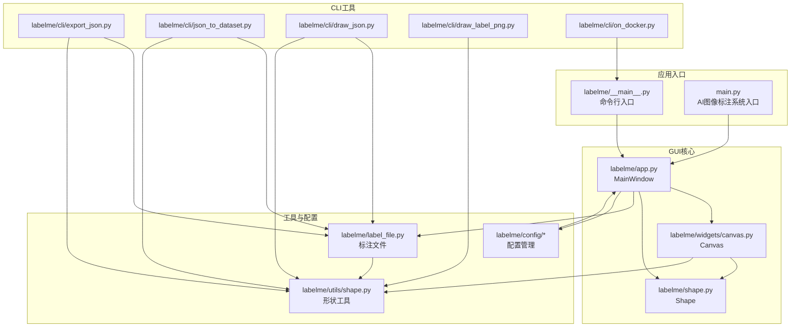
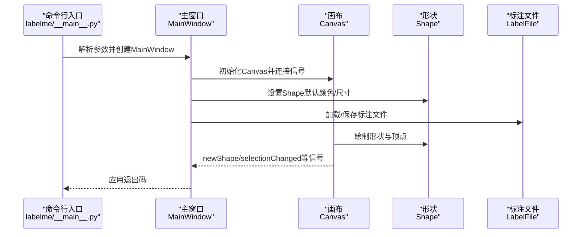
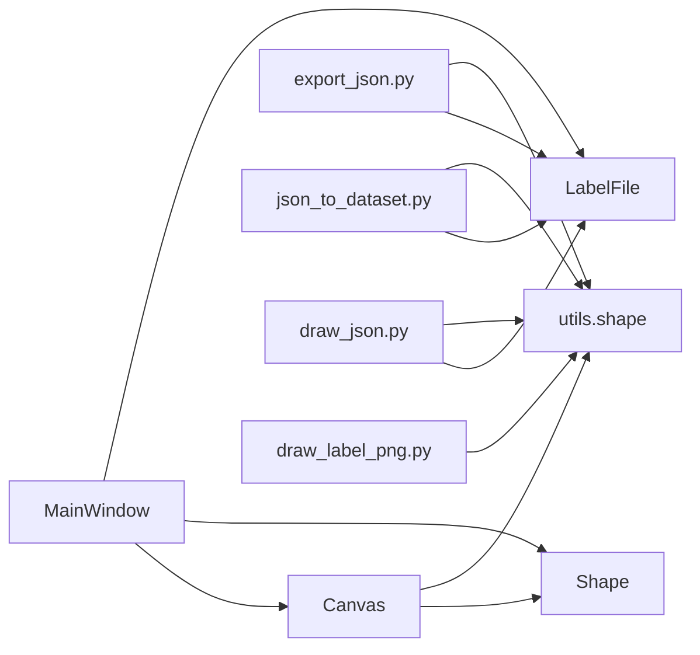
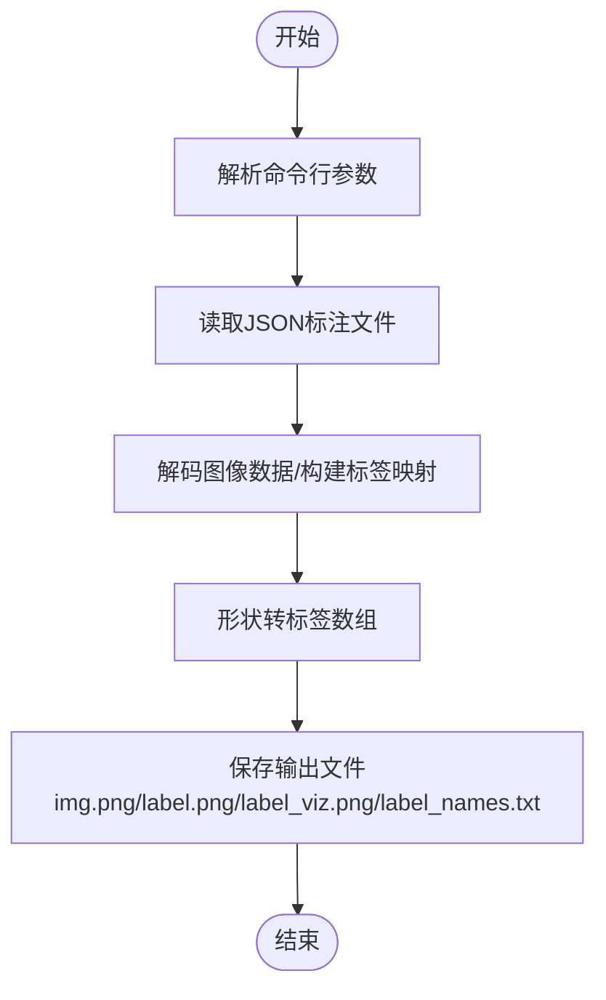

# API参考

<cite>
**本文档引用的文件**
- [labelme/__main__.py](file://labelme/__main__.py)
- [labelme/app.py](file://labelme/app.py)
- [labelme/widgets/canvas.py](file://labelme/widgets/canvas.py)
- [labelme/shape.py](file://labelme/shape.py)
- [labelme/utils/shape.py](file://labelme/utils/shape.py)
- [labelme/label_file.py](file://labelme/label_file.py)
- [labelme/config/default_config.yaml](file://labelme/config/default_config.yaml)
- [labelme/config/__init__.py](file://labelme/config/__init__.py)
- [labelme/cli/export_json.py](file://labelme/cli/export_json.py)
- [labelme/cli/json_to_dataset.py](file://labelme/cli/json_to_dataset.py)
- [labelme/cli/draw_json.py](file://labelme/cli/draw_json.py)
- [labelme/cli/draw_label_png.py](file://labelme/cli/draw_label_png.py)
- [labelme/cli/on_docker.py](file://labelme/cli/on_docker.py)
- [main.py](file://main.py)
</cite>

## 目录
1. [简介](#简介)
2. [项目结构](#项目结构)
3. [核心组件](#核心组件)
4. [架构总览](#架构总览)
5. [详细组件分析](#详细组件分析)
6. [依赖分析](#依赖分析)
7. [性能考虑](#性能考虑)
8. [故障排除指南](#故障排除指南)
9. [结论](#结论)
10. [附录](#附录)

## 简介
本参考文档面向开发者与高级用户，系统梳理Labelme的公共API与命令行接口，覆盖以下内容：
- 命令行工具的参数、输入输出格式与处理选项
- 核心类接口规范：LabelmeMainWindow、Canvas、Shape等
- 数据转换与导出流程（JSON到数据集、可视化）
- 错误码与异常处理机制
- 兼容性与配置说明
- 使用示例与最佳实践

## 项目结构
Labelme采用模块化组织，核心GUI由app.py中的MainWindow驱动，底层绘图与交互由widgets/canvas.py提供，形状模型由shape.py定义，工具函数集中在utils子模块，配置管理位于config包，CLI工具位于labelme/cli。

**图表来源**
- [labelme/__main__.py:137-359](file://labelme/__main__.py#L137-L359)
- [main.py:614-694](file://main.py#L614-L694)
- [labelme/app.py:99-120](file://labelme/app.py#L99-L120)
- [labelme/widgets/canvas.py:39-150](file://labelme/widgets/canvas.py#L39-L150)
- [labelme/shape.py:19-40](file://labelme/shape.py#L19-L40)
- [labelme/utils/shape.py:21-111](file://labelme/utils/shape.py#L21-L111)
- [labelme/label_file.py:42-70](file://labelme/label_file.py#L42-L70)
- [labelme/config/__init__.py:104-148](file://labelme/config/__init__.py#L104-L148)

**章节来源**
- [labelme/__main__.py:137-359](file://labelme/__main__.py#L137-L359)
- [main.py:614-694](file://main.py#L614-L694)
- [labelme/app.py:99-120](file://labelme/app.py#L99-L120)

## 核心组件
本节概述关键类与职责，便于快速定位API。

- LabelmeMainWindow（GUI主窗口）
  - 负责UI布局、动作管理、文件操作、标注工具、AI辅助、TCP通信、训练面板等
  - 关键属性与方法：actions、canvas、labelList、zoomWidget、training_*等
  - 详见 [labelme/app.py:99-800](file://labelme/app.py#L99-L800)

- Canvas（画布）
  - 核心绘图与交互组件，支持多边形、矩形、圆形、线段、点、线条带、AI多边形/掩码等
  - 关键属性：mode、shapes、current、epsilon、scale、pixmap等
  - 关键方法：mouseMoveEvent、mousePressEvent、storeShapes、restoreShape、initializeAiModel等
  - 详见 [labelme/widgets/canvas.py:39-800](file://labelme/widgets/canvas.py#L39-L800)

- Shape（形状）
  - 标注形状基类，支持polygon、rectangle、circle、line、point、linestrip、points、mask
  - 关键方法：addPoint、insertPoint、removePoint、moveBy、paint、containsPoint、makePath等
  - 详见 [labelme/shape.py:19-669](file://labelme/shape.py#L19-L669)

- LabelFile（标注文件）
  - JSON标注文件的加载/保存，处理图像数据编码与尺寸校验
  - 关键方法：load、save、is_label_file、load_image_file
  - 详见 [labelme/label_file.py:42-306](file://labelme/label_file.py#L42-L306)

- 配置系统
  - 默认配置、文件配置、命令行配置三层合并
  - 关键函数：get_default_config、get_config、validate_config_item
  - 详见 [labelme/config/__init__.py:42-148](file://labelme/config/__init__.py#L42-L148)，默认配置见 [labelme/config/default_config.yaml](file://labelme/config/default_config.yaml)

**章节来源**
- [labelme/app.py:99-800](file://labelme/app.py#L99-L800)
- [labelme/widgets/canvas.py:39-800](file://labelme/widgets/canvas.py#L39-L800)
- [labelme/shape.py:19-669](file://labelme/shape.py#L19-L669)
- [labelme/label_file.py:42-306](file://labelme/label_file.py#L42-L306)
- [labelme/config/__init__.py:42-148](file://labelme/config/__init__.py#L42-L148)
- [labelme/config/default_config.yaml:1-147](file://labelme/config/default_config.yaml#L1-L147)

## 架构总览
Labelme采用“主窗口驱动 + 画布交互 + 形状模型 + 文件/配置/工具”的分层架构。GUI事件通过MainWindow协调，Canvas负责绘制与交互，Shape抽象标注几何，LabelFile负责数据持久化，CLI工具提供批处理与可视化能力。

**图表来源**
- [labelme/__main__.py:294-300](file://labelme/__main__.py#L294-L300)
- [labelme/app.py:374-407](file://labelme/app.py#L374-L407)
- [labelme/widgets/canvas.py:39-150](file://labelme/widgets/canvas.py#L39-L150)
- [labelme/shape.py:19-40](file://labelme/shape.py#L19-L40)
- [labelme/label_file.py:103-193](file://labelme/label_file.py#L103-L193)

## 详细组件分析

### 命令行接口（CLI）
- 入口与参数
  - 入口脚本：labelme/__main__.py
  - 主要参数：
    - --version/-V：显示版本
    - --reset-config：重置Qt配置
    - --logger-level：日志级别（debug/info/warning/fatal/error）
    - filename：图像或标注文件路径（可选）
    - --output/-O：输出文件或目录（.json视为文件，否则视为目录）
    - --config：配置文件路径或YAML字符串（默认~/.labelmerc）
    - --nodata：不将图像数据存储至JSON
    - --autosave：自动保存
    - --nosortlabels：不排序标签
    - --flags/--labels/--labelflags：标签/标志配置（支持文件或逗号分隔）
    - --validatelabel：标签验证类型（当前支持exact）
    - --keep-prev：保留上一帧标注
    - --epsilon：画布顶点吸附容差
  - 参考：[labelme/__main__.py:137-223](file://labelme/__main__.py#L137-L223)

- Docker运行
  - on_docker.py：封装Docker环境下的labelme调用，支持X11转发与文件挂载
  - 参考：[labelme/cli/on_docker.py:36-103](file://labelme/cli/on_docker.py#L36-L103)

- 导出与可视化
  - export_json.py：将单个JSON导出为标准数据集格式（img/label/label_viz/label_names）
    - 参数：json_file、-o/--out
    - 参考：[labelme/cli/export_json.py:19-90](file://labelme/cli/export_json.py#L19-L90)
  - json_to_dataset.py：已弃用，演示单文件转换（弃用警告）
    - 参数：json_file、-o/--out
    - 参考：[labelme/cli/json_to_dataset.py:19-101](file://labelme/cli/json_to_dataset.py#L19-L101)
  - draw_json.py：可视化JSON标注（原始图像与标签叠加）
    - 参数：json_file
    - 参考：[labelme/cli/draw_json.py:16-68](file://labelme/cli/draw_json.py#L16-L68)
  - draw_label_png.py：可视化标签PNG（支持叠加原始图像）
    - 参数：label_png、--labels、--image
    - 参考：[labelme/cli/draw_label_png.py:14-108](file://labelme/cli/draw_label_png.py#L14-L108)

- 使用示例（路径引用）
  - 导出单个JSON为数据集：[labelme/cli/export_json.py:27-41](file://labelme/cli/export_json.py#L27-L41)
  - 可视化JSON标注：[labelme/cli/draw_json.py:23-29](file://labelme/cli/draw_json.py#L23-L29)
  - 可视化标签PNG：[labelme/cli/draw_label_png.py:22-34](file://labelme/cli/draw_label_png.py#L22-L34)

**章节来源**
- [labelme/__main__.py:137-223](file://labelme/__main__.py#L137-L223)
- [labelme/cli/on_docker.py:36-103](file://labelme/cli/on_docker.py#L36-L103)
- [labelme/cli/export_json.py:19-90](file://labelme/cli/export_json.py#L19-L90)
- [labelme/cli/json_to_dataset.py:19-101](file://labelme/cli/json_to_dataset.py#L19-L101)
- [labelme/cli/draw_json.py:16-68](file://labelme/cli/draw_json.py#L16-L68)
- [labelme/cli/draw_label_png.py:14-108](file://labelme/cli/draw_label_png.py#L14-L108)

### GUI主窗口（LabelmeMainWindow）
- 初始化与配置
  - 构造函数接收config、filename、output_file、output_dir等参数
  - 设置Shape默认颜色、点大小，初始化对话框、Dock窗口、画布、缩放组件等
  - 参考：[labelme/app.py:117-200](file://labelme/app.py#L117-L200)

- 动作与工具
  - 创建大量QAction，覆盖文件、编辑、显示、缩放、AI标注等
  - 示例动作：openFile、saveFile、createMode系列、editMode、delete、undo/redo等
  - 参考：[labelme/app.py:471-800](file://labelme/app.py#L471-L800)

- 画布与信号
  - Canvas信号连接：newShape、shapeMoved、selectionChanged、drawingPolygon等
  - 参考：[labelme/app.py:380-407](file://labelme/app.py#L380-L407)

- 文件操作
  - openFile、saveFile、saveFileAs、changeOutputDirDialog、deleteFile、closeFile等
  - 参考：[labelme/app.py:512-571](file://labelme/app.py#L512-L571)

**章节来源**
- [labelme/app.py:117-200](file://labelme/app.py#L117-L200)
- [labelme/app.py:471-800](file://labelme/app.py#L471-L800)
- [labelme/app.py:380-407](file://labelme/app.py#L380-L407)

### 画布（Canvas）
- 核心属性
  - mode（CREATE/EDIT）、shapes、current、epsilon、scale、pixmap、visible等
  - 参考：[labelme/widgets/canvas.py:71-150](file://labelme/widgets/canvas.py#L71-L150)

- 形态与AI
  - createMode支持polygon、rectangle、circle、line、point、linestrip、ai_polygon、ai_mask
  - initializeAiModel(model_name)、_compute_and_cache_image_embedding()
  - 参考：[labelme/widgets/canvas.py:162-228](file://labelme/widgets/canvas.py#L162-L228)

- 撤销/重做
  - storeShapes、restoreShape、redoShape、isShapeRestorable、isShapeRedoable
  - 参考：[labelme/widgets/canvas.py:229-327](file://labelme/widgets/canvas.py#L229-L327)

- 交互事件
  - mouseMoveEvent、mousePressEvent、mouseReleaseEvent、mouseDoubleClickEvent
  - 参考：[labelme/widgets/canvas.py:372-700](file://labelme/widgets/canvas.py#L372-L700)

- 几何与编辑
  - selectShapePoint、boundedMoveShapes、deleteSelected、addPointToEdge、removeSelectedPoint
  - 参考：[labelme/widgets/canvas.py:701-800](file://labelme/widgets/canvas.py#L701-L800)

**章节来源**
- [labelme/widgets/canvas.py:71-150](file://labelme/widgets/canvas.py#L71-L150)
- [labelme/widgets/canvas.py:162-228](file://labelme/widgets/canvas.py#L162-L228)
- [labelme/widgets/canvas.py:229-327](file://labelme/widgets/canvas.py#L229-L327)
- [labelme/widgets/canvas.py:372-700](file://labelme/widgets/canvas.py#L372-L700)
- [labelme/widgets/canvas.py:701-800](file://labelme/widgets/canvas.py#L701-L800)

### 形状（Shape）
- 形状类型
  - polygon、rectangle、circle、line、point、linestrip、points、mask
  - 参考：[labelme/shape.py:173-201](file://labelme/shape.py#L173-L201)

- 几何与编辑
  - addPoint、insertPoint、removePoint、popPoint、moveBy、moveVertexBy
  - 参考：[labelme/shape.py:210-304](file://labelme/shape.py#L210-L304)

- 选择与高亮
  - nearestVertex、nearestEdge、highlightVertex、highlightClear
  - 参考：[labelme/shape.py:470-627](file://labelme/shape.py#L470-L627)

- 绘制与路径
  - paint、makePath、boundingRect、containsPoint
  - 参考：[labelme/shape.py:322-583](file://labelme/shape.py#L322-L583)

- 复制与状态
  - copy、__len__、__getitem__、__setitem__
  - 参考：[labelme/shape.py:628-669](file://labelme/shape.py#L628-L669)

**章节来源**
- [labelme/shape.py:173-201](file://labelme/shape.py#L173-L201)
- [labelme/shape.py:210-304](file://labelme/shape.py#L210-L304)
- [labelme/shape.py:470-627](file://labelme/shape.py#L470-L627)
- [labelme/shape.py:322-583](file://labelme/shape.py#L322-L583)
- [labelme/shape.py:628-669](file://labelme/shape.py#L628-L669)

### 标注文件（LabelFile）
- 加载与保存
  - load(filename)：解析JSON，解码图像数据，校验尺寸
  - save(filename, shapes, imagePath, imageHeight, imageWidth, imageData, otherData, flags)
  - 参考：[labelme/label_file.py:103-291](file://labelme/label_file.py#L103-L291)

- 工具方法
  - load_image_file：读取并处理EXIF方向
  - is_label_file：判断文件扩展名
  - 参考：[labelme/label_file.py:72-102](file://labelme/label_file.py#L72-L102)，[labelme/label_file.py:292-306](file://labelme/label_file.py#L292-L306)

- 异常
  - LabelFileError：文件读写与解析异常
  - 参考：[labelme/label_file.py:33-40](file://labelme/label_file.py#L33-L40)

**章节来源**
- [labelme/label_file.py:103-291](file://labelme/label_file.py#L103-L291)
- [labelme/label_file.py:72-102](file://labelme/label_file.py#L72-L102)
- [labelme/label_file.py:33-40](file://labelme/label_file.py#L33-L40)

### 配置系统（Config）
- 配置来源与合并
  - 默认配置（default_config.yaml）→ 文件/YAML配置 → 命令行参数
  - 参考：[labelme/config/__init__.py:104-148](file://labelme/config/__init__.py#L104-L148)

- 默认配置要点
  - auto_save、store_data、keep_prev、epsilon、shape颜色、AI默认模型、Dock显示、快捷键等
  - 参考：[labelme/config/default_config.yaml:1-147](file://labelme/config/default_config.yaml#L1-L147)

- 验证规则
  - validate_config_item：校验validate_label、shape_color、labels去重等
  - 参考：[labelme/config/__init__.py:77-102](file://labelme/config/__init__.py#L77-L102)

**章节来源**
- [labelme/config/__init__.py:104-148](file://labelme/config/__init__.py#L104-L148)
- [labelme/config/default_config.yaml:1-147](file://labelme/config/default_config.yaml#L1-L147)
- [labelme/config/__init__.py:77-102](file://labelme/config/__init__.py#L77-L102)

## 依赖分析
- 组件耦合
  - MainWindow强依赖Canvas与Shape，Canvas依赖Shape与utils工具
  - LabelFile独立于GUI，仅通过utils进行图像数据转换
  - CLI工具依赖LabelFile与utils，独立于GUI

**图表来源**
- [labelme/app.py:374-407](file://labelme/app.py#L374-L407)
- [labelme/widgets/canvas.py:39-150](file://labelme/widgets/canvas.py#L39-L150)
- [labelme/utils/shape.py:21-111](file://labelme/utils/shape.py#L21-L111)
- [labelme/label_file.py:103-193](file://labelme/label_file.py#L103-L193)
- [labelme/cli/export_json.py:46-75](file://labelme/cli/export_json.py#L46-L75)
- [labelme/cli/json_to_dataset.py:57-96](file://labelme/cli/json_to_dataset.py#L57-L96)
- [labelme/cli/draw_json.py:27-47](file://labelme/cli/draw_json.py#L27-L47)

**章节来源**
- [labelme/app.py:374-407](file://labelme/app.py#L374-L407)
- [labelme/widgets/canvas.py:39-150](file://labelme/widgets/canvas.py#L39-L150)
- [labelme/utils/shape.py:21-111](file://labelme/utils/shape.py#L21-L111)
- [labelme/label_file.py:103-193](file://labelme/label_file.py#L103-L193)
- [labelme/cli/export_json.py:46-75](file://labelme/cli/export_json.py#L46-L75)
- [labelme/cli/json_to_dataset.py:57-96](file://labelme/cli/json_to_dataset.py#L57-L96)
- [labelme/cli/draw_json.py:27-47](file://labelme/cli/draw_json.py#L27-L47)

## 性能考虑
- 撤销/重做栈管理
  - Canvas通过shapesBackups/redoBackups限制备份数量，避免内存膨胀
  - 参考：[labelme/widgets/canvas.py:236-244](file://labelme/widgets/canvas.py#L236-L244)

- AI模型嵌入缓存
  - Canvas对同一图像的SAM嵌入进行缓存，避免重复计算
  - 参考：[labelme/widgets/canvas.py:181-205](file://labelme/widgets/canvas.py#L181-L205)

- 图像数据处理
  - LabelFile与utils在图像读取/转换时尽量避免重复解码与格式转换
  - 参考：[labelme/label_file.py:142-148](file://labelme/label_file.py#L142-L148)

- 绘制优化
  - Shape.paint按需绘制路径与顶点，掩码类型使用contour提取边界
  - 参考：[labelme/shape.py:322-442](file://labelme/shape.py#L322-L442)

[本节为通用指导，无需具体文件引用]

## 故障排除指南
- 常见异常与处理
  - LabelFileError：文件加载/保存失败时抛出，建议检查JSON格式与权限
    - 参考：[labelme/label_file.py:177-179](file://labelme/label_file.py#L177-L179)
  - 配置校验错误：validate_label、shape_color、labels重复等
    - 参考：[labelme/config/__init__.py:90-101](file://labelme/config/__init__.py#L90-L101)

- GUI异常捕获
  - 主入口安装sys.excepthook，捕获未处理异常并弹窗提示
  - 参考：[labelme/__main__.py:306-331](file://labelme/__main__.py#L306-L331)

- 单实例冲突
  - 若已有实例运行，显示警告并返回错误码
  - 参考：[labelme/__main__.py:284-289](file://labelme/__main__.py#L284-L289)，[main.py:640-653](file://main.py#L640-L653)

**章节来源**
- [labelme/label_file.py:177-179](file://labelme/label_file.py#L177-L179)
- [labelme/config/__init__.py:90-101](file://labelme/config/__init__.py#L90-L101)
- [labelme/__main__.py:306-331](file://labelme/__main__.py#L306-L331)
- [labelme/__main__.py:284-289](file://labelme/__main__.py#L284-L289)
- [main.py:640-653](file://main.py#L640-L653)

## 结论
本文档系统化梳理了Labelme的命令行接口与核心API，明确了GUI主窗口、画布、形状、标注文件与配置系统的职责与交互关系。CLI工具提供了丰富的数据转换与可视化能力。遵循本文档的参数与接口规范，可高效完成标注、导出与批处理任务。

[本节为总结，无需具体文件引用]

## 附录

### 命令行工具参数速查
- labelme（GUI）
  - --version/-V、--reset-config、--logger-level、filename、--output/-O、--config、--nodata、--autosave、--nosortlabels、--flags、--labelflags、--labels、--validatelabel、--keep-prev、--epsilon
  - 参考：[labelme/__main__.py:137-223](file://labelme/__main__.py#L137-L223)

- export_json.py
  - json_file、-o/--out
  - 参考：[labelme/cli/export_json.py:27-41](file://labelme/cli/export_json.py#L27-L41)

- json_to_dataset.py（弃用）
  - json_file、-o/--out
  - 参考：[labelme/cli/json_to_dataset.py:38-51](file://labelme/cli/json_to_dataset.py#L38-L51)

- draw_json.py
  - json_file
  - 参考：[labelme/cli/draw_json.py:23-25](file://labelme/cli/draw_json.py#L23-L25)

- draw_label_png.py
  - label_png、--labels、--image
  - 参考：[labelme/cli/draw_label_png.py:22-32](file://labelme/cli/draw_label_png.py#L22-L32)

- on_docker.py
  - in_file、-O/--output
  - 参考：[labelme/cli/on_docker.py:82-87](file://labelme/cli/on_docker.py#L82-L87)

### 数据转换流程（CLI）

**图表来源**
- [labelme/cli/export_json.py:46-85](file://labelme/cli/export_json.py#L46-L85)
- [labelme/utils/shape.py:113-167](file://labelme/utils/shape.py#L113-L167)