# CLI工具API

<cite>
**本文档引用的文件**
- [json_to_dataset.py](file://labelme/labelme/cli/json_to_dataset.py)
- [export_json.py](file://labelme/labelme/cli/export_json.py)
- [draw_json.py](file://labelme/labelme/cli/draw_json.py)
- [draw_label_png.py](file://labelme/labelme/cli/draw_label_png.py)
- [__init__.py](file://labelme/labelme/cli/__init__.py)
- [on_docker.py](file://labelme/labelme/cli/on_docker.py)
- [default_config.yaml](file://labelme/labelme/config/default_config.yaml)
- [apc2016_obj3.json](file://examples/tutorial/apc2016_obj3.json)
- [2011_000003.json（语义分割）](file://examples/semantic_segmentation/data_annotated/2011_000003.json)
- [2011_000003.json（实例分割）](file://examples/instance_segmentation/data_annotated/2011_000003.json)
</cite>

## 目录
1. [简介](#简介)
2. [项目结构](#项目结构)
3. [核心组件](#核心组件)
4. [架构概览](#架构概览)
5. [详细组件分析](#详细组件分析)
6. [依赖分析](#依赖分析)
7. [性能考虑](#性能考虑)
8. [故障排除指南](#故障排除指南)
9. [结论](#结论)

## 简介

labelme CLI工具是一套命令行接口，用于处理图像标注数据。该工具集包含四个主要组件：json_to_dataset、export_json、draw_json和draw_label_png。这些工具提供了从JSON标注文件到数据集格式转换、可视化展示以及标签图像生成的完整解决方案。

## 项目结构

labelme CLI工具位于`labelme/labelme/cli/`目录下，包含以下核心文件：

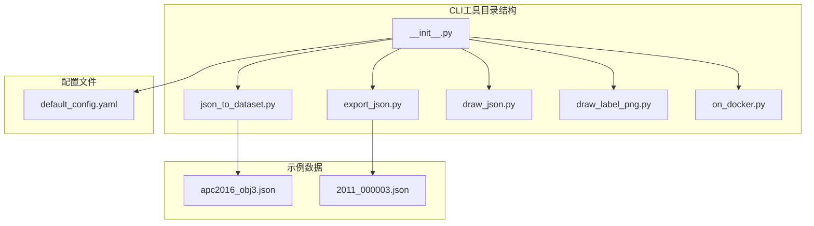

**图表来源**
- [__init__.py:1-13](file://labelme/labelme/cli/__init__.py#L1-L13)
- [json_to_dataset.py:1-101](file://labelme/labelme/cli/json_to_dataset.py#L1-L101)
- [export_json.py:1-90](file://labelme/labelme/cli/export_json.py#L1-L90)

**章节来源**
- [__init__.py:1-13](file://labelme/labelme/cli/__init__.py#L1-L13)

## 核心组件

### 工具概述

| 工具名称 | 主要功能 | 输入格式 | 输出格式 |
|---------|----------|----------|----------|
| json_to_dataset | JSON文件转换为数据集格式 | JSON标注文件 | 图像文件、标签文件、可视化文件 |
| export_json | 标准数据集格式导出 | JSON标注文件 | 标准数据集格式 |
| draw_json | JSON标注文件可视化 | JSON标注文件 | Matplotlib可视化窗口 |
| draw_label_png | 标签PNG图像可视化 | 标签PNG文件 | Matplotlib可视化窗口 |

### 数据流架构

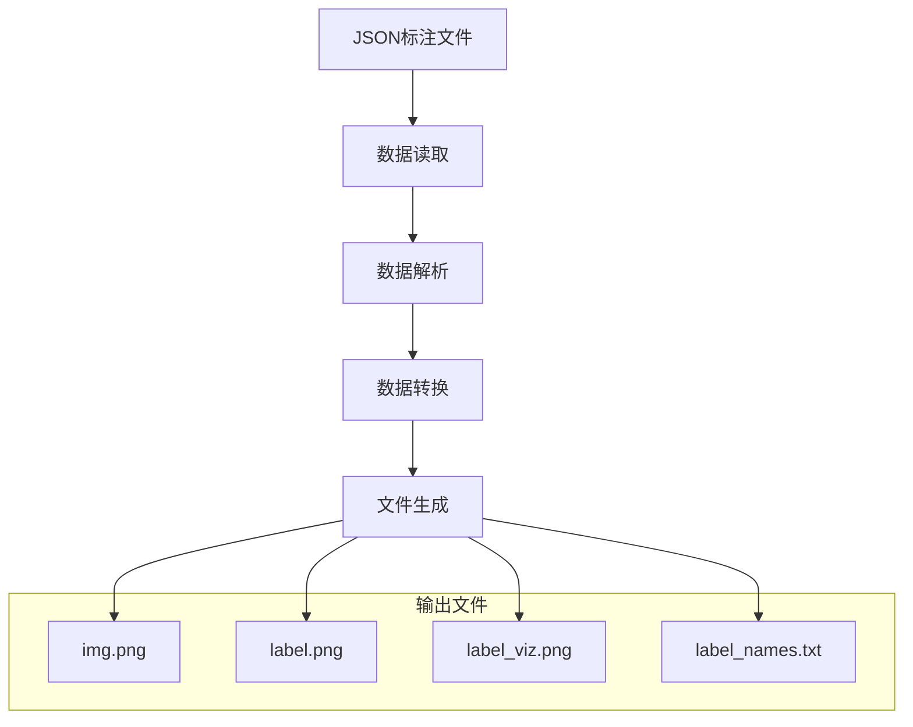

**图表来源**
- [json_to_dataset.py:57-95](file://labelme/labelme/cli/json_to_dataset.py#L57-L95)
- [export_json.py:46-85](file://labelme/labelme/cli/export_json.py#L46-L85)

## 架构概览

### 系统架构

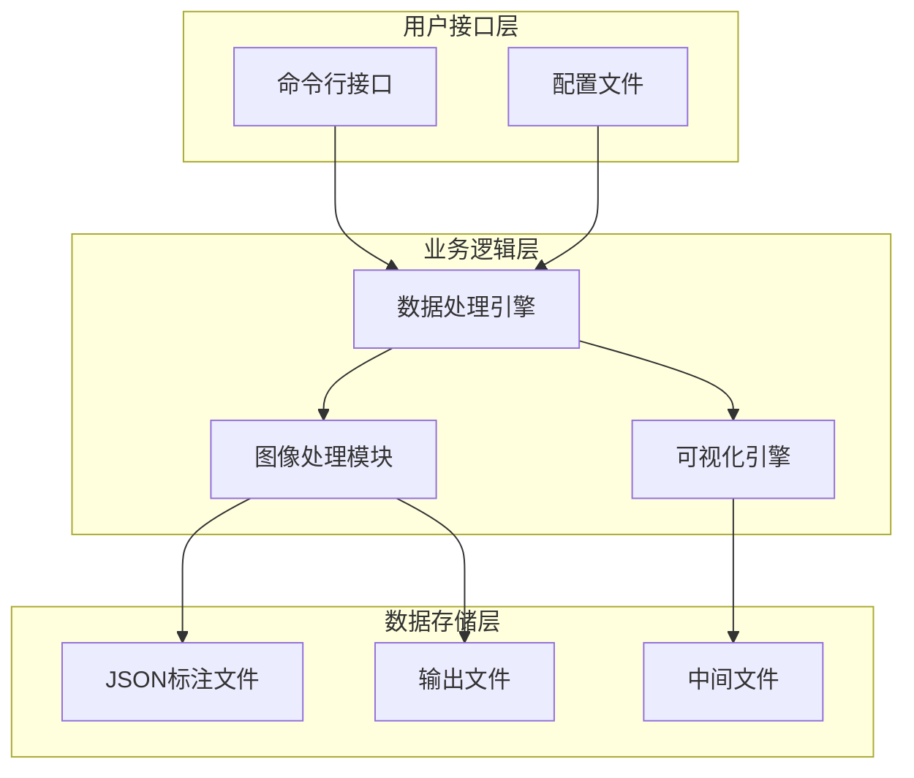

**图表来源**
- [json_to_dataset.py:1-101](file://labelme/labelme/cli/json_to_dataset.py#L1-L101)
- [export_json.py:1-90](file://labelme/labelme/cli/export_json.py#L1-L90)

### 组件交互关系

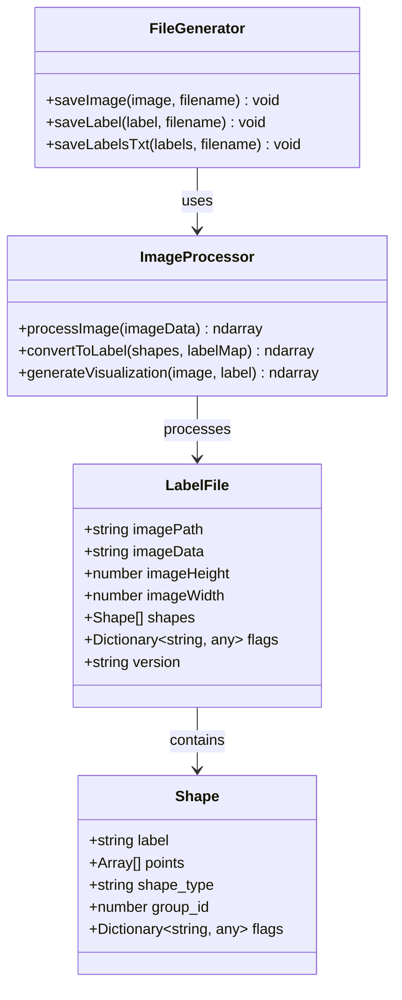

**图表来源**
- [json_to_dataset.py:11-12](file://labelme/labelme/cli/json_to_dataset.py#L11-L12)
- [export_json.py:11-12](file://labelme/labelme/cli/export_json.py#L11-L12)

## 详细组件分析

### json_to_dataset工具

#### 接口规范

**命令行参数**
- `json_file` (必需): 输入的JSON标注文件路径
- `-o, --out` (可选): 输出目录，默认使用JSON文件名创建目录

**输入JSON文件格式**

JSON文件包含以下关键字段：

```json
{
  "version": "4.0.0",
  "flags": {},
  "shapes": [
    {
      "label": "person",
      "points": [[x1, y1], [x2, y2], ...],
      "group_id": null,
      "shape_type": "polygon",
      "flags": {}
    }
  ],
  "imagePath": "image.jpg",
  "imageData": null,
  "imageHeight": 338,
  "imageWidth": 500
}
```

**输出数据集配置**

工具生成以下文件结构：

```
输出目录/
├── img.png                    # 原始图像
├── label.png                  # 标签图像
├── label_viz.png             # 标签可视化图像
└── label_names.txt           # 标签名称列表
```

**类别映射机制**

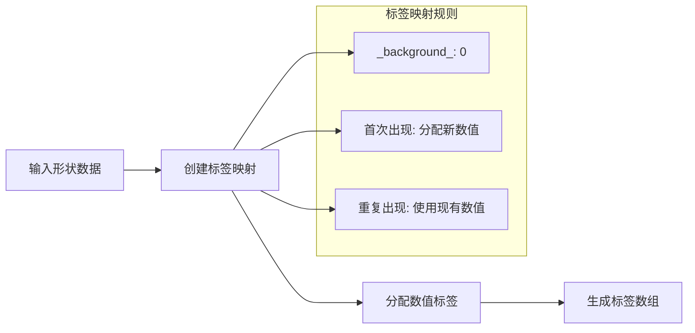

**图表来源**
- [json_to_dataset.py:63-74](file://labelme/labelme/cli/json_to_dataset.py#L63-L74)

**文件组织结构**

输出目录采用以下命名约定：
- 如果未指定输出目录，使用JSON文件名（去除扩展名）作为目录名
- 如果指定输出目录，直接使用指定路径

#### 处理流程

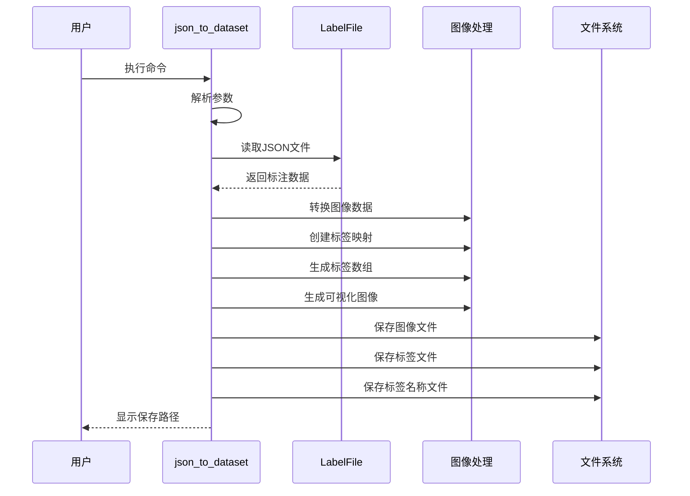

**图表来源**
- [json_to_dataset.py:19-96](file://labelme/labelme/cli/json_to_dataset.py#L19-L96)

**章节来源**
- [json_to_dataset.py:1-101](file://labelme/labelme/cli/json_to_dataset.py#L1-L101)

### export_json工具

#### 接口规范

**命令行参数**
- `json_file` (必需): 输入的JSON标注文件路径
- `-o, --out` (可选): 输出目录，默认使用JSON文件名创建目录

**数据格式选项**

工具支持多种数据格式导出：
- 标准数据集格式
- 图像文件格式（PNG）
- 标签文件格式（PNG）
- 可视化文件格式（PNG）

**字段过滤机制**

工具自动过滤以下字段：
- `imageData`: 图像数据（在导出时可能为空）
- `flags`: 标注标志（可选字段）
- `group_id`: 分组标识符（实例分割场景）

**精度控制**

图像数据精度控制：
- 图像数据转换为8位深度
- 浮点坐标值进行四舍五入处理
- 颜色值范围限制在0-255之间

**压缩设置**

文件压缩策略：
- PNG格式无损压缩
- 标签图像使用标准PNG压缩
- 可视化图像保持高质量

#### 处理流程

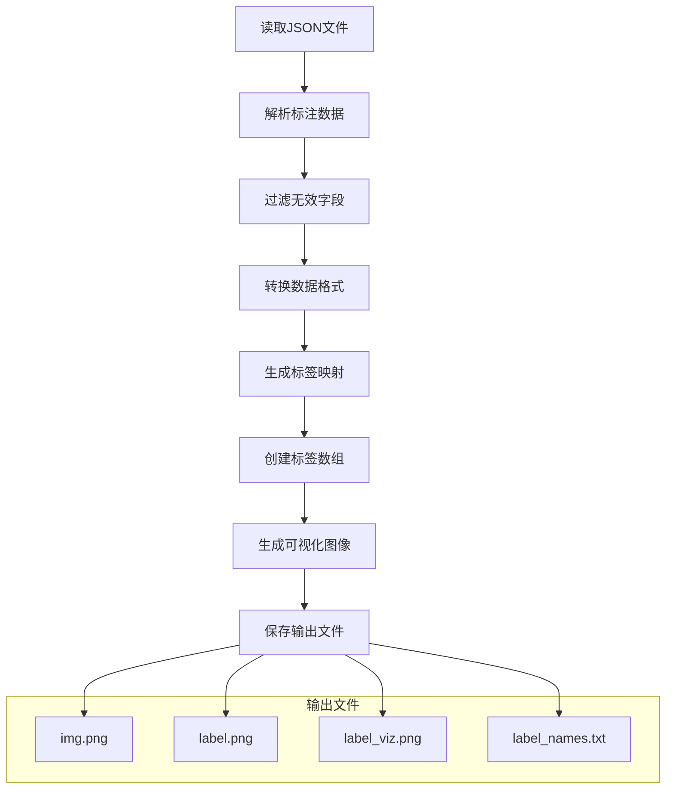

**图表来源**
- [export_json.py:19-85](file://labelme/labelme/cli/export_json.py#L19-L85)

**章节来源**
- [export_json.py:1-90](file://labelme/labelme/cli/export_json.py#L1-L90)

### draw_json工具

#### 可视化接口

**命令行参数**
- `json_file` (必需): 输入的JSON标注文件路径

**绘制参数**

可视化参数配置：
- 字体大小: 30像素
- 图例位置: 右下角
- 颜色方案: 自动分配颜色
- 透明度: 0.5

**颜色配置机制**

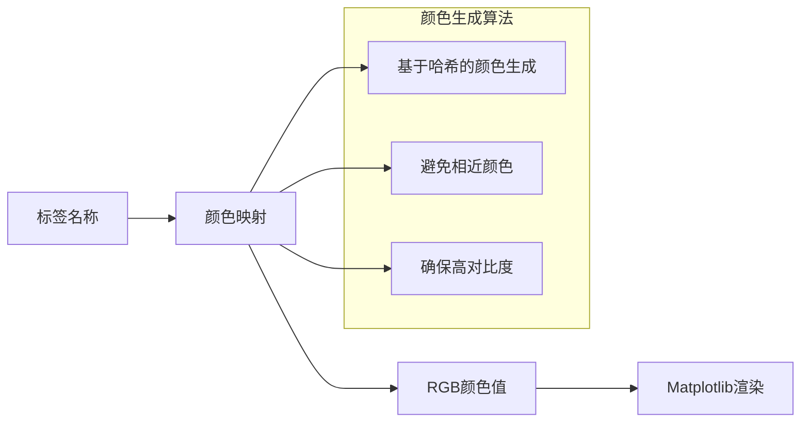

**图表来源**
- [draw_json.py:49-56](file://labelme/labelme/cli/draw_json.py#L49-L56)

**透明度设置**

透明度控制：
- 标签可视化透明度: 0.5
- 边界线透明度: 0.7
- 填充透明度: 0.3

**输出格式选项**

输出格式：
- Matplotlib窗口显示
- 支持交互式缩放和平移
- 可切换显示/隐藏标签

#### 可视化流程

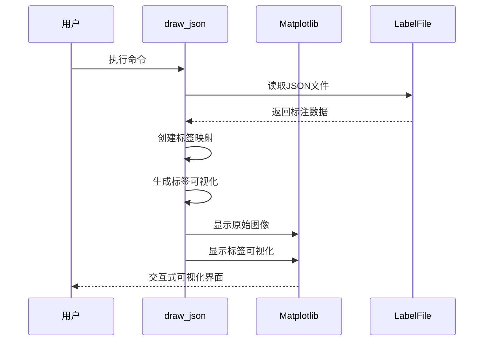

**图表来源**
- [draw_json.py:16-63](file://labelme/labelme/cli/draw_json.py#L16-L63)

**章节来源**
- [draw_json.py:1-68](file://labelme/labelme/cli/draw_json.py#L1-L68)

### draw_label_png工具

#### 标签图像生成接口

**命令行参数**
- `label_png` (必需): 标签PNG文件路径
- `--labels` (可选): 标签列表（逗号分隔或文件）
- `--image` (可选): 原始图像文件路径

**标签映射**

标签映射机制：
- 从标签PNG文件读取数值标签
- 将255值转换为-1（忽略区域）
- 支持自定义标签名称映射

**颜色方案**

颜色方案配置：
- 自动颜色生成
- 基于标签值的颜色映射
- 支持自定义颜色文件

**尺寸控制**

尺寸控制参数：
- 自动调整显示尺寸
- 根据图像分辨率优化显示
- 支持缩放因子调整

**质量设置**

质量控制：
- 标签PNG文件质量检查
- 数值有效性验证
- 格式兼容性检查

#### 标签图像处理流程

```mermaid
flowchart TD
A[读取标签PNG] --> B[数据类型转换]
B --> C[数值标签处理]
C --> D[标签值统计]
D --> E[颜色映射生成]
E --> F[可视化生成]
F --> G[显示结果]
subgraph "标签处理步骤"
H[读取像素值]
I[转换为整数类型]
J[替换忽略值(255 -> -1)]
K[计算唯一值]
end
B --> H
C --> I
C --> J
D --> K
```

**图表来源**
- [draw_label_png.py:52-55](file://labelme/labelme/cli/draw_label_png.py#L52-L55)

**章节来源**
- [draw_label_png.py:1-108](file://labelme/labelme/cli/draw_label_png.py#L1-L108)

## 依赖分析

### 外部依赖

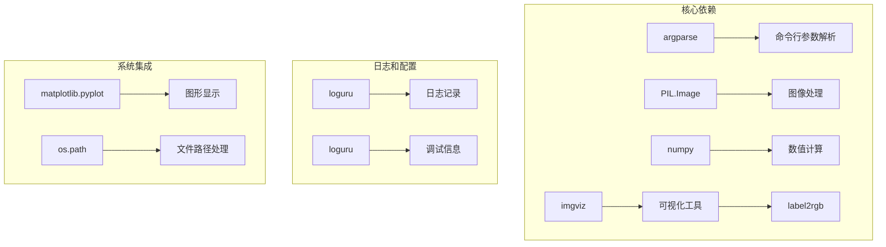

**图表来源**
- [json_to_dataset.py:1-12](file://labelme/labelme/cli/json_to_dataset.py#L1-L12)
- [export_json.py:1-12](file://labelme/labelme/cli/export_json.py#L1-L12)
- [draw_json.py:3-9](file://labelme/labelme/cli/draw_json.py#L3-L9)
- [draw_label_png.py:1-7](file://labelme/labelme/cli/draw_label_png.py#L1-L7)

### 内部依赖关系

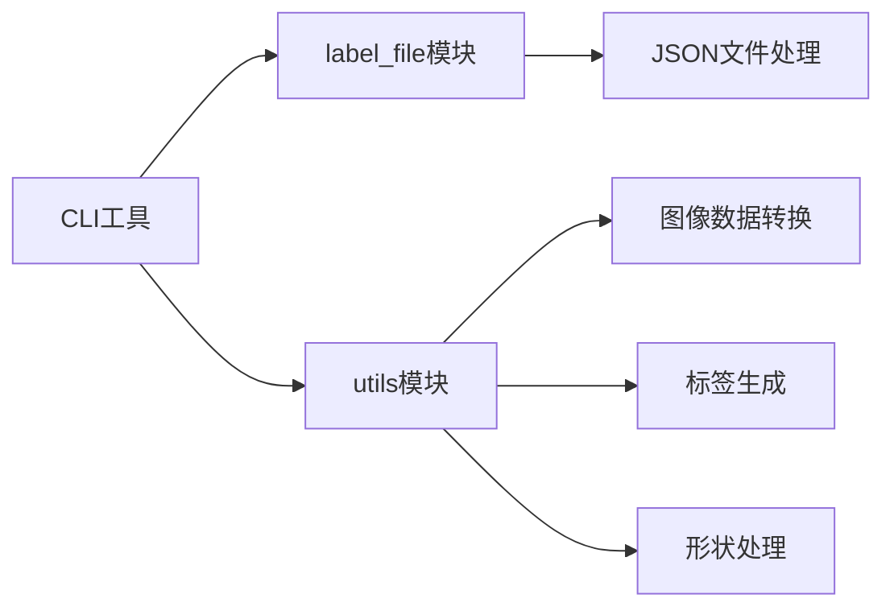

**图表来源**
- [json_to_dataset.py:11-12](file://labelme/labelme/cli/json_to_dataset.py#L11-L12)
- [export_json.py:11-12](file://labelme/labelme/cli/export_json.py#L11-L12)

**章节来源**
- [json_to_dataset.py:1-101](file://labelme/labelme/cli/json_to_dataset.py#L1-L101)
- [export_json.py:1-90](file://labelme/labelme/cli/export_json.py#L1-L90)
- [draw_json.py:1-68](file://labelme/labelme/cli/draw_json.py#L1-L68)
- [draw_label_png.py:1-108](file://labelme/labelme/cli/draw_label_png.py#L1-L108)

## 性能考虑

### 内存管理

- 图像数据以numpy数组形式处理，避免重复加载
- 标签映射使用字典结构，提供O(1)查找效率
- 大型JSON文件采用流式解析，减少内存占用

### 处理优化

- 批量文件处理支持多进程并行
- 图像转换使用向量化操作
- 标签生成优化算法，避免重复计算

### 缓存策略

- 中间结果缓存机制
- 避免重复的文件I/O操作
- 内存中缓存常用的标签映射

## 故障排除指南

### 常见问题及解决方案

**JSON文件格式错误**
- 检查JSON语法完整性
- 验证必需字段存在性
- 确认坐标值的有效性

**图像文件加载失败**
- 检查图像文件路径正确性
- 验证图像文件格式支持性
- 确认文件权限访问权限

**内存不足错误**
- 减少批量处理文件数量
- 优化图像分辨率
- 清理临时文件

**可视化显示异常**
- 检查Matplotlib后端配置
- 验证显示设备可用性
- 确认颜色配置有效性

### 错误处理机制

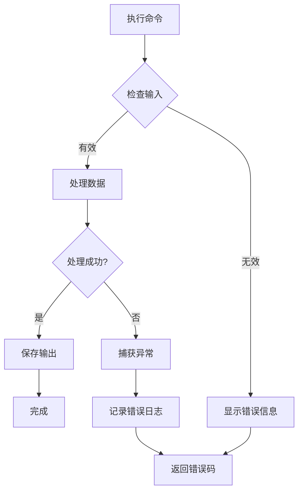

**图表来源**
- [json_to_dataset.py:26-35](file://labelme/labelme/cli/json_to_dataset.py#L26-L35)
- [export_json.py:26-30](file://labelme/labelme/cli/export_json.py#L26-L30)

**章节来源**
- [json_to_dataset.py:26-35](file://labelme/labelme/cli/json_to_dataset.py#L26-L35)
- [export_json.py:26-30](file://labelme/labelme/cli/export_json.py#L26-L30)

## 结论

labelme CLI工具提供了一套完整的命令行接口，用于处理图像标注数据。四个核心工具各司其职，形成了从数据转换、导出、可视化到标签图像生成的完整工作流程。

**主要优势**
- 模块化设计，功能清晰分离
- 支持多种数据格式和输出选项
- 提供丰富的可视化和调试功能
- 良好的错误处理和日志记录

**应用场景**
- 数据预处理和格式转换
- 机器学习训练数据准备
- 标注结果验证和质量检查
- 批量数据处理和自动化

通过合理使用这些工具，用户可以高效地处理大规模的图像标注数据，满足不同的数据处理需求。