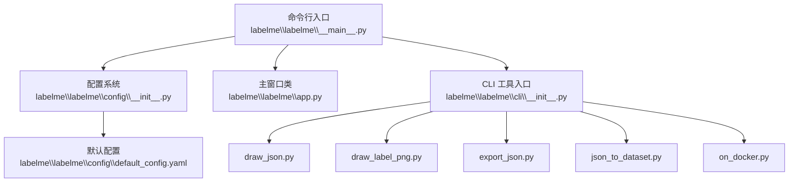
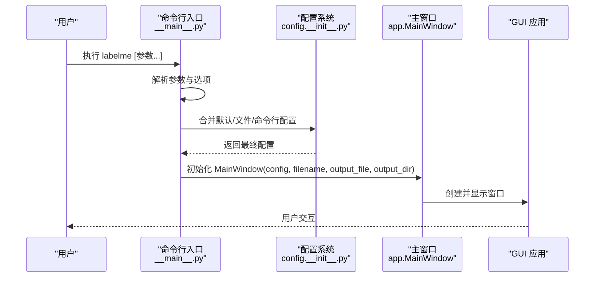
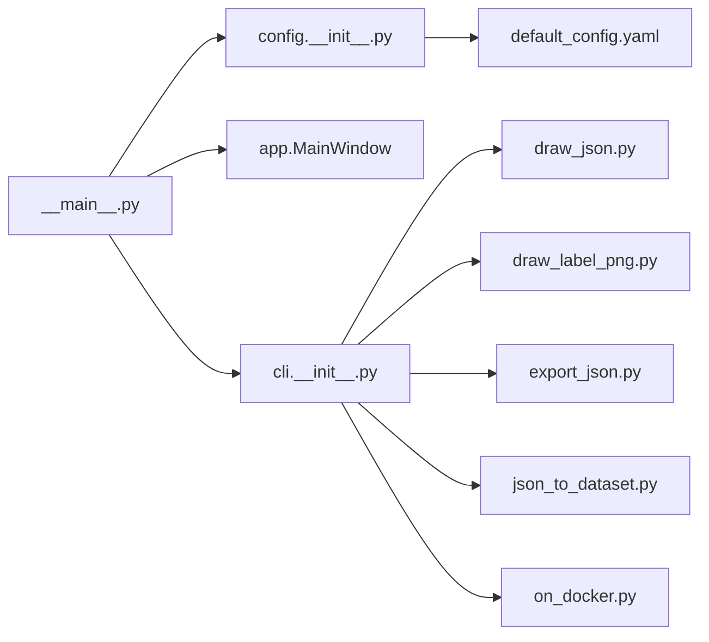

# 命令行接口

<cite>
**本文档引用的文件**
- [labelme\__main__.py](file://labelme\labelme\__main__.py)
- [labelme\config\default_config.yaml](file://labelme\labelme\config\default_config.yaml)
- [labelme\config\__init__.py](file://labelme\labelme\config\__init__.py)
- [labelme\app.py](file://labelme\labelme\app.py)
- [labelme\cli\__init__.py](file://labelme\labelme\cli\__init__.py)
- [labelme\cli\draw_json.py](file://labelme\labelme\cli\draw_json.py)
- [labelme\cli\draw_label_png.py](file://labelme\labelme\cli\draw_label_png.py)
- [labelme\cli\export_json.py](file://labelme\labelme\cli\export_json.py)
- [labelme\cli\json_to_dataset.py](file://labelme\labelme\cli\json_to_dataset.py)
- [labelme\cli\on_docker.py](file://labelme\labelme\cli\on_docker.py)
- [README.md](file://README.md)
</cite>

## 目录
1. [简介](#简介)
2. [项目结构](#项目结构)
3. [核心组件](#核心组件)
4. [架构总览](#架构总览)
5. [详细组件分析](#详细组件分析)
6. [依赖分析](#依赖分析)
7. [性能考虑](#性能考虑)
8. [故障排查指南](#故障排查指南)
9. [结论](#结论)
10. [附录](#附录)

## 简介
本文件为 labelme 命令行接口的完整 API 文档，覆盖以下方面：
- 基础参数：版本信息、配置重置、日志级别设置等
- 图像文件处理参数：输入文件/目录、输出文件或目录、自动保存等
- 标签配置参数：标签列表、标志设置、标签验证规则等
- GUI 配置参数：数据存储控制、标签排序、标签标志等
- 每个参数的类型、默认值、取值范围与使用示例
- 常见使用场景的命令行示例与最佳实践

## 项目结构
labelme 的命令行入口位于 `labelme\labelme\__main__.py`，负责解析参数、加载配置、初始化 GUI 并启动主窗口。配置系统由 `labelme\labelme\config\__init__.py` 和 `labelme\labelme\config\default_config.yaml` 提供默认配置与校验。CLI 工具模块位于 `labelme\labelme\cli\`，包含 JSON/标签 PNG 可视化、数据集导出、Docker 支持等工具。

**图表来源**
- [labelme\__main__.py:137-341](file://labelme\labelme\__main__.py#L137-L341)
- [labelme\config\__init__.py:104-148](file://labelme\labelme\config\__init__.py#L104-L148)
- [labelme\config\default_config.yaml:1-147](file://labelme\labelme\config\default_config.yaml#L1-L147)
- [labelme\app.py:99-200](file://labelme\labelme\app.py#L99-L200)
- [labelme\cli\__init__.py:1-13](file://labelme\labelme\cli\__init__.py#L1-L13)

**章节来源**
- [labelme\__main__.py:137-341](file://labelme\labelme\__main__.py#L137-L341)
- [labelme\config\__init__.py:104-148](file://labelme\labelme\config\__init__.py#L104-L148)
- [labelme\config\default_config.yaml:1-147](file://labelme\labelme\config\default_config.yaml#L1-L147)
- [labelme\cli\__init__.py:1-13](file://labelme\labelme\cli\__init__.py#L1-L13)

## 核心组件
- 命令行入口与参数解析：负责解析基础参数、标签配置、GUI 配置、输出路径等，并调用配置系统与主窗口类。
- 配置系统：提供默认配置、文件/命令行配置合并与校验。
- 主窗口类：根据配置初始化 GUI，处理文件加载/保存、标注工具等。
- CLI 工具：提供 JSON/标签 PNG 可视化、数据集导出、Docker 支持等独立工具。

**章节来源**
- [labelme\__main__.py:137-341](file://labelme\labelme\__main__.py#L137-L341)
- [labelme\config\__init__.py:104-148](file://labelme\labelme\config\__init__.py#L104-L148)
- [labelme\config\default_config.yaml:1-147](file://labelme\labelme\config\default_config.yaml#L1-L147)
- [labelme\app.py:99-200](file://labelme\labelme\app.py#L99-L200)

## 架构总览
命令行启动流程概览如下：

**图表来源**
- [labelme\__main__.py:137-341](file://labelme\labelme\__main__.py#L137-L341)
- [labelme\config\__init__.py:104-148](file://labelme\labelme\config\__init__.py#L104-L148)
- [labelme\app.py:117-136](file://labelme\labelme\app.py#L117-L136)

## 详细组件分析

### 基础参数
- 版本信息
  - 名称：--version, -V
  - 类型：布尔开关
  - 默认值：否
  - 作用：打印应用名称与版本后退出
  - 示例：`labelme --version`
- 配置重置
  - 名称：--reset-config
  - 类型：布尔开关
  - 默认值：否
  - 作用：清空 Qt 设置并退出
  - 示例：`labelme --reset-config`
- 日志级别
  - 名称：--logger-level
  - 类型：字符串
  - 取值：debug | info | warning | fatal | error
  - 默认值：debug
  - 作用：设置日志级别
  - 示例：`labelme --logger-level info`

**章节来源**
- [labelme\__main__.py:138-146](file://labelme\labelme\__main__.py#L138-L146)

### 图像文件处理参数
- 输入文件/目录
  - 名称：filename（位置参数）
  - 类型：字符串（文件或目录）
  - 默认值：无
  - 作用：指定要打开的图像或标注 JSON 文件，或包含图像的目录
  - 示例：`labelme image.jpg` 或 `labelme ./data/`
- 输出文件或目录
  - 名称：--output, -O, -o
  - 类型：字符串
  - 默认值：无
  - 作用：指定输出文件或目录；若以 .json 结尾则写入单个 JSON 文件；否则视为目录，按图像名生成对应 JSON 文件
  - 示例：`labelme image.jpg -O annotation.json` 或 `labelme images/ -O annotations/`
- 自动保存
  - 名称：--autosave
  - 类型：布尔开关
  - 默认值：由配置决定
  - 作用：启用自动保存功能
  - 示例：`labelme image.jpg --autosave`

**章节来源**
- [labelme\__main__.py:147-154](file://labelme\labelme\__main__.py#L147-L154)
- [labelme\__main__.py:172-178](file://labelme\labelme\__main__.py#L172-L178)
- [README.md:219-226](file://README.md#L219-L226)

### 标签配置参数
- 标签列表
  - 名称：--labels
  - 类型：字符串（逗号分隔）或文件路径
  - 默认值：无
  - 作用：指定可用标签列表；可从文件读取或直接传入逗号分隔的字符串
  - 示例：`labelme image.jpg --labels person,car,dog` 或 `labelme image.jpg --labels labels.txt`
- 标志设置
  - 名称：--flags
  - 类型：字符串（逗号分隔）或文件路径
  - 默认值：无
  - 作用：为整幅图像设置标志；可从文件读取或直接传入逗号分隔的字符串
  - 示例：`labelme image.jpg --flags sunny,raining`
- 标签特定标志
  - 名称：--labelflags
  - 类型：YAML 字符串或文件路径
  - 默认值：无
  - 作用：为特定标签设置标志（正则匹配），支持 YAML 格式
  - 示例：`labelme image.jpg --labelflags '{person-\\d+: [male, tall], .*: [occluded]}'`
- 标签验证规则
  - 名称：--validatelabel
  - 类型：字符串
  - 取值：exact
  - 默认值：无
  - 作用：启用标签验证；当前支持 exact 模式，需配合 --labels 使用
  - 示例：`labelme image.jpg --validatelabel exact --labels cat,dog`
- 保持上一帧标注
  - 名称：--keep-prev
  - 类型：布尔开关
  - 默认值：否
  - 作用：在视频/序列标注时保留上一帧的标注
  - 示例：`labelme video_frames/ --keep-prev`
- 顶点查找精度
  - 名称：--epsilon
  - 类型：浮点数
  - 默认值：由配置决定
  - 作用：画布上查找最近顶点的阈值
  - 示例：`labelme image.jpg --epsilon 5.0`

**章节来源**
- [labelme\__main__.py:186-222](file://labelme\labelme\__main__.py#L186-L222)
- [labelme\config\default_config.yaml:14-20](file://labelme\labelme\config\default_config.yaml#L14-L20)
- [labelme\config\__init__.py:77-102](file://labelme\labelme\config\__init__.py#L77-L102)

### GUI 配置参数
- 数据存储控制
  - 名称：--nodata
  - 类型：布尔开关
  - 默认值：由配置决定
  - 作用：禁用将图像数据存储到 JSON 文件中，仅保存相对路径
  - 示例：`labelme image.jpg --nodata`
- 标签排序
  - 名称：--nosortlabels
  - 类型：布尔开关
  - 默认值：由配置决定
  - 作用：禁用标签自动排序，按提供的顺序显示标签
  - 示例：`labelme image.jpg --nosortlabels`
- 自动保存（同“图像文件处理参数”）
  - 名称：--autosave
  - 类型：布尔开关
  - 默认值：由配置决定
  - 作用：启用自动保存
  - 示例：`labelme image.jpg --autosave`

**章节来源**
- [labelme\__main__.py:164-185](file://labelme\labelme\__main__.py#L164-L185)
- [labelme\config\default_config.yaml:4-12](file://labelme\labelme\config\default_config.yaml#L4-L12)

### 配置文件与合并策略
- 配置来源优先级（从低到高）：默认配置 → 文件配置（~/.labelmerc 或 --config 指定） → 命令行参数
- 默认配置文件：`labelme\labelme\config\default_config.yaml`
- 配置校验：对关键键值（如 validate_label、shape_color、labels）进行合法性检查
- 配置重置：--reset-config 会清空 Qt 设置并退出

**章节来源**
- [labelme\config\__init__.py:104-148](file://labelme\labelme\config\__init__.py#L104-L148)
- [labelme\config\default_config.yaml:1-147](file://labelme\labelme\config\default_config.yaml#L1-L147)
- [labelme\__main__.py:301-304](file://labelme\labelme\__main__.py#L301-L304)

### CLI 工具
- draw_json.py
  - 用途：可视化 JSON 标注文件，显示原始图像与标签可视化图像
  - 参数：json_file（必填）
  - 示例：`python -m labelme.cli.draw_json data.json`
- draw_label_png.py
  - 用途：可视化标签 PNG 图像，支持叠加原始图像
  - 参数：label_png（必填）、--labels（标签列表或文件）、--image（可选原始图像）
  - 示例：`python -m labelme.cli.draw_label_png label.png --labels labels.txt --image image.jpg`
- export_json.py
  - 用途：将 JSON 标注导出为标准数据集格式（img.png、label.png、label_viz.png、label_names.txt）
  - 参数：json_file（必填）、-o/--out（输出目录）
  - 示例：`python -m labelme.cli.export_json data.json -o out_dir`
- json_to_dataset.py（已弃用）
  - 用途：演示将单个 JSON 转换为单图像数据集（建议使用 export_json.py）
  - 参数：json_file（必填）、-o/--out（输出目录）
  - 示例：`python -m labelme.cli.json_to_dataset data.json -o out_dir`
- on_docker.py
  - 用途：在 Docker 环境中运行 labelme，支持 X11 显示与文件挂载
  - 参数：in_file（输入文件或目录）、-O/--output（可选输出文件）
  - 示例：`python -m labelme.cli.on_docker image.jpg -O annotation.json`

**章节来源**
- [labelme\cli\draw_json.py:16-67](file://labelme\labelme\cli\draw_json.py#L16-L67)
- [labelme\cli\draw_label_png.py:14-107](file://labelme\labelme\cli\draw_label_png.py#L14-L107)
- [labelme\cli\export_json.py:19-89](file://labelme\labelme\cli\export_json.py#L19-L89)
- [labelme\cli\json_to_dataset.py:19-99](file://labelme\labelme\cli\json_to_dataset.py#L19-L99)
- [labelme\cli\on_docker.py:82-102](file://labelme\labelme\cli\on_docker.py#L82-L102)

## 依赖分析
- 命令行入口依赖配置系统与主窗口类
- 配置系统依赖默认配置文件与 YAML 解析
- CLI 工具相互独立，依赖 labelme 的通用工具与标注文件读取能力

**图表来源**
- [labelme\__main__.py:137-341](file://labelme\labelme\__main__.py#L137-L341)
- [labelme\config\__init__.py:104-148](file://labelme\labelme\config\__init__.py#L104-L148)
- [labelme\config\default_config.yaml:1-147](file://labelme\labelme\config\default_config.yaml#L1-L147)
- [labelme\app.py:99-200](file://labelme\labelme\app.py#L99-L200)
- [labelme\cli\__init__.py:1-13](file://labelme\labelme\cli\__init__.py#L1-L13)

**章节来源**
- [labelme\__main__.py:137-341](file://labelme\labelme\__main__.py#L137-L341)
- [labelme\config\__init__.py:104-148](file://labelme\labelme\config\__init__.py#L104-L148)
- [labelme\cli\__init__.py:1-13](file://labelme\labelme\cli\__init__.py#L1-L13)

## 性能考虑
- 日志级别：合理设置 --logger-level 可减少 I/O 压力，生产环境建议使用 info 或 warning
- 图像数据存储：--nodata 可显著减小 JSON 文件体积，适合大规模数据集
- 自动保存：--autosave 在频繁标注时提升安全性，但可能增加磁盘写入频率
- Docker 环境：on_docker.py 通过 X11 共享与卷挂载实现 GUI 运行，注意网络与权限配置

[本节为通用指导，不直接分析具体文件]

## 故障排查指南
- 已有实例运行
  - 现象：启动时报“已有实例运行”
  - 处理：关闭现有实例后再启动；或使用 --reset-config 清理 Qt 设置
  - 参考：[labelme\__main__.py:283-289](file://labelme\labelme\__main__.py#L283-L289)
- 标签验证错误
  - 现象：启用 --validatelabel 但未提供 --labels
  - 处理：同时提供 --labels 或在配置文件中设置 validate_label: true
  - 参考：[labelme\__main__.py:260-266](file://labelme\labelme\__main__.py#L260-L266)
- 配置文件格式错误
  - 现象：YAML 解析失败或键值非法
  - 处理：检查 ~/.labelmerc 或 --config 指定文件的格式与键值
  - 参考：[labelme\config\__init__.py:121-141](file://labelme\labelme\config\__init__.py#L121-L141)
- Docker 环境问题
  - 现象：无法显示 GUI 或权限不足
  - 处理：确保已安装 Docker，正确配置 DISPLAY 与 X11 共享
  - 参考：[labelme\cli\on_docker.py:82-102](file://labelme\labelme\cli\on_docker.py#L82-L102)

**章节来源**
- [labelme\__main__.py:283-289](file://labelme\labelme\__main__.py#L283-L289)
- [labelme\__main__.py:260-266](file://labelme\labelme\__main__.py#L260-L266)
- [labelme\config\__init__.py:121-141](file://labelme\labelme\config\__init__.py#L121-L141)
- [labelme\cli\on_docker.py:82-102](file://labelme\labelme\cli\on_docker.py#L82-L102)

## 结论
labelme 的命令行接口提供了从基础参数、图像处理、标签配置到 GUI 控制的完整能力，并通过 CLI 工具扩展了数据可视化与导出能力。通过合理的参数组合与配置管理，可在不同场景下高效完成标注任务。

[本节为总结性内容，不直接分析具体文件]

## 附录

### 常见使用场景与最佳实践
- 快速标注单张图像并自动保存
  - 示例：`labelme image.jpg --autosave -O annotation.json`
- 批量标注目录中的图像
  - 示例：`labelme images/ --labels labels.txt -O annotations/`
- 禁用图像数据存储以减小 JSON 体积
  - 示例：`labelme image.jpg --nodata -O annotation.json`
- 启用标签验证并限制可用标签
  - 示例：`labelme image.jpg --validatelabel exact --labels cat,dog`
- 在 Docker 中标注并输出到宿主机
  - 示例：`python -m labelme.cli.on_docker image.jpg -O /host/path/annotation.json`
- 使用 CLI 工具验证标注结果
  - 示例：`python -m labelme.cli.draw_json annotation.json`
  - 示例：`python -m labelme.cli.export_json annotation.json -o dataset/`

**章节来源**
- [README.md:197-226](file://README.md#L197-L226)
- [labelme\__main__.py:147-222](file://labelme\labelme\__main__.py#L147-L222)
- [labelme\cli\on_docker.py:82-102](file://labelme\labelme\cli\on_docker.py#L82-L102)
- [labelme\cli\draw_json.py:16-67](file://labelme\labelme\cli\draw_json.py#L16-L67)
- [labelme\cli\export_json.py:19-89](file://labelme\labelme\cli\export_json.py#L19-L89)