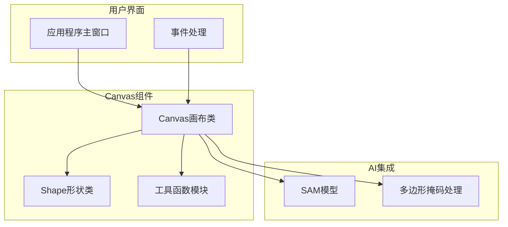
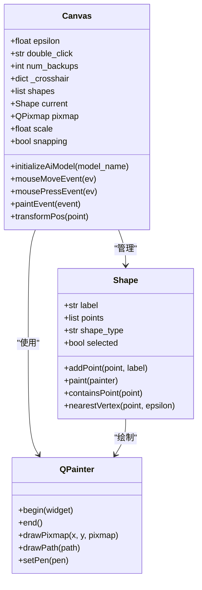
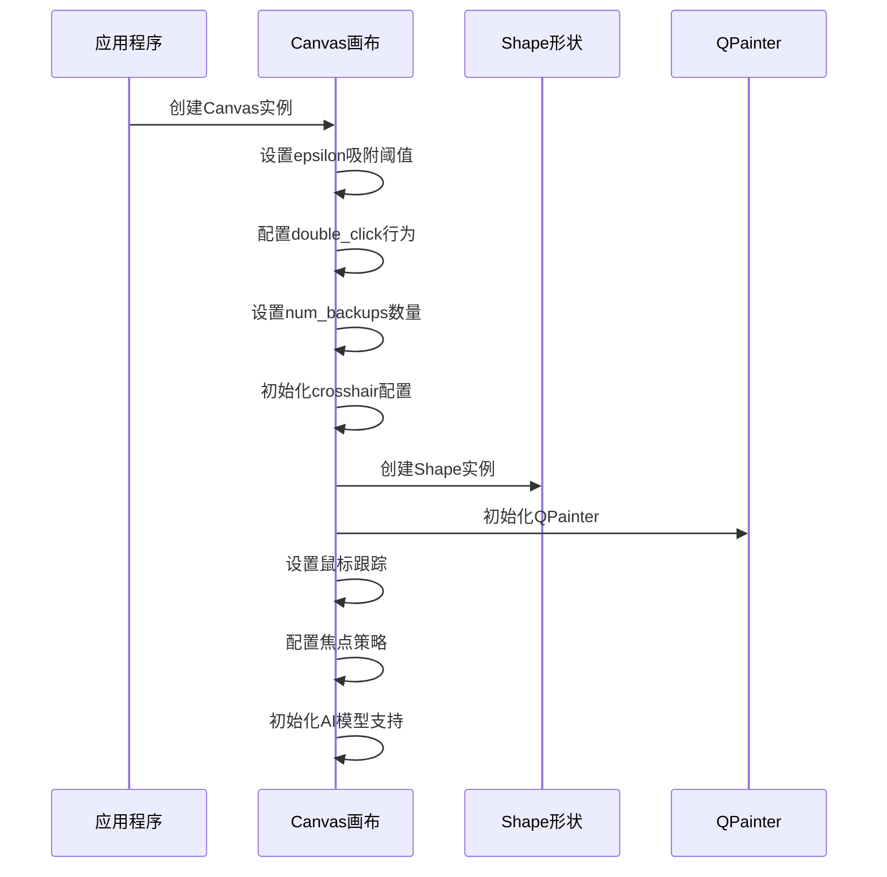
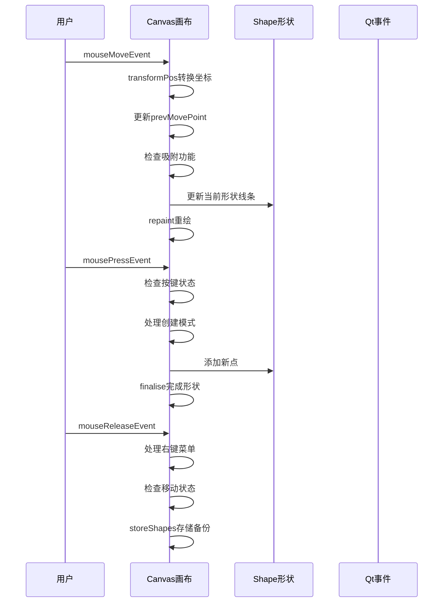
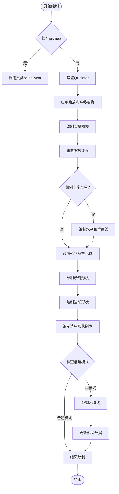
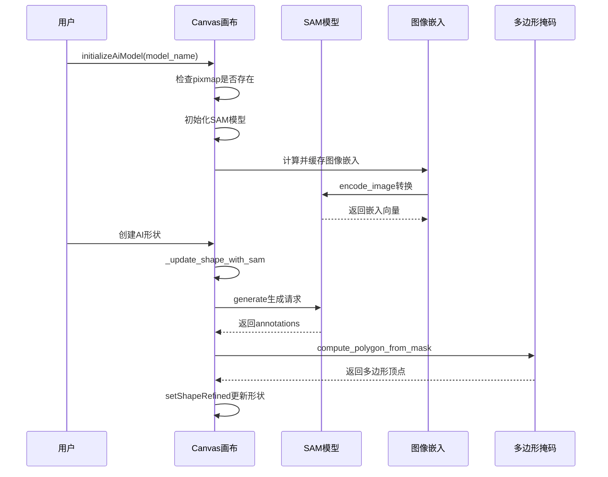
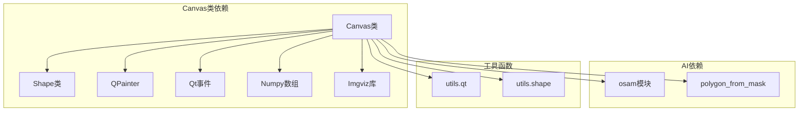

# Canvas画布类

<cite>
**本文档引用的文件**
- [canvas.py](file://labelme/widgets/canvas.py)
- [shape.py](file://labelme/shape.py)
- [shape.py](file://labelme/utils/shape.py)
- [qt.py](file://labelme/utils/qt.py)
- [polygon_from_mask.py](file://labelme/_automation/polygon_from_mask.py)
- [app.py](file://labelme/app.py)
</cite>

## 目录
1. [简介](#简介)
2. [项目结构](#项目结构)
3. [核心组件](#核心组件)
4. [架构概览](#架构概览)
5. [详细组件分析](#详细组件分析)
6. [依赖关系分析](#依赖关系分析)
7. [性能考虑](#性能考虑)
8. [故障排除指南](#故障排除指南)
9. [结论](#结论)
10. [附录](#附录)

## 简介
Canvas画布类是Labelme标注系统的核心组件，负责处理图像显示、用户交互、形状绘制和AI模型集成。该类实现了完整的绘图功能，支持多种形状类型的创建和编辑，包括多边形、矩形、圆形、线条、点、线条带、AI多边形和AI掩码等。

## 项目结构
Canvas类位于labelme/widgets/canvas.py中，是Labelme图形标注界面的核心组件。它与Shape类、工具函数模块协同工作，提供完整的标注功能。



**图表来源**
- [canvas.py:39-150](file://labelme/widgets/canvas.py#L39-L150)
- [shape.py:19-100](file://labelme/shape.py#L19-L100)

**章节来源**
- [canvas.py:1-150](file://labelme/widgets/canvas.py#L1-L150)

## 核心组件
Canvas类提供了以下核心功能：

### 初始化参数配置
Canvas类支持以下初始化参数：

- **epsilon吸附阈值**: 控制顶点选择的容差，默认值为10.0
- **double_click双击行为**: 设置双击行为，默认为"close"
- **num_backups撤销备份数**: 撤销功能的备份数量，默认10
- **crosshair十字准星**: 配置字典，控制各模式下的十字准星显示

### 主要功能特性
- 多种形状创建和编辑：polygon, rectangle, circle, line, point, linestrip, ai_polygon, ai_mask
- 鼠标交互处理：点击、拖拽、双击等
- 键盘快捷键支持
- 形状选择、移动、缩放、删除操作
- 撤销/重做功能
- AI辅助标注功能
- 缩放和平移功能

**章节来源**
- [canvas.py:71-106](file://labelme/widgets/canvas.py#L71-L106)
- [canvas.py:162-180](file://labelme/widgets/canvas.py#L162-L180)

## 架构概览
Canvas类采用事件驱动的设计模式，通过信号槽机制与应用程序其他组件通信。



**图表来源**
- [canvas.py:39-150](file://labelme/widgets/canvas.py#L39-L150)
- [shape.py:19-100](file://labelme/shape.py#L19-L100)

## 详细组件分析

### Canvas类初始化
Canvas类的初始化过程设置了各种参数和状态，包括绘图模式、光标样式、形状管理等。



**图表来源**
- [canvas.py:71-150](file://labelme/widgets/canvas.py#L71-L150)

**章节来源**
- [canvas.py:71-150](file://labelme/widgets/canvas.py#L71-L150)

### 鼠标事件处理机制
Canvas类实现了完整的鼠标事件处理流程，包括移动、按下、释放和双击事件。



**图表来源**
- [canvas.py:372-700](file://labelme/widgets/canvas.py#L372-L700)

**章节来源**
- [canvas.py:372-700](file://labelme/widgets/canvas.py#L372-L700)

### 绘图渲染流程
Canvas类的paintEvent方法负责处理所有绘制操作，包括图像显示、形状绘制、十字准星等。



**图表来源**
- [canvas.py:807-943](file://labelme/widgets/canvas.py#L807-L943)

**章节来源**
- [canvas.py:807-943](file://labelme/widgets/canvas.py#L807-L943)

### 坐标转换方法
Canvas类提供了重要的坐标转换功能，用于处理屏幕坐标与逻辑坐标的转换。

```mermaid
flowchart TD
WidgetPos[widget-logical坐标] --> TransformPos[transformPos方法]
TransformPos --> ScaleDivide[point / self.scale]
ScaleDivide --> OffsetCenter[offsetToCenter()]
OffsetCenter --> ScreenPos[screen-logical坐标]
SizeInfo[获取画布尺寸] --> OffsetCalc[offsetToCenter计算]
OffsetCalc --> CenterX[(aw - w) / (2 * s)]
OffsetCalc --> CenterY[(ah - h) / (2 * s)]
CenterX --> FinalOffset[最终偏移量]
CenterY --> FinalOffset
```

**图表来源**
- [canvas.py:944-955](file://labelme/widgets/canvas.py#L944-L955)

**章节来源**
- [canvas.py:944-955](file://labelme/widgets/canvas.py#L944-L955)

### AI模型集成接口
Canvas类集成了AI辅助标注功能，支持SAM模型的使用。



**图表来源**
- [canvas.py:206-228](file://labelme/widgets/canvas.py#L206-L228)
- [canvas.py:1253-1316](file://labelme/widgets/canvas.py#L1253-L1316)

**章节来源**
- [canvas.py:206-228](file://labelme/widgets/canvas.py#L206-L228)
- [canvas.py:1253-1316](file://labelme/widgets/canvas.py#L1253-L1316)

### 性能优化机制
Canvas类采用了多种性能优化技术：

- **图像嵌入缓存**: 使用OrderedDict缓存SAM模型的图像嵌入，避免重复计算
- **增量重绘**: 仅重绘必要的区域，减少全屏重绘开销
- **缩放优化**: 通过变换矩阵实现高效的缩放和平移
- **状态管理**: 使用备份机制实现撤销/重做功能

**章节来源**
- [canvas.py:181-205](file://labelme/widgets/canvas.py#L181-L205)
- [canvas.py:229-327](file://labelme/widgets/canvas.py#L229-L327)

## 依赖关系分析



**图表来源**
- [canvas.py:1-20](file://labelme/widgets/canvas.py#L1-L20)
- [shape.py:1-10](file://labelme/shape.py#L1-L10)

**章节来源**
- [canvas.py:1-20](file://labelme/widgets/canvas.py#L1-L20)
- [shape.py:1-10](file://labelme/shape.py#L1-L10)

## 性能考虑
Canvas类在设计时充分考虑了性能优化：

### 缓冲区管理
- **图像嵌入缓存**: 使用OrderedDict存储图像嵌入，支持LRU缓存淘汰
- **形状备份管理**: 限制备份数量，避免内存泄漏
- **增量更新**: 仅在必要时更新显示内容

### 重绘机制
- **变换优化**: 使用QPainter变换矩阵实现高效缩放和平移
- **条件重绘**: 根据事件类型决定重绘范围
- **抗锯齿优化**: 合理使用渲染提示提升显示质量

### 内存管理
- **资源清理**: 及时清理不再使用的形状和图像数据
- **对象复用**: 重用QPainter对象避免频繁创建销毁

## 故障排除指南

### 常见问题及解决方案

**问题1: AI模型初始化失败**
- 检查osam模块是否正确安装
- 确认模型名称是否有效
- 验证图像数据格式

**问题2: 形状绘制异常**
- 检查epsilon参数设置是否合理
- 确认坐标转换是否正确
- 验证形状类型是否支持

**问题3: 性能问题**
- 检查图像尺寸是否过大
- 确认缓存机制是否正常工作
- 优化重绘频率

**章节来源**
- [canvas.py:912-937](file://labelme/widgets/canvas.py#L912-L937)
- [canvas.py:966-993](file://labelme/widgets/canvas.py#L966-L993)

## 结论
Canvas画布类是Labelme标注系统的核心组件，提供了完整的图形标注功能。通过精心设计的架构和多项性能优化技术，该类能够高效地处理复杂的标注任务。其模块化的设计使得AI模型集成、事件处理和渲染机制都具有良好的可维护性和扩展性。

## 附录

### 使用示例和最佳实践

**基本使用步骤**:
1. 创建Canvas实例并设置初始化参数
2. 加载图像到画布
3. 选择合适的创建模式
4. 进行标注操作
5. 保存标注结果

**最佳实践建议**:
- 合理设置epsilon参数以平衡精度和易用性
- 使用适当的num_backups值平衡内存使用和撤销功能
- 在处理大图像时启用缓存机制
- 定期清理不再使用的形状数据

**章节来源**
- [canvas.py:1162-1204](file://labelme/widgets/canvas.py#L1162-L1204)
- [app.py:630-663](file://labelme/app.py#L630-L663)