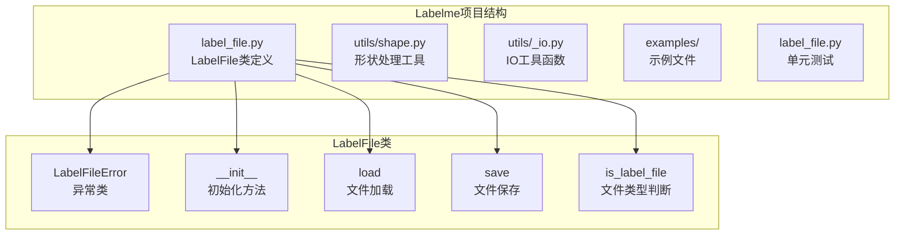
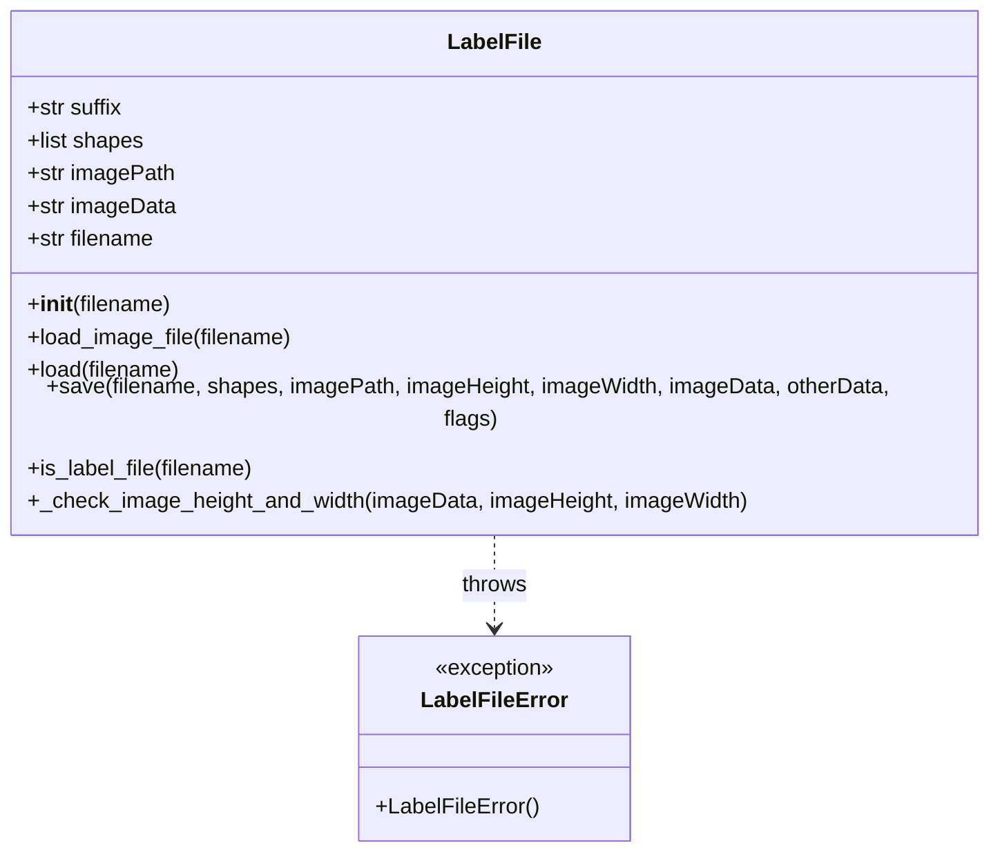
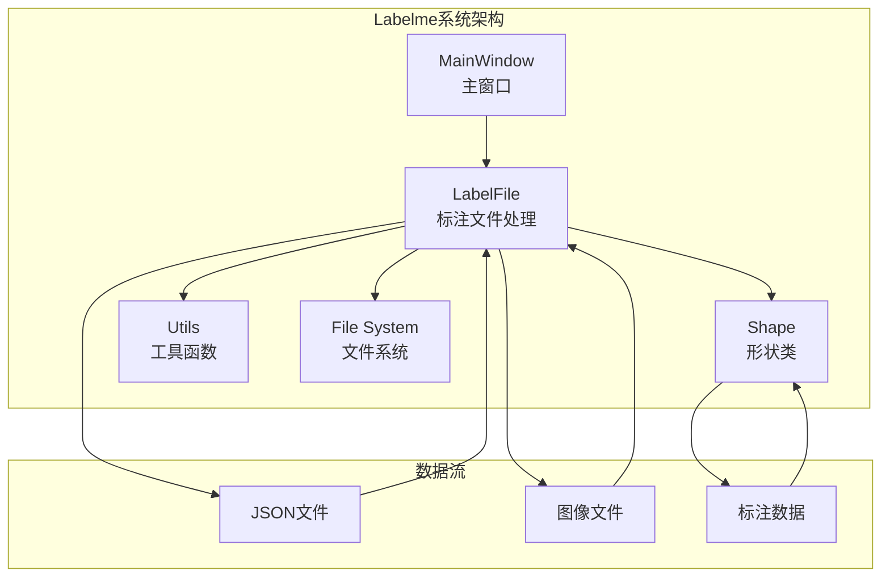
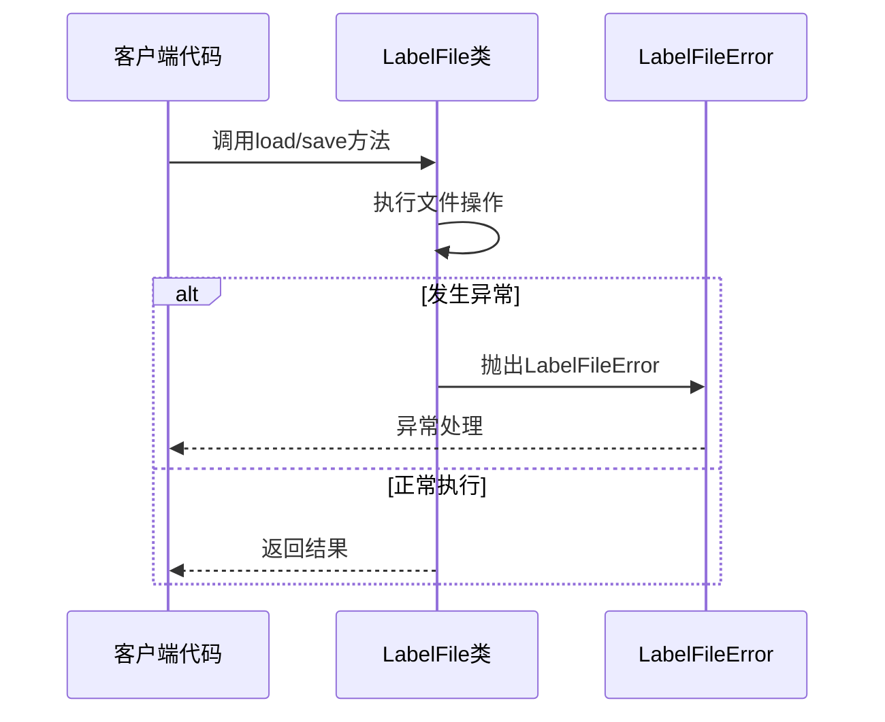
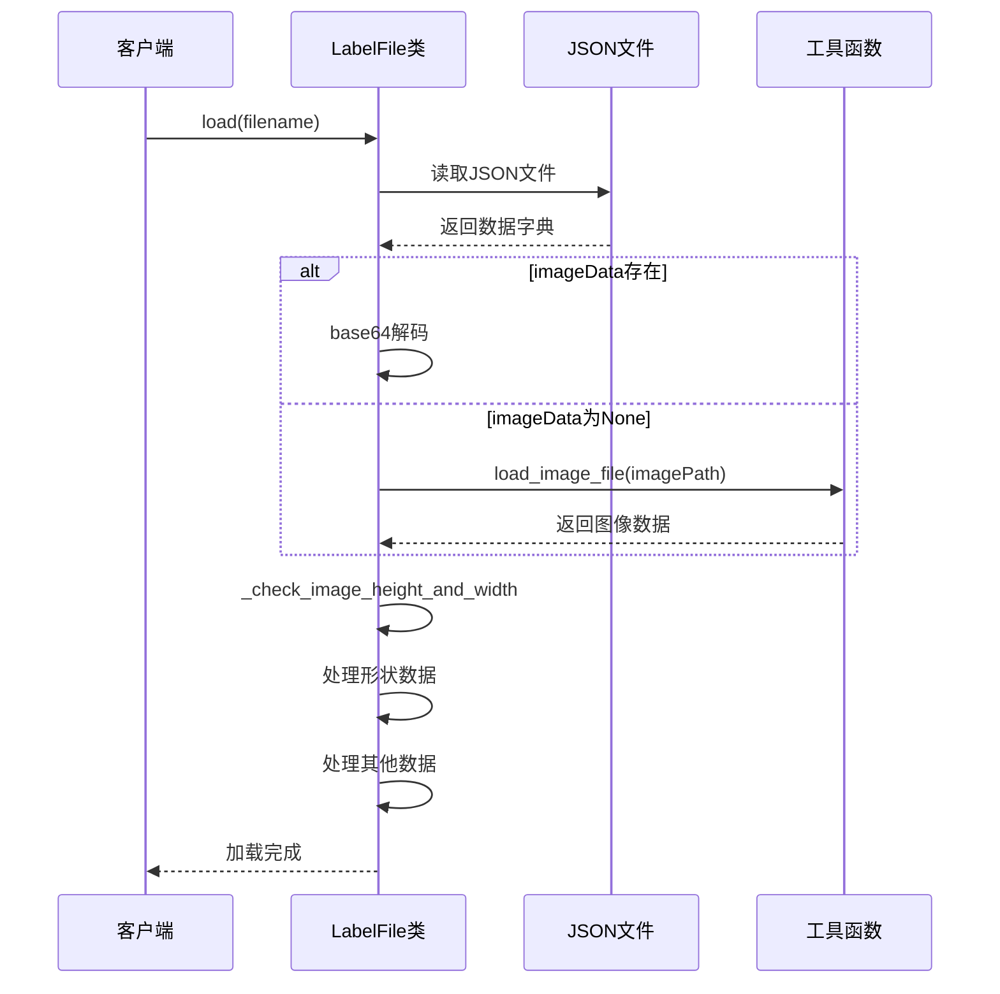
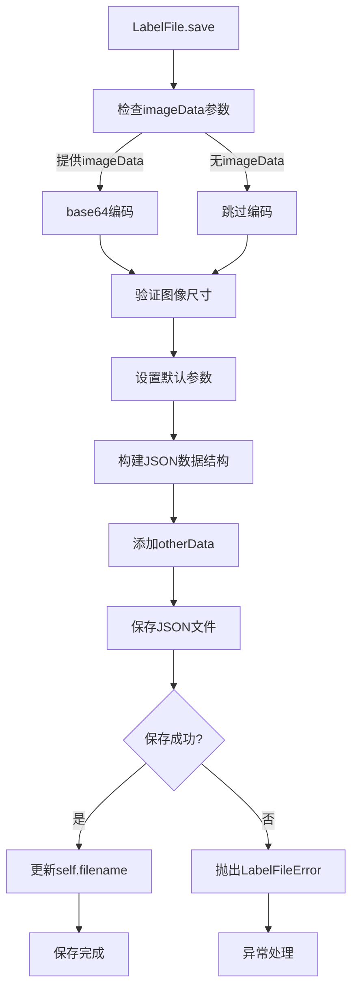
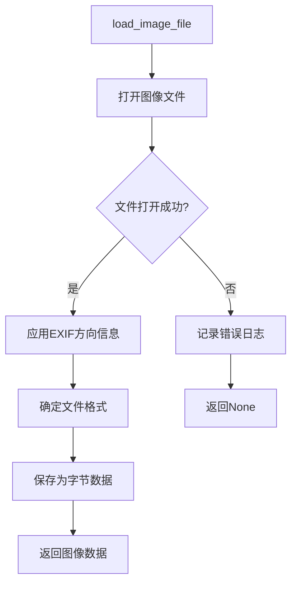
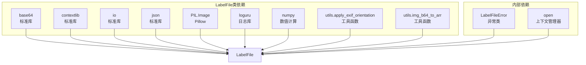
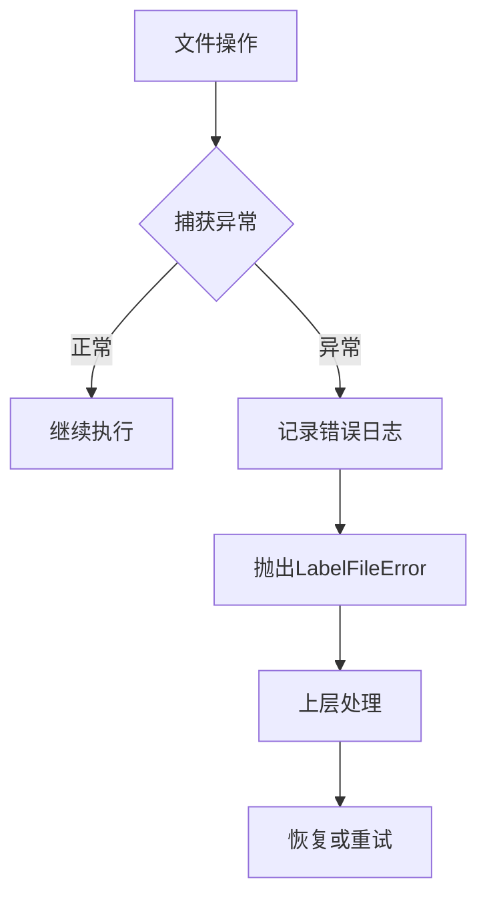

# LabelFile标注文件类

<cite>
**本文档引用的文件**
- [label_file.py](file://labelme/labelme/label_file.py)
- [shape.py](file://labelme/labelme/utils/shape.py)
- [_io.py](file://labelme/labelme/utils/_io.py)
- [apc2016_obj3.json](file://examples/tutorial/apc2016_obj3.json)
- [2011_000003.json](file://examples/instance_segmentation/data_annotated/2011_000003.json)
- [app.py](file://labelme/labelme/app.py)
- [__main__.py](file://labelme/labelme/__main__.py)
</cite>

## 目录
1. [简介](#简介)
2. [项目结构](#项目结构)
3. [核心组件](#核心组件)
4. [架构概览](#架构概览)
5. [详细组件分析](#详细组件分析)
6. [依赖关系分析](#依赖关系分析)
7. [性能考虑](#性能考虑)
8. [故障排除指南](#故障排除指南)
9. [结论](#结论)
10. [附录](#附录)

## 简介

LabelFile类是Labelme标注工具的核心组件，负责处理JSON格式的标注文件。该类提供了完整的标注文件读写功能，支持图像数据的编码解码、标注形状的管理以及数据验证等功能。

## 项目结构

LabelFile类位于labelme/labelme/label_file.py文件中，是Labelme项目的重要组成部分：



**图表来源**
- [label_file.py:1-306](file://labelme/labelme/label_file.py#L1-L306)

**章节来源**
- [label_file.py:1-306](file://labelme/labelme/label_file.py#L1-L306)

## 核心组件

LabelFile类包含以下核心组件：

### 主要类结构



**图表来源**
- [label_file.py:33-306](file://labelme/labelme/label_file.py#L33-L306)

### 关键属性说明

| 属性名 | 类型 | 描述 | 默认值 |
|--------|------|------|--------|
| `suffix` | str | 标注文件扩展名 | ".json" |
| `shapes` | list | 标注形状列表 | [] |
| `imagePath` | str | 图像文件路径 | None |
| `imageData` | str | 图像数据（base64编码） | None |
| `filename` | str | 标注文件路径 | None |

**章节来源**
- [label_file.py:55-69](file://labelme/labelme/label_file.py#L55-L69)

## 架构概览

LabelFile类在整个Labelme系统中的位置和作用：



**图表来源**
- [app.py:61-62](file://labelme/labelme/app.py#L61-L62)

**章节来源**
- [app.py:61-62](file://labelme/labelme/app.py#L61-L62)

## 详细组件分析

### LabelFileError异常类

LabelFileError是专门用于处理LabelFile操作异常的自定义异常类：



**图表来源**
- [label_file.py:33-39](file://labelme/labelme/label_file.py#L33-L39)

**章节来源**
- [label_file.py:33-39](file://labelme/labelme/label_file.py#L33-L39)

### 初始化方法

LabelFile类的初始化方法支持两种使用方式：

```mermaid
flowchart TD
A[LabelFile.__init__] --> B{filename参数检查}
B --> |提供filename| C[调用self.load(filename)]
B --> |无filename| D[初始化基本属性]
C --> E[设置self.filename]
D --> E
E --> F[完成初始化]
```

**图表来源**
- [label_file.py:57-69](file://labelme/labelme/label_file.py#L57-L69)

**章节来源**
- [label_file.py:57-69](file://labelme/labelme/label_file.py#L57-L69)

### 文件加载方法

LabelFile.load方法负责从JSON文件中加载标注数据：



**图表来源**
- [label_file.py:103-192](file://labelme/labelme/label_file.py#L103-L192)

**章节来源**
- [label_file.py:103-192](file://labelme/labelme/label_file.py#L103-L192)

### 文件保存方法

LabelFile.save方法将标注数据保存为JSON格式：



**图表来源**
- [label_file.py:225-290](file://labelme/labelme/label_file.py#L225-L290)

**章节来源**
- [label_file.py:225-290](file://labelme/labelme/label_file.py#L225-L290)

### 图像文件加载方法

LabelFile.load_image_file方法负责从指定路径加载图像文件：



**图表来源**
- [label_file.py:72-101](file://labelme/labelme/label_file.py#L72-L101)

**章节来源**
- [label_file.py:72-101](file://labelme/labelme/label_file.py#L72-L101)

### 数据验证方法

_label_check_image_height_and_width方法用于验证图像尺寸信息：

```mermaid
flowchart TD
A[_check_image_height_and_width] --> B[转换base64数据为数组]
B --> C{imageHeight不匹配?}
C --> |是| D[记录错误日志]
C --> |否| E[保持原始值]
D --> F[使用实际高度]
E --> G[检查imageWidth]
F --> G
G --> H{imageWidth不匹配?}
H --> |是| I[记录错误日志]
H --> |否| J[保持原始值]
I --> K[使用实际宽度]
J --> L[返回(高度, 宽度)]
K --> L
```

**图表来源**
- [label_file.py:195-223](file://labelme/labelme/label_file.py#L195-L223)

**章节来源**
- [label_file.py:195-223](file://labelme/labelme/label_file.py#L195-L223)

### 文件类型判断方法

LabelFile.is_label_file方法用于判断文件是否为标注文件：

```mermaid
flowchart TD
A[is_label_file] --> B[获取文件扩展名]
B --> C[转换为小写]
C --> D{扩展名等于".json"?}
D --> |是| E[返回True]
D --> |否| F[返回False]
```

**图表来源**
- [label_file.py:293-305](file://labelme/labelme/label_file.py#L293-L305)

**章节来源**
- [label_file.py:293-305](file://labelme/labelme/label_file.py#L293-L305)

## 依赖关系分析

LabelFile类与其他组件的依赖关系：



**图表来源**
- [label_file.py:1-13](file://labelme/labelme/label_file.py#L1-L13)

**章节来源**
- [label_file.py:1-13](file://labelme/labelme/label_file.py#L1-L13)

## 性能考虑

LabelFile类在设计时考虑了以下性能因素：

1. **内存效率**：使用base64编码存储图像数据，避免重复读取磁盘
2. **延迟加载**：当imageData为None时，延迟加载图像文件
3. **批量处理**：一次读取整个JSON文件，减少I/O操作次数
4. **缓存机制**：PIL.Image.MAX_IMAGE_PIXELS设置为None，支持大图像处理

## 故障排除指南

### 常见错误及解决方案

| 错误类型 | 可能原因 | 解决方案 |
|----------|----------|----------|
| LabelFileError | 文件格式不正确 | 检查JSON格式是否符合标准 |
| IOError | 图像文件无法打开 | 验证图像文件路径和权限 |
| ValueError | 形状数据格式错误 | 检查points数组格式和shape_type |
| AssertionError | 数据类型不匹配 | 验证数据类型和格式要求 |

### 错误处理机制



**图表来源**
- [label_file.py:177-178](file://labelme/labelme/label_file.py#L177-L178)

**章节来源**
- [label_file.py:177-178](file://labelme/labelme/label_file.py#L177-L178)

## 结论

LabelFile类为Labelme标注工具提供了完整的JSON标注文件处理能力。它具有以下特点：

1. **完整性**：支持完整的标注文件格式，包括标准字段和扩展字段
2. **健壮性**：完善的错误处理和数据验证机制
3. **灵活性**：支持多种形状类型和数据格式
4. **易用性**：简洁的API设计，易于集成到其他组件中

该类的设计充分考虑了实际应用场景的需求，为图像标注工作提供了可靠的技术基础。

## 附录

### 文件格式规范

LabelFile支持的标准JSON格式包含以下字段：

**必需字段**：
- `version`: Labelme版本号
- `shapes`: 标注形状数组
- `imagePath`: 图像文件路径
- `imageHeight`: 图像高度
- `imageWidth`: 图像宽度

**可选字段**：
- `imageData`: 图像数据（base64编码）
- `flags`: 图像级别标志
- `otherData`: 其他自定义数据

**形状数据字段**：
- `label`: 标签名称
- `points`: 顶点坐标数组
- `shape_type`: 形状类型（默认"polygon"）
- `flags`: 形状标志
- `description`: 描述信息
- `mask`: 掩码数据
- `group_id`: 组ID

### 使用示例

具体的使用示例可以在项目示例文件中找到：

- [apc2016_obj3.json](file://examples/tutorial/apc2016_obj3.json)
- [2011_000003.json](file://examples/instance_segmentation/data_annotated/2011_000003.json)

这些示例展示了LabelFile类在实际标注场景中的使用方式和数据格式。