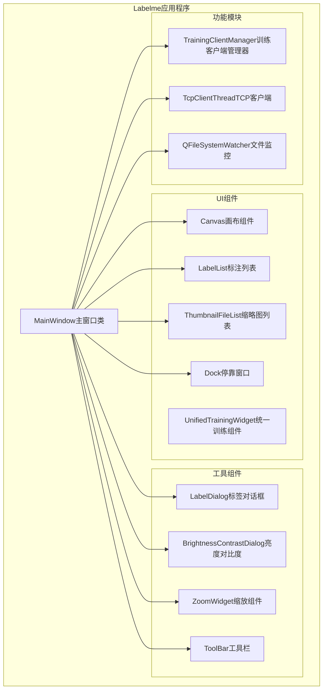
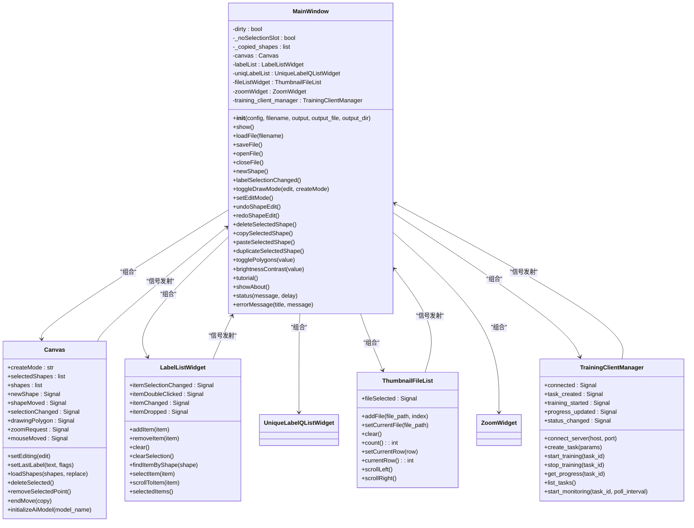
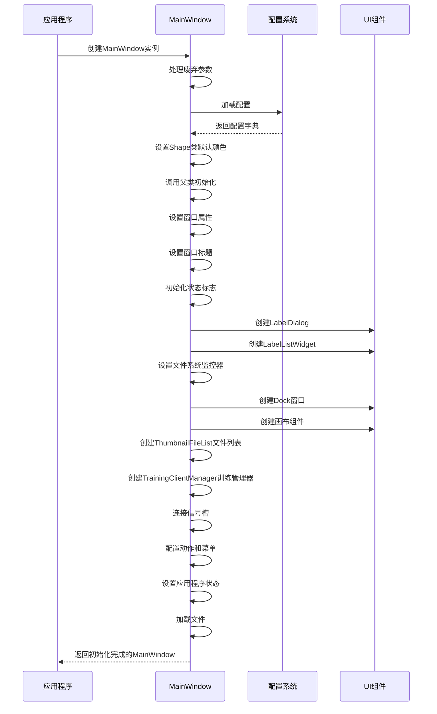
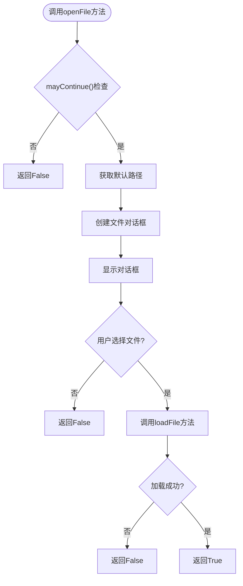
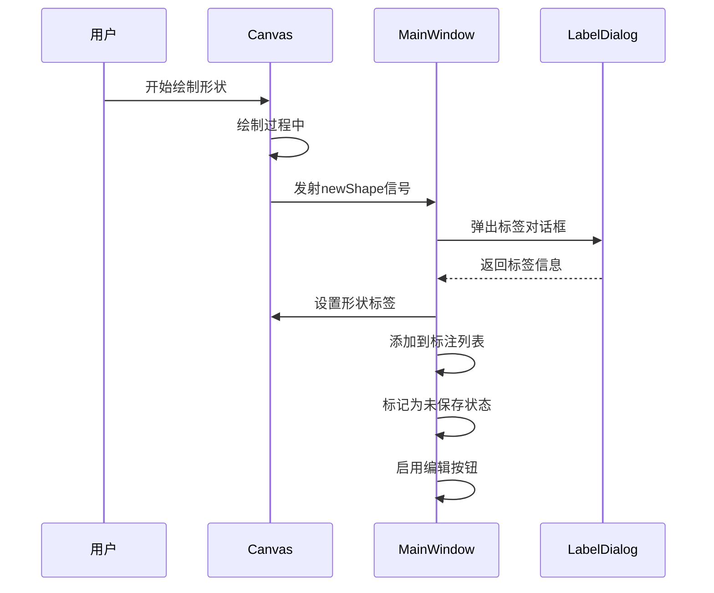
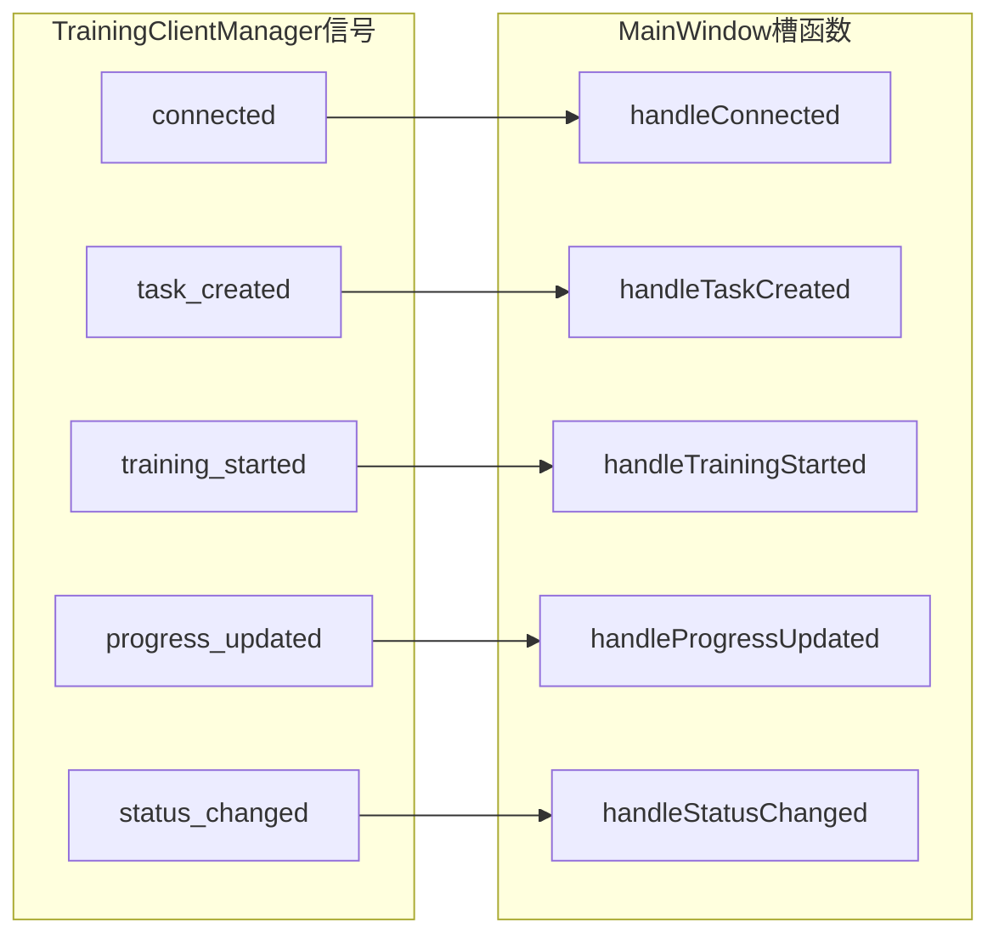
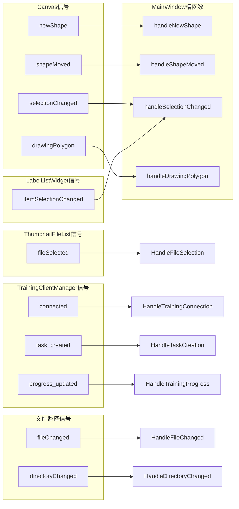
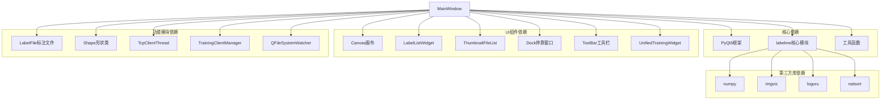

# MainWindow主窗口类

<cite>
**本文档引用的文件**
- [app.py](file://labelme/labelme/app.py)
- [thumbnail_file_list.py](file://labelme/labelme/widgets/thumbnail_file_list.py)
- [training_client_manager.py](file://labelme/labelme/training_client_manager.py)
</cite>

## 更新摘要
**所做更改**
- 更新了文件列表组件部分，反映MainWindow现在使用ThumbnailFileList替代传统文件列表
- 新增了训练客户端管理器集成部分，详细说明TrainingClientManager的功能和使用
- 更新了架构概览图，包含新的文件列表组件和训练管理组件
- 增强了UI组件管理部分，详细描述新的缩略图文件列表功能
- 补充了训练管理相关的信号槽机制说明

## 目录
1. [简介](#简介)
2. [项目结构](#项目结构)
3. [核心组件](#核心组件)
4. [架构概览](#架构概览)
5. [详细组件分析](#详细组件分析)
6. [依赖关系分析](#依赖关系分析)
7. [性能考虑](#性能考虑)
8. [故障排除指南](#故障排除指南)
9. [结论](#结论)

## 简介

MainWindow是Labelme图像标注工具的主窗口类，继承自PyQt5的QMainWindow。该类负责管理整个应用程序的UI布局、事件处理、文件操作、标注功能等核心功能。MainWindow提供了完整的图像标注工作流程，包括多边形、矩形、圆形、线条、点等多种标注形状的创建和编辑功能，支持AI辅助标注、TCP通信、文件管理等功能。

**更新** MainWindow现在集成了新的ThumbnailFileList文件列表组件和TrainingClientManager训练客户端管理器，提供更高效的文件浏览和远程训练管理功能。

## 项目结构

Labelme项目的整体架构采用模块化设计，MainWindow类位于核心模块中：

**图表来源**
- [app.py:98-120](file://labelme/labelme/app.py#L98-L120)
- [thumbnail_file_list.py:115-119](file://labelme/labelme/widgets/thumbnail_file_list.py#L115-L119)
- [training_client_manager.py:33-47](file://labelme/labelme/training_client_manager.py#L33-L47)

**章节来源**
- [app.py:1-100](file://labelme/labelme/app.py#L1-L100)

## 核心组件

MainWindow类包含以下核心组件和功能模块：

### 初始化参数配置

| 参数名 | 类型 | 默认值 | 作用 |
|--------|------|--------|------|
| config | dict | None | 应用程序配置字典，包含标签、快捷键、形状颜色等设置 |
| filename | str | None | 要加载的文件路径 |
| output | str | None | 输出路径（已废弃，使用output_file） |
| output_file | str | None | 输出文件路径 |
| output_dir | str | None | 输出目录路径 |

### 主要属性

| 属性名 | 类型 | 描述 |
|--------|------|------|
| dirty | bool | 标记当前文件是否有未保存的更改 |
| _noSelectionSlot | bool | 防止在编程方式改变选择时触发选择槽函数 |
| _copied_shapes | list | 存储复制/粘贴的形状列表 |
| canvas | Canvas | 核心画布组件，处理图像显示和标注绘制 |
| labelList | LabelListWidget | 显示当前图像中的所有标注项 |
| uniqLabelList | UniqueLabelQListWidget | 显示所有使用过的标签，用于快速选择 |
| fileListWidget | ThumbnailFileList | 显示目录中的图像文件，带缩略图预览的新型文件列表 |
| zoomWidget | ZoomWidget | 控制图像缩放比例的组件 |
| training_client_manager | TrainingClientManager | 训练客户端管理器，用于远程训练任务管理 |

**更新** 新增了ThumbnailFileList文件列表组件和TrainingClientManager训练管理器属性，提供更直观的文件浏览和远程训练功能。

**章节来源**
- [app.py:117-202](file://labelme/labelme/app.py#L117-L202)
- [app.py:374-407](file://labelme/labelme/app.py#L374-L407)
- [thumbnail_file_list.py:115-119](file://labelme/labelme/widgets/thumbnail_file_list.py#L115-L119)
- [training_client_manager.py:33-47](file://labelme/labelme/training_client_manager.py#L33-L47)

## 架构概览

MainWindow采用MVC（Model-View-Controller）架构模式，实现了清晰的职责分离：

**图表来源**
- [app.py:98-120](file://labelme/labelme/app.py#L98-L120)
- [app.py:374-407](file://labelme/labelme/app.py#L374-L407)
- [app.py:221-250](file://labelme/labelme/app.py#L221-L250)
- [thumbnail_file_list.py:115-119](file://labelme/labelme/widgets/thumbnail_file_list.py#L115-L119)
- [training_client_manager.py:33-47](file://labelme/labelme/training_client_manager.py#L33-L47)

## 详细组件分析

### 初始化方法

MainWindow的初始化方法负责设置应用程序的基础配置和UI组件：

**图表来源**
- [app.py:117-125](file://labelme/labelme/app.py#L117-L125)
- [app.py:150-156](file://labelme/labelme/app.py#L150-L156)
- [app.py:203-284](file://labelme/labelme/app.py#L203-L284)

**更新** 初始化流程中新增了ThumbnailFileList文件列表组件和TrainingClientManager训练管理器的创建和配置步骤。

### 文件操作方法

MainWindow提供了完整的文件操作功能，包括打开、保存、删除文件等：

#### 打开文件方法

**图表来源**
- [app.py:2865-2888](file://labelme/labelme/app.py#L2865-L2888)
- [app.py:2461-2649](file://labelme/labelme/app.py#L2461-L2649)

#### 保存文件方法

MainWindow支持多种保存方式：
- `saveFile()`: 保存当前文件
- `saveFileAs()`: 另存为新文件
- `_saveFile(filename)`: 实际保存逻辑

### 标注功能方法

MainWindow提供了丰富的标注功能，包括形状创建、编辑、删除等：

#### 形状创建方法

**图表来源**
- [app.py:2280-2335](file://labelme/labelme/app.py#L2280-L2335)
- [app.py:402-405](file://labelme/labelme/app.py#L402-L405)

#### 形状编辑方法

MainWindow支持多种形状编辑操作：
- `toggleDrawMode()`: 切换绘图模式
- `setEditMode()`: 设置为编辑模式
- `deleteSelectedShape()`: 删除选中形状
- `copySelectedShape()`: 复制选中形状
- `pasteSelectedShape()`: 粘贴形状
- `duplicateSelectedShape()`: 复制并粘贴

### 文件列表组件

**更新** MainWindow现在使用ThumbnailFileList替代传统的文件列表组件，提供更直观的文件浏览体验：

#### ThumbnailFileList组件特性

| 特性 | 描述 |
|------|------|
| 缩略图显示 | 每个文件项显示80x60像素的缩略图预览 |
| 横向滚动 | 支持水平方向的无限滚动浏览 |
| 选中状态 | 选中的文件项显示红色边框高亮显示 |
| 序号标识 | 每个缩略图左上角显示文件序号 |
| 滚动按钮 | 左右箭头按钮用于快速导航 |
| 信号机制 | `fileSelected`信号通知文件选择变化 |

#### 文件列表操作方法

| 方法名 | 参数 | 返回值 | 描述 |
|--------|------|--------|------|
| addFile | file_path, index=None | None | 添加文件到列表 |
| setCurrentFile | file_path | None | 设置当前选中文件 |
| clear | - | None | 清空所有文件项 |
| count | - | int | 返回文件数量 |
| setCurrentRow | row | None | 设置当前行（兼容接口） |
| currentRow | - | int | 获取当前行（兼容接口） |
| scrollLeft | - | None | 向左滚动 |
| scrollRight | - | None | 向右滚动 |

### 训练客户端管理器

**更新** MainWindow集成了TrainingClientManager，提供远程训练任务的完整生命周期管理：

#### TrainingClientManager核心功能

| 功能类别 | 主要方法 | 信号 |
|----------|----------|------|
| 连接管理 | `connect_server()`, `disconnect_server()` | `connected`, `connection_error` |
| 任务管理 | `create_task()`, `start_training()`, `stop_training()`, `delete_task()` | `task_created`, `training_started`, `training_stopped`, `task_deleted` |
| 状态监控 | `get_task_status()`, `get_progress()`, `list_tasks()` | `status_changed`, `progress_updated`, `task_list_updated` |
| 错误处理 | `cleanup()` | `error_occurred`, `log_message` |

#### 训练管理信号机制

**图表来源**
- [training_client_manager.py:49-72](file://labelme/labelme/training_client_manager.py#L49-L72)

### 信号槽机制

MainWindow实现了完善的信号槽机制来处理组件间的通信：

#### 主要信号

| 信号名称 | 发射者 | 触发条件 | 处理方法 |
|----------|--------|----------|----------|
| newShape | Canvas | 新建形状完成 | newShape() |
| shapeMoved | Canvas | 形状移动 | setDirty() |
| selectionChanged | Canvas | 形状选择改变 | shapeSelectionChanged() |
| drawingPolygon | Canvas | 开始/结束绘图 | toggleDrawingSensitive() |
| itemSelectionChanged | LabelListWidget | 标注列表选择改变 | labelSelectionChanged() |
| fileSelected | ThumbnailFileList | 文件列表选择改变 | fileSelectionChanged() |
| fileChanged | QFileSystemWatcher | 配置文件变更 | _onConfigFileChanged() |
| directoryChanged | QFileSystemWatcher | 目录内容变更 | _onDirectoryChanged() |
| connected | TrainingClientManager | 连接状态变化 | handleTrainingConnection() |
| task_created | TrainingClientManager | 任务创建完成 | handleTaskCreation() |
| progress_updated | TrainingClientManager | 训练进度更新 | handleTrainingProgress() |

#### 信号连接示例

**图表来源**
- [app.py:402-405](file://labelme/labelme/app.py#L402-L405)
- [app.py:246-249](file://labelme/labelme/app.py#L246-L249)
- [app.py:3181-3182](file://labelme/labelme/app.py#L3181-L3182)
- [thumbnail_file_list.py:23](file://labelme/labelme/widgets/thumbnail_file_list.py#L23)
- [training_client_manager.py:50-72](file://labelme/labelme/training_client_manager.py#L50-L72)

**章节来源**
- [app.py:117-125](file://labelme/labelme/app.py#L117-L125)
- [app.py:2280-2335](file://labelme/labelme/app.py#L2280-L2335)
- [app.py:402-405](file://labelme/labelme/app.py#L402-L405)
- [thumbnail_file_list.py:115-119](file://labelme/labelme/widgets/thumbnail_file_list.py#L115-L119)
- [training_client_manager.py:33-47](file://labelme/labelme/training_client_manager.py#L33-L47)

## 依赖关系分析

MainWindow类具有复杂的依赖关系，涉及多个模块和组件：

**图表来源**
- [app.py:34-85](file://labelme/labelme/app.py#L34-L85)

### 组件耦合度分析

MainWindow类采用了松耦合的设计原则：

1. **低耦合组件**: 通过信号槽机制实现组件间通信
2. **高内聚功能**: 相关功能集中在MainWindow类中
3. **清晰接口**: 每个方法都有明确的职责和参数
4. **可扩展性**: 支持通过配置文件扩展功能

**更新** 新增的ThumbnailFileList和TrainingClientManager组件保持了原有的松耦合设计，通过专门的信号槽接口与MainWindow通信。

**章节来源**
- [app.py:34-85](file://labelme/labelme/app.py#L34-L85)

## 性能考虑

MainWindow在设计时充分考虑了性能优化：

### 内存管理
- 使用WA_DontShowOnScreen属性避免初始化过程中的闪烁
- 智能文件监控，避免频繁的文件系统轮询
- 图像数据缓存机制，减少重复加载
- **更新** ThumbnailFileList采用懒加载策略，仅在需要时生成缩略图

### UI响应性
- 使用队列事件机制延迟执行耗时操作
- 异步文件加载，避免阻塞主线程
- 滚动区域优化，支持大图像的流畅滚动
- **更新** 训练管理器使用后台线程处理网络请求，避免UI阻塞

### 缩放优化
- 自适应缩放算法，根据窗口大小动态调整
- 缩放状态缓存，支持跨文件的缩放恢复
- 智能屏幕检测，避免窗口显示在无效区域

### 文件列表优化
- **更新** ThumbnailFileList使用水平滚动布局，支持大量文件的高效浏览
- 缩略图生成采用异步方式，避免阻塞UI线程
- 滚动按钮提供快速导航，提升用户体验

### 训练管理优化
- **更新** TrainingClientManager使用线程池管理网络操作
- 进度监控采用轮询机制，支持可配置的轮询间隔
- 错误处理机制确保网络异常不影响主程序运行

**章节来源**
- [thumbnail_file_list.py:58-79](file://labelme/labelme/widgets/thumbnail_file_list.py#L58-L79)
- [training_client_manager.py:126-158](file://labelme/labelme/training_client_manager.py#L126-L158)

## 故障排除指南

### 常见问题及解决方案

#### 窗口显示问题
**问题**: 窗口无法正常显示或位置异常
**原因**: 屏幕检测失败或窗口位置超出屏幕范围
**解决**: 使用内置的智能屏幕检测功能，自动调整窗口位置

#### 文件加载失败
**问题**: 图像文件无法加载或标注文件格式错误
**原因**: 文件损坏、格式不支持或权限问题
**解决**: 检查文件完整性，确认支持的图像格式，验证文件权限

#### 标注数据丢失
**问题**: 未保存的标注数据在程序崩溃后丢失
**解决**: 启用自动保存功能，定期保存标注数据

#### 性能问题
**问题**: 大图像文件加载缓慢或操作卡顿
**解决**: 使用适当的缩放模式，启用硬件加速，优化图像格式

#### 文件列表显示问题
**更新** **问题**: 缩略图无法显示或显示异常
**原因**: 图像文件损坏或内存不足
**解决**: 检查图像文件完整性，清理内存缓存，重启应用程序

#### 训练连接失败
**更新** **问题**: 无法连接到训练服务器
**原因**: 网络连接问题或服务器地址配置错误
**解决**: 检查网络连接，验证服务器地址和端口配置，查看连接日志

#### 训练进度更新异常
**更新** **问题**: 训练进度不更新或更新延迟
**原因**: 服务器负载过高或网络延迟
**解决**: 调整轮询间隔，检查服务器状态，查看错误日志

**章节来源**
- [app.py:1270-1316](file://labelme/labelme/app.py#L1270-L1316)
- [app.py:2501-2564](file://labelme/labelme/app.py#L2501-L2564)
- [app.py:2651-2673](file://labelme/labelme/app.py#L2651-L2673)
- [thumbnail_file_list.py:75-78](file://labelme/labelme/widgets/thumbnail_file_list.py#L75-L78)
- [training_client_manager.py:140-155](file://labelme/labelme/training_client_manager.py#L140-L155)

## 结论

MainWindow主窗口类是Labelme图像标注工具的核心组件，实现了完整的图像标注工作流程。该类采用模块化设计，具有清晰的职责分离和良好的扩展性。通过信号槽机制实现了组件间的松耦合通信，支持丰富的标注功能和用户界面定制。

**更新** MainWindow的主要改进包括：

### 新增功能优势
- **增强的文件浏览**: ThumbnailFileList提供直观的缩略图文件列表，支持横向滚动和快速导航
- **远程训练管理**: TrainingClientManager集成训练任务的完整生命周期管理
- **异步操作**: 所有网络和文件操作都采用异步方式，提升用户体验
- **信号槽机制**: 完善的信号槽系统支持组件间的松耦合通信

### 技术架构优势
- **模块化设计**: 新组件保持原有架构的松耦合特性
- **性能优化**: 异步处理和缓存机制确保流畅的用户体验
- **错误处理**: 完善的错误处理和日志记录机制
- **可扩展性**: 支持通过配置和插件扩展新功能

### 用户体验提升
- **直观界面**: 缩略图文件列表提供更好的视觉反馈
- **实时监控**: 训练进度的实时更新和状态监控
- **稳定可靠**: 异常处理和资源管理确保应用稳定性
- **易于使用**: 简化的API接口和清晰的信号机制

该类为开发者提供了强大的基础框架，可以轻松扩展新的功能和集成第三方组件。新增的文件列表和训练管理功能进一步增强了Labelme作为专业图像标注工具的能力。