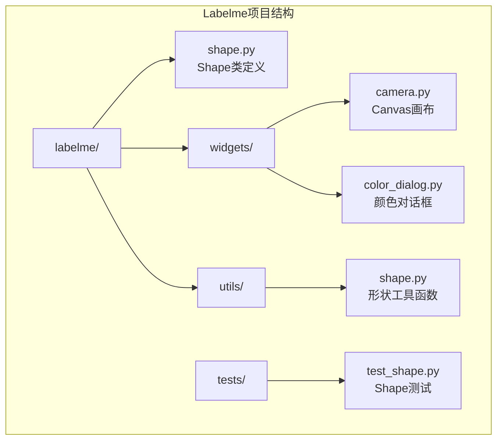
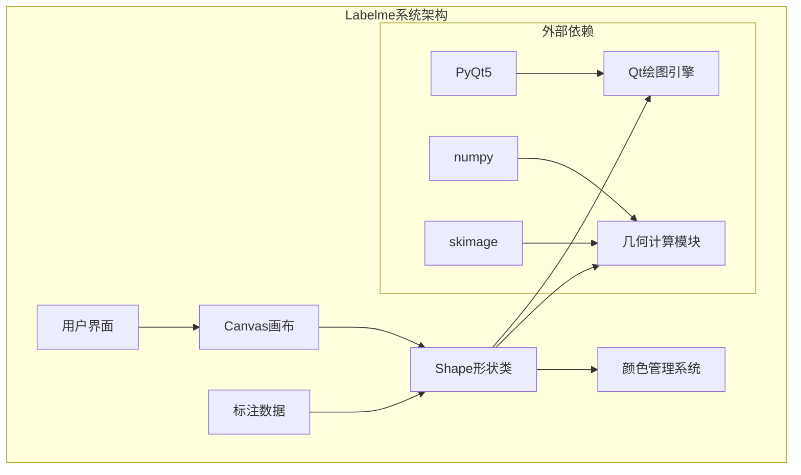
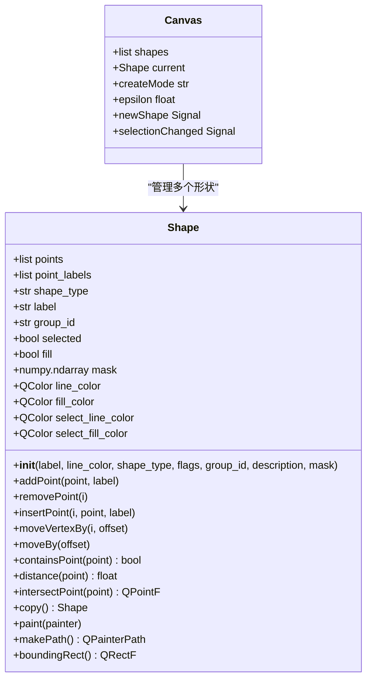
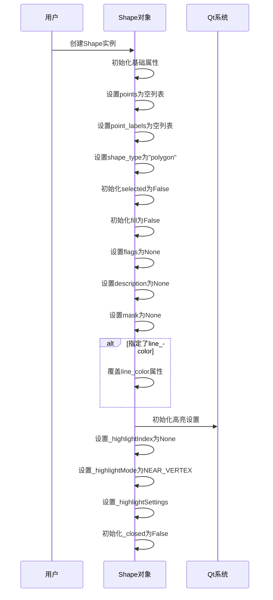
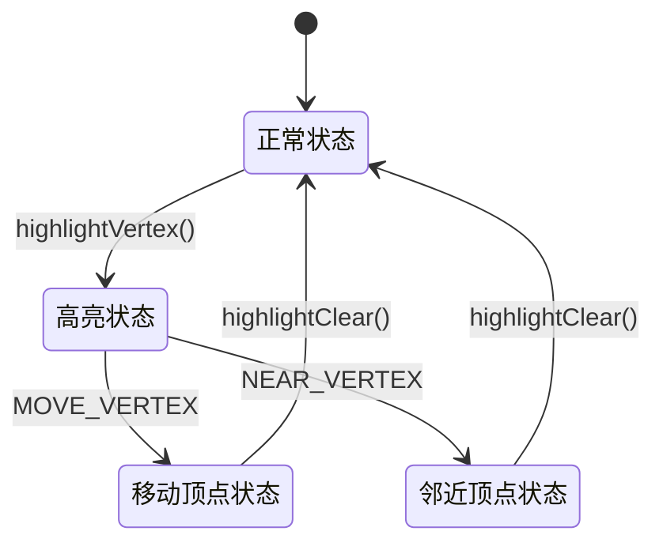
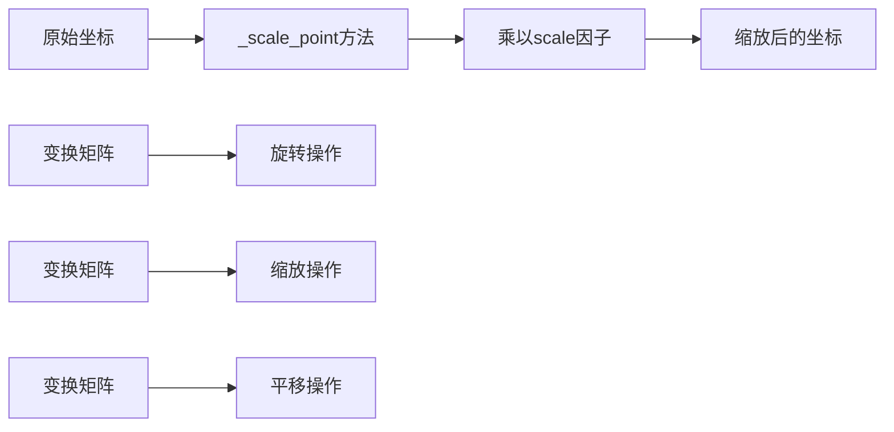
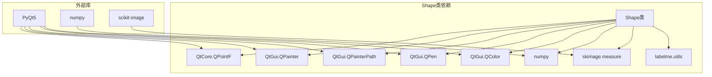

# Shape形状类

<cite>
**本文档引用的文件**
- [shape.py](file://labelme/labelme/shape.py)
- [canvas.py](file://labelme/labelme/widgets/canvas.py)
- [test_shape.py](file://tests/labelme_tests/utils_tests/test_shape.py)
</cite>

## 目录
1. [简介](#简介)
2. [项目结构](#项目结构)
3. [核心组件](#核心组件)
4. [架构概览](#架构概览)
5. [详细组件分析](#详细组件分析)
6. [依赖关系分析](#依赖关系分析)
7. [性能考虑](#性能考虑)
8. [故障排除指南](#故障排除指南)
9. [结论](#结论)

## 简介

Shape类是Labelme标注系统中的核心形状管理类，负责处理各种类型的标注形状，包括多边形、矩形、圆形、线条、点等。该类提供了完整的形状生命周期管理，从创建、编辑到渲染和序列化，是Labelme标注功能的基础组件。

## 项目结构

Labelme项目采用模块化设计，Shape类位于核心模块中：



**图表来源**
- [shape.py:1-669](file://labelme/labelme/shape.py#L1-L669)
- [canvas.py:1-200](file://labelme/labelme/widgets/canvas.py#L1-L200)

**章节来源**
- [shape.py:1-669](file://labelme/labelme/shape.py#L1-L669)
- [canvas.py:1-200](file://labelme/labelme/widgets/canvas.py#L1-L200)

## 核心组件

Shape类作为Labelme标注系统的核心组件，具有以下关键特性：

### 主要功能特性
- **多形状支持**：支持polygon、rectangle、circle、line、point、linestrip、points、mask八种形状类型
- **顶点管理**：完整的顶点添加、删除、移动和编辑功能
- **几何操作**：包含点检测、距离计算、边界矩形等几何运算
- **渲染系统**：基于Qt的图形渲染，支持选择状态和高亮显示
- **序列化支持**：支持对象属性的序列化和反序列化

### 核心属性说明

| 属性名称 | 类型 | 默认值 | 描述 |
|---------|------|--------|------|
| points | list | [] | 顶点坐标列表，存储QtCore.QPointF对象 |
| point_labels | list | [] | 顶点标签列表，1表示正样本，其他值表示负样本 |
| shape_type | str | "polygon" | 形状类型标识符 |
| label | str | None | 形状标签文本 |
| group_id | str | None | 形状组标识符，用于关联相关形状 |
| selected | bool | False | 选择状态标志 |
| fill | bool | False | 填充状态标志 |
| mask | numpy.ndarray | None | 掩码数据（用于mask类型） |

**章节来源**
- [shape.py:65-101](file://labelme/labelme/shape.py#L65-L101)

## 架构概览

Shape类在整个Labelme系统中的架构位置：



**图表来源**
- [shape.py:1-669](file://labelme/labelme/shape.py#L1-L669)
- [canvas.py:1-200](file://labelme/labelme/widgets/canvas.py#L1-L200)

## 详细组件分析

### Shape类结构分析



**图表来源**
- [shape.py:19-669](file://labelme/labelme/shape.py#L19-L669)
- [canvas.py:39-200](file://labelme/labelme/widgets/canvas.py#L39-L200)

### 初始化方法详解

Shape类的初始化过程包含多个关键步骤：

#### 构造函数参数说明

| 参数名称 | 类型 | 必需 | 默认值 | 描述 |
|---------|------|------|--------|------|
| label | str | 否 | None | 形状标签文本 |
| line_color | QColor | 否 | None | 线条颜色，覆盖类级别设置 |
| shape_type | str | 否 | None | 形状类型，自动设为"polygon" |
| flags | dict | 否 | None | 标志位字典 |
| group_id | str | 否 | None | 组ID，用于形状分组 |
| description | str | 否 | None | 形状描述信息 |
| mask | numpy.ndarray | 否 | None | 掩码数据（仅mask类型） |

#### 初始化流程



**图表来源**
- [shape.py:65-117](file://labelme/labelme/shape.py#L65-L117)

**章节来源**
- [shape.py:65-117](file://labelme/labelme/shape.py#L65-L117)

### 几何数据结构

Shape类的几何数据结构设计精巧，支持多种形状类型的统一表示：

#### 顶点管理机制

```mermaid
flowchart TD
A[添加顶点] --> B{检查是否与首点相同}
B --> |是| C[调用close()方法]
B --> |否| D[添加到points列表]
D --> E[添加到point_labels列表]
F[移除顶点] --> G{检查形状类型}
G --> |polygon且长度<=3| H[拒绝移除]
G --> |linestrip且长度<=2| I[拒绝移除]
G --> |允许| J[执行移除操作]
K[插入顶点] --> L[在指定位置插入]
M[移动顶点] --> N[更新指定索引的坐标]
```

**图表来源**
- [shape.py:210-304](file://labelme/labelme/shape.py#L210-L304)

#### 形状类型枚举

Shape类支持以下八种形状类型：

| 形状类型 | 顶点数量要求 | 特殊说明 |
|---------|-------------|----------|
| polygon | ≥3个 | 多边形，可闭合 |
| rectangle | 1或2个 | 矩形框，2点表示对角线 |
| circle | 1或2个 | 圆形，2点确定半径 |
| line | 2个 | 直线段 |
| point | 1个 | 单个点 |
| linestrip | ≥2个 | 连续线条 |
| points | ≥1个 | 点集合，支持正负样本 |
| mask | 1个 | 掩码形状，使用numpy数组 |

**章节来源**
- [shape.py:189-200](file://labelme/labelme/shape.py#L189-L200)

### 形状创建方法

#### 顶点操作方法

| 方法名称 | 参数 | 返回值 | 描述 | 使用场景 |
|---------|------|--------|------|----------|
| addPoint | point(QPointF), label(int) | None | 添加新顶点 | 用户绘制过程中 |
| removePoint | i(int) | bool | 移除指定顶点 | 编辑模式下删除顶点 |
| insertPoint | i(int), point(QPointF), label(int) | None | 插入顶点 | 在中间位置添加顶点 |
| popPoint | - | QPointF | 移除最后一个顶点 | 撤销操作 |
| canAddPoint | - | bool | 检查是否可添加顶点 | 验证操作可行性 |

#### 形状移动方法

| 方法名称 | 参数 | 返回值 | 描述 | 使用场景 |
|---------|------|--------|------|----------|
| moveBy | offset(QPointF) | None | 整体移动形状 | 拖拽移动形状 |
| moveVertexBy | i(int), offset(QPointF) | None | 移动指定顶点 | 编辑顶点位置 |
| setOpen | - | None | 设置为开放状态 | 允许继续添加顶点 |
| close | - | None | 关闭形状 | 完成多边形绘制 |

**章节来源**
- [shape.py:210-321](file://labelme/labelme/shape.py#L210-L321)

### 几何操作接口

#### 点包含检测

containsPoint方法提供精确的点包含检测：

```mermaid
flowchart TD
A[containsPoint调用] --> B{检查是否为mask类型}
B --> |是| C[使用掩码坐标转换]
B --> |否| D[使用路径包含检测]
C --> E{坐标在有效范围内?}
E --> |是| F[返回mask[y,x]值]
E --> |否| G[返回False]
D --> H[调用makePath().contains(point)]
H --> I[返回布尔结果]
```

**图表来源**
- [shape.py:522-547](file://labelme/labelme/shape.py#L522-L547)

#### 距离计算

Shape类提供多种距离计算方法：

| 方法名称 | 参数 | 返回值 | 描述 |
|---------|------|--------|------|
| nearestVertex | point(QPointF), epsilon(float) | int | 查找最近顶点 |
| nearestEdge | point(QPointF), epsilon(float) | int | 查找最近边 |
| distance | point(QPointF) | float | 计算点到形状的距离 |
| intersectPoint | point(QPointF) | QPointF | 计算相交点 |

#### 边界检测

| 方法名称 | 返回值 | 描述 |
|---------|--------|------|
| boundingRect | QRectF | 获取边界矩形 |
| makePath | QPainterPath | 创建形状路径 |
| isClosed | bool | 检查形状是否闭合 |

**章节来源**
- [shape.py:470-582](file://labelme/labelme/shape.py#L470-L582)

### 序列化方法

Shape类支持多种序列化方式：

#### 对象属性序列化

```python
# 使用__dict__获取对象属性
shape_dict = shape.__dict__
```

#### JSON序列化支持

虽然Shape类本身不直接提供JSON方法，但其属性完全支持标准Python序列化：

| 字段名称 | 类型 | 描述 |
|---------|------|------|
| label | str | 形状标签 |
| group_id | str | 组ID |
| points | list | 顶点坐标列表 |
| point_labels | list | 顶点标签列表 |
| shape_type | str | 形状类型 |
| flags | dict | 标志位字典 |
| description | str | 描述信息 |
| other_data | dict | 其他自定义数据 |
| mask | numpy.ndarray | 掩码数据 |

**章节来源**
- [shape.py:628-669](file://labelme/labelme/shape.py#L628-L669)

### 颜色管理接口

Shape类提供完整的颜色管理系统：

#### 颜色属性

| 属性名称 | 类型 | 默认值 | 描述 |
|---------|------|--------|------|
| line_color | QColor | None | 线条颜色 |
| fill_color | QColor | None | 填充颜色 |
| select_line_color | QColor | None | 选中状态线条颜色 |
| select_fill_color | QColor | None | 选中状态填充颜色 |
| vertex_fill_color | QColor | None | 顶点填充颜色 |
| hvertex_fill_color | QColor | None | 高亮顶点填充颜色 |

#### 高亮机制



**图表来源**
- [shape.py:607-627](file://labelme/labelme/shape.py#L607-L627)

**章节来源**
- [shape.py:54-64](file://labelme/labelme/shape.py#L54-L64)

### 形状变换方法

#### 基本变换

| 方法名称 | 参数 | 效果 | 使用场景 |
|---------|------|------|----------|
| moveBy | offset(QPointF) | 整体平移 | 拖拽移动形状 |
| moveVertexBy | i(int), offset(QPointF) | 移动指定顶点 | 编辑顶点位置 |
| _scale_point | point(QPointF) | 坐标缩放 | 不同缩放级别显示 |

#### 高级变换



**图表来源**
- [shape.py:118-130](file://labelme/labelme/shape.py#L118-L130)

**章节来源**
- [shape.py:584-606](file://labelme/labelme/shape.py#L584-L606)

## 依赖关系分析

Shape类的依赖关系清晰明确：



**图表来源**
- [shape.py:1-10](file://labelme/labelme/shape.py#L1-L10)

**章节来源**
- [shape.py:1-10](file://labelme/labelme/shape.py#L1-L10)

## 性能考虑

### 渲染性能优化

Shape类在渲染方面采用了多项优化措施：

1. **路径缓存**：使用QPainterPath缓存形状路径，避免重复计算
2. **缩放优化**：通过_scale_point方法统一处理坐标缩放
3. **高亮机制**：智能的顶点高亮显示，减少不必要的重绘
4. **掩码优化**：对mask类型形状使用高效的numpy数组操作

### 内存管理

- 使用浅拷贝和深拷贝相结合的方式管理形状数据
- 及时清理高亮状态和临时变量
- 掩码数据使用numpy数组，内存效率高

## 故障排除指南

### 常见问题及解决方案

#### 形状类型错误
**问题**：设置不支持的形状类型
**解决**：检查shape_type参数，确保使用受支持的类型

#### 顶点数量不足
**问题**：多边形顶点少于3个
**解决**：确保至少添加3个顶点，或使用其他形状类型

#### 掩码数据格式错误
**问题**：mask属性不是numpy数组
**解决**：确保mask属性为numpy.ndarray类型

#### 颜色设置无效
**问题**：颜色属性未生效
**解决**：检查Qt颜色对象的创建和设置

**章节来源**
- [shape.py:187-200](file://labelme/labelme/shape.py#L187-L200)
- [shape.py:286-300](file://labelme/labelme/shape.py#L286-L300)

## 结论

Shape类是Labelme标注系统的核心组件，提供了完整的形状管理功能。其设计具有以下特点：

1. **完整性**：支持八种不同的形状类型，满足各种标注需求
2. **灵活性**：提供丰富的几何操作和变换方法
3. **高效性**：采用多种优化技术，确保良好的性能表现
4. **易用性**：清晰的API设计和完善的错误处理机制

通过合理使用Shape类的各项功能，开发者可以构建功能强大的标注工具，满足各种计算机视觉任务的需求。