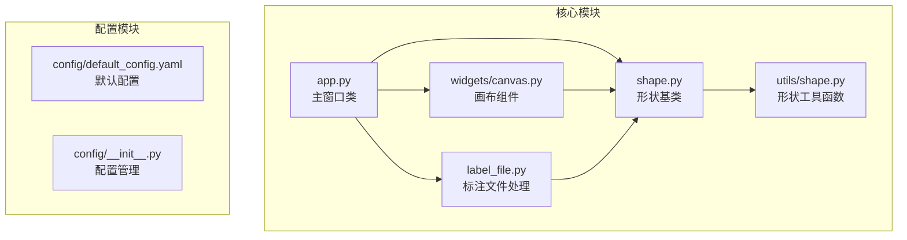
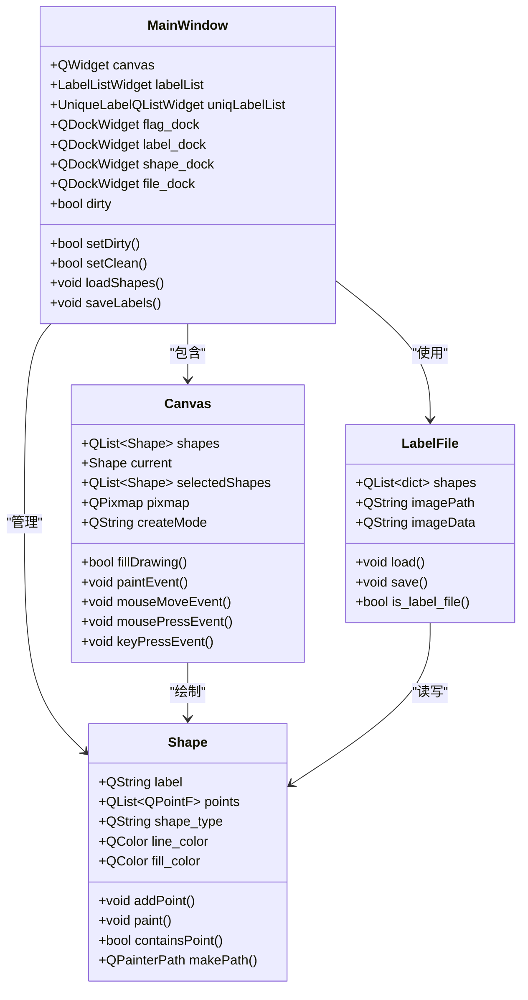
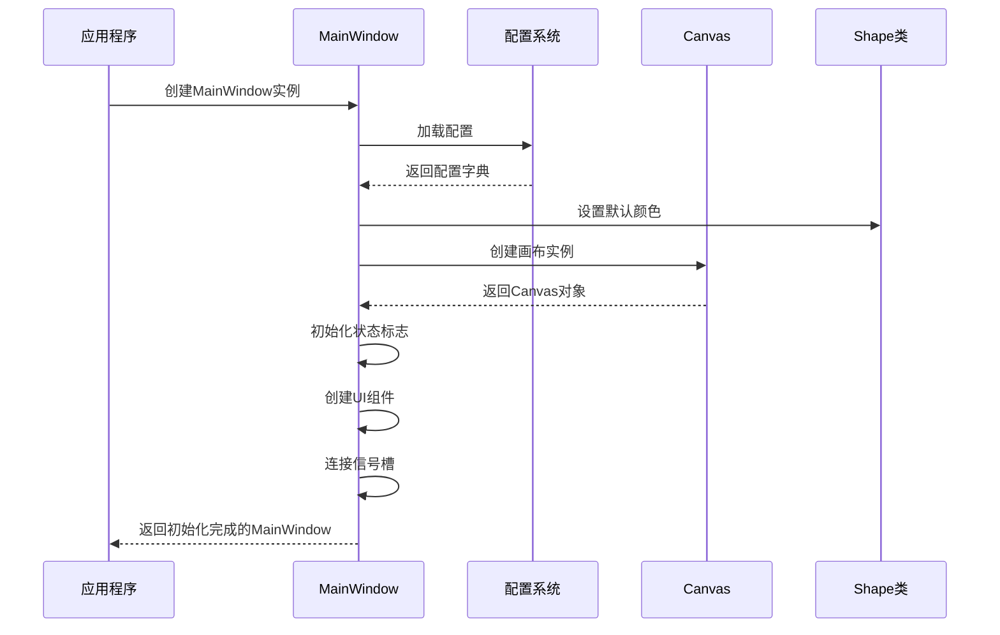
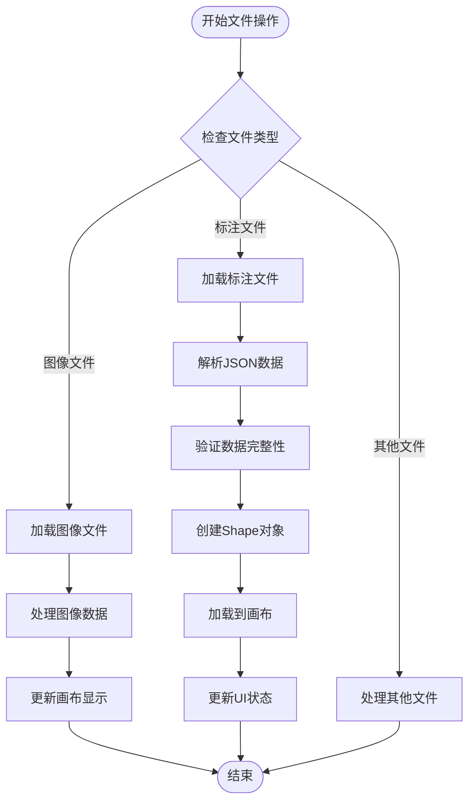

# 核心类API

<cite>
**本文档引用的文件**
- [app.py](file://labelme/app.py)
- [canvas.py](file://labelme/widgets/canvas.py)
- [label_file.py](file://labelme/label_file.py)
- [shape.py](file://labelme/shape.py)
- [shape.py](file://labelme/utils/shape.py)
</cite>

## 目录
1. [简介](#简介)
2. [项目结构](#项目结构)
3. [核心组件](#核心组件)
4. [架构概览](#架构概览)
5. [详细组件分析](#详细组件分析)
6. [依赖分析](#依赖分析)
7. [性能考虑](#性能考虑)
8. [故障排除指南](#故障排除指南)
9. [结论](#结论)

## 简介
本文档提供了labelme核心类的完整API参考文档，涵盖MainWindow、Canvas、LabelFile和Shape四个核心类的详细接口说明。文档重点记录了各类的公共方法、属性、信号以及它们之间的关系，为开发者提供全面的技术参考。

## 项目结构
项目采用模块化设计，核心功能分布在以下模块中：



**图表来源**
- [app.py:1-100](file://labelme/app.py#L1-L100)
- [canvas.py:1-50](file://labelme/widgets/canvas.py#L1-L50)
- [label_file.py:1-50](file://labelme/label_file.py#L1-L50)
- [shape.py:1-50](file://labelme/shape.py#L1-L50)

**章节来源**
- [app.py:1-200](file://labelme/app.py#L1-L200)
- [canvas.py:1-100](file://labelme/widgets/canvas.py#L1-L100)
- [label_file.py:1-100](file://labelme/label_file.py#L1-L100)
- [shape.py:1-100](file://labelme/shape.py#L1-L100)

## 核心组件

### MainWindow类
MainWindow是labelme应用程序的主窗口类，继承自QtWidgets.QMainWindow，负责管理整个应用程序的UI布局、事件处理、文件操作、标注功能等核心功能。

**初始化参数**
- config: 应用程序配置字典
- filename: 要加载的文件路径
- output: 输出路径（已废弃，使用output_file）
- output_file: 输出文件路径
- output_dir: 输出目录路径
- debug_log: 调试日志函数

**公共属性**
- dirty: 标记当前文件是否有未保存的更改
- _noSelectionSlot: 防止在编程方式改变选择时触发选择槽函数
- _copied_shapes: 存储复制/粘贴的形状列表
- canvas: Canvas实例，核心绘图组件
- labelList: 标注列表组件
- uniqLabelList: 唯一标签列表
- flag_dock: Flags停靠窗口
- label_dock: 标签列表停靠窗口
- shape_dock: 标注列表停靠窗口
- file_dock: 文件列表停靠窗口

**公共方法**
- show(): 重写显示方法，确保窗口状态正确恢复
- noShapes(): 检查是否没有任何标注形状
- setDirty(): 设置文件为未保存状态
- setClean(): 设置文件为已保存状态
- loadShapes(): 加载形状列表到画布和标注列表
- loadLabels(): 从形状数据列表加载标注信息
- saveLabels(): 保存标注数据到指定文件
- duplicateSelectedShape(): 复制并粘贴选中的形状
- copySelectedShape(): 复制选中的形状到剪贴板
- pasteSelectedShape(): 粘贴之前复制的形状到画布

**信号处理**
- canvas.zoomRequest: 缩放请求信号
- canvas.mouseMoved: 鼠标移动信号
- canvas.newShape: 新建形状信号
- canvas.shapeMoved: 形状移动信号
- canvas.selectionChanged: 选择改变信号

**章节来源**
- [app.py:99-3576](file://labelme/app.py#L99-L3576)
- [app.py:117-125](file://labelme/app.py#L117-L125)

### Canvas类
Canvas类是labelme中负责绘图和交互的核心组件，继承自QtWidgets.QWidget，提供了完整的绘图功能和用户交互处理。

**初始化参数**
- epsilon: 顶点选择容差，默认10.0
- double_click: 双击行为，默认"close"
- num_backups: 撤销备份数量，默认10
- crosshair: 十字准星配置字典

**公共属性**
- mode: 当前模式（CREATE或EDIT）
- shapes: 所有形状列表
- current: 当前正在创建的形状
- selectedShapes: 选中的形状列表
- scale: 缩放比例
- pixmap: 图像数据
- visible: 形状可见性字典
- _hideBackround: 是否隐藏背景
- hideBackround: 隐藏背景标志
- _createMode: 当前创建模式
- _fill_drawing: 填充绘制标志

**公共方法**
- paintEvent(): 绘制事件处理
- mouseMoveEvent(): 鼠标移动事件处理
- mousePressEvent(): 鼠标按下事件处理
- mouseReleaseEvent(): 鼠标释放事件处理
- keyPressEvent(): 键盘按键事件处理
- keyReleaseEvent(): 键盘释放事件处理
- wheelEvent(): 鼠标滚轮事件处理
- loadPixmap(): 加载图像到画布
- loadShapes(): 加载形状数据
- setShapeVisible(): 设置形状可见性
- overrideCursor(): 覆盖光标样式
- restoreCursor(): 恢复光标样式
- resetState(): 重置画布状态
- finalise(): 完成形状创建
- undoLastPoint(): 撤销最后一点
- undoLastLine(): 撤销最后一条线

**信号**
- zoomRequest: 缩放请求信号
- scrollRequest: 滚动请求信号
- newShape: 新建形状信号
- selectionChanged: 选择改变信号
- shapeMoved: 形状移动信号
- drawingPolygon: 绘图状态改变信号
- vertexSelected: 顶点选择信号
- mouseMoved: 鼠标移动信号

**章节来源**
- [canvas.py:39-1316](file://labelme/widgets/canvas.py#L39-L1316)
- [canvas.py:71-106](file://labelme/widgets/canvas.py#L71-L106)

### LabelFile类
LabelFile类负责处理Labelme标注文件的加载、保存和管理，标注文件采用JSON格式。

**初始化参数**
- filename: 标注文件路径（可选）

**公共属性**
- shapes: 标注形状列表
- imagePath: 图像文件路径
- imageData: 图像数据（base64编码）
- filename: 标注文件路径
- flags: 标志位字典
- otherData: 其他数据

**公共方法**
- load_image_file(): 加载图像文件
- load(): 加载标注文件
- save(): 保存标注文件
- is_label_file(): 判断文件是否为标注文件

**静态方法**
- _check_image_height_and_width(): 检查并验证图像尺寸信息

**异常处理**
- LabelFileError: LabelFile操作异常类

**章节来源**
- [label_file.py:42-306](file://labelme/label_file.py#L42-L306)

### Shape类
Shape类是labelme中所有标注形状的基础类，支持多种形状类型。

**初始化参数**
- label: 标签文本
- line_color: 线条颜色（可选）
- shape_type: 形状类型
- flags: 标志位字典
- group_id: 组ID
- description: 描述信息
- mask: 掩码数据

**类变量**
- line_color: 形状轮廓线默认颜色
- fill_color: 形状填充默认颜色
- select_line_color: 选中时轮廓颜色
- select_fill_color: 选中时填充颜色
- vertex_fill_color: 顶点默认颜色
- hvertex_fill_color: 高亮顶点颜色
- point_type: 点类型（P_SQUARE或P_ROUND）
- point_size: 点大小
- scale: 缩放比例

**公共属性**
- label: 标签文本
- group_id: 组ID
- points: 顶点坐标列表
- point_labels: 顶点标签列表
- shape_type: 形状类型
- selected: 是否选中
- flags: 标志位字典
- description: 描述信息
- mask: 掩码数据

**公共方法**
- addPoint(): 添加顶点到形状
- canAddPoint(): 检查是否可以添加顶点
- popPoint(): 移除最后一个顶点
- insertPoint(): 在指定位置插入顶点
- removePoint(): 移除指定索引的顶点
- isClosed(): 检查形状是否闭合
- setOpen(): 设置形状为开放状态
- paint(): 绘制形状
- drawVertex(): 绘制顶点
- nearestVertex(): 查找最近的顶点
- nearestEdge(): 查找最近的边
- containsPoint(): 检查点是否在形状内部
- makePath(): 创建形状的路径对象
- boundingRect(): 获取形状的边界矩形
- moveBy(): 移动整个形状
- moveVertexBy(): 移动指定的顶点
- highlightVertex(): 高亮指定的顶点
- highlightClear(): 清除顶点高亮状态
- copy(): 复制形状对象

**章节来源**
- [shape.py:19-669](file://labelme/shape.py#L19-L669)

## 架构概览



**图表来源**
- [app.py:99-3576](file://labelme/app.py#L99-L3576)
- [canvas.py:39-1316](file://labelme/widgets/canvas.py#L39-L1316)
- [shape.py:19-669](file://labelme/shape.py#L19-L669)
- [label_file.py:42-306](file://labelme/label_file.py#L42-L306)

## 详细组件分析

### MainWindow类详细分析

#### 初始化流程


**图表来源**
- [app.py:117-407](file://labelme/app.py#L117-L407)

#### 文件操作流程


**图表来源**
- [app.py:2160-2240](file://labelme/app.py#L2160-L2240)

**章节来源**
- [app.py:117-1500](file://labelme/app.py#L117-L1500)

### Canvas类详细分析

#### 绘图接口
Canvas类提供了丰富的绘图接口，支持多种形状类型的创建和编辑：

**绘制方法**
- paintEvent(): 主要绘制方法，处理图像显示、形状绘制、十字准星等
- paint(): 重写绘制方法，处理形状的视觉呈现
- drawVertex(): 绘制顶点，支持高亮显示

**坐标转换**
- transformPos(): 将widget逻辑坐标转换为绘制逻辑坐标
- offsetToCenter(): 计算图像居中偏移量
- outOfPixmap(): 检查点是否在图像范围内

**事件处理**
- mouseMoveEvent(): 处理鼠标移动事件，支持形状编辑和绘制
- mousePressEvent(): 处理鼠标按下事件，支持形状选择和创建
- mouseReleaseEvent(): 处理鼠标释放事件，支持右键菜单
- keyPressEvent(): 处理键盘事件，支持撤销、移动等操作
- wheelEvent(): 处理鼠标滚轮事件，支持缩放和滚动

**性能优化选项**
- 缩放变换：支持高质量抗锯齿渲染
- 缓存机制：图像嵌入向量缓存（AI模式）
- 顶点吸附：支持精确的顶点选择和吸附
- 选择容差：可配置的顶点选择容差

**章节来源**
- [canvas.py:807-1316](file://labelme/widgets/canvas.py#L807-L1316)

### LabelFile类详细分析

#### 数据处理接口
LabelFile类提供了完整的数据处理接口：

**文件读写**
- load(): 从JSON文件加载标注数据
- save(): 将标注数据保存为JSON文件
- load_image_file(): 加载图像文件并处理EXIF方向

**格式转换**
- base64编码/解码：图像数据的编码转换
- 掩码数据处理：掩码数组的转换和验证
- 坐标系统转换：像素坐标与标注格式的转换

**数据验证**
- 图像尺寸验证：比较JSON记录与实际图像尺寸
- 数据完整性检查：确保必需字段的存在
- 格式一致性验证：验证数据格式的正确性

**错误处理**
- LabelFileError异常：统一的文件操作异常处理
- 日志记录：详细的错误信息和调试日志
- 容错机制：部分数据损坏时的降级处理

**章节来源**
- [label_file.py:103-306](file://labelme/label_file.py#L103-L306)

### Shape类详细分析

#### 几何操作接口
Shape类提供了完整的几何操作接口：

**形状创建**
- addPoint(): 添加顶点到形状
- insertPoint(): 在指定位置插入顶点
- removePoint(): 移除指定索引的顶点
- close(): 关闭形状，标记为闭合状态

**形状变换**
- moveBy(): 移动整个形状
- moveVertexBy(): 移动指定顶点
- setShapeRefined(): 设置精炼后的形状数据
- restoreShapeRaw(): 恢复原始形状数据

**碰撞检测**
- containsPoint(): 检查点是否在形状内部
- nearestVertex(): 查找最近的顶点
- nearestEdge(): 查找最近的边
- boundingRect(): 获取形状的边界矩形

**序列化方法**
- copy(): 复制形状对象
- makePath(): 创建形状的路径对象
- paint(): 绘制形状到QPainter

**支持的形状类型**
- polygon: 多边形（默认）
- rectangle: 矩形
- circle: 圆形
- line: 线条
- point: 点
- linestrip: 线条带
- points: 点集
- mask: 掩码

**章节来源**
- [shape.py:65-669](file://labelme/shape.py#L65-L669)

## 依赖分析

```mermaid
graph TB
subgraph "外部依赖"
A[PyQt5<br/>GUI框架]
B[Pillow(PIL)<br/>图像处理]
C[Numpy<br/>数值计算]
D[SciKit-image<br/>图像处理]
E[Loguru<br/>日志记录]
end
subgraph "内部模块"
F[app.py<br/>主窗口]
G[canvas.py<br/>画布组件]
H[label_file.py<br/>标注文件]
I[shape.py<br/>形状基类]
J[utils/shape.py<br/>形状工具]
end
subgraph "第三方库"
K[imgviz<br/>图像可视化]
L[osam<br/>AI模型集成]
M[natsort<br/>自然排序]
end
F --> A
G --> A
H --> B
I --> C
J --> C
F --> E
G --> E
H --> E
I --> E
J --> E
F --> G
F --> H
F --> I
G --> I
H --> I
I --> J
F --> K
G --> L
F --> M
```

**图表来源**
- [app.py:45-85](file://labelme/app.py#L45-L85)
- [canvas.py:1-18](file://labelme/widgets/canvas.py#L1-L18)
- [label_file.py:1-11](file://labelme/label_file.py#L1-L11)
- [shape.py:1-9](file://labelme/shape.py#L1-L9)

**章节来源**
- [app.py:45-85](file://labelme/app.py#L45-L85)
- [canvas.py:1-18](file://labelme/widgets/canvas.py#L1-L18)
- [label_file.py:1-11](file://labelme/label_file.py#L1-L11)
- [shape.py:1-9](file://labelme/shape.py#L1-L9)

## 性能考虑
- **内存管理**：Canvas类使用图像嵌入缓存减少重复计算
- **渲染优化**：支持高质量抗锯齿和平滑图像变换
- **事件处理**：合理的事件过滤和处理机制
- **数据结构**：使用高效的列表和字典结构存储形状数据
- **异步处理**：文件操作和网络通信使用异步模式

## 故障排除指南

### 常见问题及解决方案

**图像加载失败**
- 检查文件路径和权限
- 验证图像格式支持
- 检查EXIF方向信息处理

**标注文件损坏**
- 使用LabelFileError异常捕获
- 检查JSON格式完整性
- 验证必需字段存在

**AI模型集成问题**
- 确认osam库安装
- 检查模型名称和版本
- 验证图像嵌入缓存

**性能问题**
- 调整顶点选择容差
- 优化缩放级别
- 检查系统资源使用

**章节来源**
- [label_file.py:33-39](file://labelme/label_file.py#L33-L39)
- [canvas.py:912-937](file://labelme/widgets/canvas.py#L912-L937)

## 结论
本文档全面介绍了labelme核心类的API接口，包括MainWindow、Canvas、LabelFile和Shape四个核心类的详细方法、属性和信号说明。通过理解这些类的设计和实现，开发者可以更好地使用和扩展labelme的功能，实现更高效的图像标注工作流。