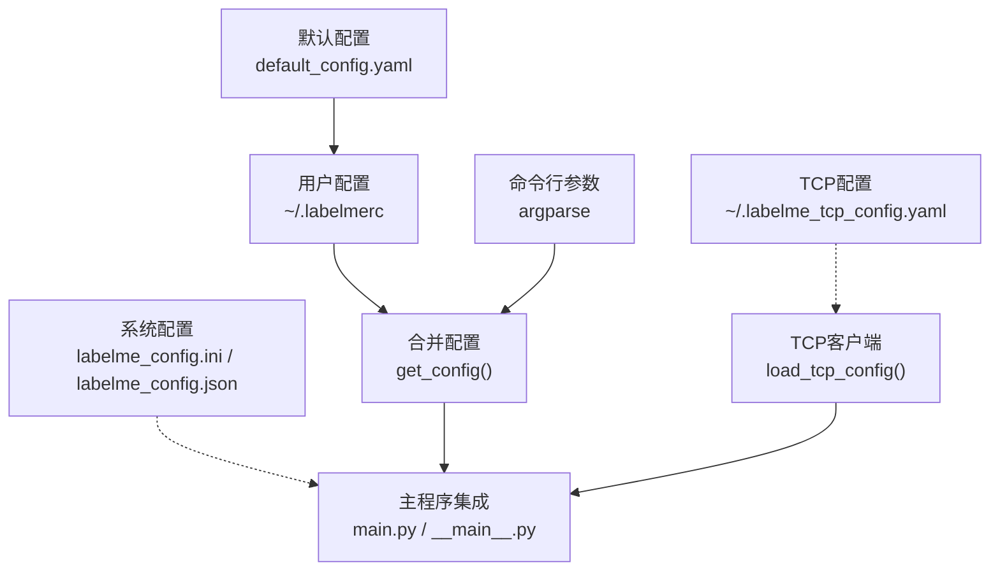
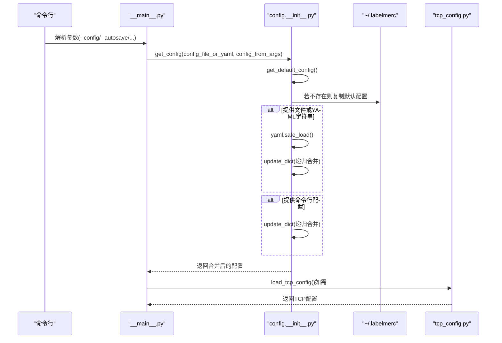
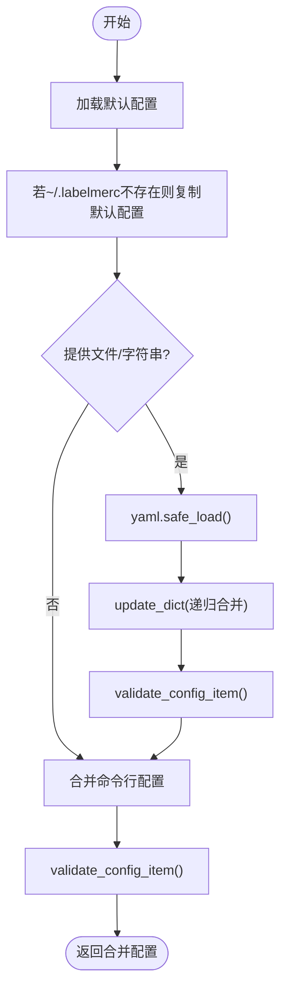
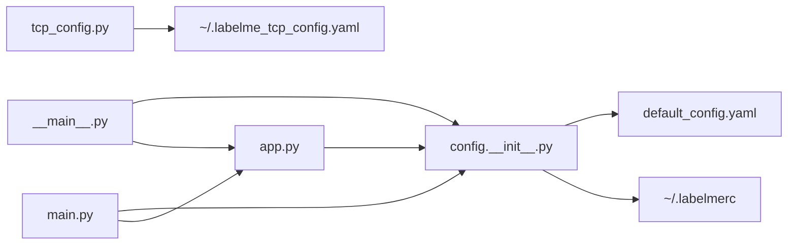

# 配置API

<cite>
**本文引用的文件**
- [labelme\config\default_config.yaml](file://labelme\config\default_config.yaml)
- [labelme\config\__init__.py](file://labelme\config\__init__.py)
- [labelme\tcp_config.py](file://labelme\tcp_config.py)
- [labelme\labelme_config.ini](file://labelme\labelme_config.ini)
- [labelme\labelme_config.json](file://labelme\labelme_config.json)
- [labelme\__main__.py](file://labelme\__main__.py)
- [labelme\app.py](file://labelme\app.py)
- [labelme\main.py](file://labelme\main.py)
</cite>

## 目录
1. [简介](#简介)
2. [项目结构](#项目结构)
3. [核心组件](#核心组件)
4. [架构总览](#架构总览)
5. [详细组件分析](#详细组件分析)
6. [依赖分析](#依赖分析)
7. [性能考虑](#性能考虑)
8. [故障排查指南](#故障排查指南)
9. [结论](#结论)
10. [附录](#附录)

## 简介
本文件为 labelme 配置系统的完整 API 文档，覆盖默认配置、用户配置、命令行配置、TCP 配置以及与主程序的集成方式。内容包括：
- 配置文件结构与格式（YAML/INI/JSON）
- 参数类型、默认值、有效范围与相互依赖
- 配置加载机制、优先级与动态更新
- 验证规则、错误处理与回退策略
- 配置迁移、版本兼容性与最佳实践
- 配置模板与示例

## 项目结构
labelme 的配置体系由以下几类文件构成：
- 默认配置：内置默认 YAML 配置，定义所有可用键及其默认值
- 用户配置：位于用户主目录的 .labelmerc，首次运行时由默认配置复制而来
- 命令行配置：通过 CLI 参数覆盖默认与用户配置
- TCP 配置：独立的 .labelme_tcp_config.yaml，用于 TCP 客户端通信
- 系统配置：labelme_config.ini（服务监听）、labelme_config.json（应用参数）

图表来源
- [labelme\config\default_config.yaml:1-147](file://labelme\config\default_config.yaml#L1-L147)
- [labelme\config\__init__.py:104-147](file://labelme\config\__init__.py#L104-L147)
- [labelme\tcp_config.py:14-107](file://labelme\tcp_config.py#L14-L107)
- [labelme\labelme_config.ini:1-5](file://labelme\labelme_config.ini#L1-L5)
- [labelme\labelme_config.json:1-5](file://labelme\labelme_config.json#L1-L5)
- [labelme\__main__.py:155-258](file://labelme\__main__.py#L155-L258)
- [labelme\main.py:249-249](file://labelme\main.py#L249-L249)

章节来源
- [labelme\config\default_config.yaml:1-147](file://labelme\config\default_config.yaml#L1-L147)
- [labelme\config\__init__.py:104-147](file://labelme\config\__init__.py#L104-L147)
- [labelme\tcp_config.py:14-107](file://labelme\tcp_config.py#L14-L107)
- [labelme\labelme_config.ini:1-5](file://labelme\labelme_config.ini#L1-L5)
- [labelme\labelme_config.json:1-5](file://labelme\labelme_config.json#L1-L5)
- [labelme\__main__.py:155-258](file://labelme\__main__.py#L155-L258)
- [labelme\main.py:249-249](file://labelme\main.py#L249-L249)

## 核心组件
- 配置加载与合并：get_config() 按优先级合并默认、文件/字符串、命令行配置
- 配置验证：validate_config_item() 对关键键值进行合法性校验
- TCP 配置：独立的 TCP 客户端配置文件，含回退与完整性校验
- CLI 参数：解析并注入配置，支持覆盖默认行为
- 主程序集成：主窗口与主程序均通过配置驱动 UI 行为

章节来源
- [labelme\config\__init__.py:104-147](file://labelme\config\__init__.py#L104-L147)
- [labelme\config\__init__.py:77-102](file://labelme\config\__init__.py#L77-L102)
- [labelme\tcp_config.py:40-107](file://labelme\tcp_config.py#L40-L107)
- [labelme\__main__.py:137-258](file://labelme\__main__.py#L137-L258)
- [labelme\app.py:117-200](file://labelme\app.py#L117-L200)

## 架构总览
配置系统采用“默认配置 → 用户配置 → 命令行配置”的三层合并策略；TCP 配置独立于主配置，按需加载。

图表来源
- [labelme\__main__.py:137-258](file://labelme\__main__.py#L137-L258)
- [labelme\config\__init__.py:42-74](file://labelme\config\__init__.py#L42-L74)
- [labelme\config\__init__.py:104-147](file://labelme\config\__init__.py#L104-L147)
- [labelme\tcp_config.py:40-107](file://labelme\tcp_config.py#L40-L107)

## 详细组件分析

### 默认配置（default_config.yaml）
- 作用：定义所有可用配置键及默认值
- 结构要点：
  - 基本功能：auto_save、display_label_popup、store_data、logger_level 等
  - 标签与标志：flags、label_flags、labels、sort_labels、validate_label
  - 颜色：default_shape_color、shape_color、label_colors
  - 形状样式：shape 下的 line_color、fill_color、vertex_fill_color、select_*、point_size
  - AI：ai.default
  - 停靠窗口：flag_dock、label_dock、shape_dock、file_dock 的 show/closable/movable/floatable
  - 标签对话框：show_label_text_field、label_completion、fit_to_content
  - 画布：epsilon、canvas.fill_drawing、double_click、num_backups、crosshair 模式开关
  - 快捷键：shortcuts 下的文件操作、导航、缩放、绘图工具、显示控制等

章节来源
- [labelme\config\default_config.yaml:5-147](file://labelme\config\default_config.yaml#L5-L147)

### 用户配置（~/.labelmerc）
- 生成机制：首次运行时由默认配置复制而来
- 用途：持久化用户偏好，覆盖默认配置
- 位置：用户主目录下的 .labelmerc

章节来源
- [labelme\config\__init__.py:66-74](file://labelme\config\__init__.py#L66-L74)

### 命令行配置（CLI 参数）
- 支持覆盖项：--config、--autosave、--nodata、--nosortlabels、--flags、--labelflags、--labels、--validatelabel、--keep-prev、--epsilon 等
- 合并策略：作为 config_from_args 注入 get_config()

章节来源
- [labelme\__main__.py:137-258](file://labelme\__main__.py#L137-L258)

### 配置合并与验证（config.__init__.py）
- get_default_config()：加载默认配置并复制到用户目录
- update_dict()：递归合并字典，支持嵌套键
- validate_config_item()：对 validate_label、shape_color、labels 等进行校验
- get_config()：按优先级合并（默认 → 文件/字符串 → 命令行），并调用验证

图表来源
- [labelme\config\__init__.py:42-74](file://labelme\config\__init__.py#L42-L74)
- [labelme\config\__init__.py:14-37](file://labelme\config\__init__.py#L14-L37)
- [labelme\config\__init__.py:77-102](file://labelme\config\__init__.py#L77-L102)
- [labelme\config\__init__.py:104-147](file://labelme\config\__init__.py#L104-L147)

章节来源
- [labelme\config\__init__.py:14-37](file://labelme\config\__init__.py#L14-L37)
- [labelme\config\__init__.py:77-102](file://labelme\config\__init__.py#L77-L102)
- [labelme\config\__init__.py:104-147](file://labelme\config\__init__.py#L104-L147)

### TCP 配置（~/.labelme_tcp_config.yaml）
- 用途：TCP 客户端通信参数（host、port、message、interval、reconnect_interval）
- 加载策略：若不存在则创建并写入默认值；若字段缺失则用默认值补齐；异常时回退默认配置
- 保存策略：安全写入 YAML，确保目录存在

章节来源
- [labelme\tcp_config.py:14-107](file://labelme\tcp_config.py#L14-L107)

### 主程序集成
- 主程序（__main__.py）解析 CLI 并调用 get_config()，再创建 MainWindow
- 嵌入式主程序（main.py）在创建 Labelme 主窗口时传入配置
- 主窗口（app.py）读取配置并应用于 UI（如颜色、快捷键、自动保存等）

章节来源
- [labelme\__main__.py:137-258](file://labelme\__main__.py#L137-L258)
- [labelme\main.py:249-249](file://labelme\main.py#L249-L249)
- [labelme\app.py:117-200](file://labelme\app.py#L117-L200)

## 依赖分析
- 配置模块依赖：yaml、loguru、os、shutil
- 主程序依赖：config.get_config、tcp_config.load_tcp_config
- 配置键之间的依赖关系：
  - validate_label 与 labels 需配合使用（当启用严格校验时必须提供标签集）
  - shape_color 取值受限（null/auto/manual）
  - labels 不允许重复

图表来源
- [labelme\config\__init__.py:1-148](file://labelme\config\__init__.py#L1-L148)
- [labelme\config\default_config.yaml:1-147](file://labelme\config\default_config.yaml#L1-L147)
- [labelme\__main__.py:137-258](file://labelme\__main__.py#L137-L258)
- [labelme\main.py:249-249](file://labelme\main.py#L249-L249)
- [labelme\app.py:117-200](file://labelme\app.py#L117-L200)
- [labelme\tcp_config.py:14-107](file://labelme\tcp_config.py#L14-L107)

章节来源
- [labelme\config\__init__.py:1-148](file://labelme\config\__init__.py#L1-L148)
- [labelme\__main__.py:137-258](file://labelme\__main__.py#L137-L258)
- [labelme\main.py:249-249](file://labelme\main.py#L249-L249)
- [labelme\app.py:117-200](file://labelme\app.py#L117-L200)
- [labelme\tcp_config.py:14-107](file://labelme\tcp_config.py#L14-L107)

## 性能考虑
- 配置加载仅在应用启动时执行一次，成本极低
- update_dict 递归合并为 O(N)（N 为键数量），通常开销可忽略
- TCP 配置文件读写为 IO 操作，建议避免频繁写入
- 建议将高频变更项（如自动保存、标签弹窗）通过命令行或用户配置进行最小化修改

## 故障排查指南
- 配置文件格式错误
  - 现象：加载失败并记录错误日志
  - 处理：检查 YAML 语法，确保缩进与字符编码正确
- 配置键不存在或拼写错误
  - 现象：跳过未知键并告警
  - 处理：核对键名，参考默认配置文件
- 标签校验失败
  - 现象：启用 validate_label 且未提供 labels 时报错
  - 处理：提供 --labels 或在配置中设置 labels
- TCP 配置异常
  - 现象：加载失败或字段缺失
  - 处理：删除损坏文件，系统将重建默认配置

章节来源
- [labelme\config\__init__.py:59-64](file://labelme\config\__init__.py#L59-L64)
- [labelme\config\__init__.py:133-141](file://labelme\config\__init__.py#L133-L141)
- [labelme\config\__init__.py:28-30](file://labelme\config\__init__.py#L28-L30)
- [labelme\config\__init__.py:90-101](file://labelme\config\__init__.py#L90-L101)
- [labelme\__main__.py:260-266](file://labelme\__main__.py#L260-L266)
- [labelme\tcp_config.py:58-78](file://labelme\tcp_config.py#L58-L78)

## 结论
labelme 的配置系统以 YAML 为主、INI/JSON 为辅，采用“默认 → 用户 → 命令行”的分层合并策略，并提供严格的键值校验与回退机制。通过 CLI 与主程序的紧密集成，用户可灵活定制标注体验，同时保证配置的可维护性与稳定性。

## 附录

### 配置参数总览与约束
- 基本功能
  - auto_save: 布尔，影响保存行为
  - display_label_popup: 布尔，控制标签弹窗显示
  - store_data: 布尔，控制是否存储图像数据到 JSON
  - keep_prev/keep_prev_scale/keep_prev_brightness/keep_prev_contrast: 布尔，保持上一文件状态
  - logger_level: 字符串，日志级别（debug/info/warning/error/fatal）
- 标签与标志
  - flags/label_flags: 字典/列表，标签相关元数据
  - labels: 列表，标签集合，不可重复
  - sort_labels: 布尔，是否排序
  - validate_label: null 或 "exact"，启用严格校验时需提供 labels
- 颜色
  - default_shape_color: RGB/RGBA 列表
  - shape_color: null/auto/manual
  - label_colors: 字典，标签到颜色的映射
- 形状样式
  - shape.line_color/shape.fill_color/shape.vertex_fill_color/shape.select_line_color/shape.select_fill_color/shape.hvertex_fill_color: RGBA 列表
  - shape.point_size: 数值，点的大小
- AI
  - ai.default: 字符串，AI 模型默认值
- 停靠窗口
  - flag_dock/label_dock/shape_dock/file_dock: 包含 show/closable/movable/floatable 布尔字段
- 标签对话框
  - show_label_text_field: 布尔
  - label_completion: 字符串，自动完成模式
  - fit_to_content.column/row: 布尔
- 画布
  - epsilon: 数值，选择精度
  - canvas.fill_drawing: 布尔
  - double_click: 操作类型（如 close）
  - num_backups: 数值，备份数量
  - crosshair.polygon/rectangle/circle/line/point/linestrip/ai_polygon/ai_mask: 布尔
- 快捷键
  - shortcuts.*: 键盘组合或数组，覆盖默认快捷键

章节来源
- [labelme\config\default_config.yaml:5-147](file://labelme\config\default_config.yaml#L5-L147)
- [labelme\config\__init__.py:90-101](file://labelme\config\__init__.py#L90-L101)

### 配置加载优先级与规则
- 优先级：默认配置 < 用户配置（~/.labelmerc） < 命令行配置
- 合并方式：字典递归合并，未知键会被跳过并告警
- 校验时机：每次合并时对关键键进行校验

章节来源
- [labelme\config\__init__.py:14-37](file://labelme\config\__init__.py#L14-L37)
- [labelme\config\__init__.py:104-147](file://labelme\config\__init__.py#L104-L147)

### 动态更新接口
- 用户可通过修改 ~/.labelmerc 实现静态更新
- 命令行参数可在启动时动态覆盖
- TCP 配置可通过 save_tcp_config() 写入新值

章节来源
- [labelme\config\__init__.py:66-74](file://labelme\config\__init__.py#L66-L74)
- [labelme\config\__init__.py:104-147](file://labelme\config\__init__.py#L104-L147)
- [labelme\tcp_config.py:81-107](file://labelme\tcp_config.py#L81-L107)

### 配置验证与回退
- validate_label 仅允许 null 或 "exact"
- shape_color 仅允许 null、"auto"、"manual"
- labels 不允许重复
- TCP 配置缺失字段使用默认值回退

章节来源
- [labelme\config\__init__.py:90-101](file://labelme\config\__init__.py#L90-L101)
- [labelme\tcp_config.py:66-72](file://labelme\tcp_config.py#L66-L72)

### 配置模板与示例
- 默认配置模板：参见默认配置文件
- 用户配置模板：首次运行后生成 ~/.labelmerc
- TCP 配置模板：参见 TCP 配置模块默认值
- 系统配置示例：labelme_config.ini（服务监听）、labelme_config.json（应用参数）

章节来源
- [labelme\config\default_config.yaml:1-147](file://labelme\config\default_config.yaml#L1-L147)
- [labelme\config\__init__.py:66-74](file://labelme\config\__init__.py#L66-L74)
- [labelme\tcp_config.py:24-37](file://labelme\tcp_config.py#L24-L37)
- [labelme\labelme_config.ini:1-5](file://labelme\labelme_config.ini#L1-L5)
- [labelme\labelme_config.json:1-5](file://labelme\labelme_config.json#L1-L5)

### 版本兼容性与迁移
- 语义化版本：遵循语义化版本规范
- 兼容性：新增键不影响旧配置；删除键时应提供回退策略（如 TCP 配置的字段补齐）
- 迁移建议：升级前备份 ~/.labelmerc；新增键请在用户配置中显式声明

章节来源
- [labelme\labelme\__init__.py:8-17](file://labelme\labelme\__init__.py#L8-L17)
- [labelme\tcp_config.py:66-72](file://labelme\tcp_config.py#L66-L72)