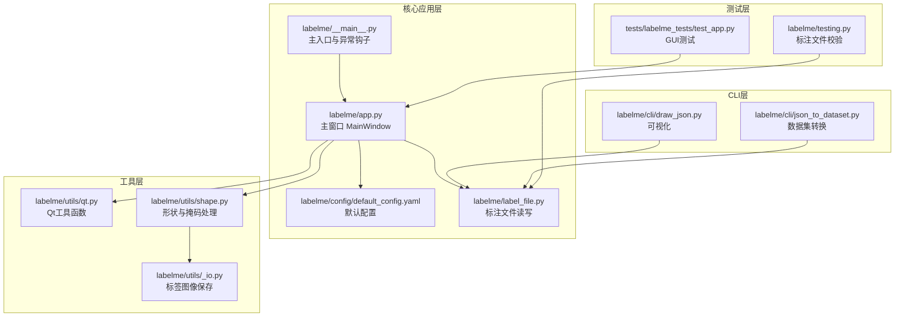
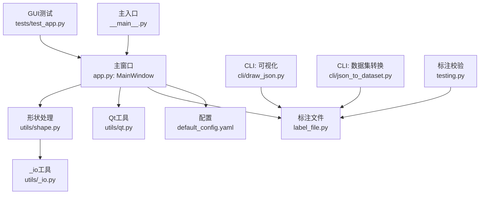
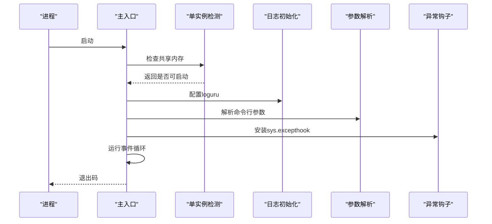
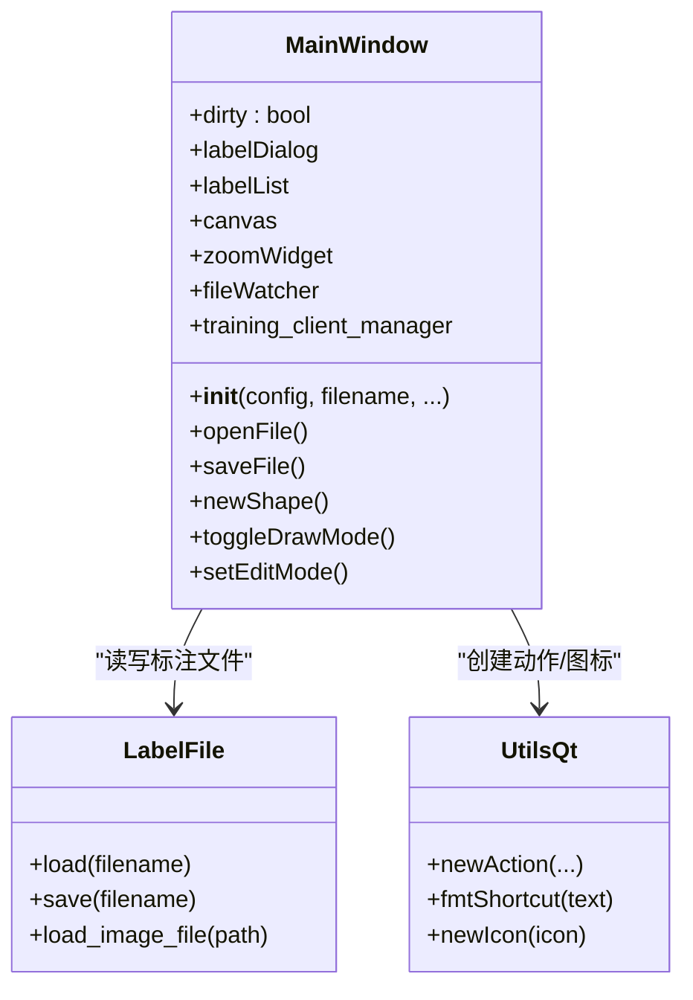
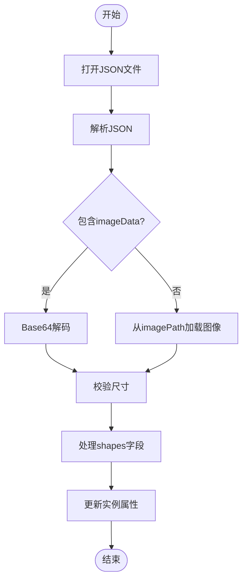
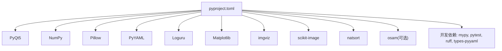

# 代码规范与最佳实践

<cite>
**本文档引用的文件**
- [labelme\labelme\__init__.py](file://labelme/labelme/__init__.py)
- [labelme\labelme\__main__.py](file://labelme/labelme/__main__.py)
- [labelme\labelme\app.py](file://labelme/labelme/app.py)
- [labelme\labelme\config\default_config.yaml](file://labelme/labelme/config/default_config.yaml)
- [labelme\labelme\label_file.py](file://labelme/labelme/label_file.py)
- [labelme\labelme\utils\qt.py](file://labelme/labelme/utils/qt.py)
- [labelme\labelme\utils\shape.py](file://labelme/labelme/utils/shape.py)
- [labelme\labelme\utils\_io.py](file://labelme/labelme/utils/_io.py)
- [labelme\labelme\cli\draw_json.py](file://labelme/labelme/cli/draw_json.py)
- [labelme\labelme\cli\json_to_dataset.py](file://labelme/labelme/cli/json_to_dataset.py)
- [labelme\pyproject.toml](file://labelme/pyproject.toml)
- [labelme\tests\labelme_tests\test_app.py](file://labelme/tests/labelme_tests/test_app.py)
- [labelme\labelme\testing.py](file://labelme/labelme/testing.py)
- [labelme\README.md](file://labelme/README.md)
</cite>

## 目录
1. [简介](#简介)
2. [项目结构](#项目结构)
3. [核心组件](#核心组件)
4. [架构总览](#架构总览)
5. [详细组件分析](#详细组件分析)
6. [依赖关系分析](#依赖关系分析)
7. [性能考虑](#性能考虑)
8. [故障排查指南](#故障排查指南)
9. [结论](#结论)
10. [附录](#附录)

## 简介
本指南面向参与 Labelme 项目的开发者，系统梳理并提炼该项目的 Python 编码规范与最佳实践，覆盖命名约定、缩进与注释、文档字符串、模块划分、类设计、函数定义、日志记录、错误处理、异常管理、性能优化、内存与资源管理、代码审查清单与质量流程、跨平台兼容性与常见陷阱等内容。内容来源于仓库中的实际源码与配置文件，确保可落地、可复用。

## 项目结构
项目采用“功能域+层次”相结合的组织方式：
- 核心应用层：主入口、主窗口、配置与文件处理
- 工具层：Qt 工具函数、形状处理、I/O 工具
- CLI 层：命令行工具，用于可视化与数据集转换
- 测试层：GUI 与标注文件校验测试
- 配置层：默认配置 YAML

**图表来源**
- [labelme\labelme\__main__.py:1-359](file://labelme/labelme/__main__.py#L1-L359)
- [labelme\labelme\app.py:1-800](file://labelme/labelme/app.py#L1-L800)
- [labelme\labelme\config\default_config.yaml:1-147](file://labelme/labelme/config/default_config.yaml#L1-L147)
- [labelme\labelme\label_file.py:1-200](file://labelme/labelme/label_file.py#L1-L200)
- [labelme\labelme\utils\qt.py:1-214](file://labelme/labelme/utils/qt.py#L1-L214)
- [labelme\labelme\utils\shape.py:1-233](file://labelme/labelme/utils/shape.py#L1-L233)
- [labelme\labelme\utils\_io.py:1-27](file://labelme/labelme/utils/_io.py#L1-L27)
- [labelme\labelme\cli\draw_json.py:1-68](file://labelme/labelme/cli/draw_json.py#L1-L68)
- [labelme\labelme\cli\json_to_dataset.py:1-101](file://labelme/labelme/cli/json_to_dataset.py#L1-L101)
- [labelme\tests\labelme_tests\test_app.py:1-115](file://labelme/tests/labelme_tests/test_app.py#L1-L115)
- [labelme\labelme\testing.py:1-35](file://labelme/labelme/testing.py#L1-L35)

**章节来源**
- [labelme\labelme\__main__.py:1-359](file://labelme/labelme/__main__.py#L1-L359)
- [labelme\labelme\app.py:1-800](file://labelme/labelme/app.py#L1-L800)
- [labelme\labelme\config\default_config.yaml:1-147](file://labelme/labelme/config/default_config.yaml#L1-L147)
- [labelme\labelme\label_file.py:1-200](file://labelme/labelme/label_file.py#L1-L200)
- [labelme\labelme\utils\qt.py:1-214](file://labelme/labelme/utils/qt.py#L1-L214)
- [labelme\labelme\utils\shape.py:1-233](file://labelme/labelme/utils/shape.py#L1-L233)
- [labelme\labelme\utils\_io.py:1-27](file://labelme/labelme/utils/_io.py#L1-L27)
- [labelme\labelme\cli\draw_json.py:1-68](file://labelme/labelme/cli/draw_json.py#L1-L68)
- [labelme\labelme\cli\json_to_dataset.py:1-101](file://labelme/labelme/cli/json_to_dataset.py#L1-L101)
- [labelme\tests\labelme_tests\test_app.py:1-115](file://labelme/tests/labelme_tests/test_app.py#L1-L115)
- [labelme\labelme\testing.py:1-35](file://labelme/labelme/testing.py#L1-L35)

## 核心组件
- 主入口与异常处理：负责参数解析、单实例检测、日志初始化、全局异常钩子与事件循环
- 主窗口 MainWindow：GUI 核心，管理 UI 布局、文件操作、标注工具、AI 功能、TCP 通信、文件监控与状态保存
- 配置系统：默认配置 YAML，集中管理 UI、快捷键、颜色、形状样式、AI 模型等
- 标注文件处理：统一的 JSON 格式读写、图像数据编解码、尺寸校验
- 工具函数：Qt 组件创建与管理、几何计算、形状到掩码转换、标签图像保存
- CLI 工具：可视化标注结果、将 JSON 转换为数据集格式
- 测试与校验：GUI 测试、标注文件完整性校验

**章节来源**
- [labelme\labelme\__main__.py:137-359](file://labelme/labelme/__main__.py#L137-L359)
- [labelme\labelme\app.py:99-800](file://labelme/labelme/app.py#L99-L800)
- [labelme\labelme\config\default_config.yaml:1-147](file://labelme/labelme/config/default_config.yaml#L1-L147)
- [labelme\labelme\label_file.py:103-200](file://labelme/labelme/label_file.py#L103-L200)
- [labelme\labelme\utils\qt.py:18-214](file://labelme/labelme/utils/qt.py#L18-L214)
- [labelme\labelme\utils\shape.py:41-233](file://labelme/labelme/utils/shape.py#L41-L233)
- [labelme\labelme\utils\_io.py:10-27](file://labelme/labelme/utils/_io.py#L10-L27)
- [labelme\labelme\cli\draw_json.py:16-68](file://labelme/labelme/cli/draw_json.py#L16-L68)
- [labelme\labelme\cli\json_to_dataset.py:19-101](file://labelme/labelme/cli/json_to_dataset.py#L19-L101)
- [labelme\tests\labelme_tests\test_app.py:25-115](file://labelme/tests/labelme_tests/test_app.py#L25-L115)
- [labelme\labelme\testing.py:9-35](file://labelme/labelme/testing.py#L9-L35)

## 架构总览
Labelme 采用 PyQt5 GUI + 命令行工具 + 标注文件处理的分层架构。主入口负责环境准备与异常捕获；主窗口承载业务逻辑；工具模块提供通用能力；CLI 作为数据处理与验证的补充；测试保障核心流程稳定。

**图表来源**
- [labelme\labelme\__main__.py:1-359](file://labelme/labelme/__main__.py#L1-L359)
- [labelme\labelme\app.py:1-800](file://labelme/labelme/app.py#L1-L800)
- [labelme\labelme\config\default_config.yaml:1-147](file://labelme/labelme/config/default_config.yaml#L1-L147)
- [labelme\labelme\label_file.py:1-200](file://labelme/labelme/label_file.py#L1-L200)
- [labelme\labelme\utils\qt.py:1-214](file://labelme/labelme/utils/qt.py#L1-L214)
- [labelme\labelme\utils\shape.py:1-233](file://labelme/labelme/utils/shape.py#L1-L233)
- [labelme\labelme\utils\_io.py:1-27](file://labelme/labelme/utils/_io.py#L1-L27)
- [labelme\labelme\cli\draw_json.py:1-68](file://labelme/labelme/cli/draw_json.py#L1-L68)
- [labelme\labelme\cli\json_to_dataset.py:1-101](file://labelme/labelme/cli/json_to_dataset.py#L1-L101)
- [labelme\tests\labelme_tests\test_app.py:1-115](file://labelme/tests/labelme_tests/test_app.py#L1-L115)
- [labelme\labelme\testing.py:1-35](file://labelme/labelme/testing.py#L1-L35)

## 详细组件分析

### 主入口与异常处理（__main__.py）
- 单实例检测：使用 QSharedMemory 实现跨平台互斥，避免重复启动
- 日志初始化：基于 loguru 的多处理器配置，支持标准输出与文件落盘、轮转与压缩
- 参数解析：argparse 定义丰富的命令行参数，支持配置文件、输出路径、标签与标志等
- 全局异常钩子：捕获未处理异常并弹窗提示，同时记录详细堆栈
- 事件循环：使用 contextlib.redirect_stderr 与 logger.catch 包裹主循环，确保异常被捕获与记录

**图表来源**
- [labelme\labelme\__main__.py:29-57](file://labelme/labelme/__main__.py#L29-L57)
- [labelme\labelme\__main__.py:69-97](file://labelme/labelme/__main__.py#L69-L97)
- [labelme\labelme\__main__.py:137-223](file://labelme/labelme/__main__.py#L137-L223)
- [labelme\labelme\__main__.py:306-331](file://labelme/labelme/__main__.py#L306-L331)

**章节来源**
- [labelme\labelme\__main__.py:29-57](file://labelme/labelme/__main__.py#L29-L57)
- [labelme\labelme\__main__.py:69-97](file://labelme/labelme/__main__.py#L69-L97)
- [labelme\labelme\__main__.py:137-223](file://labelme/labelme/__main__.py#L137-L223)
- [labelme\labelme\__main__.py:306-331](file://labelme/labelme/__main__.py#L306-L331)

### 主窗口 MainWindow（app.py）
- 组合与职责：集中管理 UI 组件、文件系统监控、标注工具、AI 与 TCP 通信、训练面板、状态保存
- 初始化流程：配置注入、颜色与点大小设置、延迟显示避免闪烁、Dock 窗口布局与可见性控制
- 信号与槽：画布事件、文件选择、缩放与滚动、标注增删改等
- 便捷工具：大量使用 utils.newAction 与 fmtShortcut 统一快捷键与 UI 行为

**图表来源**
- [labelme\labelme\app.py:99-800](file://labelme/labelme/app.py#L99-L800)
- [labelme\labelme\label_file.py:103-200](file://labelme/labelme/label_file.py#L103-L200)
- [labelme\labelme\utils\qt.py:56-106](file://labelme/labelme/utils/qt.py#L56-L106)

**章节来源**
- [labelme\labelme\app.py:99-800](file://labelme/labelme/app.py#L99-L800)
- [labelme\labelme\label_file.py:103-200](file://labelme/labelme/label_file.py#L103-L200)
- [labelme\labelme\utils\qt.py:56-106](file://labelme/labelme/utils/qt.py#L56-L106)

### 配置系统（default_config.yaml）
- 结构化配置：包含自动保存、标签与标志、颜色、形状样式、AI、Dock 窗口、画布、快捷键等
- 可扩展性：通过 YAML 键值对扩展新功能开关与默认值
- 与代码耦合：app.py 与 __main__.py 通过 get_config 读取并应用配置

**章节来源**
- [labelme\labelme\config\default_config.yaml:1-147](file://labelme/labelme/config/default_config.yaml#L1-L147)

### 标注文件处理（label_file.py）
- 文件上下文：统一使用 UTF-8 打开，避免编码问题
- 图像加载：Pillow 打开并应用 EXIF 方向，支持 JPEG/PNG 格式
- 数据校验：严格检查图像尺寸与标注点坐标范围
- 异常封装：LabelFileError 作为统一异常类型

**图表来源**
- [labelme\labelme\label_file.py:103-193](file://labelme/labelme/label_file.py#L103-L193)

**章节来源**
- [labelme\labelme\label_file.py:16-31](file://labelme/labelme/label_file.py#L16-L31)
- [labelme\labelme\label_file.py:72-102](file://labelme/labelme/label_file.py#L72-L102)
- [labelme\labelme\label_file.py:103-193](file://labelme/labelme/label_file.py#L103-L193)

### 工具函数（utils）
- Qt 工具：newIcon/newButton/newAction/addActions/labelValidator/struct/distance/distancetoline/fmtShortcut
- 形状处理：shape_to_mask/shapes_to_label/masks_to_bboxes（含类型注解与断言）
- I/O 工具：lblsave（PNG 标签保存，含格式与取值范围校验）

**章节来源**
- [labelme\labelme\utils\qt.py:18-214](file://labelme/labelme/utils/qt.py#L18-L214)
- [labelme\labelme\utils\shape.py:41-233](file://labelme/labelme/utils/shape.py#L41-L233)
- [labelme\labelme\utils\_io.py:10-27](file://labelme/labelme/utils/_io.py#L10-L27)

### CLI 工具（cli）
- 可视化：读取 JSON，生成标签可视化图像，便于人工核验
- 数据集转换：将单个 JSON 转换为图像、标签、可视化与标签名文件（已弃用，建议使用导出工具）

**章节来源**
- [labelme\labelme\cli\draw_json.py:16-68](file://labelme/labelme/cli/draw_json.py#L16-L68)
- [labelme\labelme\cli\json_to_dataset.py:19-101](file://labelme/labelme/cli/json_to_dataset.py#L19-L101)

### 测试与校验（tests & testing）
- GUI 测试：使用 pytest-qt 验证 MainWindow 的打开、导航与保存流程
- 标注校验：assert_labelfile_sanity 校验 JSON 结构、图像尺寸与标注点范围

**章节来源**
- [labelme\tests\labelme_tests\test_app.py:25-115](file://labelme/tests/labelme_tests/test_app.py#L25-L115)
- [labelme\labelme\testing.py:9-35](file://labelme/labelme/testing.py#L9-L35)

## 依赖关系分析
- 语言与版本：Python >= 3.9，项目脚本与依赖在 pyproject.toml 中声明
- 关键依赖：PyQt5、NumPy、Pillow、PyYAML、Loguru、Matplotlib、imgviz、scikit-image、natsort、osam（可选）
- 开发依赖：mypy、pytest、pytest-qt、ruff、types-pyyaml

**图表来源**
- [labelme\pyproject.toml:26-53](file://labelme/pyproject.toml#L26-L53)

**章节来源**
- [labelme\pyproject.toml:1-75](file://labelme/pyproject.toml#L1-L75)

## 性能考虑
- 图像处理：Pillow 读取与 EXIF 方向修正，JPEG/PNG 保存；注意大图内存占用
- NumPy/掩码：形状到掩码与标签数组生成，尽量在必要范围内裁剪与复用数组
- GUI 渲染：MainWindow 初始化阶段设置 WA_DontShowOnScreen 避免闪烁，合理拆分 UI 组件创建
- 日志：loguru 异步写入与轮转压缩，避免阻塞主线程
- I/O：统一 UTF-8 打开，避免编码转换开销；批量保存时合并写入

[本节为通用指导，无需特定文件来源]

## 故障排查指南
- 单实例冲突：若提示“已有实例运行”，检查共享内存状态；必要时重启系统或清理僵尸进程
- 导入错误：确认自动化模块使用绝对路径导入；检查翻译文件存在性；确保配置文件为 UTF-8 without BOM
- AI 功能：osam 为可选依赖，缺失时优雅降级；确保图像尺寸与通道满足要求
- 标注文件损坏：使用 testing.assert_labelfile_sanity 校验 JSON 结构与坐标范围

**章节来源**
- [labelme\README.md:153-195](file://labelme/README.md#L153-L195)
- [labelme\labelme\__main__.py:283-289](file://labelme/labelme/__main__.py#L283-L289)
- [labelme\labelme\testing.py:9-35](file://labelme/labelme/testing.py#L9-L35)

## 结论
本指南基于仓库实际代码提炼了 Labelme 的编码规范与最佳实践，强调：
- 统一的日志与异常处理策略
- 清晰的模块划分与职责边界
- 可配置的 UI 与工具函数复用
- 严谨的标注文件校验与 I/O 规范
- 可扩展的 CLI 与测试体系

建议在团队内推广并纳入 CI/CD 流程，持续提升代码质量与一致性。

[本节为总结，无需特定文件来源]

## 附录

### Python 编码规范与最佳实践清单
- 命名约定
  - 模块与包：使用小写与下划线（如 utils、cli）
  - 类：使用 PascalCase（如 MainWindow、LabelFile）
  - 函数与方法：使用 snake_case（如 load、save）
  - 常量：使用 UPPER_CASE（如 MAX_IMAGE_PIXELS）
  - 私有成员：使用前缀下划线（如 _config）
- 缩进与格式
  - 统一使用 4 空格缩进
  - 行宽不超过 88（Ruff 默认），必要时使用括号换行
- 注释与文档字符串
  - 模块顶部添加简要说明与用途
  - 函数/方法：使用 Google/NumPy 风格文档字符串，描述参数、返回值与异常
  - 关键逻辑添加简洁注释，避免显而易见的注释
- 模块划分
  - 功能内聚：utils 聚合工具函数，cli 聚合命令行工具
  - 低耦合：app.py 通过配置与工具模块协作，避免直接耦合第三方库细节
- 类设计
  - 单一职责：MainWindow 负责 UI 与业务协调，LabelFile 负责文件读写
  - 明确接口：使用类型注解与断言约束输入输出
- 函数定义
  - 优先使用关键字参数与默认值，保持向后兼容
  - 简化复杂函数，拆分为私有辅助函数
- 日志记录
  - 使用 loguru 的结构化日志，避免 print
  - 分级记录：debug/info/warning/error/fatal
  - 文件落盘：配置轮转与压缩，保留合理天数
- 错误处理与异常管理
  - 明确异常类型：LabelFileError 等
  - 上层捕获：主入口安装全局异常钩子，记录堆栈并提示用户
  - 断言与校验：shape_to_mask 等函数使用断言与显式异常
- 性能优化
  - 避免重复 I/O：缓存图像数据与标签映射
  - 合理使用 NumPy：向量化操作，减少 Python 循环
  - GUI 优化：延迟显示与组件懒加载
- 资源清理
  - 文件句柄：使用 with 或上下文管理器
  - 图像对象：及时释放 Pillow 对象引用
  - 日志与缓存：定期清理过期日志与缓存文件
- 代码审查检查清单
  - 是否遵循命名与格式规范
  - 文档字符串是否完整
  - 是否存在硬编码路径与魔法数字
  - 是否有必要的断言与异常处理
  - 是否使用类型注解
  - 是否有潜在的内存泄漏风险
  - 是否通过 GUI 与标注文件测试
- 质量保证流程
  - 本地检查：Ruff（lint）+ mypy（类型检查）
  - 单测：pytest + pytest-qt（GUI 测试）
  - 集成测试：标注文件校验与 CLI 功能验证
- 跨平台兼容性
  - 使用 os.name/os.path 等跨平台 API
  - PyQt5 版本差异：在 pyproject.toml 中明确约束
  - 共享内存：QSharedMemory 跨平台，注意权限与清理
- 编码陷阱避免
  - 避免在 GUI 线程中执行耗时操作
  - 注意 Base64 与图像数据的编码一致性
  - 避免在循环中频繁创建大对象
  - 不要忽略异常处理分支

[本节为通用指导，无需特定文件来源]