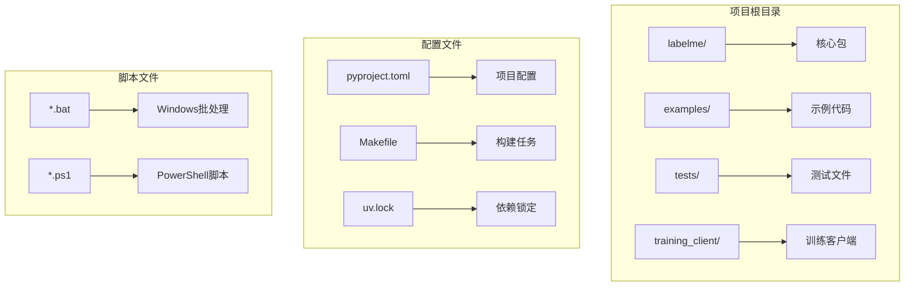
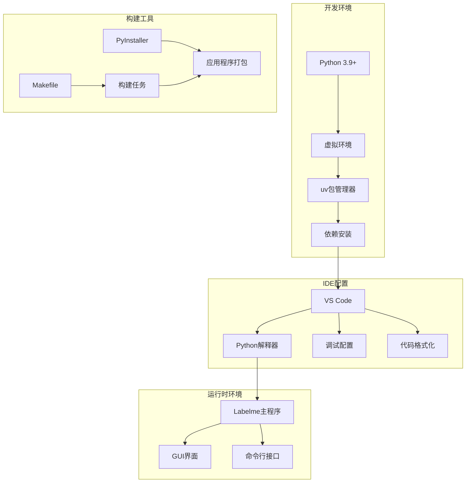
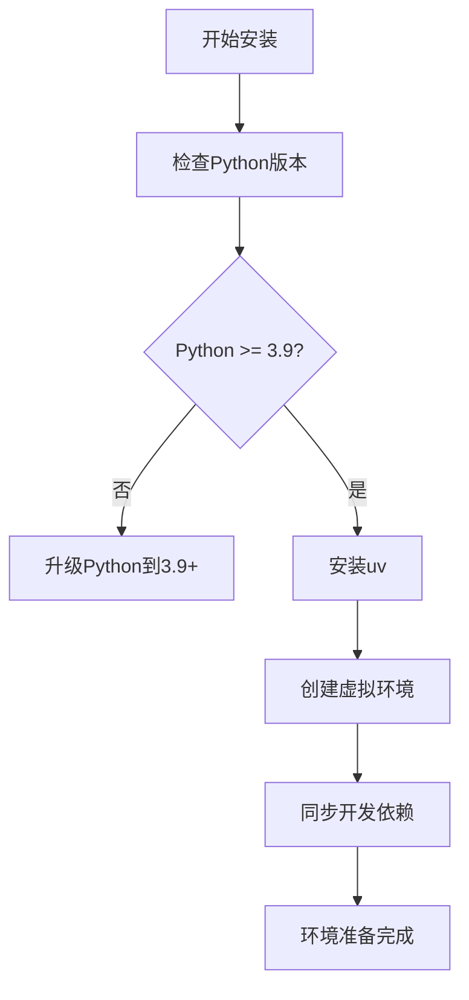
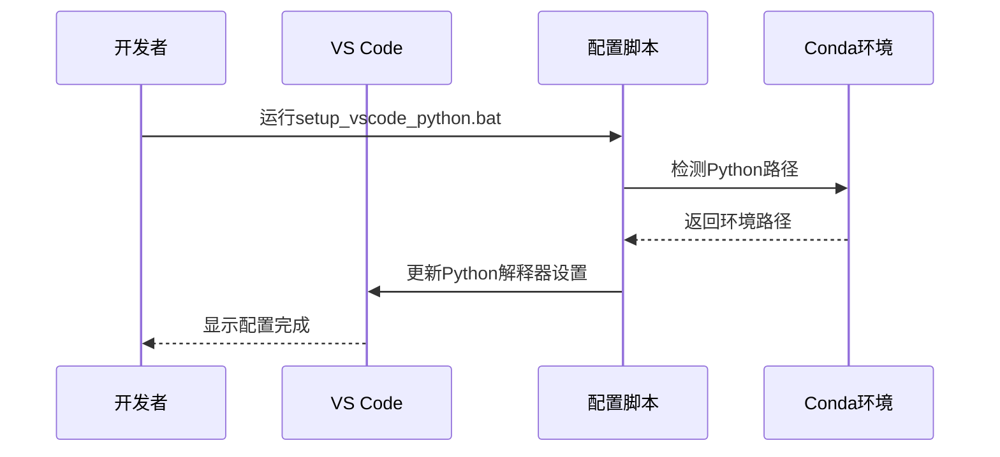
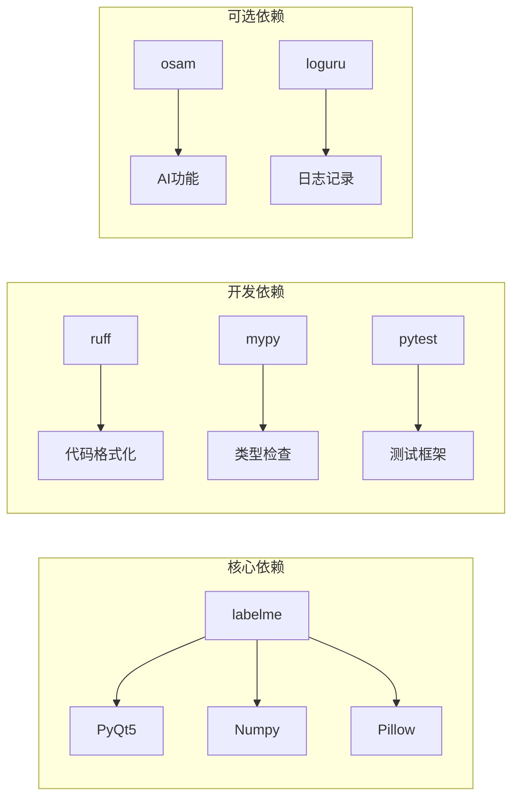
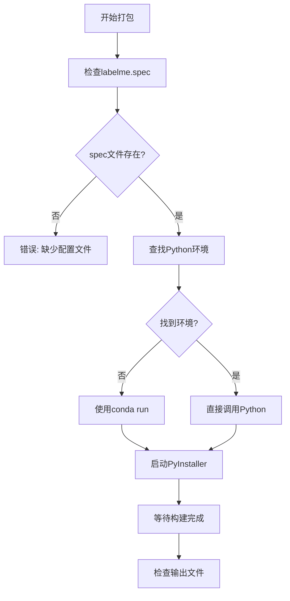
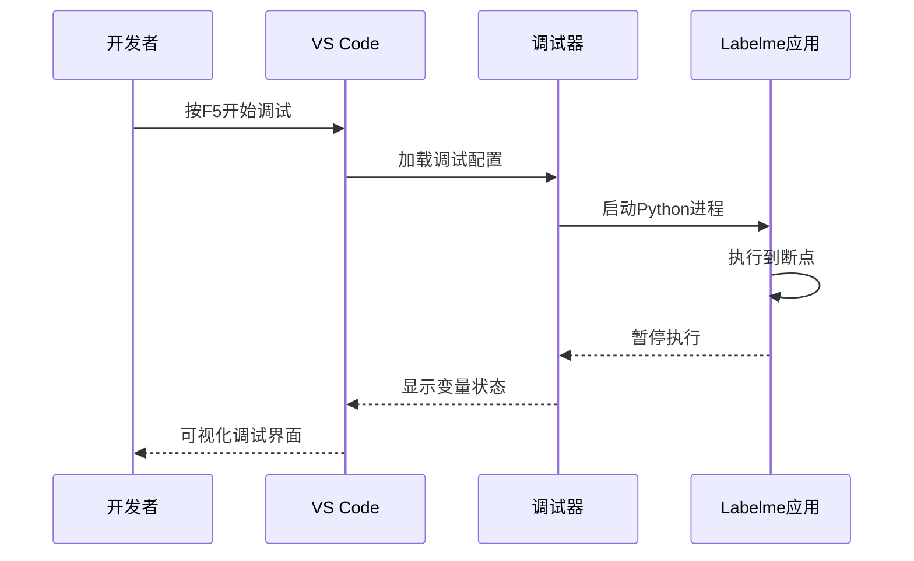
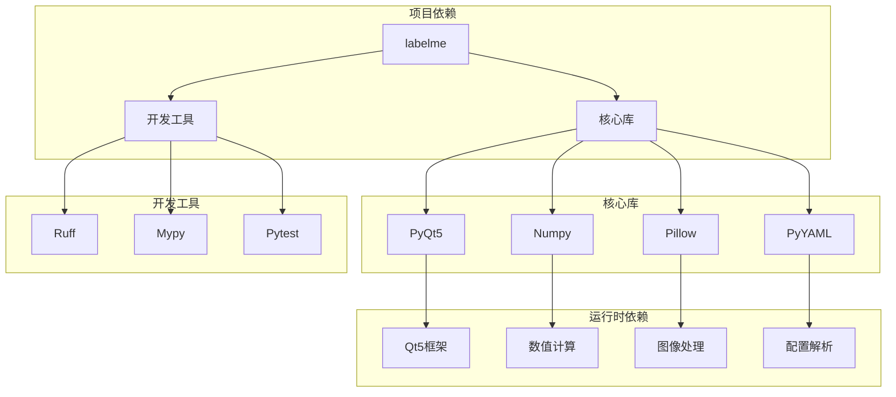

# 开发环境搭建

<cite>
**本文档引用的文件**
- [README.md](file://README.md)
- [pyproject.toml](file://pyproject.toml)
- [Makefile](file://Makefile)
- [uv.lock](file://uv.lock)
- [setup_vscode_python.bat](file://setup_vscode_python.bat)
- [setup_debug.bat](file://setup_debug.bat)
- [run_labelme.bat](file://run_labelme.bat)
- [build.ps1](file://build.ps1)
- [run_build.bat](file://run_build.bat)
- [labelme_config.json](file://labelme_config.json)
- [labelme_config.ini](file://labelme_config.ini)
</cite>

## 目录
1. [简介](#简介)
2. [项目结构](#项目结构)
3. [核心组件](#核心组件)
4. [架构概览](#架构概览)
5. [详细组件分析](#详细组件分析)
6. [依赖分析](#依赖分析)
7. [性能考虑](#性能考虑)
8. [故障排除指南](#故障排除指南)
9. [结论](#结论)

## 简介

Labelme 是一个基于 Python 的图像多边形标注工具，使用 PyQt5 构建图形界面。该项目提供了完整的开发环境搭建指南，包括 Python 环境要求、虚拟环境配置、依赖管理和 IDE 设置。

## 项目结构

项目采用标准的 Python 包结构，主要包含以下关键目录：

**图表来源**
- [pyproject.toml:1-75](file://pyproject.toml#L1-L75)
- [Makefile:1-48](file://Makefile#L1-L48)

**章节来源**
- [pyproject.toml:1-75](file://pyproject.toml#L1-L75)
- [Makefile:1-48](file://Makefile#L1-L48)

## 核心组件

### Python 环境要求

项目要求 Python 版本为 3.9 或更高版本，支持的 Python 版本范围包括 3.9 到 3.13。

**章节来源**
- [pyproject.toml:9](file://pyproject.toml#L9)

### 依赖管理系统

项目使用现代的依赖管理工具，包括：

- **uv**: 作为主要的包管理器和构建工具
- **pip**: 传统的 Python 包管理器
- **conda**: 可选的包管理器支持

**章节来源**
- [Makefile:27-28](file://Makefile#L27-L28)
- [uv.lock:1-567](file://uv.lock#L1-L567)

### 开发工具链

项目集成了多种开发工具：

- **Ruff**: 代码格式化和静态分析
- **Mypy**: 类型检查
- **Pytest**: 测试框架
- **PyInstaller**: 应用程序打包

**章节来源**
- [Makefile:30-47](file://Makefile#L30-L47)
- [pyproject.toml:46-53](file://pyproject.toml#L46-L53)

## 架构概览

**图表来源**
- [pyproject.toml:26-39](file://pyproject.toml#L26-L39)
- [Makefile:27-47](file://Makefile#L27-L47)

## 详细组件分析

### Python 环境搭建

#### 使用 uv 创建虚拟环境

**图表来源**
- [Makefile:27](file://Makefile#L27)
- [pyproject.toml:9](file://pyproject.toml#L9)

#### 传统 pip 安装方式

项目也支持使用传统的 pip 安装方式：

**章节来源**
- [README.md:56-64](file://README.md#L56-L64)

### IDE 配置指南

#### VS Code 配置

**图表来源**
- [setup_vscode_python.bat:1-108](file://setup_vscode_python.bat#L1-L108)

#### PyCharm 配置要点

虽然文档未提供 PyCharm 的具体配置，但可以遵循以下通用原则：

- **Python 解释器**: 使用 conda 环境中的 Python
- **项目结构**: 将项目根目录设为源代码根目录
- **编码设置**: 使用 UTF-8 编码
- **代码风格**: 遵循项目现有的代码格式化规则

**章节来源**
- [setup_vscode_python.bat:16-22](file://setup_vscode_python.bat#L16-L22)

### 依赖管理

#### 主要依赖关系

**图表来源**
- [pyproject.toml:26-39](file://pyproject.toml#L26-L39)
- [pyproject.toml:46-53](file://pyproject.toml#L46-L53)

**章节来源**
- [pyproject.toml:26-39](file://pyproject.toml#L26-L39)
- [uv.lock:1-567](file://uv.lock#L1-L567)

### 构建工具配置

#### Makefile 任务

| 任务名称 | 描述 | 依赖 |
|---------|------|------|
| `setup` | 设置开发环境 | `uv sync --dev` |
| `format` | 代码格式化 | `ruff format`, `ruff check --fix` |
| `lint` | 代码检查 | `ruff format --check`, `ruff check` |
| `mypy` | 类型检查 | `mypy --package labelme` |
| `check` | 综合检查 | `lint`, `mypy` |
| `test` | 运行测试 | `pytest -v tests/` |
| `build` | 构建包 | `uv build` |

**章节来源**
- [Makefile:19-47](file://Makefile#L19-L47)

#### PyInstaller 打包配置

**图表来源**
- [build.ps1:131-240](file://build.ps1#L131-L240)

**章节来源**
- [build.ps1:1-257](file://build.ps1#L1-L257)

### 调试环境设置

#### 断点调试配置

**图表来源**
- [setup_debug.bat:1-31](file://setup_debug.bat#L1-L31)

**章节来源**
- [setup_debug.bat:1-31](file://setup_debug.bat#L1-L31)

### 日志配置

项目使用 loguru 作为日志记录库，提供灵活的日志配置选项。

**章节来源**
- [pyproject.toml:28](file://pyproject.toml#L28)

## 依赖分析

### 依赖层次结构

**图表来源**
- [pyproject.toml:26-39](file://pyproject.toml#L26-L39)
- [pyproject.toml:46-53](file://pyproject.toml#L46-L53)

### 依赖版本锁定

项目使用 uv.lock 文件锁定所有依赖版本，确保开发环境的一致性。

**章节来源**
- [uv.lock:1-567](file://uv.lock#L1-L567)

## 性能考虑

### 构建优化

- **增量构建**: 使用 uv 的增量构建能力
- **缓存策略**: 利用 pip 和 conda 的缓存机制
- **并行处理**: Makefile 支持并行任务执行

### 运行时性能

- **Qt5 优化**: 使用 PyQt5 的性能优化特性
- **内存管理**: 合理的图像数据处理和内存释放
- **异步操作**: GUI 界面的异步事件处理

## 故障排除指南

### 常见问题及解决方案

#### Python 环境问题

| 问题描述 | 解决方案 |
|----------|----------|
| Python 版本过低 | 升级到 Python 3.9+ |
| 虚拟环境创建失败 | 检查 uv 安装和权限 |
| 依赖安装超时 | 更换 pip 源或网络环境 |

#### IDE 配置问题

| 问题描述 | 解决方案 |
|----------|----------|
| VS Code 无法找到 Python | 运行 `setup_vscode_python.bat` |
| 调试配置无效 | 检查 `.vscode/settings.json` |
| 代码格式化不生效 | 确认 Ruff 插件已安装 |

#### 构建问题

| 问题描述 | 解决方案 |
|----------|----------|
| PyInstaller 构建失败 | 检查 `labelme.spec` 配置 |
| 依赖冲突 | 清理 `uv.lock` 并重新同步 |
| 权限不足 | 以管理员身份运行 PowerShell |

**章节来源**
- [README.md:79-195](file://README.md#L79-L195)

### 环境诊断脚本

项目提供了多个诊断和配置脚本：

- `check_error_log.bat`: 检查错误日志
- `find_conda_python.ps1`: 查找 conda 环境路径
- `update_vscode_python_path.ps1`: 更新 VS Code Python 路径

**章节来源**
- [setup_vscode_python.bat:1-108](file://setup_vscode_python.bat#L1-L108)
- [setup_debug.bat:1-31](file://setup_debug.bat#L1-L31)

## 结论

本指南提供了 Labelme 项目的完整开发环境搭建方案，包括：

1. **Python 环境要求**: Python 3.9+ 的详细说明
2. **虚拟环境配置**: uv 和传统方法的对比
3. **依赖管理**: 现代化的依赖管理工具使用
4. **IDE 配置**: VS Code 和 PyCharm 的最佳实践
5. **构建工具**: Makefile 和 PyInstaller 的集成使用
6. **调试配置**: 断点调试和日志配置
7. **故障排除**: 常见问题的系统化解决方案

通过遵循本指南，开发者可以快速建立稳定、高效的 Labelme 开发环境，为后续的开发工作奠定坚实基础。