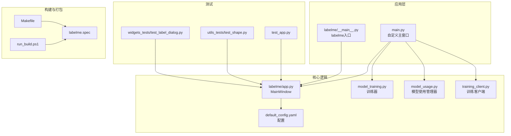
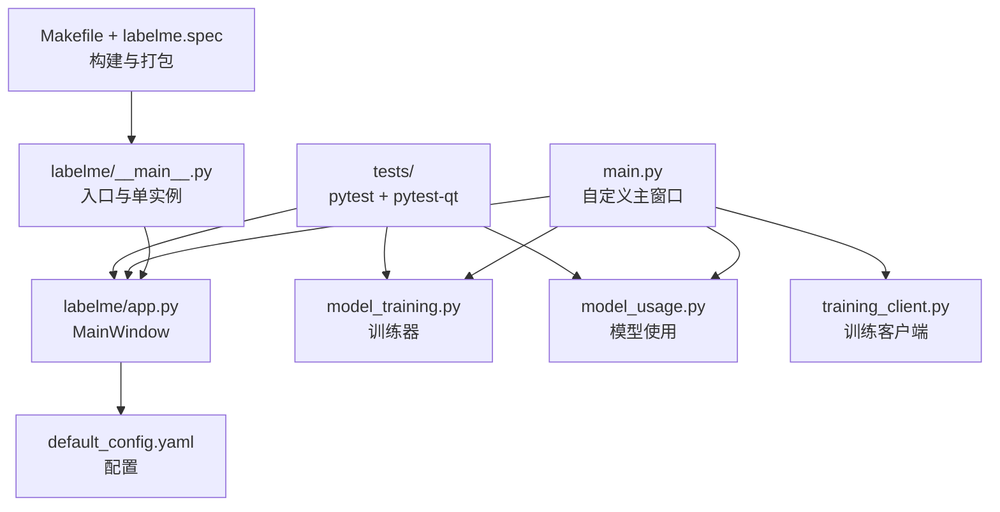
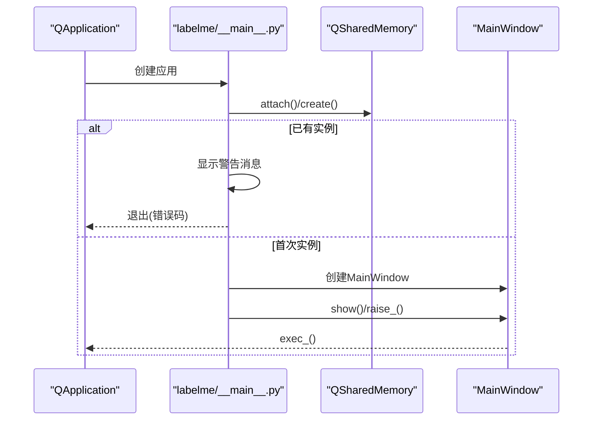
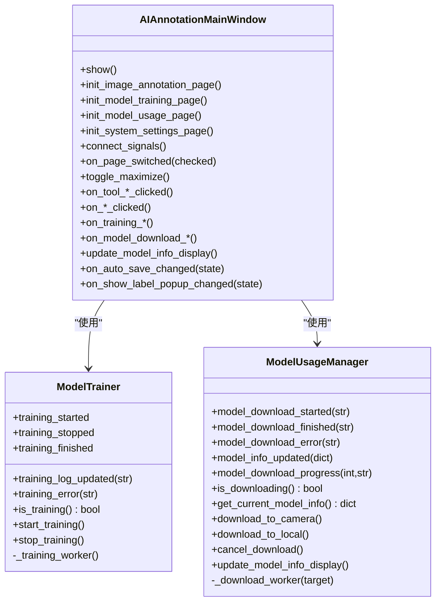
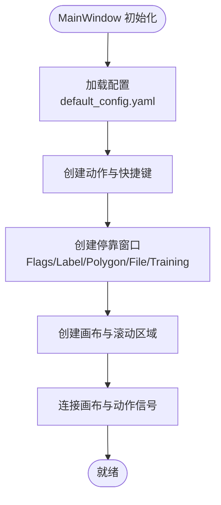
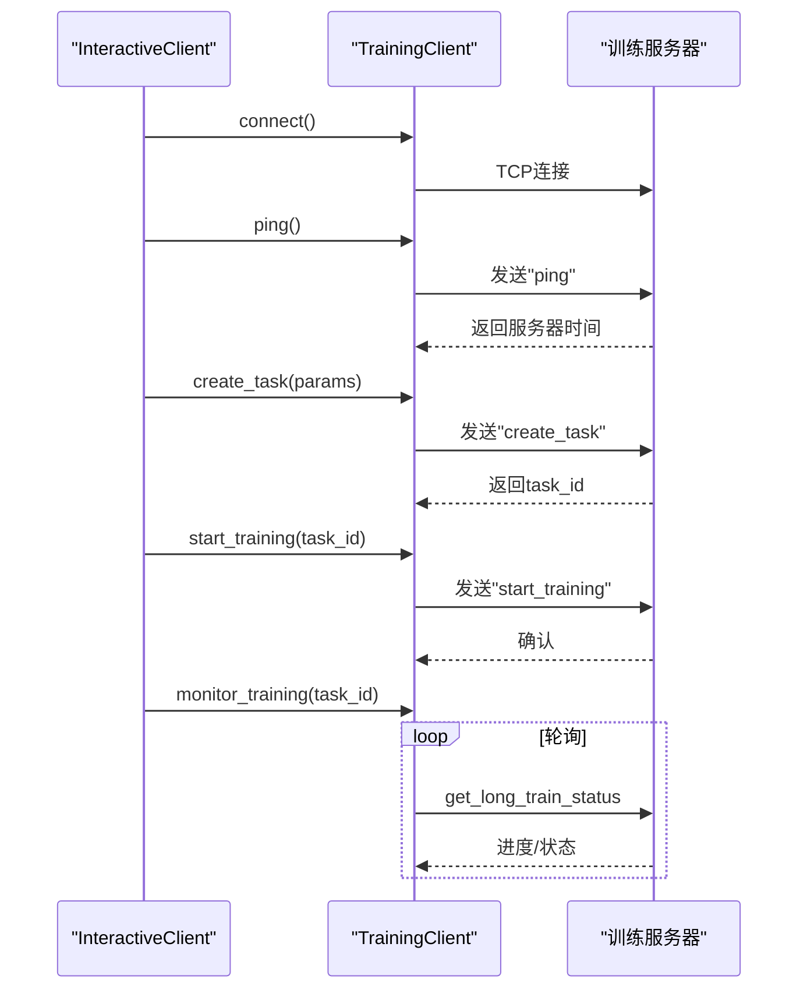
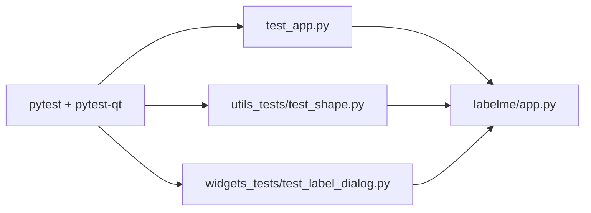
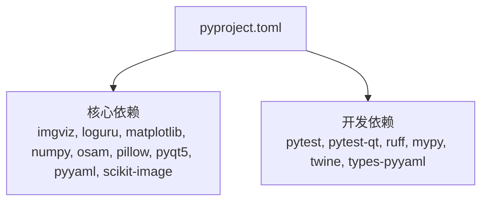

# 开发者指南

<cite>
**本文档引用的文件**
- [README.md](file://README.md)
- [pyproject.toml](file://pyproject.toml)
- [main.py](file://main.py)
- [labelme/__main__.py](file://labelme/__main__.py)
- [labelme/app.py](file://labelme/app.py)
- [labelme/config/default_config.yaml](file://labelme/config/default_config.yaml)
- [training_client/training_client.py](file://training_client/training_client.py)
- [model_training.py](file://model_training.py)
- [model_usage.py](file://model_usage.py)
- [tests/labelme_tests/test_app.py](file://tests/labelme_tests/test_app.py)
- [tests/labelme_tests/utils_tests/test_shape.py](file://tests/labelme_tests/utils_tests/test_shape.py)
- [tests/labelme_tests/widgets_tests/test_label_dialog.py](file://tests/labelme_tests/widgets_tests/test_label_dialog.py)
- [Makefile](file://Makefile)
- [run_build.ps1](file://run_build.ps1)
- [labelme.spec](file://labelme.spec)
</cite>

## 目录
1. [简介](#简介)
2. [项目结构](#项目结构)
3. [核心组件](#核心组件)
4. [架构总览](#架构总览)
5. [详细组件分析](#详细组件分析)
6. [依赖关系分析](#依赖关系分析)
7. [性能考虑](#性能考虑)
8. [故障排除指南](#故障排除指南)
9. [结论](#结论)
10. [附录](#附录)

## 简介
本指南面向开发者，提供从环境搭建、代码结构分析、测试策略、代码规范、扩展开发、构建打包到持续集成的全流程说明。项目基于 Python 和 PyQt5，提供图像标注与 AI 模型训练/使用的一体化界面，支持单实例运行、AI 辅助标注、TCP 训练客户端通信等能力。

## 项目结构
项目采用模块化组织，核心模块包括：
- 应用入口与主窗口：`labelme/__main__.py`、`labelme/app.py`
- UI 嵌入与主程序：`main.py`（将 labelme 嵌入自定义 UI）
- 配置管理：`labelme/config/default_config.yaml`
- 训练与使用模块：`model_training.py`、`model_usage.py`
- 训练客户端：`training_client/training_client.py`
- 测试套件：`tests/labelme_tests/`
- 构建与打包：`Makefile`、`labelme.spec`、`run_build.ps1`

**图表来源**
- [main.py:118-214](file://main.py#L118-L214)
- [labelme/__main__.py:137-341](file://labelme/__main__.py#L137-L341)
- [labelme/app.py:99-125](file://labelme/app.py#L99-L125)
- [labelme/config/default_config.yaml:1-147](file://labelme/config/default_config.yaml#L1-L147)
- [model_training.py:25-87](file://model_training.py#L25-L87)
- [model_usage.py:13-64](file://model_usage.py#L13-L64)
- [training_client/training_client.py:96-174](file://training_client/training_client.py#L96-L174)
- [tests/labelme_tests/test_app.py:25-55](file://tests/labelme_tests/test_app.py#L25-L55)
- [tests/labelme_tests/utils_tests/test_shape.py:6-24](file://tests/labelme_tests/utils_tests/test_shape.py#L6-L24)
- [tests/labelme_tests/widgets_tests/test_label_dialog.py:9-94](file://tests/labelme_tests/widgets_tests/test_label_dialog.py#L9-L94)
- [Makefile:27-48](file://Makefile#L27-L48)
- [labelme.spec:153-235](file://labelme.spec#L153-L235)
- [run_build.ps1:1-3](file://run_build.ps1#L1-L3)

**章节来源**
- [README.md:1-262](file://README.md#L1-L262)
- [pyproject.toml:1-75](file://pyproject.toml#L1-L75)

## 核心组件
- 应用入口与单实例控制
  - labelme 入口：负责参数解析、日志初始化、单实例检查、UI 翻译加载、主窗口创建与事件循环。
  - 自定义主窗口：将 labelme 的 MainWindow 嵌入自定义 UI，提供图像标注、模型训练、模型使用、系统设置等页面。
- 核心窗口与功能
  - MainWindow：管理 UI 布局、标注工具、文件操作、AI 模型初始化、TCP 客户端、训练面板等。
  - 配置系统：default_config.yaml 提供默认配置，支持标签、颜色、快捷键、停靠窗口等。
- 训练与使用模块
  - ModelTrainer：基于 Qt 信号/槽的异步训练器，支持启动/停止/日志/完成/错误信号。
  - ModelUsageManager：模型下载/信息展示/进度反馈。
  - TrainingClient：TCP 协议封装，支持任务创建、启动、停止、状态查询、长轮询等。
- 测试体系
  - GUI 测试：pytest + pytest-qt，覆盖 MainWindow、LabelDialog、LabelQLineEdit 等。
  - 工具测试：验证 shapes_to_label、shape_to_mask 等工具函数。
- 构建与打包
  - Makefile：统一开发任务（格式化、检查、测试、构建）。
  - PyInstaller spec：收集数据文件、DLL、onnxruntime 依赖，生成独立可执行文件。

**章节来源**
- [labelme/__main__.py:137-341](file://labelme/__main__.py#L137-L341)
- [main.py:118-214](file://main.py#L118-L214)
- [labelme/app.py:99-125](file://labelme/app.py#L99-L125)
- [labelme/config/default_config.yaml:1-147](file://labelme/config/default_config.yaml#L1-L147)
- [model_training.py:25-87](file://model_training.py#L25-L87)
- [model_usage.py:13-64](file://model_usage.py#L13-L64)
- [training_client/training_client.py:96-174](file://training_client/training_client.py#L96-L174)
- [tests/labelme_tests/test_app.py:25-55](file://tests/labelme_tests/test_app.py#L25-L55)
- [tests/labelme_tests/utils_tests/test_shape.py:6-24](file://tests/labelme_tests/utils_tests/test_shape.py#L6-L24)
- [tests/labelme_tests/widgets_tests/test_label_dialog.py:9-94](file://tests/labelme_tests/widgets_tests/test_label_dialog.py#L9-L94)
- [Makefile:27-48](file://Makefile#L27-L48)
- [labelme.spec:153-235](file://labelme.spec#L153-L235)

## 架构总览
系统采用“入口层 → 核心窗口 → 功能模块 → 测试与构建”的分层架构。入口负责环境准备与单实例控制；核心窗口承载 UI 与业务逻辑；功能模块提供训练、使用、配置等能力；测试保证质量；构建工具产出可执行文件。

**图表来源**
- [labelme/__main__.py:137-341](file://labelme/__main__.py#L137-L341)
- [main.py:118-214](file://main.py#L118-L214)
- [labelme/app.py:99-125](file://labelme/app.py#L99-L125)
- [labelme/config/default_config.yaml:1-147](file://labelme/config/default_config.yaml#L1-L147)
- [model_training.py:25-87](file://model_training.py#L25-L87)
- [model_usage.py:13-64](file://model_usage.py#L13-L64)
- [training_client/training_client.py:96-174](file://training_client/training_client.py#L96-L174)
- [Makefile:27-48](file://Makefile#L27-L48)
- [labelme.spec:153-235](file://labelme.spec#L153-L235)

## 详细组件分析

### 入口与单实例控制
- 单实例检测：通过 QSharedMemory 实现，避免重复启动。
- 日志系统：使用 loguru 初始化，输出到标准错误与缓存目录文件。
- UI 翻译：加载系统语言翻译文件。
- 异常处理：全局异常钩子捕获未处理异常并弹窗提示。

**图表来源**
- [labelme/__main__.py:29-58](file://labelme/__main__.py#L29-L58)
- [labelme/__main__.py:281-341](file://labelme/__main__.py#L281-L341)

**章节来源**
- [labelme/__main__.py:29-58](file://labelme/__main__.py#L29-L58)
- [labelme/__main__.py:69-98](file://labelme/__main__.py#L69-L98)
- [labelme/__main__.py:100-135](file://labelme/__main__.py#L100-L135)
- [labelme/__main__.py:306-341](file://labelme/__main__.py#L306-L341)

### 自定义主窗口与嵌入式 UI
- 单实例检测：在自定义主窗口中同样使用 QSharedMemory 检测。
- UI 嵌入：将 labelme 的 MainWindow 作为中央部件嵌入自定义布局。
- 页面与信号：提供图像标注、模型训练、模型使用、系统设置四个页面，连接信号槽实现页面切换与窗口控制。
- 模型训练器与使用管理器：通过信号/槽与 UI 同步训练状态与模型信息。

**图表来源**
- [main.py:118-214](file://main.py#L118-L214)
- [main.py:289-301](file://main.py#L289-L301)
- [main.py:485-561](file://main.py#L485-L561)
- [model_training.py:25-87](file://model_training.py#L25-L87)
- [model_usage.py:13-64](file://model_usage.py#L13-L64)

**章节来源**
- [main.py:33-116](file://main.py#L33-L116)
- [main.py:118-214](file://main.py#L118-L214)
- [main.py:236-288](file://main.py#L236-L288)
- [main.py:289-301](file://main.py#L289-L301)
- [main.py:485-561](file://main.py#L485-L561)

### 核心窗口与功能
- MainWindow：负责 UI 布局、动作（创建/编辑/删除形状）、文件操作、AI 模型初始化、TCP 客户端、训练面板、文件系统监控等。
- 配置系统：default_config.yaml 提供标签、颜色、快捷键、停靠窗口、画布等配置项。
- AI 模型初始化：根据选择的 AI 模型调用 Canvas 初始化。
- 训练客户端管理：TrainingClientManager 与训练面板交互，支持远程任务创建、启动、停止、状态查询。

**图表来源**
- [labelme/app.py:117-125](file://labelme/app.py#L117-L125)
- [labelme/app.py:150-175](file://labelme/app.py#L150-L175)
- [labelme/app.py:471-800](file://labelme/app.py#L471-L800)
- [labelme/config/default_config.yaml:1-147](file://labelme/config/default_config.yaml#L1-L147)

**章节来源**
- [labelme/app.py:99-125](file://labelme/app.py#L99-L125)
- [labelme/app.py:150-175](file://labelme/app.py#L150-L175)
- [labelme/app.py:471-800](file://labelme/app.py#L471-L800)
- [labelme/config/default_config.yaml:1-147](file://labelme/config/default_config.yaml#L1-L147)

### 训练客户端与协议
- 消息协议：包含包头、长度、校验和与数据体，支持校验和验证与超时处理。
- 客户端功能：连接、Ping、创建任务、启动/停止训练、查询状态/进度、长轮询、列出/删除任务。
- 交互式命令行：提供菜单驱动的操作界面。

**图表来源**
- [training_client/training_client.py:13-94](file://training_client/training_client.py#L13-L94)
- [training_client/training_client.py:127-174](file://training_client/training_client.py#L127-L174)
- [training_client/training_client.py:175-272](file://training_client/training_client.py#L175-L272)
- [training_client/training_client.py:273-335](file://training_client/training_client.py#L273-L335)

**章节来源**
- [training_client/training_client.py:13-94](file://training_client/training_client.py#L13-L94)
- [training_client/training_client.py:127-174](file://training_client/training_client.py#L127-L174)
- [training_client/training_client.py:175-272](file://training_client/training_client.py#L175-L272)
- [training_client/training_client.py:273-335](file://training_client/training_client.py#L273-L335)

### 测试策略与框架
- GUI 测试：使用 pytest 与 pytest-qt，覆盖 MainWindow 打开、图像/JSON 加载、前后图像切换、标注与保存等。
- 工具测试：验证 shapes_to_label、shape_to_mask 等工具函数的正确性。
- Widgets 测试：验证 LabelDialog、LabelQLineEdit 的交互行为。

**图表来源**
- [tests/labelme_tests/test_app.py:25-55](file://tests/labelme_tests/test_app.py#L25-L55)
- [tests/labelme_tests/utils_tests/test_shape.py:6-24](file://tests/labelme_tests/utils_tests/test_shape.py#L6-L24)
- [tests/labelme_tests/widgets_tests/test_label_dialog.py:9-94](file://tests/labelme_tests/widgets_tests/test_label_dialog.py#L9-L94)

**章节来源**
- [tests/labelme_tests/test_app.py:25-55](file://tests/labelme_tests/test_app.py#L25-L55)
- [tests/labelme_tests/utils_tests/test_shape.py:6-24](file://tests/labelme_tests/utils_tests/test_shape.py#L6-L24)
- [tests/labelme_tests/widgets_tests/test_label_dialog.py:9-94](file://tests/labelme_tests/widgets_tests/test_label_dialog.py#L9-L94)

## 依赖关系分析
- 依赖管理：pyproject.toml 定义了核心依赖（imgviz、loguru、matplotlib、numpy、osam、pillow、pyqt5、pyyaml、scikit-image）与开发依赖（pytest、ruff、mypy 等）。
- 依赖分组：dev 分组用于开发工具链，scripts 定义命令行入口。
- 构建系统：hatchling 作为构建后端，支持版本与元数据管理。

**图表来源**
- [pyproject.toml:26-39](file://pyproject.toml#L26-L39)
- [pyproject.toml:45-53](file://pyproject.toml#L45-L53)

**章节来源**
- [pyproject.toml:1-75](file://pyproject.toml#L1-L75)

## 性能考虑
- 单实例控制：通过 QSharedMemory 防止重复启动，减少资源浪费。
- UI 闪烁优化：在初始化阶段设置 WA_DontShowOnScreen，避免频繁重绘。
- 训练异步化：使用守护线程与 Qt 信号/槽，避免阻塞 UI。
- 日志与缓存：loguru 输出到文件并轮转压缩，降低 IO 压力。
- 构建优化：PyInstaller 收集必要 DLL 与 onnxruntime 二进制，禁用 UPX 压缩避免破坏依赖。

**章节来源**
- [main.py:177-182](file://main.py#L177-L182)
- [labelme/__main__.py:69-98](file://labelme/__main__.py#L69-L98)
- [model_training.py:71-74](file://model_training.py#L71-L74)
- [labelme.spec:215-216](file://labelme.spec#L215-L216)

## 故障排除指南
- 导入错误：检查 labelme/_automation/__init__.py 的绝对导入路径、翻译文件扩展名、配置文件编码（UTF-8 without BOM）。
- AI 功能：osam 模块为可选依赖，缺失时优雅降级；若出现数据类型错误，确保图像尺寸与格式满足要求。
- 单实例冲突：系统会自动清理僵尸进程的共享内存；若仍无法启动，可重启系统或手动清理共享内存。
- 测试运行：确保安装了 pytest、pytest-qt，并在测试中正确配置 qt_api。

**章节来源**
- [README.md:81-107](file://README.md#L81-L107)
- [README.md:137-179](file://README.md#L137-L179)
- [pyproject.toml:63-67](file://pyproject.toml#L63-L67)

## 结论
本指南提供了从环境搭建到扩展开发、从测试到构建打包的完整开发路径。通过模块化设计与清晰的分层架构，开发者可以快速定位问题、编写高质量代码并高效交付功能。

## 附录

### 开发环境搭建
- Python 版本：3.9+
- 依赖安装：使用 uv 同步 dev 依赖（Makefile 目标 setup）。
- IDE 建议：VSCode（配合 Python、pytest 插件），PyCharm（专业版更佳）。
- 调试工具：启用 pytest-qt 的 GUI 测试调试，结合 loguru 日志定位问题。

**章节来源**
- [pyproject.toml:9-25](file://pyproject.toml#L9-L25)
- [Makefile:27-28](file://Makefile#L27-L28)

### 代码结构与模块职责
- labelme/__main__.py：应用入口、单实例、日志、翻译、异常处理。
- labelme/app.py：核心窗口、动作、停靠窗口、画布、文件系统监控。
- main.py：自定义主窗口、嵌入 labelme、训练与使用模块集成。
- model_training.py：训练器（信号/槽、异步线程）。
- model_usage.py：模型下载与信息展示。
- training_client/training_client.py：TCP 训练客户端与协议。
- tests/labelme_tests/*：GUI 与工具测试。
- labelme/config/default_config.yaml：配置中心。
- labelme.spec：PyInstaller 打包配置。
- Makefile：统一开发任务。

**章节来源**
- [labelme/__main__.py:1-359](file://labelme/__main__.py#L1-L359)
- [labelme/app.py:1-800](file://labelme/app.py#L1-L800)
- [main.py:1-694](file://main.py#L1-L694)
- [model_training.py:1-124](file://model_training.py#L1-L124)
- [model_usage.py:1-103](file://model_usage.py#L1-L103)
- [training_client/training_client.py:1-619](file://training_client/training_client.py#L1-L619)
- [tests/labelme_tests/test_app.py:1-115](file://tests/labelme_tests/test_app.py#L1-L115)
- [tests/labelme_tests/utils_tests/test_shape.py:1-25](file://tests/labelme_tests/utils_tests/test_shape.py#L1-L25)
- [tests/labelme_tests/widgets_tests/test_label_dialog.py:1-94](file://tests/labelme_tests/widgets_tests/test_label_dialog.py#L1-L94)
- [labelme/config/default_config.yaml:1-147](file://labelme/config/default_config.yaml#L1-L147)
- [labelme.spec:1-235](file://labelme.spec#L1-L235)
- [Makefile:1-48](file://Makefile#L1-L48)

### 测试策略与编写指导
- 单元测试：验证工具函数（如 shapes_to_label、shape_to_mask）。
- 集成测试：验证 MainWindow 的打开、文件加载、标注与保存流程。
- GUI 测试：使用 pytest-qt 验证交互行为（LabelDialog、LabelQLineEdit）。
- 标记与运行：使用 pytest.ini 的 gui 标记，通过 Makefile 的 test 目标统一运行。

**章节来源**
- [tests/labelme_tests/utils_tests/test_shape.py:6-24](file://tests/labelme_tests/utils_tests/test_shape.py#L6-L24)
- [tests/labelme_tests/test_app.py:25-55](file://tests/labelme_tests/test_app.py#L25-L55)
- [tests/labelme_tests/widgets_tests/test_label_dialog.py:9-94](file://tests/labelme_tests/widgets_tests/test_label_dialog.py#L9-L94)
- [pyproject.toml:63-67](file://pyproject.toml#L63-L67)
- [Makefile:43-44](file://Makefile#L43-L44)

### 代码规范与提交规范
- 格式化与检查：使用 ruff 进行格式化与静态检查，mypy 进行类型检查。
- 提交规范：遵循项目约定（建议遵循 Conventional Commits）。
- 分支管理：主分支稳定发布，功能在分支开发并通过 PR 合并。

**章节来源**
- [Makefile:30-41](file://Makefile#L30-L41)
- [pyproject.toml:45-53](file://pyproject.toml#L45-L53)

### 扩展开发指导
- 新功能添加：在 labelme/app.py 中扩展动作与 UI，必要时增加配置项。
- 插件开发：通过 osam/onnxruntime 等可选依赖扩展 AI 能力。
- 第三方集成：在 labelme.spec 中补充数据文件与二进制依赖，确保 PyInstaller 正确打包。

**章节来源**
- [labelme/spec:26-55](file://labelme.spec#L26-L55)
- [labelme/spec:139-152](file://labelme.spec#L139-L152)

### 构建与打包流程
- 开发任务：setup（依赖同步）、format（格式化+检查）、lint（检查）、mypy（类型检查）、check（lint+mypy）、test（测试）、build（打包）。
- 打包：PyInstaller 使用 labelme.spec 收集数据文件、DLL、onnxruntime 二进制，生成独立可执行文件。
- Windows 构建脚本：run_build.ps1 调用 build.ps1 执行构建。

**章节来源**
- [Makefile:27-48](file://Makefile#L27-L48)
- [labelme.spec:153-235](file://labelme.spec#L153-L235)
- [run_build.ps1:1-3](file://run_build.ps1#L1-L3)

### 持续集成配置
- CI 工作流：GitHub Actions badge 指示 CI 状态，建议在 .github/workflows 中配置测试与构建流水线。
- 版本管理：pyproject.toml 中的版本号与语义化版本管理。

**章节来源**
- [README.md:13-13](file://README.md#L13-L13)
- [pyproject.toml:10-10](file://pyproject.toml#L10-L10)