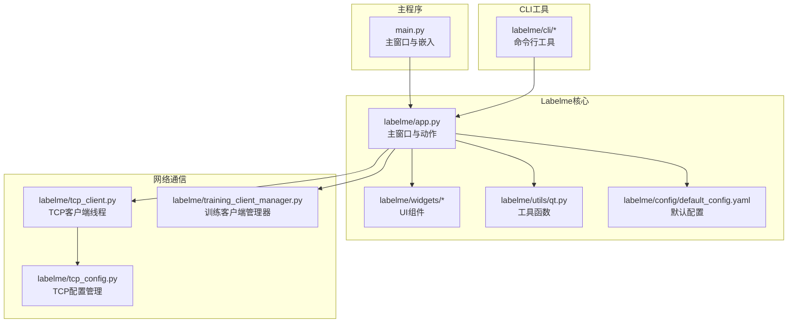
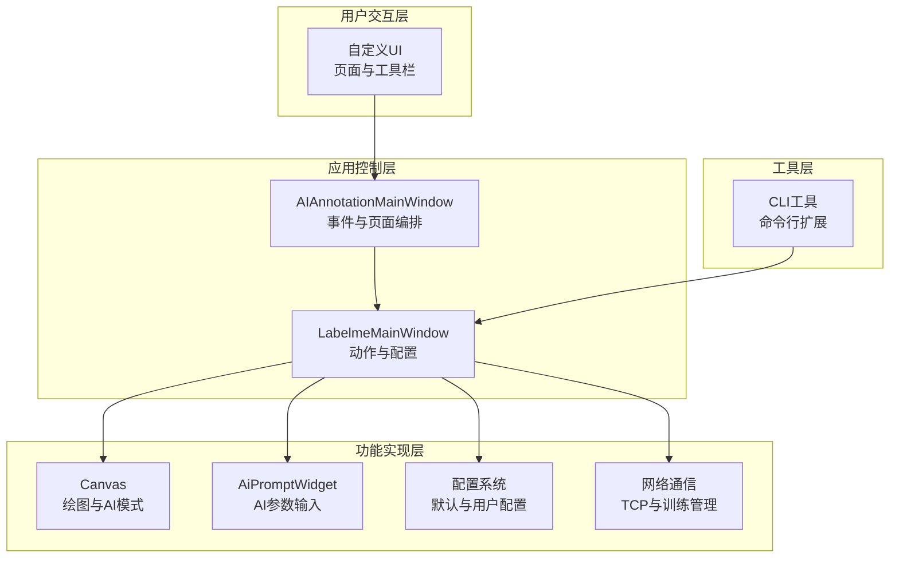
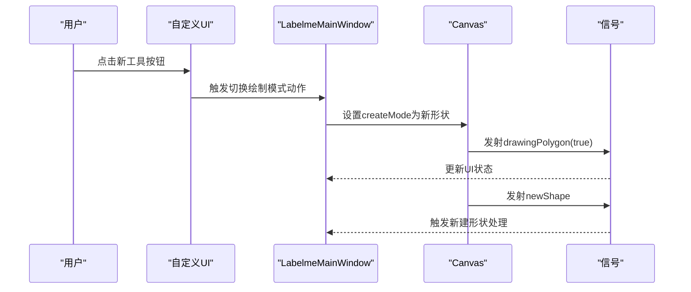
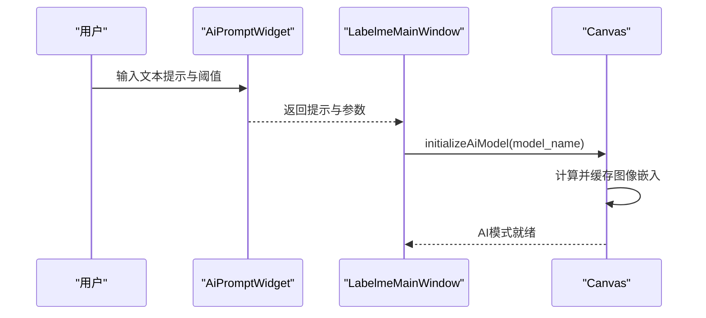
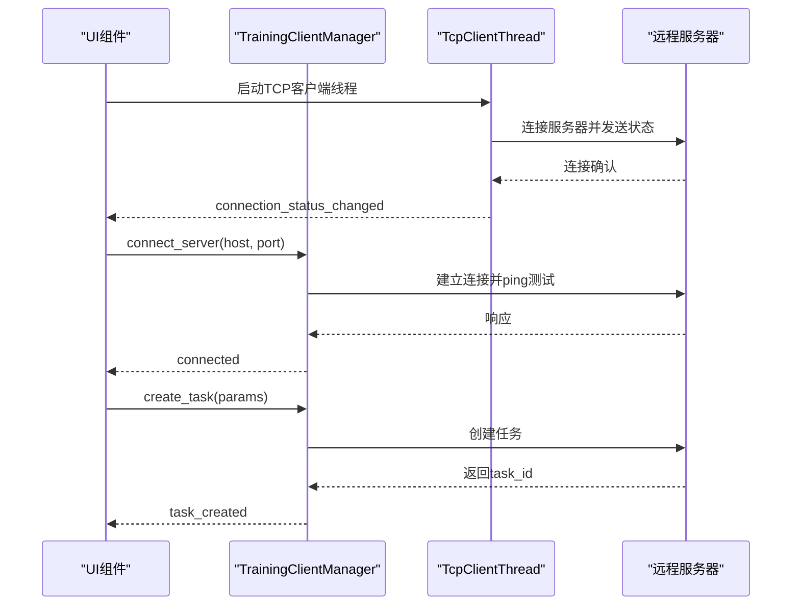
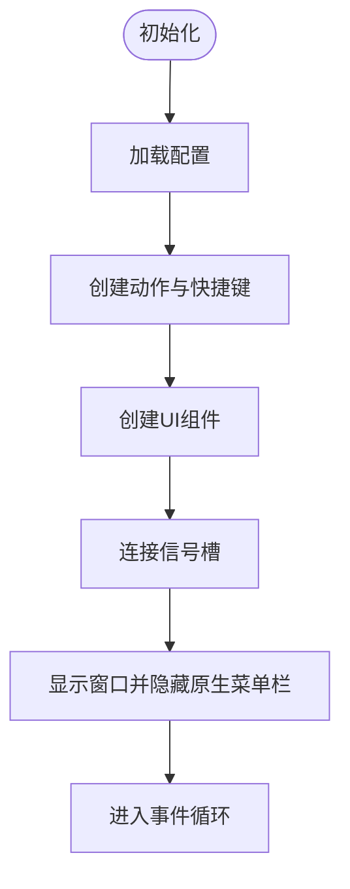
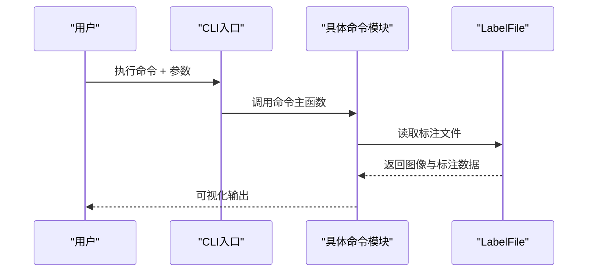
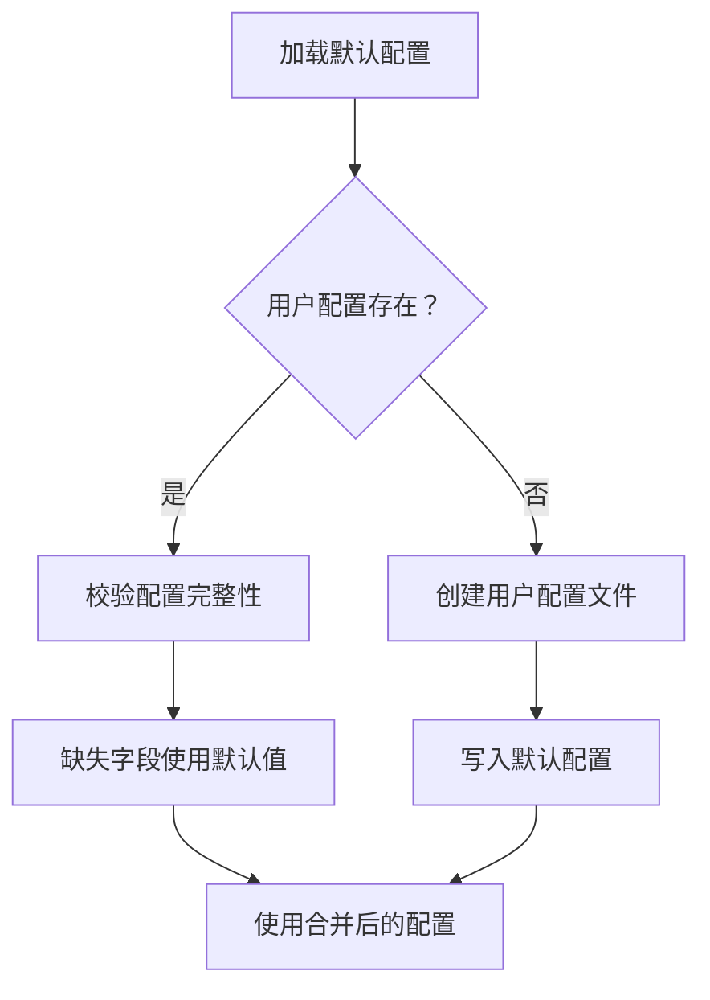
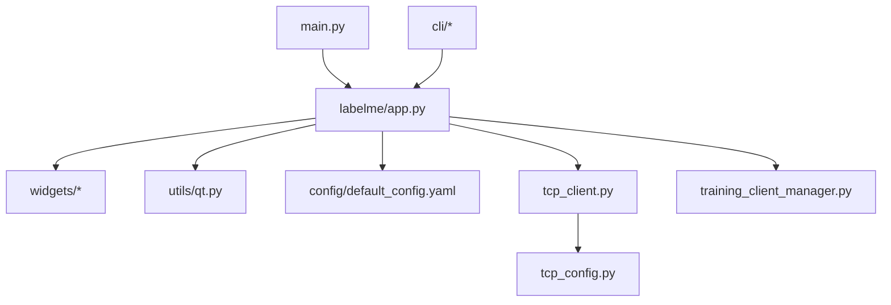

# 扩展开发与集成

<cite>
**本文档引用的文件**
- [main.py](file://main.py)
- [labelme/app.py](file://labelme/app.py)
- [labelme/config/default_config.yaml](file://labelme/config/default_config.yaml)
- [labelme/tcp_client.py](file://labelme/tcp_client.py)
- [labelme/tcp_config.py](file://labelme/tcp_config.py)
- [labelme/cli/__init__.py](file://labelme/cli/__init__.py)
- [labelme/cli/draw_json.py](file://labelme/cli/draw_json.py)
- [labelme/widgets/__init__.py](file://labelme/widgets/__init__.py)
- [labelme/widgets/canvas.py](file://labelme/widgets/canvas.py)
- [labelme/widgets/ai_prompt_widget.py](file://labelme/widgets/ai_prompt_widget.py)
- [labelme/utils/qt.py](file://labelme/utils/qt.py)
- [labelme/training_client_manager.py](file://labelme/training_client_manager.py)
</cite>

## 目录
1. [简介](#简介)
2. [项目结构](#项目结构)
3. [核心组件](#核心组件)
4. [架构总览](#架构总览)
5. [详细组件分析](#详细组件分析)
6. [依赖分析](#依赖分析)
7. [性能考虑](#性能考虑)
8. [故障排查指南](#故障排查指南)
9. [结论](#结论)
10. [附录](#附录)

## 简介
本指南面向希望在现有标注系统基础上进行扩展与集成的开发者，覆盖以下主题：
- 新标注工具添加：在画布组件中扩展新的几何形状与AI辅助标注模式
- AI模型集成：通过AI提示组件与画布AI模式对接，支持文本提示与NMS参数
- 第三方服务接入：TCP客户端线程与训练客户端管理器的网络通信扩展
- 插件开发框架：基于动作与信号槽的事件处理与生命周期管理
- CLI工具扩展：命令行工具模块化扩展与参数处理
- 配置系统扩展：默认配置项添加与用户配置文件管理
- UI组件扩展：自定义主题与组件集成方法
- 实际扩展示例与集成案例分析

## 项目结构
项目采用模块化组织，核心由主程序、Labelme核心、UI组件、CLI工具、配置与网络通信组成。主程序将Labelme主窗口嵌入到自定义UI中，并扩展模型训练与使用的集成能力。

**图表来源**
- [main.py:118-214](file://main.py#L118-L214)
- [labelme/app.py:99-125](file://labelme/app.py#L99-L125)
- [labelme/widgets/__init__.py:1-47](file://labelme/widgets/__init__.py#L1-L47)
- [labelme/utils/qt.py:1-214](file://labelme/utils/qt.py#L1-L214)
- [labelme/config/default_config.yaml:1-147](file://labelme/config/default_config.yaml#L1-L147)
- [labelme/tcp_client.py:16-37](file://labelme/tcp_client.py#L16-L37)
- [labelme/tcp_config.py:40-78](file://labelme/tcp_config.py#L40-L78)
- [labelme/training_client_manager.py:32-96](file://labelme/training_client_manager.py#L32-L96)
- [labelme/cli/__init__.py:1-13](file://labelme/cli/__init__.py#L1-L13)

**章节来源**
- [main.py:118-214](file://main.py#L118-L214)
- [labelme/app.py:99-125](file://labelme/app.py#L99-L125)
- [labelme/widgets/__init__.py:1-47](file://labelme/widgets/__init__.py#L1-L47)
- [labelme/utils/qt.py:1-214](file://labelme/utils/qt.py#L1-L214)
- [labelme/config/default_config.yaml:1-147](file://labelme/config/default_config.yaml#L1-L147)
- [labelme/tcp_client.py:16-37](file://labelme/tcp_client.py#L16-L37)
- [labelme/tcp_config.py:40-78](file://labelme/tcp_config.py#L40-L78)
- [labelme/training_client_manager.py:32-96](file://labelme/training_client_manager.py#L32-L96)
- [labelme/cli/__init__.py:1-13](file://labelme/cli/__init__.py#L1-L13)

## 核心组件
- 主窗口与嵌入：主程序将Labelme主窗口嵌入自定义UI，统一管理页面切换、工具栏事件与系统设置同步。
- Labelme主窗口：负责动作创建、停靠窗口、画布与文件系统监控、AI模式初始化等。
- UI组件：画布、AI提示组件、工具栏、训练配置与任务监控等。
- 配置系统：默认配置与用户配置文件管理，支持自动保存与快捷键映射。
- 网络通信：TCP客户端线程与训练客户端管理器，分别用于状态上报与远程训练任务管理。
- CLI工具：命令行工具模块化入口与具体命令实现。

**章节来源**
- [main.py:236-287](file://main.py#L236-L287)
- [labelme/app.py:471-800](file://labelme/app.py#L471-L800)
- [labelme/widgets/__init__.py:1-47](file://labelme/widgets/__init__.py#L1-L47)
- [labelme/config/default_config.yaml:1-147](file://labelme/config/default_config.yaml#L1-L147)
- [labelme/tcp_client.py:16-37](file://labelme/tcp_client.py#L16-L37)
- [labelme/training_client_manager.py:32-96](file://labelme/training_client_manager.py#L32-L96)
- [labelme/cli/__init__.py:1-13](file://labelme/cli/__init__.py#L1-L13)

## 架构总览
系统采用“主程序嵌入Labelme核心 + 扩展组件”的架构。主程序负责页面与事件编排，Labelme核心负责标注与AI功能，扩展组件通过信号槽与配置系统实现解耦集成。

**图表来源**
- [main.py:118-214](file://main.py#L118-L214)
- [labelme/app.py:99-125](file://labelme/app.py#L99-L125)
- [labelme/widgets/canvas.py:39-105](file://labelme/widgets/canvas.py#L39-L105)
- [labelme/widgets/ai_prompt_widget.py:9-40](file://labelme/widgets/ai_prompt_widget.py#L9-L40)
- [labelme/config/default_config.yaml:1-147](file://labelme/config/default_config.yaml#L1-L147)
- [labelme/tcp_client.py:16-37](file://labelme/tcp_client.py#L16-L37)
- [labelme/training_client_manager.py:32-96](file://labelme/training_client_manager.py#L32-L96)
- [labelme/cli/__init__.py:1-13](file://labelme/cli/__init__.py#L1-L13)

## 详细组件分析

### 扩展标注工具：在画布中添加新几何形状
- 扩展点：在画布组件中新增创建模式与绘制逻辑；在主窗口动作中注册新工具。
- 关键流程：
  - 在画布中设置创建模式与绘制状态，触发新形状信号。
  - 在主窗口中创建对应动作，绑定到切换绘制模式。
  - 通过配置系统控制十字准星与双击行为等细节。

**图表来源**
- [labelme/widgets/canvas.py:162-180](file://labelme/widgets/canvas.py#L162-L180)
- [labelme/app.py:630-663](file://labelme/app.py#L630-L663)

**章节来源**
- [labelme/widgets/canvas.py:162-180](file://labelme/widgets/canvas.py#L162-L180)
- [labelme/app.py:630-663](file://labelme/app.py#L630-L663)

### AI模型集成：文本提示与NMS参数
- 扩展点：通过AI提示组件收集文本提示与NMS参数，传递给画布AI模型初始化与推理。
- 关键流程：
  - AI提示组件提供文本输入与阈值设置。
  - 主窗口在AI模式切换时调用画布初始化AI模型。
  - 画布内部缓存图像嵌入，提升AI标注效率。

**图表来源**
- [labelme/widgets/ai_prompt_widget.py:9-87](file://labelme/widgets/ai_prompt_widget.py#L9-L87)
- [labelme/app.py:638-663](file://labelme/app.py#L638-L663)
- [labelme/widgets/canvas.py:181-200](file://labelme/widgets/canvas.py#L181-L200)

**章节来源**
- [labelme/widgets/ai_prompt_widget.py:9-87](file://labelme/widgets/ai_prompt_widget.py#L9-L87)
- [labelme/app.py:638-663](file://labelme/app.py#L638-L663)
- [labelme/widgets/canvas.py:181-200](file://labelme/widgets/canvas.py#L181-L200)

### 第三方服务接入：TCP客户端与训练管理
- TCP客户端线程：后台线程连接服务器、周期性发送消息、自动重连与状态通知。
- 训练客户端管理器：封装远程训练任务的连接、任务创建、训练启停与进度监控，使用信号槽与线程隔离UI阻塞。

**图表来源**
- [labelme/tcp_client.py:16-37](file://labelme/tcp_client.py#L16-L37)
- [labelme/tcp_client.py:149-198](file://labelme/tcp_client.py#L149-L198)
- [labelme/training_client_manager.py:107-146](file://labelme/training_client_manager.py#L107-L146)
- [labelme/training_client_manager.py:156-187](file://labelme/training_client_manager.py#L156-L187)

**章节来源**
- [labelme/tcp_client.py:16-37](file://labelme/tcp_client.py#L16-L37)
- [labelme/tcp_client.py:149-198](file://labelme/tcp_client.py#L149-L198)
- [labelme/training_client_manager.py:107-146](file://labelme/training_client_manager.py#L107-L146)
- [labelme/training_client_manager.py:156-187](file://labelme/training_client_manager.py#L156-L187)

### 插件开发框架：接口定义、事件处理与生命周期
- 接口定义：通过动作工厂函数创建动作，统一设置图标、快捷键、提示与槽函数。
- 事件处理：主窗口集中管理动作与信号槽，UI组件通过信号与主窗口交互。
- 生命周期：主窗口初始化配置、创建组件、连接信号槽；UI组件在显示时隐藏原生菜单栏与工具栏。

**图表来源**
- [labelme/utils/qt.py:56-106](file://labelme/utils/qt.py#L56-L106)
- [labelme/app.py:471-800](file://labelme/app.py#L471-L800)
- [main.py:215-235](file://main.py#L215-L235)

**章节来源**
- [labelme/utils/qt.py:56-106](file://labelme/utils/qt.py#L56-L106)
- [labelme/app.py:471-800](file://labelme/app.py#L471-L800)
- [main.py:215-235](file://main.py#L215-L235)

### CLI工具扩展：新命令添加与参数处理
- 模块化入口：CLI包统一导出各命令模块，便于扩展新命令。
- 参数处理：命令行参数解析器接收JSON文件路径等参数，读取标注文件并进行可视化输出。

**图表来源**
- [labelme/cli/__init__.py:8-12](file://labelme/cli/__init__.py#L8-L12)
- [labelme/cli/draw_json.py:16-64](file://labelme/cli/draw_json.py#L16-L64)

**章节来源**
- [labelme/cli/__init__.py:8-12](file://labelme/cli/__init__.py#L8-L12)
- [labelme/cli/draw_json.py:16-64](file://labelme/cli/draw_json.py#L16-L64)

### 配置系统扩展：新配置项添加与默认值管理
- 默认配置：通过YAML文件定义默认配置项，包括自动保存、标签弹窗、形状颜色、AI模型、快捷键等。
- 用户配置：TCP配置文件位于用户目录，支持加载、校验与回退默认值。

**图表来源**
- [labelme/config/default_config.yaml:1-147](file://labelme/config/default_config.yaml#L1-L147)
- [labelme/tcp_config.py:40-78](file://labelme/tcp_config.py#L40-L78)
- [labelme/tcp_config.py:81-107](file://labelme/tcp_config.py#L81-L107)

**章节来源**
- [labelme/config/default_config.yaml:1-147](file://labelme/config/default_config.yaml#L1-L147)
- [labelme/tcp_config.py:40-78](file://labelme/tcp_config.py#L40-L78)
- [labelme/tcp_config.py:81-107](file://labelme/tcp_config.py#L81-L107)

### UI组件扩展：自定义主题与组件集成
- 组件集成：通过UI组件初始化与布局管理，将新组件嵌入到现有停靠窗口或工具栏。
- 主题扩展：可通过配置系统调整颜色、字体与停靠窗口可见性，实现基础主题定制。

**章节来源**
- [labelme/widgets/__init__.py:1-47](file://labelme/widgets/__init__.py#L1-L47)
- [labelme/config/default_config.yaml:22-147](file://labelme/config/default_config.yaml#L22-L147)

## 依赖分析
- 主程序依赖Labelme主窗口与配置系统，同时集成模型训练与使用的信号槽。
- Labelme主窗口依赖UI组件、工具函数与配置系统，同时管理TCP与训练客户端。
- 网络通信模块相互独立，TCP客户端线程与训练客户端管理器通过信号槽与UI交互。
- CLI工具模块独立于主窗口，通过命令行参数与标注文件交互。

**图表来源**
- [main.py:23-27](file://main.py#L23-L27)
- [labelme/app.py:58-85](file://labelme/app.py#L58-L85)
- [labelme/widgets/__init__.py:1-47](file://labelme/widgets/__init__.py#L1-L47)
- [labelme/utils/qt.py:1-214](file://labelme/utils/qt.py#L1-L214)
- [labelme/config/default_config.yaml:1-147](file://labelme/config/default_config.yaml#L1-L147)
- [labelme/tcp_client.py:13-13](file://labelme/tcp_client.py#L13-L13)
- [labelme/training_client_manager.py:28-29](file://labelme/training_client_manager.py#L28-L29)
- [labelme/cli/__init__.py:8-12](file://labelme/cli/__init__.py#L8-L12)

**章节来源**
- [main.py:23-27](file://main.py#L23-L27)
- [labelme/app.py:58-85](file://labelme/app.py#L58-L85)
- [labelme/widgets/__init__.py:1-47](file://labelme/widgets/__init__.py#L1-L47)
- [labelme/utils/qt.py:1-214](file://labelme/utils/qt.py#L1-L214)
- [labelme/config/default_config.yaml:1-147](file://labelme/config/default_config.yaml#L1-L147)
- [labelme/tcp_client.py:13-13](file://labelme/tcp_client.py#L13-L13)
- [labelme/training_client_manager.py:28-29](file://labelme/training_client_manager.py#L28-L29)
- [labelme/cli/__init__.py:8-12](file://labelme/cli/__init__.py#L8-L12)

## 性能考虑
- 线程隔离：网络通信与训练任务在后台线程执行，避免阻塞UI。
- 缓存优化：画布对图像嵌入进行缓存，减少重复计算。
- 配置校验：TCP配置加载时进行完整性校验与默认值回填，降低运行期异常风险。

[本节为通用建议，无需特定文件来源]

## 故障排查指南
- TCP连接失败：检查服务器地址与端口、防火墙设置与连接超时；关注连接状态信号与日志。
- 训练任务异常：确认服务器连通性与心跳检测；检查任务创建与训练启停的线程安全。
- UI闪烁问题：主窗口初始化时设置防闪烁属性并在显示时取消。
- 配置加载异常：确认用户配置文件权限与YAML格式；必要时回退到默认配置。

**章节来源**
- [labelme/tcp_client.py:85-96](file://labelme/tcp_client.py#L85-L96)
- [labelme/training_client_manager.py:120-146](file://labelme/training_client_manager.py#L120-L146)
- [main.py:175-182](file://main.py#L175-L182)
- [labelme/tcp_config.py:57-78](file://labelme/tcp_config.py#L57-L78)

## 结论
通过以上扩展点与集成方法，可以在现有标注系统基础上高效地添加新标注工具、集成AI模型、接入第三方服务、扩展CLI工具与配置系统，并实现UI组件的灵活扩展与主题定制。建议遵循信号槽解耦、线程隔离与配置校验的原则，确保扩展的稳定性与可维护性。

[本节为总结，无需特定文件来源]

## 附录
- 实际扩展示例与集成案例可参考以下文件路径：
  - 新标注工具：在画布组件中新增创建模式与动作注册
  - AI模型集成：在AI提示组件与画布AI模式之间建立参数传递链路
  - 网络通信：在TCP客户端线程与训练客户端管理器中增加自定义消息协议
  - CLI扩展：在CLI包中新增命令模块并通过入口统一导出
  - 配置扩展：在默认配置与用户配置文件中添加新字段并实现回退逻辑

[本节为概览，无需特定文件来源]