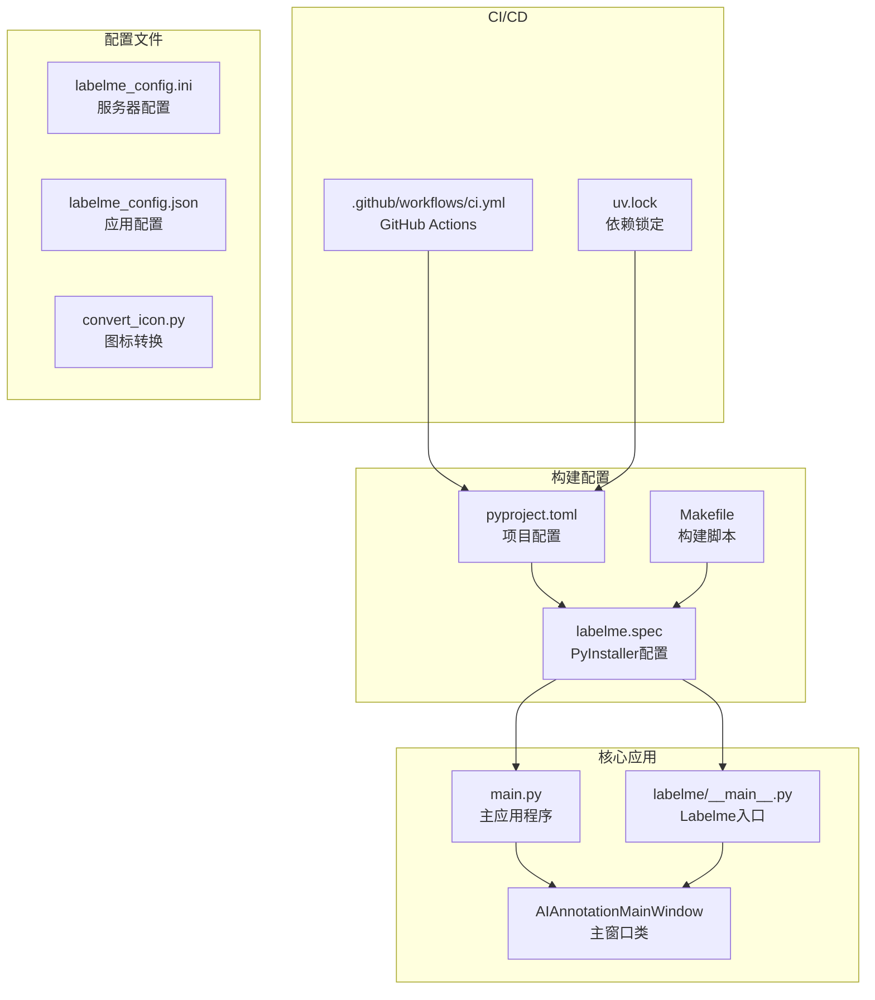
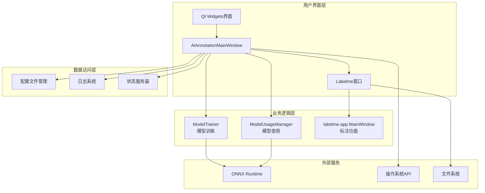
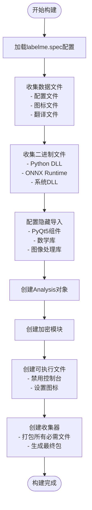
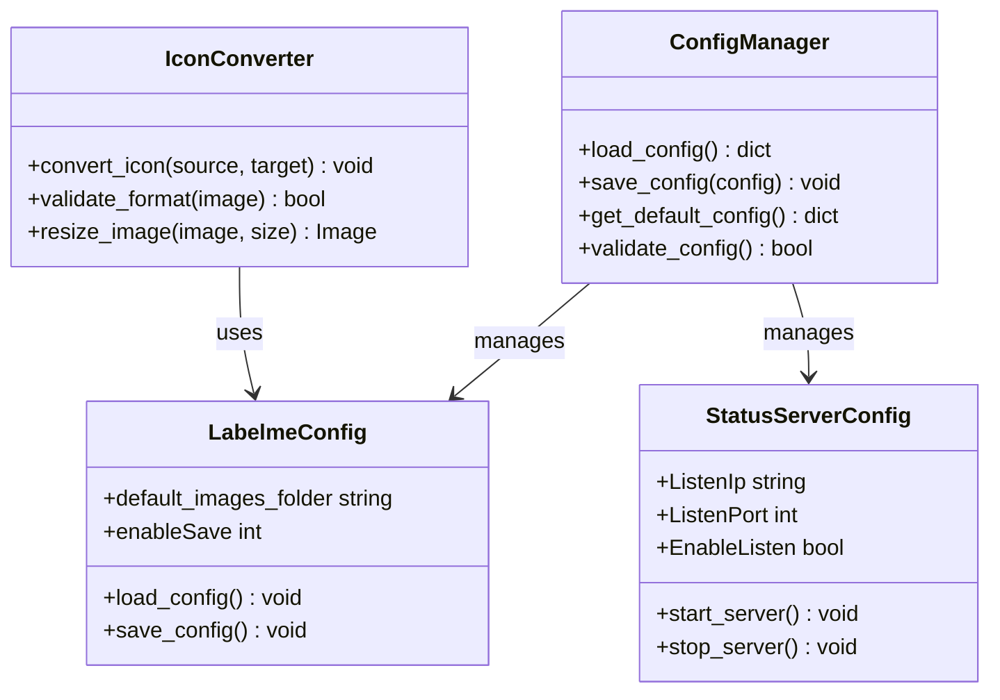
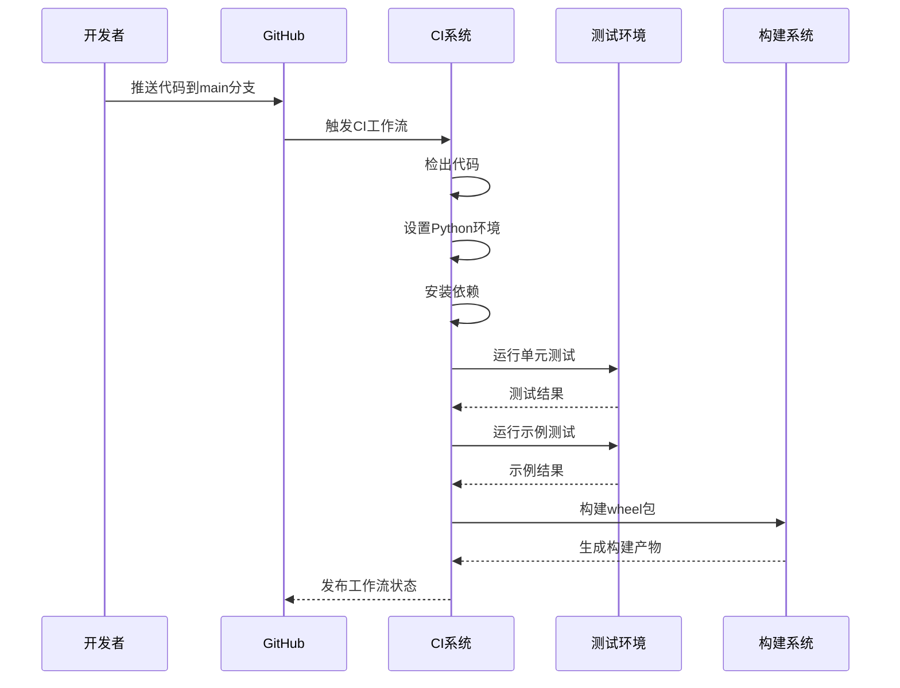
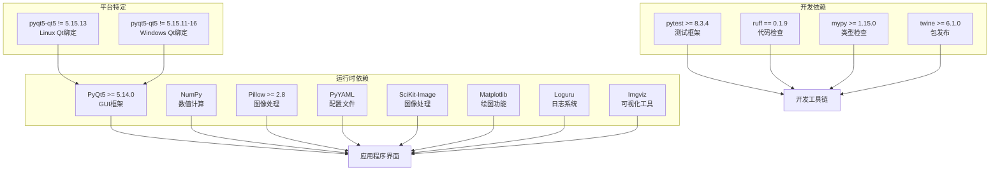

# 构建与部署

<cite>
**本文档引用的文件**
- [labelme.spec](file://labelme.spec)
- [pyproject.toml](file://pyproject.toml)
- [Makefile](file://Makefile)
- [build.ps1](file://build.ps1)
- [run_build.ps1](file://run_build.ps1)
- [convert_icon.py](file://convert_icon.py)
- [labelme_config.ini](file://labelme_config.ini)
- [labelme_config.json](file://labelme_config.json)
- [ci.yml](file://.github/workflows/ci.yml)
- [uv.lock](file://uv.lock)
- [main.py](file://main.py)
- [labelme/__main__.py](file://labelme/__main__.py)
</cite>

## 目录
1. [简介](#简介)
2. [项目结构](#项目结构)
3. [核心组件](#核心组件)
4. [架构概览](#架构概览)
5. [详细组件分析](#详细组件分析)
6. [依赖分析](#依赖分析)
7. [性能考虑](#性能考虑)
8. [故障排除指南](#故障排除指南)
9. [结论](#结论)
10. [附录](#附录)

## 简介

本指南提供了该图像标注与训练系统的完整构建与部署方案。系统基于Labelme重构，集成了AI图像标注、模型训练和模型使用管理功能。本文档详细说明了项目的构建流程、PyInstaller配置、多平台打包、版本管理、发布流程以及自动化部署配置。

## 项目结构

该项目采用模块化架构，主要包含以下核心部分：

**图表来源**
- [main.py:118-214](file://main.py#L118-L214)
- [labelme.spec:153-235](file://labelme.spec#L153-L235)
- [.github/workflows/ci.yml:1-72](file://.github/workflows/ci.yml#L1-L72)

**章节来源**
- [main.py:1-694](file://main.py#L1-L694)
- [labelme.spec:1-235](file://labelme.spec#L1-L235)
- [pyproject.toml:1-75](file://pyproject.toml#L1-L75)

## 核心组件

### 构建系统组件

#### PyInstaller配置
项目使用PyInstaller进行跨平台打包，配置文件位于`labelme.spec`中。该配置文件定义了：

- **隐藏导入**: 包含PyQt5、NumPy、Pillow等关键依赖
- **数据文件收集**: 自动收集配置文件、图标和翻译文件
- **二进制文件处理**: 收集Python DLL和ONNX Runtime相关文件
- **图标配置**: 动态选择可用的图标文件

#### 项目元数据配置
`pyproject.toml`文件定义了：
- 版本管理: 当前版本为5.7.0
- 依赖管理: 使用uv进行依赖解析
- 构建系统: Hatchling作为构建后端
- 脚本入口: 多个CLI命令定义

#### 构建脚本系统
项目提供了多种构建方式：
- **Windows PowerShell脚本**: `build.ps1`和`run_build.ps1`
- **Unix Makefile**: `Makefile`提供跨平台构建目标
- **CI/CD集成**: GitHub Actions自动化测试和构建

**章节来源**
- [labelme.spec:153-235](file://labelme.spec#L153-L235)
- [pyproject.toml:1-75](file://pyproject.toml#L1-L75)
- [Makefile:1-48](file://Makefile#L1-L48)

## 架构概览

系统采用分层架构设计，实现了清晰的关注点分离：

**图表来源**
- [main.py:118-214](file://main.py#L118-L214)
- [labelme/__main__.py:137-341](file://labelme/__main__.py#L137-L341)

## 详细组件分析

### 构建流程组件

#### PyInstaller配置详解

**图表来源**
- [labelme.spec:153-235](file://labelme.spec#L153-L235)

#### 多平台构建支持

系统支持Windows、Linux和macOS三个主要平台，通过以下机制实现：

**Windows特定配置**:
- Conda环境检测和使用
- Python DLL自动收集
- 图标文件处理优先级

**跨平台兼容性**:
- 条件依赖声明
- 平台特定的Qt包选择
- 统一的构建接口

**章节来源**
- [labelme.spec:64-152](file://labelme.spec#L64-L152)
- [pyproject.toml:35-38](file://pyproject.toml#L35-L38)

### 配置管理系统

#### 应用配置组件

**图表来源**
- [labelme_config.ini:1-5](file://labelme_config.ini#L1-L5)
- [labelme_config.json:1-5](file://labelme_config.json#L1-L5)
- [convert_icon.py:1-82](file://convert_icon.py#L1-L82)

#### 配置文件管理

系统维护多个配置文件：
- `labelme_config.ini`: 服务器状态配置
- `labelme_config.json`: 应用程序配置
- 自动生成的默认配置文件

**章节来源**
- [labelme_config.ini:1-5](file://labelme_config.ini#L1-L5)
- [labelme_config.json:1-5](file://labelme_config.json#L1-L5)
- [convert_icon.py:1-82](file://convert_icon.py#L1-L82)

### CI/CD集成组件

#### GitHub Actions工作流

**图表来源**
- [.github/workflows/ci.yml:1-72](file://.github/workflows/ci.yml#L1-L72)

#### 自动化测试流程

工作流包含以下关键步骤：
- **多平台矩阵构建**: Windows、macOS、Linux三平台并行测试
- **依赖安装**: 使用uv进行快速依赖解析
- **代码检查**: Ruff格式化和静态分析
- **单元测试**: pytest测试套件执行
- **示例验证**: 完整的标注和转换示例测试
- **构建验证**: 从wheel包重新安装验证

**章节来源**
- [.github/workflows/ci.yml:1-72](file://.github/workflows/ci.yml#L1-L72)

## 依赖分析

### 依赖关系图

**图表来源**
- [pyproject.toml:26-39](file://pyproject.toml#L26-L39)
- [uv.lock:1-567](file://uv.lock#L1-L567)

### 依赖管理策略

#### 版本锁定机制
项目使用`uv.lock`文件锁定所有依赖版本，确保构建的一致性和可重现性。

#### 条件依赖
根据Python版本和操作系统自动选择合适的依赖包：
- Python 3.10+ 使用不同的NumPy版本
- macOS平台使用特定的字体工具版本
- Windows和Linux使用不同的Qt绑定

**章节来源**
- [pyproject.toml:26-39](file://pyproject.toml#L26-L39)
- [uv.lock:1-567](file://uv.lock#L1-L567)

## 性能考虑

### 构建性能优化

#### PyInstaller优化策略
- **UPX压缩禁用**: 避免破坏DLL文件，确保兼容性
- **隐藏导入优化**: 减少不必要的模块包含
- **条件收集**: 根据环境动态收集所需文件
- **缓存利用**: 利用PyInstaller的缓存机制加速二次构建

#### 运行时性能
- **单实例检测**: 避免资源竞争和内存浪费
- **延迟初始化**: 按需加载大型模块
- **异步操作**: 训练和下载操作使用异步处理

### 内存管理
- **共享内存检测**: 使用QSharedMemory确保单实例运行
- **资源清理**: 及时释放大图像和模型数据
- **垃圾回收**: 合理的垃圾回收策略

## 故障排除指南

### 常见构建问题

#### PyInstaller打包问题
**问题**: DLL文件缺失导致运行时错误
**解决方案**: 
1. 检查`labelme.spec`中的DLL收集配置
2. 确认Conda环境路径正确
3. 验证ONNX Runtime依赖完整性

**章节来源**
- [labelme.spec:64-152](file://labelme.spec#L64-L152)

#### 图标处理问题
**问题**: 图标文件格式不兼容
**解决方案**:
1. 使用`convert_icon.py`脚本转换图标格式
2. 确保PNG格式支持透明度
3. 验证图标尺寸符合要求

**章节来源**
- [convert_icon.py:1-82](file://convert_icon.py#L1-L82)

#### CI/CD构建失败
**问题**: GitHub Actions测试失败
**解决方案**:
1. 检查平台特定的Qt依赖
2. 验证Xvfb虚拟显示服务
3. 确认依赖版本锁定一致性

**章节来源**
- [.github/workflows/ci.yml:33-46](file://.github/workflows/ci.yml#L33-L46)

### 调试和诊断

#### 日志系统
系统使用Loguru提供详细的运行时日志：
- **文件日志**: 本地缓存目录存储
- **控制台输出**: 标准错误流
- **轮转策略**: 10MB轮转，30天保留期

#### 错误处理机制
- **异常捕获**: 全局异常钩子处理未捕获异常
- **用户反馈**: 友好的错误对话框
- **详细日志**: 包含完整的堆栈跟踪

**章节来源**
- [labelme/__main__.py:69-98](file://labelme/__main__.py#L69-L98)
- [labelme/__main__.py:306-340](file://labelme/__main__.py#L306-L340)

## 结论

本构建与部署指南提供了完整的项目打包和分发解决方案。通过PyInstaller配置、多平台支持、自动化CI/CD集成和完善的故障排除机制，确保了系统的可维护性和可靠性。

关键优势包括：
- **跨平台兼容**: 统一的构建流程支持Windows、Linux和macOS
- **自动化程度高**: CI/CD流水线实现全流程自动化
- **配置灵活**: 支持多种构建选项和定制需求
- **质量保证**: 完善的测试和验证机制

建议的最佳实践：
1. 定期更新依赖版本锁定
2. 完善测试覆盖率
3. 建立完整的发布文档
4. 实施监控和日志分析

## 附录

### 发布前检查清单

- [ ] 所有测试通过
- [ ] 依赖版本锁定更新
- [ ] 配置文件验证
- [ ] 多平台构建测试
- [ ] 文档更新
- [ ] 版本号更新

### 版本管理策略

- **语义化版本**: 遵循MAJOR.MINOR.PATCH规则
- **变更日志**: 详细的版本更新记录
- **标签管理**: Git标签标记正式版本
- **向后兼容**: 严格的API兼容性保证

### 分发渠道

- **PyPI**: 主要分发渠道
- **GitHub Releases**: 源码和二进制包
- **内部仓库**: 企业内部使用
- **Docker**: 容器化部署选项