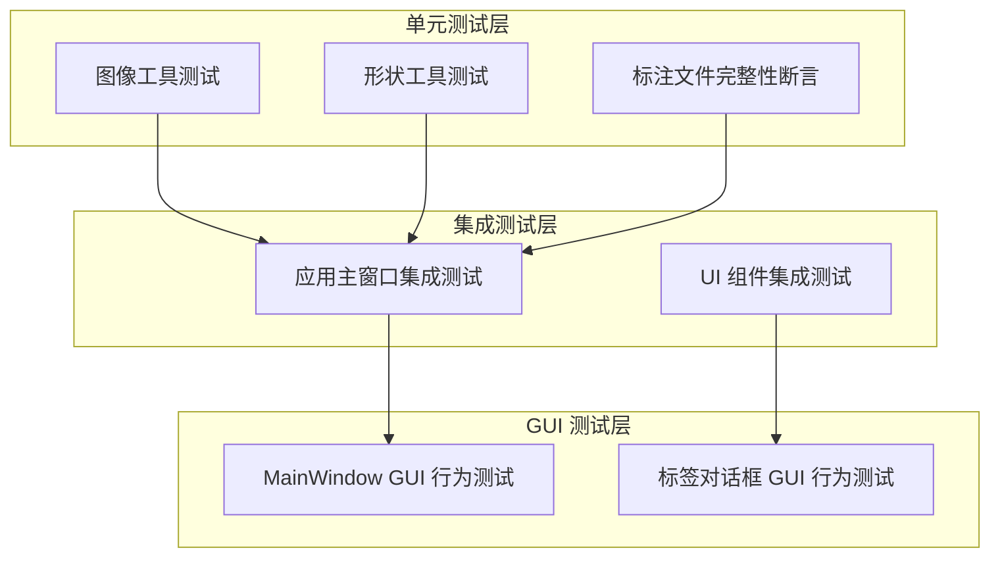
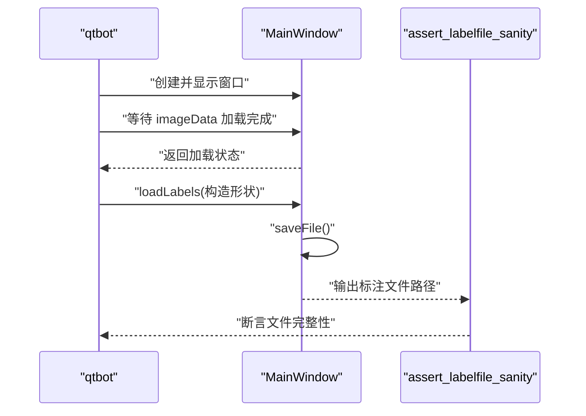
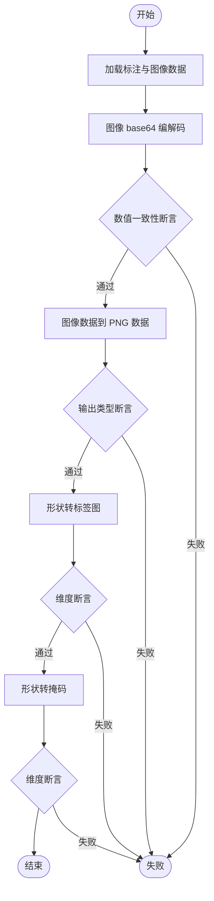
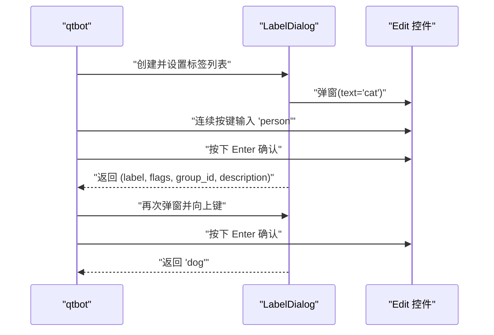
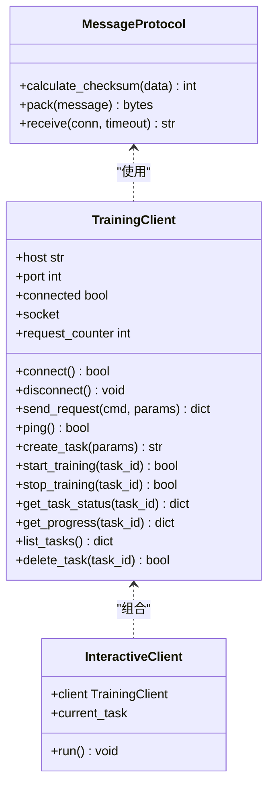
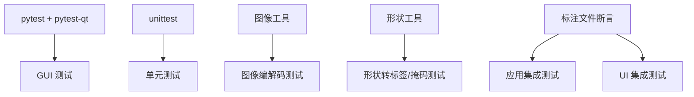

# 测试策略与实践

<cite>
**本文引用的文件**
- [pyproject.toml](file://pyproject.toml)
- [README.md](file://README.md)
- [tests/labelme_tests/test_app.py](file://tests/labelme_tests/test_app.py)
- [tests/labelme_tests/utils_tests/test_image.py](file://tests/labelme_tests/utils_tests/test_image.py)
- [tests/labelme_tests/utils_tests/test_shape.py](file://tests/labelme_tests/utils_tests/test_shape.py)
- [tests/labelme_tests/utils_tests/util.py](file://tests/labelme_tests/utils_tests/util.py)
- [tests/labelme_tests/widgets_tests/test_label_dialog.py](file://tests/labelme_tests/widgets_tests/test_label_dialog.py)
- [tests/labelme_tests/widgets_tests/test_label_list_widget.py](file://tests/labelme_tests/widgets_tests/test_label_list_widget.py)
- [labelme/testing.py](file://labelme/testing.py)
- [training_client/run_tests.py](file://training_client/run_tests.py)
- [training_client/run_tests_report.py](file://training_client/run_tests_report.py)
- [training_client/test_training_client.py](file://training_client/test_training_client.py)
- [training_client/setup.cfg](file://training_client/setup.cfg)
- [training_client/TESTS.md](file://training_client/TESTS.md)
</cite>

## 目录
1. [简介](#简介)
2. [项目结构](#项目结构)
3. [核心组件](#核心组件)
4. [架构总览](#架构总览)
5. [详细组件分析](#详细组件分析)
6. [依赖分析](#依赖分析)
7. [性能考虑](#性能考虑)
8. [故障排查指南](#故障排查指南)
9. [结论](#结论)
10. [附录](#附录)

## 简介
本文件面向 labelme 项目的测试策略与实践，系统梳理单元测试、集成测试与 GUI 测试的架构设计与实施要点；提供 pytest 与 unittest 的使用指南、测试用例编写规范、测试数据准备策略；明确标注引擎、UI 组件、配置管理等关键模块的测试覆盖范围；给出测试执行方法、测试报告生成与持续集成配置建议，并总结测试最佳实践、模拟对象使用与测试数据管理策略。

## 项目结构
项目采用分层组织的测试布局：
- labelme 核心测试位于 tests/labelme_tests，涵盖工具函数（utils）、UI 组件（widgets）与应用入口（test_app.py）。
- 训练客户端测试位于 training_client，包含 unittest 测试、测试运行脚本与报告生成工具。
- 顶层配置与说明文件提供 pytest 标记、GUI 测试标记与运行指引。

```mermaid
graph TB
subgraph "核心测试"
T_APP["tests/labelme_tests/test_app.py"]
T_IMG["tests/labelme_tests/utils_tests/test_image.py"]
T_SHAPE["tests/labelme_tests/utils_tests/test_shape.py"]
T_UTIL["tests/labelme_tests/utils_tests/util.py"]
T_LDLG["tests/labelme_tests/widgets_tests/test_label_dialog.py"]
T_LLW["tests/labelme_tests/widgets_tests/test_label_list_widget.py"]
end
subgraph "训练客户端测试"
TC_RUN["training_client/run_tests.py"]
TC_RUNR["training_client/run_tests_report.py"]
TC_TEST["training_client/test_training_client.py"]
TC_SETUP["training_client/setup.cfg"]
TC_DOC["training_client/TESTS.md"]
end
subgraph "配置与工具"
CFG["pyproject.toml"]
HELP["README.md"]
SANITY["labelme/testing.py"]
end
T_APP --> SANITY
T_IMG --> T_UTIL
T_SHAPE --> T_UTIL
T_LDLG --> SANITY
T_LLW --> SANITY
TC_RUN --> TC_TEST
TC_RUNR --> TC_TEST
CFG --> T_APP
CFG --> T_IMG
CFG --> T_SHAPE
CFG --> T_LDLG
CFG --> T_LLW
CFG --> TC_RUN
CFG --> TC_RUNR
```

**图表来源**
- [pyproject.toml:63-67](file://pyproject.toml#L63-L67)
- [tests/labelme_tests/test_app.py:1-115](file://tests/labelme_tests/test_app.py#L1-L115)
- [tests/labelme_tests/utils_tests/test_image.py:1-32](file://tests/labelme_tests/utils_tests/test_image.py#L1-L32)
- [tests/labelme_tests/utils_tests/test_shape.py:1-25](file://tests/labelme_tests/utils_tests/test_shape.py#L1-L25)
- [tests/labelme_tests/utils_tests/util.py:1-38](file://tests/labelme_tests/utils_tests/util.py#L1-L38)
- [tests/labelme_tests/widgets_tests/test_label_dialog.py:1-94](file://tests/labelme_tests/widgets_tests/test_label_dialog.py#L1-L94)
- [tests/labelme_tests/widgets_tests/test_label_list_widget.py:1-21](file://tests/labelme_tests/widgets_tests/test_label_list_widget.py#L1-L21)
- [labelme/testing.py:1-35](file://labelme/testing.py#L1-L35)
- [training_client/run_tests.py:1-145](file://training_client/run_tests.py#L1-L145)
- [training_client/run_tests_report.py:1-254](file://training_client/run_tests_report.py#L1-L254)
- [training_client/test_training_client.py:1-458](file://training_client/test_training_client.py#L1-L458)
- [training_client/setup.cfg:1-3](file://training_client/setup.cfg#L1-L3)
- [training_client/TESTS.md:1-71](file://training_client/TESTS.md#L1-L71)

**章节来源**
- [pyproject.toml:63-67](file://pyproject.toml#L63-L67)
- [README.md:180-195](file://README.md#L180-L195)

## 核心组件
- 测试框架与标记
  - pytest 配置包含 qt_api 与 gui 标记，用于区分 GUI 测试与非 GUI 测试。
  - 训练客户端测试使用 unittest，提供基础运行脚本与 HTML 报告生成。
- 测试数据与工具
  - labelme/testing.py 提供标注文件完整性断言工具，确保 JSON 标注文件与图像一致。
  - utils_tests/util.py 提供统一的数据加载工具，便于图像与标注数据的复用。
- 测试覆盖范围
  - 工具函数：图像编解码、形状转掩码等核心算法的单元测试。
  - UI 组件：标签对话框、标签列表等 GUI 组件的行为测试。
  - 应用入口：MainWindow 的打开、保存、导航等流程测试。
  - 训练客户端：消息协议、网络交互、任务管理等完整功能链路测试。

**章节来源**
- [pyproject.toml:63-67](file://pyproject.toml#L63-L67)
- [labelme/testing.py:9-35](file://labelme/testing.py#L9-L35)
- [tests/labelme_tests/utils_tests/util.py:11-38](file://tests/labelme_tests/utils_tests/util.py#L11-L38)

## 架构总览
测试架构分为三层：
- 单元测试层：针对工具函数与业务逻辑的纯函数测试，强调快速与高覆盖率。
- 集成测试层：围绕核心模块（标注引擎、UI 组件）的组合测试，验证模块间协作。
- GUI 测试层：基于 pytest-qt 的界面行为测试，覆盖用户交互与渲染稳定性。

**图表来源**
- [tests/labelme_tests/test_app.py:25-115](file://tests/labelme_tests/test_app.py#L25-L115)
- [tests/labelme_tests/utils_tests/test_image.py:12-32](file://tests/labelme_tests/utils_tests/test_image.py#L12-L32)
- [tests/labelme_tests/utils_tests/test_shape.py:6-25](file://tests/labelme_tests/utils_tests/test_shape.py#L6-L25)
- [tests/labelme_tests/widgets_tests/test_label_dialog.py:9-94](file://tests/labelme_tests/widgets_tests/test_label_dialog.py#L9-L94)
- [labelme/testing.py:9-35](file://labelme/testing.py#L9-L35)

## 详细组件分析

### 应用层测试（MainWindow）
- 设计原则
  - 使用临时目录与真实标注数据，验证 MainWindow 的打开、保存、导航与文件完整性。
  - 通过 qtbot 显式等待异步加载完成，保证测试稳定性。
- 关键流程
  - 打开图像/JSON 文件：验证标注文件的 sanity 校验。
  - 目录批量打开：验证 Next/Prev 导航。
  - 标注绘制与保存：构造形状数据，调用 loadLabels 与 saveFile，再进行 sanity 校验。
- 测试数据
  - 使用 tests/labelme_tests/data 下的真实标注与图像数据，确保测试场景贴近生产。

**图表来源**
- [tests/labelme_tests/test_app.py:25-115](file://tests/labelme_tests/test_app.py#L25-L115)
- [labelme/testing.py:9-35](file://labelme/testing.py#L9-L35)

**章节来源**
- [tests/labelme_tests/test_app.py:25-115](file://tests/labelme_tests/test_app.py#L25-L115)
- [labelme/testing.py:9-35](file://labelme/testing.py#L9-L35)

### 工具函数测试（图像与形状）
- 图像工具测试
  - 编解码一致性：验证 base64 与数组互转的数值精度。
  - 图像数据到 PNG 数据的转换：确保输出类型与格式正确。
- 形状工具测试
  - 形状到标签图：验证输出维度与图像尺寸一致。
  - 形状到掩码：验证掩码维度与图像尺寸一致。
- 数据准备
  - 通过 util.py 统一加载标注数据与图像，避免重复解析。

**图表来源**
- [tests/labelme_tests/utils_tests/test_image.py:12-32](file://tests/labelme_tests/utils_tests/test_image.py#L12-L32)
- [tests/labelme_tests/utils_tests/test_shape.py:6-25](file://tests/labelme_tests/utils_tests/test_shape.py#L6-L25)
- [tests/labelme_tests/utils_tests/util.py:11-38](file://tests/labelme_tests/utils_tests/util.py#L11-L38)

**章节来源**
- [tests/labelme_tests/utils_tests/test_image.py:12-32](file://tests/labelme_tests/utils_tests/test_image.py#L12-L32)
- [tests/labelme_tests/utils_tests/test_shape.py:6-25](file://tests/labelme_tests/utils_tests/test_shape.py#L6-L25)
- [tests/labelme_tests/utils_tests/util.py:11-38](file://tests/labelme_tests/utils_tests/util.py#L11-L38)

### UI 组件测试（标签对话框与列表）
- 标签对话框测试
  - 键盘导航：验证上下键切换与文本输入。
  - 历史记录：验证去重与优先级更新。
  - 弹窗交互：通过 QTimer 注入交互事件，验证返回值。
- 标签列表测试
  - 列表项添加与显示：验证渲染与曝光等待。

**图表来源**
- [tests/labelme_tests/widgets_tests/test_label_dialog.py:48-94](file://tests/labelme_tests/widgets_tests/test_label_dialog.py#L48-L94)

**章节来源**
- [tests/labelme_tests/widgets_tests/test_label_dialog.py:9-94](file://tests/labelme_tests/widgets_tests/test_label_dialog.py#L9-L94)
- [tests/labelme_tests/widgets_tests/test_label_list_widget.py:9-21](file://tests/labelme_tests/widgets_tests/test_label_list_widget.py#L9-L21)

### 训练客户端测试（unittest）
- 测试范围
  - 消息协议：打包/解包、校验和、头部与长度字段、Unicode 支持、边界情况。
  - 训练客户端：连接、断开、心跳、任务创建/启动/停止/查询、进度查询、任务列表与删除。
  - 交互式客户端：连接失败场景下的运行流程。
- 报告生成
  - HTMLTestRunner 生成 HTML 与 JSON 报告，包含统计信息与错误详情。

**图表来源**
- [training_client/test_training_client.py:16-458](file://training_client/test_training_client.py#L16-L458)

**章节来源**
- [training_client/test_training_client.py:16-458](file://training_client/test_training_client.py#L16-L458)
- [training_client/run_tests_report.py:63-254](file://training_client/run_tests_report.py#L63-L254)

## 依赖分析
- 测试框架依赖
  - pytest 与 pytest-qt：用于 GUI 测试与标记管理。
  - unittest：训练客户端测试的基础框架。
- 工具函数依赖
  - 图像与形状工具：依赖 numpy、PIL、imgviz 等库。
  - 标注文件断言：依赖 json、os.path、imgviz、labelme.utils。
- 测试数据依赖
  - tests/labelme_tests/data 下的标注与图像文件，作为测试输入。

**图表来源**
- [pyproject.toml:46-53](file://pyproject.toml#L46-L53)
- [tests/labelme_tests/test_app.py:1-115](file://tests/labelme_tests/test_app.py#L1-L115)
- [tests/labelme_tests/utils_tests/test_image.py:1-32](file://tests/labelme_tests/utils_tests/test_image.py#L1-L32)
- [tests/labelme_tests/utils_tests/test_shape.py:1-25](file://tests/labelme_tests/utils_tests/test_shape.py#L1-L25)
- [labelme/testing.py:1-35](file://labelme/testing.py#L1-L35)

**章节来源**
- [pyproject.toml:46-53](file://pyproject.toml#L46-L53)
- [labelme/testing.py:1-35](file://labelme/testing.py#L1-L35)

## 性能考虑
- GUI 测试稳定性
  - 使用 qtbot.waitUntil 与 qtbot.waitExposed 等显式等待，避免竞态条件。
  - 尽量使用最小化数据集与临时文件，缩短测试时长。
- 单元测试性能
  - 对纯函数与工具函数测试应避免外部 I/O，必要时使用小样本数据。
  - 使用 mock.patch 减少网络与磁盘访问，提升执行速度。
- 报告生成
  - HTML 报告生成仅在需要时启用，避免 CI 环境中不必要的输出。

[本节为通用指导，无需“章节来源”]

## 故障排查指南
- GUI 测试失败
  - 确认 qt_api 配置正确，且测试标记为 gui。
  - 检查窗口显示与事件注入时机，适当增加等待时间。
- 标注文件断言失败
  - 检查 imageHeight/imageWidth 与图像尺寸一致性。
  - 确认 points 坐标在 [0, W] 与 [0, H] 范围内。
- 训练客户端测试失败
  - 检查网络模拟与 socket.patch 配置。
  - 确认消息协议打包/解包字段与长度一致。
- 报告生成问题
  - 确认输出目录权限与路径存在。
  - 检查 HTML 与 JSON 报告文件是否生成成功。

**章节来源**
- [pyproject.toml:63-67](file://pyproject.toml#L63-L67)
- [labelme/testing.py:9-35](file://labelme/testing.py#L9-L35)
- [training_client/run_tests_report.py:78-219](file://training_client/run_tests_report.py#L78-L219)

## 结论
本测试策略以 pytest 与 unittest 双轨并行，覆盖工具函数、UI 组件与应用主流程，并通过训练客户端测试保障网络协议与任务管理的可靠性。通过统一的断言工具与测试数据准备，确保测试的稳定性与可维护性。建议在 CI 中结合 GUI 标记与报告生成，形成完整的质量反馈闭环。

[本节为总结性内容，无需“章节来源”]

## 附录

### 测试框架使用指南
- pytest 配置
  - 在 pyproject.toml 中设置 qt_api 与 gui 标记，确保 GUI 测试可识别。
- 测试用例编写
  - 使用 qtbot 注入事件与等待，确保 UI 行为可验证。
  - 对纯函数与工具函数使用直接断言，避免外部依赖。
- 测试数据准备
  - 使用 tests/labelme_tests/data 下的真实数据，或通过 util.py 统一加载。

**章节来源**
- [pyproject.toml:63-67](file://pyproject.toml#L63-L67)
- [tests/labelme_tests/utils_tests/util.py:11-38](file://tests/labelme_tests/utils_tests/util.py#L11-L38)

### 测试执行方法
- pytest 执行
  - 运行所有测试：pytest
  - 运行 GUI 测试：pytest -m gui
  - 指定测试文件：pytest tests/labelme_tests/test_app.py
- unittest 执行
  - 运行训练客户端测试：python training_client/run_tests.py
  - 生成 HTML 报告：python training_client/run_tests_report.py

**章节来源**
- [training_client/run_tests.py:107-145](file://training_client/run_tests.py#L107-L145)
- [training_client/run_tests_report.py:222-254](file://training_client/run_tests_report.py#L222-L254)
- [training_client/TESTS.md:3-35](file://training_client/TESTS.md#L3-L35)

### 测试报告生成
- HTML 报告
  - 自动生成 test_report.html，包含统计与错误详情。
- JSON 报告
  - 自动生成 test_report.json，便于 CI 集成与二次分析。

**章节来源**
- [training_client/run_tests_report.py:78-219](file://training_client/run_tests_report.py#L78-L219)

### 持续集成配置建议
- 触发策略
  - 推送与拉取请求触发测试矩阵（不同 Python 版本与 GUI 环境）。
- 测试矩阵
  - 单元测试：pytest（非 GUI）
  - GUI 测试：pytest（标记 gui）
  - 训练客户端测试：unittest（独立脚本）
- 报告归档
  - 上传 HTML 与 JSON 报告至 CI 归档，便于回溯。

[本节为通用指导，无需“章节来源”]

### 最佳实践与模拟对象使用
- 模拟对象
  - 使用 unittest.mock.patch 替换 socket、网络 I/O 与外部服务。
  - 对 GUI 测试使用 qtbot 的事件注入，避免真实交互。
- 测试数据管理
  - 使用 tests/labelme_tests/data 下的固定样例，确保可重复性。
  - 对临时文件使用临时目录，测试结束后清理。
- 断言策略
  - 使用 labelme/testing.py 的断言工具，统一标注文件校验标准。

**章节来源**
- [training_client/test_training_client.py:6,92-130:6-130](file://training_client/test_training_client.py#L6-L130)
- [tests/labelme_tests/test_app.py:79-115](file://tests/labelme_tests/test_app.py#L79-L115)
- [labelme/testing.py:9-35](file://labelme/testing.py#L9-L35)