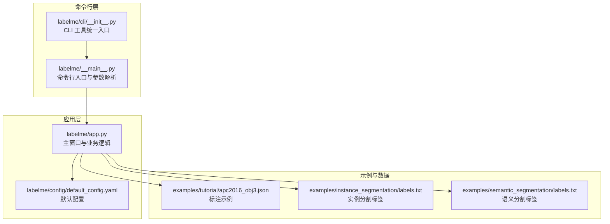

# 快速开始

<cite>
**本文引用的文件**
- [README.md](file://README.md)
- [pyproject.toml](file://pyproject.toml)
- [labelme/__main__.py](file://labelme/__main__.py)
- [labelme/app.py](file://labelme/app.py)
- [labelme/config/default_config.yaml](file://labelme/config/default_config.yaml)
- [labelme/cli/__init__.py](file://labelme/cli/__init__.py)
- [examples/tutorial/README.md](file://examples/tutorial/README.md)
- [examples/tutorial/apc2016_obj3.json](file://examples/tutorial/apc2016_obj3.json)
- [examples/instance_segmentation/README.md](file://examples/instance_segmentation/README.md)
- [examples/instance_segmentation/labels.txt](file://examples/instance_segmentation/labels.txt)
- [examples/semantic_segmentation/labels.txt](file://examples/semantic_segmentation/labels.txt)
- [run_labelme.bat](file://run_labelme.bat)
- [run_labelme.ps1](file://run_labelme.ps1)
</cite>

## 目录
1. [简介](#简介)
2. [安装方式总览](#安装方式总览)
3. [Windows 安装指南](#windows-安装指南)
4. [Linux/macOS 安装指南](#linuxmacos-安装指南)
5. [首次使用：从零开始标注](#首次使用从零开始标注)
6. [基础使用示例](#基础使用示例)
7. [命令行参数详解](#命令行参数详解)
8. [常见问题与故障排除](#常见问题与故障排除)
9. [架构概览](#架构概览)
10. [结语](#结语)

## 简介
Labelme 是一个基于 Python 和 Qt 的图像多边形标注工具，支持多种标注形状（多边形、矩形、圆形、线条、点），并提供 AI 辅助标注、视频标注、多种导出格式（VOC、COCO）等能力。本快速开始指南将带你完成从安装到首次标注的全流程，确保你在 30 分钟内上手使用。

## 安装方式总览
Labelme 提供三种安装方式，满足不同平台与使用习惯的需求：

- 方式一：使用 pip 安装（推荐）
  - 优点：标准 Python 包管理，便于升级与卸载；适合开发者与需要定制的用户。
  - 适用场景：Windows/Linux/macOS；已有 Python 环境；需要命令行工具与脚本支持。
- 方式二：使用独立可执行文件（最简单）
  - 优点：无需 Python/Qt 依赖，开箱即用；适合一次性使用或临时标注。
  - 适用场景：Windows/Linux/macOS；追求“即下即用”体验。
- 方式三：使用 Linux 发行版的包管理器
  - 优点：系统级安装，易于管理；适合 Linux 用户。
  - 适用场景：Ubuntu/Debian/CentOS/Fedora 等发行版。

章节来源
- [README.md:52-78](file://README.md#L52-L78)

## Windows 安装指南
Windows 用户可选择 pip 或独立可执行文件两种方式。若你已有 Python 环境，推荐使用 pip；若希望最简化安装，可直接下载独立可执行文件。

- 使用 pip 安装（推荐）
  - 环境准备：确保已安装 Python 3.9+，建议使用虚拟环境隔离依赖。
  - 安装命令：使用 pip 安装最新版本或从本地源码安装。
  - 验证安装：通过命令行测试导入与帮助信息。
- 使用独立可执行文件
  - 直接下载并运行，无需额外依赖。
- 使用 Conda 环境（可选）
  - 若你使用 Conda，可通过批处理脚本自动定位环境并运行 Labelme。

章节来源
- [README.md:56-64](file://README.md#L56-L64)
- [README.md:66-71](file://README.md#L66-L71)
- [run_labelme.bat:1-75](file://run_labelme.bat#L1-L75)
- [run_labelme.ps1:1-86](file://run_labelme.ps1#L1-L86)

## Linux/macOS 安装指南
Linux/macOS 用户同样可选择 pip 或包管理器安装，推荐使用 pip 以获得最新版本与完整功能。

- 使用 pip 安装（推荐）
  - 环境准备：确保 Python 3.9+ 与常用系统库（如 libxcb、libx11 等）可用。
  - 安装命令：使用 pip 安装或从源码安装。
  - 验证安装：通过命令行测试导入与帮助信息。
- 使用包管理器（部分发行版）
  - 某些 Linux 发行版可通过 apt/pacman 等包管理器安装 labelme。

章节来源
- [README.md:56-64](file://README.md#L56-L64)
- [README.md:73-77](file://README.md#L73-L77)

## 首次使用：从零开始标注
按照以下步骤，你可以在 30 分钟内完成安装并成功进行第一次标注：

- 步骤 1：安装 Labelme
  - Windows：使用 pip 或独立可执行文件。
  - Linux/macOS：使用 pip 或包管理器。
- 步骤 2：准备一张示例图片
  - 可使用仓库中的示例图片，例如 tutorial 目录下的示例图像。
- 步骤 3：启动标注
  - 命令行启动：在终端中运行 labelme 并打开图像文件。
  - GUI 启动：双击独立可执行文件或通过桌面快捷方式启动。
- 步骤 4：进行标注
  - 在界面中选择合适的标注工具（多边形、矩形等），绘制标注并设置标签。
- 步骤 5：保存与导出
  - 标注完成后保存为 JSON 文件，并可进一步导出为 VOC/COCO 等格式。

章节来源
- [README.md:180-195](file://README.md#L180-L195)
- [examples/tutorial/README.md:1-21](file://examples/tutorial/README.md#L1-L21)

## 基础使用示例
以下示例覆盖单张图像标注、目录批量标注与常用命令行参数的使用。

- 单张图像标注
  - 基本命令：打开指定图像文件进行标注。
  - 指定输出：标注完成后自动保存到指定 JSON 文件。
  - 不包含图像数据：仅保存标注信息，不包含图像数据。
  - 指定标签列表：限定可用标签，便于一致性标注。
- 目录批量标注
  - 打开目录后，逐张图像进行标注，标注结果分别保存至同名 JSON 文件。
  - 使用标签文件：通过标签文件统一约束标签集合。
- 常用命令行参数
  - 输出控制：指定输出文件或目录。
  - 配置文件：指定自定义配置文件路径。
  - 标签与标志：传入逗号分隔的标签列表或文件路径。
  - 标签排序与校验：控制标签排序与启用标签校验。
  - 自动保存与图像数据存储：控制自动保存与是否将图像数据写入 JSON。

章节来源
- [README.md:202-226](file://README.md#L202-L226)
- [examples/tutorial/README.md:5-7](file://examples/tutorial/README.md#L5-L7)
- [examples/instance_segmentation/README.md:5-8](file://examples/instance_segmentation/README.md#L5-L8)

## 命令行参数详解
以下参数在首次使用时尤为有用，建议结合实际需求灵活组合。

- 版本与配置
  - 显示版本：查看当前安装的 Labelme 版本。
  - 重置 Qt 配置：清空 Qt 相关配置后退出。
- 输入与输出
  - 图像/标签文件：指定要打开的图像或标签文件。
  - 输出文件或目录：以 .json 结尾视为文件，否则视为目录。
- 标签与标志
  - 标签列表：传入逗号分隔的标签，或指定包含标签的文件。
  - 标签特定标志：为特定标签设置标志规则（支持 YAML 字符串或文件）。
  - 标志列表：全局标志列表（支持 YAML 字符串或文件）。
  - 标签排序：禁用默认的字母排序，按提供的顺序显示标签。
  - 标签校验：启用严格标签校验（需配合标签列表使用）。
- 图像与界面
  - 自动保存：开启自动保存功能。
  - 图像数据存储：控制是否将图像数据写入 JSON。
  - 保持前一帧：保留上一帧的标注。
  - 选择精度：设置画布上查找最近顶点的精度。
- 配置文件
  - 指定配置文件：加载自定义配置文件或直接传入 YAML 字符串。

章节来源
- [labelme/__main__.py:137-223](file://labelme/__main__.py#L137-L223)
- [README.md:219-226](file://README.md#L219-L226)

## 常见问题与故障排除
- 导入错误
  - 症状：出现模块导入失败的错误。
  - 排查：检查自动化模块导入路径、翻译文件是否存在、配置文件编码是否为 UTF-8 without BOM；必要时处理可选依赖（如 osam 模块缺失不会影响基本功能）。
- AI 功能相关
  - 症状：AI 模型报错或无法使用。
  - 排查：确认图像尺寸与格式符合要求（至少 10x10 像素、RGB 三通道）；系统已内置图像预处理；若 osam 缺失，功能会优雅降级。
- 防止多次启动
  - 症状：提示“已有实例运行”。
  - 排查：系统会自动清理僵尸进程的共享内存；若问题持续，可重启系统或手动清理共享内存；当共享内存不可用时，功能会优雅降级。
- 测试安装
  - 建议：安装完成后运行导入测试与帮助信息测试，确保环境正常。

章节来源
- [README.md:79-106](file://README.md#L79-L106)
- [README.md:108-151](file://README.md#L108-L151)
- [README.md:153-178](file://README.md#L153-L178)
- [README.md:180-195](file://README.md#L180-L195)

## 架构概览
Labelme 的核心由命令行入口、主窗口与配置系统构成，整体采用模块化设计，CLI 工具通过统一入口暴露功能。

图表来源
- [labelme/__main__.py:137-359](file://labelme/__main__.py#L137-L359)
- [labelme/app.py:99-200](file://labelme/app.py#L99-L200)
- [labelme/config/default_config.yaml:1-147](file://labelme/config/default_config.yaml#L1-L147)
- [labelme/cli/__init__.py:1-13](file://labelme/cli/__init__.py#L1-L13)
- [examples/tutorial/apc2016_obj3.json:1-200](file://examples/tutorial/apc2016_obj3.json#L1-L200)
- [examples/instance_segmentation/labels.txt:1-22](file://examples/instance_segmentation/labels.txt#L1-L22)
- [examples/semantic_segmentation/labels.txt:1-22](file://examples/semantic_segmentation/labels.txt#L1-L22)

## 结语
至此，你已经完成了 Labelme 的安装与首次标注实践。建议在日常使用中逐步掌握命令行参数、配置文件与导出流程，并结合示例目录加深理解。如遇问题，可参考常见问题与故障排除章节，或查阅仓库中的示例与文档。