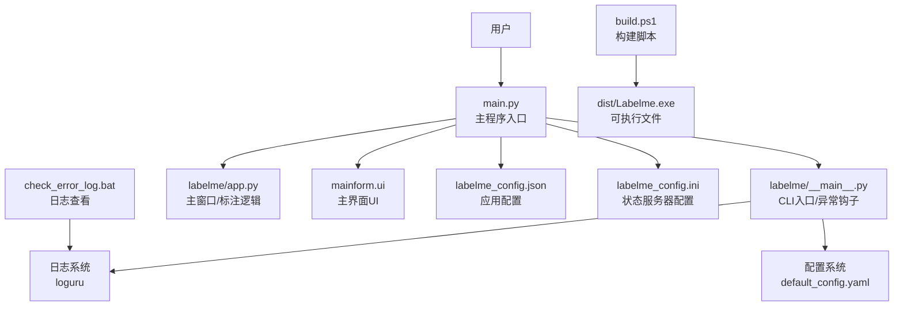
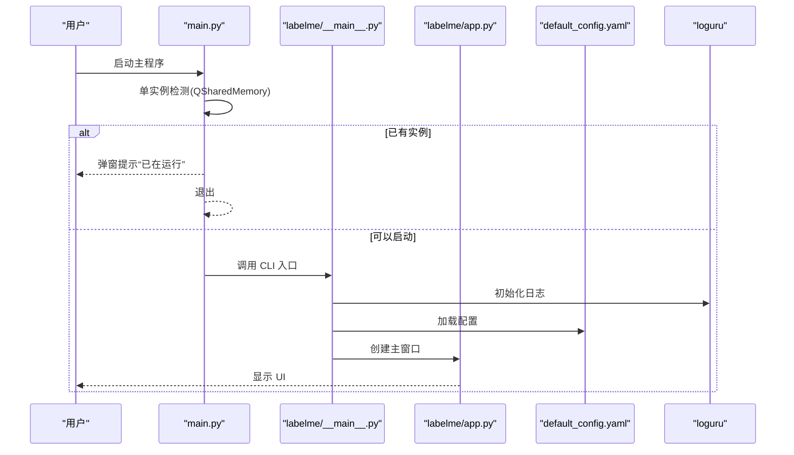
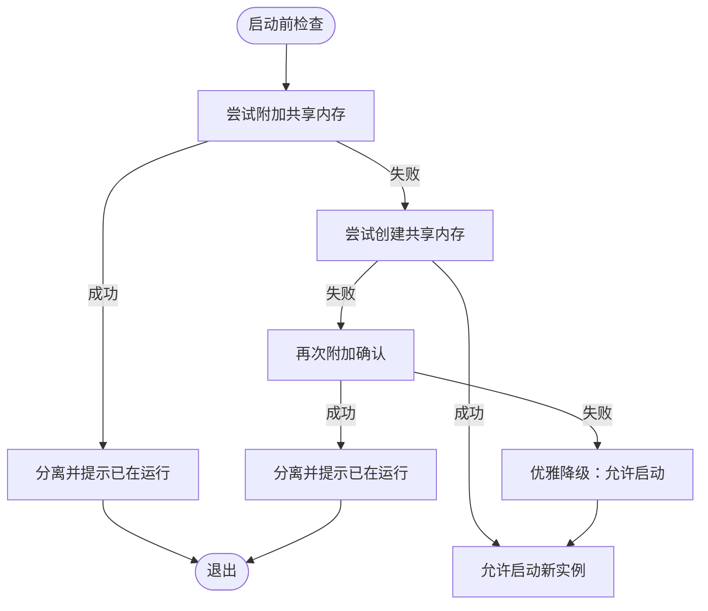
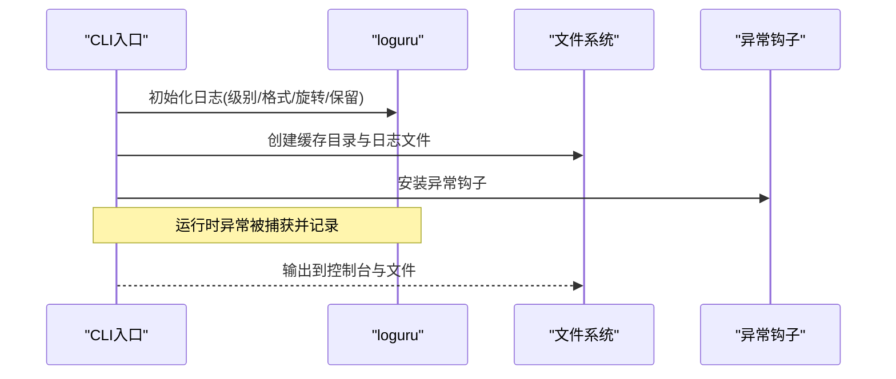
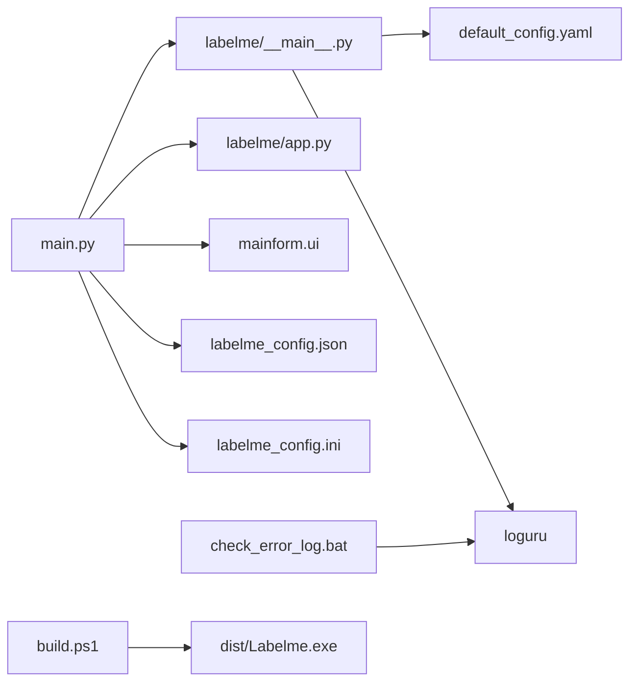

# 故障排除与维护

<cite>
**本文档引用的文件**   
- [README.md](file://README.md)
- [main.py](file://main.py)
- [labelme/__main__.py](file://labelme/__main__.py)
- [修复总结.md](file://修复总结.md)
- [labelme/app.py](file://labelme/app.py)
- [labelme/config/default_config.yaml](file://labelme/config/default_config.yaml)
- [labelme_config.json](file://labelme_config.json)
- [labelme_config.ini](file://labelme_config.ini)
- [check_error_log.bat](file://check_error_log.bat)
- [build.ps1](file://build.ps1)
- [check_and_move.ps1](file://check_and_move.ps1)
- [run_labelme.ps1](file://run_labelme.ps1)
- [setup_debug.bat](file://setup_debug.bat)
- [mainform.ui](file://mainform.ui)
</cite>

## 目录
1. [简介](#简介)
2. [项目结构](#项目结构)
3. [核心组件](#核心组件)
4. [架构总览](#架构总览)
5. [详细组件分析](#详细组件分析)
6. [依赖关系分析](#依赖关系分析)
7. [性能考虑](#性能考虑)
8. [故障排除指南](#故障排除指南)
9. [结论](#结论)
10. [附录](#附录)

## 简介
本指南面向使用与维护 labelme 的工程师与技术支持人员，系统性整理安装、运行时错误、性能与配置问题的诊断与修复流程，并提供日志分析方法、预防性维护建议、卸载清理与数据迁移方案，以及标准化的问题处理流程。内容覆盖 Windows 环境下的脚本与工具链，同时给出跨平台通用建议。

## 项目结构
- 应用入口与主窗口
  - 主程序入口与单实例检测：[main.py](file://main.py)
  - 标准 CLI 入口与日志/异常钩子：[labelme/__main__.py](file://labelme/__main__.py)
- 核心应用与 UI
  - 主窗口与标注逻辑：[labelme/app.py](file://labelme/app.py)
  - 主界面 UI 描述：[mainform.ui](file://mainform.ui)
- 配置与状态
  - 默认配置（YAML）：[labelme/config/default_config.yaml](file://labelme/config/default_config.yaml)
  - 应用状态服务器配置（INI）：[labelme_config.ini](file://labelme_config.ini)
  - 应用配置（JSON）：[labelme_config.json](file://labelme_config.json)
- 日志与构建
  - 日志查看脚本（Windows）：[check_error_log.bat](file://check_error_log.bat)
  - 构建脚本（Windows）：[build.ps1](file://build.ps1)
  - 构建与移动脚本（Windows）：[check_and_move.ps1](file://check_and_move.ps1)
  - 运行脚本（Windows）：[run_labelme.ps1](file://run_labelme.ps1)
  - 调试环境设置脚本（Windows）：[setup_debug.bat](file://setup_debug.bat)
- 常见问题修复与说明
  - 修复总结（导入错误与 AI 功能）：[修复总结.md](file://修复总结.md)
  - 顶层说明与常见问题：[README.md](file://README.md)

**图表来源**
- [main.py:1-694](file://main.py#L1-L694)
- [labelme/__main__.py:137-359](file://labelme/__main__.py#L137-L359)
- [labelme/app.py:1-200](file://labelme/app.py#L1-L200)
- [labelme/config/default_config.yaml:1-147](file://labelme/config/default_config.yaml#L1-L147)
- [labelme_config.json:1-5](file://labelme_config.json#L1-L5)
- [labelme_config.ini:1-5](file://labelme_config.ini#L1-L5)
- [check_error_log.bat:1-19](file://check_error_log.bat#L1-L19)
- [build.ps1:1-257](file://build.ps1#L1-L257)

**章节来源**
- [README.md:1-262](file://README.md#L1-L262)
- [main.py:1-694](file://main.py#L1-L694)
- [labelme/__main__.py:137-359](file://labelme/__main__.py#L137-L359)
- [labelme/app.py:1-200](file://labelme/app.py#L1-L200)
- [labelme/config/default_config.yaml:1-147](file://labelme/config/default_config.yaml#L1-L147)
- [labelme_config.json:1-5](file://labelme_config.json#L1-L5)
- [labelme_config.ini:1-5](file://labelme_config.ini#L1-L5)
- [check_error_log.bat:1-19](file://check_error_log.bat#L1-L19)
- [build.ps1:1-257](file://build.ps1#L1-L257)

## 核心组件
- 单实例检测与防重复启动
  - 使用共享内存（QSharedMemory）确保同一时刻仅有一个实例运行，避免资源冲突与状态混乱。
  - 若检测到已有实例，弹出提示并优雅退出；若共享内存不可用，允许启动但不保证互斥。
- 日志系统
  - 使用 loguru 输出到标准错误与本地缓存目录下的压缩日志文件，支持旋转与保留策略。
  - CLI 入口提供日志级别参数与异常钩子，捕获未处理异常并弹窗提示。
- 配置系统
  - 默认配置采用 YAML，包含自动保存、标签、颜色、快捷键、AI 模型等。
  - 用户可通过命令行指定配置文件或 YAML 字符串覆盖默认行为。
- 主窗口与 UI
  - 主窗口封装标注、AI 提示、TCP 通信、文件监控、状态保存等能力。
  - UI 由 Qt Designer 导出的 .ui 文件定义，主程序动态加载并注入 labelme 的核心窗口。

**章节来源**
- [main.py:30-116](file://main.py#L30-L116)
- [labelme/__main__.py:21-58](file://labelme/__main__.py#L21-L58)
- [labelme/__main__.py:69-98](file://labelme/__main__.py#L69-L98)
- [labelme/__main__.py:137-359](file://labelme/__main__.py#L137-L359)
- [labelme/config/default_config.yaml:1-147](file://labelme/config/default_config.yaml#L1-L147)
- [labelme/app.py:99-200](file://labelme/app.py#L99-L200)
- [mainform.ui:1-200](file://mainform.ui#L1-L200)

## 架构总览

**图表来源**
- [main.py:614-673](file://main.py#L614-L673)
- [labelme/__main__.py:137-359](file://labelme/__main__.py#L137-L359)
- [labelme/app.py:99-200](file://labelme/app.py#L99-L200)
- [labelme/config/default_config.yaml:1-147](file://labelme/config/default_config.yaml#L1-L147)

## 详细组件分析

### 单实例检测与防重复启动
- 实现要点
  - 使用固定键值的 QSharedMemory 进行互斥检测。
  - 先尝试附加，再尝试创建，失败时二次确认，最终根据结果决定是否允许启动。
  - 若共享内存不可用，允许启动但不保证互斥，属于优雅降级。
- 常见问题
  - “已在运行”提示但无实例：系统会自动清理僵尸进程的共享内存；若持续，可重启系统或手动清理共享内存。
  - 共享内存不可用：功能优雅降级，允许启动多个实例。
- 诊断步骤
  - 检查是否已有实例运行（任务管理器/进程列表）。
  - 查看系统共享内存状态（Windows 可使用资源监视器）。
  - 重启后再次尝试启动，观察是否仍提示已在运行。

**图表来源**
- [main.py:80-116](file://main.py#L80-L116)
- [labelme/__main__.py:29-58](file://labelme/__main__.py#L29-L58)

**章节来源**
- [main.py:30-116](file://main.py#L30-L116)
- [labelme/__main__.py:21-58](file://labelme/__main__.py#L21-L58)
- [README.md:153-179](file://README.md#L153-L179)

### 日志系统与异常处理
- 日志配置
  - 控制台输出与本地缓存目录（Windows 为 %LOCALAPPDATA%\labelme，其他为 ~/.cache/labelme）。
  - 支持旋转（10MB）、保留（30天）、压缩（gz）、异步队列、回溯与诊断信息。
- 异常处理
  - CLI 入口安装异常钩子，捕获未处理异常并弹窗显示详细堆栈。
  - 主程序入口捕获所有异常并记录堆栈，必要时调用系统退出码。
- 日志查看
  - Windows 提供批处理脚本查看最近 50 行日志，便于快速定位问题。

**图表来源**
- [labelme/__main__.py:69-98](file://labelme/__main__.py#L69-L98)
- [labelme/__main__.py:306-331](file://labelme/__main__.py#L306-L331)
- [check_error_log.bat:1-19](file://check_error_log.bat#L1-L19)

**章节来源**
- [labelme/__main__.py:69-98](file://labelme/__main__.py#L69-L98)
- [labelme/__main__.py:306-331](file://labelme/__main__.py#L306-L331)
- [check_error_log.bat:1-19](file://check_error_log.bat#L1-L19)

### 配置系统与状态管理
- 默认配置
  - 包含自动保存、标签与标志、颜色、形状样式、AI 模型、停靠窗口、画布、快捷键等。
  - 可通过命令行参数或配置文件覆盖。
- 应用状态
  - INI 配置用于状态服务器监听地址、端口与开关。
  - JSON 配置用于默认图片目录与保存开关等。

**章节来源**
- [labelme/config/default_config.yaml:1-147](file://labelme/config/default_config.yaml#L1-L147)
- [labelme_config.ini:1-5](file://labelme_config.ini#L1-L5)
- [labelme_config.json:1-5](file://labelme_config.json#L1-L5)

### 主窗口与 UI 集成
- 主窗口职责
  - 管理 UI 布局、事件处理、文件操作、标注工具、AI 辅助、TCP 通信、文件监控、配置与状态保存。
- UI 集成
  - 通过 uic 动态加载 .ui 文件，将 labelme 的核心窗口嵌入到自定义主界面中。
  - 隐藏原生菜单栏与工具栏，统一使用自定义 UI。

**章节来源**
- [labelme/app.py:99-200](file://labelme/app.py#L99-L200)
- [main.py:118-235](file://main.py#L118-L235)
- [mainform.ui:1-200](file://mainform.ui#L1-L200)

## 依赖关系分析

**图表来源**
- [main.py:1-694](file://main.py#L1-L694)
- [labelme/__main__.py:1-359](file://labelme/__main__.py#L1-L359)
- [labelme/app.py:1-200](file://labelme/app.py#L1-L200)
- [labelme/config/default_config.yaml:1-147](file://labelme/config/default_config.yaml#L1-L147)
- [labelme_config.json:1-5](file://labelme_config.json#L1-L5)
- [labelme_config.ini:1-5](file://labelme_config.ini#L1-L5)
- [check_error_log.bat:1-19](file://check_error_log.bat#L1-L19)
- [build.ps1:1-257](file://build.ps1#L1-L257)

**章节来源**
- [main.py:1-694](file://main.py#L1-L694)
- [labelme/__main__.py:1-359](file://labelme/__main__.py#L1-L359)
- [labelme/app.py:1-200](file://labelme/app.py#L1-L200)
- [labelme/config/default_config.yaml:1-147](file://labelme/config/default_config.yaml#L1-L147)
- [labelme_config.json:1-5](file://labelme_config.json#L1-L5)
- [labelme_config.ini:1-5](file://labelme_config.ini#L1-L5)
- [check_error_log.bat:1-19](file://check_error_log.bat#L1-L19)
- [build.ps1:1-257](file://build.ps1#L1-L257)

## 性能考虑
- 启动性能
  - 避免窗口闪烁：通过 WA_DontShowOnScreen 属性延迟显示，减少初始化阶段的重绘。
  - 单实例检测前置：在 QApplication 创建后再进行共享内存检测，确保互斥有效。
- 日志性能
  - 异步写入与压缩轮转，避免日志文件过大影响 IO。
- UI 响应
  - 将 labelme 的核心窗口嵌入自定义 UI，减少重复 UI 初始化成本。
- 建议
  - 合理设置日志级别（生产环境建议 info 或 warning）。
  - 避免在标注过程中频繁刷新或加载超大图像。

**章节来源**
- [main.py:175-235](file://main.py#L175-L235)
- [labelme/__main__.py:69-98](file://labelme/__main__.py#L69-L98)

## 故障排除指南

### 安装与导入问题
- 症状
  - 启动时报错：找不到模块 labelme。
- 根因与修复
  - 自动化模块导入路径使用相对路径导致导入失败 → 改为绝对路径导入。
  - 翻译文件扩展名错误 → 修正为 .ts。
  - 配置文件包含 BOM 导致 YAML 解析失败 → 保存为 UTF-8 without BOM。
  - 可选依赖 osam 缺失 → 采用条件导入与优雅降级。
- 验证
  - 成功导入 labelme、显示版本信息、加载配置、GUI 初始化、命令行帮助均正常。

**章节来源**
- [修复总结.md:1-74](file://修复总结.md#L1-L74)
- [README.md:79-107](file://README.md#L79-L107)

### 运行时错误与崩溃
- 常见错误
  - 未处理异常：CLI 入口安装异常钩子，捕获并弹窗显示堆栈。
  - 日志级别不当：可能导致日志过多影响性能或过少难以诊断。
- 诊断步骤
  - 使用日志查看脚本获取最近日志。
  - 降低日志级别为 debug，复现问题后收集详细堆栈。
  - 检查异常钩子弹窗中的详细信息，定位具体异常类型与位置。

**章节来源**
- [labelme/__main__.py:306-331](file://labelme/__main__.py#L306-L331)
- [labelme/__main__.py:69-98](file://labelme/__main__.py#L69-L98)
- [check_error_log.bat:1-19](file://check_error_log.bat#L1-L19)

### 单实例冲突与僵尸进程
- 症状
  - 提示“已在运行”，但无实例。
- 处理
  - 系统会自动清理僵尸进程的共享内存；若无效，重启系统或手动清理共享内存。
  - 共享内存不可用时，功能优雅降级，允许启动多个实例。
- 预防
  - 正常退出应用，确保共享内存被正确释放。
  - 避免强制结束进程导致共享内存残留。

**章节来源**
- [main.py:80-116](file://main.py#L80-L116)
- [labelme/__main__.py:29-58](file://labelme/__main__.py#L29-L58)
- [README.md:172-179](file://README.md#L172-L179)

### AI 功能与图像处理问题
- 症状
  - 图像格式或尺寸异常导致处理失败。
- 处理
  - 确保图像尺寸≥10x10 像素，RGB 三通道。
  - 系统具备图像预处理能力，自动处理常见异常。
- 验证
  - 使用 README 中的 AI 功能安装与验证步骤进行测试。

**章节来源**
- [README.md:137-152](file://README.md#L137-L152)

### 配置问题
- 常见问题
  - 自动保存、标签列表、颜色与快捷键未生效。
- 排查
  - 检查默认配置文件与命令行覆盖是否正确。
  - 检查应用状态服务器配置（INI）与应用配置（JSON）。
- 建议
  - 使用命令行参数临时覆盖配置进行快速验证。
  - 修改配置后重启应用以确保生效。

**章节来源**
- [labelme/config/default_config.yaml:1-147](file://labelme/config/default_config.yaml#L1-L147)
- [labelme_config.ini:1-5](file://labelme_config.ini#L1-L5)
- [labelme_config.json:1-5](file://labelme_config.json#L1-L5)

### 构建与部署问题（Windows）
- 症状
  - 构建失败、找不到可执行文件、conda 环境路径异常。
- 处理
  - 使用构建脚本自动查找 conda 环境或使用 conda run。
  - 等待构建完成（可能耗时较长），检查 dist 目录。
  - 若失败，检查脚本输出与错误信息，确认环境与依赖。
- 验证
  - 运行构建产物或使用运行脚本启动。

**章节来源**
- [build.ps1:1-257](file://build.ps1#L1-L257)
- [check_and_move.ps1:1-257](file://check_and_move.ps1#L1-L257)
- [run_labelme.ps1:1-86](file://run_labelme.ps1#L1-L86)

### 调试与开发环境
- 调试环境设置
  - 使用调试脚本自动发现 conda Python 并更新 VS Code 设置。
  - 若失败，手动在 VS Code 中选择 conda 环境的 Python。
- 建议
  - 在开发环境中启用更高日志级别，便于定位问题。
  - 使用 UI 文件与主窗口集成方式进行端到端调试。

**章节来源**
- [setup_debug.bat:1-31](file://setup_debug.bat#L1-L31)
- [main.py:118-235](file://main.py#L118-L235)
- [mainform.ui:1-200](file://mainform.ui#L1-L200)

### 日志分析与错误解读
- 日志位置
  - Windows：%LOCALAPPDATA%\labelme\labelme.log
  - 其他系统：~/.cache/labelme/labelme.log
- 分析方法
  - 使用日志查看脚本获取最近 50 行。
  - 关注异常钩子弹窗中的异常类型与堆栈。
  - 结合配置与构建脚本输出进行交叉验证。

**章节来源**
- [labelme/__main__.py:69-98](file://labelme/__main__.py#L69-L98)
- [check_error_log.bat:1-19](file://check_error_log.bat#L1-L19)

### 预防性维护建议
- 定期检查
  - 检查日志文件大小与轮转策略，避免磁盘占用过高。
  - 验证配置文件编码（UTF-8 without BOM）与扩展名（.ts）。
- 性能监控
  - 合理设置日志级别，避免 debug 造成性能下降。
  - 监控构建与运行脚本输出，及时发现环境问题。
- 数据备份
  - 备份配置文件与标注数据，确保可恢复。
  - 对重要配置（INI/JSON）进行版本控制。

**章节来源**
- [labelme/config/default_config.yaml:1-147](file://labelme/config/default_config.yaml#L1-L147)
- [labelme_config.ini:1-5](file://labelme_config.ini#L1-L5)
- [labelme_config.json:1-5](file://labelme_config.json#L1-L5)
- [labelme/__main__.py:69-98](file://labelme/__main__.py#L69-L98)

### 卸载清理与数据迁移
- 卸载清理
  - 删除应用缓存目录（Windows：%LOCALAPPDATA%\labelme，其他：~/.cache/labelme）。
  - 清理配置文件（~/.labelmerc）与状态服务器配置。
  - 清理共享内存（若存在）。
- 数据迁移
  - 备份标注 JSON 文件与相关图像。
  - 迁移配置文件至新环境，确保编码与格式正确。
  - 使用命令行参数或新配置文件覆盖默认行为。

**章节来源**
- [labelme/__main__.py:69-98](file://labelme/__main__.py#L69-L98)
- [labelme_config.ini:1-5](file://labelme_config.ini#L1-L5)

### 技术支持标准化流程
- 标准流程
  - 环境确认：操作系统、Python/conda 环境、依赖版本。
  - 问题复现：提供最小复现步骤与日志。
  - 配置核验：检查配置文件编码、扩展名与覆盖参数。
  - 构建验证：使用构建脚本验证可执行文件生成。
  - 异常分析：结合异常钩子弹窗与日志文件定位根因。
  - 修复与回归：提供修复方案与回归测试清单。
- 工具支持
  - 使用日志查看脚本与调试脚本提升效率。
  - 使用 UI 文件与主窗口集成进行端到端验证。

**章节来源**
- [check_error_log.bat:1-19](file://check_error_log.bat#L1-L19)
- [setup_debug.bat:1-31](file://setup_debug.bat#L1-L31)
- [build.ps1:1-257](file://build.ps1#L1-L257)
- [labelme/__main__.py:306-331](file://labelme/__main__.py#L306-L331)

## 结论
通过单实例检测、完善的日志系统、可覆盖的配置体系与脚本化的构建与调试工具，labelme 在 Windows 环境下具备良好的可维护性与可观测性。遵循本文档的故障排除与维护流程，可显著缩短问题定位时间并提升系统稳定性。建议在日常运维中坚持定期检查、合理配置与数据备份，确保标注工作高效稳定。

## 附录
- 常用命令与脚本
  - 查看日志：[check_error_log.bat:1-19](file://check_error_log.bat#L1-L19)
  - 构建可执行文件：[build.ps1:1-257](file://build.ps1#L1-L257)
  - 运行应用（conda 环境）：[run_labelme.ps1:1-86](file://run_labelme.ps1#L1-L86)
  - 设置调试环境：[setup_debug.bat:1-31](file://setup_debug.bat#L1-L31)
- 配置文件
  - 默认配置（YAML）：[labelme/config/default_config.yaml:1-147](file://labelme/config/default_config.yaml#L1-L147)
  - 应用状态（INI）：[labelme_config.ini:1-5](file://labelme_config.ini#L1-L5)
  - 应用配置（JSON）：[labelme_config.json:1-5](file://labelme_config.json#L1-L5)
- 修复与说明
  - 导入错误修复总结：[修复总结.md:1-74](file://修复总结.md#L1-L74)
  - 顶层说明与常见问题：[README.md:1-262](file://README.md#L1-L262)