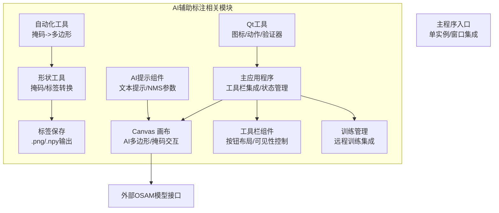
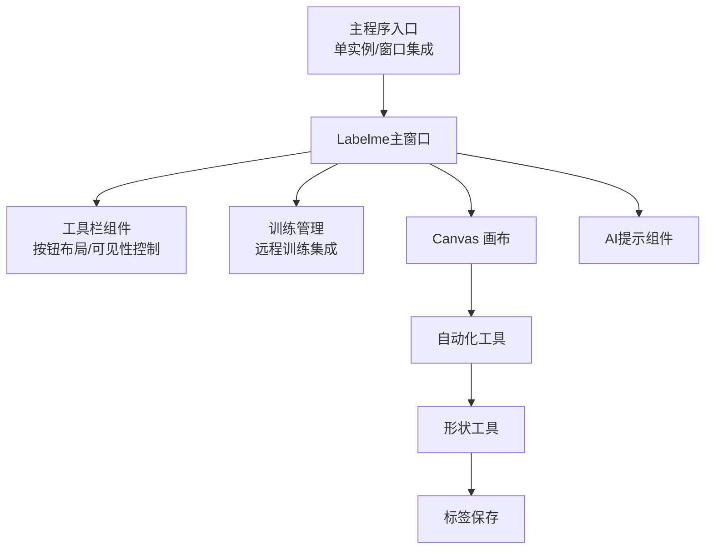
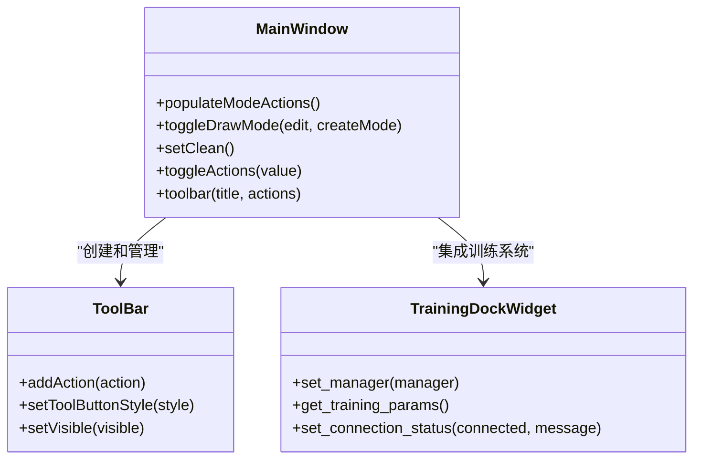
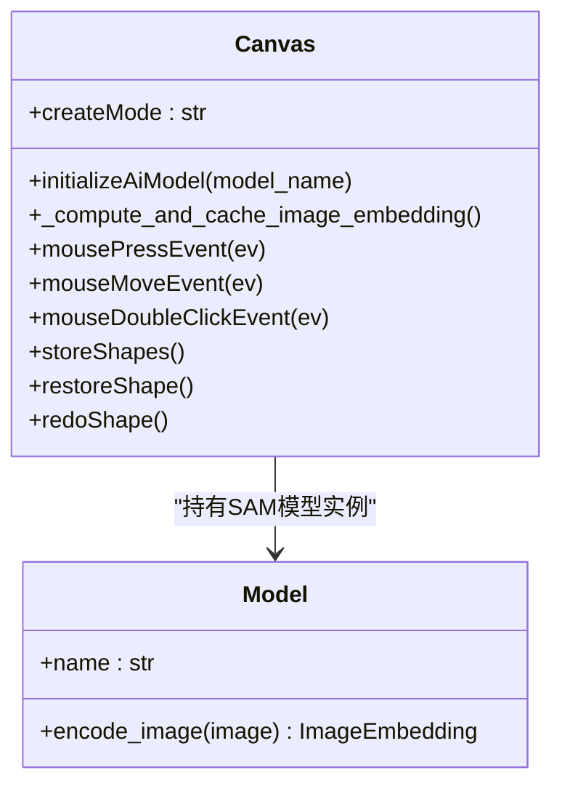
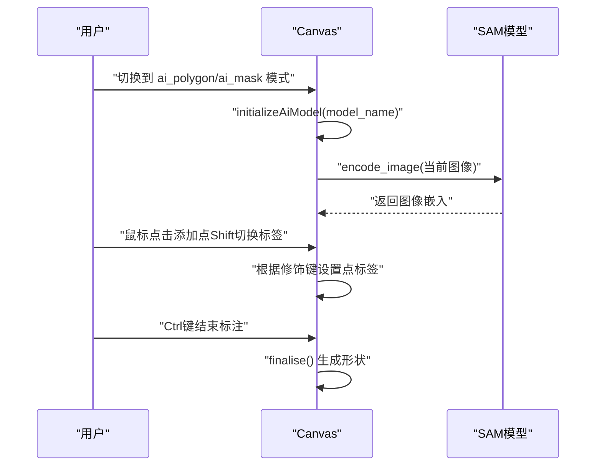
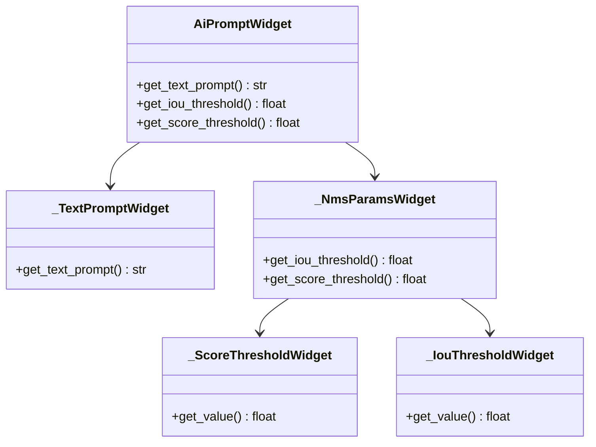
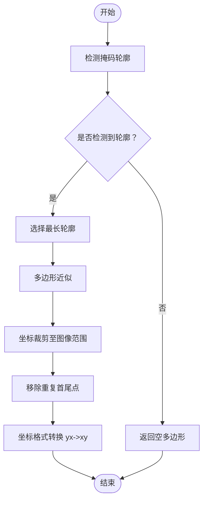
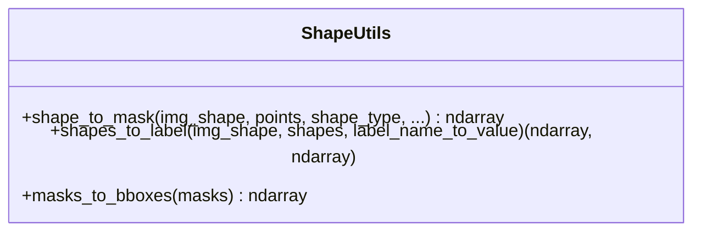
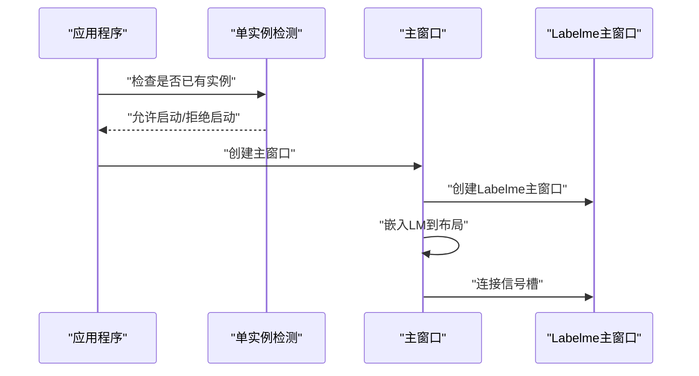
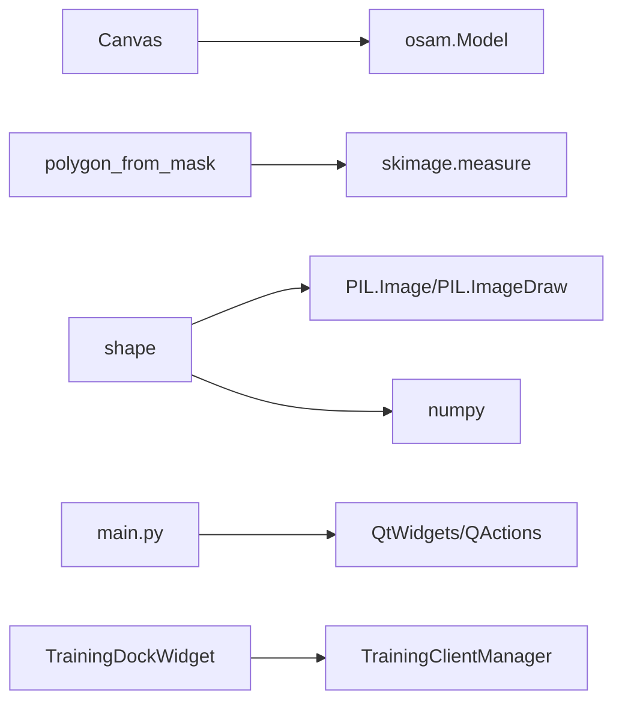

# AI辅助标注

<cite>
**本文档引用的文件**
- [app.py](file://labelme/labelme/app.py)
- [canvas.py](file://labelme/labelme/widgets/canvas.py)
- [tool_bar.py](file://labelme/labelme/widgets/tool_bar.py)
- [training_dock_widget.py](file://labelme/labelme/widgets/training_dock_widget.py)
- [ai_prompt_widget.py](file://labelme/labelme/widgets/ai_prompt_widget.py)
- [polygon_from_mask.py](file://labelme/labelme/_automation/polygon_from_mask.py)
- [shape.py](file://labelme/labelme/utils/shape.py)
- [qt.py](file://labelme/labelme/utils/qt.py)
- [_io.py](file://labelme/labelme/utils/_io.py)
- [main.py](file://main.py)
- [__main__.py](file://labelme/__main__.py)
</cite>

## 更新摘要
**所做更改**
- 更新了AI功能在主工具栏中的隐藏状态调整说明
- 新增了AI功能与训练系统集成影响的详细说明
- 完善了AI多边形和AI掩码工具在工具栏中的可见性配置
- 增加了AI模型选择控件的隐藏状态说明
- 补充了训练管理与AI辅助标注的协同工作机制

## 目录
1. [简介](#简介)
2. [项目结构](#项目结构)
3. [核心组件](#核心组件)
4. [架构总览](#架构总览)
5. [详细组件分析](#详细组件分析)
6. [依赖关系分析](#依赖关系分析)
7. [性能考虑](#性能考虑)
8. [故障排查指南](#故障排查指南)
9. [结论](#结论)
10. [附录](#附录)

## 简介
本文件面向"AI辅助标注"功能，系统性阐述两类AI标注工具：AI多边形（ai_polygon）与AI掩码（ai_mask）。文档覆盖以下关键主题：
- SAM（Segment Anything Model）模型的集成与初始化流程，包括图像嵌入的计算与缓存机制
- AI标注的交互流程：点击添加点、Shift键控制点标签、Ctrl键结束标注等
- AI模型的选择与配置、性能优化策略与错误处理机制
- 实际使用示例与优化建议，以及AI标注与手动标注的结合方法
- 面向初学者的入门指南与面向高级用户的模型调优与性能优化细节
- **新增**：AI功能在主工具栏中的隐藏状态调整机制
- **新增**：AI功能与训练系统的深度集成影响分析

## 项目结构
围绕AI辅助标注的相关模块主要分布在以下位置：
- 主应用程序与工具栏集成：labelme/labelme/app.py
- 画布与交互：labelme/labelme/widgets/canvas.py
- 工具栏组件：labelme/labelme/widgets/tool_bar.py
- 训练管理集成：labelme/labelme/widgets/training_dock_widget.py
- AI提示输入与NMS参数：labelme/labelme/widgets/ai_prompt_widget.py
- 掩码到多边形自动化：labelme/labelme/_automation/polygon_from_mask.py
- 形状与掩码工具：labelme/labelme/utils/shape.py
- Qt工具函数：labelme/labelme/utils/qt.py
- 标签保存工具：labelme/labelme/utils/_io.py
- 应用入口与主窗口集成：main.py、labelme/__main__.py

**图表来源**
- [app.py:1171-1190](file://labelme/labelme/app.py#L1171-L1190)
- [canvas.py:39-180](file://labelme/labelme/widgets/canvas.py#L39-L180)
- [tool_bar.py:9-63](file://labelme/labelme/widgets/tool_bar.py#L9-L63)
- [training_dock_widget.py:98-120](file://labelme/labelme/widgets/training_dock_widget.py#L98-L120)
- [ai_prompt_widget.py:9-88](file://labelme/labelme/widgets/ai_prompt_widget.py#L9-L88)
- [polygon_from_mask.py:32-82](file://labelme/labelme/_automation/polygon_from_mask.py#L32-L82)
- [shape.py:1-233](file://labelme/labelme/utils/shape.py#L1-L233)
- [qt.py:1-214](file://labelme/labelme/utils/qt.py#L1-L214)
- [_io.py:1-27](file://labelme/labelme/utils/_io.py#L1-L27)
- [main.py:1-694](file://main.py#L1-L694)
- [__main__.py:1-359](file://labelme/__main__.py#L1-L359)

**章节来源**
- [app.py:1171-1190](file://labelme/labelme/app.py#L1171-L1190)
- [canvas.py:39-180](file://labelme/labelme/widgets/canvas.py#L39-L180)
- [tool_bar.py:9-63](file://labelme/labelme/widgets/tool_bar.py#L9-L63)
- [training_dock_widget.py:98-120](file://labelme/labelme/widgets/training_dock_widget.py#L98-L120)
- [ai_prompt_widget.py:9-88](file://labelme/labelme/widgets/ai_prompt_widget.py#L9-L88)
- [polygon_from_mask.py:32-82](file://labelme/labelme/_automation/polygon_from_mask.py#L32-L82)
- [shape.py:1-233](file://labelme/labelme/utils/shape.py#L1-L233)
- [qt.py:1-214](file://labelme/labelme/utils/qt.py#L1-L214)
- [_io.py:1-27](file://labelme/labelme/utils/_io.py#L1-L27)
- [main.py:1-694](file://main.py#L1-L694)
- [__main__.py:1-359](file://labelme/__main__.py#L1-L359)

## 核心组件
- **主应用程序（MainWindow）**
  - 支持AI辅助标注功能，集成AI多边形与AI掩码工具
  - 管理工具栏按钮的可见性与状态控制
  - 集成训练管理系统，支持远程训练任务
  - 提供AI模型选择控件的隐藏状态管理
- **Canvas（画布）**
  - 支持多种创建模式，其中包含 ai_polygon 与 ai_mask
  - 内置SAM模型实例与图像嵌入缓存，负责AI标注的交互与状态管理
  - 提供点标签逻辑（Shift键切换前景/背景点标签）、Ctrl键结束标注、双击闭合等交互
- **工具栏组件（ToolBar）**
  - 提供自定义工具栏布局与按钮管理
  - 支持工具按钮的可见性控制与居中对齐
  - 确保工具栏始终可见，避免状态恢复导致的隐藏问题
- **训练管理集成**
  - 集成TrainingDockWidget提供训练任务管理
  - 支持远程训练服务器连接与任务创建
  - 与AI辅助标注功能协同工作，支持批量标注与训练
- **AI提示组件（AiPromptWidget）**
  - 提供文本提示输入与NMS参数（IoU阈值、分数阈值）设置界面
- **自动化工具（polygon_from_mask）**
  - 将分割掩码转换为多边形轮廓，支撑AI掩码到多边形的自动化
- **形状工具（shape）**
  - 提供形状到掩码、标签数组等转换能力，支撑AI标注结果的后处理
- **Qt工具（qt）**
  - 提供图标、按钮、动作、验证器等通用UI工具，支撑主窗口与工具栏集成
- **标签保存（_io）**
  - 提供标签数组的保存能力，支持PNG调色板与.npy格式

**章节来源**
- [app.py:94-109](file://labelme/labelme/app.py#L94-L109)
- [canvas.py:39-180](file://labelme/labelme/widgets/canvas.py#L39-L180)
- [tool_bar.py:9-63](file://labelme/labelme/widgets/tool_bar.py#L9-L63)
- [training_dock_widget.py:98-120](file://labelme/labelme/widgets/training_dock_widget.py#L98-L120)
- [ai_prompt_widget.py:9-88](file://labelme/labelme/widgets/ai_prompt_widget.py#L9-L88)
- [polygon_from_mask.py:32-82](file://labelme/labelme/_automation/polygon_from_mask.py#L32-L82)
- [shape.py:41-167](file://labelme/labelme/utils/shape.py#L41-L167)
- [qt.py:18-106](file://labelme/labelme/utils/qt.py#L18-L106)
- [_io.py:10-27](file://labelme/labelme/utils/_io.py#L10-L27)

## 架构总览
AI辅助标注的整体架构由"主程序入口"驱动，通过"主窗口集成"将Labelme核心嵌入到自定义UI中；"画布"承载AI多边形与AI掩码的交互；"AI提示组件"提供文本提示与NMS参数；"自动化工具"与"形状工具"负责掩码到多边形与标签数组的转换；"标签保存"负责结果持久化。**新增**：工具栏组件负责AI功能的可见性控制，训练管理组件提供远程训练支持。

**图表来源**
- [main.py:236-287](file://main.py#L236-L287)
- [app.py:1171-1190](file://labelme/labelme/app.py#L1171-L1190)
- [tool_bar.py:9-63](file://labelme/labelme/widgets/tool_bar.py#L9-L63)
- [training_dock_widget.py:98-120](file://labelme/labelme/widgets/training_dock_widget.py#L98-L120)
- [canvas.py:39-180](file://labelme/labelme/widgets/canvas.py#L39-L180)
- [ai_prompt_widget.py:9-88](file://labelme/labelme/widgets/ai_prompt_widget.py#L9-L88)
- [polygon_from_mask.py:32-82](file://labelme/labelme/_automation/polygon_from_mask.py#L32-L82)
- [shape.py:41-167](file://labelme/labelme/utils/shape.py#L41-L167)
- [_io.py:10-27](file://labelme/labelme/utils/_io.py#L10-L27)

## 详细组件分析

### 主应用程序与工具栏集成
主应用程序负责AI功能的完整集成，包括工具栏按钮管理、状态控制和训练系统集成：

- **工具栏按钮管理**：通过populateModeActions方法动态管理工具栏按钮的可见性和状态
- **AI功能可见性控制**：AI多边形和AI掩码按钮在工具栏中保持可见状态
- **训练系统集成**：集成TrainingDockWidget提供训练任务管理功能
- **状态恢复保护**：确保工具栏始终可见，避免restoreState恢复导致的隐藏问题

**图表来源**
- [app.py:1202-1227](file://labelme/labelme/app.py#L1202-L1227)
- [app.py:1267-1268](file://labelme/labelme/app.py#L1267-L1268)
- [app.py:1171-1190](file://labelme/labelme/app.py#L1171-L1190)
- [tool_bar.py:9-63](file://labelme/labelme/widgets/tool_bar.py#L9-L63)
- [training_dock_widget.py:98-120](file://labelme/labelme/widgets/training_dock_widget.py#L98-L120)

**章节来源**
- [app.py:1202-1227](file://labelme/labelme/app.py#L1202-L1227)
- [app.py:1267-1268](file://labelme/labelme/app.py#L1267-L1268)
- [app.py:1171-1190](file://labelme/labelme/app.py#L1171-L1190)
- [tool_bar.py:9-63](file://labelme/labelme/widgets/tool_bar.py#L9-L63)
- [training_dock_widget.py:98-120](file://labelme/labelme/widgets/training_dock_widget.py#L98-L120)

### Canvas（画布）与AI多边形/掩码
Canvas是AI辅助标注的核心交互层，负责：
- 模式切换：createMode支持 polygon、ai_polygon、ai_mask 等
- 点标签逻辑：Shift键切换前景/背景点标签；Ctrl键结束标注
- 图像嵌入缓存：按图像字节缓存SAM嵌入，避免重复计算
- 形状创建与闭合：双击闭合、右键菜单、撤销/重做等
- **新增**：AI模式下的十字准星配置，AI多边形和AI掩码模式均不显示十字准星

**图表来源**
- [canvas.py:39-180](file://labelme/labelme/widgets/canvas.py#L39-L180)
- [canvas.py:181-228](file://labelme/labelme/widgets/canvas.py#L181-L228)
- [canvas.py:550-611](file://labelme/labelme/widgets/canvas.py#L550-L611)
- [canvas.py:692-700](file://labelme/labelme/widgets/canvas.py#L692-L700)

**章节来源**
- [canvas.py:39-180](file://labelme/labelme/widgets/canvas.py#L39-L180)
- [canvas.py:181-228](file://labelme/labelme/widgets/canvas.py#L181-L228)
- [canvas.py:372-441](file://labelme/labelme/widgets/canvas.py#L372-L441)
- [canvas.py:550-611](file://labelme/labelme/widgets/canvas.py#L550-L611)
- [canvas.py:692-700](file://labelme/labelme/widgets/canvas.py#L692-L700)

#### AI多边形与AI掩码的交互序列

**图表来源**
- [canvas.py:206-228](file://labelme/labelme/widgets/canvas.py#L206-L228)
- [canvas.py:388-421](file://labelme/labelme/widgets/canvas.py#L388-L421)
- [canvas.py:573-581](file://labelme/labelme/widgets/canvas.py#L573-L581)
- [canvas.py:594-596](file://labelme/labelme/widgets/canvas.py#L594-L596)

### AI提示组件（AiPromptWidget）
AiPromptWidget提供文本提示输入与NMS参数设置：
- 文本提示：用于向AI模型提供语义描述
- NMS参数：分数阈值与IoU阈值，用于过滤与合并检测结果

**图表来源**
- [ai_prompt_widget.py:9-88](file://labelme/labelme/widgets/ai_prompt_widget.py#L9-L88)
- [ai_prompt_widget.py:198-244](file://labelme/labelme/widgets/ai_prompt_widget.py#L198-L244)
- [ai_prompt_widget.py:247-293](file://labelme/labelme/widgets/ai_prompt_widget.py#L247-L293)

**章节来源**
- [ai_prompt_widget.py:9-88](file://labelme/labelme/widgets/ai_prompt_widget.py#L9-L88)
- [ai_prompt_widget.py:198-244](file://labelme/labelme/widgets/ai_prompt_widget.py#L198-L244)
- [ai_prompt_widget.py:247-293](file://labelme/labelme/widgets/ai_prompt_widget.py#L247-L293)

### 掩码到多边形自动化（polygon_from_mask）
将分割掩码转换为多边形轮廓，用于将AI掩码结果转化为多边形标注：
- 轮廓检测与长度计算
- 多边形近似与坐标裁剪
- 坐标格式转换（yx->xy）

**图表来源**
- [polygon_from_mask.py:32-82](file://labelme/labelme/_automation/polygon_from_mask.py#L32-L82)

**章节来源**
- [polygon_from_mask.py:32-82](file://labelme/labelme/_automation/polygon_from_mask.py#L32-L82)

### 形状与掩码工具（shape）
- 形状到掩码：支持多边形、矩形、圆形、线条、点等
- 标签数组生成：类别标签与实例标签
- 掩码到边界框：将掩码数组转换为边界框

**图表来源**
- [shape.py:41-167](file://labelme/labelme/utils/shape.py#L41-L167)
- [shape.py:201-233](file://labelme/labelme/utils/shape.py#L201-L233)

**章节来源**
- [shape.py:41-167](file://labelme/labelme/utils/shape.py#L41-L167)
- [shape.py:201-233](file://labelme/labelme/utils/shape.py#L201-L233)

### 主程序与窗口集成
- 单实例检测：通过共享内存保证仅有一个实例运行
- 主窗口集成：将Labelme主窗口嵌入到自定义UI布局中
- 信号槽连接：将按钮点击与Labelme动作绑定

**图表来源**
- [main.py:33-78](file://main.py#L33-L78)
- [main.py:241-272](file://main.py#L241-L272)
- [main.py:309-330](file://main.py#L309-L330)

**章节来源**
- [main.py:33-78](file://main.py#L33-L78)
- [main.py:241-272](file://main.py#L241-L272)
- [main.py:309-330](file://main.py#L309-L330)

## 依赖关系分析
- Canvas依赖外部osam模型接口（osam.types.Model）进行图像编码与嵌入
- 自动化工具依赖skimage进行轮廓检测与多边形近似
- 形状工具依赖PIL与numpy进行掩码绘制与标签生成
- 主程序通过Qt动作与Labelme主窗口集成，实现统一UI
- **新增**：训练管理组件依赖TrainingClientManager进行远程训练协调

**图表来源**
- [canvas.py:10-13](file://labelme/labelme/widgets/canvas.py#L10-L13)
- [polygon_from_mask.py:4-5](file://labelme/labelme/_automation/polygon_from_mask.py#L4-L5)
- [shape.py:16-18](file://labelme/labelme/utils/shape.py#L16-L18)
- [main.py:12-24](file://main.py#L12-L24)
- [training_dock_widget.py:1035-1047](file://labelme/labelme/app.py#L1035-L1047)

**章节来源**
- [canvas.py:10-13](file://labelme/labelme/widgets/canvas.py#L10-L13)
- [polygon_from_mask.py:4-5](file://labelme/labelme/_automation/polygon_from_mask.py#L4-L5)
- [shape.py:16-18](file://labelme/labelme/utils/shape.py#L16-L18)
- [main.py:12-24](file://main.py#L12-L24)
- [training_dock_widget.py:1035-1047](file://labelme/labelme/app.py#L1035-L1047)

## 性能考虑
- **图像嵌入缓存**
  - 以图像字节为键缓存SAM嵌入，避免重复计算，提升AI标注效率
  - 建议在图像变化时及时清空缓存并重新计算
- **点标签与标注结束**
  - Shift键快速切换前景/背景点标签，减少交互次数
  - Ctrl键一键结束标注，降低误操作风险
- **自动化转换**
  - 掩码到多边形采用轮廓检测与近似，兼顾精度与性能
- **UI与事件处理**
  - Canvas的撤销/重做机制与状态管理，减少不必要的重绘与数据复制
- **工具栏性能优化**
  - **新增**：工具栏按钮的可见性控制避免不必要的UI更新
  - **新增**：工具栏始终可见的保护机制，避免状态恢复导致的性能问题

**章节来源**
- [canvas.py:181-205](file://labelme/labelme/widgets/canvas.py#L181-L205)
- [canvas.py:388-421](file://labelme/labelme/widgets/canvas.py#L388-L421)
- [canvas.py:573-581](file://labelme/labelme/widgets/canvas.py#L573-L581)
- [polygon_from_mask.py:32-82](file://labelme/labelme/_automation/polygon_from_mask.py#L32-L82)
- [tool_bar.py:57-61](file://labelme/labelme/widgets/tool_bar.py#L57-L61)

## 故障排查指南
- **SAM模型未初始化**
  - 现象：日志警告"Sam model is not set yet"
  - 处理：先调用initializeAiModel(model_name)初始化模型并计算嵌入
- **图像嵌入缓存异常**
  - 现象：重复计算导致性能下降
  - 处理：确认图像字节键一致；必要时清空缓存并重新计算
- **点标签逻辑异常**
  - 现象：Shift键未正确切换前景/背景标签
  - 处理：检查修饰键状态判断逻辑；确保鼠标事件中正确读取修饰键
- **标注结束无效**
  - 现象：Ctrl键无法结束标注
  - 处理：确认Ctrl键修饰键判断与finalise调用逻辑
- **自动化转换失败**
  - 现象：掩码到多边形无输出或空结果
  - 处理：检查掩码有效性与轮廓检测；确认近似容差与坐标裁剪
- **AI功能不可见**
  - **新增**：现象：AI多边形和AI掩码按钮在工具栏中不可见
  - **新增**：处理：检查populateModeActions方法的工具栏按钮管理；确认工具栏始终可见的保护机制
- **训练系统集成问题**
  - **新增**：现象：训练管理功能无法正常工作
  - **新增**：处理：检查TrainingClientManager的初始化；确认信号槽连接是否正确

**章节来源**
- [canvas.py:188-190](file://labelme/labelme/widgets/canvas.py#L188-L190)
- [canvas.py:196-198](file://labelme/labelme/widgets/canvas.py#L196-L198)
- [canvas.py:388-421](file://labelme/labelme/widgets/canvas.py#L388-L421)
- [canvas.py:573-581](file://labelme/labelme/widgets/canvas.py#L573-L581)
- [polygon_from_mask.py:44-52](file://labelme/labelme/_automation/polygon_from_mask.py#L44-L52)
- [app.py:1202-1227](file://labelme/labelme/app.py#L1202-L1227)
- [app.py:1035-1047](file://labelme/labelme/app.py#L1035-L1047)

## 结论
AI辅助标注通过Canvas与SAM模型的深度集成，实现了高效的交互式智能标注。配合AI提示组件与自动化工具链，用户可以在极短时间内获得高质量的标注结果。通过合理的缓存策略、点标签逻辑与NMS参数配置，既能满足初学者的易用需求，也能为高级用户提供灵活的调优空间。

**新增**：工具栏的隐藏状态调整机制确保了AI功能的稳定可见性，而训练系统的深度集成为AI辅助标注提供了更强大的批量化处理能力。这些改进使得AI辅助标注不仅在功能上更加完善，在用户体验和系统稳定性方面也得到了显著提升。

## 附录

### AI标注与手动标注的结合使用
- 先用AI多边形/掩码快速生成初始标注，再通过手动编辑微调
- 使用Shift键精确控制前景/背景点，提升标注准确性
- 利用Ctrl键快速结束标注，随后进行局部修正
- **新增**：结合训练系统进行批量标注优化

### 实际使用示例（步骤概述）
- 初始化模型：调用initializeAiModel(model_name)
- 输入提示：在AI提示组件中输入文本提示与NMS参数
- 开始标注：切换到ai_polygon或ai_mask模式，点击添加点
- 调整标签：按住Shift切换前景/背景点标签
- 结束标注：按住Ctrl键结束当前标注
- 自动化转换：将AI掩码转换为多边形，便于进一步编辑
- 保存结果：导出JSON或标签数组，支持PNG与.npy格式
- **新增**：集成训练系统进行批量处理和远程训练

### 配置与优化建议
- **模型选择**：根据任务复杂度选择合适的SAM模型
- **NMS参数**：分数阈值与IoU阈值影响检测质量与召回率，需按场景调优
- **缓存策略**：在批量处理时合理利用图像嵌入缓存，避免重复计算
- **UI集成**：通过主程序的信号槽将AI功能无缝嵌入现有工作流
- **工具栏优化**：利用工具栏的可见性控制机制，确保AI功能的稳定可用
- **训练集成**：结合训练系统进行批量标注，提高整体工作效率

### AI功能与训练系统的协同工作机制
- **模型管理**：AI模型通过selectAiModel控件进行统一管理
- **批量处理**：训练系统支持批量图像的AI辅助标注
- **远程协作**：支持远程训练服务器连接，实现分布式标注处理
- **状态同步**：AI标注状态与训练进度实时同步，确保数据一致性

**章节来源**
- [app.py:886-926](file://labelme/labelme/app.py#L886-L926)
- [app.py:1318-1386](file://labelme/labelme/app.py#L1318-L1386)
- [training_dock_widget.py:1035-1047](file://labelme/labelme/app.py#L1035-L1047)