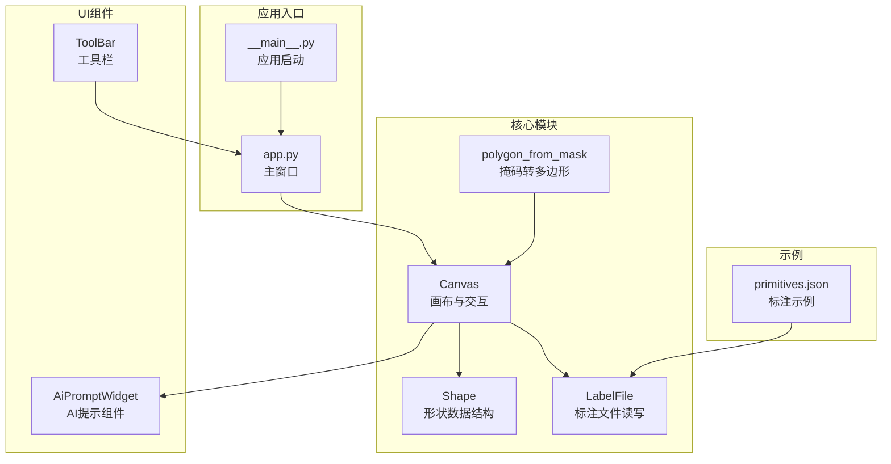
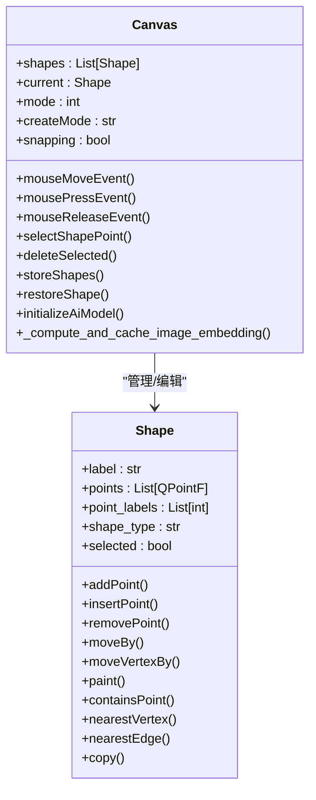
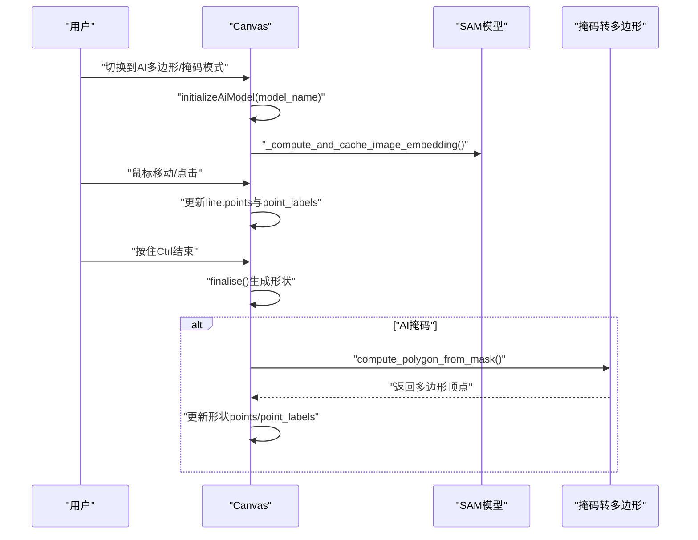
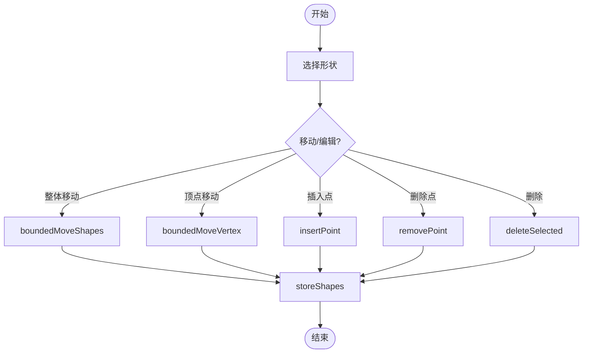
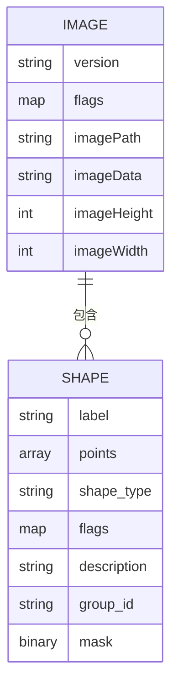
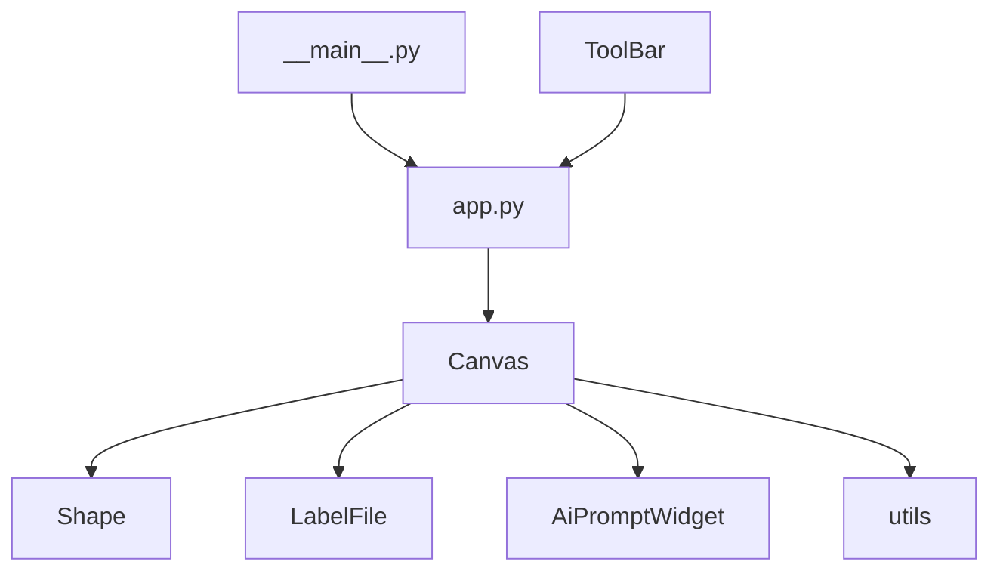

# 图像标注功能

<cite>
**本文档引用的文件**
- [canvas.py](file://labelme/labelme/widgets/canvas.py)
- [shape.py](file://labelme/labelme/shape.py)
- [label_file.py](file://labelme/labelme/label_file.py)
- [polygon_from_mask.py](file://labelme/labelme/_automation/polygon_from_mask.py)
- [ai_prompt_widget.py](file://labelme/labelme/widgets/ai_prompt_widget.py)
- [__main__.py](file://labelme/labelme/__main__.py)
- [app.py](file://labelme/labelme/app.py)
- [tool_bar.py](file://labelme/labelme/widgets/tool_bar.py)
- [primitives.json](file://examples/primitives/primitives.json)
</cite>

## 目录
1. [简介](#简介)
2. [项目结构](#项目结构)
3. [核心组件](#核心组件)
4. [架构概览](#架构概览)
5. [详细组件分析](#详细组件分析)
6. [依赖分析](#依赖分析)
7. [性能考虑](#性能考虑)
8. [故障排除指南](#故障排除指南)
9. [结论](#结论)
10. [附录](#附录)

## 简介
本文件面向labelme的图像标注功能，重点解析Canvas类的核心能力与实现机制，涵盖以下主题：
- 多边形、矩形、圆形、线条、点、线条带六种基础标注工具的使用方法与实现原理
- AI辅助标注功能（AI多边形与AI掩码）的创建与编辑流程
- 形状选择、移动、编辑、删除等交互操作机制
- 撤销/重做、吸附、十字准星等高级特性
- 标注数据的存储格式与JSON结构说明
- 面向初学者与高级用户的分层学习路径与最佳实践

## 项目结构
labelme的图像标注功能由多个模块协同完成：
- Canvas：核心画布与交互处理
- Shape：形状数据结构与渲染
- LabelFile：标注文件的读写与校验
- _automation：自动化标注（掩码转多边形）
- widgets：UI组件（工具栏、AI提示等）
- app：主窗口与业务逻辑
- 示例数据：primitives.json展示标准标注格式

**图表来源**
- [canvas.py:39-142](file://labelme/labelme/widgets/canvas.py#L39-L142)
- [shape.py:19-669](file://labelme/labelme/shape.py#L19-L669)
- [label_file.py:42-306](file://labelme/labelme/label_file.py#L42-L306)
- [polygon_from_mask.py:1-82](file://labelme/labelme/_automation/polygon_from_mask.py#L1-L82)
- [ai_prompt_widget.py:9-294](file://labelme/labelme/widgets/ai_prompt_widget.py#L9-L294)
- [tool_bar.py:9-63](file://labelme/labelme/widgets/tool_bar.py#L9-L63)
- [__main__.py:137-359](file://labelme/labelme/__main__.py#L137-L359)
- [app.py:99-200](file://labelme/labelme/app.py#L99-L200)
- [primitives.json:1-162](file://examples/primitives/primitives.json#L1-L162)

**章节来源**
- [canvas.py:1-1316](file://labelme/labelme/widgets/canvas.py#L1-L1316)
- [shape.py:1-669](file://labelme/labelme/shape.py#L1-L669)
- [label_file.py:1-306](file://labelme/labelme/label_file.py#L1-L306)
- [polygon_from_mask.py:1-82](file://labelme/labelme/_automation/polygon_from_mask.py#L1-L82)
- [ai_prompt_widget.py:1-294](file://labelme/labelme/widgets/ai_prompt_widget.py#L1-L294)
- [tool_bar.py:1-63](file://labelme/labelme/widgets/tool_bar.py#L1-L63)
- [__main__.py:1-359](file://labelme/labelme/__main__.py#L1-L359)
- [app.py:1-3577](file://labelme/labelme/app.py#L1-L3577)
- [primitives.json:1-162](file://examples/primitives/primitives.json#L1-L162)

## 核心组件
本节聚焦Canvas类与Shape类，它们是标注功能的基石。

- Canvas类职责
  - 维护形状集合与当前绘制状态
  - 处理鼠标/键盘交互（创建、编辑、移动、删除）
  - 管理撤销/重做、吸附、十字准星、缩放/平移
  - 集成AI模型（SAM）进行图像嵌入缓存与AI标注
  - 发射信号驱动UI同步（newShape、selectionChanged、shapeMoved等）

- Shape类职责
  - 表示单个标注形状，支持多边形、矩形、圆形、线条、点、线条带、点集、掩码
  - 提供顶点管理（添加、插入、删除、移动）、边界检测、路径绘制
  - 支持高亮顶点、选中状态、填充与描边颜色配置

**章节来源**
- [canvas.py:39-142](file://labelme/labelme/widgets/canvas.py#L39-L142)
- [shape.py:19-200](file://labelme/labelme/shape.py#L19-L200)

## 架构概览
Canvas与Shape的协作关系如下：

**图表来源**
- [canvas.py:39-800](file://labelme/labelme/widgets/canvas.py#L39-L800)
- [shape.py:19-669](file://labelme/labelme/shape.py#L19-L669)

## 详细组件分析

### Canvas类：多边形、矩形、圆形、线条、点、线条带标注工具
- 多边形（polygon）
  - 创建：左键点击添加顶点，双击或按住Ctrl结束；Shift键切换点标签（正负样本）
  - 编辑：吸附到起点自动闭合；Alt+Shift可删除顶点；Alt+点击边插入点
  - 特性：支持顶点高亮、移动、删除；可设置填充与描边颜色
- 矩形（rectangle）
  - 创建：左键按下为起点，拖拽到终点自动闭合；十字准星可配置
  - 编辑：选中后可整体移动；顶点可拖动调整尺寸
- 圆形（circle）
  - 创建：左键按下为圆心，拖拽到圆周点确定半径；自动闭合为椭圆路径
  - 编辑：圆心与半径可调整
- 线条（line）
  - 创建：两点确定一条直线；支持点标签与正负样本
  - 编辑：两端点可移动
- 点（point）
  - 创建：单击即完成；支持正负样本标签
- 线条带（linestrip）
  - 创建：连续点击形成折线；按住Ctrl结束
  - 编辑：可插入/删除中间点；Shift键切换点标签

交互要点
- 鼠标事件：mouseMoveEvent/mousePressEvent/mouseReleaseEvent分别处理移动、按下、抬起
- 键盘修饰键：Shift（切换点标签/吸附）、Ctrl（强制结束）、Alt（插入点/删除点）
- 顶点选择：nearestVertex/nearestEdge配合epsilon容差实现精确选择
- 移动与复制：boundedMoveShapes/boundedMoveVertex实现边界约束移动

**章节来源**
- [canvas.py:372-797](file://labelme/labelme/widgets/canvas.py#L372-L797)
- [shape.py:470-521](file://labelme/labelme/shape.py#L470-L521)

### AI辅助标注：AI多边形与AI掩码
- AI模型初始化
  - initializeAiModel：按模型名初始化SAM模型并清空嵌入缓存
  - _compute_and_cache_image_embedding：计算并缓存当前图像的嵌入，避免重复计算
- AI多边形（ai_polygon）
  - 创建：在AI模式下，线段points[1]对应当前鼠标位置；point_labels根据Shift状态切换正负样本
  - 结束：按住Ctrl结束标注；双击也可闭合（取决于配置）
- AI掩码（ai_mask）
  - 创建：与AI多边形类似，但最终生成掩码数据；适合语义分割场景
  - 编辑：可通过掩码转多边形自动化流程生成多边形标注

**图表来源**
- [canvas.py:206-228](file://labelme/labelme/widgets/canvas.py#L206-L228)
- [canvas.py:573-596](file://labelme/labelme/widgets/canvas.py#L573-L596)
- [polygon_from_mask.py:32-82](file://labelme/labelme/_automation/polygon_from_mask.py#L32-L82)
- [ai_prompt_widget.py:1-294](file://labelme/labelme/widgets/ai_prompt_widget.py#L1-L294)

**章节来源**
- [canvas.py:181-228](file://labelme/labelme/widgets/canvas.py#L181-L228)
- [canvas.py:573-596](file://labelme/labelme/widgets/canvas.py#L573-L596)
- [polygon_from_mask.py:1-82](file://labelme/labelme/_automation/polygon_from_mask.py#L1-L82)
- [ai_prompt_widget.py:1-294](file://labelme/labelme/widgets/ai_prompt_widget.py#L1-L294)

### 形状选择、移动、编辑、删除
- 选择
  - selectShapePoint：根据鼠标位置选择形状；支持多选（Ctrl）
  - selectionChanged信号通知UI更新
- 移动
  - boundedMoveShapes：整体移动，自动约束在画布内
  - boundedMoveVertex：单个顶点移动
- 编辑
  - insertPoint/nearestEdge：在边上插入点
  - removePoint：删除顶点（多边形/线条带最少点数限制）
- 删除
  - deleteSelected：删除选中形状并保存状态

**图表来源**
- [canvas.py:706-797](file://labelme/labelme/widgets/canvas.py#L706-L797)
- [shape.py:252-304](file://labelme/labelme/shape.py#L252-L304)

**章节来源**
- [canvas.py:706-797](file://labelme/labelme/widgets/canvas.py#L706-L797)
- [shape.py:252-304](file://labelme/labelme/shape.py#L252-L304)

### 撤销/重做、吸附、十字准星
- 撤销/重做
  - storeShapes：保存当前状态到备份栈
  - restoreShape/redoShape：从备份恢复或重做
  - isShapeRestorable/isShapeRedoable：判断可撤销/可重做状态
- 吸附
  - snapping启用时，多边形绘制接近起点自动吸附
- 十字准星
  - crosshair配置字典控制各模式下是否显示

**章节来源**
- [canvas.py:229-327](file://labelme/labelme/widgets/canvas.py#L229-L327)
- [canvas.py:386-441](file://labelme/labelme/widgets/canvas.py#L386-L441)
- [canvas.py:93-105](file://labelme/labelme/widgets/canvas.py#L93-L105)

### 标注数据存储格式与JSON结构
- 文件结构
  - version：labelme版本
  - flags：图像级标志
  - shapes：形状数组
  - imagePath/imageData：图像路径或base64编码数据
  - imageHeight/imageWidth：图像尺寸
- 形状字段
  - label：标签名称
  - points：顶点坐标数组
  - shape_type：形状类型（polygon/rectangle/circle/line/point/linestrip/mask等）
  - flags/description/group_id：标志、描述、组ID
  - mask：掩码数据（当shape_type为mask时）

**图表来源**
- [label_file.py:103-193](file://labelme/labelme/label_file.py#L103-L193)
- [label_file.py:225-291](file://labelme/labelme/label_file.py#L225-L291)
- [primitives.json:1-162](file://examples/primitives/primitives.json#L1-L162)

**章节来源**
- [label_file.py:103-193](file://labelme/labelme/label_file.py#L103-L193)
- [label_file.py:225-291](file://labelme/labelme/label_file.py#L225-L291)
- [primitives.json:1-162](file://examples/primitives/primitives.json#L1-L162)

### 实际使用示例与最佳实践
- 多边形标注
  - 逐步点击添加顶点，注意Shift切换正负样本；双击或Ctrl结束
  - Alt+点击边插入点，Alt+Shift+点击顶点删除点
- 矩形/圆形
  - 采用十字准星模式提升精度；拖拽时观察吸附效果
- 线条/点/线条带
  - 线条带适合连续轨迹标注；点适合稀疏标注
- AI多边形/掩码
  - 先初始化AI模型，再进行交互标注；必要时使用掩码转多边形
- 数据导出
  - 使用CLI工具导出为COCO/VOC等格式，参考examples目录

**章节来源**
- [canvas.py:550-631](file://labelme/labelme/widgets/canvas.py#L550-L631)
- [primitives.json:1-162](file://examples/primitives/primitives.json#L1-L162)

## 依赖分析
- Canvas依赖Shape进行渲染与几何计算
- Canvas通过LabelFile读写标注文件
- Canvas集成AI模型（osam）进行图像嵌入与AI标注
- UI组件（ToolBar、AiPromptWidget）提供交互入口
- 主程序入口（__main__.py）负责应用生命周期与单实例检测

**图表来源**
- [canvas.py:1-18](file://labelme/labelme/widgets/canvas.py#L1-L18)
- [label_file.py:1-12](file://labelme/labelme/label_file.py#L1-L12)
- [ai_prompt_widget.py:1-8](file://labelme/labelme/widgets/ai_prompt_widget.py#L1-L8)
- [tool_bar.py:1-6](file://labelme/labelme/widgets/tool_bar.py#L1-L6)
- [app.py:67-85](file://labelme/labelme/app.py#L67-L85)
- [__main__.py:17-20](file://labelme/labelme/__main__.py#L17-L20)

**章节来源**
- [canvas.py:1-18](file://labelme/labelme/widgets/canvas.py#L1-L18)
- [label_file.py:1-12](file://labelme/labelme/label_file.py#L1-L12)
- [ai_prompt_widget.py:1-8](file://labelme/labelme/widgets/ai_prompt_widget.py#L1-L8)
- [tool_bar.py:1-6](file://labelme/labelme/widgets/tool_bar.py#L1-L6)
- [app.py:67-85](file://labelme/labelme/app.py#L67-L85)
- [__main__.py:17-20](file://labelme/labelme/__main__.py#L17-L20)

## 性能考虑
- 图像嵌入缓存：SAM模型嵌入按图像字节缓存，避免重复计算
- 绘制优化：Shape使用QPainterPath减少重复绘制
- 备份策略：撤销/重做仅保存形状副本，避免深度拷贝开销
- UI响应：鼠标事件与绘制分离，通过信号通知UI更新

[本节为通用指导，无需特定文件引用]

## 故障排除指南
- 无法撤销/重做
  - 检查备份栈是否为空；确保在编辑后调用storeShapes
- AI模型未初始化
  - 确认initializeAiModel已调用且模型名有效
- 形状越界
  - 使用boundedMoveShapes自动约束；检查outOfPixmap逻辑
- JSON读取错误
  - 检查imageData与imageHeight/imageWidth一致性；参考LabelFile的校验逻辑

**章节来源**
- [canvas.py:229-327](file://labelme/labelme/widgets/canvas.py#L229-L327)
- [canvas.py:756-779](file://labelme/labelme/widgets/canvas.py#L756-L779)
- [label_file.py:194-223](file://labelme/labelme/label_file.py#L194-L223)

## 结论
Canvas与Shape共同构成了labelme强大的图像标注引擎。通过多模式工具、AI辅助标注、完善的交互与数据持久化机制，用户可以在高效、准确的前提下完成各类标注任务。建议初学者从基础工具入手，逐步掌握AI辅助与自动化流程；高级用户可结合撤销/重做、吸附与十字准星等特性，进一步提升标注质量与效率。

[本节为总结性内容，无需特定文件引用]

## 附录
- 学习路径建议
  - 初学者：多边形→矩形/圆形→线条/点→线条带；掌握Shift/Alt/Ctrl组合键
  - 进阶者：AI多边形/掩码→掩码转多边形→撤销/重做→吸附与十字准星
  - 专家：自定义颜色/尺寸→批量编辑→导出为COCO/VOC
- 相关文件
  - 示例标注：examples/primitives/primitives.json
  - CLI工具：labelme/cli/*.py（导出、可视化等）

[本节为补充信息，无需特定文件引用]