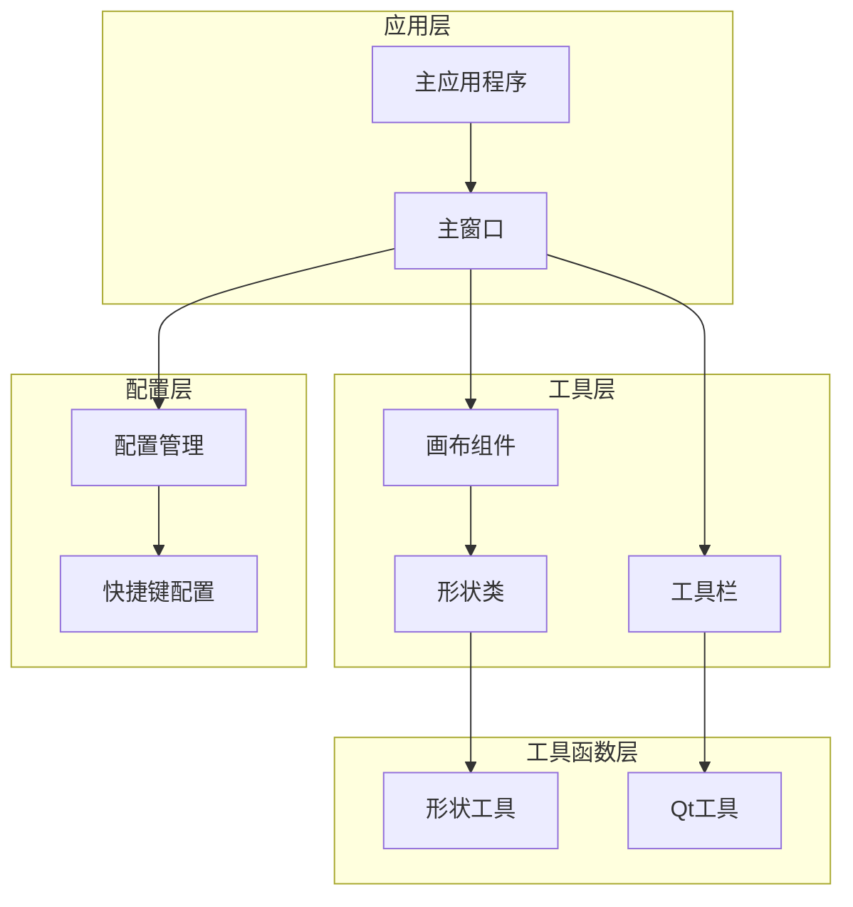
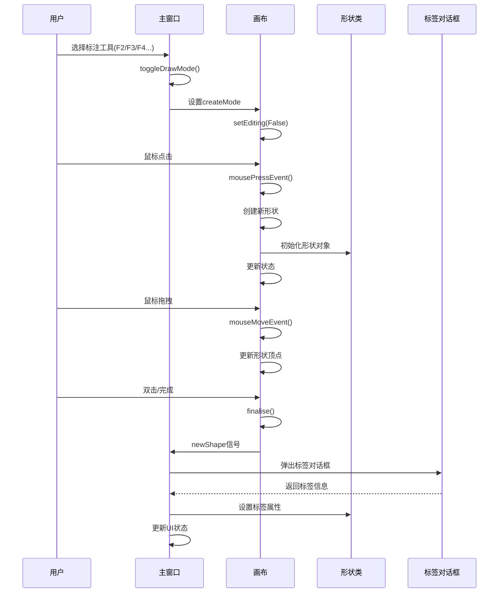
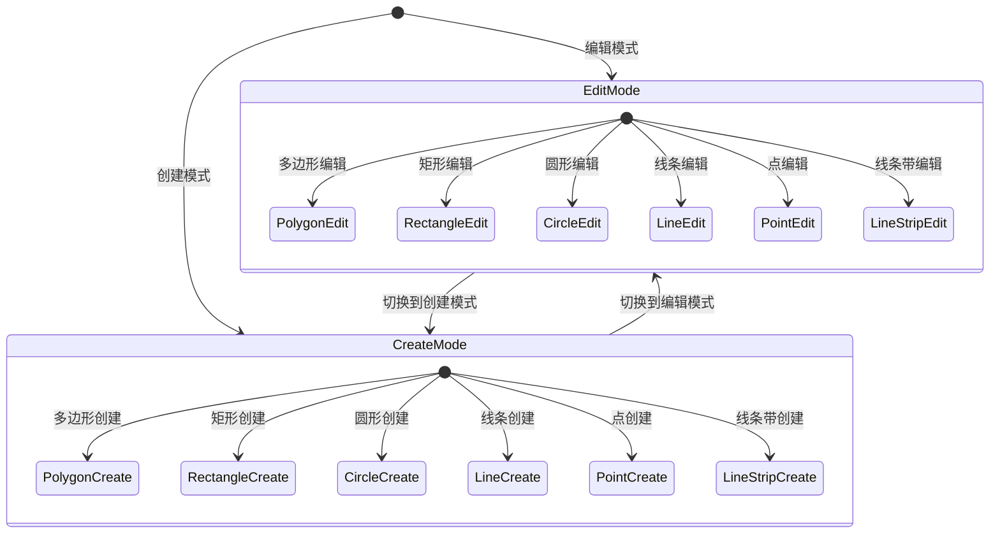
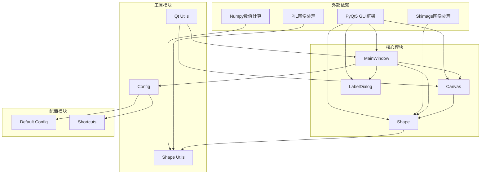

# 基础标注工具

<cite>
**本文档引用的文件**
- [main.py](file://labelme/main.py)
- [app.py](file://labelme/labelme/app.py)
- [canvas.py](file://labelme/labelme/widgets/canvas.py)
- [shape.py](file://labelme/labelme/shape.py)
- [shape_utils.py](file://labelme/labelme/utils/shape.py)
- [default_config.yaml](file://labelme/labelme/config/default_config.yaml)
- [tool_bar.py](file://labelme/labelme/widgets/tool_bar.py)
- [qt_utils.py](file://labelme/labelme/utils/qt.py)
</cite>

## 目录
1. [简介](#简介)
2. [项目结构](#项目结构)
3. [核心组件](#核心组件)
4. [架构概览](#架构概览)
5. [详细组件分析](#详细组件分析)
6. [依赖关系分析](#依赖关系分析)
7. [性能考虑](#性能考虑)
8. [故障排除指南](#故障排除指南)
9. [结论](#结论)

## 简介

基础标注工具是图像标注系统的核心功能模块，支持六种基本标注工具：多边形(polygon)、矩形(rectangle)、圆形(circle)、线条(line)、点(point)、线条带(linestrip)。这些工具为计算机视觉和机器学习项目提供精确的图像标注能力。

本系统基于PyQt5构建，采用模块化设计，支持实时交互、撤销重做、AI辅助标注等高级功能。每个标注工具都有独特的创建流程、交互方式和视觉效果，满足不同应用场景的需求。

## 项目结构

Labelme项目采用清晰的分层架构，主要包含以下核心模块：

**图表来源**
- [main.py:118-470](file://labelme/main.py#L118-L470)
- [app.py:99-120](file://labelme/labelme/app.py#L99-L120)

**章节来源**
- [main.py:1-694](file://labelme/main.py#L1-694)
- [app.py:1-800](file://labelme/labelme/app.py#L1-L800)

## 核心组件

### 画布组件(Canvas)

画布是标注系统的核心交互组件，负责处理所有鼠标和键盘事件，管理形状的创建和编辑过程。

**主要特性：**
- 支持8种创建模式：polygon、rectangle、circle、line、point、linestrip、ai_polygon、ai_mask
- 实时顶点高亮和吸附功能
- 撤销/重做机制
- AI辅助标注支持

**章节来源**
- [canvas.py:39-180](file://labelme/labelme/widgets/canvas.py#L39-L180)

### 形状类(Shape)

Shape类是所有标注形状的基础类，提供统一的形状管理和渲染接口。

**支持的形状类型：**
- polygon：多边形，至少3个顶点
- rectangle：矩形，使用对角线两点表示
- circle：圆形，使用圆心和半径两点
- line：线条，两点确定
- point：单个点
- linestrip：连续线条
- points：点集
- mask：像素级掩码

**章节来源**
- [shape.py:19-200](file://labelme/labelme/shape.py#L19-L200)

### 主窗口(MainWindow)

主窗口管理整个应用程序的生命周期，协调各个组件的协作。

**核心功能：**
- 工具切换机制
- 快捷键绑定
- 文件操作管理
- UI状态同步

**章节来源**
- [app.py:99-1760](file://labelme/labelme/app.py#L99-L1760)

## 架构概览

系统采用事件驱动的架构模式，通过信号槽机制实现组件间的松耦合通信。

**图表来源**
- [app.py:1713-1751](file://labelme/labelme/app.py#L1713-L1751)
- [canvas.py:550-620](file://labelme/labelme/widgets/canvas.py#L550-L620)

## 详细组件分析

### 多边形标注工具(Polygon)

多边形是最常用的标注工具，适用于复杂边界的目标标注。

**创建流程：**
1. 选择多边形工具(F3)
2. 在图像上点击创建第一个顶点
3. 连续点击创建后续顶点
4. 双击或按Enter完成多边形
5. 弹出标签对话框输入标签

**交互特性：**
- Shift键：标记负样本点
- Alt键：在边上添加点
- Ctrl+Shift+Alt：删除选定点
- 顶点高亮：蓝色圆形表示可移动顶点

**视觉效果：**
- 未选中：半透明填充，绿色轮廓
- 选中：白色轮廓，半透明填充
- 高亮：顶点放大4倍显示

**章节来源**
- [canvas.py:386-441](file://labelme/labelme/widgets/canvas.py#L386-L441)
- [shape.py:322-442](file://labelme/labelme/shape.py#L322-L442)

### 矩形标注工具(Rectangle)

矩形工具用于标注规则形状的目标，如人脸、车辆等。

**创建流程：**
1. 选择矩形工具(F2)
2. 按住左键拖拽创建矩形框
3. 松开鼠标完成标注

**交互特性：**
- 十字准星：在矩形模式下显示
- 自动闭合：矩形自动闭合形成封闭区域
- 顶点可编辑：四个角点可拖拽调整

**视觉效果：**
- 矩形边框：实线矩形
- 顶点：正方形，便于拖拽
- 填充：半透明颜色

**章节来源**
- [canvas.py:422-433](file://labelme/labelme/widgets/canvas.py#L422-L433)
- [shape.py:378-389](file://labelme/labelme/shape.py#L378-L389)

### 圆形标注工具(Circle)

圆形工具专门用于标注圆形或近似圆形的目标。

**创建流程：**
1. 选择圆形工具
2. 点击创建圆心
3. 拖拽到合适位置创建半径点
4. 松开完成圆形

**交互特性：**
- 半径计算：两点间距离决定半径
- 自动圆绘制：椭圆自动转换为圆形
- 顶点：圆心和半径点

**视觉效果：**
- 圆形轮廓：平滑曲线
- 顶点：圆形，便于调整

**章节来源**
- [canvas.py:426-429](file://labelme/labelme/widgets/canvas.py#L426-L429)
- [shape.py:390-401](file://labelme/labelme/shape.py#L390-L401)

### 线条标注工具(Line)

线条工具用于标注线性特征，如道路、边界线等。

**创建流程：**
1. 选择线条工具
2. 点击创建起点
3. 点击创建终点
4. 完成线条标注

**交互特性：**
- 固定两点：只能创建两点确定的线段
- 线条宽度：可配置的线条粗细
- 顶点：圆形，便于识别

**视觉效果：**
- 实线连接：起点到终点
- 线条粗细：可配置宽度

**章节来源**
- [canvas.py:430-433](file://labelme/labelme/widgets/canvas.py#L430-L433)
- [shape_utils.py:89-94](file://labelme/labelme/utils/shape.py#L89-L94)

### 点标注工具(Point)

点工具用于标注精确位置信息，如关键点、标记点等。

**创建流程：**
1. 选择点工具
2. 点击创建点位置
3. 完成标注

**交互特性：**
- 单点创建：每次点击创建一个点
- 点大小：可配置的点半径
- 顶点：圆形，便于点击

**视觉效果：**
- 小圆点：半径可配置
- 高亮：白色轮廓

**章节来源**
- [canvas.py:434-437](file://labelme/labelme/widgets/canvas.py#L434-L437)
- [shape_utils.py:97-103](file://labelme/labelme/utils/shape.py#L97-L103)

### 线条带标注工具(LineStrip)

线条带工具用于创建连续的折线，适合标注复杂路径。

**创建流程：**
1. 选择线条带工具
2. 连续点击创建路径点
3. Ctrl+左键结束创建

**交互特性：**
- 连续点：自动连接相邻点
- 可编辑：中间点可添加、删除、移动
- 线条宽度：可配置

**视觉效果：**
- 连续折线：连接所有顶点
- 顶点：圆形节点

**章节来源**
- [canvas.py:568-572](file://labelme/labelme/widgets/canvas.py#L568-L572)
- [shape_utils.py:94-96](file://labelme/labelme/utils/shape.py#L94-L96)

### 工具切换机制

系统提供灵活的工具切换机制，支持在编辑模式和创建模式间无缝切换。

**图表来源**
- [app.py:1713-1751](file://labelme/labelme/app.py#L1713-L1751)
- [canvas.py:341-356](file://labelme/labelme/widgets/canvas.py#L341-L356)

**章节来源**
- [app.py:1698-1751](file://labelme/labelme/app.py#L1698-L1751)

### 绘制模式与编辑模式

系统采用双模式架构，确保标注过程的流畅性和准确性。

**绘制模式(Create Mode)：**
- 禁用编辑操作
- 启用绘图工具
- 实时形状预览
- 自动撤销保护

**编辑模式(Edit Mode)：**
- 禁用绘图工具
- 启用编辑操作
- 形状选择和移动
- 顶点编辑和删除

**章节来源**
- [canvas.py:341-356](file://labelme/labelme/widgets/canvas.py#L341-L356)
- [app.py:1698-1712](file://labelme/labelme/app.py#L1698-L1712)

### 快捷键支持

系统提供全面的快捷键支持，提高标注效率。

**文件操作：**
- Ctrl+O：打开文件
- Ctrl+S：保存
- Ctrl+Q：退出
- Ctrl+W：关闭

**导航：**
- D/A：下一个/上一个文件
- Ctrl+F：适应窗口
- Ctrl+Shift+F：适应宽度

**标注工具：**
- F1：编辑模式
- F2：矩形工具
- F3：多边形工具
- F4：删除工具

**编辑操作：**
- Ctrl+Z：撤销
- Ctrl+Y：重做
- Ctrl+C/V：复制粘贴
- Ctrl+D：复制形状

**章节来源**
- [default_config.yaml:100-147](file://labelme/labelme/config/default_config.yaml#L100-L147)

## 依赖关系分析

系统采用模块化设计，各组件间依赖关系清晰。

**图表来源**
- [app.py:57-85](file://labelme/labelme/app.py#L57-L85)
- [shape.py:1-10](file://labelme/labelme/shape.py#L1-L10)

**章节来源**
- [app.py:1-100](file://labelme/labelme/app.py#L1-L100)
- [shape.py:1-20](file://labelme/labelme/shape.py#L1-L20)

## 性能考虑

### 内存管理
- 形状备份限制：最多保存10个备份版本
- 图像嵌入缓存：AI模型图像嵌入自动缓存
- 顶点吸附优化：使用epsilon容差减少计算开销

### 渲染优化
- 按需重绘：仅重绘受影响区域
- 缩放优化：支持实时缩放而不重建图像
- 批量操作：支持批量形状操作

### AI辅助标注
- 模型懒加载：首次使用时初始化AI模型
- 嵌入缓存：避免重复计算图像嵌入
- 异步处理：AI推理不影响UI响应

## 故障排除指南

### 常见问题

**工具无法切换**
- 检查绘图状态：正在绘图时工具会被禁用
- 确认快捷键设置：检查配置文件中的快捷键映射
- 验证权限：确保应用程序具有文件访问权限

**形状创建异常**
- 检查顶点数量：多边形至少需要3个顶点
- 验证坐标范围：确保坐标在图像范围内
- 清理内存：重启应用程序释放内存

**AI功能失效**
- 检查模型文件：确认AI模型文件完整
- 验证GPU支持：确保CUDA环境正确配置
- 更新驱动：检查显卡驱动版本

**章节来源**
- [canvas.py:246-276](file://labelme/labelme/widgets/canvas.py#L246-L276)
- [app.py:1645-1674](file://labelme/labelme/app.py#L1645-L1674)

## 结论

基础标注工具模块提供了完整而强大的图像标注解决方案。通过精心设计的架构和丰富的功能特性，系统能够满足从初学者到专业用户的各种需求。

**主要优势：**
- 模块化设计：清晰的组件分离便于维护和扩展
- 丰富的工具集：支持六种基本标注工具和AI辅助功能
- 用户友好：直观的界面和完善的快捷键支持
- 高性能：优化的渲染和内存管理机制

**技术特点：**
- 基于PyQt5的现代化GUI框架
- 支持实时交互和撤销重做
- 可扩展的配置系统
- 完善的错误处理和日志记录

该系统为计算机视觉和机器学习项目提供了可靠的基础标注工具，是构建高质量数据集的理想选择。