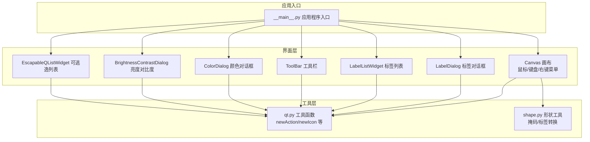
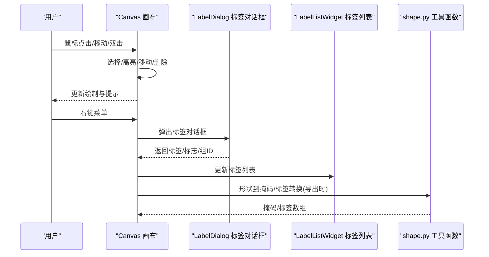
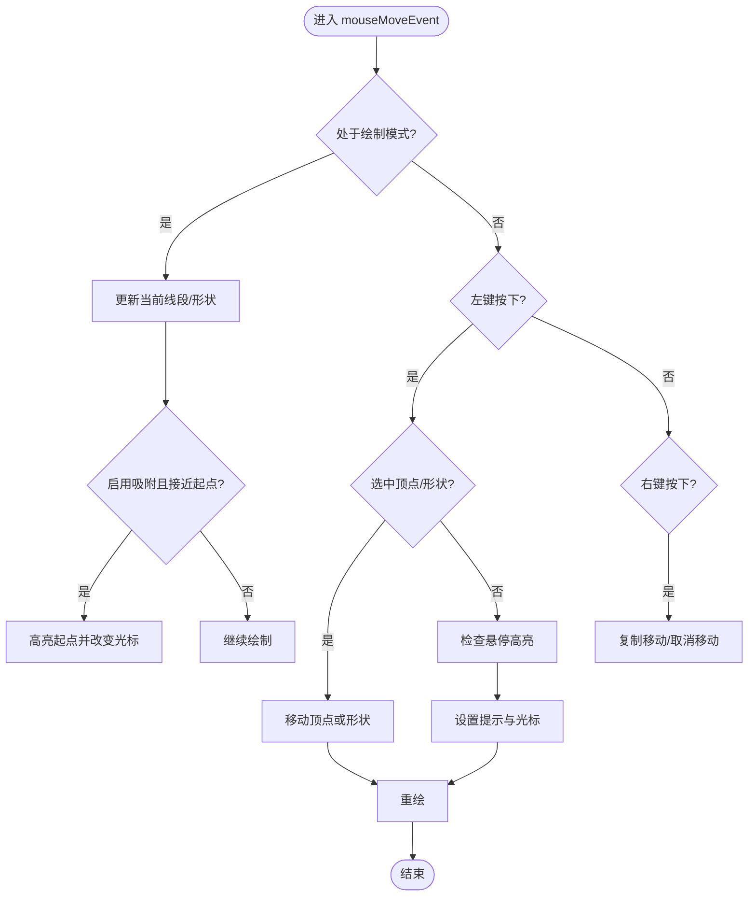
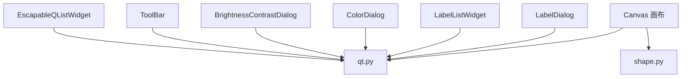

# 形状交互操作

<cite>
**本文档引用的文件**
- [canvas.py](file://labelme/labelme/widgets/canvas.py)
- [shape.py](file://labelme/labelme/utils/shape.py)
- [label_dialog.py](file://labelme/labelme/widgets/label_dialog.py)
- [label_list_widget.py](file://labelme/labelme/widgets/label_list_widget.py)
- [color_dialog.py](file://labelme/labelme/widgets/color_dialog.py)
- [brightness_contrast_dialog.py](file://labelme/labelme/widgets/brightness_contrast_dialog.py)
- [tool_bar.py](file://labelme/labelme/widgets/tool_bar.py)
- [escapable_qlist_widget.py](file://labelme/labelme/widgets/escapable_qlist_widget.py)
- [qt.py](file://labelme/labelme/utils/qt.py)
- [__main__.py](file://labelme/labelme/__main__.py)
</cite>

## 目录
1. [简介](#简介)
2. [项目结构](#项目结构)
3. [核心组件](#核心组件)
4. [架构总览](#架构总览)
5. [详细组件分析](#详细组件分析)
6. [依赖分析](#依赖分析)
7. [性能考虑](#性能考虑)
8. [故障排查指南](#故障排查指南)
9. [结论](#结论)
10. [附录](#附录)

## 简介
本文件围绕 Labelme 中“形状交互操作”的实现进行系统化技术文档整理，覆盖以下主题：
- 形状选择、移动、编辑、删除等核心交互
- 顶点选择与高亮、边的选择与插入点
- 形状的复制与粘贴、多选与组操作
- 鼠标事件处理、键盘快捷键、右键菜单
- 形状可见性控制、遮挡处理与层次管理
- 撤销/重做机制、状态保存与恢复
- 实际使用示例与最佳实践
- 为初学者提供入门指南，为高级用户提供底层实现原理与扩展建议

## 项目结构
本项目采用按功能域划分的模块化组织方式，与形状交互相关的关键模块如下：
- 画布与交互：widgets/canvas.py
- 形状工具函数：utils/shape.py
- 标签对话框与列表：widgets/label_dialog.py、widgets/label_list_widget.py
- UI 工具函数：utils/qt.py
- 其他交互组件：widgets/color_dialog.py、widgets/brightness_contrast_dialog.py、widgets/tool_bar.py、widgets/escapable_qlist_widget.py
- 应用入口：labelme/__main__.py

**图表来源**
- [canvas.py:39-148](file://labelme/labelme/widgets/canvas.py#L39-L148)
- [shape.py:41-110](file://labelme/labelme/utils/shape.py#L41-L110)
- [label_dialog.py:51-167](file://labelme/labelme/widgets/label_dialog.py#L51-L167)
- [label_list_widget.py:199-235](file://labelme/labelme/widgets/label_list_widget.py#L199-L235)
- [tool_bar.py:9-62](file://labelme/labelme/widgets/tool_bar.py#L9-L62)
- [color_dialog.py:8-58](file://labelme/labelme/widgets/color_dialog.py#L8-L58)
- [brightness_contrast_dialog.py:12-83](file://labelme/labelme/widgets/brightness_contrast_dialog.py#L12-L83)
- [escapable_qlist_widget.py:9-27](file://labelme/labelme/widgets/escapable_qlist_widget.py#L9-L27)
- [qt.py:18-106](file://labelme/labelme/utils/qt.py#L18-L106)
- [__main__.py:281-337](file://labelme/labelme/__main__.py#L281-L337)

**章节来源**
- [canvas.py:39-148](file://labelme/labelme/widgets/canvas.py#L39-L148)
- [shape.py:41-110](file://labelme/labelme/utils/shape.py#L41-L110)
- [label_dialog.py:51-167](file://labelme/labelme/widgets/label_dialog.py#L51-L167)
- [label_list_widget.py:199-235](file://labelme/labelme/widgets/label_list_widget.py#L199-L235)
- [tool_bar.py:9-62](file://labelme/labelme/widgets/tool_bar.py#L9-L62)
- [color_dialog.py:8-58](file://labelme/labelme/widgets/color_dialog.py#L8-L58)
- [brightness_contrast_dialog.py:12-83](file://labelme/labelme/widgets/brightness_contrast_dialog.py#L12-L83)
- [escapable_qlist_widget.py:9-27](file://labelme/labelme/widgets/escapable_qlist_widget.py#L9-L27)
- [qt.py:18-106](file://labelme/labelme/utils/qt.py#L18-L106)
- [__main__.py:281-337](file://labelme/labelme/__main__.py#L281-L337)

## 核心组件
- Canvas 画布：负责形状的创建、编辑、选择、移动、删除、撤销/重做、高亮显示、鼠标/键盘事件处理、右键菜单、可见性与遮挡控制等。
- Shape 工具函数：提供形状到掩码、标签数组、边界框等转换能力，支撑标注数据的后处理与导出。
- 标签对话框与列表：提供标签输入、历史管理、多选、拖拽排序、HTML 格式显示等。
- UI 工具函数：封装图标、动作、验证器等通用 UI 组件创建逻辑。
- 其他交互组件：颜色选择、亮度对比度调整、工具栏、可逃逸列表等。

**章节来源**
- [canvas.py:39-148](file://labelme/labelme/widgets/canvas.py#L39-L148)
- [shape.py:41-110](file://labelme/labelme/utils/shape.py#L41-L110)
- [label_dialog.py:51-167](file://labelme/labelme/widgets/label_dialog.py#L51-L167)
- [label_list_widget.py:199-235](file://labelme/labelme/widgets/label_list_widget.py#L199-L235)
- [qt.py:18-106](file://labelme/labelme/utils/qt.py#L18-L106)

## 架构总览
Canvas 是形状交互的核心，它通过信号与外部组件解耦，配合工具函数与对话框组件完成完整的标注流程。应用入口负责初始化窗口与组件。

**图表来源**
- [canvas.py:372-726](file://labelme/labelme/widgets/canvas.py#L372-L726)
- [label_dialog.py:336-411](file://labelme/labelme/widgets/label_dialog.py#L336-L411)
- [label_list_widget.py:299-315](file://labelme/labelme/widgets/label_list_widget.py#L299-L315)
- [shape.py:41-110](file://labelme/labelme/utils/shape.py#L41-L110)

## 详细组件分析

### Canvas 画布：形状交互核心
Canvas 负责：
- 形状创建与编辑（多边形、矩形、圆形、线条、点、线条带、AI 多边形/掩码）
- 鼠标事件处理（点击、拖拽、双击、移动、右键菜单）
- 键盘快捷键支持（Shift/Alt/Ctrl 组合）
- 顶点与边的高亮、插入点、删除点
- 形状移动、复制与粘贴、删除
- 可见性控制、遮挡处理、层次管理
- 撤销/重做、状态备份与恢复
- 光标样式与提示信息

关键交互流程示意：

**图表来源**
- [canvas.py:372-524](file://labelme/labelme/widgets/canvas.py#L372-L524)

鼠标事件与键盘快捷键要点：
- 绘制模式下，根据 createMode 决定形状类型；Shift 用于点标签与吸附；Alt 用于插入点与删除点；Ctrl 用于结束绘制或 AI 模式确认。
- 编辑模式下，左键点击选择形状，Shift/Ctrl 控制多选；Alt+Shift 删除顶点；Alt+点击边插入点；右键弹出菜单并支持复制移动。

顶点与边高亮：
- nearestVertex/nearestEdge 计算最近顶点与边，highlightVertex/highlightClear 控制高亮与提示。
- hShape/hVertex/hEdge 记录当前高亮对象，prevh* 记录上一次状态，用于平滑切换。

复制与粘贴：
- 右键拖拽触发 selectedShapesCopy，松开时弹出菜单；若选择“复制”，调用 endMove(copy=True) 将阴影副本加入 shapes 并更新；否则更新选中形状的 points。
- Ctrl+右键可进入多选模式。

删除与撤销/重做：
- deleteSelected 从 shapes 移除并调用 storeShapes 备份；restoreShape/redoShape 从备份栈恢复状态。
- storeShapes 在每次编辑后保存当前状态，num_backups 控制最大备份数。

可见性与遮挡：
- visible 字典记录形状可见性；setHiding/hideBackround 控制背景隐藏；deSelectShape 清理高亮与选择。

**章节来源**
- [canvas.py:39-148](file://labelme/labelme/widgets/canvas.py#L39-L148)
- [canvas.py:372-726](file://labelme/labelme/widgets/canvas.py#L372-L726)
- [canvas.py:727-800](file://labelme/labelme/widgets/canvas.py#L727-L800)

### 形状工具函数：掩码与标签转换
shape.py 提供：
- shape_to_mask：将任意形状（多边形、矩形、圆形、线、点、线条带）转换为二值掩码
- shapes_to_label：将形状列表转换为类别标签与实例标签数组
- masks_to_bboxes：将掩码数组转换为边界框

这些函数为标注数据的后处理与导出提供基础能力，例如将用户绘制的形状转换为语义分割所需的标签图。

**章节来源**
- [shape.py:41-110](file://labelme/labelme/utils/shape.py#L41-L110)
- [shape.py:113-167](file://labelme/labelme/utils/shape.py#L113-L167)
- [shape.py:201-232](file://labelme/labelme/utils/shape.py#L201-L232)

### 标签对话框与列表：标签管理与多选
- LabelDialog：提供标签输入、历史列表、自动完成、标志（flags）管理、组 ID 与描述输入；支持 ESC 清空输入、上下键导航。
- LabelListWidget：支持多选、拖拽排序、HTML 格式显示、双击事件、选择变化信号；与 Canvas 的选择状态联动。

**章节来源**
- [label_dialog.py:51-167](file://labelme/labelme/widgets/label_dialog.py#L51-L167)
- [label_dialog.py:336-411](file://labelme/labelme/widgets/label_dialog.py#L336-L411)
- [label_list_widget.py:199-235](file://labelme/labelme/widgets/label_list_widget.py#L199-L235)
- [label_list_widget.py:308-315](file://labelme/labelme/widgets/label_list_widget.py#L308-L315)

### UI 工具函数与交互组件
- qt.py：newAction/newIcon/newButton 等封装，统一图标与快捷键管理；distancetoline/distance 等几何计算工具。
- ToolBar：自定义工具栏，居中对齐工具按钮，支持 WidgetAction。
- ColorDialog：颜色选择与透明度通道支持，带“恢复默认”按钮。
- BrightnessContrastDialog：亮度/对比度滑块调整，实时预览。
- EscapableQListWidget：支持 ESC 清除选择，提升键盘交互体验。

**章节来源**
- [qt.py:18-106](file://labelme/labelme/utils/qt.py#L18-L106)
- [qt.py:167-197](file://labelme/labelme/utils/qt.py#L167-L197)
- [tool_bar.py:9-62](file://labelme/labelme/widgets/tool_bar.py#L9-L62)
- [color_dialog.py:8-58](file://labelme/labelme/widgets/color_dialog.py#L8-L58)
- [brightness_contrast_dialog.py:12-83](file://labelme/labelme/widgets/brightness_contrast_dialog.py#L12-L83)
- [escapable_qlist_widget.py:9-27](file://labelme/labelme/widgets/escapable_qlist_widget.py#L9-L27)

## 依赖分析
Canvas 与各组件之间的依赖关系如下：

**图表来源**
- [canvas.py:16-18](file://labelme/labelme/widgets/canvas.py#L16-L18)
- [qt.py:18-106](file://labelme/labelme/utils/qt.py#L18-L106)

**章节来源**
- [canvas.py:16-18](file://labelme/labelme/widgets/canvas.py#L16-L18)
- [qt.py:18-106](file://labelme/labelme/utils/qt.py#L18-L106)

## 性能考虑
- 顶点选择容差 epsilon：影响高亮与吸附的灵敏度，过小导致难以选中，过大降低精度。
- 备份策略：num_backups 控制撤销/重做栈大小，避免内存占用过高。
- 绘制与重绘：move/press/release 事件中尽量减少不必要的重绘调用，仅在必要时 repaint。
- 掩码生成：shape_to_mask 使用 PIL.ImageDraw，注意大图与复杂形状的性能影响。
- AI 模型嵌入缓存：Canvas 中对图像嵌入进行缓存，避免重复计算，提升 AI 辅助标注效率。

[本节为通用性能建议，无需特定文件引用]

## 故障排查指南
- 无法选择形状：检查 isVisible 与 setHiding 的调用；确认鼠标位置在 pixmap 内。
- 顶点无法高亮：确认 epsilon 设置合理；检查 nearestVertex/nearestEdge 的返回值。
- 撤销/重做无效：确保每次编辑后调用 storeShapes；检查 shapesBackups/redoBackups 的状态。
- 右键菜单不显示：确认 menus 初始化与 exec_ 调用；检查事件坐标转换 transformPos。
- 标签输入异常：检查 LabelDialog 的 validator 与自动完成设置；确认 ESC 清空选择逻辑。

**章节来源**
- [canvas.py:338-340](file://labelme/labelme/widgets/canvas.py#L338-L340)
- [canvas.py:675-681](file://labelme/labelme/widgets/canvas.py#L675-L681)
- [canvas.py:229-244](file://labelme/labelme/widgets/canvas.py#L229-L244)
- [canvas.py:632-640](file://labelme/labelme/widgets/canvas.py#L632-L640)
- [label_dialog.py:12-16](file://labelme/labelme/widgets/label_dialog.py#L12-L16)

## 结论
Canvas 作为形状交互的核心，通过完善的鼠标/键盘事件处理、高亮与吸附机制、复制粘贴与多选组操作、可见性与遮挡控制以及撤销/重做机制，构建了稳定高效的标注交互体系。结合 shape.py 的数据转换能力与 UI 组件的丰富交互，形成了从绘制到导出的一体化工作流。对于扩展开发者，建议遵循现有信号/槽与工具函数封装模式，确保新增功能与现有架构兼容。

[本节为总结性内容，无需特定文件引用]

## 附录

### 实际使用示例与最佳实践
- 顶点选择与编辑
  - 将鼠标悬停在形状边缘附近，出现高亮与提示；Alt+点击边插入点；Alt+Shift+点击删除点。
  - Shift+拖拽顶点进行局部微调；Ctrl+双击关闭多边形。
- 形状移动与复制粘贴
  - 左键点击形状内部进入移动模式；右键拖拽进入复制移动；松开右键弹出菜单选择“复制”或取消。
  - 多选：按住 Ctrl/Shift 点击多个形状；右键多选：右键点击未选中形状并按住。
- 可见性与遮挡
  - 使用 hideBackroundShapes 控制背景隐藏，便于选择被遮挡的形状；visible 字典可逐个控制可见性。
- 撤销/重做
  - 每次编辑后自动备份；撤销/重做按钮或快捷键触发；注意 num_backups 的设置。
- 标签管理
  - 通过 LabelDialog 输入标签与描述；标签列表支持拖拽排序与多选；ESC 清空选择提升效率。

**章节来源**
- [canvas.py:372-524](file://labelme/labelme/widgets/canvas.py#L372-L524)
- [canvas.py:550-631](file://labelme/labelme/widgets/canvas.py#L550-L631)
- [canvas.py:632-726](file://labelme/labelme/widgets/canvas.py#L632-L726)
- [label_dialog.py:336-411](file://labelme/labelme/widgets/label_dialog.py#L336-L411)
- [label_list_widget.py:287-315](file://labelme/labelme/widgets/label_list_widget.py#L287-L315)

### 初学者入门指南
- 熟悉 Canvas 的绘制模式与编辑模式切换
- 掌握常用快捷键：Shift/Alt/Ctrl 的组合作用
- 了解撤销/重做与状态备份机制
- 使用标签对话框与列表管理标签与描述
- 通过亮度/对比度对话框优化图像可视性

**章节来源**
- [canvas.py:39-148](file://labelme/labelme/widgets/canvas.py#L39-L148)
- [label_dialog.py:51-167](file://labelme/labelme/widgets/label_dialog.py#L51-L167)
- [brightness_contrast_dialog.py:12-83](file://labelme/labelme/widgets/brightness_contrast_dialog.py#L12-L83)

### 高级用户与扩展开发指导
- 扩展形状类型：在 Canvas 的 createMode 中增加新类型，并在 mouseMoveEvent/mousePressEvent 中处理相应逻辑。
- 自定义高亮与吸附：调整 epsilon 与 nearestVertex/nearestEdge 的阈值；扩展 highlightVertex 的样式。
- 批量处理：利用 selectedShapes 的集合操作与批量移动/复制；在导出时使用 shape_to_mask/shapes_to_label。
- UI 扩展：通过 qt.py 的 newAction/newIcon 统一风格；在 ToolBar 中添加自定义按钮与快捷键。
- 数据导出：使用 shape_to_mask 与 masks_to_bboxes 将标注转换为掩码与边界框，满足不同下游任务需求。

**章节来源**
- [canvas.py:162-179](file://labelme/labelme/widgets/canvas.py#L162-L179)
- [canvas.py:372-524](file://labelme/labelme/widgets/canvas.py#L372-L524)
- [shape.py:41-110](file://labelme/labelme/utils/shape.py#L41-L110)
- [qt.py:56-106](file://labelme/labelme/utils/qt.py#L56-L106)