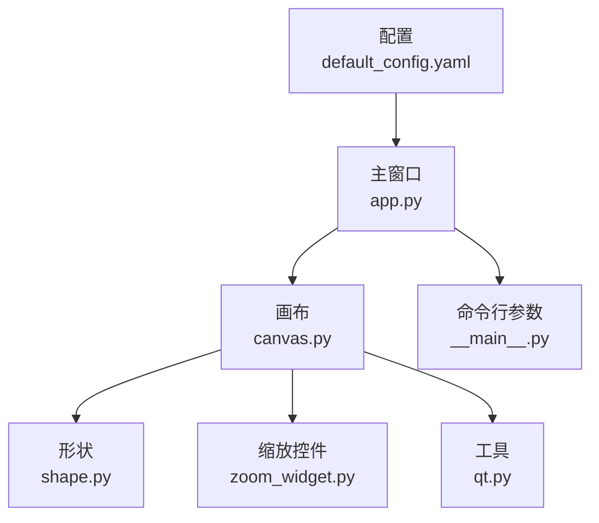
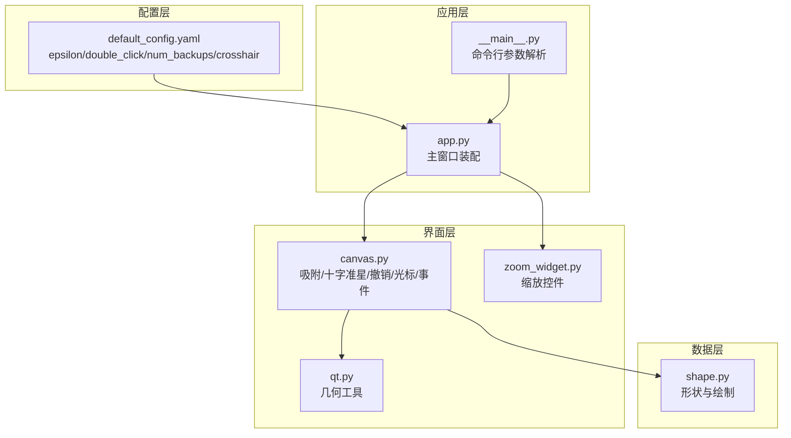
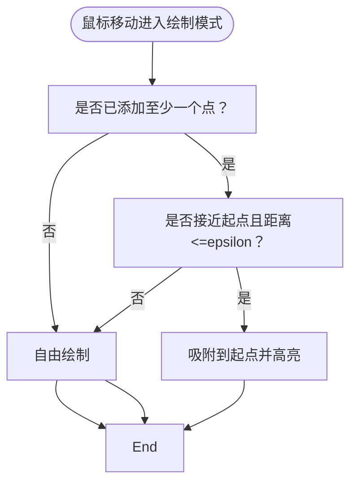
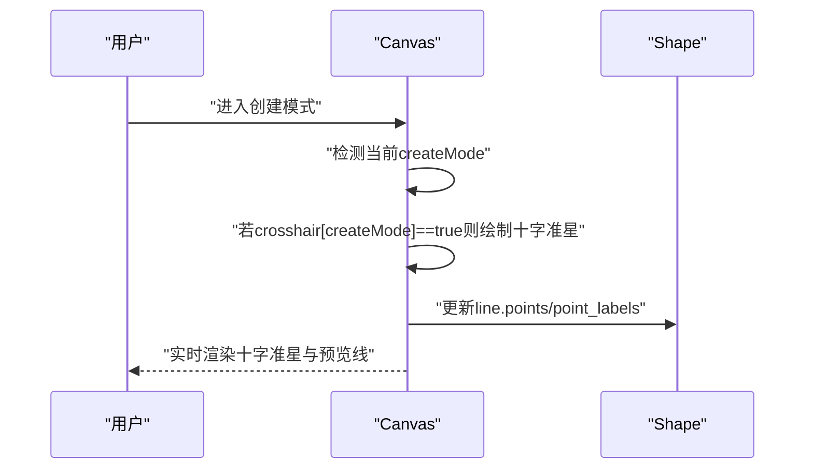
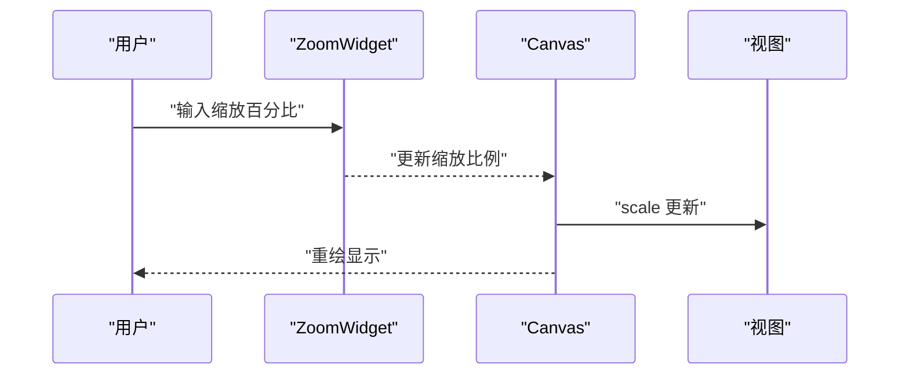
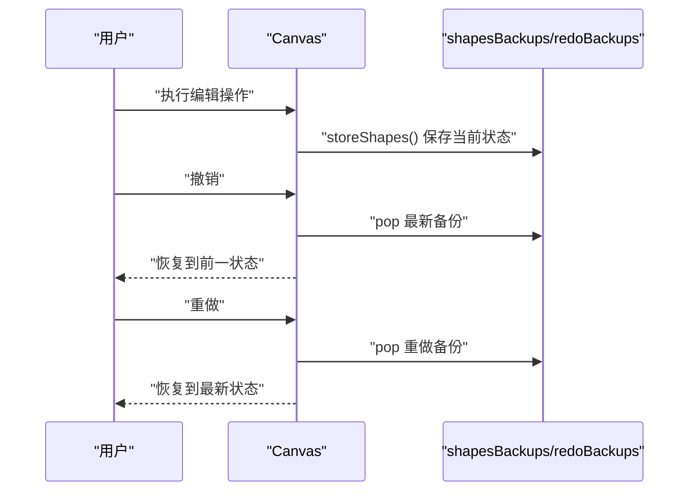
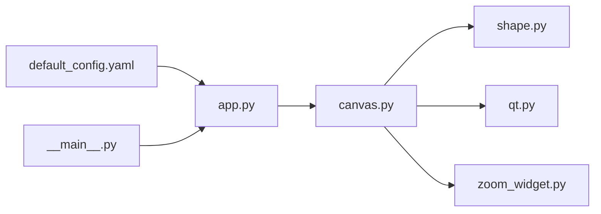

# 高级功能特性

<cite>
**本文引用的文件**
- [default_config.yaml](file://labelme/labelme/config/default_config.yaml)
- [canvas.py](file://labelme/labelme/widgets/canvas.py)
- [zoom_widget.py](file://labelme/labelme/widgets/zoom_widget.py)
- [shape.py](file://labelme/labelme/shape.py)
- [qt.py](file://labelme/labelme/utils/qt.py)
- [__main__.py](file://labelme/labelme/__main__.py)
- [app.py](file://labelme/labelme/app.py)
</cite>

## 目录
1. [简介](#简介)
2. [项目结构](#项目结构)
3. [核心组件](#核心组件)
4. [架构总览](#架构总览)
5. [详细组件分析](#详细组件分析)
6. [依赖分析](#依赖分析)
7. [性能考虑](#性能考虑)
8. [故障排查指南](#故障排查指南)
9. [结论](#结论)
10. [附录](#附录)

## 简介
本文件面向希望深入掌握 Labelme 高级功能的用户，围绕以下主题展开：吸附功能（snapping）、十字准星显示（crosshair）、缩放与平移（zoom/pan）、背景隐藏、撤销/重做机制、光标样式管理、鼠标与键盘修饰键综合应用、以及 AI 辅助标注与掩码处理等。文档同时提供参数调优建议、性能优化策略、内存管理要点、实际使用示例与配置技巧，帮助初学者快速上手，也为高级用户提供深度定制与性能调优的技术细节。

## 项目结构
本项目的高级功能主要集中在以下模块：
- 配置层：default_config.yaml 提供全局默认配置，包括 epsilon 容差、双击行为、撤销备份数量、十字准星开关等。
- 画布层：canvas.py 是核心交互与渲染组件，负责吸附、十字准星、撤销/重做、光标切换、鼠标/键盘事件处理。
- 形状层：shape.py 定义 Shape 基类及几何与绘制逻辑，支撑多边形、矩形、圆形、线条、点、掩码等。
- UI 控件：zoom_widget.py 提供缩放输入控件；qt.py 提供通用 UI 工具与几何计算。
- 应用入口：__main__.py 解析命令行参数并加载配置；app.py 是主窗口，负责组装 UI 并传递配置到画布。

**图表来源**
- [default_config.yaml](file://labelme/labelme/config/default_config.yaml)
- [app.py](file://labelme/labelme/app.py)
- [canvas.py](file://labelme/labelme/widgets/canvas.py)
- [shape.py](file://labelme/labelme/shape.py)
- [zoom_widget.py](file://labelme/labelme/widgets/zoom_widget.py)
- [qt.py](file://labelme/labelme/utils/qt.py)
- [__main__.py](file://labelme/labelme/__main__.py)

**章节来源**
- [default_config.yaml](file://labelme/labelme/config/default_config.yaml)
- [app.py](file://labelme/labelme/app.py)
- [canvas.py](file://labelme/labelme/widgets/canvas.py)
- [shape.py](file://labelme/labelme/shape.py)
- [zoom_widget.py](file://labelme/labelme/widgets/zoom_widget.py)
- [qt.py](file://labelme/labelme/utils/qt.py)
- [__main__.py](file://labelme/labelme/__main__.py)

## 核心组件
- 画布 Canvas：负责吸附、十字准星、撤销/重做、光标管理、鼠标/键盘事件、形状高亮与选择、背景隐藏等。
- 形状 Shape：提供多边形、矩形、圆形、线条、点、线条带、点集、掩码等绘制与几何判断。
- 缩放控件 ZoomWidget：提供 1%-1000% 的缩放输入与显示。
- 配置 default_config.yaml：集中定义 epsilon、双击行为、撤销备份数量、十字准星开关等。
- UI 工具 qt.py：提供距离与点到线段距离计算等几何工具。
- 应用入口与主窗口：解析命令行参数、加载配置、构建主界面。

**章节来源**
- [canvas.py](file://labelme/labelme/widgets/canvas.py)
- [shape.py](file://labelme/labelme/shape.py)
- [zoom_widget.py](file://labelme/labelme/widgets/zoom_widget.py)
- [default_config.yaml](file://labelme/labelme/config/default_config.yaml)
- [qt.py](file://labelme/labelme/utils/qt.py)
- [__main__.py](file://labelme/labelme/__main__.py)
- [app.py](file://labelme/labelme/app.py)

## 架构总览
下图展示了高级功能在系统中的位置与交互关系：

**图表来源**
- [default_config.yaml](file://labelme/labelme/config/default_config.yaml)
- [__main__.py](file://labelme/labelme/__main__.py)
- [app.py](file://labelme/labelme/app.py)
- [canvas.py](file://labelme/labelme/widgets/canvas.py)
- [zoom_widget.py](file://labelme/labelme/widgets/zoom_widget.py)
- [qt.py](file://labelme/labelme/utils/qt.py)
- [shape.py](file://labelme/labelme/shape.py)

## 详细组件分析

### 吸附功能（Snapping）
- 核心实现位置：画布 Canvas 在绘制多边形时对起始点进行吸附判断，当鼠标接近起点且满足容差条件时，吸附到起点并高亮提示。
- 关键参数：
  - epsilon：顶点选择容差，决定“接近”判定的敏感度。
  - snapping：是否启用吸附功能。
- 行为特征：
  - 仅在创建多边形且已添加至少一个点时生效。
  - 当接近起点且满足容差，光标切换为指向手型，提示可闭合。
- 调优建议：
  - 更精细的绘制：降低 epsilon。
  - 更宽松的吸附：提高 epsilon。
  - 临时关闭吸附：将 snapping 设为 False。

**图表来源**
- [canvas.py](file://labelme/labelme/widgets/canvas.py)

**章节来源**
- [canvas.py](file://labelme/labelme/widgets/canvas.py)
- [default_config.yaml](file://labelme/labelme/config/default_config.yaml)

### 十字准星显示（Crosshair）
- 配置位置：canvas 下的 crosshair 字典，按创建模式分别控制是否显示。
- 实现位置：画布在“创建模式”且“绘制中”时，会在鼠标附近绘制十字准星，便于精确对齐。
- 可配置模式：polygon、rectangle、circle、line、point、linestrip、ai_polygon、ai_mask。
- 使用建议：
  - 对矩形/多边形等需要对齐的场景开启相应模式。
  - AI 模式下可通过 Shift 键切换前景/背景点标签，配合十字准星更精准。

**图表来源**
- [canvas.py](file://labelme/labelme/widgets/canvas.py)
- [default_config.yaml](file://labelme/labelme/config/default_config.yaml)

**章节来源**
- [canvas.py](file://labelme/labelme/widgets/canvas.py)
- [default_config.yaml](file://labelme/labelme/config/default_config.yaml)

### 缩放与平移（Zoom/Pan）
- 缩放控件：ZoomWidget 提供 1%-1000% 的缩放输入，居中显示并带有百分号后缀。
- 平移：通过鼠标右键拖拽或键盘方向键进行视图平移（由画布事件处理实现）。
- 快捷键：配置中提供多种缩放快捷键（如 Ctrl++、Ctrl+-、WheelUp/WheelDown、F、Ctrl+F/Ctrl+Shift+F 等）。
- 性能建议：
  - 高分辨率图像建议使用“适应窗口/宽度”后再局部放大，减少过度缩放带来的重绘压力。
  - 合理设置 num_backups，避免过大的撤销栈占用内存。

**图表来源**
- [zoom_widget.py](file://labelme/labelme/widgets/zoom_widget.py)
- [canvas.py](file://labelme/labelme/widgets/canvas.py)
- [default_config.yaml](file://labelme/labelme/config/default_config.yaml)

**章节来源**
- [zoom_widget.py](file://labelme/labelme/widgets/zoom_widget.py)
- [canvas.py](file://labelme/labelme/widgets/canvas.py)
- [default_config.yaml](file://labelme/labelme/config/default_config.yaml)

### 背景隐藏（Hide Background）
- 功能说明：在编辑模式下，可选择隐藏未选中形状以外的背景，突出当前标注。
- 实现位置：Canvas 提供 hideBackroundShapes 与 setHiding，结合当前选择状态控制隐藏。
- 使用建议：在复杂场景中先选择目标形状再启用隐藏，避免误操作导致无法选择其他形状。

**章节来源**
- [canvas.py](file://labelme/labelme/widgets/canvas.py)

### 撤销/重做（Undo/Redo）
- 关键参数：num_backups（最大撤销次数）。
- 实现机制：
  - 每次编辑后调用 storeShapes 保存当前状态快照。
  - 撤销时弹出最新两个备份，恢复前一个状态。
  - 重做时从 redoBackups 中恢复。
- 调优建议：
  - 高频编辑场景适当提高 num_backups。
  - 大图像/大量标注时注意内存占用，必要时降低 num_backups。

**图表来源**
- [canvas.py](file://labelme/labelme/widgets/canvas.py)
- [default_config.yaml](file://labelme/labelme/config/default_config.yaml)

**章节来源**
- [canvas.py](file://labelme/labelme/widgets/canvas.py)
- [default_config.yaml](file://labelme/labelme/config/default_config.yaml)

### 光标样式管理
- 光标常量：默认、指向手型、十字、握紧手、张开手。
- 切换逻辑：
  - 绘制模式：十字光标。
  - 悬停顶点/边：指向手型。
  - 拖拽形状：握紧手。
  - 空闲悬停形状内：张开手。
- 事件驱动：mouseMoveEvent、mousePressEvent、leaveEvent 等根据状态切换光标。

**章节来源**
- [canvas.py](file://labelme/labelme/widgets/canvas.py)

### 鼠标事件与键盘修饰键
- 鼠标事件：
  - mouseMoveEvent：更新高亮、吸附、十字准星、光标。
  - mousePressEvent：添加点、闭合多边形、进入编辑选择。
  - mouseReleaseEvent：结束拖拽、右键菜单、撤销移动。
  - mouseDoubleClickEvent：根据 double_click 配置决定是否闭合多边形。
- 键盘修饰键：
  - Shift：在 AI 模式下切换前景/背景点标签；在多边形创建中影响点标签。
  - Alt：在编辑模式下于边上添加点或删除选定点。
  - Ctrl：组合用于复制/粘贴、撤销最后一点、在某些模式下立即闭合。
- 快捷键：配置文件中集中定义，覆盖文件操作、导航、缩放、绘图工具、显示控制等。

**章节来源**
- [canvas.py](file://labelme/labelme/widgets/canvas.py)
- [default_config.yaml](file://labelme/labelme/config/default_config.yaml)

### 高级绘图与 AI 辅助
- 形状类型：多边形、矩形、圆形、线条、点、线条带、点集、掩码。
- AI 模式：支持 ai_polygon 与 ai_mask，通过 Shift 切换前景/背景点标签，Ctrl 快速闭合。
- 掩码处理：掩码类型形状通过掩码数组与边界框进行绘制与包含判断。

**章节来源**
- [shape.py](file://labelme/labelme/shape.py)
- [canvas.py](file://labelme/labelme/widgets/canvas.py)
- [default_config.yaml](file://labelme/labelme/config/default_config.yaml)

## 依赖分析
- 配置到画布：default_config.yaml 的 epsilon、double_click、num_backups、crosshair 作为关键字参数传入 Canvas。
- 主窗口装配：app.py 读取配置并设置 Shape 类默认颜色与点大小，随后创建 Canvas 并注入配置。
- 命令行参数：__main__.py 支持 --epsilon 等参数覆盖默认配置。

**图表来源**
- [default_config.yaml](file://labelme/labelme/config/default_config.yaml)
- [app.py](file://labelme/labelme/app.py)
- [__main__.py](file://labelme/labelme/__main__.py)
- [canvas.py](file://labelme/labelme/widgets/canvas.py)
- [shape.py](file://labelme/labelme/shape.py)
- [qt.py](file://labelme/labelme/utils/qt.py)
- [zoom_widget.py](file://labelme/labelme/widgets/zoom_widget.py)

**章节来源**
- [default_config.yaml](file://labelme/labelme/config/default_config.yaml)
- [app.py](file://labelme/labelme/app.py)
- [__main__.py](file://labelme/labelme/__main__.py)
- [canvas.py](file://labelme/labelme/widgets/canvas.py)
- [shape.py](file://labelme/labelme/shape.py)
- [qt.py](file://labelme/labelme/utils/qt.py)
- [zoom_widget.py](file://labelme/labelme/widgets/zoom_widget.py)

## 性能考虑
- 吸附与高亮：
  - epsilon 过小会导致频繁高亮切换与重绘，建议根据图像分辨率与标注精度适度调整。
- 撤销栈：
  - num_backups 增大带来更好的容错性，但会增加内存占用。建议在大图像场景下调小。
- 绘制与掩码：
  - 掩码绘制涉及路径查找与图像缩放，建议在复杂场景中优先使用矢量形状，必要时再使用掩码。
- 缩放与重绘：
  - 高倍率缩放会增加重绘成本，建议采用“先适应窗口/宽度，再局部放大”的策略。
- AI 模型：
  - 图像嵌入缓存可显著提升 AI 模式下的响应速度，避免重复计算。

[本节为通用性能建议，无需特定文件引用]

## 故障排查指南
- 启动冲突：
  - 若提示“Labelme 已在运行”，请关闭现有实例或使用 --reset-config 清理 Qt 配置。
- 缩放异常：
  - 检查 ZoomWidget 输入范围（1%-1000%），确认快捷键未被系统占用。
- 吸附不生效：
  - 确认当前处于多边形绘制且已添加至少一个点；检查 epsilon 是否过大。
- 十字准星不显示：
  - 检查 crosshair 配置中对应模式是否开启。
- 撤销/重做失效：
  - 确认 num_backups 设置合理；检查是否频繁超出上限导致最早备份被清理。

**章节来源**
- [__main__.py](file://labelme/labelme/__main__.py)
- [canvas.py](file://labelme/labelme/widgets/canvas.py)
- [default_config.yaml](file://labelme/labelme/config/default_config.yaml)

## 结论
通过合理配置 epsilon、double_click、num_backups 与 crosshair，结合吸附、十字准星、缩放/平移与背景隐藏等高级功能，可显著提升标注效率与体验。在复杂场景中，建议优先优化参数与流程，辅以性能与内存管理策略，以获得稳定高效的标注工作流。

[本节为总结性内容，无需特定文件引用]

## 附录

### 关键参数与调优清单
- epsilon（吸附容差）
  - 适用场景：多边形闭合、顶点选择。
  - 调优建议：低分辨率图像可适当增大；高精度标注建议减小。
- double_click（双击行为）
  - 适用场景：多边形自动闭合。
  - 调优建议：默认“close”适合大多数场景；如需手动控制可设为 None。
- num_backups（撤销备份数量）
  - 适用场景：频繁编辑与反复修改。
  - 调优建议：普通场景 5-10；大图像/大批量标注建议 3-5。
- crosshair（十字准星）
  - 适用场景：矩形/多边形/线条等需要对齐的标注。
  - 调优建议：按需开启对应模式，避免不必要的渲染开销。

**章节来源**
- [default_config.yaml](file://labelme/labelme/config/default_config.yaml)
- [canvas.py](file://labelme/labelme/widgets/canvas.py)

### 实际使用示例与配置技巧
- 快速闭合多边形：双击鼠标或按住 Ctrl+Z 撤销最后一点，再双击闭合。
- 精准对齐：开启矩形/多边形的十字准星，利用 Shift 切换前景/背景点标签。
- 高效缩放：先按 F 适应窗口，再使用 Ctrl++ 局部放大；平移使用鼠标右键拖拽。
- 突出当前标注：在编辑模式下启用背景隐藏，仅保留选中形状。

[本节为实践建议，无需特定文件引用]