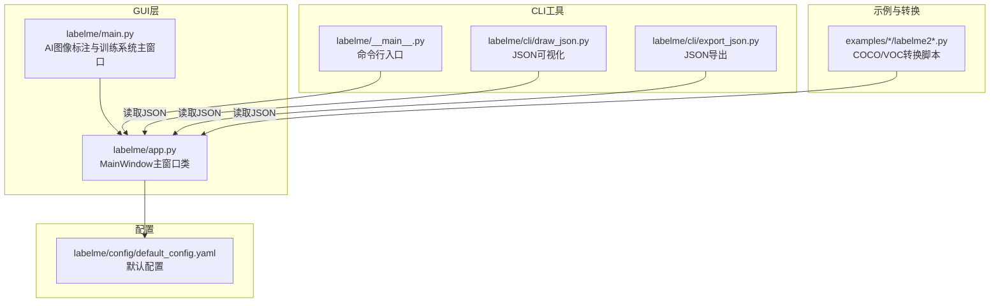
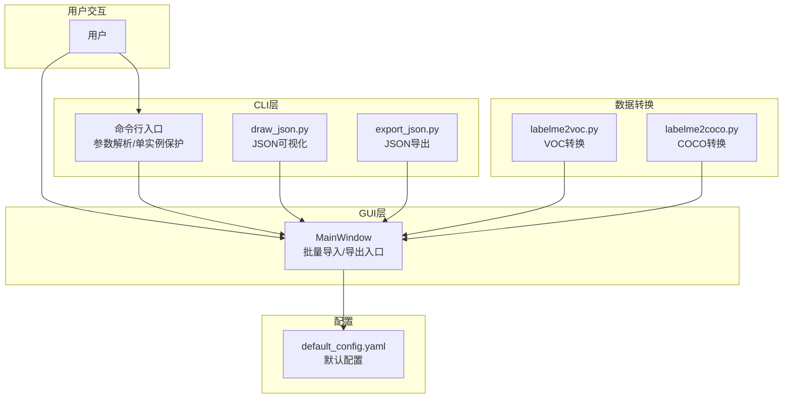
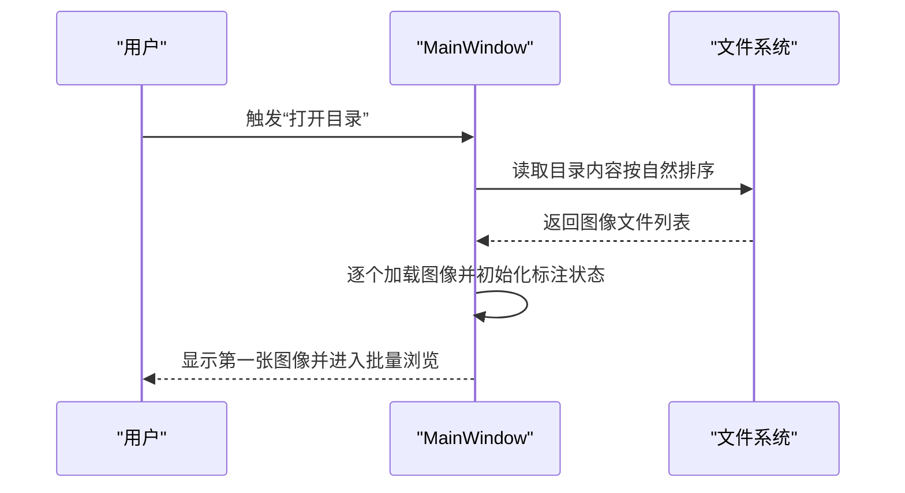
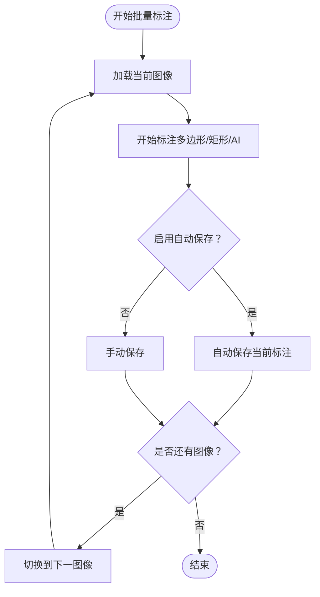
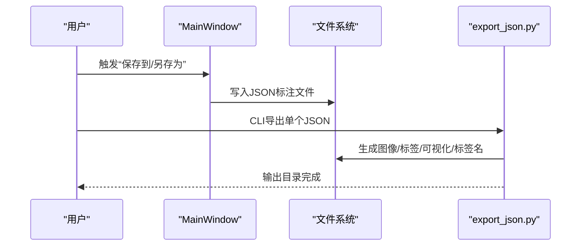
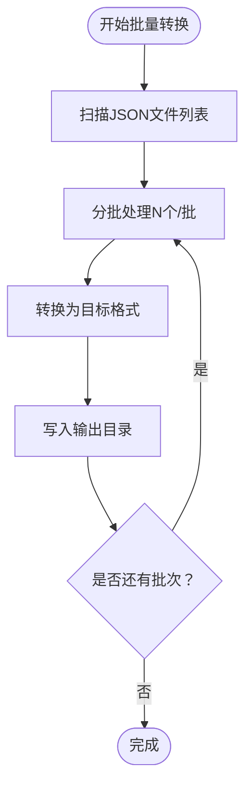
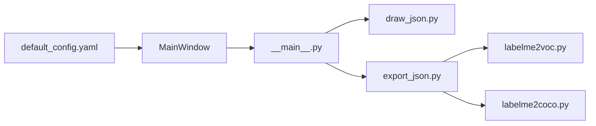
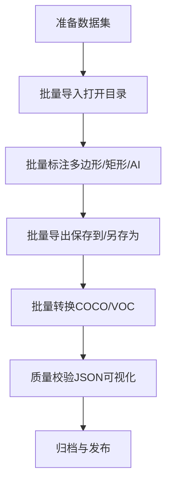

# 批量处理功能

<cite>
**本文引用的文件**
- [labelme/app.py](file://labelme/app.py)
- [labelme/__main__.py](file://labelme/__main__.py)
- [labelme/main.py](file://labelme/main.py)
- [labelme/config/default_config.yaml](file://labelme/config/default_config.yaml)
- [labelme/cli/draw_json.py](file://labelme/cli/draw_json.py)
- [labelme/cli/export_json.py](file://labelme/cli/export_json.py)
- [examples/bbox_detection/labelme2voc.py](file://examples/bbox_detection/labelme2voc.py)
- [examples/instance_segmentation/labelme2coco.py](file://examples/instance_segmentation/labelme2coco.py)
- [examples/semantic_segmentation/labelme2voc.py](file://examples/semantic_segmentation/labelme2voc.py)
- [examples/video_annotation/labelme2voc.py](file://examples/video_annotation/labelme2voc.py)
</cite>

## 目录
1. [简介](#简介)
2. [项目结构](#项目结构)
3. [核心组件](#核心组件)
4. [架构总览](#架构总览)
5. [详细组件分析](#详细组件分析)
6. [依赖分析](#依赖分析)
7. [性能考虑](#性能考虑)
8. [故障排查指南](#故障排查指南)
9. [结论](#结论)
10. [附录](#附录)

## 简介
本文件面向labelme的批量处理能力，系统性梳理其“批量导入、批量标注、批量导出”的工作流与实现机制，结合现有CLI工具与示例脚本，给出性能优化、内存管理、配置参数、自动化脚本编写、错误处理与异常恢复、以及大规模数据集的最佳实践与调优建议。同时提供批量处理与单文件处理的对比与选择指导。

## 项目结构
围绕批量处理的关键模块与文件如下：
- GUI主程序与主窗口：负责承载labelme核心功能，提供批量导入与批量导出的入口与集成点
- CLI工具：提供独立的JSON可视化与导出工具，便于批量化脚本直接调用
- 示例脚本：提供将labelme标注结果转换为常见数据集格式（如COCO/VOC）的自动化脚本
- 配置系统：提供默认配置与快捷键、颜色、AI模型等参数，支撑批量处理一致性

**图表来源**
- [labelme/main.py:118-310](file://labelme/main.py#L118-L310)
- [labelme/app.py:99-200](file://labelme/app.py#L99-L200)
- [labelme/__main__.py:137-341](file://labelme/__main__.py#L137-L341)
- [labelme/cli/draw_json.py:16-68](file://labelme/cli/draw_json.py#L16-L68)
- [labelme/cli/export_json.py:19-90](file://labelme/cli/export_json.py#L19-L90)
- [examples/bbox_detection/labelme2voc.py](file://examples/bbox_detection/labelme2voc.py)
- [examples/instance_segmentation/labelme2coco.py](file://examples/instance_segmentation/labelme2coco.py)
- [examples/semantic_segmentation/labelme2voc.py](file://examples/semantic_segmentation/labelme2voc.py)
- [examples/video_annotation/labelme2voc.py](file://examples/video_annotation/labelme2voc.py)
- [labelme/config/default_config.yaml:1-147](file://labelme/config/default_config.yaml#L1-L147)

**章节来源**
- [labelme/main.py:118-310](file://labelme/main.py#L118-L310)
- [labelme/app.py:99-200](file://labelme/app.py#L99-L200)
- [labelme/__main__.py:137-341](file://labelme/__main__.py#L137-L341)
- [labelme/config/default_config.yaml:1-147](file://labelme/config/default_config.yaml#L1-L147)

## 核心组件
- 主窗口与批量入口
  - GUI主窗口负责承载labelme核心功能，批量导入与批量导出通常通过主窗口的动作与菜单触发，例如“打开目录”“保存到”等。
  - 在集成场景中，主窗口可通过动作对象触发批量导入与批量导出流程。
- CLI工具链
  - 命令行入口提供参数解析与单实例保护，支持以非GUI方式运行。
  - JSON可视化工具用于快速校验标注结果。
  - JSON导出工具用于将单个标注文件导出为标准数据集格式（图像、标签、可视化、标签名）。
- 示例转换脚本
  - 提供将多个JSON标注文件批量转换为COCO/VOC等格式的自动化脚本，适合大规模数据集处理。
- 配置系统
  - 默认配置文件提供自动保存、标签排序、颜色、快捷键、AI模型等参数，保证批量处理的一致性与可重复性。

**章节来源**
- [labelme/app.py:99-200](file://labelme/app.py#L99-L200)
- [labelme/__main__.py:137-341](file://labelme/__main__.py#L137-L341)
- [labelme/cli/draw_json.py:16-68](file://labelme/cli/draw_json.py#L16-L68)
- [labelme/cli/export_json.py:19-90](file://labelme/cli/export_json.py#L19-L90)
- [examples/bbox_detection/labelme2voc.py](file://examples/bbox_detection/labelme2voc.py)
- [examples/instance_segmentation/labelme2coco.py](file://examples/instance_segmentation/labelme2coco.py)
- [examples/semantic_segmentation/labelme2voc.py](file://examples/semantic_segmentation/labelme2voc.py)
- [examples/video_annotation/labelme2voc.py](file://examples/video_annotation/labelme2voc.py)
- [labelme/config/default_config.yaml:1-147](file://labelme/config/default_config.yaml#L1-L147)

## 架构总览
labelme的批量处理由“GUI主窗口 + CLI工具 + 示例脚本 + 配置系统”协同构成。GUI主窗口提供交互式批量导入与导出入口；CLI工具提供非交互式批处理能力；示例脚本提供面向特定数据集格式的批量转换；配置系统保障参数一致性。

**图表来源**
- [labelme/app.py:99-200](file://labelme/app.py#L99-L200)
- [labelme/__main__.py:137-341](file://labelme/__main__.py#L137-L341)
- [labelme/cli/draw_json.py:16-68](file://labelme/cli/draw_json.py#L16-L68)
- [labelme/cli/export_json.py:19-90](file://labelme/cli/export_json.py#L19-L90)
- [examples/bbox_detection/labelme2voc.py](file://examples/bbox_detection/labelme2voc.py)
- [examples/instance_segmentation/labelme2coco.py](file://examples/instance_segmentation/labelme2coco.py)
- [examples/semantic_segmentation/labelme2voc.py](file://examples/semantic_segmentation/labelme2voc.py)
- [examples/video_annotation/labelme2voc.py](file://examples/video_annotation/labelme2voc.py)
- [labelme/config/default_config.yaml:1-147](file://labelme/config/default_config.yaml#L1-L147)

## 详细组件分析

### 组件A：批量导入（打开目录）
- 触发方式
  - 通过主窗口的动作对象触发“打开目录”，实现批量导入图像文件。
- 实现要点
  - 主窗口维护动作集合，批量导入对应动作对象，调用后按自然排序加载目录中的图像文件。
  - 配置项影响：文件搜索、标签排序、自动保存等会影响导入后的初始状态与一致性。
- 性能与内存
  - 建议分批加载（按目录分片），避免一次性加载过多图像导致内存峰值过高。
  - 合理设置缓存与缩放策略，减少重复解码与渲染。

**图表来源**
- [labelme/app.py:99-200](file://labelme/app.py#L99-L200)
- [labelme/config/default_config.yaml:14-20](file://labelme/config/default_config.yaml#L14-L20)

**章节来源**
- [labelme/app.py:99-200](file://labelme/app.py#L99-L200)
- [labelme/config/default_config.yaml:14-20](file://labelme/config/default_config.yaml#L14-L20)

### 组件B：批量标注（批量浏览与标注）
- 触发方式
  - 通过主窗口的动作对象在图像间切换，配合快捷键实现批量标注。
- 实现要点
  - 快捷键配置与跨模式（多边形/矩形/AI）切换，保证标注效率。
  - 自动保存、标签排序、颜色配置等参数影响标注体验与一致性。
- 性能与内存
  - 建议启用自动保存，降低丢失风险；合理设置撤销备份数量，平衡内存占用。
  - 对于高分辨率图像，建议先缩放至合适尺寸再标注。

**图表来源**
- [labelme/config/default_config.yaml:5-12](file://labelme/config/default_config.yaml#L5-L12)
- [labelme/config/default_config.yaml:101-147](file://labelme/config/default_config.yaml#L101-L147)

**章节来源**
- [labelme/config/default_config.yaml:5-12](file://labelme/config/default_config.yaml#L5-L12)
- [labelme/config/default_config.yaml:101-147](file://labelme/config/default_config.yaml#L101-L147)

### 组件C：批量导出（保存到/导出）
- 触发方式
  - 通过主窗口的动作对象“保存到”或“另存为”，将当前标注保存到目标目录。
  - CLI导出工具可将单个JSON导出为标准数据集格式，便于进一步批处理。
- 实现要点
  - 导出工具支持输出目录与文件命名策略，便于批量归档。
  - 示例脚本提供COCO/VOC转换，适合大规模数据集的格式统一。
- 性能与内存
  - 批量导出时建议分批写入，避免磁盘写入拥塞。
  - 对于大文件，优先使用轻量级存储策略（如仅保存标注坐标）。

**图表来源**
- [labelme/app.py:99-200](file://labelme/app.py#L99-L200)
- [labelme/cli/export_json.py:19-90](file://labelme/cli/export_json.py#L19-L90)

**章节来源**
- [labelme/app.py:99-200](file://labelme/app.py#L99-L200)
- [labelme/cli/export_json.py:19-90](file://labelme/cli/export_json.py#L19-L90)

### 组件D：批量转换（COCO/VOC）
- 触发方式
  - 使用示例脚本对多个JSON标注文件进行批量转换。
- 实现要点
  - 脚本读取JSON标注，生成对应格式的数据集文件，适合CI/CD流水线。
- 性能与内存
  - 建议按批次处理（如每批100个文件），并在脚本中加入进度与错误统计。

**图表来源**
- [examples/bbox_detection/labelme2voc.py](file://examples/bbox_detection/labelme2voc.py)
- [examples/instance_segmentation/labelme2coco.py](file://examples/instance_segmentation/labelme2coco.py)
- [examples/semantic_segmentation/labelme2voc.py](file://examples/semantic_segmentation/labelme2voc.py)
- [examples/video_annotation/labelme2voc.py](file://examples/video_annotation/labelme2voc.py)

**章节来源**
- [examples/bbox_detection/labelme2voc.py](file://examples/bbox_detection/labelme2voc.py)
- [examples/instance_segmentation/labelme2coco.py](file://examples/instance_segmentation/labelme2coco.py)
- [examples/semantic_segmentation/labelme2voc.py](file://examples/semantic_segmentation/labelme2voc.py)
- [examples/video_annotation/labelme2voc.py](file://examples/video_annotation/labelme2voc.py)

## 依赖分析
- GUI主窗口依赖配置系统与动作集合，实现批量导入/导出与标注控制。
- CLI工具独立于GUI，通过参数解析与单实例保护运行，适合批处理脚本。
- 示例脚本依赖CLI工具的输入格式，形成“GUI → CLI → 脚本”的完整链路。

**图表来源**
- [labelme/config/default_config.yaml:1-147](file://labelme/config/default_config.yaml#L1-L147)
- [labelme/app.py:99-200](file://labelme/app.py#L99-L200)
- [labelme/__main__.py:137-341](file://labelme/__main__.py#L137-L341)
- [labelme/cli/draw_json.py:16-68](file://labelme/cli/draw_json.py#L16-L68)
- [labelme/cli/export_json.py:19-90](file://labelme/cli/export_json.py#L19-L90)
- [examples/bbox_detection/labelme2voc.py](file://examples/bbox_detection/labelme2voc.py)
- [examples/instance_segmentation/labelme2coco.py](file://examples/instance_segmentation/labelme2coco.py)
- [examples/semantic_segmentation/labelme2voc.py](file://examples/semantic_segmentation/labelme2voc.py)
- [examples/video_annotation/labelme2voc.py](file://examples/video_annotation/labelme2voc.py)

**章节来源**
- [labelme/config/default_config.yaml:1-147](file://labelme/config/default_config.yaml#L1-L147)
- [labelme/app.py:99-200](file://labelme/app.py#L99-L200)
- [labelme/__main__.py:137-341](file://labelme/__main__.py#L137-L341)

## 性能考虑
- 内存管理
  - 分批加载与分批导出，避免一次性占用过多内存。
  - 合理设置图像缩放与缓存策略，降低CPU/GPU压力。
  - 控制撤销备份数量，平衡恢复能力与内存占用。
- I/O优化
  - 批量导出时顺序写入，避免随机写入造成磁盘抖动。
  - 使用SSD或高速存储介质，提升大批量文件的读写性能。
- 并行化
  - 批量转换脚本可采用多进程/多线程（需自行扩展），注意避免并发写入冲突。
- 配置调优
  - 自动保存开启，减少崩溃损失。
  - 标签排序与颜色配置保持一致，减少人工干预成本。

[本节为通用性能建议，无需具体文件引用]

## 故障排查指南
- 单实例冲突
  - 若提示“应用程序已在运行”，请关闭已有实例后再启动。
- JSON可视化/导出失败
  - 检查JSON文件完整性与标签名称映射，必要时使用JSON可视化工具核验。
- 批量转换错误
  - 分批运行脚本，记录失败文件与错误信息，定位问题后重试。
- GUI卡顿
  - 减少同时打开的图像数量，降低缩放级别，启用自动保存。

**章节来源**
- [labelme/__main__.py:29-58](file://labelme/__main__.py#L29-L58)
- [labelme/cli/draw_json.py:16-68](file://labelme/cli/draw_json.py#L16-L68)
- [labelme/cli/export_json.py:19-90](file://labelme/cli/export_json.py#L19-L90)

## 结论
labelme的批量处理能力由GUI主窗口、CLI工具与示例脚本共同组成。通过合理的配置与分批策略，可在保证稳定性的同时显著提升大规模数据集的处理效率。建议在实际工程中结合自动化脚本与CI/CD流水线，实现端到端的批量导入、标注与导出。

[本节为总结性内容，无需具体文件引用]

## 附录

### 批量处理工作流（概念示意）

[本图为概念示意，无需图表来源]

### 批量处理与单文件处理的对比与选择
- 批量处理适用于大规模数据集，强调效率与一致性；单文件处理适用于精细标注与调试。
- 选择依据：数据规模、标注复杂度、自动化程度、资源约束与质量要求。

[本节为概念性内容，无需具体文件引用]