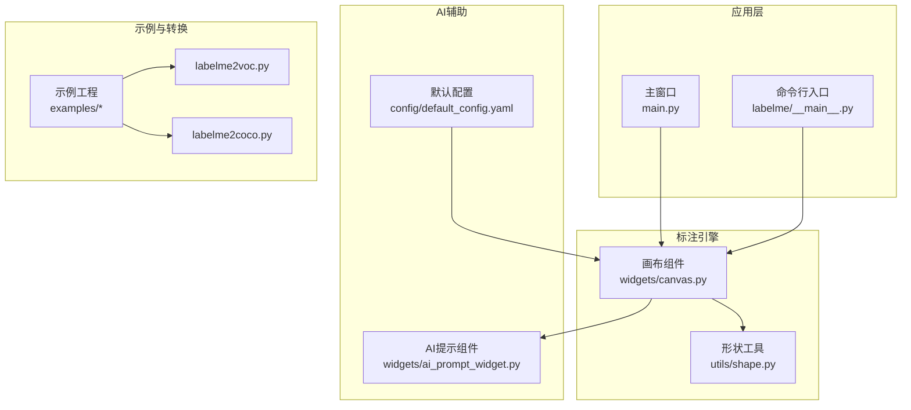
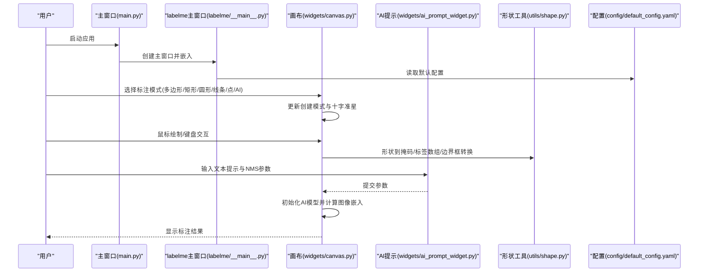
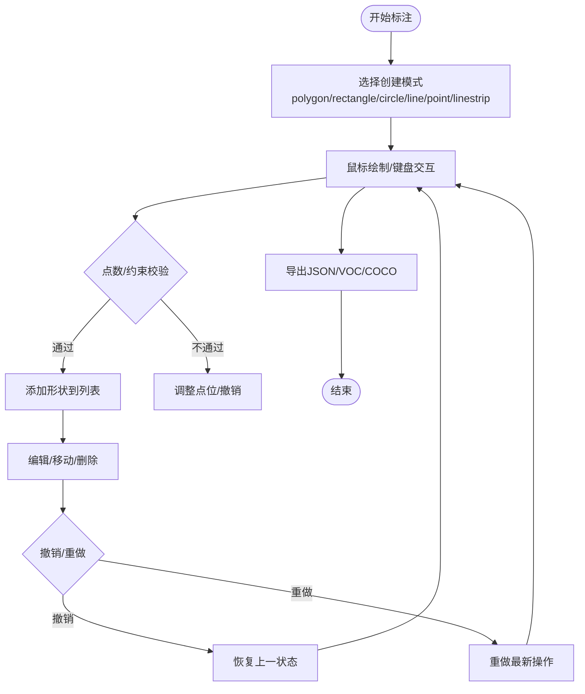
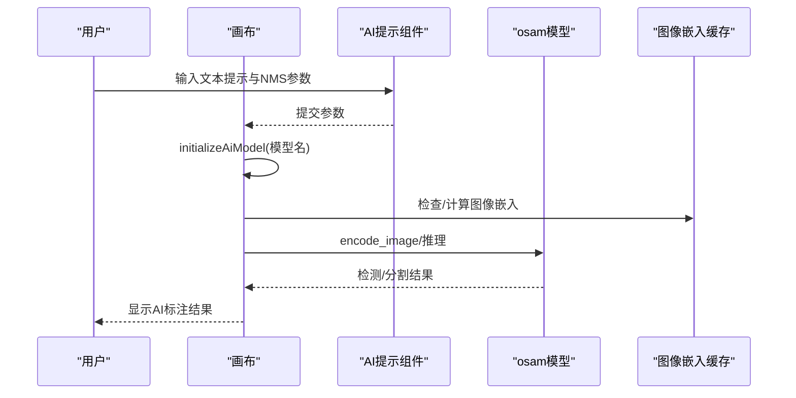
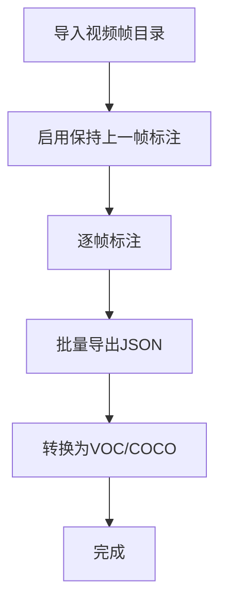
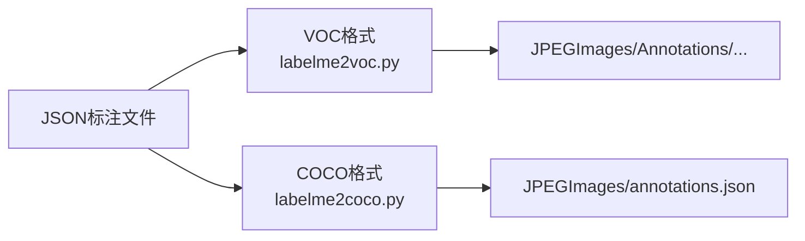
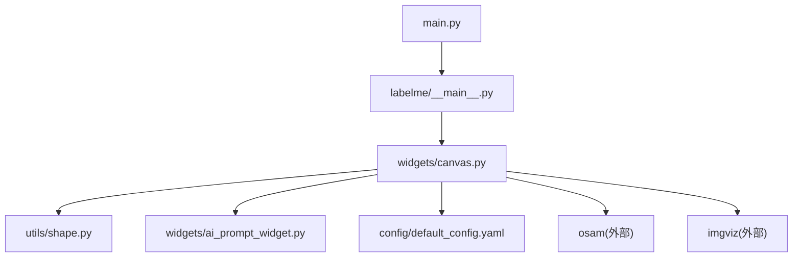

# 核心功能

<cite>
**本文档引用的文件**
- [README.md](file://README.md)
- [main.py](file://main.py)
- [labelme\__main__.py](file://labelme\__main__.py)
- [labelme\config\default_config.yaml](file://labelme\config\default_config.yaml)
- [labelme\widgets\canvas.py](file://labelme\widgets\canvas.py)
- [labelme\widgets\ai_prompt_widget.py](file://labelme\widgets\ai_prompt_widget.py)
- [labelme\utils\shape.py](file://labelme\utils\shape.py)
- [examples\primitives\primitives.json](file://examples\primitives\primitives.json)
- [examples\bbox_detection\README.md](file://examples\bbox_detection\README.md)
- [examples\instance_segmentation\README.md](file://examples\instance_segmentation\README.md)
- [examples\video_annotation\README.md](file://examples\video_annotation\README.md)
</cite>

## 目录
1. [简介](#简介)
2. [项目结构](#项目结构)
3. [核心组件](#核心组件)
4. [架构总览](#架构总览)
5. [详细组件分析](#详细组件分析)
6. [依赖关系分析](#依赖关系分析)
7. [性能考虑](#性能考虑)
8. [故障排查指南](#故障排查指南)
9. [结论](#结论)
10. [附录](#附录)

## 简介
本文件面向labelme的核心功能，系统性阐述图像标注能力（多边形、矩形、圆形、线条、点）、AI辅助标注（YOLO World、SAM、EfficientSAM）、视频标注、批量处理与格式转换（JSON、VOC、COCO），并提供使用示例、最佳实践与学习路径。文档兼顾初学者与高级用户，既给出循序渐进的操作指导，也提供深入的技术细节与可视化说明。

## 项目结构
- 应用入口与UI集成
  - 主程序入口：通过独立UI封装labelme主窗口，统一管理图像标注、模型训练与使用、系统设置等页面。
  - labelme主入口：标准命令行入口，支持配置注入、单实例检测、日志与异常处理。
- 核心标注引擎
  - 画布组件：负责多形态标注（含AI模式）、交互、撤销/重做、图像嵌入缓存。
  - 形状工具：提供形状到掩码、标签数组、边界框等转换能力。
- AI辅助标注
  - AI提示组件：提供文本提示与NMS参数（IoU、分数）输入界面。
  - 模型集成：通过osam接口加载与调用多种AI模型，支持嵌入缓存与智能标注。
- 示例与格式转换
  - 示例工程：primitives、bbox_detection、instance_segmentation、video_annotation。
  - 转换脚本：labelme2voc.py、labelme2coco.py等，支持VOC/COCO导出。

**图表来源**
- [main.py:118-214](file://main.py#L118-L214)
- [labelme\__main__.py:137-341](file://labelme\__main__.py#L137-L341)
- [labelme\widgets\canvas.py:39-105](file://labelme\widgets\canvas.py#L39-L105)
- [labelme\widgets\ai_prompt_widget.py:9-40](file://labelme\widgets\ai_prompt_widget.py#L9-L40)
- [labelme\config\default_config.yaml:41-44](file://labelme\config\default_config.yaml#L41-L44)

**章节来源**
- [README.md:43-51](file://README.md#L43-L51)
- [labelme\__main__.py:137-341](file://labelme\__main__.py#L137-L341)
- [main.py:614-673](file://main.py#L614-L673)

## 核心组件
- 图像标注工具
  - 支持多边形、矩形、圆形、线条、点、线条带等基础几何与拓扑标注；AI模式下支持AI多边形与AI掩码。
  - 通过画布组件的创建模式与形状类型实现，具备撤销/重做、顶点选择、移动编辑等交互能力。
- AI辅助标注
  - 通过osam模型加载与图像嵌入缓存，结合文本提示与NMS参数，实现智能目标检测与分割。
  - 支持YOLO World、SAM、EfficientSAM等模型，具备错误降级与图像预处理能力。
- 视频标注
  - 基于帧序列标注，支持保持上一帧标注（keep-prev）与批量处理。
- 批量处理与格式转换
  - 支持VOC与COCO格式导出，配套示例与转换脚本，便于数据集构建与训练集成。
- 配置与快捷键
  - 默认配置文件提供AI模型默认值、界面停靠窗口、画布行为、快捷键等设置。

**章节来源**
- [README.md:45-50](file://README.md#L45-L50)
- [labelme\widgets\canvas.py:166-180](file://labelme\widgets\canvas.py#L166-L180)
- [labelme\widgets\ai_prompt_widget.py:41-87](file://labelme\widgets\ai_prompt_widget.py#L41-L87)
- [labelme\config\default_config.yaml:41-147](file://labelme\config\default_config.yaml#L41-L147)

## 架构总览
下图展示从UI到标注引擎与AI模型的调用链路，以及配置与示例的作用范围。

**图表来源**
- [main.py:236-287](file://main.py#L236-L287)
- [labelme\__main__.py:294-300](file://labelme\__main__.py#L294-L300)
- [labelme\widgets\canvas.py:206-227](file://labelme\widgets\canvas.py#L206-L227)
- [labelme\widgets\ai_prompt_widget.py:124-138](file://labelme\widgets\ai_prompt_widget.py#L124-L138)
- [labelme\utils\shape.py:41-111](file://labelme\utils\shape.py#L41-L111)

## 详细组件分析

### 图像标注工具（多边形、矩形、圆形、线条、点）
- 形状类型与创建模式
  - 画布组件支持polygon、rectangle、circle、line、point、linestrip、ai_polygon、ai_mask等创建模式。
  - 不同模式下的点数约束与渲染逻辑由形状工具函数实现。
- 交互与编辑
  - 支持鼠标绘制、双击闭合、顶点选择与移动、撤销/重做、缩放与平移。
- 示例数据
  - primitives示例包含多边形、矩形、圆形、线条、点、线条带与掩码等形态，可作为标注模板与验证数据。

**图表来源**
- [labelme\widgets\canvas.py:166-180](file://labelme\widgets\canvas.py#L166-L180)
- [labelme\utils\shape.py:41-111](file://labelme\utils\shape.py#L41-L111)
- [examples\primitives\primitives.json:1-162](file://examples\primitives\primitives.json#L1-L162)

**章节来源**
- [labelme\widgets\canvas.py:39-105](file://labelme\widgets\canvas.py#L39-L105)
- [labelme\utils\shape.py:41-111](file://labelme\utils\shape.py#L41-L111)
- [examples\primitives\primitives.json:1-162](file://examples\primitives\primitives.json#L1-L162)

### AI辅助标注（YOLO World、SAM、EfficientSAM）
- 模型初始化与嵌入缓存
  - 通过osam接口按名称获取模型实例，计算并缓存图像嵌入，避免重复计算。
- 文本提示与NMS参数
  - 提供文本提示输入与NMS参数（分数阈值、IoU阈值）设置，用于过滤与去重。
- 工作流程
  - 用户输入提示词 → 提交参数 → 初始化/切换模型 → 计算图像嵌入 → 智能生成标注 → 结果叠加到画布。

**图表来源**
- [labelme\widgets\canvas.py:206-227](file://labelme\widgets\canvas.py#L206-L227)
- [labelme\widgets\ai_prompt_widget.py:124-138](file://labelme\widgets\ai_prompt_widget.py#L124-L138)
- [labelme\config\default_config.yaml:42-44](file://labelme\config\default_config.yaml#L42-L44)

**章节来源**
- [labelme\widgets\canvas.py:150-227](file://labelme\widgets\canvas.py#L150-L227)
- [labelme\widgets\ai_prompt_widget.py:9-87](file://labelme\widgets\ai_prompt_widget.py#L9-L87)
- [README.md:108-151](file://README.md#L108-L151)

### 视频标注与批量处理
- 视频标注
  - 基于帧序列标注，支持保持上一帧标注（keep-prev），便于跨帧一致性标注。
- 批量处理
  - 支持目录级标注与命令行参数（如--labels、--nodata、--autosave）提升效率。
- 示例
  - video_annotation示例演示了帧序列标注与可视化。

**图表来源**
- [examples\video_annotation\README.md:6-8](file://examples\video_annotation\README.md#L6-L8)
- [labelme\__main__.py:172-223](file://labelme\__main__.py#L172-L223)

**章节来源**
- [examples\video_annotation\README.md:1-30](file://examples\video_annotation\README.md#L1-L30)
- [labelme\__main__.py:137-223](file://labelme\__main__.py#L137-L223)

### 格式转换（JSON、VOC、COCO）
- JSON
  - labelme默认输出格式，包含图像元信息、形状列表与可选图像数据。
- VOC
  - 通过labelme2voc.py将标注转换为VOC格式的数据集结构（JPEGImages、Annotations、可视化等）。
- COCO
  - 通过labelme2coco.py将标注转换为COCO格式（JPEGImages、annotations.json）。
- 示例
  - bbox_detection与instance_segmentation示例展示了转换流程与输出结构。

**图表来源**
- [examples\bbox_detection\README.md:13-21](file://examples\bbox_detection\README.md#L13-L21)
- [examples\instance_segmentation\README.md:42-49](file://examples\instance_segmentation\README.md#L42-L49)

**章节来源**
- [examples\bbox_detection\README.md:1-26](file://examples\bbox_detection\README.md#L1-L26)
- [examples\instance_segmentation\README.md:1-50](file://examples\instance_segmentation\README.md#L1-L50)

## 依赖关系分析
- 组件耦合
  - 主窗口与labelme主窗口强耦合，负责嵌入与信号桥接。
  - 画布组件依赖形状工具与AI提示组件，提供统一的交互入口。
  - 配置文件贯穿UI、画布与AI模块，决定默认行为与快捷键。
- 外部依赖
  - osam：AI模型加载与推理。
  - imgviz：图像预处理与RGB转换。
  - loguru：统一日志管理。

**图表来源**
- [main.py:249](file://main.py#L249)
- [labelme\__main__.py:294-300](file://labelme\__main__.py#L294-L300)
- [labelme\widgets\canvas.py:10-18](file://labelme\widgets\canvas.py#L10-L18)

**章节来源**
- [main.py:236-287](file://main.py#L236-L287)
- [labelme\widgets\canvas.py:10-18](file://labelme\widgets\canvas.py#L10-L18)

## 性能考虑
- AI模型性能
  - 图像嵌入缓存显著降低重复推理成本；建议在多帧/多图场景下复用同一模型与缓存。
  - NMS参数（IoU、分数）直接影响检测质量与性能，需根据任务平衡。
- 交互性能
  - 画布的撤销/重做采用状态备份，注意合理设置备份数量（num_backups）以平衡内存占用。
- 导出性能
  - 大规模批量导出时，优先使用命令行参数（如--nodata）减少JSON体积与I/O开销。

## 故障排查指南
- 单实例冲突
  - 若提示“已有实例运行”，检查是否已有labelme进程；系统会自动清理僵尸进程共享内存。
- AI功能异常
  - 缺失osam模块时，AI功能将降级；确保安装osam并验证版本。
  - 图像尺寸过小或格式异常时，系统内置预处理会自动处理，必要时调整输入图像。
- 配置问题
  - 默认配置文件位于用户目录，可通过命令行参数覆盖；确保标签列表与验证规则一致。

**章节来源**
- [labelme\__main__.py:283-289](file://labelme\__main__.py#L283-L289)
- [README.md:108-151](file://README.md#L108-L151)
- [labelme\config\default_config.yaml:1-147](file://labelme\config\default_config.yaml#L1-L147)

## 结论
labelme以labelme主窗口为核心，通过画布组件提供丰富的标注工具与AI辅助能力，配合配置与示例工程，形成从标注到数据集导出的完整闭环。对于初学者，建议从primitives示例入手，逐步掌握基础工具与AI提示；对于高级用户，可利用配置项、批量参数与格式转换脚本，构建高效的数据生产流水线。

## 附录

### 使用示例与最佳实践
- 基础标注
  - 使用命令行打开图像并标注，结合--labels、--nodata、--autosave提升效率。
- AI辅助标注
  - 输入文本提示（如“person,car,bicycle”），设置合理的NMS参数，先在小图验证效果再扩大应用。
- 视频标注
  - 启用--keep-prev保持跨帧一致性；分批导出JSON，避免单文件过大。
- 格式转换
  - 使用labelme2voc.py与labelme2coco.py分别生成VOC/COCO数据集；注意标签文件与类别映射。

**章节来源**
- [README.md:197-233](file://README.md#L197-L233)
- [examples\bbox_detection\README.md:6-21](file://examples\bbox_detection\README.md#L6-L21)
- [examples\instance_segmentation\README.md:6-49](file://examples\instance_segmentation\README.md#L6-L49)
- [examples\video_annotation\README.md:6-29](file://examples\video_annotation\README.md#L6-L29)