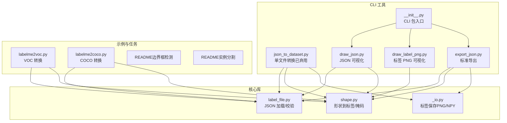
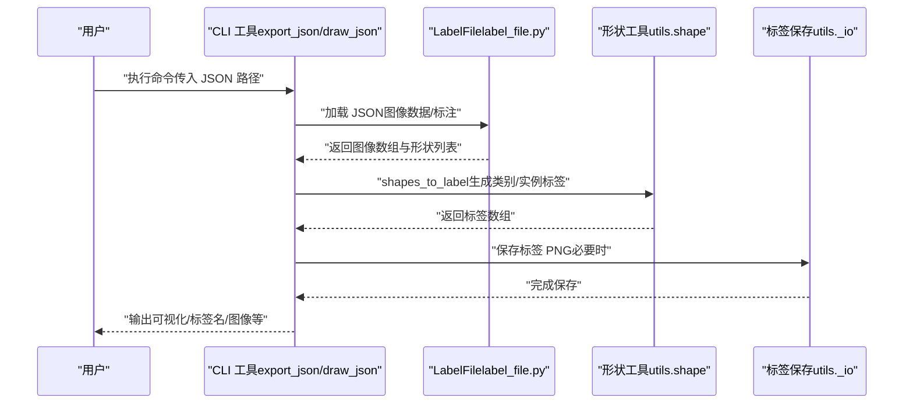
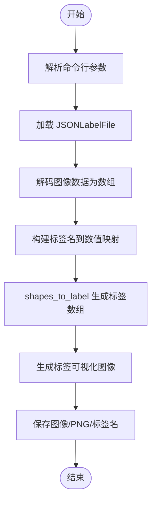
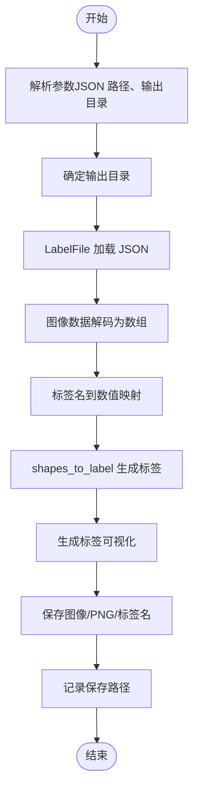
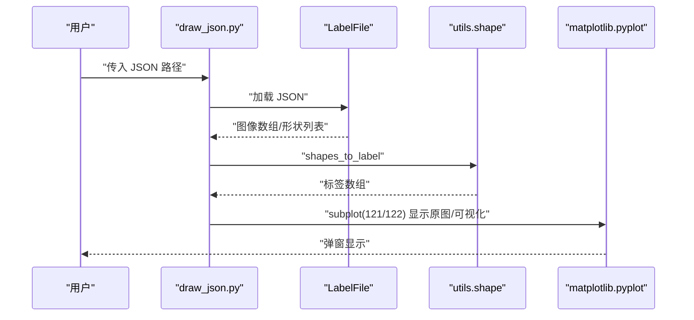
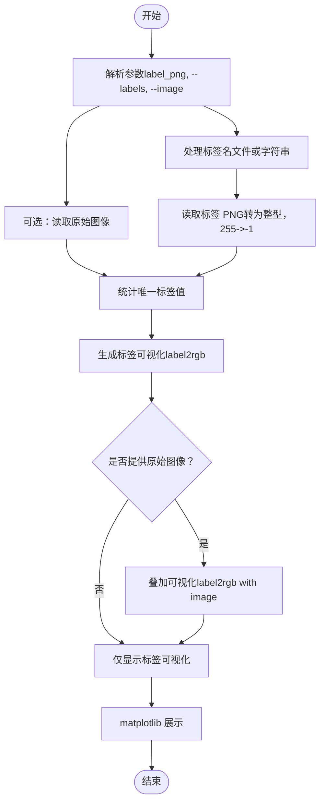
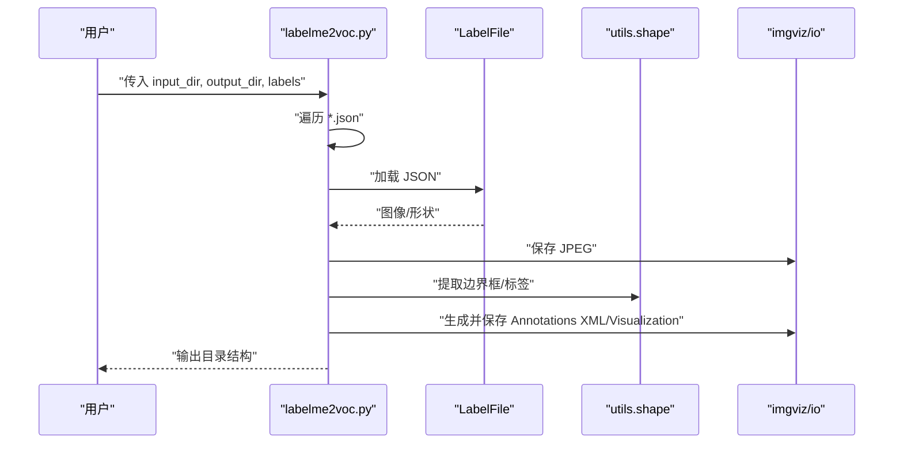
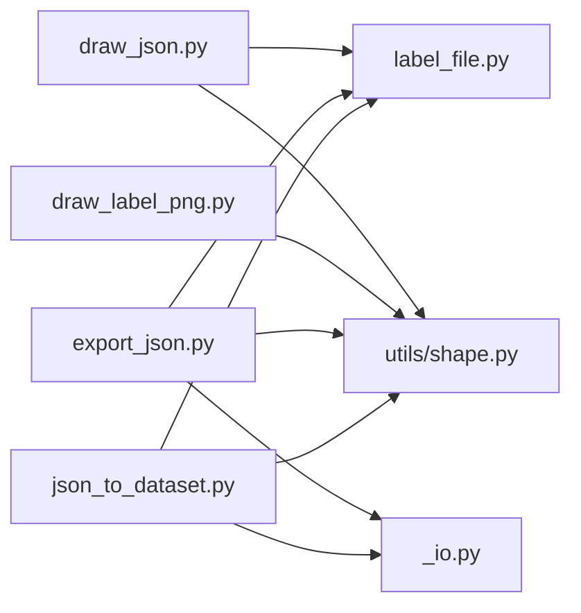

# 命令行转换工具

<cite>
**本文档引用的文件**
- [json_to_dataset.py](file://labelme/labelme/cli/json_to_dataset.py)
- [export_json.py](file://labelme/labelme/cli/export_json.py)
- [draw_json.py](file://labelme/labelme/cli/draw_json.py)
- [draw_label_png.py](file://labelme/labelme/cli/draw_label_png.py)
- [__init__.py](file://labelme/labelme/cli/__init__.py)
- [label_file.py](file://labelme/labelme/label_file.py)
- [_io.py](file://labelme/labelme/utils/_io.py)
- [shape.py](file://labelme/labelme/utils/shape.py)
- [labelme2voc.py](file://examples/bbox_detection/labelme2voc.py)
- [labelme2coco.py](file://examples/instance_segmentation/labelme2coco.py)
- [README.md（边界框检测示例）](file://examples/bbox_detection/README.md)
- [README.md（实例分割示例）](file://examples/instance_segmentation/README.md)
- [default_config.yaml](file://labelme/labelme/config/default_config.yaml)
</cite>

## 目录
1. [简介](#简介)
2. [项目结构](#项目结构)
3. [核心组件](#核心组件)
4. [架构总览](#架构总览)
5. [详细组件分析](#详细组件分析)
6. [依赖关系分析](#依赖关系分析)
7. [性能考虑](#性能考虑)
8. [故障排除指南](#故障排除指南)
9. [结论](#结论)
10. [附录](#附录)

## 简介
本文件面向命令行转换工具的使用者与维护者，系统性梳理 labelme 的 CLI 工具集，重点覆盖以下方面：
- 批量转换：如何将标注 JSON 批量转换为数据集格式（如 VOC/COCO），以及单文件转换工具的演进与替代方案
- 数据导出：JSON 到标准数据集格式的导出流程、字段处理与验证
- 可视化生成：基于 JSON 或标签 PNG 的可视化展示、样式定制与输出控制
- 参数配置：各工具的命令行参数、输出格式选择与批处理选项
- 组合使用：多工具协同工作流程与自动化脚本编写建议
- 性能优化：批量处理策略、错误处理与日志记录最佳实践

## 项目结构
labelme 的 CLI 工具位于 labelme/labelme/cli 目录，围绕“标注 JSON”与“标签图像”的输入，提供转换、导出与可视化的命令行能力；同时 examples 下提供面向具体任务（边界框检测、实例分割）的完整转换脚本。

图表来源
- [json_to_dataset.py:1-101](file://labelme/labelme/cli/json_to_dataset.py#L1-L101)
- [export_json.py:1-90](file://labelme/labelme/cli/export_json.py#L1-L90)
- [draw_json.py:1-68](file://labelme/labelme/cli/draw_json.py#L1-L68)
- [draw_label_png.py:1-108](file://labelme/labelme/cli/draw_label_png.py#L1-L108)
- [__init__.py:1-13](file://labelme/labelme/cli/__init__.py#L1-L13)
- [label_file.py:1-200](file://labelme/labelme/label_file.py#L1-L200)
- [_io.py:1-27](file://labelme/labelme/utils/_io.py#L1-L27)
- [shape.py:1-200](file://labelme/labelme/utils/shape.py#L1-L200)
- [labelme2voc.py:1-147](file://examples/bbox_detection/labelme2voc.py#L1-L147)
- [labelme2coco.py:1-204](file://examples/instance_segmentation/labelme2coco.py#L1-L204)

章节来源
- [__init__.py:1-13](file://labelme/labelme/cli/__init__.py#L1-L13)

## 核心组件
- json_to_dataset.py：单文件 JSON 转换为图像、标签 PNG、可视化 PNG 与标签名文件，当前已弃用，推荐使用 export_json
- export_json.py：标准导出流程，与 json_to_dataset 功能相近但更符合当前推荐路径
- draw_json.py：读取 JSON 并显示原始图像与标签可视化
- draw_label_png.py：读取标签 PNG 与可选原始图像，生成叠加可视化并打印标签统计
- label_file.py：负责 JSON 的加载、图像数据解码与尺寸校验
- utils.shape：形状到标签/掩码的核心转换逻辑
- utils._io：标签图像保存（PNG/NPY）与格式约束

章节来源
- [json_to_dataset.py:1-101](file://labelme/labelme/cli/json_to_dataset.py#L1-L101)
- [export_json.py:1-90](file://labelme/labelme/cli/export_json.py#L1-L90)
- [draw_json.py:1-68](file://labelme/labelme/cli/draw_json.py#L1-L68)
- [draw_label_png.py:1-108](file://labelme/labelme/cli/draw_label_png.py#L1-L108)
- [label_file.py:1-200](file://labelme/labelme/label_file.py#L1-L200)
- [shape.py:1-200](file://labelme/labelme/utils/shape.py#L1-L200)
- [_io.py:1-27](file://labelme/labelme/utils/_io.py#L1-L27)

## 架构总览
以下序列图展示了“从 JSON 到标签 PNG”的典型转换链路，以及可视化输出与标签保存的流程。

图表来源
- [export_json.py:1-90](file://labelme/labelme/cli/export_json.py#L1-L90)
- [label_file.py:103-193](file://labelme/labelme/label_file.py#L103-L193)
- [shape.py:113-167](file://labelme/labelme/utils/shape.py#L113-L167)
- [_io.py:10-27](file://labelme/labelme/utils/_io.py#L10-L27)

## 详细组件分析

### json_to_dataset 工具（已弃用）
- 功能概述：将单个 JSON 标注文件转换为一组输出（原始图像、标签 PNG、可视化 PNG、标签名文件）
- 关键行为：
  - 读取 JSON 并解码图像数据
  - 构建标签名到数值的映射
  - 将形状转换为标签数组
  - 生成标签可视化图像
  - 保存 PNG 与标签名文件
- 重要提示：该脚本已弃用，建议改用 export_json

图表来源
- [json_to_dataset.py:19-96](file://labelme/labelme/cli/json_to_dataset.py#L19-L96)

章节来源
- [json_to_dataset.py:1-101](file://labelme/labelme/cli/json_to_dataset.py#L1-L101)

### export_json 工具（推荐）
- 功能概述：与 json_to_dataset 类似，但作为当前推荐的导出工具，输出标准数据集格式所需的文件
- 关键行为：参数解析、输出目录确定、JSON 加载、图像解码、标签映射与生成、可视化生成与保存、标签名写入

图表来源
- [export_json.py:19-85](file://labelme/labelme/cli/export_json.py#L19-L85)

章节来源
- [export_json.py:1-90](file://labelme/labelme/cli/export_json.py#L1-L90)

### draw_json 工具（JSON 可视化）
- 功能概述：读取 JSON，生成并显示原始图像与标签可视化图像
- 关键行为：参数解析、JSON 加载、图像解码、标签映射、标签可视化、matplotlib 展示

图表来源
- [draw_json.py:16-63](file://labelme/labelme/cli/draw_json.py#L16-L63)

章节来源
- [draw_json.py:1-68](file://labelme/labelme/cli/draw_json.py#L1-L68)

### draw_label_png 工具（标签 PNG 可视化）
- 功能概述：读取标签 PNG 与可选原始图像，生成标签可视化与叠加可视化，并打印标签统计
- 关键行为：参数解析（标签 PNG、标签列表、原始图像）、标签名处理（文件或逗号分隔）、读取标签与图像、统计与可视化、matplotlib 展示

图表来源
- [draw_label_png.py:14-103](file://labelme/labelme/cli/draw_label_png.py#L14-L103)

章节来源
- [draw_label_png.py:1-108](file://labelme/labelme/cli/draw_label_png.py#L1-L108)

### 示例与批量转换（VOC/COCO）
- VOC 转换：labelme2voc.py 展示了从 JSON 到 VOC 格式的批量转换，包括边界框提取、XML 生成与可视化
- COCO 转换：labelme2coco.py 展示了从 JSON 到 COCO 格式的批量转换，包括实例级分割、RLE 编码与可视化

图表来源
- [labelme2voc.py:23-142](file://examples/bbox_detection/labelme2voc.py#L23-L142)

章节来源
- [labelme2voc.py:1-147](file://examples/bbox_detection/labelme2voc.py#L1-L147)
- [labelme2coco.py:25-199](file://examples/instance_segmentation/labelme2coco.py#L25-L199)

## 依赖关系分析
- CLI 工具依赖 label_file 进行 JSON 加载与校验，依赖 utils.shape 进行形状到标签的转换，依赖 utils._io 进行标签 PNG 保存
- CLI 包入口统一导出各工具模块，便于统一调用
- 示例脚本进一步演示了批量转换到 VOC/COCO 的完整流程

图表来源
- [draw_json.py:1-68](file://labelme/labelme/cli/draw_json.py#L1-L68)
- [draw_label_png.py:1-108](file://labelme/labelme/cli/draw_label_png.py#L1-L108)
- [export_json.py:1-90](file://labelme/labelme/cli/export_json.py#L1-L90)
- [json_to_dataset.py:1-101](file://labelme/labelme/cli/json_to_dataset.py#L1-L101)
- [label_file.py:1-200](file://labelme/labelme/label_file.py#L1-L200)
- [shape.py:1-200](file://labelme/labelme/utils/shape.py#L1-L200)
- [_io.py:1-27](file://labelme/labelme/utils/_io.py#L1-L27)

章节来源
- [__init__.py:1-13](file://labelme/labelme/cli/__init__.py#L1-L13)

## 性能考虑
- 批量处理策略
  - 使用示例脚本（如 labelme2voc.py、labelme2coco.py）进行批量转换，避免逐个文件手动调用
  - 对于大规模数据集，建议先进行标签名规范化与去重，减少后续处理成本
- I/O 与内存
  - 图像解码与标签生成可能占用较多内存，建议分批处理或在高内存环境中运行
  - 标签 PNG 保存前检查数值范围，避免不兼容格式导致的额外转换开销
- 可视化渲染
  - matplotlib 展示适合交互验证，批量场景建议直接保存图像以减少 GUI 开销
- 日志与错误处理
  - CLI 工具普遍使用日志记录关键信息与错误，建议结合默认配置中的日志级别进行统一管理

## 故障排除指南
- JSON 加载失败
  - 现象：无法打开 JSON 或图像数据解码异常
  - 处理：检查 JSON 结构完整性与图像路径/编码一致性；参考 LabelFile 的加载与校验逻辑
- 标签 PNG 保存失败
  - 现象：无法保存为 PNG（数值范围不兼容）
  - 处理：根据工具提示改用 .npy 格式，或调整标签值范围
- 可视化显示异常
  - 现象：标签可视化缺失或叠加效果异常
  - 处理：确认标签名列表与标签值对应关系；检查标签 PNG 中特殊值（如 255->-1）的处理
- 批量转换输出不一致
  - 现象：VOC/COCO 输出缺少某些对象或可视化不正确
  - 处理：核对标签名文件与类别映射；确保形状类型与边界框提取逻辑一致

章节来源
- [label_file.py:103-193](file://labelme/labelme/label_file.py#L103-L193)
- [_io.py:10-27](file://labelme/labelme/utils/_io.py#L10-L27)
- [draw_label_png.py:52-71](file://labelme/labelme/cli/draw_label_png.py#L52-L71)

## 结论
- json_to_dataset 已弃用，推荐使用 export_json 进行单文件导出
- draw_json 与 draw_label_png 分别面向 JSON 与标签 PNG 的可视化，满足不同阶段的验证需求
- 示例脚本（labelme2voc.py、labelme2coco.py）提供了完整的批量转换范式
- 通过合理组织命令行参数、日志记录与批处理策略，可实现高效稳定的转换与可视化流程

## 附录

### 命令行工具参数速查
- export_json
  - 必需：json_file
  - 可选：-o/--out 输出目录
- draw_json
  - 必需：json_file
- draw_label_png
  - 必需：label_png
  - 可选：--labels 标签名列表（文件或逗号分隔）、--image 原始图像
- labelme2voc.py / labelme2coco.py
  - 必需：input_dir、output_dir、--labels
  - 可选：--noviz 不生成可视化

章节来源
- [export_json.py:26-30](file://labelme/labelme/cli/export_json.py#L26-L30)
- [draw_json.py:22-25](file://labelme/labelme/cli/draw_json.py#L22-L25)
- [draw_label_png.py:21-32](file://labelme/labelme/cli/draw_label_png.py#L21-L32)
- [labelme2voc.py:23-31](file://examples/bbox_detection/labelme2voc.py#L23-L31)
- [labelme2coco.py:25-33](file://examples/instance_segmentation/labelme2coco.py#L25-L33)

### 组合使用示例与自动化脚本思路
- 单文件导出与验证
  - 步骤：export_json 输入.json -> 检查输出目录（img.png、label.png、label_viz.png、label_names.txt）-> draw_label_png label.png --image img.png
- 批量转换到 VOC/COCO
  - 步骤：准备 labels.txt -> 运行 labelme2voc.py 或 labelme2coco.py -> 核对输出目录结构与可视化
- 自动化脚本建议
  - 使用 shell/python 脚本循环遍历 JSON 目录，按上述步骤串联 CLI 工具
  - 设置统一的日志级别与输出目录命名规范，便于追踪与回溯

章节来源
- [README.md（边界框检测示例）:13-21](file://examples/bbox_detection/README.md#L13-L21)
- [README.md（实例分割示例）:42-49](file://examples/instance_segmentation/README.md#L42-L49)
- [default_config.yaml](file://labelme/labelme/config/default_config.yaml#L12)