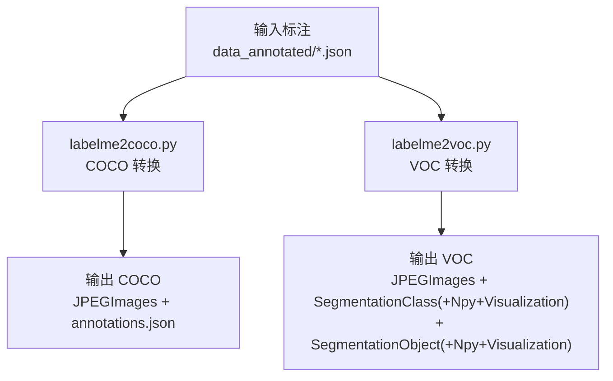
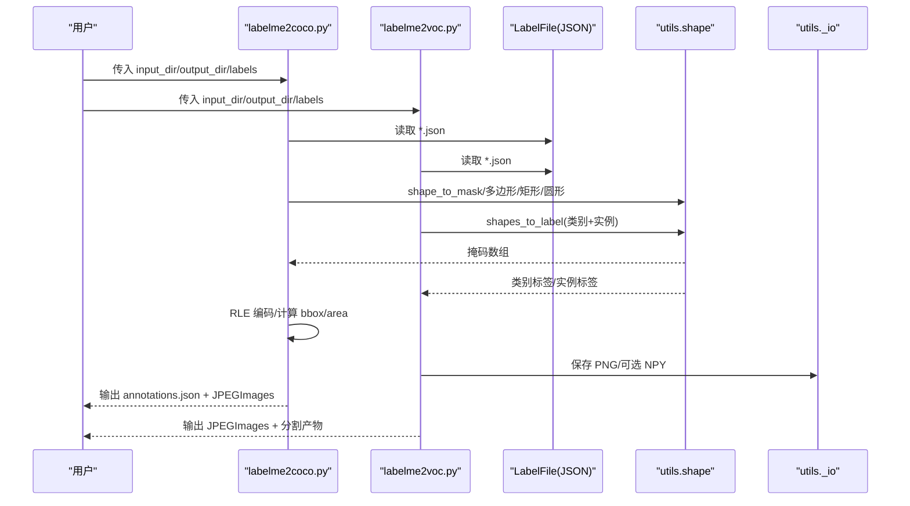
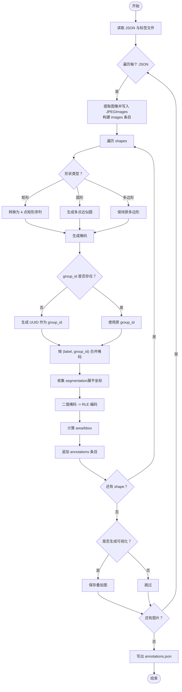
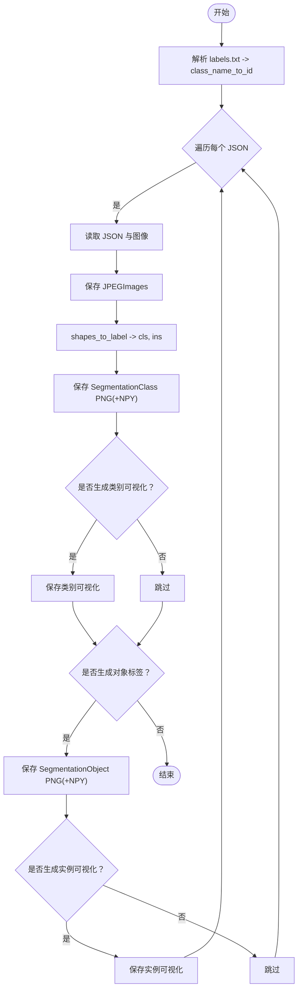
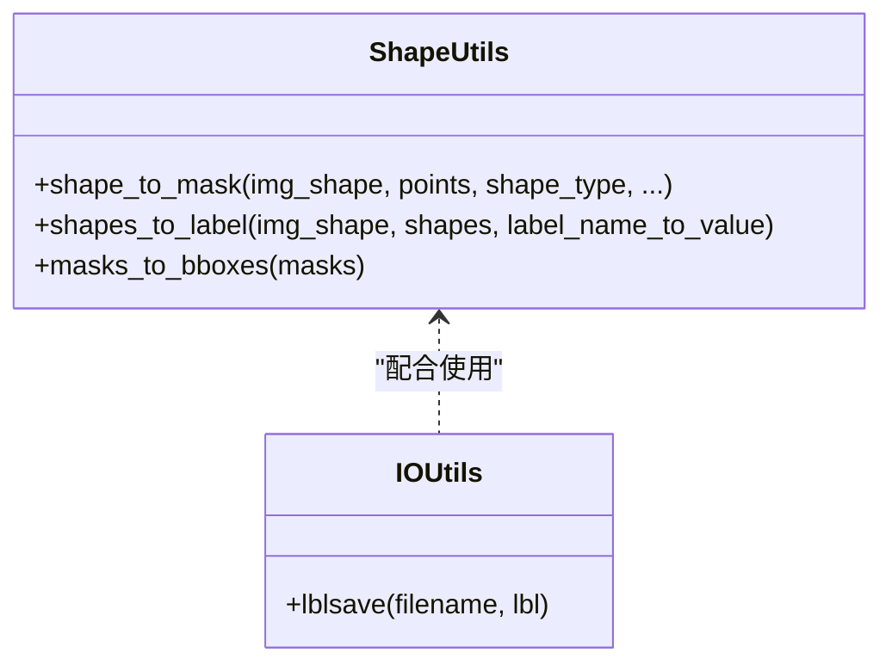
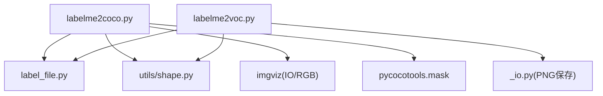

# 实例分割格式转换

<cite>
**本文引用的文件**
- [labelme2coco.py](file://labelme/examples/instance_segmentation/labelme2coco.py)
- [labelme2voc.py](file://labelme/examples/instance_segmentation/labelme2voc.py)
- [README.md](file://labelme/examples/instance_segmentation/README.md)
- [2011_000003.json](file://labelme/examples/instance_segmentation/data_annotated/2011_000003.json)
- [labels.txt](file://labelme/examples/instance_segmentation/labels.txt)
- [annotations.json](file://labelme/examples/instance_segmentation/data_dataset_coco/annotations.json)
- [class_names.txt](file://labelme/examples/instance_segmentation/data_dataset_voc/class_names.txt)
- [shape.py](file://labelme/labelme/utils/shape.py)
- [_io.py](file://labelme/labelme/utils/_io.py)
- [label_file.py](file://labelme/labelme/label_file.py)
</cite>

## 目录
1. [简介](#简介)
2. [项目结构](#项目结构)
3. [核心组件](#核心组件)
4. [架构总览](#架构总览)
5. [详细组件分析](#详细组件分析)
6. [依赖关系分析](#依赖关系分析)
7. [性能考量](#性能考量)
8. [故障排查指南](#故障排查指南)
9. [结论](#结论)
10. [附录](#附录)

## 简介
本文件面向“实例分割格式转换”功能，系统性阐述从 labelme JSON 格式到 COCO 与 VOC 格式的转换机制，重点覆盖：
- 多边形标注的复杂转换逻辑与边界处理
- COCO 数据结构、注释组织与元数据管理
- 实例分割特有 polygon 坐标处理、segmentation 字段生成与 RLE 编码转换
- 批量转换的实现策略、内存优化与性能考虑
- 完整转换示例（数据集组织与验证方法）
- 多边形处理的边界情况与错误处理机制

## 项目结构
实例分割示例位于 examples/instance_segmentation，包含：
- 输入标注：data_annotated/*.json（labelme 格式）
- 转换脚本：labelme2coco.py、labelme2voc.py
- 输出数据：COCO 的 annotations.json 与 VOC 的多目录产物
- 标签定义：labels.txt
- 示例 README 说明使用方式

图示来源
- [README.md:12-49](file://labelme/examples/instance_segmentation/README.md#L12-L49)
- [labelme2coco.py:25-204](file://labelme/examples/instance_segmentation/labelme2coco.py#L25-L204)
- [labelme2voc.py:17-157](file://labelme/examples/instance_segmentation/labelme2voc.py#L17-L157)

章节来源
- [README.md:1-50](file://labelme/examples/instance_segmentation/README.md#L1-L50)

## 核心组件
- COCO 转换器（labelme2coco.py）
  - 读取 labelme JSON，构建 COCO 结构（info、licenses、images、annotations、categories）
  - 将多边形/矩形/圆形等形状转换为掩码，合并同组实例，生成 RLE 并计算 bbox 与 area
  - 写出 annotations.json 与可视化结果
- VOC 转换器（labelme2voc.py）
  - 读取 labelme JSON，生成类别标签与实例标签（PNG 与可选 NPY）
  - 可选生成对象级语义分割（SegmentationObject）
  - 保存 class_names.txt 与 JPEGImages
- 工具函数（labelme/utils）
  - 形状到掩码：支持 polygon/rectangle/circle/line/linestrip/point
  - 多形状到标签：生成类别标签与实例标签，按 group_id 合并实例
  - 掩码保存：PNG 格式保存（调色板）

章节来源
- [labelme2coco.py:25-204](file://labelme/examples/instance_segmentation/labelme2coco.py#L25-L204)
- [labelme2voc.py:17-157](file://labelme/examples/instance_segmentation/labelme2voc.py#L17-L157)
- [shape.py:41-167](file://labelme/labelme/utils/shape.py#L41-L167)
- [_io.py:10-27](file://labelme/labelme/utils/_io.py#L10-L27)

## 架构总览
下图展示从 labelme JSON 到 COCO/VOC 的整体流程与关键模块交互。

图示来源
- [labelme2coco.py:95-175](file://labelme/examples/instance_segmentation/labelme2coco.py#L95-L175)
- [labelme2voc.py:83-152](file://labelme/examples/instance_segmentation/labelme2voc.py#L83-L152)
- [label_file.py:103-193](file://labelme/labelme/label_file.py#L103-L193)
- [shape.py:41-167](file://labelme/labelme/utils/shape.py#L41-L167)
- [_io.py:10-27](file://labelme/labelme/utils/_io.py#L10-L27)

## 详细组件分析

### COCO 转换器（labelme2coco.py）
- 输入输出
  - 输入：labelme JSON 目录、labels 文件、输出目录
  - 输出：JPEGImages（原图）、annotations.json（COCO 格式）
- 关键流程
  - 解析标签文件，构建 categories 映射
  - 遍历每个 JSON：读取图像数据、写入 JPEGImages；构建 images 条目
  - 对每个 shape：
    - 处理矩形/圆形/多边形，生成掩码
    - 使用 group_id 合并同一实例的多片段
    - 生成 segmentation（多段多边形坐标序列）
    - RLE 编码（pycocotools.mask.encode），计算 bbox 与 area
  - 写出 annotations.json
- 多边形与 RLE
  - 多边形 points 展平后作为 segmentation 的一个环
  - RLE 由二值掩码经 pycocotools.mask.encode 得到，area 与 bbox 由 pycocotools.mask.area/toBbox 计算
- 可视化
  - 可选生成 Visualization 目录下的叠加图（颜色化实例掩码）

图示来源
- [labelme2coco.py:95-199](file://labelme/examples/instance_segmentation/labelme2coco.py#L95-L199)

章节来源
- [labelme2coco.py:25-204](file://labelme/examples/instance_segmentation/labelme2coco.py#L25-L204)

### VOC 转换器（labelme2voc.py）
- 输入输出
  - 输入：labelme JSON 目录、labels 文件、输出目录
  - 输出：JPEGImages、SegmentationClass（类别标签 PNG/NPY/可视化可选）、SegmentationObject（实例标签 PNG/NPY/可视化可选）
- 关键流程
  - 解析标签文件，构建 class_name_to_id 映射（忽略 __ignore__，背景为 0）
  - 对每个 JSON：
    - 读取图像并保存 JPEGImages
    - 调用 utils.shapes_to_label 生成类别标签与实例标签
    - 保存 PNG（调色板），可选保存 NPY
    - 可选生成实例标签可视化
- 实例合并
  - 通过 group_id 合并同一实例的不同片段，得到连续实例 ID 序列

图示来源
- [labelme2voc.py:83-152](file://labelme/examples/instance_segmentation/labelme2voc.py#L83-L152)
- [shape.py:113-167](file://labelme/labelme/utils/shape.py#L113-L167)

章节来源
- [labelme2voc.py:17-157](file://labelme/examples/instance_segmentation/labelme2voc.py#L17-L157)

### 多边形与形状处理（工具函数）
- 形状到掩码（shape_to_mask）
  - 支持 polygon/rectangle/circle/line/linestrip/point
  - 多边形：至少 3 个点；圆形：2 个点（圆心与圆周一点）；矩形：2 个对角点
  - 返回布尔型掩码
- 多形状到标签（shapes_to_label）
  - 生成类别标签与实例标签
  - group_id 为空时自动生成 UUID，保证同一实例跨片段合并
- 掩码保存（lblsave）
  - 以 PNG 保存类别标签（带调色板），范围需满足约定

图示来源
- [shape.py:41-167](file://labelme/labelme/utils/shape.py#L41-L167)
- [_io.py:10-27](file://labelme/labelme/utils/_io.py#L10-L27)

章节来源
- [shape.py:41-167](file://labelme/labelme/utils/shape.py#L41-L167)
- [_io.py:10-27](file://labelme/labelme/utils/_io.py#L10-L27)

### COCO 数据结构与注释组织
- 结构要点
  - info、licenses：元数据
  - images：每张图片的文件名、尺寸、id 等
  - annotations：每条注释包含 segmentation、area、iscrowd、image_id、bbox、category_id、id
  - categories：类别映射（id 与 name）
- 注释组织
  - 每个实例（按 label + group_id）对应一条 annotation
  - segmentation 为多段多边形坐标序列（每段为展平的 [x,y] 列表）
  - iscrowd 默认 0；当多边形重叠或需要紧凑表示时可设为 1
- 元数据管理
  - 年份、创建时间等由转换器注入
  - 类别 id 与 name 由 labels.txt 生成

章节来源
- [labelme2coco.py:46-72](file://labelme/examples/instance_segmentation/labelme2coco.py#L46-L72)
- [annotations.json:1-1](file://labelme/examples/instance_segmentation/data_dataset_coco/annotations.json#L1-L1)

### 多边形处理的边界情况与错误处理
- 多边形点数校验
  - 多边形至少 3 个点；圆形/矩形/线段等需满足相应点数约束
- group_id 合并
  - 若 shape 未提供 group_id，则自动生成 UUID，确保同一实例跨片段合并
- RLE 编码前置条件
  - 掩码需为 Fortran 顺序的 uint8 类型，否则 pycocotools.mask.encode 会报错
- 标签范围与保存
  - 类别标签保存为 PNG 需满足范围约定；超出范围建议保存为 NPY

章节来源
- [shape.py:80-110](file://labelme/labelme/utils/shape.py#L80-L110)
- [labelme2coco.py:160-161](file://labelme/examples/instance_segmentation/labelme2coco.py#L160-L161)
- [_io.py:15-26](file://labelme/labelme/utils/_io.py#L15-L26)

## 依赖关系分析
- 转换脚本依赖
  - labelme.LabelFile：读取 JSON 与图像数据
  - labelme.utils.shape：形状到掩码、多形状到标签
  - imgviz：图像保存与可视化
  - pycocotools.mask：RLE 编码、面积与 bbox 计算
- 外部依赖
  - numpy、PIL、argparse、glob、os、json、uuid、datetime

图示来源
- [labelme2coco.py:18-22](file://labelme/examples/instance_segmentation/labelme2coco.py#L18-L22)
- [labelme2voc.py:11-14](file://labelme/examples/instance_segmentation/labelme2voc.py#L11-L14)
- [label_file.py:10-11](file://labelme/labelme/label_file.py#L10-L11)
- [shape.py:14-17](file://labelme/labelme/utils/shape.py#L14-L17)
- [_io.py:11](file://labelme/labelme/utils/_io.py#L11)

章节来源
- [labelme2coco.py:18-22](file://labelme/examples/instance_segmentation/labelme2coco.py#L18-L22)
- [labelme2voc.py:11-14](file://labelme/examples/instance_segmentation/labelme2voc.py#L11-L14)

## 性能考量
- 内存优化
  - 逐文件处理，避免一次性加载全部 JSON 与图像
  - 掩码为布尔型，RLE 编码前转换为 uint8 并 Fortran 顺序，减少内存拷贝
  - 可选关闭可视化以降低 I/O 与绘图开销
- 批量策略
  - glob 遍历 input_dir 下的 *.json，顺序处理
  - 每个 JSON 内部按 shape 顺序生成掩码并合并实例
- 复杂度分析
  - 单图复杂度近似 O(N_masks × H × W)，N_masks 为实例数量
  - RLE 编码与 bbox/area 计算为 O(H × W)

## 故障排查指南
- 未安装 pycocotools
  - 现象：运行时报导入错误
  - 处理：按照提示安装 pycocotools
- 输出目录已存在
  - 现象：程序退出
  - 处理：清理或更换输出目录
- 标签文件格式问题
  - 现象：类别映射异常或忽略 __ignore__
  - 处理：确保 labels.txt 第一行 __ignore__，第二行 _background_
- 图像尺寸不一致
  - 现象：日志提示尺寸不匹配
  - 处理：以实际图像尺寸为准
- PNG 保存失败
  - 现象：类别标签无法保存为 PNG
  - 处理：改用 NPY 或调整标签范围

章节来源
- [labelme2coco.py:18-22](file://labelme/examples/instance_segmentation/labelme2coco.py#L18-L22)
- [labelme2coco.py:35-42](file://labelme/examples/instance_segmentation/labelme2coco.py#L35-L42)
- [label_file.py:194-223](file://labelme/labelme/label_file.py#L194-L223)
- [_io.py:23-26](file://labelme/labelme/utils/_io.py#L23-L26)

## 结论
本方案通过 labelme JSON 到 COCO/VOC 的双向转换，完整保留了实例分割所需的多边形几何信息与实例语义。COCO 路径强调 RLE 编码与注释标准化，适合目标检测与实例分割训练；VOC 路径强调类别与实例标签的像素级表达，便于传统语义/实例分割任务。通过 group_id 合并与多形状到掩码的工具函数，系统有效处理了多边形、矩形、圆形等复杂标注形态，并提供了完善的边界处理与错误提示。

## 附录

### 使用示例（基于仓库示例）
- COCO 转换
  - 步骤：准备 data_annotated 与 labels.txt，执行转换脚本，生成 data_dataset_coco/JPEGImages 与 annotations.json
  - 验证：打开 annotations.json 查看 images/annotations/categories 字段
- VOC 转换
  - 步骤：准备 data_annotated 与 labels.txt，执行转换脚本，生成 JPEGImages 与 SegmentationClass/SegmentationObject 等目录
  - 验证：查看 class_names.txt 与若干 PNG/可视化图

章节来源
- [README.md:12-49](file://labelme/examples/instance_segmentation/README.md#L12-L49)
- [labels.txt:1-22](file://labelme/examples/instance_segmentation/labels.txt#L1-L22)
- [class_names.txt:1-21](file://labelme/examples/instance_segmentation/data_dataset_voc/class_names.txt#L1-L21)
- [annotations.json:1-1](file://labelme/examples/instance_segmentation/data_dataset_coco/annotations.json#L1-L1)