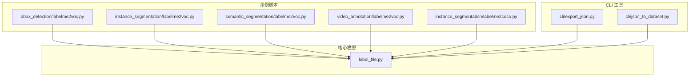
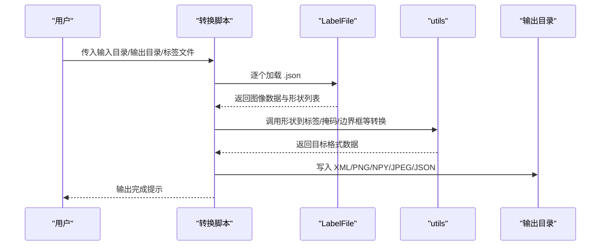
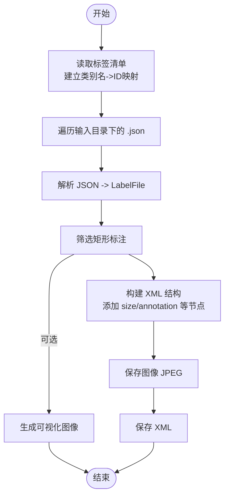
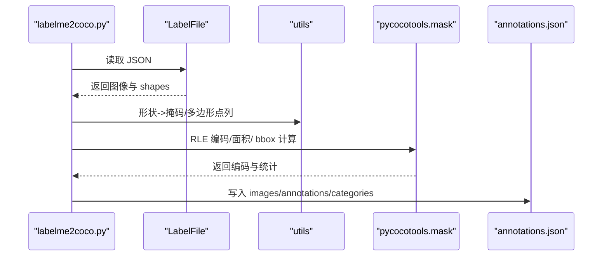
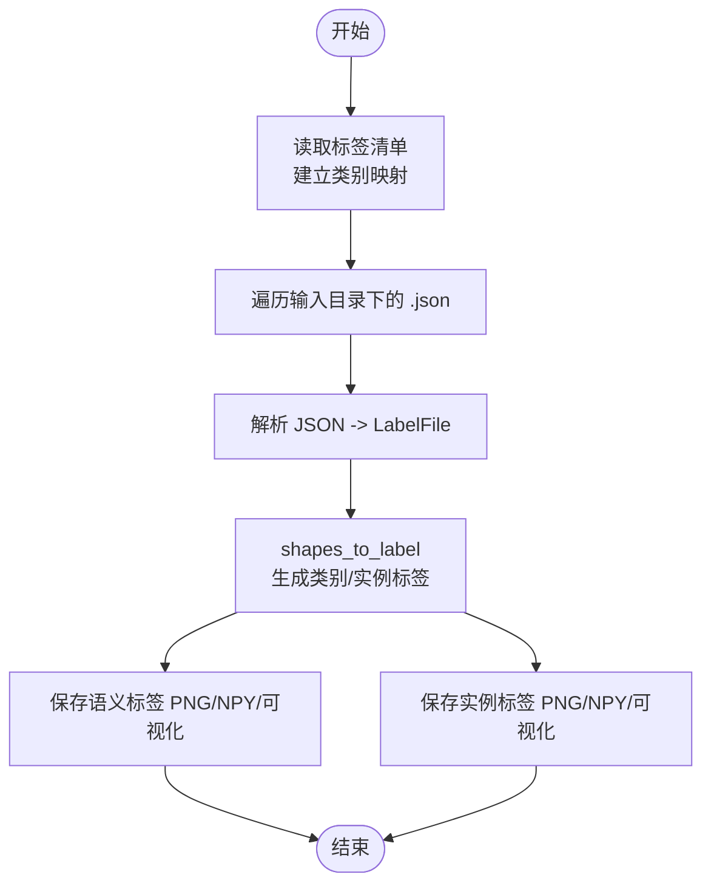
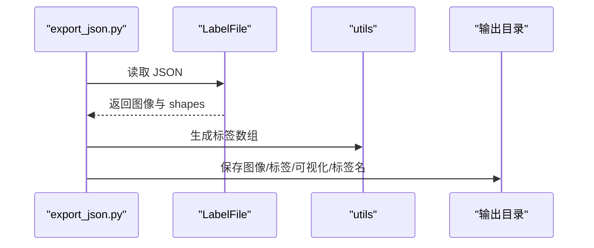
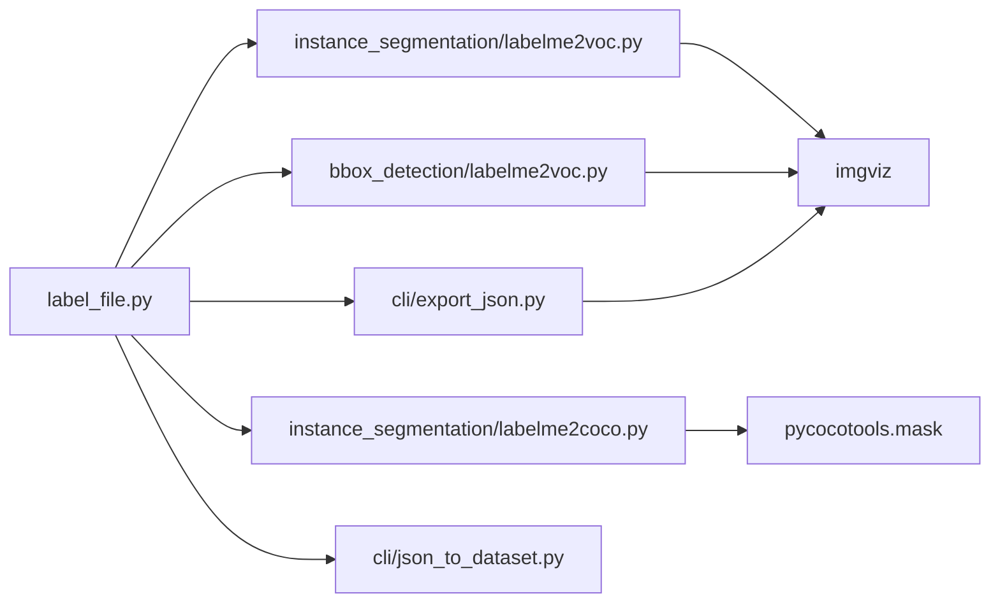

# 格式转换与导出

<cite>
**本文引用的文件**
- [examples/bbox_detection/labelme2voc.py](file://examples/bbox_detection/labelme2voc.py)
- [examples/instance_segmentation/labelme2voc.py](file://examples/instance_segmentation/labelme2voc.py)
- [examples/semantic_segmentation/labelme2voc.py](file://examples/semantic_segmentation/labelme2voc.py)
- [examples/video_annotation/labelme2voc.py](file://examples/video_annotation/labelme2voc.py)
- [examples/instance_segmentation/labelme2coco.py](file://examples/instance_segmentation/labelme2coco.py)
- [examples/bbox_detection/labels.txt](file://examples/bbox_detection/labels.txt)
- [examples/instance_segmentation/labels.txt](file://examples/instance_segmentation/labels.txt)
- [examples/semantic_segmentation/labels.txt](file://examples/semantic_segmentation/labels.txt)
- [examples/video_annotation/labels.txt](file://examples/video_annotation/labels.txt)
- [examples/bbox_detection/data_annotated/2011_000003.json](file://examples/bbox_detection/data_annotated/2011_000003.json)
- [labelme/label_file.py](file://labelme/label_file.py)
- [labelme/cli/json_to_dataset.py](file://labelme/cli/json_to_dataset.py)
- [labelme/cli/export_json.py](file://labelme/cli/export_json.py)
</cite>

## 目录
1. [简介](#简介)
2. [项目结构](#项目结构)
3. [核心组件](#核心组件)
4. [架构总览](#架构总览)
5. [详细组件分析](#详细组件分析)
6. [依赖关系分析](#依赖关系分析)
7. [性能考虑](#性能考虑)
8. [故障排查指南](#故障排查指南)
9. [结论](#结论)
10. [附录](#附录)

## 简介
本文件系统性阐述 labelme 的格式转换与导出能力，重点覆盖以下目标格式：
- VOC（边界框检测）
- COCO（实例分割）
- 语义分割标签（像素级类别标签）
- 视频标注的语义分割变体

内容包含：转换机制与实现原理、各格式特点与适用场景、转换参数配置、批量转换与性能优化策略、数据映射关系与字段对应规则、使用示例与最佳实践，以及常见问题与解决方案。

## 项目结构
围绕“格式转换与导出”的关键文件组织如下：
- 示例脚本：位于 examples 下，分别提供 VOC、COCO、语义/实例/视频标注的转换脚本与标签清单
- CLI 工具：labelme/cli 下提供单文件导出与历史兼容的单图转换工具
- 核心数据模型：labelme/label_file.py 定义 JSON 标注文件的加载/保存接口

图表来源
- [examples/bbox_detection/labelme2voc.py:1-147](file://examples/bbox_detection/labelme2voc.py#L1-L147)
- [examples/instance_segmentation/labelme2voc.py:1-157](file://examples/instance_segmentation/labelme2voc.py#L1-L157)
- [examples/instance_segmentation/labelme2coco.py:1-204](file://examples/instance_segmentation/labelme2coco.py#L1-L204)
- [labelme/cli/export_json.py:1-90](file://labelme/cli/export_json.py#L1-L90)
- [labelme/cli/json_to_dataset.py:1-101](file://labelme/cli/json_to_dataset.py#L1-L101)
- [labelme/label_file.py:1-306](file://labelme/label_file.py#L1-L306)

章节来源
- [examples/bbox_detection/labelme2voc.py:1-147](file://examples/bbox_detection/labelme2voc.py#L1-L147)
- [examples/instance_segmentation/labelme2voc.py:1-157](file://examples/instance_segmentation/labelme2voc.py#L1-L157)
- [examples/instance_segmentation/labelme2coco.py:1-204](file://examples/instance_segmentation/labelme2coco.py#L1-L204)
- [labelme/cli/export_json.py:1-90](file://labelme/cli/export_json.py#L1-L90)
- [labelme/cli/json_to_dataset.py:1-101](file://labelme/cli/json_to_dataset.py#L1-L101)
- [labelme/label_file.py:1-306](file://labelme/label_file.py#L1-L306)

## 核心组件
- LabelFile：负责加载/保存 JSON 标注文件，解析图像数据与标注形状，支持 base64 与外部图像路径两种模式；提供尺寸校验与异常处理。
- CLI 导出工具：
  - export_json.py：将单个 JSON 导出为图像、语义标签图与标签名文件，适合快速验证与小规模导出。
  - json_to_dataset.py：历史兼容脚本，强调弃用提示与单图演示用途。
- 转换脚本：
  - bbox_detection/labelme2voc.py：将矩形标注转为 VOC XML（边界框），支持可视化输出。
  - instance_segmentation/labelme2voc.py：将多边形/矩形/圆形等标注转为语义与实例分割 PNG/NPY/可视化。
  - instance_segmentation/labelme2coco.py：将多边形/矩形/圆形等标注转为 COCO JSON（实例分割），支持 RLE 编码。
  - semantic_segmentation/labelme2voc.py、video_annotation/labelme2voc.py：分别为语义分割与视频标注场景复用实例分割脚本。

章节来源
- [labelme/label_file.py:103-193](file://labelme/label_file.py#L103-L193)
- [labelme/cli/export_json.py:19-86](file://labelme/cli/export_json.py#L19-L86)
- [labelme/cli/json_to_dataset.py:19-96](file://labelme/cli/json_to_dataset.py#L19-L96)
- [examples/bbox_detection/labelme2voc.py:23-146](file://examples/bbox_detection/labelme2voc.py#L23-L146)
- [examples/instance_segmentation/labelme2voc.py:17-156](file://examples/instance_segmentation/labelme2voc.py#L17-L156)
- [examples/instance_segmentation/labelme2coco.py:25-203](file://examples/instance_segmentation/labelme2coco.py#L25-L203)

## 架构总览
整体流程：读取 JSON 标注 → 解析图像与形状 → 依据目标格式生成对应输出（XML/PNG/NPY/JPEG/JSON）→ 可选生成可视化。

图表来源
- [examples/bbox_detection/labelme2voc.py:62-142](file://examples/bbox_detection/labelme2voc.py#L62-L142)
- [examples/instance_segmentation/labelme2voc.py:80-153](file://examples/instance_segmentation/labelme2voc.py#L80-L153)
- [examples/instance_segmentation/labelme2coco.py:90-199](file://examples/instance_segmentation/labelme2coco.py#L90-L199)
- [labelme/label_file.py:103-193](file://labelme/label_file.py#L103-L193)

## 详细组件分析

### VOC 边界框转换（bbox_detection）
- 功能概述：将矩形标注转换为 Pascal VOC XML，同时生成 JPEG 图像与可选可视化。
- 关键步骤：
  - 读取标签清单，建立类别名到 ID 的映射（支持忽略类与背景类）。
  - 遍历输入目录下 JSON，仅处理矩形标注，构建 XML 结构并写入。
  - 可选生成带标注框的可视化图像。
- 参数与选项：
  - 输入/输出目录、标签文件（支持文件或逗号分隔字符串）、禁用可视化开关。
- 数据映射关系：
  - JSON 中每个矩形 shape 对应 XML 的一个 object 节点；类别名映射到整数 ID。
- 适用场景：目标检测（YOLO、Faster R-CNN 等）训练前准备。

图表来源
- [examples/bbox_detection/labelme2voc.py:23-146](file://examples/bbox_detection/labelme2voc.py#L23-L146)

章节来源
- [examples/bbox_detection/labelme2voc.py:23-146](file://examples/bbox_detection/labelme2voc.py#L23-L146)
- [examples/bbox_detection/labels.txt:1-22](file://examples/bbox_detection/labels.txt#L1-L22)
- [examples/bbox_detection/data_annotated/2011_000003.json:1-42](file://examples/bbox_detection/data_annotated/2011_000003.json#L1-L42)

### COCO 实例分割转换（instance_segmentation）
- 功能概述：将多边形/矩形/圆形等标注转换为 COCO JSON，包含 images、annotations、categories 字段，支持 RLE 编码。
- 关键步骤：
  - 读取标签清单，构建类别映射。
  - 遍历 JSON，将形状转换为二值掩码，合并同组实例，生成 RLE 面积与 bbox。
  - 写入 annotations.json。
  - 可选生成可视化图像。
- 参数与选项：
  - 输入/输出目录、标签文件、禁用可视化开关。
- 数据映射关系：
  - JSON 中的每个 shape 映射为 COCO 的一个 annotation；类别名映射到 category_id；掩码经 RLE 编码。
- 适用场景：实例分割（Mask R-CNN 等）训练数据准备。

图表来源
- [examples/instance_segmentation/labelme2coco.py:25-203](file://examples/instance_segmentation/labelme2coco.py#L25-L203)

章节来源
- [examples/instance_segmentation/labelme2coco.py:25-203](file://examples/instance_segmentation/labelme2coco.py#L25-L203)

### 语义/实例分割转换（instance_segmentation/semantic_segmentation/video_annotation）
- 功能概述：将多边形/矩形/圆形等标注转换为语义分割（类别标签）与实例分割（实例 ID）PNG/NPY/可视化。
- 关键步骤：
  - 读取标签清单，建立类别映射。
  - 遍历 JSON，调用 shapes_to_label 生成类别标签与实例标签。
  - 可按需保存 NPY 数组与可视化图像。
- 参数与选项：
  - 标签文件（文件或逗号分隔）、禁用 object 分割、禁用 NPY、禁用可视化。
- 数据映射关系：
  - 类别标签：每个像素映射为类别 ID；实例标签：每个像素映射为实例 ID。
- 适用场景：语义分割（语义标签）与实例分割（实例标签）训练数据准备。

图表来源
- [examples/instance_segmentation/labelme2voc.py:80-153](file://examples/instance_segmentation/labelme2voc.py#L80-L153)

章节来源
- [examples/instance_segmentation/labelme2voc.py:17-156](file://examples/instance_segmentation/labelme2voc.py#L17-L156)
- [examples/semantic_segmentation/labelme2voc.py:1-1](file://examples/semantic_segmentation/labelme2voc.py#L1-L1)
- [examples/video_annotation/labelme2voc.py:1-1](file://examples/video_annotation/labelme2voc.py#L1-L1)

### 单文件导出（CLI）
- 功能概述：将单个 JSON 导出为图像、语义标签图与标签名文件，便于快速验证。
- 关键步骤：
  - 读取 JSON，生成类别映射与标签数组。
  - 保存图像、标签图与可视化图。
- 适用场景：小规模验证、数据探索。

图表来源
- [labelme/cli/export_json.py:19-86](file://labelme/cli/export_json.py#L19-L86)

章节来源
- [labelme/cli/export_json.py:19-86](file://labelme/cli/export_json.py#L19-L86)

## 依赖关系分析
- 转换脚本均依赖 LabelFile 以统一读取 JSON 标注；部分脚本依赖 imgviz 进行可视化，COCO 脚本依赖 pycocotools.mask 进行 RLE 编码。
- CLI 工具与示例脚本共享 labelme/utils 的形状到标签/掩码转换能力。

图表来源
- [labelme/label_file.py:1-306](file://labelme/label_file.py#L1-L306)
- [examples/bbox_detection/labelme2voc.py:1-147](file://examples/bbox_detection/labelme2voc.py#L1-L147)
- [examples/instance_segmentation/labelme2voc.py:1-157](file://examples/instance_segmentation/labelme2voc.py#L1-L157)
- [examples/instance_segmentation/labelme2coco.py:1-204](file://examples/instance_segmentation/labelme2coco.py#L1-L204)
- [labelme/cli/export_json.py:1-90](file://labelme/cli/export_json.py#L1-L90)
- [labelme/cli/json_to_dataset.py:1-101](file://labelme/cli/json_to_dataset.py#L1-L101)

章节来源
- [examples/instance_segmentation/labelme2coco.py:18-22](file://examples/instance_segmentation/labelme2coco.py#L18-L22)
- [examples/bbox_detection/labelme2voc.py:15-20](file://examples/bbox_detection/labelme2voc.py#L15-L20)

## 性能考虑
- 批量处理策略
  - 使用 glob 遍历输入目录，避免单文件 IO 放大；按需生成可视化，减少磁盘写入。
  - COCO 转换中对同一 group_id 的实例进行掩码合并，降低重复计算。
- 内存与计算
  - 形状到掩码/标签的转换在内存中进行，建议控制输入图像分辨率与标注复杂度。
  - RLE 编码与面积计算由 pycocotools.mask 提供，注意大图与密集标注的内存占用。
- I/O 优化
  - 优先使用绝对路径与相对路径一致的输出布局，减少跨盘符写入。
  - 合理设置标签清单顺序，避免频繁重建类别映射。
- 并发与流水线
  - 可在外部通过任务调度器并行运行多个转换脚本（不同子目录），但需避免对同一输出目录的并发写入。

## 故障排查指南
- 常见问题与解决
  - 缺少依赖库：安装 lxml（VOC 转换）或 pycocotools（COCO 转换）。
  - 输出目录已存在：转换脚本会拒绝覆盖，请清理或更换输出目录。
  - 标签清单格式错误：确保第一行为忽略类、第二行为背景类，后续为类别名。
  - 图像尺寸不一致：LabelFile 会在尺寸不匹配时记录错误并使用实际尺寸，建议统一标注规范。
  - 非矩形标注被跳过：VOC 边界框转换仅处理矩形标注，多边形请使用语义/实例转换或 COCO。
  - 圆形/矩形近似：COCO 脚本对圆形进行点列采样，必要时调整采样密度以平衡精度与性能。
- 日志与调试
  - CLI 工具使用日志记录关键信息与警告，便于定位问题。
  - 建议先用 export_json.py 快速验证单文件转换结果，再扩展到批量。

章节来源
- [examples/bbox_detection/labelme2voc.py:15-20](file://examples/bbox_detection/labelme2voc.py#L15-L20)
- [examples/instance_segmentation/labelme2coco.py:18-22](file://examples/instance_segmentation/labelme2coco.py#L18-L22)
- [labelme/label_file.py:194-223](file://labelme/label_file.py#L194-L223)
- [labelme/cli/export_json.py:26-35](file://labelme/cli/export_json.py#L26-L35)

## 结论
labelme 的格式转换体系以 LabelFile 为核心，围绕 VOC、COCO、语义/实例分割与视频标注场景提供了清晰的转换脚本与 CLI 工具。通过统一的标签映射与形状转换流程，能够高效地将 JSON 标注转化为多种主流机器学习训练格式。建议在项目中结合批量处理策略与依赖管理，确保转换过程稳定、可追溯且具备良好性能。

## 附录

### 各格式特点与适用场景
- VOC（边界框）
  - 特点：XML 结构明确，边界框标注为主。
  - 适用：目标检测任务（如 YOLO、Faster R-CNN）。
- COCO（实例分割）
  - 特点：JSON 结构完整，支持 RLE 编码与多边形。
  - 适用：实例分割与多目标检测任务。
- 语义分割标签
  - 特点：像素级类别标签，适合语义分割网络。
  - 适用：语义分割任务。
- 视频标注（语义分割变体）
  - 特点：延续语义分割流程，适用于视频序列的逐帧语义标注。

### 转换参数配置要点
- 标签文件（labels.txt）
  - 第一行：忽略类（通常为忽略区域）
  - 第二行：背景类（通常为背景）
  - 后续行：具体类别名（顺序即类别 ID）
- VOC/COCO/语义/实例转换脚本通用参数
  - 输入目录：包含 .json 的目录
  - 输出目录：生成目标格式的根目录
  - 标签文件：类别清单
  - 可选：禁用可视化、禁用 NPY、禁用 object 分割等

### 使用示例与代码演示（路径指引）
- VOC 边界框转换
  - 示例：python examples/bbox_detection/labelme2voc.py <输入目录> <输出目录> --labels <标签文件>
  - 参考路径：[examples/bbox_detection/labelme2voc.py:23-31](file://examples/bbox_detection/labelme2voc.py#L23-L31)
- COCO 实例分割转换
  - 示例：python examples/instance_segmentation/labelme2coco.py <输入目录> <输出目录> --labels <标签文件>
  - 参考路径：[examples/instance_segmentation/labelme2coco.py:25-33](file://examples/instance_segmentation/labelme2coco.py#L25-L33)
- 语义/实例分割转换
  - 示例：python examples/instance_segmentation/labelme2voc.py <输入目录> <输出目录> --labels "<类别1,类别2,...>"
  - 参考路径：[examples/instance_segmentation/labelme2voc.py:17-35](file://examples/instance_segmentation/labelme2voc.py#L17-L35)
- 单文件导出
  - 示例：python -m labelme.cli.export_json <标注文件.json> [-o <输出目录>]
  - 参考路径：[labelme/cli/export_json.py:27-30](file://labelme/cli/export_json.py#L27-L30)

### 数据映射关系与字段对应规则
- VOC
  - JSON shape.label → XML object.name
  - JSON shape.points（矩形）→ XML bndbox(xmin/ymin/xmax/ymax）
  - 类别映射：labels.txt 中的类别名 → 整数 ID
- COCO
  - JSON shape → annotation（segmentation/area/bbox/category_id/image_id）
  - 类别映射：labels.txt 中的类别名 → category_id
  - 掩码：二值掩码 → RLE 编码
- 语义/实例分割
  - JSON shape → 类别标签/实例标签（像素级）
  - 类别映射：labels.txt 中的类别名 → 类别 ID

章节来源
- [examples/bbox_detection/labelme2voc.py:93-128](file://examples/bbox_detection/labelme2voc.py#L93-L128)
- [examples/instance_segmentation/labelme2coco.py:154-175](file://examples/instance_segmentation/labelme2coco.py#L154-L175)
- [examples/instance_segmentation/labelme2voc.py:116-152](file://examples/instance_segmentation/labelme2voc.py#L116-L152)
- [examples/bbox_detection/labels.txt:1-22](file://examples/bbox_detection/labels.txt#L1-L22)
- [examples/instance_segmentation/labels.txt:1-22](file://examples/instance_segmentation/labels.txt#L1-L22)
- [examples/semantic_segmentation/labels.txt:1-22](file://examples/semantic_segmentation/labels.txt#L1-L22)
- [examples/video_annotation/labels.txt:1-5](file://examples/video_annotation/labels.txt#L1-L5)