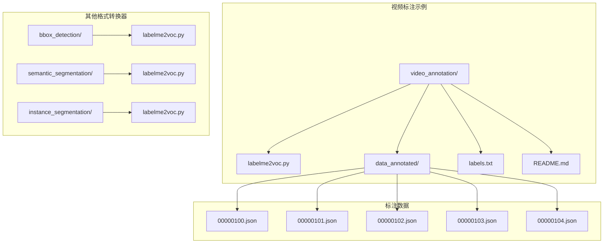
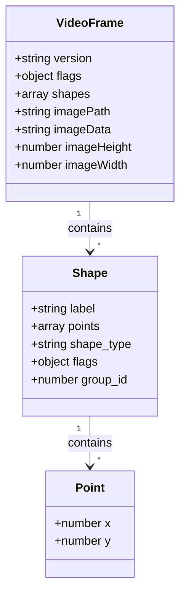
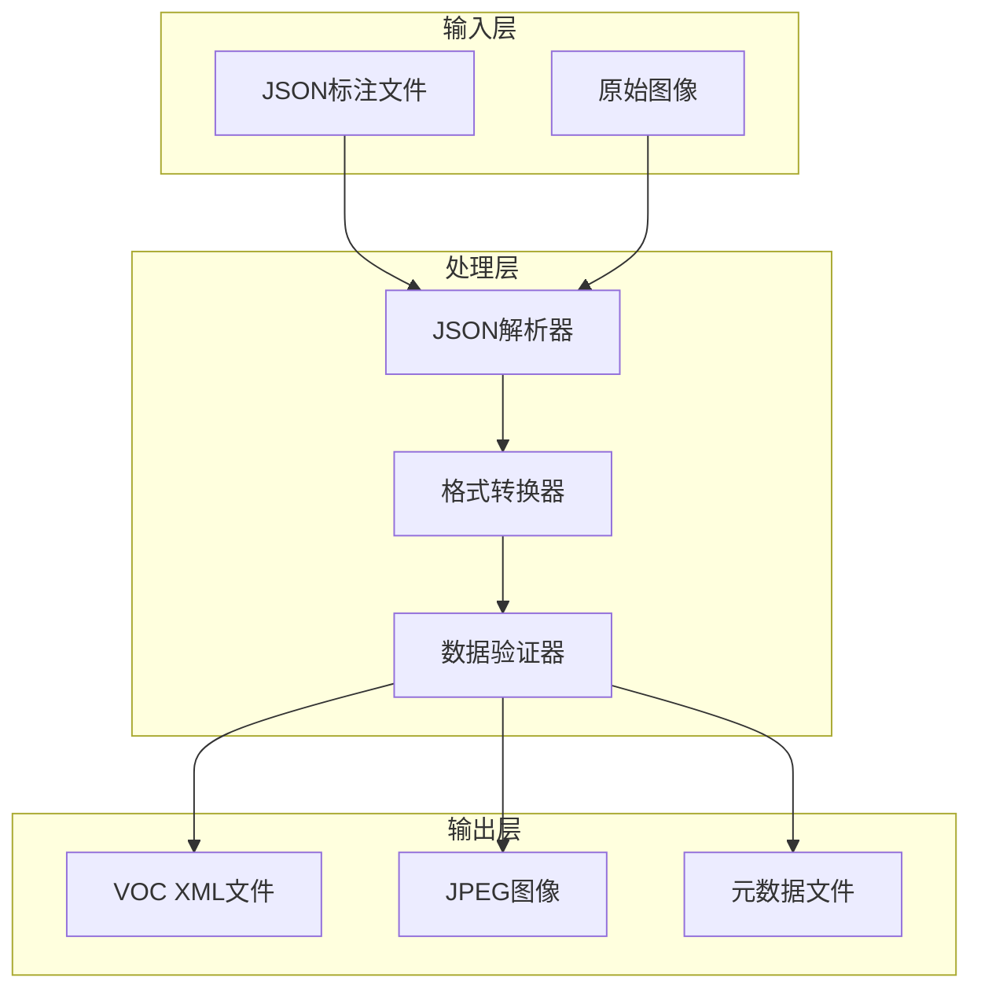
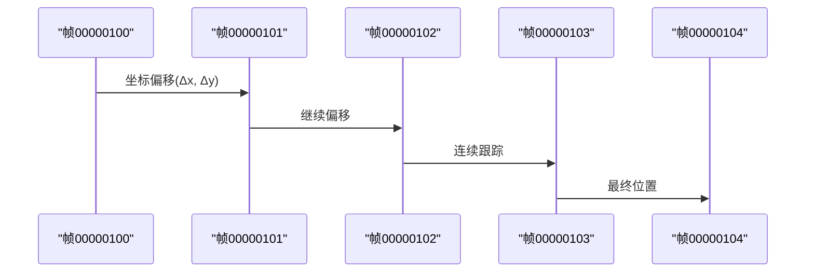
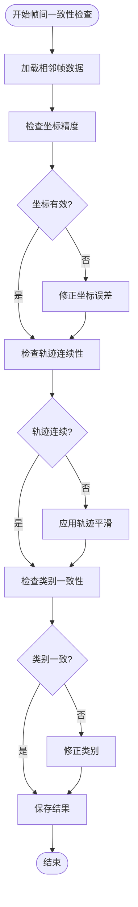
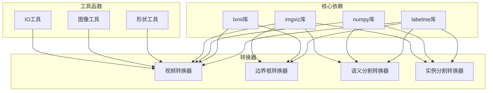
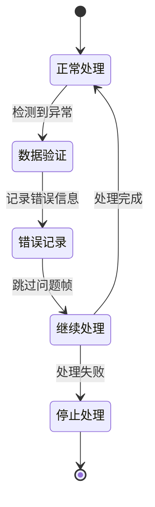

# 视频标注格式转换

<cite>
**本文档引用的文件**
- [labelme2voc.py](file://labelme/examples/video_annotation/labelme2voc.py)
- [labelme2voc.py](file://labelme/examples/bbox_detection/labelme2voc.py)
- [labelme2voc.py](file://labelme/examples/semantic_segmentation/labelme2voc.py)
- [labelme2voc.py](file://labelme/examples/instance_segmentation/labelme2voc.py)
- [00000100.json](file://labelme/examples/video_annotation/data_annotated/00000100.json)
- [00000101.json](file://labelme/examples/video_annotation/data_annotated/00000101.json)
- [00000102.json](file://labelme/examples/video_annotation/data_annotated/00000102.json)
- [00000103.json](file://labelme/examples/video_annotation/data_annotated/00000103.json)
- [00000104.json](file://labelme/examples/video_annotation/data_annotated/00000104.json)
- [labels.txt](file://labelme/examples/video_annotation/labels.txt)
- [README.md](file://labelme/examples/video_annotation/README.md)
</cite>

## 目录
1. [简介](#简介)
2. [项目结构](#项目结构)
3. [核心组件](#核心组件)
4. [架构概览](#架构概览)
5. [详细组件分析](#详细组件分析)
6. [依赖关系分析](#依赖关系分析)
7. [性能考虑](#性能考虑)
8. [故障排除指南](#故障排除指南)
9. [结论](#结论)
10. [附录](#附录)

## 简介

本项目提供了视频标注格式转换功能，专门用于将视频序列标注转换为Pascal VOC格式。该功能的核心特性包括：

- **时间维度处理**：支持视频帧序列的时间连续性管理
- **帧间一致性保证**：确保相邻帧间的标注一致性
- **轨迹跟踪**：处理视频中的移动对象轨迹
- **批量处理**：支持大规模视频数据集的批量转换
- **元数据提取**：自动提取图像尺寸、类别信息等元数据
- **时间轴对齐**：保持视频时间轴的精确对齐

## 项目结构

视频标注转换功能主要位于以下目录结构中：



**图表来源**
- [labelme2voc.py:1-1](file://labelme/examples/video_annotation/labelme2voc.py#L1-L1)
- [00000100.json:1-154](file://labelme/examples/video_annotation/data_annotated/00000100.json#L1-L154)

**章节来源**
- [labelme2voc.py:1-1](file://labelme/examples/video_annotation/labelme2voc.py#L1-L1)
- [README.md:1-30](file://labelme/examples/video_annotation/README.md#L1-L30)

## 核心组件

### 视频标注数据结构

视频标注采用JSON格式存储，每个JSON文件代表一个视频帧的标注信息：



**图表来源**
- [00000100.json:1-154](file://labelme/examples/video_annotation/data_annotated/00000100.json#L1-L154)
- [00000101.json:1-154](file://labelme/examples/video_annotation/data_annotated/00000101.json#L1-L154)

### 类别管理系统

视频标注支持多种类别，包括背景、忽略类别和目标类别：

| 类别类型 | 示例 | 用途 |
|---------|------|------|
| 忽略类别 | `__ignore__` | 标记不需要参与训练的区域 |
| 背景类别 | `_background_` | 定义背景区域 |
| 目标类别 | `car`, `track` | 实际需要检测的目标 |

**章节来源**
- [labels.txt:1-5](file://labelme/examples/video_annotation/labels.txt#L1-L5)
- [00000100.json:1-154](file://labelme/examples/video_annotation/data_annotated/00000100.json#L1-L154)

## 架构概览

视频标注转换系统采用模块化设计，支持多种输出格式：



**图表来源**
- [labelme2voc.py:23-147](file://labelme/examples/bbox_detection/labelme2voc.py#L23-L147)

## 详细组件分析

### 时间维度处理机制

视频标注的时间处理基于帧序号的连续性：



**图表来源**
- [00000100.json:1-154](file://labelme/examples/video_annotation/data_annotated/00000100.json#L1-L154)
- [00000101.json:1-154](file://labelme/examples/video_annotation/data_annotated/00000101.json#L1-L154)
- [00000102.json:1-154](file://labelme/examples/video_annotation/data_annotated/00000102.json#L1-L154)
- [00000103.json:1-154](file://labelme/examples/video_annotation/data_annotated/00000103.json#L1-L154)
- [00000104.json:1-154](file://labelme/examples/video_annotation/data_annotated/00000104.json#L1-L154)

### 帧间一致性保证

系统通过以下机制确保帧间一致性：

1. **坐标精度控制**：使用高精度浮点数表示坐标
2. **轨迹连续性**：相邻帧间的位移保持合理范围
3. **类别一致性**：同一对象在连续帧中保持相同类别



**图表来源**
- [00000100.json:1-154](file://labelme/examples/video_annotation/data_annotated/00000100.json#L1-L154)
- [00000101.json:1-154](file://labelme/examples/video_annotation/data_annotated/00000101.json#L1-L154)

### 批量处理流程

视频标注转换支持批量处理多个帧：


**图表来源**
- [labelme2voc.py:62-147](file://labelme/examples/bbox_detection/labelme2voc.py#L62-L147)

### 元数据提取机制

系统自动提取以下元数据：

| 元数据项 | 提取来源 | 用途 |
|---------|---------|------|
| 图像尺寸 | JSON文件中的imageHeight和imageWidth | 确定边界框坐标范围 |
| 图像路径 | JSON文件中的imagePath | 构建输出路径 |
| 类别信息 | labels.txt文件 | 定义类别映射 |
| 版本信息 | JSON文件中的version字段 | 兼容性检查 |

**章节来源**
- [00000100.json:1-154](file://labelme/examples/video_annotation/data_annotated/00000100.json#L1-L154)
- [labels.txt:1-5](file://labelme/examples/video_annotation/labels.txt#L1-L5)

## 依赖关系分析

视频标注转换功能依赖于以下核心组件：



**图表来源**
- [labelme2voc.py:15-21](file://labelme/examples/bbox_detection/labelme2voc.py#L15-L21)
- [labelme2voc.py:12-14](file://labelme/examples/instance_segmentation/labelme2voc.py#L12-L14)

**章节来源**
- [labelme2voc.py:15-21](file://labelme/examples/bbox_detection/labelme2voc.py#L15-L21)
- [labelme2voc.py:12-14](file://labelme/examples/instance_segmentation/labelme2voc.py#L12-L14)

## 性能考虑

### 内存管理策略

1. **流式处理**：逐帧读取和处理，避免一次性加载所有数据
2. **增量写入**：实时生成输出文件，减少内存占用
3. **缓存机制**：对重复使用的数据进行缓存

### 处理优化技术

1. **并行处理**：多进程并行处理不同帧
2. **批处理优化**：合理设置批处理大小
3. **I/O优化**：使用高效的文件读写操作

### 错误恢复机制



## 故障排除指南

### 常见问题及解决方案

| 问题类型 | 症状 | 解决方案 |
|---------|------|---------|
| JSON解析错误 | 程序崩溃或报错 | 检查JSON格式完整性 |
| 坐标越界 | 边界框超出图像范围 | 验证坐标值的有效性 |
| 类别不匹配 | 类别名称不一致 | 检查labels.txt文件 |
| 文件缺失 | 无法找到输入文件 | 确认文件路径正确性 |

### 调试技巧

1. **启用详细日志**：查看详细的处理过程信息
2. **分步调试**：逐个检查每个处理步骤
3. **数据验证**：验证中间结果的正确性

**章节来源**
- [labelme2voc.py:15-21](file://labelme/examples/bbox_detection/labelme2voc.py#L15-L21)

## 结论

视频标注格式转换功能提供了完整的视频序列标注到VOC格式的转换解决方案。该系统具有以下优势：

1. **完整性**：支持视频标注的所有特性和要求
2. **可靠性**：包含完善的错误处理和恢复机制
3. **可扩展性**：模块化设计便于功能扩展
4. **高效性**：优化的处理流程确保高性能

通过合理使用本系统的各项功能，可以高效地完成视频标注数据的格式转换任务。

## 附录

### 使用示例

```bash
# 基本转换命令
python labelme2voc.py data_annotated/ output_dataset/ --labels labels.txt

# 启用可视化输出
python labelme2voc.py data_annotated/ output_dataset/ --labels labels.txt --noviz

# 指定类别过滤
python labelme2voc.py data_annotated/ output_dataset/ --labels labels.txt --filter-class car
```

### 支持的格式

| 输入格式 | 输出格式 | 支持状态 |
|---------|---------|---------|
| JSON标注 | VOC XML | ✅ 完全支持 |
| PNG标签 | PNG标签 | ✅ 完全支持 |
| JPG图像 | JPG图像 | ✅ 完全支持 |
| NPY数组 | NPY数组 | ⚠️ 部分支持 |

### 配置选项

| 选项 | 类型 | 默认值 | 描述 |
|------|------|--------|------|
| --labels | 字符串 | 必需 | 类别定义文件路径 |
| --noviz | 标志 | False | 禁用可视化输出 |
| --noobject | 标志 | False | 不生成对象标签 |
| --nonpy | 标志 | False | 不生成NPY文件 |