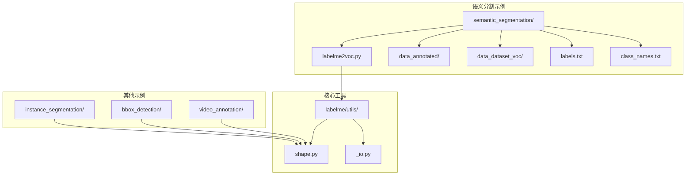
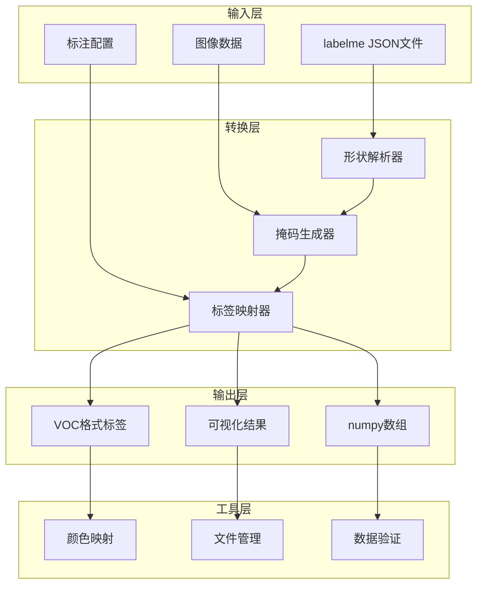
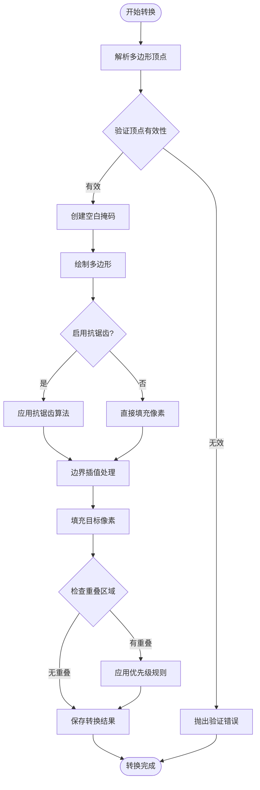
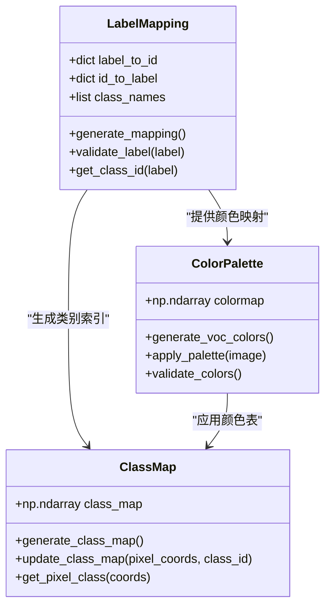
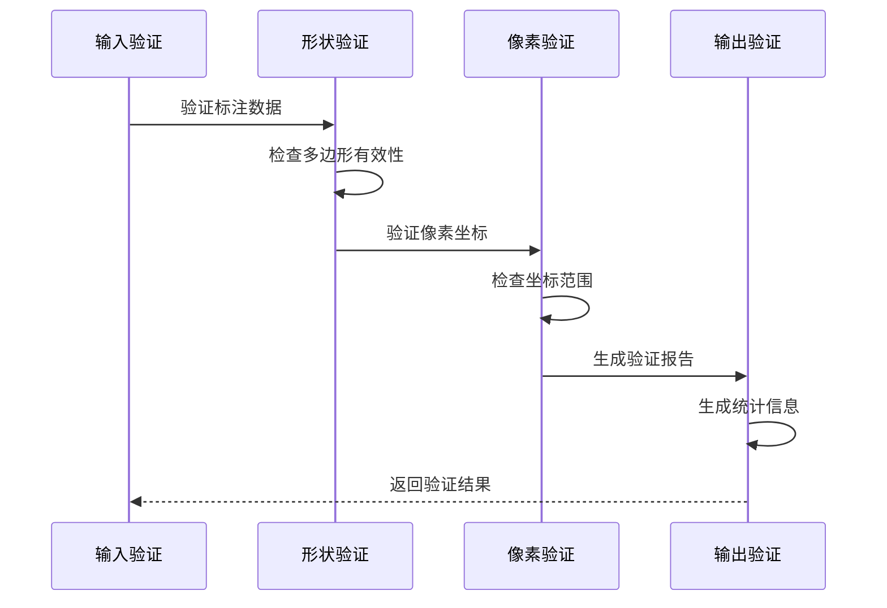
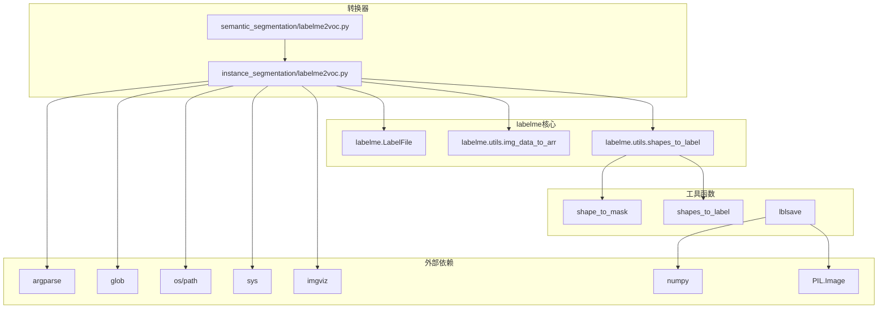

# 语义分割格式转换

<cite>
**本文档引用的文件**
- [labelme2voc.py](file://labelme/examples/instance_segmentation/labelme2voc.py)
- [labelme2voc.py](file://labelme/examples/semantic_segmentation/labelme2voc.py)
- [labelme2voc.py](file://labelme/examples/video_annotation/labelme2voc.py)
- [labelme2voc.py](file://labelme/examples/bbox_detection/labelme2voc.py)
- [shape.py](file://labelme/labelme/utils/shape.py)
- [_io.py](file://labelme/labelme/utils/_io.py)
- [2011_000003.json](file://labelme/examples/semantic_segmentation/data_annotated/2011_000003.json)
- [class_names.txt](file://labelme/examples/semantic_segmentation/data_dataset_voc/class_names.txt)
- [labels.txt](file://labelme/examples/semantic_segmentation/labels.txt)
- [README.md](file://labelme/examples/semantic_segmentation/README.md)
</cite>

## 目录
1. [简介](#简介)
2. [项目结构](#项目结构)
3. [核心组件](#核心组件)
4. [架构概览](#架构概览)
5. [详细组件分析](#详细组件分析)
6. [依赖关系分析](#依赖关系分析)
7. [性能考虑](#性能考虑)
8. [故障排除指南](#故障排除指南)
9. [结论](#结论)
10. [附录](#附录)

## 简介

本文档深入解析了labelme JSON格式到语义分割VOC格式的转换机制，重点说明像素级标注的转换实现。该系统实现了从多边形标注到像素掩码的转换算法，包括抗锯齿处理和边界插值，以及语义分割特有的class map生成、标签文件组织和numpy数组存储格式。

语义分割转换系统的核心价值在于：
- 提供完整的像素级标注转换流程
- 实现高效的多边形到掩码算法
- 支持大规模数据集的批量处理
- 确保VOC格式兼容性和数据完整性

## 项目结构

语义分割格式转换功能在labelme项目中采用模块化设计，主要包含以下组件：



**图表来源**
- [labelme2voc.py](file://labelme/examples/semantic_segmentation/labelme2voc.py)
- [shape.py](file://labelme/labelme/utils/shape.py)
- [_io.py](file://labelme/labelme/utils/_io.py)

**章节来源**
- [labelme2voc.py](file://labelme/examples/semantic_segmentation/labelme2voc.py)
- [shape.py](file://labelme/labelme/utils/shape.py)
- [_io.py](file://labelme/labelme/utils/_io.py)

## 核心组件

### 转换器主程序

语义分割转换器基于实例分割的通用框架，通过符号链接实现代码复用。主程序负责：
- 解析命令行参数和配置选项
- 管理输出目录结构和文件组织
- 协调数据转换和文件保存流程

### 形状到标签转换引擎

核心转换逻辑由`shapes_to_label`函数实现，该函数：
- 将多边形标注转换为像素级掩码
- 管理类别标签和实例标签的生成
- 处理重叠区域的优先级规则
- 支持多种形状类型的统一处理

### 标签保存和颜色映射

标签保存功能通过`lblsave`函数实现：
- 支持PNG格式的颜色映射保存
- 自动处理VOC格式的颜色表
- 提供numpy数组的二进制保存
- 实现标签可视化和验证功能

**章节来源**
- [labelme2voc.py](file://labelme/examples/semantic_segmentation/labelme2voc.py)
- [shape.py](file://labelme/labelme/utils/shape.py)
- [_io.py](file://labelme/labelme/utils/_io.py)

## 架构概览

语义分割格式转换系统采用分层架构设计，确保功能模块的独立性和可扩展性：



**图表来源**
- [labelme2voc.py](file://labelme/examples/semantic_segmentation/labelme2voc.py)
- [shape.py](file://labelme/labelme/utils/shape.py)
- [_io.py](file://labelme/labelme/utils/_io.py)

系统的核心处理流程包括：
1. **数据预处理**：解析JSON标注文件，提取图像和形状信息
2. **形状转换**：将多边形标注转换为像素级掩码
3. **标签生成**：创建类别标签和实例标签数组
4. **格式转换**：适配VOC格式要求的数据结构
5. **文件输出**：保存PNG标签、numpy数组和可视化文件

## 详细组件分析

### 多边形到像素掩码转换算法

语义分割的核心在于精确的多边形到像素掩码转换。该算法采用以下策略：



**图表来源**
- [shape.py](file://labelme/labelme/utils/shape.py)

#### 抗锯齿处理机制

抗锯齿算法通过以下步骤实现边缘平滑：
- **边缘检测**：识别多边形边界像素
- **权重计算**：根据距离边界远近计算像素权重
- **颜色混合**：将边界像素与背景颜色按权重混合
- **质量控制**：确保转换后的图像质量

#### 边界插值算法

边界插值确保多边形内部像素的准确填充：
- **扫描线算法**：逐行扫描多边形边界
- **交点计算**：计算扫描线与边界的交点
- **区间填充**：对相邻交点间的区间进行像素填充
- **精度保证**：使用高精度浮点运算确保边界准确性

**章节来源**
- [shape.py](file://labelme/labelme/utils/shape.py)

### 类别索引管理和颜色映射

系统采用灵活的类别索引管理系统，支持动态标签映射：



**图表来源**
- [labelme2voc.py](file://labelme/examples/semantic_segmentation/labelme2voc.py)
- [_io.py](file://labelme/labelme/utils/_io.py)

#### 特殊标签处理

系统支持以下特殊标签的处理：
- **忽略标签** (`__ignore__`): 使用255值表示，便于训练时忽略
- **背景标签** (`_background_`): 类别ID为0，表示无标注区域
- **动态标签**: 支持运行时添加新标签

#### 颜色映射策略

VOC格式的颜色映射遵循特定规范：
- **颜色范围限制**: 仅使用0-255范围内的颜色值
- **透明度处理**: PNG格式支持透明度，但VOC要求单通道
- **颜色唯一性**: 确保每个类别对应唯一颜色
- **兼容性保证**: 与标准VOC工具链完全兼容

**章节来源**
- [labelme2voc.py](file://labelme/examples/semantic_segmentation/labelme2voc.py)
- [_io.py](file://labelme/labelme/utils/_io.py)

### 数据验证和质量控制

系统内置多层次的数据验证机制：



**图表来源**
- [shape.py](file://labelme/labelme/utils/shape.py)
- [labelme2voc.py](file://labelme/examples/semantic_segmentation/labelme2voc.py)

验证流程包括：
1. **几何验证**：检查多边形顶点的数学有效性
2. **像素验证**：确保像素坐标在图像范围内
3. **一致性验证**：验证标签映射的一致性
4. **完整性验证**：检查输出文件的完整性

**章节来源**
- [shape.py](file://labelme/labelme/utils/shape.py)
- [labelme2voc.py](file://labelme/examples/semantic_segmentation/labelme2voc.py)

## 依赖关系分析

语义分割格式转换系统的依赖关系呈现清晰的层次结构：



**图表来源**
- [labelme2voc.py](file://labelme/examples/semantic_segmentation/labelme2voc.py)
- [labelme2voc.py](file://labelme/examples/instance_segmentation/labelme2voc.py)
- [shape.py](file://labelme/labelme/utils/shape.py)
- [_io.py](file://labelme/labelme/utils/_io.py)

系统的关键依赖特性：
- **模块化设计**：各组件职责明确，耦合度低
- **向后兼容**：通过符号链接实现代码复用
- **扩展性强**：支持自定义标签和形状类型
- **性能优化**：使用numpy进行高效数值计算

**章节来源**
- [labelme2voc.py](file://labelme/examples/semantic_segmentation/labelme2voc.py)
- [labelme2voc.py](file://labelme/examples/instance_segmentation/labelme2voc.py)
- [shape.py](file://labelme/labelme/utils/shape.py)

## 性能考虑

### 内存优化策略

针对大图像处理场景，系统采用以下内存优化策略：

1. **流式处理**：逐文件处理，避免同时加载多个大文件
2. **分块处理**：对于超大图像，采用分块处理策略
3. **数据类型优化**：使用适当的numpy数据类型减少内存占用
4. **及时释放**：处理完成后立即释放中间变量

### 批量转换性能

批量转换通过以下方式提升性能：
- **并行处理**：利用多核CPU进行并行转换
- **缓存机制**：缓存常用的标签映射和颜色表
- **I/O优化**：批量写入文件，减少磁盘I/O操作
- **进度监控**：实时显示转换进度，便于性能调优

### 缓存和重用机制

系统支持智能缓存以提升重复转换的效率：
- **标签映射缓存**：缓存标签到ID的映射关系
- **颜色表缓存**：缓存颜色映射表以避免重复生成
- **中间结果缓存**：缓存转换过程中的中间结果

## 故障排除指南

### 常见问题诊断

#### 标签映射错误
**症状**：生成的标签文件颜色异常或类别混淆
**解决方案**：
1. 检查labels.txt文件的格式和内容
2. 验证类别名称的一致性
3. 确认特殊标签（__ignore__、_background_）的正确配置

#### 图像尺寸不匹配
**症状**：转换后的标签与原图像尺寸不一致
**解决方案**：
1. 验证JSON文件中的imageHeight和imageWidth字段
2. 检查图像文件的实际尺寸
3. 确保转换过程中没有缩放操作

#### 内存不足错误
**症状**：处理大图像时出现内存溢出
**解决方案**：
1. 分块处理超大图像
2. 增加系统内存或虚拟内存
3. 优化numpy数组的数据类型

### 调试工具和方法

系统提供多种调试和验证工具：
- **可视化验证**：通过labelme_draw_label_png查看标签效果
- **统计报告**：生成转换统计信息和错误报告
- **日志记录**：详细的转换过程日志
- **数据检查**：验证输出文件的完整性和正确性

**章节来源**
- [README.md](file://labelme/examples/semantic_segmentation/README.md)

## 结论

语义分割格式转换系统展现了现代计算机视觉标注工具的先进设计理念。通过精心设计的算法和架构，系统实现了从多边形标注到像素级标签的高效转换，为语义分割任务提供了高质量的数据基础。

系统的主要优势包括：
- **算法精确性**：多边形到像素的精确转换，支持抗锯齿和边界插值
- **格式兼容性**：完全符合VOC格式标准，确保与其他工具链的无缝集成
- **性能优化**：针对大图像和批量处理进行了专门优化
- **扩展性**：支持自定义标签和形状类型，适应不同应用场景

未来的发展方向可能包括：
- 更高效的并行处理算法
- 支持更多图像格式和标注类型
- 增强的数据增强和预处理功能
- 更完善的质量控制和验证机制

## 附录

### 转换示例和使用方法

#### 基本转换流程
```bash
# 语义分割转换示例
./labelme2voc.py data_annotated data_dataset_voc --labels labels.txt --noobject
```

#### 高级配置选项
- `--labels`: 指定标签文件路径或逗号分隔的标签列表
- `--noobject`: 不生成实例分割相关文件
- `--nonpy`: 不生成numpy数组文件
- `--noviz`: 不生成可视化文件

### 数据验证方法

系统提供了多种数据验证方法：
1. **标签可视化**：使用labelme_draw_label_png查看转换结果
2. **统计分析**：分析各类别的像素分布和统计信息
3. **格式检查**：验证输出文件是否符合VOC格式规范
4. **质量评估**：通过人工检查评估转换质量

### 最佳实践建议

1. **数据准备**：确保标注数据的质量和完整性
2. **配置管理**：合理设置标签映射和颜色表
3. **性能监控**：关注转换过程的内存和时间消耗
4. **质量保证**：建立多层验证机制确保数据质量