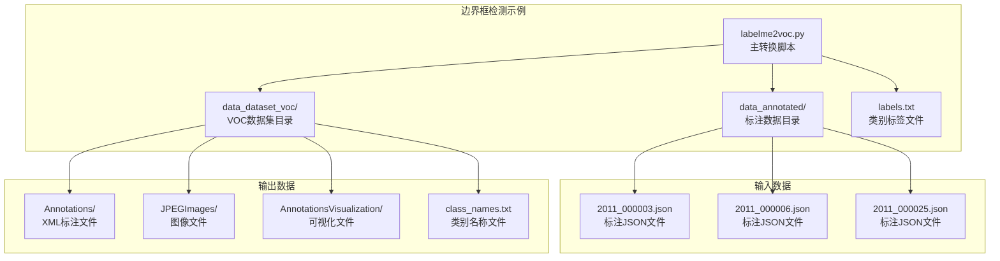
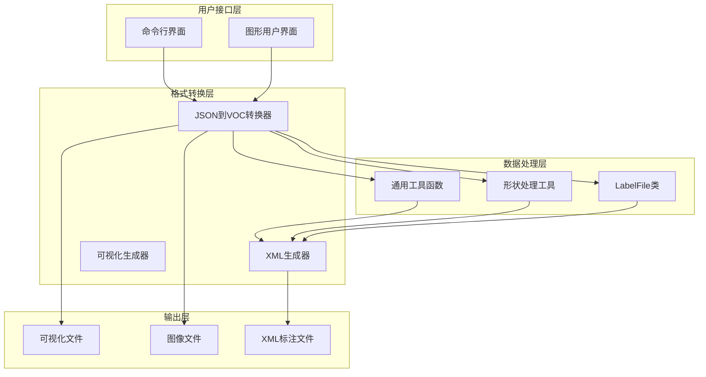
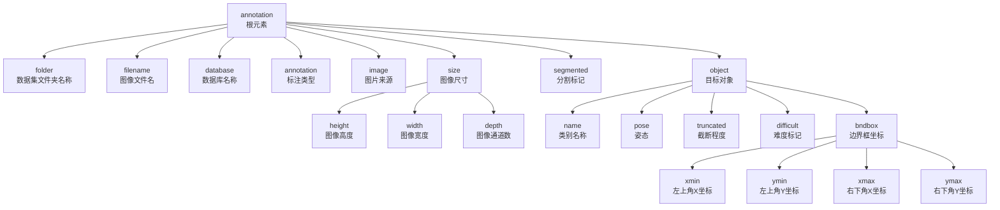
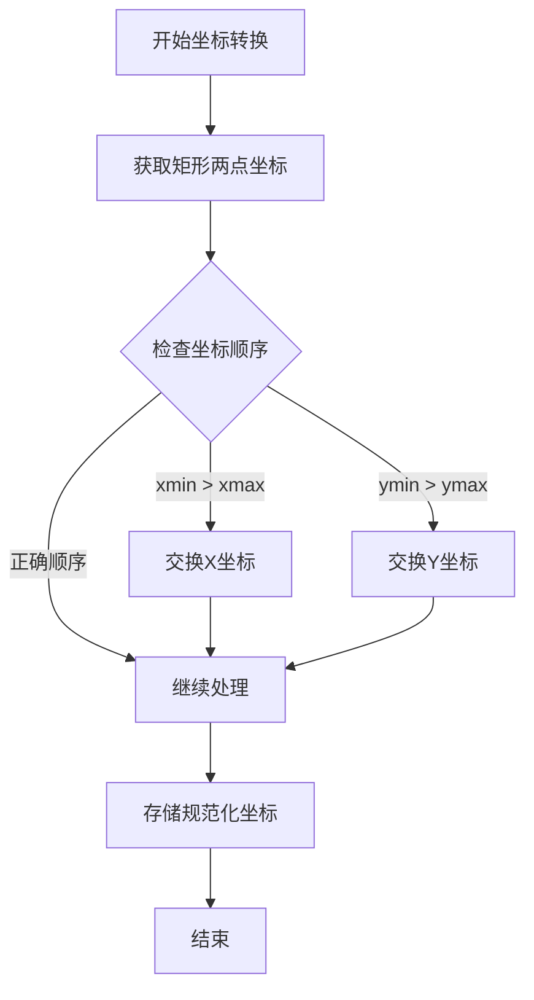
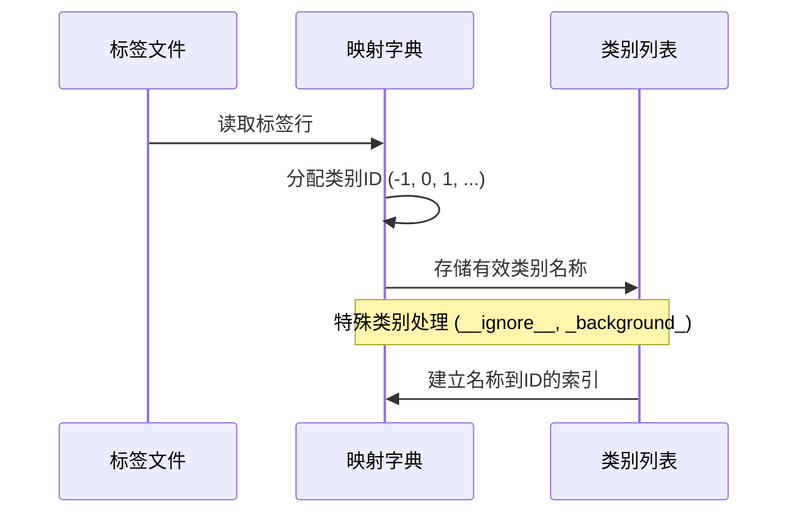
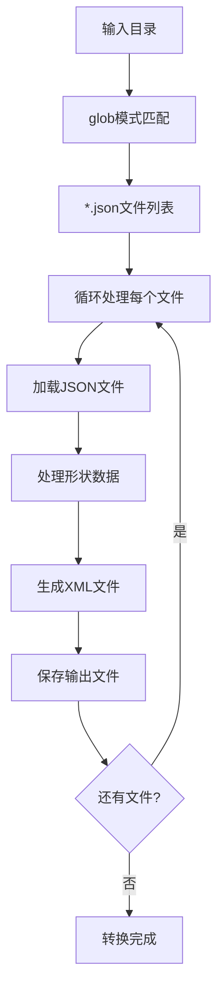
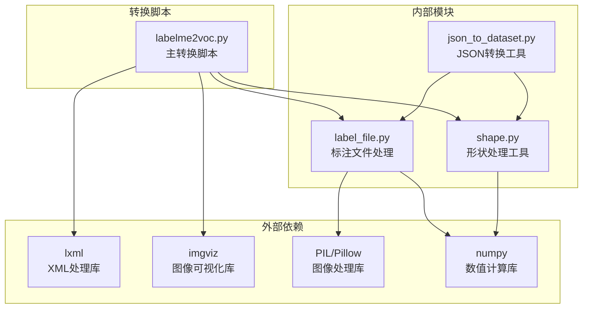
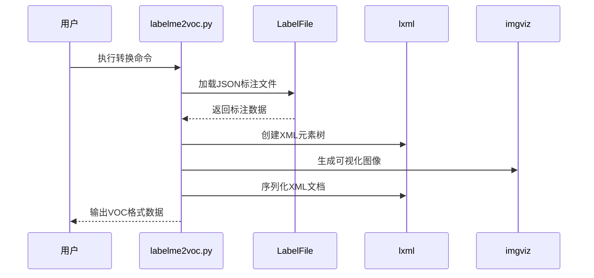
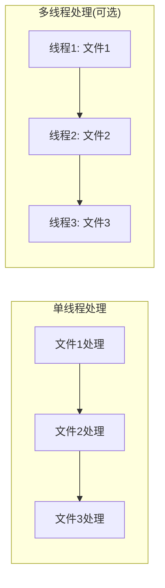

# 边界框检测格式转换

<cite>
**本文档引用的文件**
- [labelme2voc.py](file://labelme/examples/bbox_detection/labelme2voc.py)
- [README.md](file://labelme/examples/bbox_detection/README.md)
- [2011_000003.json](file://labelme/examples/bbox_detection/data_annotated/2011_000003.json)
- [2011_000003.xml](file://labelme/examples/bbox_detection/data_dataset_voc/Annotations/2011_000003.xml)
- [labels.txt](file://labelme/examples/bbox_detection/labels.txt)
- [class_names.txt](file://labelme/examples/bbox_detection/data_dataset_voc/class_names.txt)
- [labelme2voc.py](file://labelme/examples/instance_segmentation/labelme2voc.py)
- [json_to_dataset.py](file://labelme/labelme/cli/json_to_dataset.py)
- [label_file.py](file://labelme/labelme/label_file.py)
- [shape.py](file://labelme/labelme/utils/shape.py)
</cite>

## 目录
1. [简介](#简介)
2. [项目结构](#项目结构)
3. [核心组件](#核心组件)
4. [架构概览](#架构概览)
5. [详细组件分析](#详细组件分析)
6. [依赖关系分析](#依赖关系分析)
7. [性能考虑](#性能考虑)
8. [故障排除指南](#故障排除指南)
9. [结论](#结论)
10. [附录](#附录)

## 简介

本文档详细介绍了labelme项目中的边界框检测格式转换功能，重点解释了从labelme JSON格式到Pascal VOC XML格式的转换机制。该功能专门处理矩形标注的转换实现原理，涵盖了VOC格式的XML结构规范、字段映射关系和数据验证规则。

边界框检测格式转换是计算机视觉项目中的关键步骤，它将人工标注的JSON格式标注数据转换为标准的Pascal VOC格式，以便于后续的目标检测模型训练和评估。该转换过程不仅涉及简单的数据格式转换，还包括坐标系转换、类别名称映射、数据验证等多个复杂环节。

## 项目结构

边界框检测格式转换功能位于labelme项目的examples目录下，具体结构如下：



**图表来源**
- [labelme2voc.py:23-147](file://labelme/examples/bbox_detection/labelme2voc.py#L23-L147)
- [README.md:1-26](file://labelme/examples/bbox_detection/README.md#L1-L26)

**章节来源**
- [labelme2voc.py:1-147](file://labelme/examples/bbox_detection/labelme2voc.py#L1-L147)
- [README.md:1-26](file://labelme/examples/bbox_detection/README.md#L1-L26)

## 核心组件

### 主转换脚本 (labelme2voc.py)

主转换脚本是整个边界框检测格式转换功能的核心，负责处理以下关键任务：

1. **命令行参数解析**：支持输入目录、输出目录、标签文件、可视化选项等参数
2. **目录结构创建**：自动创建VOC数据集所需的目录结构
3. **类别名称处理**：读取并处理标签文件，建立类别名称到ID的映射关系
4. **JSON文件处理**：逐个处理标注的JSON文件
5. **XML文件生成**：将标注数据转换为Pascal VOC XML格式
6. **可视化生成**：可选地生成标注可视化文件

### 数据结构定义

转换过程涉及以下关键数据结构：

- **LabelFile对象**：封装JSON标注文件的所有信息
- **形状数据结构**：包含标签、点坐标、形状类型等信息
- **类别映射字典**：建立类别名称到数值ID的对应关系
- **XML元素树**：使用lxml构建Pascal VOC格式的XML结构

**章节来源**
- [labelme2voc.py:23-147](file://labelme/examples/bbox_detection/labelme2voc.py#L23-L147)
- [label_file.py:42-193](file://labelme/labelme/label_file.py#L42-L193)

## 架构概览

边界框检测格式转换的整体架构采用分层设计，从底层的数据处理到高层的格式转换，形成了清晰的处理流程：



**图表来源**
- [labelme2voc.py:23-147](file://labelme/examples/bbox_detection/labelme2voc.py#L23-L147)
- [label_file.py:103-193](file://labelme/labelme/label_file.py#L103-L193)
- [shape.py:113-167](file://labelme/labelme/utils/shape.py#L113-L167)

## 详细组件分析

### Pascal VOC XML结构规范

Pascal VOC格式的XML结构具有严格的规范要求，转换器严格按照这些规范生成XML文件：

#### XML根元素结构



**图表来源**
- [2011_000003.xml:1-38](file://labelme/examples/bbox_detection/data_dataset_voc/Annotations/2011_000003.xml#L1-L38)

#### 字段映射关系

转换器将labelme JSON格式的字段映射到Pascal VOC XML格式：

| labelme JSON字段 | Pascal VOC XML字段 | 映射说明 |
|-----------------|-------------------|----------|
| `shape["label"]` | `object/name` | 类别名称直接映射 |
| `shape["points"][0][0]` | `bndbox/xmin` | 左上角X坐标 |
| `shape["points"][0][1]` | `bndbox/ymin` | 左上角Y坐标 |
| `shape["points"][1][0]` | `bndbox/xmax` | 右下角X坐标 |
| `shape["points"][1][1]` | `bndbox/ymax` | 右下角Y坐标 |
| `imageData` | `size/height,width,depth` | 图像尺寸信息 |

### 坐标系转换实现

边界框检测涉及复杂的坐标系转换，主要包括以下方面：

#### 坐标规范化

转换器对输入的矩形坐标进行规范化处理：



**图表来源**
- [labelme2voc.py:107-113](file://labelme/examples/bbox_detection/labelme2voc.py#L107-L113)

#### 坐标精度处理

转换器保持原始坐标的精度，不进行四舍五入处理，确保转换后的边界框与原始标注保持一致。

### 类别名称映射机制

类别名称映射是转换过程中的关键环节，涉及以下处理逻辑：

#### 标签文件处理



**图表来源**
- [labelme2voc.py:43-56](file://labelme/examples/bbox_detection/labelme2voc.py#L43-L56)

#### 特殊类别处理

- `__ignore__` (ID: -1)：忽略类别，不参与训练
- `_background_` (ID: 0)：背景类别，通常作为默认类别
- 其他类别：按出现顺序分配连续ID (1, 2, 3, ...)

### 批量转换实现

批量转换功能支持同时处理多个JSON文件，实现高效的批量数据处理：

#### 文件遍历机制



**图表来源**
- [labelme2voc.py:62-142](file://labelme/examples/bbox_detection/labelme2voc.py#L62-L142)

#### 目录结构生成

批量转换自动创建标准的VOC数据集目录结构：

- `JPEGImages/`：存储转换后的图像文件
- `Annotations/`：存储对应的XML标注文件
- `AnnotationsVisualization/`：存储标注可视化文件（可选）

### 数据验证规则

转换器实施严格的数据验证规则，确保输出数据的质量：

#### 输入数据验证

1. **文件存在性验证**：检查输入目录和标签文件是否存在
2. **JSON格式验证**：验证JSON文件的完整性和有效性
3. **形状类型验证**：只处理矩形类型的标注（跳过其他形状）
4. **坐标有效性验证**：确保坐标值为有效的数字

#### 输出数据验证

1. **目录创建验证**：确保输出目录成功创建
2. **文件写入验证**：验证XML文件成功写入
3. **图像保存验证**：确保图像文件正确保存

**章节来源**
- [labelme2voc.py:33-41](file://labelme/examples/bbox_detection/labelme2voc.py#L33-L41)
- [label_file.py:103-193](file://labelme/labelme/label_file.py#L103-L193)

## 依赖关系分析

边界框检测格式转换功能涉及多个模块和库的协作，形成了复杂的依赖关系网络：



**图表来源**
- [labelme2voc.py:1-21](file://labelme/examples/bbox_detection/labelme2voc.py#L1-L21)
- [label_file.py:1-13](file://labelme/labelme/label_file.py#L1-L13)
- [shape.py:1-18](file://labelme/labelme/utils/shape.py#L1-L18)

### 关键依赖说明

1. **lxml库**：用于XML文档的创建、修改和序列化
2. **imgviz库**：提供图像可视化功能，包括边界框绘制
3. **PIL/Pillow**：处理图像数据的加载和保存
4. **numpy**：进行数值计算和数组操作

### 模块间交互

转换过程中的模块交互遵循清晰的调用关系：



**图表来源**
- [labelme2voc.py:65-142](file://labelme/examples/bbox_detection/labelme2voc.py#L65-L142)

**章节来源**
- [labelme2voc.py:1-21](file://labelme/examples/bbox_detection/labelme2voc.py#L1-L21)
- [label_file.py:103-193](file://labelme/labelme/label_file.py#L103-L193)

## 性能考虑

边界框检测格式转换功能在设计时充分考虑了性能优化，采用了多种策略来提高处理效率：

### 内存管理优化

1. **流式处理**：逐个处理JSON文件，避免一次性加载所有数据到内存
2. **图像数据处理**：直接使用内存中的图像数组，减少文件I/O操作
3. **临时变量管理**：及时释放不再使用的变量，避免内存泄漏

### I/O操作优化

1. **批量文件写入**：将XML文件写入磁盘，避免频繁的文件系统操作
2. **目录结构预创建**：在处理前预先创建所有必要的目录结构
3. **图像格式选择**：使用高效的图像保存格式（JPEG）

### 并发处理能力

虽然当前实现是单线程处理，但架构设计允许未来添加并发处理能力：



## 故障排除指南

### 常见错误及解决方案

#### 1. lxml库缺失错误

**错误信息**：`ImportError: No module named lxml`

**解决方案**：
```bash
pip install lxml
```

#### 2. 输出目录已存在错误

**错误信息**：`Output directory already exists`

**解决方案**：
```bash
# 删除现有目录后重新运行
rm -rf data_dataset_voc
python labelme2voc.py data_annotated data_dataset_voc --labels labels.txt
```

#### 3. 标签文件格式错误

**错误信息**：标签文件格式不正确

**解决方案**：
- 确保标签文件每行一个类别名称
- 检查是否有空行或特殊字符
- 确保`__ignore__`和`_background_`行的存在

#### 4. JSON文件格式错误

**错误信息**：JSON文件解析失败

**解决方案**：
- 使用JSON验证工具检查文件格式
- 确保所有必需字段都存在
- 检查文件编码是否为UTF-8

#### 5. 图像文件加载失败

**错误信息**：无法加载图像文件

**解决方案**：
- 检查图像文件路径是否正确
- 确认图像文件格式受支持
- 验证图像文件完整性

### 调试技巧

#### 启用详细日志

在转换脚本中添加调试信息：

```python
import logging
logging.basicConfig(level=logging.DEBUG)
```

#### 验证中间结果

在转换过程的关键节点验证数据：

```python
print(f"Processing file: {filename}")
print(f"Number of shapes: {len(label_file.shapes)}")
print(f"Image shape: {img.shape}")
```

#### 数据完整性检查

验证转换后的数据是否符合预期：

```python
# 检查XML文件是否正确生成
assert os.path.exists(out_xml_file)
# 检查图像文件是否正确保存
assert os.path.exists(out_img_file)
```

**章节来源**
- [labelme2voc.py:15-21](file://labelme/examples/bbox_detection/labelme2voc.py#L15-L21)
- [label_file.py:103-193](file://labelme/labelme/label_file.py#L103-L193)

## 结论

边界框检测格式转换功能为labelme项目提供了一个完整、可靠的工具，能够高效地将JSON格式的标注数据转换为标准的Pascal VOC格式。该功能具有以下特点：

1. **标准化输出**：严格按照Pascal VOC规范生成XML文件
2. **数据完整性**：保持原始标注数据的完整性和准确性
3. **自动化处理**：支持批量处理多个标注文件
4. **可视化支持**：可选地生成标注可视化文件
5. **错误处理**：完善的错误检测和处理机制

通过这个转换工具，用户可以轻松地将labelme标注的数据转换为各种深度学习框架和目标检测工具所需的格式，大大提高了数据处理的效率和一致性。

## 附录

### 命令行参数参考

| 参数 | 类型 | 必需 | 默认值 | 描述 |
|------|------|------|--------|------|
| `input_dir` | 字符串 | 是 | 无 | 输入标注文件目录 |
| `output_dir` | 字符串 | 是 | 无 | 输出VOC数据集目录 |
| `--labels` | 文件路径 | 是 | 无 | 标签文件路径 |
| `--noviz` | 标志 | 否 | False | 禁用可视化生成 |

### 实际转换示例

#### 基本转换命令

```bash
python labelme2voc.py data_annotated data_dataset_voc --labels labels.txt
```

#### 带可视化转换命令

```bash
python labelme2voc.py data_annotated data_dataset_voc --labels labels.txt --noviz
```

#### 输出目录结构

转换完成后，输出目录包含以下结构：

```
data_dataset_voc/
├── JPEGImages/
├── Annotations/
├── AnnotationsVisualization/
└── class_names.txt
```

### 最佳实践建议

1. **数据准备**：确保所有标注文件都使用矩形工具进行标注
2. **标签管理**：维护准确的标签文件，包含所有可能的类别
3. **备份策略**：在转换前备份原始标注数据
4. **验证流程**：转换后验证生成的XML文件和图像文件
5. **批处理优化**：对于大量数据，考虑分批处理以节省内存