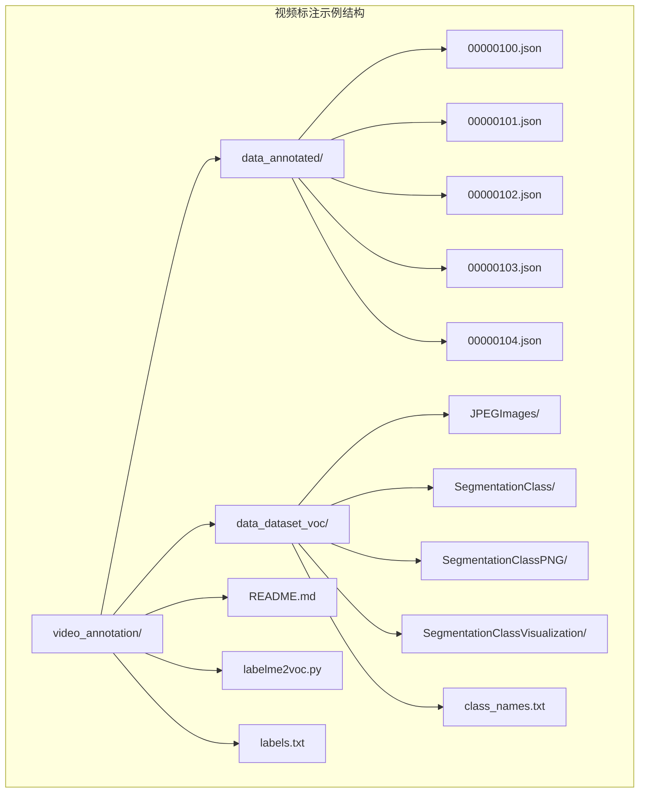
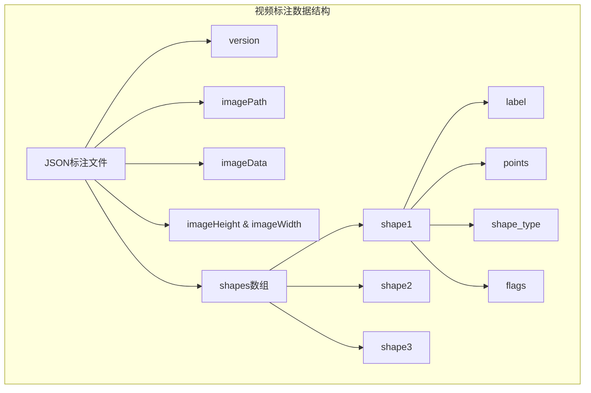
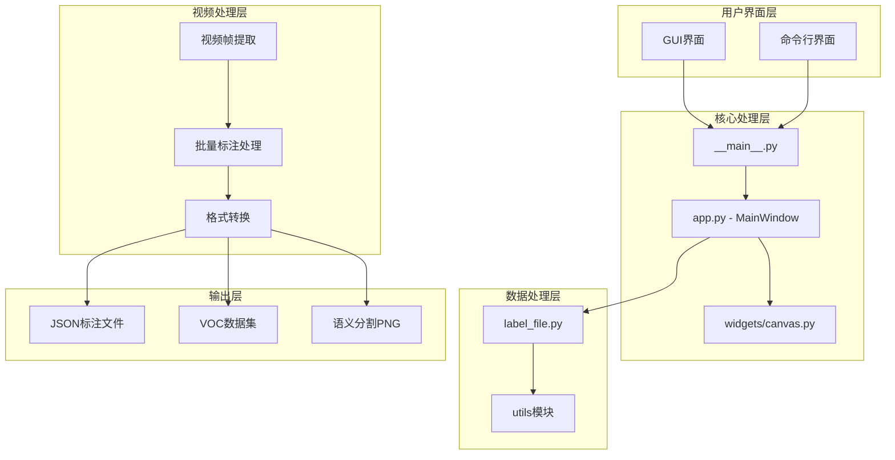
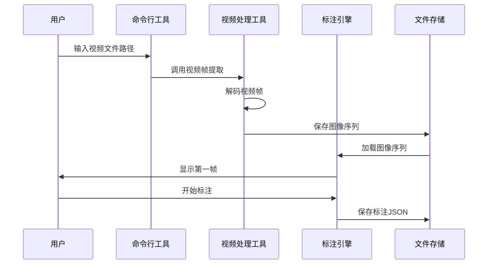
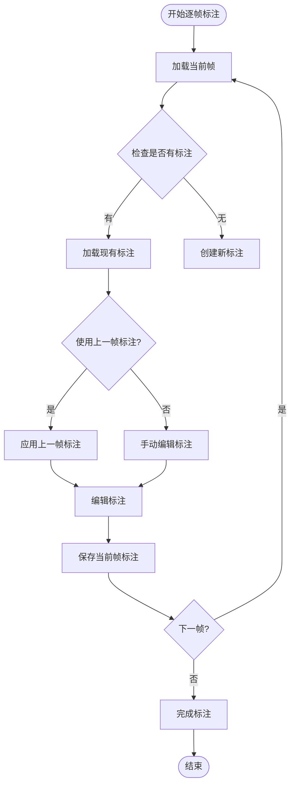
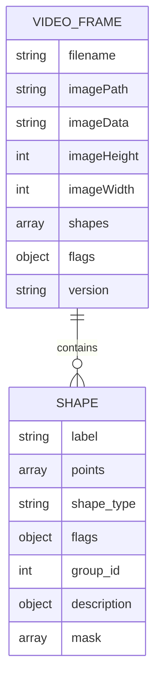
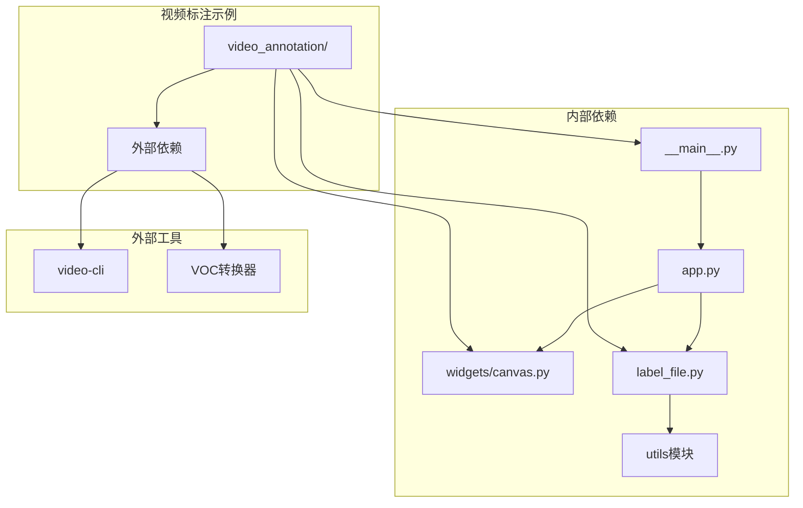
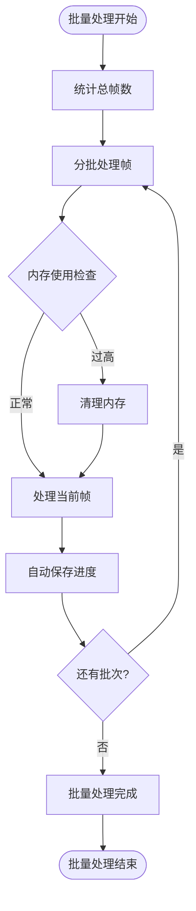
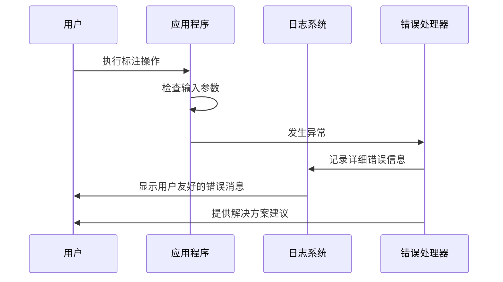

# 视频标注功能

<cite>
**本文档引用的文件**
- [README.md](file://examples/video_annotation/README.md)
- [labelme2voc.py](file://examples/video_annotation/labelme2voc.py)
- [labels.txt](file://examples/video_annotation/labels.txt)
- [00000100.json](file://examples/video_annotation/data_annotated/00000100.json)
- [class_names.txt](file://examples/video_annotation/data_dataset_voc/class_names.txt)
- [labelme2voc.py](file://examples/instance_segmentation/labelme2voc.py)
- [__main__.py](file://labelme/__main__.py)
- [label_file.py](file://labelme/label_file.py)
- [app.py](file://labelme/app.py)
- [canvas.py](file://labelme/widgets/canvas.py)
</cite>

## 目录
1. [简介](#简介)
2. [项目结构](#项目结构)
3. [核心组件](#核心组件)
4. [架构概览](#架构概览)
5. [详细组件分析](#详细组件分析)
6. [依赖关系分析](#依赖关系分析)
7. [性能考虑](#性能考虑)
8. [故障排除指南](#故障排除指南)
9. [结论](#结论)
10. [附录](#附录)

## 简介

labelme的视频标注功能是一个基于静态图像标注的扩展解决方案，专门设计用于处理视频序列的标注工作。该功能通过将视频帧序列转换为独立的图像文件，然后利用labelme强大的标注工具对每一帧进行精确标注。

视频标注与静态图像标注的核心区别在于：
- **时间维度管理**：视频标注需要处理连续的时间序列，确保相邻帧之间的标注一致性
- **批量处理能力**：支持对整个视频序列的自动化标注和转换
- **内存优化策略**：针对视频处理的特殊内存管理需求
- **格式转换机制**：提供从视频到图像序列再到标准数据集格式的完整转换链

## 项目结构

视频标注功能的项目结构围绕视频序列标注示例展开，主要包含以下关键组件：



**图表来源**
- [README.md:1-30](file://examples/video_annotation/README.md#L1-L30)
- [labels.txt:1-5](file://examples/video_annotation/labels.txt#L1-L5)

**章节来源**
- [README.md:1-30](file://examples/video_annotation/README.md#L1-L30)
- [labels.txt:1-5](file://examples/video_annotation/labels.txt#L1-L5)

## 核心组件

### 视频帧序列处理

视频标注的核心在于将视频文件转换为连续编号的图像帧序列。每个JSON标注文件对应一个视频帧，文件命名采用固定宽度的数字格式，确保自然排序的正确性。

### 标注数据结构

视频标注采用与静态图像相同的JSON格式，但增加了时间序列相关的元数据管理：



**图表来源**
- [00000100.json:1-154](file://examples/video_annotation/data_annotated/00000100.json#L1-L154)

### 标签管理系统

视频标注支持多类别标签，包括背景、前景物体等语义分割标签。标签文件采用简单的文本格式，每行一个标签名称。

**章节来源**
- [00000100.json:1-154](file://examples/video_annotation/data_annotated/00000100.json#L1-L154)
- [labels.txt:1-5](file://examples/video_annotation/labels.txt#L1-L5)

## 架构概览

视频标注功能的整体架构基于labelme的核心标注引擎，通过以下层次实现：



**图表来源**
- [__main__.py:137-359](file://labelme/__main__.py#L137-L359)
- [app.py:99-200](file://labelme/app.py#L99-L200)
- [canvas.py:39-200](file://labelme/widgets/canvas.py#L39-L200)
- [label_file.py:42-306](file://labelme/label_file.py#L42-L306)

## 详细组件分析

### 视频帧导入流程

视频标注的导入流程涉及多个步骤，从视频文件到可标注的图像序列：



**图表来源**
- [README.md:20-29](file://examples/video_annotation/README.md#L20-L29)

### 逐帧标注处理

逐帧标注是视频标注的核心功能，通过GUI界面实现对连续帧的标注：



**图表来源**
- [__main__.py:212-216](file://labelme/__main__.py#L212-L216)

### 时间轴管理机制

视频标注的时间轴管理通过文件命名约定和自然排序实现：

| 特性 | 实现方式 | 优势 |
|------|----------|------|
| 帧编号 | 固定宽度数字格式 | 确保正确的自然排序 |
| 时间戳关联 | 文件名包含时间信息 | 便于时间同步 |
| 序列完整性 | 连续编号检查 | 快速发现缺失帧 |
| 标注一致性 | 上一帧标注继承机制 | 减少重复工作 |

### 数据结构与文件组织

视频标注的数据结构与静态图像标注完全兼容，确保了向后兼容性和数据迁移的便利性：



**图表来源**
- [00000100.json:1-154](file://examples/video_annotation/data_annotated/00000100.json#L1-L154)
- [label_file.py:103-193](file://labelme/label_file.py#L103-L193)

**章节来源**
- [00000100.json:1-154](file://examples/video_annotation/data_annotated/00000100.json#L1-L154)
- [label_file.py:42-306](file://labelme/label_file.py#L42-L306)

## 依赖关系分析

视频标注功能的依赖关系相对简单，主要依赖于labelme的核心模块：



**图表来源**
- [__main__.py:1-359](file://labelme/__main__.py#L1-L359)
- [app.py:57-85](file://labelme/app.py#L57-L85)

**章节来源**
- [__main__.py:1-359](file://labelme/__main__.py#L1-L359)
- [app.py:57-85](file://labelme/app.py#L57-L85)

## 性能考虑

### 内存管理策略

视频标注由于处理大量连续帧，对内存管理提出了更高要求：

1. **按需加载策略**：只在需要时加载当前帧，避免同时加载所有帧到内存
2. **图像数据压缩**：支持禁用图像数据存储以减少JSON文件大小
3. **增量保存机制**：实时保存标注进度，防止意外退出导致的数据丢失

### 批量处理优化



### 并发处理能力

视频标注支持多实例检测，避免重复启动导致的资源冲突：

**章节来源**
- [__main__.py:29-57](file://labelme/__main__.py#L29-L57)
- [__main__.py:283-290](file://labelme/__main__.py#L283-L290)

## 故障排除指南

### 常见问题及解决方案

| 问题类型 | 症状描述 | 解决方案 |
|----------|----------|----------|
| 视频帧提取失败 | 视频文件无法转换为图像序列 | 检查video-cli安装和视频格式支持 |
| 标注文件损坏 | JSON文件无法加载 | 使用备份文件或重新标注 |
| 内存不足 | 处理大视频时内存溢出 | 启用图像数据禁用选项或分批处理 |
| 标注不一致 | 相邻帧标注差异过大 | 使用上一帧标注继承功能 |

### 错误处理机制

labelme提供了完善的错误处理和日志记录机制：



**图表来源**
- [__main__.py:306-331](file://labelme/__main__.py#L306-L331)

**章节来源**
- [__main__.py:306-331](file://labelme/__main__.py#L306-L331)

## 结论

labelme的视频标注功能通过巧妙的设计，将复杂的视频处理需求简化为用户熟悉的静态图像标注体验。其核心优势包括：

1. **无缝集成**：与现有labelme生态系统完全兼容
2. **高效处理**：支持批量处理和内存优化
3. **用户友好**：提供直观的GUI界面和命令行工具
4. **格式灵活**：支持多种输出格式和数据集转换

该功能特别适用于需要进行视频语义分割、目标跟踪和动作识别的研究项目，为计算机视觉领域的数据标注工作提供了强有力的支持。

## 附录

### 实际使用示例

#### 基本标注流程
```bash
# 将视频转换为图像序列
video-toimg your_video.mp4

# 启动labelme进行标注
labelme your_video/ --labels labels.txt --nodata --keep-prev
```

#### 高级配置选项
- `--keep-prev`: 保留上一帧的标注到当前帧
- `--nodata`: 不将图像数据存储在JSON文件中
- `--autosave`: 启用自动保存功能
- `--config`: 指定配置文件路径

### 最佳实践建议

1. **标注一致性保证**
   - 启用`--keep-prev`选项以利用相邻帧的标注相似性
   - 建立标准化的标注流程和质量检查清单
   - 定期进行标注结果的交叉验证

2. **性能优化策略**
   - 对于大型视频，考虑分批处理策略
   - 合理设置内存限制和自动保存间隔
   - 使用适当的图像分辨率平衡质量和性能

3. **质量控制方法**
   - 建立多轮标注和审核流程
   - 使用可视化工具检查标注质量
   - 定期备份标注数据以防意外丢失