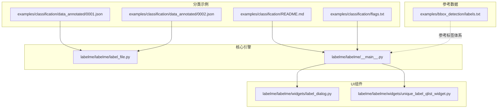
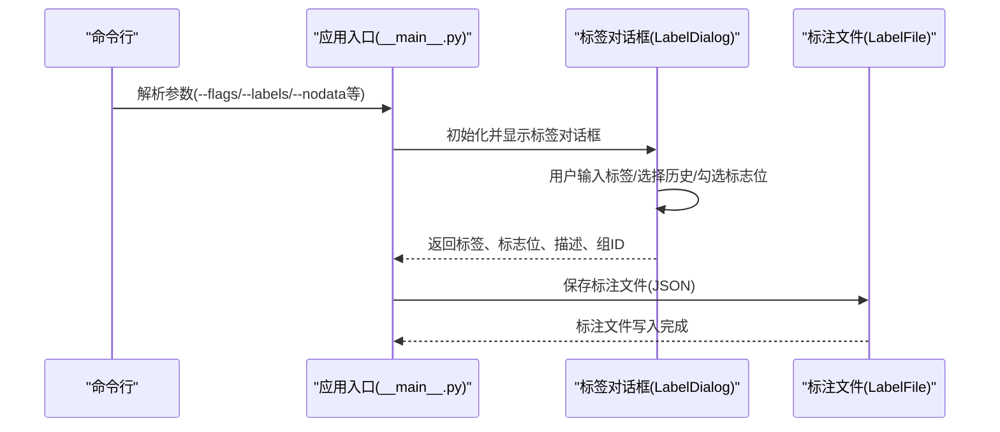
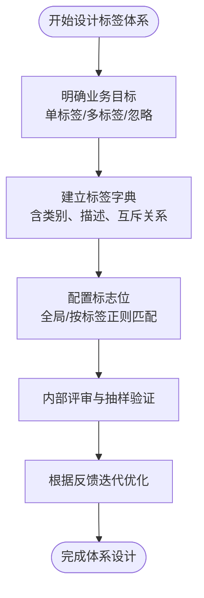
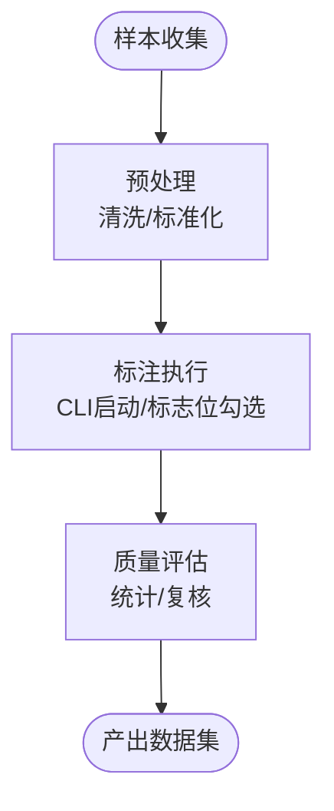
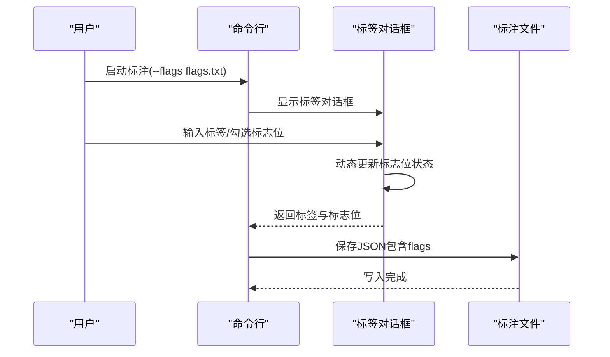
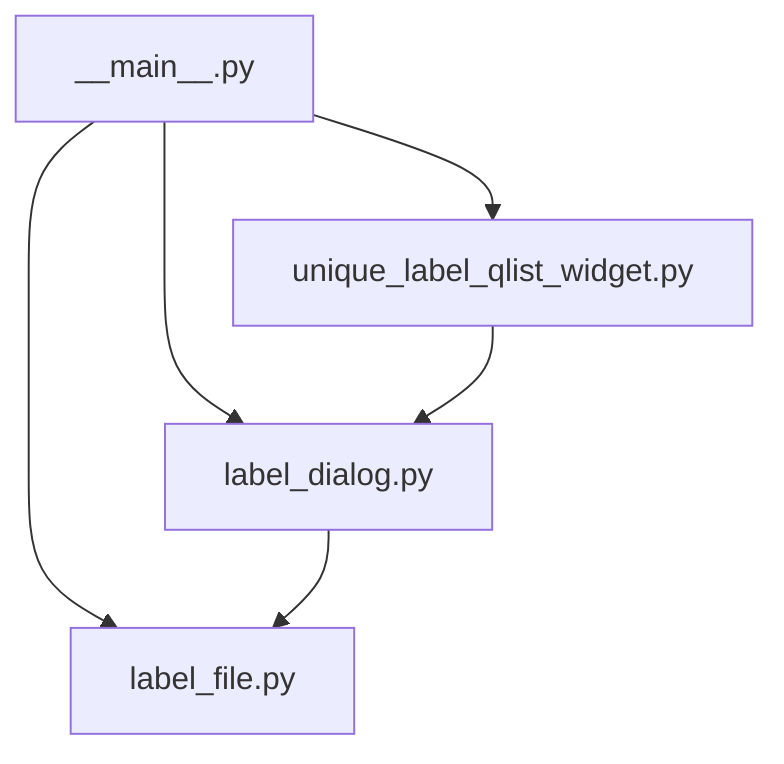

# 分类标注示例

<cite>
**本文档引用的文件**
- [README.md](file://labelme/examples/classification/README.md)
- [flags.txt](file://labelme/examples/classification/flags.txt)
- [0001.json](file://labelme/examples/classification/data_annotated/0001.json)
- [0002.json](file://labelme/examples/classification/data_annotated/0002.json)
- [label_file.py](file://labelme/labelme/label_file.py)
- [label_dialog.py](file://labelme/labelme/widgets/label_dialog.py)
- [unique_label_qlist_widget.py](file://labelme/labelme/widgets/unique_label_qlist_widget.py)
- [__main__.py](file://labelme/labelme/__main__.py)
- [labels.txt](file://labelme/examples/bbox_detection/labels.txt)
</cite>

## 目录
1. [简介](#简介)
2. [项目结构](#项目结构)
3. [核心组件](#核心组件)
4. [架构总览](#架构总览)
5. [详细组件分析](#详细组件分析)
6. [依赖分析](#依赖分析)
7. [性能考虑](#性能考虑)
8. [故障排除指南](#故障排除指南)
9. [结论](#结论)
10. [附录](#附录)

## 简介
本文件面向产品分类、内容审核与科学研究等场景，提供基于图像分类标注的完整示例文档。内容涵盖单标签与多标签分类任务的标注方法与最佳实践，分类标准制定、标签体系设计与标注一致性保障策略，以及从样本收集、预处理到质量评估的全流程数据集构建方法。同时，结合仓库中的分类示例与核心标注文件解析能力，给出分类标志位的使用方法与数据统计分析建议。

## 项目结构
本项目包含丰富的示例与核心标注引擎。与分类标注直接相关的关键目录与文件如下：
- 分类示例：examples/classification
  - README.md：使用说明与示例截图
  - flags.txt：分类标志位定义
  - data_annotated：标注后的JSON示例
- 核心标注引擎：labelme/label_file.py
  - 负责加载/保存标注文件，解析flags字段，管理图像元数据
- 用户界面组件：labelme/widgets/*
  - label_dialog.py：标签对话框，支持标志位管理与描述输入
  - unique_label_qlist_widget.py：唯一标签列表组件
- 应用入口：labelme/labelme/__main__.py
  - 命令行参数解析，支持flags、labels、label_flags等配置
- 其他参考：examples/bbox_detection/labels.txt
  - VOC类别清单，可用于参考标签体系设计

**图表来源**
- [README.md:1-12](file://labelme/examples/classification/README.md#L1-L12)
- [flags.txt:1-4](file://labelme/examples/classification/flags.txt#L1-L4)
- [0001.json:1-13](file://labelme/examples/classification/data_annotated/0001.json#L1-L13)
- [0002.json:1-13](file://labelme/examples/classification/data_annotated/0002.json#L1-L13)
- [label_file.py:42-193](file://labelme/labelme/label_file.py#L42-L193)
- [__main__.py:137-230](file://labelme/labelme/__main__.py#L137-L230)
- [label_dialog.py:51-167](file://labelme/labelme/widgets/label_dialog.py#L51-L167)
- [unique_label_qlist_widget.py:15-94](file://labelme/labelme/widgets/unique_label_qlist_widget.py#L15-L94)
- [labels.txt:1-22](file://labelme/examples/bbox_detection/labels.txt#L1-L22)

**章节来源**
- [README.md:1-12](file://labelme/examples/classification/README.md#L1-L12)
- [flags.txt:1-4](file://labelme/examples/classification/flags.txt#L1-L4)
- [0001.json:1-13](file://labelme/examples/classification/data_annotated/0001.json#L1-L13)
- [0002.json:1-13](file://labelme/examples/classification/data_annotated/0002.json#L1-L13)
- [label_file.py:42-193](file://labelme/labelme/label_file.py#L42-L193)
- [label_dialog.py:51-167](file://labelme/labelme/widgets/label_dialog.py#L51-L167)
- [unique_label_qlist_widget.py:15-94](file://labelme/labelme/widgets/unique_label_qlist_widget.py#L15-L94)
- [__main__.py:137-230](file://labelme/labelme/__main__.py#L137-L230)
- [labels.txt:1-22](file://labelme/examples/bbox_detection/labels.txt#L1-L22)

## 核心组件
- 标注文件解析器（LabelFile）
  - 负责加载/保存JSON标注文件，解析flags字段（图像级标志位），校验图像尺寸，处理图像数据编码/解码
  - 关键字段：flags、imagePath、imageData、imageHeight、imageWidth、shapes
- 标签对话框（LabelDialog）
  - 提供标签输入、历史管理、标志位（flags）动态更新、描述输入与自动完成
- 唯一标签列表（UniqueLabelQListWidget）
  - 管理唯一标签集合，支持带颜色的标签显示与选择
- 应用入口（__main__.py）
  - 命令行参数解析，支持flags、labels、label_flags、--nodata等选项；加载配置与国际化资源

**章节来源**
- [label_file.py:42-193](file://labelme/labelme/label_file.py#L42-L193)
- [label_dialog.py:51-167](file://labelme/labelme/widgets/label_dialog.py#L51-L167)
- [unique_label_qlist_widget.py:15-94](file://labelme/labelme/widgets/unique_label_qlist_widget.py#L15-L94)
- [__main__.py:137-230](file://labelme/labelme/__main__.py#L137-L230)

## 架构总览
下图展示了分类标注从命令行启动到UI交互、再到标注文件解析的整体流程。

**图表来源**
- [__main__.py:137-230](file://labelme/labelme/__main__.py#L137-L230)
- [label_dialog.py:336-411](file://labelme/labelme/widgets/label_dialog.py#L336-L411)
- [label_file.py:225-291](file://labelme/labelme/label_file.py#L225-L291)

## 详细组件分析

### 分类标志位与标签体系设计
- 分类标志位（flags）
  - 示例中包含通用忽略标志与具体类别标志，支持单标签或多标签组合标注
  - 标志位在JSON中以键值对形式存储，布尔值表示是否启用
- 标签体系设计建议
  - 明确类别层级与互斥关系（单标签 vs 多标签）
  - 设计统一的命名规范与描述模板，便于后续统计与模型训练
  - 参考VOC类别清单，建立可扩展的标签字典

**图表来源**
- [flags.txt:1-4](file://labelme/examples/classification/flags.txt#L1-L4)
- [labels.txt:1-22](file://labelme/examples/bbox_detection/labels.txt#L1-L22)

**章节来源**
- [flags.txt:1-4](file://labelme/examples/classification/flags.txt#L1-L4)
- [labels.txt:1-22](file://labelme/examples/bbox_detection/labels.txt#L1-L22)

### 标注一致性保证
- 标准化流程
  - 统一的标注规范与检查清单
  - 建立复核机制与争议解决流程
- 工具辅助
  - 使用标签历史与自动完成减少输入偏差
  - 唯一标签列表确保标签一致性
- 质量控制
  - 抽样复核与Kappa一致性检验
  - 标注者间可靠性评估

**章节来源**
- [label_dialog.py:183-195](file://labelme/labelme/widgets/label_dialog.py#L183-L195)
- [unique_label_qlist_widget.py:35-68](file://labelme/labelme/widgets/unique_label_qlist_widget.py#L35-L68)

### 数据集构建流程
- 样本收集
  - 明确采集范围与分布均衡要求
  - 建立元数据表（来源、时间、设备、环境条件）
- 预处理
  - 图像去噪、标准化尺寸、色彩校正
  - 标注前数据清洗与异常剔除
- 标注执行
  - 使用命令行启动标注，加载标志位配置
  - 在UI中逐图标注，勾选相应标志位
- 质量评估
  - 统计各标签分布、标注耗时、错误率
  - 交叉验证与专家复核

**图表来源**
- [README.md:4-8](file://labelme/examples/classification/README.md#L4-L8)
- [__main__.py:137-230](file://labelme/labelme/__main__.py#L137-L230)

**章节来源**
- [README.md:4-8](file://labelme/examples/classification/README.md#L4-L8)
- [__main__.py:137-230](file://labelme/labelme/__main__.py#L137-L230)

### 分类标志位的使用方法
- 命令行加载标志位
  - 通过--flags参数传入标志位文件或逗号分隔列表
  - 支持按标签正则匹配动态更新标志位状态
- UI交互
  - 标签对话框根据输入文本匹配规则，动态显示对应标志位
  - 支持勾选/取消勾选，实时更新JSON中的flags字段
- JSON结构
  - 图像级flags字典，键为标志位名称，值为布尔状态
  - 示例文件展示单标签与多标签的典型结构

**图表来源**
- [__main__.py:231-250](file://labelme/labelme/__main__.py#L231-L250)
- [label_dialog.py:249-266](file://labelme/labelme/widgets/label_dialog.py#L249-L266)
- [label_file.py:225-291](file://labelme/labelme/label_file.py#L225-L291)
- [0001.json:3-7](file://labelme/examples/classification/data_annotated/0001.json#L3-L7)
- [0002.json:3-7](file://labelme/examples/classification/data_annotated/0002.json#L3-L7)

**章节来源**
- [__main__.py:231-250](file://labelme/labelme/__main__.py#L231-L250)
- [label_dialog.py:249-266](file://labelme/labelme/widgets/label_dialog.py#L249-L266)
- [label_file.py:225-291](file://labelme/labelme/label_file.py#L225-L291)
- [0001.json:3-7](file://labelme/examples/classification/data_annotated/0001.json#L3-L7)
- [0002.json:3-7](file://labelme/examples/classification/data_annotated/0002.json#L3-L7)

### 数据统计分析
- 标签分布统计
  - 统计各类别出现频次与占比，识别长尾与不平衡问题
- 时间序列分析
  - 按天/周统计标注进度，评估标注效率
- 一致性分析
  - 计算标注者间一致性指标（如Cohen's Kappa）
- 质量度量
  - 错误率、漏标率、误标率等指标随迭代优化趋势

**章节来源**
- [label_file.py:103-193](file://labelme/labelme/label_file.py#L103-L193)

## 依赖分析
- 组件耦合
  - 应用入口与UI组件松耦合，通过参数与事件交互
  - 标注文件解析器独立于UI，专注于数据结构处理
- 外部依赖
  - PyQt5用于GUI交互
  - Pillow用于图像读取与EXIF方向处理
  - YAML用于配置解析

**图表来源**
- [__main__.py:137-230](file://labelme/labelme/__main__.py#L137-L230)
- [label_dialog.py:51-167](file://labelme/labelme/widgets/label_dialog.py#L51-L167)
- [unique_label_qlist_widget.py:15-94](file://labelme/labelme/widgets/unique_label_qlist_widget.py#L15-L94)
- [label_file.py:42-193](file://labelme/labelme/label_file.py#L42-L193)

**章节来源**
- [__main__.py:137-230](file://labelme/labelme/__main__.py#L137-L230)
- [label_dialog.py:51-167](file://labelme/labelme/widgets/label_dialog.py#L51-L167)
- [unique_label_qlist_widget.py:15-94](file://labelme/labelme/widgets/unique_label_qlist_widget.py#L15-L94)
- [label_file.py:42-193](file://labelme/labelme/label_file.py#L42-L193)

## 性能考虑
- 图像I/O
  - 使用Pillow高效读取与保存，注意EXIF方向处理
- JSON解析
  - 大型标注文件建议分批处理与增量保存
- UI响应
  - 标签历史与自动完成需控制列表规模，避免卡顿
- 存储策略
  - 可选禁存图像数据（--nodata）以减小JSON体积

**章节来源**
- [label_file.py:72-101](file://labelme/labelme/label_file.py#L72-L101)
- [label_file.py:225-291](file://labelme/labelme/label_file.py#L225-L291)
- [__main__.py:166-171](file://labelme/labelme/__main__.py#L166-L171)

## 故障排除指南
- 标注文件加载失败
  - 检查JSON结构完整性与flags字段格式
  - 确认imageData与imagePath/实际图像尺寸一致
- 图像尺寸不匹配
  - 系统会自动以实际尺寸覆盖JSON记录并记录错误日志
- 标志位未生效
  - 确认标签正则匹配规则与输入文本一致
  - 检查flags文件格式与编码
- UI交互异常
  - 确认PyQt5安装与版本兼容性
  - 检查本地化资源加载路径

**章节来源**
- [label_file.py:103-193](file://labelme/labelme/label_file.py#L103-L193)
- [label_file.py:195-223](file://labelme/labelme/label_file.py#L195-L223)
- [label_dialog.py:249-266](file://labelme/labelme/widgets/label_dialog.py#L249-L266)
- [__main__.py:231-250](file://labelme/labelme/__main__.py#L231-L250)

## 结论
本示例文档基于仓库中的分类示例与核心标注引擎，系统阐述了单标签与多标签分类的标注方法、标志位使用、标签体系设计与一致性保障策略，并提供了从样本收集到质量评估的完整数据集构建流程。通过命令行参数与UI交互的配合，能够高效地完成大规模图像分类标注任务，并为产品分类、内容审核与科学研究提供高质量的数据基础。

## 附录
- 快速开始
  - 使用命令行加载标志位并启动标注
  - 在UI中输入标签并勾选相应标志位
  - 导出JSON标注文件，进行后续统计与分析

**章节来源**
- [README.md:4-8](file://labelme/examples/classification/README.md#L4-L8)
- [__main__.py:137-230](file://labelme/labelme/__main__.py#L137-L230)