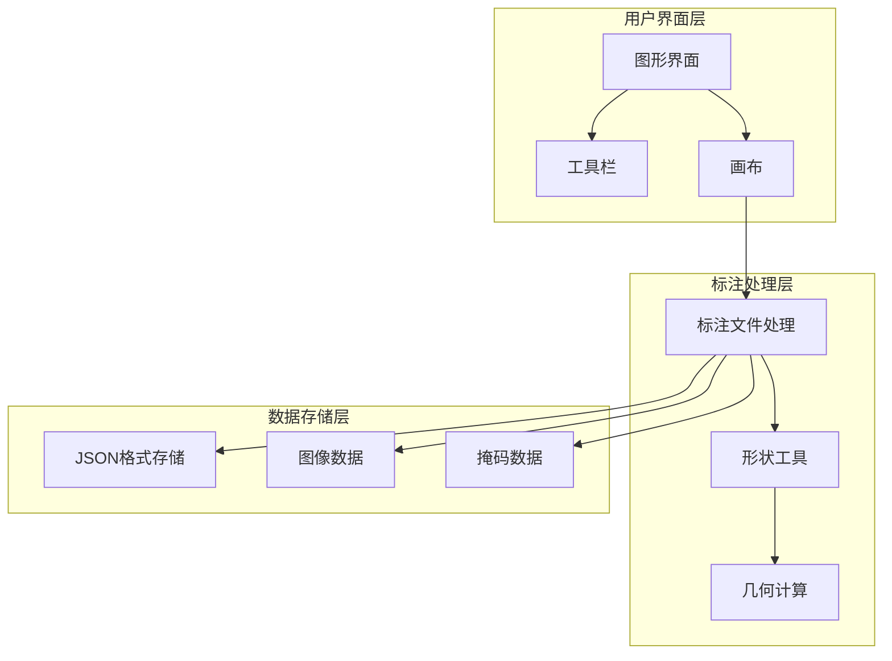
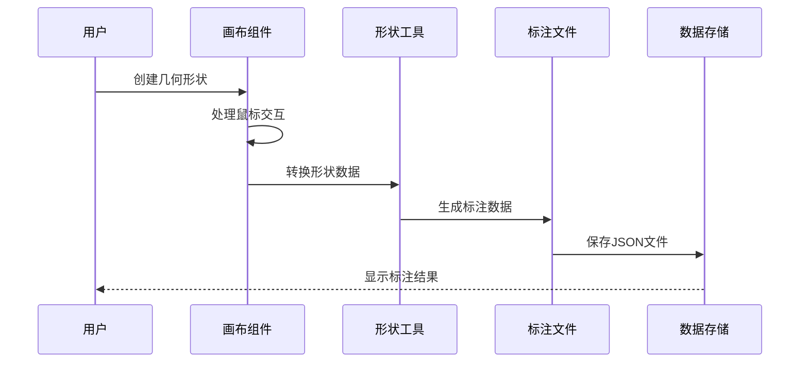
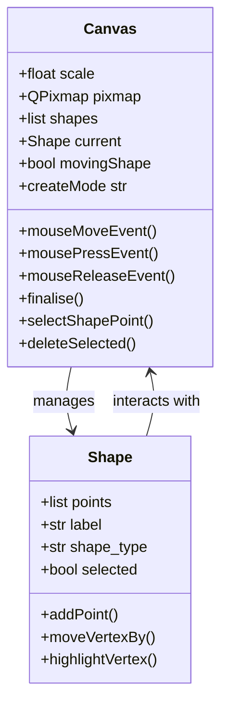
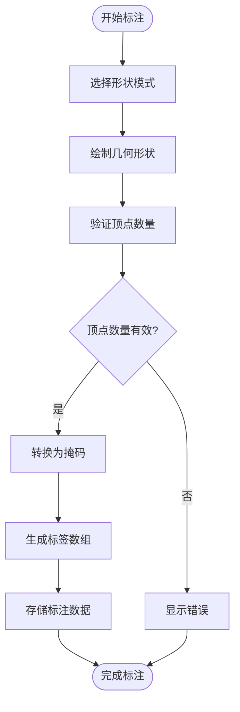
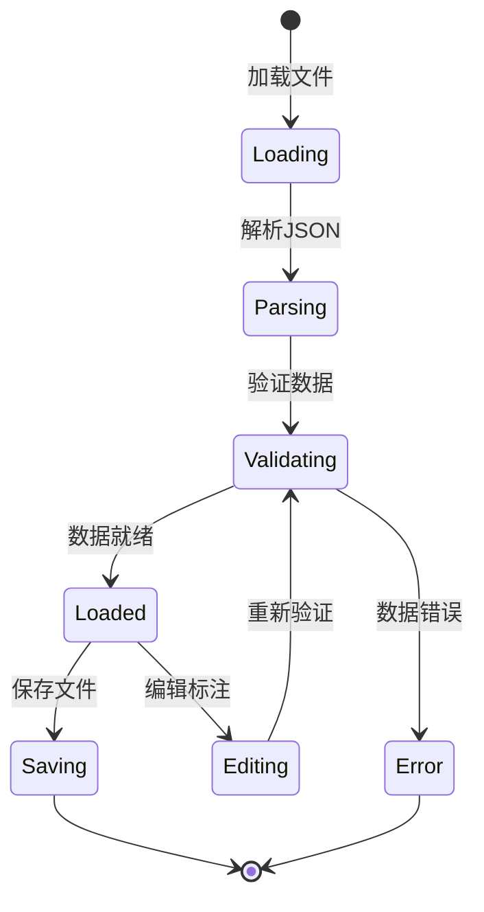

# 基础几何标注示例

<cite>
**本文档引用的文件**
- [primitives.json](file://examples/primitives/primitives.json)
- [shape.py](file://labelme/utils/shape.py)
- [canvas.py](file://labelme/widgets/canvas.py)
- [qt.py](file://labelme/utils/qt.py)
- [label_file.py](file://labelme/label_file.py)
- [README.md](file://README.md)
- [apc2016_obj3.json](file://examples/tutorial/apc2016_obj3.json)
- [tool_bar.py](file://labelme/widgets/tool_bar.py)
</cite>

## 目录
1. [简介](#简介)
2. [项目结构](#项目结构)
3. [核心组件](#核心组件)
4. [架构概览](#架构概览)
5. [详细组件分析](#详细组件分析)
6. [几何元素标注详解](#几何元素标注详解)
7. [几何标注应用场景](#几何标注应用场景)
8. [精确标注技巧](#精确标注技巧)
9. [性能考虑](#性能考虑)
10. [故障排除指南](#故障排除指南)
11. [结论](#结论)

## 简介

Labelme 是一个基于 Python 的图形化图像标注工具，专门用于创建高质量的标注数据集。本文档专注于基础几何元素标注，详细介绍点、线、矩形、圆形等基本几何图形的标注方法和应用场景。

几何元素在 CAD 制图、工程设计和科学计算中扮演着至关重要的角色。通过精确的几何标注，可以：
- 在 CAD 制图中创建精确的工程图纸
- 在机械制图中定义零部件的几何特征
- 在地理信息系统中标记地理位置和区域
- 在计算机视觉任务中提供精确的边界框和多边形标注

## 项目结构

Labelme 项目采用模块化架构设计，主要包含以下核心组件：

**图表来源**
- [README.md:1-262](file://README.md#L1-L262)
- [label_file.py:42-306](file://labelme/label_file.py#L42-L306)

**章节来源**
- [README.md:1-262](file://README.md#L1-L262)

## 核心组件

### 几何形状处理模块

Labelme 的几何形状处理能力由 `shape.py` 模块提供，该模块包含了将用户绘制的几何形状转换为计算机视觉算法可用格式的核心功能。

### 画布交互系统

`canvas.py` 模块定义了 Canvas 类，这是 Labelme 中负责绘图和交互的核心组件。它提供了完整的绘图功能，包括多种形状类型的创建和编辑。

### 标注文件管理

`label_file.py` 模块负责处理 Labelme 标注文件的加载、保存和管理，采用 JSON 格式存储标注数据。

**章节来源**
- [shape.py:1-233](file://labelme/utils/shape.py#L1-L233)
- [canvas.py:39-800](file://labelme/widgets/canvas.py#L39-L800)
- [label_file.py:42-306](file://labelme/label_file.py#L42-L306)

## 架构概览

Labelme 的几何标注系统采用分层架构设计，确保了良好的可扩展性和维护性：

**图表来源**
- [canvas.py:372-441](file://labelme/widgets/canvas.py#L372-L441)
- [shape.py:41-110](file://labelme/utils/shape.py#L41-L110)
- [label_file.py:225-290](file://labelme/label_file.py#L225-L290)

## 详细组件分析

### Canvas 画布组件

Canvas 类是 Labelme 的核心交互组件，提供了丰富的几何形状创建和编辑功能：

**图表来源**
- [canvas.py:39-800](file://labelme/widgets/canvas.py#L39-L800)

Canvas 组件的关键特性包括：
- **多模式支持**：支持多边形、矩形、圆形、线条、点、线条带等多种形状模式
- **交互功能**：提供鼠标拖拽、双击、键盘快捷键等交互方式
- **编辑功能**：支持形状的选择、移动、删除和顶点编辑
- **撤销重做**：提供完整的撤销和重做机制

**章节来源**
- [canvas.py:39-800](file://labelme/widgets/canvas.py#L39-L800)

### 形状工具模块

`shape.py` 模块提供了几何形状处理的核心功能：

**图表来源**
- [shape.py:41-110](file://labelme/utils/shape.py#L41-L110)

**章节来源**
- [shape.py:1-233](file://labelme/utils/shape.py#L1-L233)

### 标注文件处理

`label_file.py` 模块负责处理标注文件的完整生命周期：

**图表来源**
- [label_file.py:103-193](file://labelme/label_file.py#L103-L193)

**章节来源**
- [label_file.py:42-306](file://labelme/label_file.py#L42-L306)

## 几何元素标注详解

### 点标注

点是最基本的几何元素，用于标记特定位置：

**点标注特点**：
- 使用单个坐标点表示
- 适合标记关键位置、特征点
- 支持点大小调整
- 可与其他几何元素组合使用

**标注技巧**：
- 使用点大小工具调整点的可见性
- 在复杂场景中合理分布点的位置
- 结合其他几何元素进行精确定位

### 线条标注

线条用于表示边界、轮廓或方向信息：

**线条标注特点**：
- 由两个端点定义
- 支持线宽调节
- 可创建连续的线条带
- 适合表示边缘、轨迹等

**标注技巧**：
- 使用吸附功能确保线条平滑
- 合理设置线宽以适应不同分辨率
- 对于复杂边界，使用线条带模式

### 矩形标注

矩形是最常用的几何元素，特别适合边界框标注：

**矩形标注特点**：
- 由对角线两端点定义
- 自动生成四个顶点
- 支持填充和描边
- 适合快速标注矩形区域

**标注技巧**：
- 利用矩形模式的自动对角线功能
- 在图像缩放时保持矩形比例
- 结合其他工具进行精确调整

### 圆形标注

圆形用于表示圆形或椭圆形特征：

**圆形标注特点**：
- 由圆心和圆周上的点定义
- 支持椭圆形状
- 自动计算半径
- 适合标注圆形孔洞、圆形物体等

**标注技巧**：
- 确保圆心点位于正确位置
- 调整圆周点以控制半径大小
- 对于倾斜的椭圆，使用多边形模式

### 多边形标注

多边形是最灵活的几何元素，可以表示任意复杂形状：

**多边形标注特点**：
- 支持任意数量的顶点
- 可创建复杂的不规则形状
- 自动闭合边界
- 适合精确标注不规则物体

**标注技巧**：
- 使用双击功能自动闭合多边形
- 启用顶点吸附功能提高精度
- 对于复杂边界，分段绘制更易控制

**章节来源**
- [primitives.json:1-162](file://examples/primitives/primitives.json#L1-L162)

## 几何标注应用场景

### CAD 制图领域

在 CAD 制图中，几何标注主要用于：
- **工程图纸标注**：精确标注尺寸、公差和材料信息
- **装配图标注**：标记零部件的装配关系和配合尺寸
- **建筑平面图**：标注房间尺寸、门窗位置和墙体厚度

### 机械制图应用

机械制图中的几何标注典型应用：
- **零件图标注**：标注轴类、盘类、壳体类零件的关键尺寸
- **装配图标注**：标注装配间隙、配合关系和定位尺寸
- **工艺图标注**：标注加工工艺和检验要求

### 地理信息系统

GIS 系统中的几何标注应用：
- **地图要素标注**：标注道路、河流、建筑物等地理要素
- **行政区划标注**：标注省市区县边界和行政中心
- **专题要素标注**：标注人口密度、植被覆盖等专题要素

### 计算机视觉

计算机视觉任务中的几何标注：
- **目标检测**：使用矩形边界框标注目标位置
- **语义分割**：使用多边形精确标注物体轮廓
- **实例分割**：为每个实例创建独立的几何标注

**章节来源**
- [README.md:43-51](file://README.md#L43-L51)

## 精确标注技巧

### 几何精度控制

为了确保几何标注的精确性，需要掌握以下技巧：

**坐标精度**：
- 使用网格吸附功能确保点对齐到网格
- 启用坐标显示功能实时监控坐标变化
- 对于微小偏差，使用键盘微调功能

**形状精度**：
- 利用约束功能保持形状比例和角度
- 使用测量工具验证几何尺寸
- 定期检查标注的一致性和准确性

### 尺寸测量方法

Labelme 提供了多种尺寸测量工具：

**直线距离测量**：
- 使用线条工具测量两点间的直线距离
- 利用坐标系统计算精确距离值
- 支持像素单位和实际物理单位转换

**角度测量**：
- 通过两条线段的夹角计算角度值
- 使用辅助线工具确保测量精度
- 支持度、弧度等多种角度单位

**面积计算**：
- 对于封闭几何形状，自动计算其面积
- 支持多边形、矩形、圆形等形状的面积计算
- 可根据图像分辨率进行实际面积换算

### 形状验证方法

为了确保标注质量，需要建立完善的形状验证体系：

**几何一致性检查**：
- 验证多边形的顶点顺序和方向
- 检查矩形的直角特性和平行边特性
- 确认圆形的对称性和均匀性

**拓扑关系验证**：
- 检查几何元素间的包含、相交、分离关系
- 验证边界连接的完整性
- 确认重叠区域的正确标注

**质量评估指标**：
- 建立标注准确性的量化标准
- 设计批注质量的评估流程
- 实施标注审核和修正机制

**章节来源**
- [qt.py:167-197](file://labelme/utils/qt.py#L167-L197)

## 性能考虑

### 内存优化

Labelme 在处理大量几何标注时需要考虑内存使用：

**数据结构优化**：
- 使用高效的几何数据结构存储形状信息
- 实现数据压缩算法减少内存占用
- 采用延迟加载策略优化大图像处理

**垃圾回收管理**：
- 及时释放不再使用的几何对象
- 实现对象池减少频繁分配
- 监控内存使用情况及时预警

### 处理速度优化

为了提升几何标注的响应速度：

**算法优化**：
- 使用高效的几何算法处理形状变换
- 实现增量更新机制避免全量重绘
- 采用多线程技术提升并发处理能力

**渲染优化**：
- 实现虚拟滚动处理大量标注元素
- 采用分层渲染减少重绘开销
- 优化图形缓存提高渲染效率

## 故障排除指南

### 常见问题及解决方案

**标注数据丢失**：
- 确保定期保存标注文件
- 检查文件权限和磁盘空间
- 使用自动备份功能防止意外丢失

**几何形状变形**：
- 检查图像缩放比例设置
- 验证坐标系统的一致性
- 重新加载图像文件修复损坏

**软件崩溃问题**：
- 更新到最新版本修复已知bug
- 检查系统兼容性和依赖库
- 减少同时打开的文件数量

### 调试工具使用

Labelme 提供了多种调试工具帮助问题诊断：

**日志分析**：
- 启用详细日志记录追踪问题
- 分析错误日志定位问题根源
- 使用日志过滤功能快速找到关键信息

**性能监控**：
- 监控内存使用情况避免溢出
- 跟踪CPU使用率优化性能瓶颈
- 分析渲染时间找出优化点

**数据验证**：
- 使用内置验证工具检查数据完整性
- 实现数据一致性检查机制
- 建立数据质量评估标准

**章节来源**
- [label_file.py:33-40](file://labelme/label_file.py#L33-L40)

## 结论

Labelme 的几何标注系统为 CAD 制图、工程设计和科学计算提供了强大而灵活的工具。通过深入理解几何元素的标注方法、应用场景和精确技巧，用户可以创建高质量的标注数据，为后续的计算机视觉任务和工程应用奠定坚实基础。

随着技术的不断发展，Labelme 的几何标注功能将继续演进，为用户提供更加智能化、自动化的标注体验。建议用户关注项目的更新动态，及时学习新的功能特性和最佳实践。

通过本文档介绍的方法和技巧，用户可以：
- 掌握各种几何元素的精确标注方法
- 了解不同应用场景的最佳实践
- 提升标注质量和工作效率
- 为专业的 CAD 和计算机视觉应用做好准备