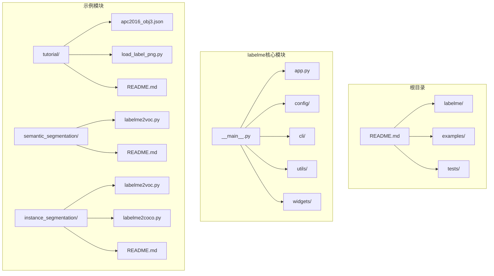
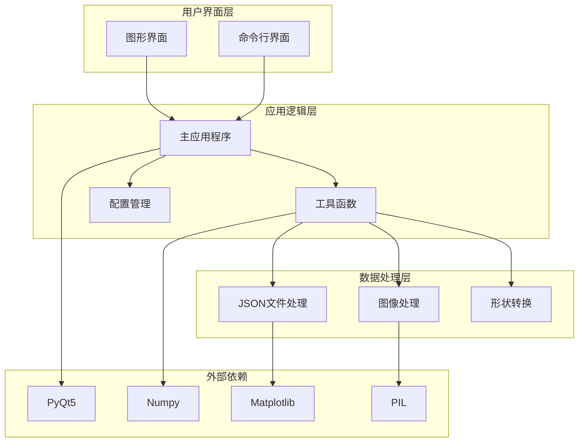
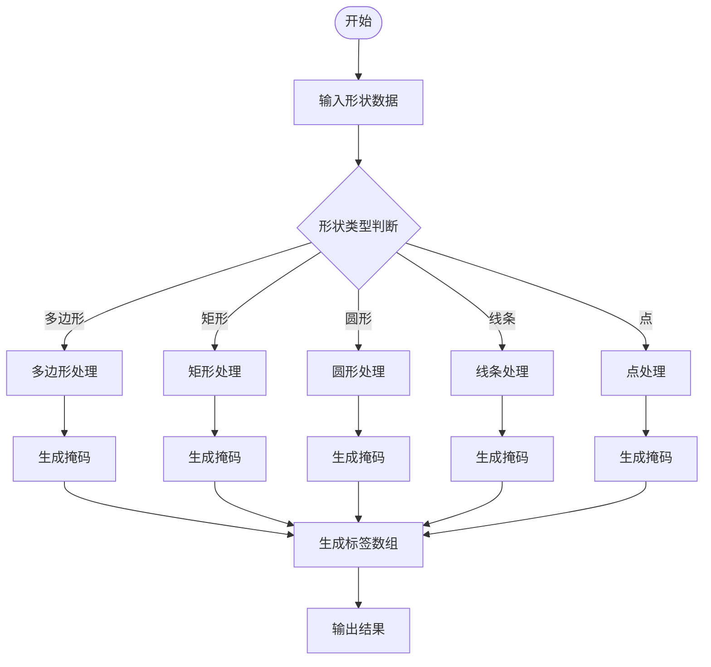
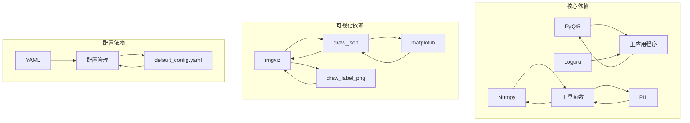

# 基础教程

<cite>
**本文档引用的文件**
- [README.md](file://README.md)
- [main.py](file://main.py)
- [labelme/__main__.py](file://labelme/__main__.py)
- [examples/tutorial/README.md](file://examples/tutorial/README.md)
- [examples/tutorial/apc2016_obj3.json](file://examples/tutorial/apc2016_obj3.json)
- [examples/tutorial/load_label_png.py](file://examples/tutorial/load_label_png.py)
- [labelme/cli/draw_json.py](file://labelme/cli/draw_json.py)
- [labelme/cli/export_json.py](file://labelme/cli/export_json.py)
- [labelme/cli/draw_label_png.py](file://labelme/cli/draw_label_png.py)
- [labelme/cli/json_to_dataset.py](file://labelme/cli/json_to_dataset.py)
- [labelme/config/default_config.yaml](file://labelme/config/default_config.yaml)
- [labelme/utils/shape.py](file://labelme/utils/shape.py)
- [examples/semantic_segmentation/README.md](file://examples/semantic_segmentation/README.md)
- [examples/instance_segmentation/README.md](file://examples/instance_segmentation/README.md)
</cite>

## 目录
1. [简介](#简介)
2. [项目结构](#项目结构)
3. [核心组件](#核心组件)
4. [架构概览](#架构概览)
5. [详细组件分析](#详细组件分析)
6. [依赖关系分析](#依赖关系分析)
7. [性能考虑](#性能考虑)
8. [故障排除指南](#故障排除指南)
9. [结论](#结论)
10. [附录](#附录)

## 简介

Labelme 是一个基于Python的图像多边形标注工具，使用Qt构建图形界面。它支持多种标注类型，包括多边形、矩形、圆形、线条和点。本教程将详细介绍单张图像标注的完整流程，从安装到完成标注的每个步骤。

## 项目结构

Labelme项目的整体结构如下：



**图表来源**
- [README.md](file://README.md)
- [labelme/__main__.py](file://labelme/__main__.py)

**章节来源**
- [README.md](file://README.md)
- [labelme/__main__.py](file://labelme/__main__.py)

## 核心组件

### 主应用程序入口

Labelme提供了两种主要的使用方式：

1. **图形界面模式**：通过 `python -m labelme` 启动
2. **命令行模式**：通过 `labelme` 命令行工具

### 命令行工具集

Labelme包含多个实用的命令行工具：

- `labelme_draw_json`：可视化JSON标注文件
- `labelme_export_json`：导出JSON文件为标准数据集格式
- `labelme_draw_label_png`：可视化标签PNG文件
- `labelme_json_to_dataset`：将JSON转换为数据集格式

**章节来源**
- [README.md](file://README.md)
- [labelme/__main__.py](file://labelme/__main__.py)

## 架构概览

Labelme采用分层架构设计，主要分为以下几个层次：



**图表来源**
- [labelme/app.py](file://labelme/app.py)
- [labelme/utils/shape.py](file://labelme/utils/shape.py)

## 详细组件分析

### 命令行使用详解

#### 基本命令使用

Labelme的命令行使用非常直观，支持多种参数配置：

```bash
# 基本单张图像标注
labelme apc2016_obj3.jpg

# 指定输出文件并自动关闭
labelme apc2016_obj3.jpg -O apc2016_obj3.json

# 不包含图像数据，只保存相对路径
labelme apc2016_obj3.jpg --nodata

# 指定标签列表
labelme apc2016_obj3.jpg \
  --labels highland_6539_self_stick_notes,mead_index_cards,kong_air_dog_squeakair_tennis_ball
```

#### 命令行参数说明

| 参数 | 类型 | 描述 | 默认值 |
|------|------|------|--------|
| `--output/-O` | 文件路径 | 指定标注文件的保存位置 | 无 |
| `--config` | 文件路径 | 指定配置文件位置 | `~/.labelmerc` |
| `--nodata` | 标志 | 停止存储图像数据到JSON文件 | `store_data: true` |
| `--autosave` | 标志 | 自动保存 | `auto_save: false` |
| `--labels` | 标签列表 | 指定标签列表 | 无 |
| `--validatelabel` | 选项 | 标签验证类型 | 无 |

**章节来源**
- [README.md](file://README.md)
- [labelme/__main__.py](file://labelme/__main__.py)

### JSON文件格式详解

Labelme的标注文件采用JSON格式，包含以下主要字段：

```json
{
  "version": "4.0.0",
  "flags": {},
  "shapes": [
    {
      "label": "shelf",
      "points": [
        [7.94, 80.76],
        [171.94, 714.76],
        [968.94, 733.76],
        [1181.94, 110.76]
      ],
      "group_id": null,
      "shape_type": "polygon",
      "flags": {}
    }
  ],
  "imagePath": "apc2016_obj3.json",
  "imageData": "/9j/4AAQSkZJRgABAQAAAQABAAD..."
}
```

#### JSON文件字段说明

| 字段名 | 类型 | 描述 |
|--------|------|------|
| `version` | 字符串 | Labelme版本号 |
| `flags` | 对象 | 用户自定义标志 |
| `shapes` | 数组 | 标注形状列表 |
| `imagePath` | 字符串 | 图像文件路径 |
| `imageData` | 字符串 | Base64编码的图像数据 |

**章节来源**
- [examples/tutorial/apc2016_obj3.json](file://examples/tutorial/apc2016_obj3.json)

### 可视化工具使用

#### JSON文件可视化

Labelme提供了专门的工具来可视化JSON标注文件：

```bash
# 可视化JSON标注文件
labelme_draw_json apc2016_obj3.json
```

该工具会显示原始图像和标注标签的叠加效果。

#### 标签PNG文件可视化

对于语义分割任务，Labelme还支持标签PNG文件的可视化：

```bash
# 可视化标签PNG文件
labelme_draw_label_png apc2016_obj3_json/label.png
```

**章节来源**
- [labelme/cli/draw_json.py](file://labelme/cli/draw_json.py)
- [labelme/cli/draw_label_png.py](file://labelme/cli/draw_label_png.py)

### 数据导出过程

Labelme支持将标注数据导出为标准数据集格式：

```bash
# 导出为标准数据集格式
labelme_export_json apc2016_obj3.json -o apc2016_obj3_json
```

导出的文件结构：
- `img.png`：原始图像文件
- `label.png`：uint8标签文件
- `label_viz.png`：标签可视化图像
- `label_names.txt`：标签名称列表

**章节来源**
- [labelme/cli/export_json.py](file://labelme/cli/export_json.py)

### 标签文件转换和加载技巧

#### 加载标签PNG文件

```python
import numpy as np
import PIL.Image

label_png = 'apc2016_obj3_json/label.png'
lbl = np.asarray(PIL.Image.open(label_png))
labels = np.unique(lbl)
```

#### 标签名称映射

```python
label_names_txt = 'apc2016_obj3_json/label_names.txt'
label_names = [name.strip() for name in open(label_names_txt)]
```

**章节来源**
- [examples/tutorial/load_label_png.py](file://examples/tutorial/load_label_png.py)

### 形状处理工具

Labelme提供了强大的形状处理工具，支持多种形状类型的转换：



**图表来源**
- [labelme/utils/shape.py](file://labelme/utils/shape.py)

**章节来源**
- [labelme/utils/shape.py](file://labelme/utils/shape.py)

## 依赖关系分析

Labelme的依赖关系如下所示：



**图表来源**
- [labelme/__main__.py](file://labelme/__main__.py)
- [labelme/config/default_config.yaml](file://labelme/config/default_config.yaml)

**章节来源**
- [labelme/__main__.py](file://labelme/__main__.py)
- [labelme/config/default_config.yaml](file://labelme/config/default_config.yaml)

## 性能考虑

### 内存优化

Labelme在处理大型图像时采用了多项内存优化策略：

1. **延迟加载**：图像数据采用Base64编码存储，按需解码
2. **增量保存**：支持自动保存功能，避免长时间标注丢失
3. **内存映射**：对于大文件使用内存映射技术

### 处理速度优化

1. **多线程处理**：标注操作采用异步处理
2. **缓存机制**：常用数据和配置进行缓存
3. **批处理**：支持批量文件处理

## 故障排除指南

### 常见问题及解决方案

#### 导入错误问题

如果遇到 `ModuleNotFoundError: No module named 'labelme'` 错误：

1. **检查Python路径**：确保labelme包在Python路径中
2. **检查安装完整性**：重新安装labelme包
3. **虚拟环境问题**：确认在正确的虚拟环境中

#### 图像显示问题

如果标注图像无法正确显示：

1. **检查图像格式**：确保图像为RGB格式
2. **检查图像尺寸**：最小尺寸应为10x10像素
3. **检查编码问题**：确保图像编码正确

#### 标签文件加载问题

如果标签PNG文件加载失败：

1. **使用正确的加载方法**：使用 `PIL.Image.open` 而不是 `scipy.misc.imread`
2. **检查文件完整性**：确认PNG文件未损坏
3. **验证数据类型**：确保标签数组为uint8类型

**章节来源**
- [README.md](file://README.md)

## 结论

Labelme作为一个功能完整的图像标注工具，提供了从安装到标注完成的完整解决方案。其模块化的架构设计使得功能扩展变得简单，而丰富的命令行工具则为自动化处理提供了便利。

通过本教程的学习，用户可以掌握Labelme的基本使用方法，理解标注文件格式，学会使用各种可视化工具，并能够进行数据导出和格式转换。这些技能将为后续的计算机视觉项目打下坚实的基础。

## 附录

### 安装和配置

#### 系统要求

- Python 3.6+
- PyQt5
- Numpy
- Matplotlib
- PIL

#### 安装步骤

1. **使用pip安装**：
   ```bash
   pip install labelme
   ```

2. **从源码安装**：
   ```bash
   pip install .
   ```

3. **验证安装**：
   ```bash
   python -m labelme --help
   ```

### 配置文件说明

Labelme的默认配置文件位于 `~/.labelmerc`，包含以下主要配置项：

- **基本功能**：自动保存、显示标签弹窗、存储数据等
- **标签配置**：预定义标签列表、标签验证模式等
- **颜色配置**：默认形状颜色、标签颜色等
- **快捷键配置**：各种操作的快捷键绑定

**章节来源**
- [labelme/config/default_config.yaml](file://labelme/config/default_config.yaml)