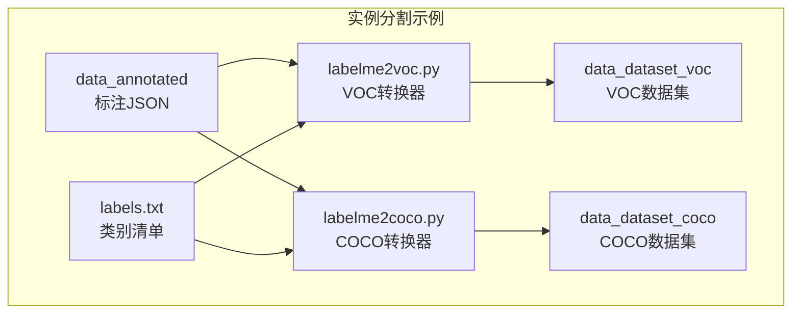
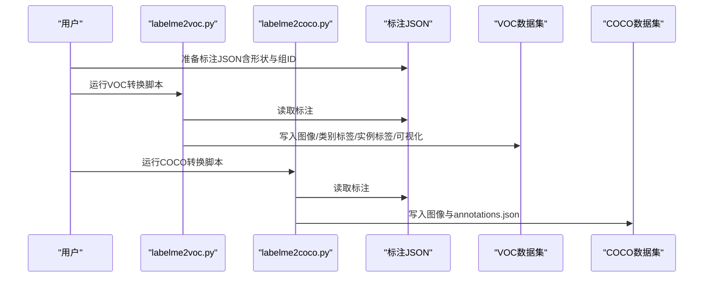
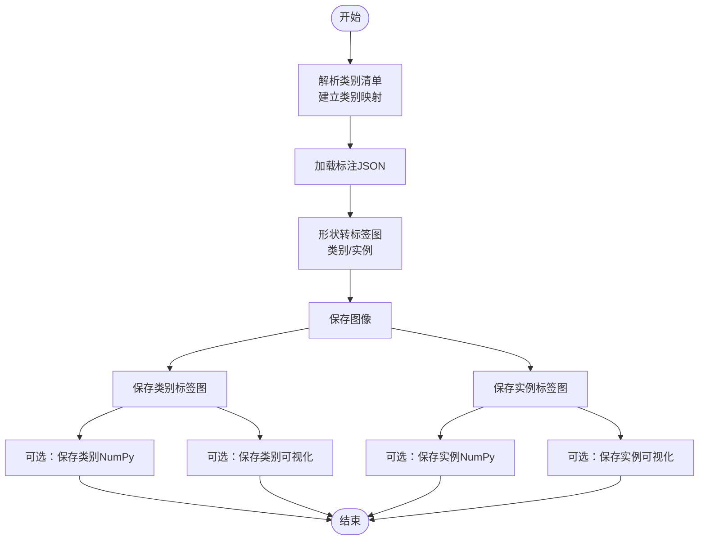
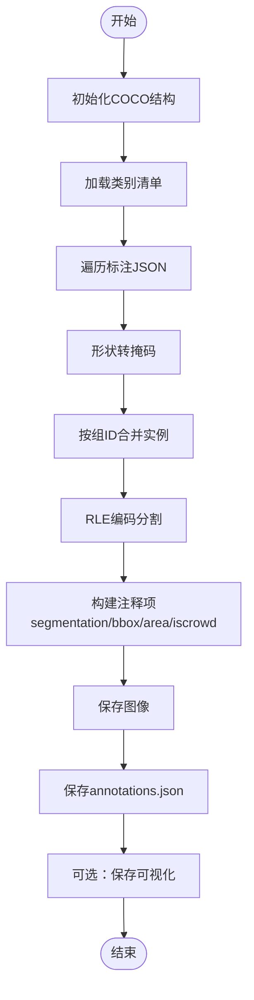
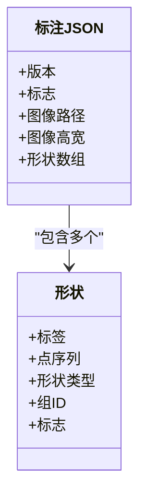
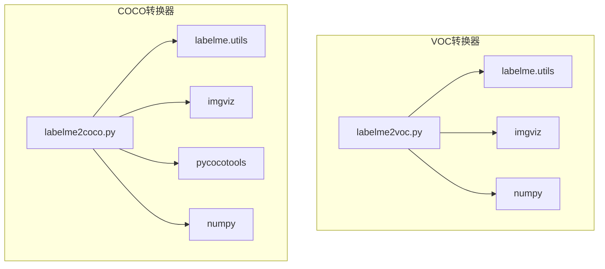

# 实例分割示例

<cite>
**本文引用的文件**
- [README.md](file://labelme/examples/instance_segmentation/README.md)
- [labelme2coco.py](file://labelme/examples/instance_segmentation/labelme2coco.py)
- [labelme2voc.py](file://labelme/examples/instance_segmentation/labelme2voc.py)
- [labels.txt](file://labelme/examples/instance_segmentation/labels.txt)
- [2011_000003.json](file://labelme/examples/instance_segmentation/data_annotated/2011_000003.json)
- [2011_000006.json](file://labelme/examples/instance_segmentation/data_annotated/2011_000006.json)
- [annotations.json](file://labelme/examples/instance_segmentation/data_dataset_coco/annotations.json)
- [class_names.txt](file://labelme/examples/instance_segmentation/data_dataset_voc/class_names.txt)
</cite>

## 目录
1. [引言](#引言)
2. [项目结构](#项目结构)
3. [核心组件](#核心组件)
4. [架构总览](#架构总览)
5. [详细组件分析](#详细组件分析)
6. [依赖分析](#依赖分析)
7. [性能考虑](#性能考虑)
8. [故障排除指南](#故障排除指南)
9. [结论](#结论)
10. [附录](#附录)

## 引言
本示例文档面向计算机视觉研究与工业应用，系统讲解实例分割标注任务：如何在单张图像中对多个同类或异类目标进行精确分割，并区分每个独立实例。内容涵盖标注流程、数据准备、格式转换（COCO 与 VOC）、标注结果可视化与后续处理建议，帮助读者快速构建高质量实例分割数据集。

## 项目结构
该示例位于实例分割示例目录，包含标注数据、转换脚本、以及生成的 VOC/COCO 数据集产物。下图展示了关键文件与目录的关系：

图表来源
- [README.md:1-50](file://labelme/examples/instance_segmentation/README.md#L1-L50)
- [labelme2voc.py:17-157](file://labelme/examples/instance_segmentation/labelme2voc.py#L17-L157)
- [labelme2coco.py:25-204](file://labelme/examples/instance_segmentation/labelme2coco.py#L25-L204)

章节来源
- [README.md:1-50](file://labelme/examples/instance_segmentation/README.md#L1-L50)

## 核心组件
- 标注数据（JSON）：每张图像对应一个 JSON 文件，记录形状列表（多边形/矩形/圆形等）、类别标签、组 ID（用于实例区分）等信息。
- 转换器（VOC）：将标注转换为 VOC 格式，生成图像、类别标签图、实例标签图及其可视化与 NumPy 数组。
- 转换器（COCO）：将标注转换为 COCO 格式，生成图像与 JSON 注释文件，包含实例级分割、边界框、面积与类别映射。
- 类别清单（labels.txt）：定义类别名称与 ID 映射，其中保留特殊类别如忽略区域与背景。

章节来源
- [labelme2voc.py:17-157](file://labelme/examples/instance_segmentation/labelme2voc.py#L17-L157)
- [labelme2coco.py:25-204](file://labelme/examples/instance_segmentation/labelme2coco.py#L25-L204)
- [labels.txt:1-22](file://labelme/examples/instance_segmentation/labels.txt#L1-L22)

## 架构总览
下图展示了从标注到两种目标格式的转换流程：

图表来源
- [labelme2voc.py:80-153](file://labelme/examples/instance_segmentation/labelme2voc.py#L80-L153)
- [labelme2coco.py:92-199](file://labelme/examples/instance_segmentation/labelme2coco.py#L92-L199)

## 详细组件分析

### 组件A：VOC格式转换器（labelme2voc.py）
- 功能概述
  - 将标注 JSON 转换为 VOC 数据集格式，支持生成类别标签图、实例标签图、可视化图与 NumPy 数组。
  - 支持可选参数：禁用对象标签、禁用 NumPy 输出、禁用可视化。
- 关键流程
  - 解析类别清单，建立类别名到数值的映射。
  - 遍历标注 JSON，调用工具函数将多边形/矩形/圆形等形状转为类别与实例标签图。
  - 可选保存可视化与 NumPy 数组，便于后续分析与训练。
- 输出目录
  - JPEGImages、SegmentationClass、SegmentationClassNpy、SegmentationClassVisualization
  - SegmentationToken（可选）、SegmentationObjectNpy（可选）、SegmentationObjectVisualization（可选）

图表来源
- [labelme2voc.py:55-153](file://labelme/examples/instance_segmentation/labelme2voc.py#L55-L153)

章节来源
- [labelme2voc.py:17-157](file://labelme/examples/instance_segmentation/labelme2voc.py#L17-L157)
- [class_names.txt:1-21](file://labelme/examples/instance_segmentation/data_dataset_voc/class_names.txt#L1-L21)

### 组件B：COCO格式转换器（labelme2coco.py）
- 功能概述
  - 将标注 JSON 转换为 COCO 格式，生成图像与 annotations.json，包含每张图像的元信息、类别定义与实例注释（分割、边界框、面积、是否iscrowd）。
- 关键流程
  - 初始化 COCO 结构（info、licenses、images、annotations、categories）。
  - 读取类别清单，建立类别名到 ID 的映射。
  - 遍历标注 JSON，将形状转为掩码，按组 ID 合并同一实例的多段分割，计算面积与边界框，写入注释。
  - 可选生成可视化图。
- 输出目录
  - JPEGImages、annotations.json、Visualization（可选）

图表来源
- [labelme2coco.py:46-199](file://labelme/examples/instance_segmentation/labelme2coco.py#L46-L199)

章节来源
- [labelme2coco.py:25-204](file://labelme/examples/instance_segmentation/labelme2coco.py#L25-L204)
- [annotations.json:1-1](file://labelme/examples/instance_segmentation/data_dataset_coco/annotations.json#L1-L1)

### 组件C：标注数据结构（JSON）
- 形状与组 ID
  - 每个形状包含标签、点序列、形状类型（多边形/矩形/圆形）与组 ID。
  - 组 ID 相同表示同一实例；未设置组 ID 的形状被视为不同实例。
- 忽略区域
  - 使用特殊类别标记忽略区域，转换时会忽略这些区域。
- 示例
  - 多人场景：同一类别但不同组 ID 表示多个实例。
  - 物体遮挡：可通过组 ID 合并被遮挡部分。

图表来源
- [2011_000003.json:1-478](file://labelme/examples/instance_segmentation/data_annotated/2011_000003.json#L1-L478)
- [2011_000006.json:1-530](file://labelme/examples/instance_segmentation/data_annotated/2011_000006.json#L1-L530)

章节来源
- [2011_000003.json:1-478](file://labelme/examples/instance_segmentation/data_annotated/2011_000003.json#L1-L478)
- [2011_000006.json:1-530](file://labelme/examples/instance_segmentation/data_annotated/2011_000006.json#L1-L530)

### 组件D：类别清单与映射
- VOC 与 COCO 均使用类别清单定义类别名与 ID。
- 特殊类别
  - 忽略区域（__ignore__）：在 VOC 中映射为标签值 -1，在 NumPy 中为 -1。
  - 背景（_background_）：在 VOC 中映射为标签值 0。
- 类别顺序即 ID，ID 从 0 开始，忽略区域不参与训练。

章节来源
- [labels.txt:1-22](file://labelme/examples/instance_segmentation/labels.txt#L1-L22)
- [class_names.txt:1-21](file://labelme/examples/instance_segmentation/data_dataset_voc/class_names.txt#L1-L21)

## 依赖分析
- VOC 转换器依赖
  - labelme 工具：读取标注 JSON、形状转标签图。
  - imgviz：生成可视化与标签彩色图。
  - numpy：保存 NumPy 数组。
- COCO 转换器依赖
  - labelme 工具：读取标注 JSON、形状转掩码。
  - imgviz：可选可视化。
  - pycocotools：RLE 编码与面积/边界框计算。
  - numpy：掩码数组。

图表来源
- [labelme2voc.py:1-157](file://labelme/examples/instance_segmentation/labelme2voc.py#L1-L157)
- [labelme2coco.py:1-204](file://labelme/examples/instance_segmentation/labelme2coco.py#L1-L204)

章节来源
- [labelme2voc.py:1-157](file://labelme/examples/instance_segmentation/labelme2voc.py#L1-L157)
- [labelme2coco.py:1-204](file://labelme/examples/instance_segmentation/labelme2coco.py#L1-L204)

## 性能考虑
- 形状复杂度
  - 圆形与矩形通过采样离散化为多边形，点数越多越耗时。可根据精度需求调整采样密度。
- 掩码编码
  - COCO 转换中 RLE 编码与面积/边界框计算为 O(N) 操作，N 为像素数。建议控制输入图像分辨率与实例数量。
- I/O 优化
  - 批量处理 JSON 文件，避免重复打开/关闭文件。
  - 可选禁用可视化以减少磁盘写入。

## 故障排除指南
- 安装依赖
  - COCO 转换需要安装 pycocotools，否则会提示安装命令并退出。
- 类别映射错误
  - 确保 labels.txt 中类别顺序与 ID 对应，且忽略区域与背景命名一致。
- 忽略区域处理
  - 在 VOC 中，忽略区域标签值为 -1（NumPy 中），请在训练前确认数据预处理逻辑。
- 组 ID 未设置
  - 若未设置组 ID，同一类别会被视为多个实例；若需合并，请为同一实例设置相同组 ID。
- 可视化问题
  - 若未生成可视化，检查是否禁用了可视化选项或缺少依赖库。

章节来源
- [labelme2coco.py:18-22](file://labelme/examples/instance_segmentation/labelme2coco.py#L18-L22)
- [README.md:30-37](file://labelme/examples/instance_segmentation/README.md#L30-L37)

## 结论
本示例提供了从标注到 VOC/COCO 格式的完整链路：标注 JSON 通过两个转换器分别生成两类主流数据集格式。VOC 适合语义/实例标签图与可视化分析；COCO 更贴近目标检测与实例分割训练框架。结合类别清单与组 ID 设计，可高效构建多对象、多实例的高质量数据集。

## 附录

### A. 标注流程与最佳实践
- 标注阶段
  - 使用组 ID 区分同一类别的多个实例；对遮挡/断裂的同一对象使用相同组 ID 合并。
  - 对于忽略区域（如边缘、无效区域），使用特殊类别标记。
- 数据准备
  - 统一类别清单，确保 VOC 与 COCO 使用相同类别映射。
  - 控制形状复杂度，必要时简化多边形点数。
- 格式选择
  - 若侧重语义/实例标签图与可视化，优先 VOC。
  - 若直接对接 COCO 生态（如 Detectron2、MMDetection），优先 COCO。

章节来源
- [README.md:3-50](file://labelme/examples/instance_segmentation/README.md#L3-L50)
- [labels.txt:1-22](file://labelme/examples/instance_segmentation/labels.txt#L1-L22)

### B. VOC 与 COCO 格式对比与转换要点
- VOC
  - 输出：图像、类别标签图、实例标签图、可视化、NumPy 数组（可选）。
  - 适用：语义/实例标签图分析、轻量级可视化。
- COCO
  - 输出：图像、annotations.json（包含类别、图像、注释）。
  - 适用：标准实例分割训练与评估。
- 转换要点
  - VOC：类别映射从 -1（忽略）与 0（背景）开始，实例标签为唯一整数 ID。
  - COCO：类别 ID 从 0 开始，注释包含 segmentation（多边形或 RLE）、bbox、area、iscrowd。

章节来源
- [labelme2voc.py:61-78](file://labelme/examples/instance_segmentation/labelme2voc.py#L61-L78)
- [labelme2coco.py:74-88](file://labelme/examples/instance_segmentation/labelme2coco.py#L74-L88)
- [annotations.json:1-1](file://labelme/examples/instance_segmentation/data_dataset_coco/annotations.json#L1-L1)

### C. 实际标注结果展示与后续处理
- VOC 结果
  - 图像：原始图像。
  - 类别标签图：每个像素为类别 ID（-1 表示忽略，0 表示背景）。
  - 实例标签图：每个像素为实例 ID（正整数）。
  - 可视化：叠加类别/实例颜色的彩色图。
- COCO 结果
  - annotations.json：包含 images、annotations、categories 字段，可直接用于训练。
- 后续处理建议
  - VOC：可基于类别/实例标签图进行数据增强、统计分析或模型验证。
  - COCO：可直接用于训练框架的数据加载与评估。

章节来源
- [README.md:26-49](file://labelme/examples/instance_segmentation/README.md#L26-L49)
- [class_names.txt:1-21](file://labelme/examples/instance_segmentation/data_dataset_voc/class_names.txt#L1-L21)
- [annotations.json:1-1](file://labelme/examples/instance_segmentation/data_dataset_coco/annotations.json#L1-L1)