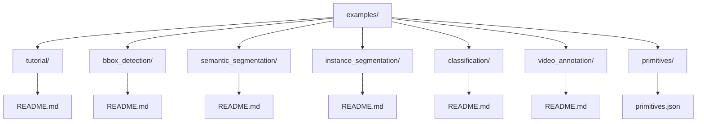
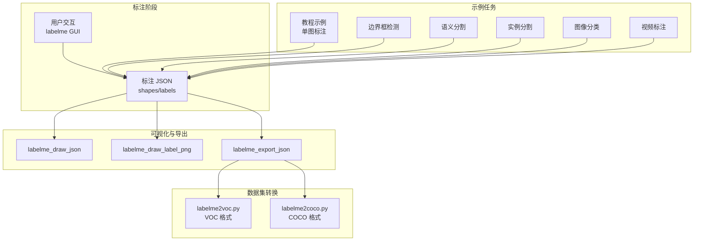
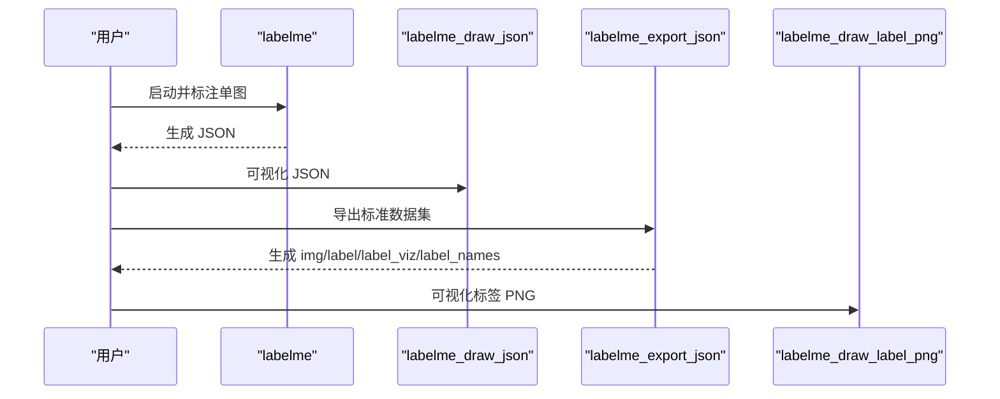
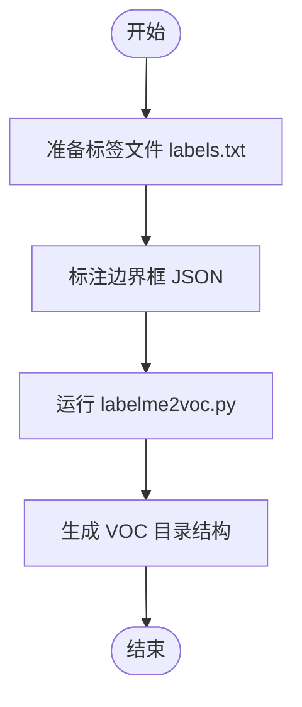
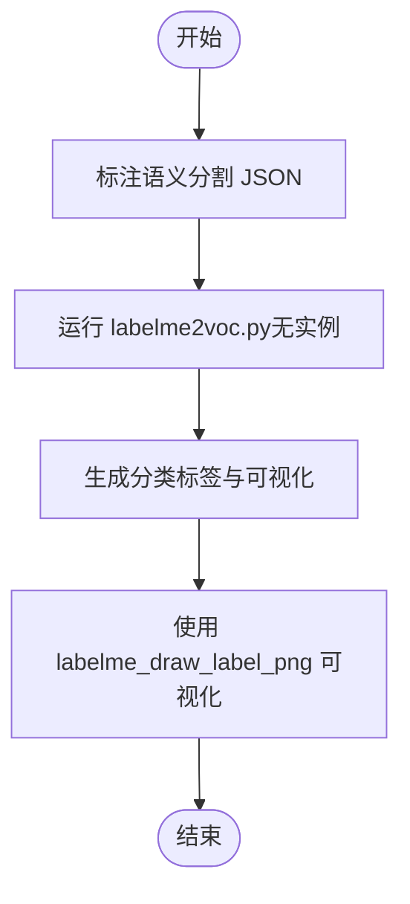
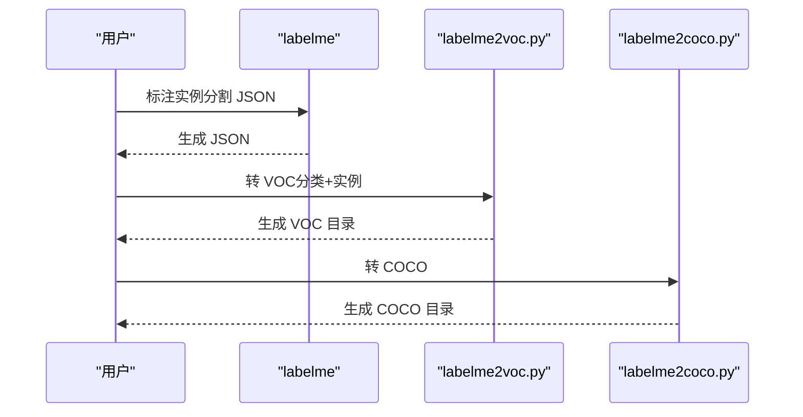
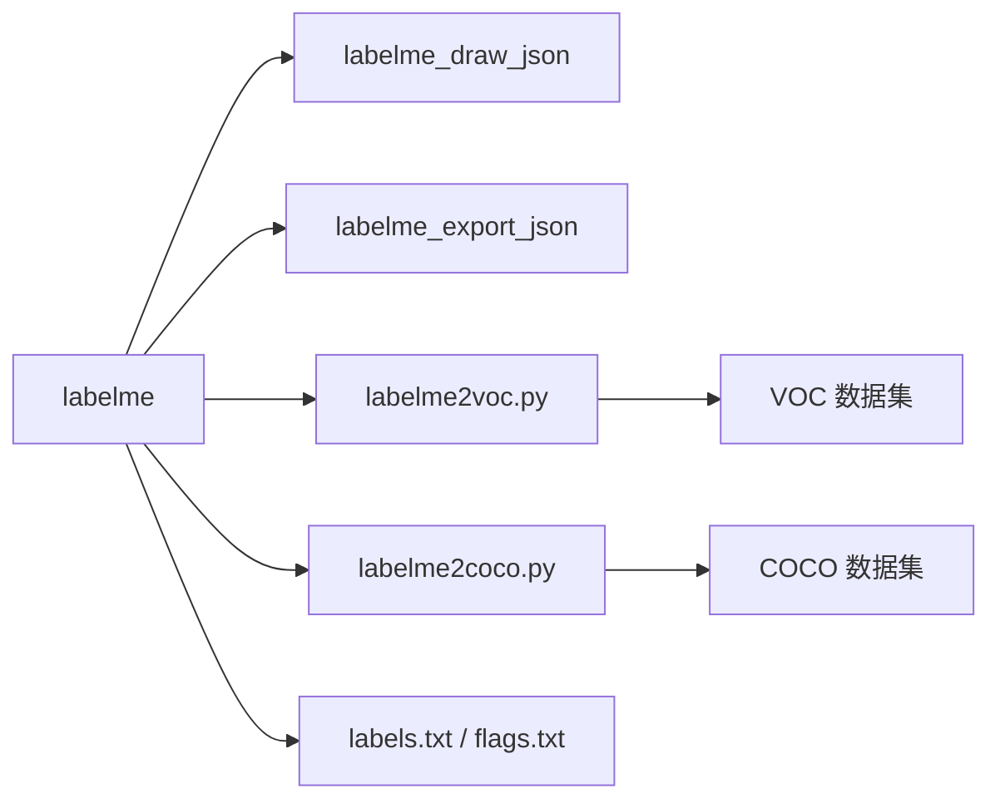

# 示例与教程

<cite>
**本文引用的文件**
- [README.md](file://README.md)
- [examples/tutorial/README.md](file://examples/tutorial/README.md)
- [examples/bbox_detection/README.md](file://examples/bbox_detection/README.md)
- [examples/semantic_segmentation/README.md](file://examples/semantic_segmentation/README.md)
- [examples/instance_segmentation/README.md](file://examples/instance_segmentation/README.md)
- [examples/classification/README.md](file://examples/classification/README.md)
- [examples/video_annotation/README.md](file://examples/video_annotation/README.md)
- [examples/primitives/primitives.json](file://examples/primitives/primitives.json)
- [examples/bbox_detection/labels.txt](file://examples/bbox_detection/labels.txt)
- [examples/semantic_segmentation/labels.txt](file://examples/semantic_segmentation/labels.txt)
- [examples/instance_segmentation/labels.txt](file://examples/instance_segmentation/labels.txt)
- [examples/classification/flags.txt](file://examples/classification/flags.txt)
- [examples/bbox_detection/data_annotated/2011_000003.json](file://examples/bbox_detection/data_annotated/2011_000003.json)
- [examples/semantic_segmentation/data_annotated/2011_000003.json](file://examples/semantic_segmentation/data_annotated/2011_000003.json)
- [examples/tutorial/apc2016_obj3.json](file://examples/tutorial/apc2016_obj3.json)
</cite>

## 目录
1. [简介](#简介)
2. [项目结构](#项目结构)
3. [核心组件](#核心组件)
4. [架构总览](#架构总览)
5. [详细组件分析](#详细组件分析)
6. [依赖关系分析](#依赖关系分析)
7. [性能考虑](#性能考虑)
8. [故障排除指南](#故障排除指南)
9. [结论](#结论)
10. [附录](#附录)

## 简介
本文件系统性整理了 labelme 的官方示例与教程，覆盖基础使用、高级场景与最佳实践，帮助用户从简单到复杂逐步掌握标注任务。内容包括：
- 基础示例：单张图像标注、几何原语绘制
- 任务示例：图像分类、边界框检测、语义分割、实例分割、视频标注
- 数据与结果：标注 JSON、可视化 PNG、VOC/COCO 转换
- 应用领域：医学图像、工业检测、科学研究
- 故障排除与常见问题

## 项目结构
示例与教程主要位于 examples 目录下，每个子目录包含：
- README.md：使用说明与操作步骤
- 数据与标注样例：data_annotated/*.json
- 标签/标志文件：labels.txt、flags.txt
- 转换脚本：labelme2voc.py、labelme2coco.py
- 可视化与辅助工具：labelme_draw_json、labelme_draw_label_png、labelme_export_json

**图表来源**
- [examples/tutorial/README.md:1-67](file://examples/tutorial/README.md#L1-L67)
- [examples/bbox_detection/README.md:1-26](file://examples/bbox_detection/README.md#L1-L26)
- [examples/semantic_segmentation/README.md:1-37](file://examples/semantic_segmentation/README.md#L1-L37)
- [examples/instance_segmentation/README.md:1-50](file://examples/instance_segmentation/README.md#L1-L50)
- [examples/classification/README.md:1-12](file://examples/classification/README.md#L1-L12)
- [examples/video_annotation/README.md:1-30](file://examples/video_annotation/README.md#L1-L30)
- [examples/primitives/primitives.json:1-162](file://examples/primitives/primitives.json#L1-L162)

**章节来源**
- [README.md:234-241](file://README.md#L234-L241)

## 核心组件
- 命令行工具链
  - labelme：图形化标注
  - labelme_draw_json：快速可视化 JSON
  - labelme_draw_label_png：可视化标签 PNG
  - labelme_export_json：导出标准图像与标签
  - labelme2voc.py：转 VOC 数据集
  - labelme2coco.py：转 COCO 数据集
- 标注 JSON 结构：包含版本、flags、shapes（含 label、points、shape_type）、imagePath、imageData、尺寸等
- 标签/标志文件：labels.txt、flags.txt，用于限定可用类别与标志

**章节来源**
- [README.md:197-233](file://README.md#L197-L233)
- [examples/tutorial/README.md:1-67](file://examples/tutorial/README.md#L1-L67)
- [examples/primitives/primitives.json:1-162](file://examples/primitives/primitives.json#L1-L162)

## 架构总览
下图展示了从标注到数据集导出的端到端流程，以及各示例之间的关系。

**图表来源**
- [README.md:197-233](file://README.md#L197-L233)
- [examples/tutorial/README.md:1-67](file://examples/tutorial/README.md#L1-L67)
- [examples/bbox_detection/README.md:1-26](file://examples/bbox_detection/README.md#L1-L26)
- [examples/semantic_segmentation/README.md:1-37](file://examples/semantic_segmentation/README.md#L1-L37)
- [examples/instance_segmentation/README.md:1-50](file://examples/instance_segmentation/README.md#L1-L50)
- [examples/classification/README.md:1-12](file://examples/classification/README.md#L1-L12)
- [examples/video_annotation/README.md:1-30](file://examples/video_annotation/README.md#L1-L30)

## 详细组件分析

### 教程示例：单张图像标注
- 目标：掌握 labelme 基本操作、JSON 可视化、导出标准数据集
- 使用场景：初学者入门、快速验证标注流程
- 实现步骤
  1) 启动标注：labelme apc2016_obj3.jpg
  2) 可视化：labelme_draw_json apc2016_obj3.json
  3) 导出：labelme_export_json apc2016_obj3.json -o apc2016_obj3_json
  4) 加载标签 PNG：labelme_draw_label_png apc2016_obj3_json/label.png
- 数据与结果
  - 输入：apc2016_obj3.json
  - 输出：img.png、label.png、label_viz.png、label_names.txt
- 后续处理
  - 使用 PIL.Image 打开 label.png，读取 uint8 标签数组
  - 可结合训练框架（如 PyTorch、TensorFlow）进行训练

**图表来源**
- [examples/tutorial/README.md:1-67](file://examples/tutorial/README.md#L1-L67)
- [examples/tutorial/apc2016_obj3.json:1-246](file://examples/tutorial/apc2016_obj3.json#L1-L246)

**章节来源**
- [examples/tutorial/README.md:1-67](file://examples/tutorial/README.md#L1-L67)
- [examples/tutorial/apc2016_obj3.json:1-246](file://examples/tutorial/apc2016_obj3.json#L1-L246)

### 边界框检测示例
- 目标：标注边界框，生成 VOC 格式数据集
- 使用场景：目标检测任务
- 实现步骤
  1) 标注：labelme data_annotated --labels labels.txt --nodata --autosave
  2) 转 VOC：./labelme2voc.py data_annotated data_dataset_voc --labels labels.txt
- 数据与结果
  - 输入：data_annotated/*.json（矩形标注）
  - 输出：JPEGImages、Annotations、AnnotationsVisualization
- 后续处理
  - 将标注可视化并与原始图像对比，确认边界框质量

**图表来源**
- [examples/bbox_detection/README.md:1-26](file://examples/bbox_detection/README.md#L1-L26)
- [examples/bbox_detection/labels.txt:1-22](file://examples/bbox_detection/labels.txt#L1-L22)

**章节来源**
- [examples/bbox_detection/README.md:1-26](file://examples/bbox_detection/README.md#L1-L26)
- [examples/bbox_detection/labels.txt:1-22](file://examples/bbox_detection/labels.txt#L1-L22)
- [examples/bbox_detection/data_annotated/2011_000003.json:1-42](file://examples/bbox_detection/data_annotated/2011_000003.json#L1-L42)

### 语义分割示例
- 目标：标注像素级语义标签，生成 VOC 分类标签
- 使用场景：语义分割
- 实现步骤
  1) 标注：labelme data_annotated --labels labels.txt --nodata --validatelabel exact --config '{shift_auto_shape_color: -2}'
  2) 转 VOC：./labelme2voc.py data_annotated data_dataset_voc --labels labels.txt --noobject
- 数据与结果
  - 输入：多边形标注 JSON
  - 输出：JPEGImages、SegmentationClass、SegmentationClassNpy、SegmentationClassVisualization
- 后续处理
  - 使用 labelme_draw_label_png 可视化标签 PNG；注意 __ignore__ 标签值

**图表来源**
- [examples/semantic_segmentation/README.md:1-37](file://examples/semantic_segmentation/README.md#L1-L37)
- [examples/semantic_segmentation/labels.txt:1-22](file://examples/semantic_segmentation/labels.txt#L1-L22)

**章节来源**
- [examples/semantic_segmentation/README.md:1-37](file://examples/semantic_segmentation/README.md#L1-L37)
- [examples/semantic_segmentation/labels.txt:1-22](file://examples/semantic_segmentation/labels.txt#L1-L22)
- [examples/semantic_segmentation/data_annotated/2011_000003.json:1-478](file://examples/semantic_segmentation/data_annotated/2011_000003.json#L1-L478)

### 实例分割示例
- 目标：区分同一类别的不同实例，生成 VOC 与 COCO 数据集
- 使用场景：实例分割
- 实现步骤
  1) 标注：labelme data_annotated --labels labels.txt --nodata --validatelabel exact --config '{shift_auto_shape_color: -2}'
  2) 转 VOC：./labelme2voc.py data_annotated data_dataset_voc --labels labels.txt
  3) 转 COCO：./labelme2coco.py data_annotated data_dataset_coco --labels labels.txt
- 数据与结果
  - 输出：JPEGImages、SegmentationClass、SegmentationClassNpy、SegmentationClassVisualization、SegmentationObject、SegmentationObjectNpy、SegmentationObjectVisualization
- 后续处理
  - VOC：使用 labelme_draw_label_png 可视化 class 与 object 标签
  - COCO：得到 JPEGImages 与 annotations.json

**图表来源**
- [examples/instance_segmentation/README.md:1-50](file://examples/instance_segmentation/README.md#L1-L50)
- [examples/instance_segmentation/labels.txt:1-22](file://examples/instance_segmentation/labels.txt#L1-L22)

**章节来源**
- [examples/instance_segmentation/README.md:1-50](file://examples/instance_segmentation/README.md#L1-L50)
- [examples/instance_segmentation/labels.txt:1-22](file://examples/instance_segmentation/labels.txt#L1-L22)

### 图像分类示例
- 目标：对整幅图像打上类别标签，支持标志（flags）
- 使用场景：图像分类
- 实现步骤
  1) 标注：labelme data_annotated --flags flags.txt --nodata
- 数据与结果
  - 输入：flags.txt 定义类别与标志
  - 输出：JSON 中 flags 字段记录标志

**章节来源**
- [examples/classification/README.md:1-12](file://examples/classification/README.md#L1-L12)
- [examples/classification/flags.txt:1-4](file://examples/classification/flags.txt#L1-L4)

### 视频标注示例
- 目标：对视频帧序列进行语义/实例标注，支持跨帧保持
- 使用场景：视频目标跟踪、动作识别
- 实现步骤
  1) 将视频转图片：video-toimg your_video.mp4
  2) 标注：labelme your_video/ --labels labels.txt --nodata --keep-prev --config '{shift_auto_shape_color: -2}'
- 数据与结果
  - 输出：JPEGImages、SegmentationClass、SegmentationClassPNG、SegmentationClassVisualization、class_names.txt

**章节来源**
- [examples/video_annotation/README.md:1-30](file://examples/video_annotation/README.md#L1-L30)

### 几何原语示例
- 目标：演示多边形、矩形、圆形、线、点、折线、掩码等多种形状类型
- 使用场景：教学与原型验证
- 数据与结果
  - 输入：primitives.json 包含多种 shape_type
  - 输出：可直接用 labelme 可视化

**章节来源**
- [examples/primitives/primitives.json:1-162](file://examples/primitives/primitives.json#L1-L162)

## 依赖关系分析
- 工具链依赖
  - labelme → labelme_draw_json → labelme_export_json → labelme2voc.py / labelme2coco.py
- 数据依赖
  - 标注 JSON 依赖 labels.txt / flags.txt
  - VOC/COCO 转换依赖 labelme2voc.py / labelme2coco.py
- 可视化依赖
  - labelme_draw_json、labelme_draw_label_png 依赖 JSON 与标签 PNG

**图表来源**
- [README.md:197-233](file://README.md#L197-L233)
- [examples/bbox_detection/README.md:1-26](file://examples/bbox_detection/README.md#L1-L26)
- [examples/semantic_segmentation/README.md:1-37](file://examples/semantic_segmentation/README.md#L1-L37)
- [examples/instance_segmentation/README.md:1-50](file://examples/instance_segmentation/README.md#L1-L50)
- [examples/classification/README.md:1-12](file://examples/classification/README.md#L1-L12)

## 性能考虑
- 大图与大批量标注
  - 使用 --nodata 降低 JSON 体积，便于网络传输与版本控制
  - 合理设置 --autosave 与 --keep-prev，平衡安全性与性能
- 可视化与导出
  - labelme_draw_label_png 适合快速检查标签 PNG
  - labelme_export_json 生成标准目录，利于流水线集成
- 训练前数据清洗
  - 利用 --validatelabel exact 与 --config 参数提升标注一致性

[本节为通用建议，无需具体文件引用]

## 故障排除指南
- 导入错误
  - 检查 labelme/_automation/__init__.py 绝对导入路径
  - 确认 labelme/translate/empty.ts 存在且扩展名正确
  - 确保 labelme/config/default_config.yaml 使用 UTF-8 without BOM 编码
- AI 功能
  - osam 模块非必需，缺失时系统优雅降级
  - 图像预处理自动处理尺寸与格式异常
- 防止多次启动
  - 共享内存技术确保单实例运行，僵尸进程自动清理

**章节来源**
- [README.md:79-195](file://README.md#L79-L195)

## 结论
通过本教程集合，用户可以：
- 快速掌握 labelme 的基础与高级用法
- 完成从标注到数据集导出的完整流程
- 在边界框检测、语义/实例分割、分类与视频标注等任务中落地
- 借助示例数据与转换脚本，快速接入下游训练与推理

[本节为总结，无需具体文件引用]

## 附录

### 渐进式学习路径
- 第一步：教程示例（单图标注）
- 第二步：边界框检测
- 第三步：语义分割
- 第四步：实例分割
- 第五步：图像分类与视频标注
- 第六步：几何原语与数据导出

**章节来源**
- [examples/tutorial/README.md:1-67](file://examples/tutorial/README.md#L1-L67)
- [examples/bbox_detection/README.md:1-26](file://examples/bbox_detection/README.md#L1-L26)
- [examples/semantic_segmentation/README.md:1-37](file://examples/semantic_segmentation/README.md#L1-L37)
- [examples/instance_segmentation/README.md:1-50](file://examples/instance_segmentation/README.md#L1-L50)
- [examples/classification/README.md:1-12](file://examples/classification/README.md#L1-L12)
- [examples/video_annotation/README.md:1-30](file://examples/video_annotation/README.md#L1-L30)
- [examples/primitives/primitives.json:1-162](file://examples/primitives/primitives.json#L1-L162)

### 常用命令速查
- 启动标注：labelme <图像或目录>
- 可视化 JSON：labelme_draw_json <json>
- 可视化标签 PNG：labelme_draw_label_png <label.png>
- 导出标准数据集：labelme_export_json <json> -o <输出目录>
- 转 VOC：labelme2voc.py <输入标注目录> <输出 VOC 目录> --labels <labels.txt>
- 转 COCO：labelme2coco.py <输入标注目录> <输出 COCO 目录> --labels <labels.txt>

**章节来源**
- [README.md:197-233](file://README.md#L197-L233)
- [examples/tutorial/README.md:1-67](file://examples/tutorial/README.md#L1-L67)
- [examples/bbox_detection/README.md:1-26](file://examples/bbox_detection/README.md#L1-L26)
- [examples/semantic_segmentation/README.md:1-37](file://examples/semantic_segmentation/README.md#L1-L37)
- [examples/instance_segmentation/README.md:1-50](file://examples/instance_segmentation/README.md#L1-L50)