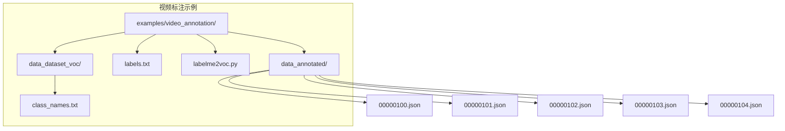
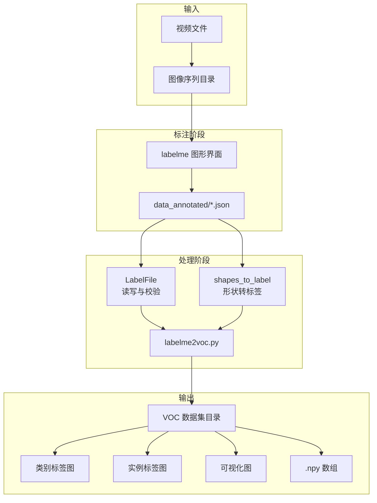
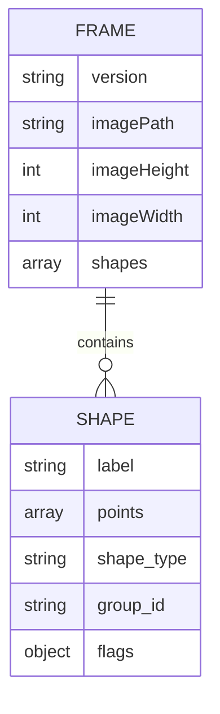
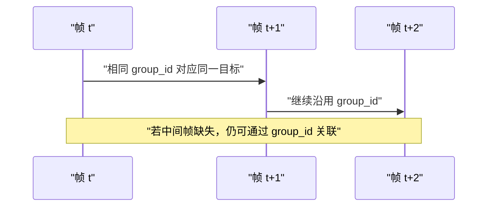
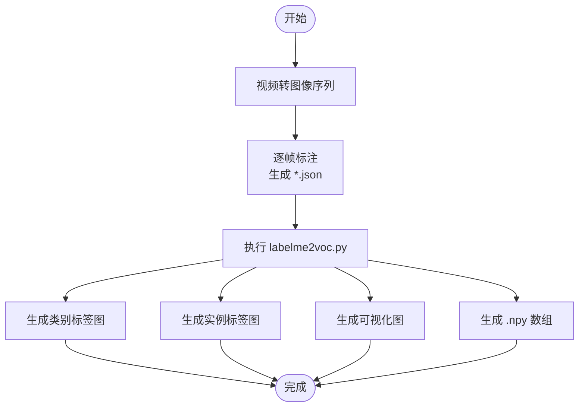
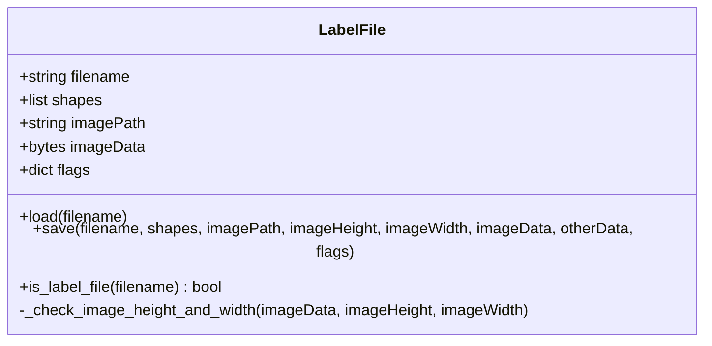
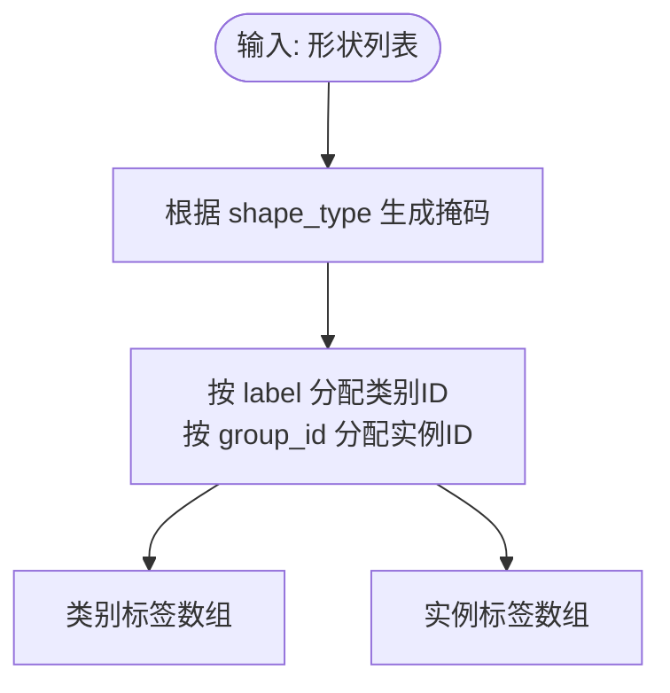
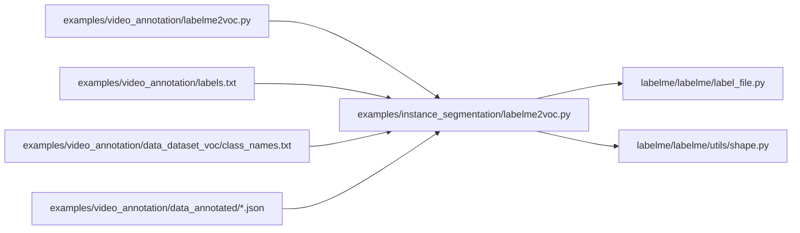

# 视频标注示例

<cite>
**本文引用的文件**
- [examples/video_annotation/README.md](file://examples/video_annotation/README.md)
- [examples/video_annotation/data_annotated/00000100.json](file://examples/video_annotation/data_annotated/00000100.json)
- [examples/video_annotation/data_annotated/00000101.json](file://examples/video_annotation/data_annotated/00000101.json)
- [examples/video_annotation/data_annotated/00000102.json](file://examples/video_annotation/data_annotated/00000102.json)
- [examples/video_annotation/data_annotated/00000103.json](file://examples/video_annotation/data_annotated/00000103.json)
- [examples/video_annotation/data_annotated/00000104.json](file://examples/video_annotation/data_annotated/00000104.json)
- [examples/video_annotation/labels.txt](file://examples/video_annotation/labels.txt)
- [examples/video_annotation/labelme2voc.py](file://examples/video_annotation/labelme2voc.py)
- [examples/instance_segmentation/labelme2voc.py](file://examples/instance_segmentation/labelme2voc.py)
- [examples/semantic_segmentation/labelme2voc.py](file://examples/semantic_segmentation/labelme2voc.py)
- [examples/video_annotation/data_dataset_voc/class_names.txt](file://examples/video_annotation/data_dataset_voc/class_names.txt)
- [labelme/labelme/label_file.py](file://labelme/labelme/label_file.py)
- [labelme/labelme/utils/shape.py](file://labelme/labelme/utils/shape.py)
</cite>

## 目录
1. [简介](#简介)
2. [项目结构](#项目结构)
3. [核心组件](#核心组件)
4. [架构总览](#架构总览)
5. [详细组件分析](#详细组件分析)
6. [依赖关系分析](#依赖关系分析)
7. [性能考虑](#性能考虑)
8. [故障排除指南](#故障排除指南)
9. [结论](#结论)
10. [附录](#附录)

## 简介
本示例文档面向视频序列标注任务，重点展示如何在连续帧之间保持标注一致性、进行时间维度标注，并提供多帧跟踪、目标持续标识与运动轨迹标注的方法。文档涵盖视频数据集的组织结构、标注文件格式、批量处理流程，以及视频转图像序列、标注结果可视化与格式转换工具。该方法适用于行为识别、目标跟踪与视频分析等应用场景。

## 项目结构
视频标注示例位于 examples/video_annotation 目录，包含以下关键内容：
- 标注数据：data_annotated 子目录下按时间顺序命名的 JSON 文件，每个文件对应一帧的标注。
- 标签定义：labels.txt 文件定义类别集合。
- 数据集导出：labelme2voc.py 作为导出脚本入口，实际逻辑委托至实例分割示例中的实现。
- VOC 数据集输出：data_dataset_voc 子目录包含 JPEGImages、SegmentationClass 等输出目录及 class_names.txt。

图表来源
- [examples/video_annotation/README.md:1-30](file://examples/video_annotation/README.md#L1-L30)
- [examples/video_annotation/data_annotated/00000100.json:1-154](file://examples/video_annotation/data_annotated/00000100.json#L1-L154)
- [examples/video_annotation/labels.txt:1-5](file://examples/video_annotation/labels.txt#L1-L5)
- [examples/video_annotation/labelme2voc.py:1-1](file://examples/video_annotation/labelme2voc.py#L1-L1)
- [examples/video_annotation/data_dataset_voc/class_names.txt:1-3](file://examples/video_annotation/data_dataset_voc/class_names.txt#L1-L3)

章节来源
- [examples/video_annotation/README.md:1-30](file://examples/video_annotation/README.md#L1-L30)

## 核心组件
- 标注文件格式：每帧以 JSON 文件存储，包含版本号、图像路径、图像尺寸、形状列表等字段。形状列表描述多边形标注、类别标签与组 ID 等信息。
- 标签体系：labels.txt 定义类别集合，其中包含背景、车辆与轨道等类别。
- 导出工具：labelme2voc.py 作为入口脚本，实际转换逻辑复用实例分割示例中的实现，支持生成类别标签图、实例标签图、可视化图及 NumPy 数组等输出。
- 形状处理工具：labelme/utils/shape.py 提供形状到掩码、标签数组的转换能力，支撑多帧一致性与实例标识。

章节来源
- [examples/video_annotation/data_annotated/00000100.json:1-154](file://examples/video_annotation/data_annotated/00000100.json#L1-L154)
- [examples/video_annotation/labels.txt:1-5](file://examples/video_annotation/labels.txt#L1-L5)
- [examples/video_annotation/labelme2voc.py:1-1](file://examples/video_annotation/labelme2voc.py#L1-L1)
- [examples/instance_segmentation/labelme2voc.py:1-157](file://examples/instance_segmentation/labelme2voc.py#L1-L157)
- [labelme/labelme/utils/shape.py:113-167](file://labelme/labelme/utils/shape.py#L113-L167)

## 架构总览
视频标注工作流由“视频转帧 → 单帧标注 → 多帧一致性 → 批量导出”构成。标注文件经导出脚本转换为标准数据集格式，便于下游训练与分析。

图表来源
- [examples/video_annotation/README.md:20-29](file://examples/video_annotation/README.md#L20-L29)
- [examples/video_annotation/labelme2voc.py:1-1](file://examples/video_annotation/labelme2voc.py#L1-L1)
- [examples/instance_segmentation/labelme2voc.py:17-157](file://examples/instance_segmentation/labelme2voc.py#L17-L157)
- [labelme/labelme/label_file.py:103-193](file://labelme/labelme/label_file.py#L103-L193)
- [labelme/labelme/utils/shape.py:113-167](file://labelme/labelme/utils/shape.py#L113-L167)

## 详细组件分析

### 标注文件格式与一致性策略
- 文件结构：每帧 JSON 包含版本、图像路径、图像尺寸、形状列表等。形状列表中的 label 字段表示类别，points 表示多边形顶点坐标，group_id 用于跨帧实例标识。
- 一致性处理：通过 group_id 在相邻帧之间建立实例关联，保证同一目标在时间维度上的持续标识；label 字段统一类别语义，避免类别歧义。
- 时间维度标注：相邻帧的 group_id 相同即视为同一目标的延续；若目标消失或分裂，应分配新的 group_id 或重新标注。

图表来源
- [examples/video_annotation/data_annotated/00000100.json:1-154](file://examples/video_annotation/data_annotated/00000100.json#L1-L154)

章节来源
- [examples/video_annotation/data_annotated/00000100.json:1-154](file://examples/video_annotation/data_annotated/00000100.json#L1-L154)
- [examples/video_annotation/data_annotated/00000101.json:1-154](file://examples/video_annotation/data_annotated/00000101.json#L1-L154)
- [examples/video_annotation/data_annotated/00000102.json:1-154](file://examples/video_annotation/data_annotated/00000102.json#L1-L154)
- [examples/video_annotation/data_annotated/00000103.json:1-154](file://examples/video_annotation/data_annotated/00000103.json#L1-L154)
- [examples/video_annotation/data_annotated/00000104.json:1-154](file://examples/video_annotation/data_annotated/00000104.json#L1-L154)

### 多帧跟踪与运动轨迹标注
- 多帧跟踪：利用 group_id 在连续帧间建立目标关联，形成目标在时间轴上的轨迹。相邻帧中相同 group_id 的形状代表同一目标的位姿变化。
- 目标持续标识：当目标在某帧不可见时，可暂时保留其 group_id 并在后续帧恢复；若目标发生分裂或合并，需为新子目标分配新的 group_id。
- 运动轨迹标注：基于连续帧的多边形顶点序列，可提取目标中心轨迹或边界框轨迹，用于下游分析。

图表来源
- [examples/video_annotation/data_annotated/00000100.json:1-154](file://examples/video_annotation/data_annotated/00000100.json#L1-L154)
- [examples/video_annotation/data_annotated/00000101.json:1-154](file://examples/video_annotation/data_annotated/00000101.json#L1-L154)
- [examples/video_annotation/data_annotated/00000102.json:1-154](file://examples/video_annotation/data_annotated/00000102.json#L1-L154)
- [examples/video_annotation/data_annotated/00000103.json:1-154](file://examples/video_annotation/data_annotated/00000103.json#L1-L154)
- [examples/video_annotation/data_annotated/00000104.json:1-154](file://examples/video_annotation/data_annotated/00000104.json#L1-L154)

章节来源
- [examples/video_annotation/data_annotated/00000100.json:1-154](file://examples/video_annotation/data_annotated/00000100.json#L1-L154)
- [examples/video_annotation/data_annotated/00000101.json:1-154](file://examples/video_annotation/data_annotated/00000101.json#L1-L154)
- [examples/video_annotation/data_annotated/00000102.json:1-154](file://examples/video_annotation/data_annotated/00000102.json#L1-L154)
- [examples/video_annotation/data_annotated/00000103.json:1-154](file://examples/video_annotation/data_annotated/00000103.json#L1-L154)
- [examples/video_annotation/data_annotated/00000104.json:1-154](file://examples/video_annotation/data_annotated/00000104.json#L1-L154)

### 批量处理与格式转换
- 视频转图像序列：使用命令行工具将视频拆分为图像序列，随后在图像目录上运行标注工具。
- 批量导出：labelme2voc.py 作为入口脚本，调用实例分割示例中的实现，遍历 data_annotated 中的 JSON 文件，生成类别标签图、实例标签图、可视化图及 NumPy 数组等输出。
- 输出结构：包含 JPEGImages、SegmentationClass、SegmentationClassNpy、SegmentationClassVisualization、SegmentationObject、SegmentationObjectNpy、SegmentationObjectVisualization 及 class_names.txt。

图表来源
- [examples/video_annotation/README.md:20-29](file://examples/video_annotation/README.md#L20-L29)
- [examples/video_annotation/labelme2voc.py:1-1](file://examples/video_annotation/labelme2voc.py#L1-L1)
- [examples/instance_segmentation/labelme2voc.py:17-157](file://examples/instance_segmentation/labelme2voc.py#L17-L157)

章节来源
- [examples/video_annotation/README.md:20-29](file://examples/video_annotation/README.md#L20-L29)
- [examples/video_annotation/labelme2voc.py:1-1](file://examples/video_annotation/labelme2voc.py#L1-L1)
- [examples/instance_segmentation/labelme2voc.py:17-157](file://examples/instance_segmentation/labelme2voc.py#L17-L157)

### 标注文件读写与校验
- LabelFile 负责加载与保存标注文件，支持图像数据的解码与编码、图像尺寸校验、形状数据解析与扩展字段处理。
- 在加载时，若 JSON 中记录的图像尺寸与实际图像尺寸不一致，会以实际尺寸为准并记录错误日志，确保数据一致性。

图表来源
- [labelme/labelme/label_file.py:103-193](file://labelme/labelme/label_file.py#L103-L193)

章节来源
- [labelme/labelme/label_file.py:103-193](file://labelme/labelme/label_file.py#L103-L193)

### 形状到标签的转换
- shapes_to_label 将多边形等形状转换为两类标签数组：类别标签数组与实例标签数组。通过 group_id 为每个实例分配唯一 ID，实现跨帧实例标识。
- 支持多种形状类型（多边形、矩形、圆形、线条、线条带、点），并提供掩码到边界框的转换工具。

图表来源
- [labelme/labelme/utils/shape.py:113-167](file://labelme/labelme/utils/shape.py#L113-L167)

章节来源
- [labelme/labelme/utils/shape.py:113-167](file://labelme/labelme/utils/shape.py#L113-L167)

## 依赖关系分析
- 视频标注示例依赖于通用的标注文件读写与形状处理工具。
- labelme2voc.py 作为入口脚本，实际转换逻辑来自实例分割示例，体现了代码复用与模块化设计。
- 导出工具依赖标签映射表（labels.txt/class_names.txt）与标注文件（data_annotated/*.json）。

图表来源
- [examples/video_annotation/labelme2voc.py:1-1](file://examples/video_annotation/labelme2voc.py#L1-L1)
- [examples/instance_segmentation/labelme2voc.py:17-157](file://examples/instance_segmentation/labelme2voc.py#L17-L157)
- [labelme/labelme/label_file.py:103-193](file://labelme/labelme/label_file.py#L103-L193)
- [labelme/labelme/utils/shape.py:113-167](file://labelme/labelme/utils/shape.py#L113-L167)
- [examples/video_annotation/labels.txt:1-5](file://examples/video_annotation/labels.txt#L1-L5)
- [examples/video_annotation/data_dataset_voc/class_names.txt:1-3](file://examples/video_annotation/data_dataset_voc/class_names.txt#L1-L3)

章节来源
- [examples/video_annotation/labelme2voc.py:1-1](file://examples/video_annotation/labelme2voc.py#L1-L1)
- [examples/instance_segmentation/labelme2voc.py:17-157](file://examples/instance_segmentation/labelme2voc.py#L17-L157)
- [labelme/labelme/label_file.py:103-193](file://labelme/labelme/label_file.py#L103-L193)
- [labelme/labelme/utils/shape.py:113-167](file://labelme/labelme/utils/shape.py#L113-L167)

## 性能考虑
- 批量导出时建议使用多核并行处理标注文件，以缩短转换时间。
- 可视化生成可能消耗较多内存，建议在大规模数据集上分批生成或禁用可视化以节省资源。
- 形状到掩码的计算复杂度与多边形顶点数量相关，简化标注几何可提升处理效率。

## 故障排除指南
- 图像尺寸不一致：当 JSON 中记录的图像尺寸与实际图像尺寸不符时，系统会以实际尺寸为准并记录错误日志。请检查图像文件完整性与路径配置。
- 标签映射问题：确保 labels.txt 与 class_names.txt 中的类别名称一致，避免类别 ID 映射错误。
- 导出失败：确认输出目录不存在冲突文件名，必要时清理输出目录后重试。

章节来源
- [labelme/labelme/label_file.py:194-223](file://labelme/labelme/label_file.py#L194-L223)
- [examples/video_annotation/labels.txt:1-5](file://examples/video_annotation/labels.txt#L1-L5)
- [examples/video_annotation/data_dataset_voc/class_names.txt:1-3](file://examples/video_annotation/data_dataset_voc/class_names.txt#L1-L3)

## 结论
本示例展示了视频序列标注的关键流程：通过 group_id 实现跨帧一致性与目标持续标识，结合多边形标注与形状到标签的转换，最终将标注结果批量导出为标准数据集格式。该方法适用于行为识别、目标跟踪与视频分析等任务，具备良好的可扩展性与实用性。

## 附录
- 视频转图像序列命令参考：[examples/video_annotation/README.md:22-29](file://examples/video_annotation/README.md#L22-L29)
- 标注命令参考：[examples/video_annotation/README.md:6-8](file://examples/video_annotation/README.md#L6-L8)
- 标签定义参考：[examples/video_annotation/labels.txt:1-5](file://examples/video_annotation/labels.txt#L1-L5)
- 导出脚本入口：[examples/video_annotation/labelme2voc.py:1-1](file://examples/video_annotation/labelme2voc.py#L1-L1)
- 实际导出实现：[examples/instance_segmentation/labelme2voc.py:17-157](file://examples/instance_segmentation/labelme2voc.py#L17-L157)