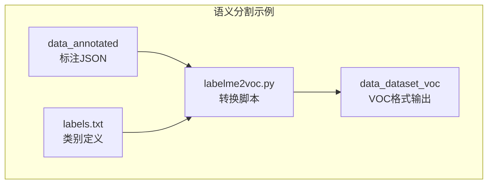
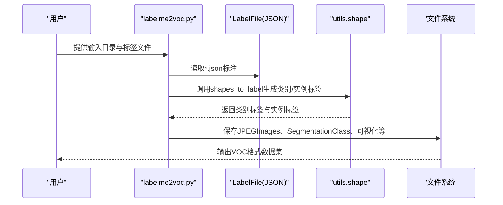
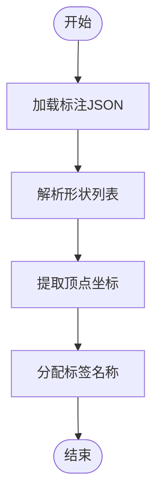
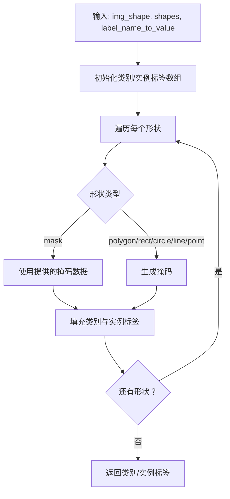
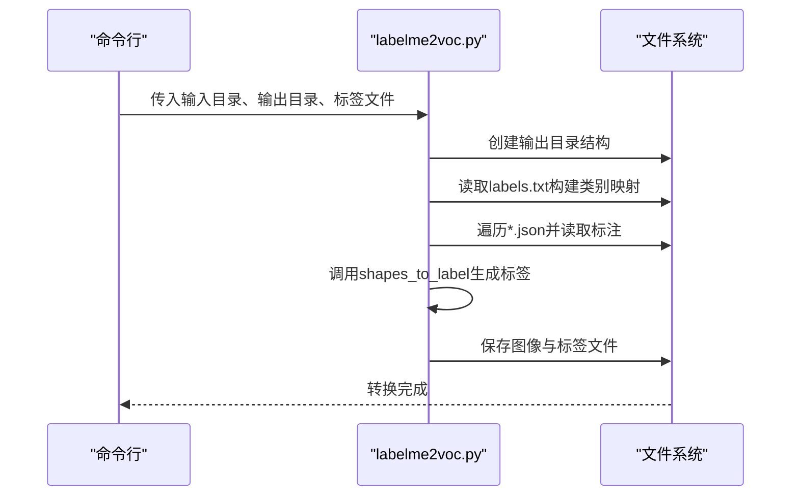
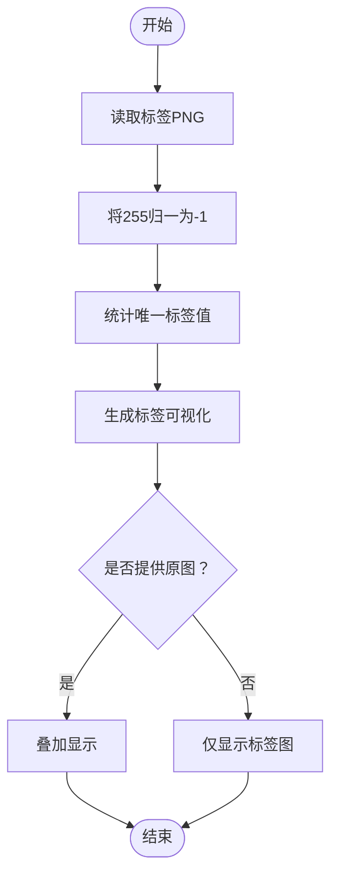
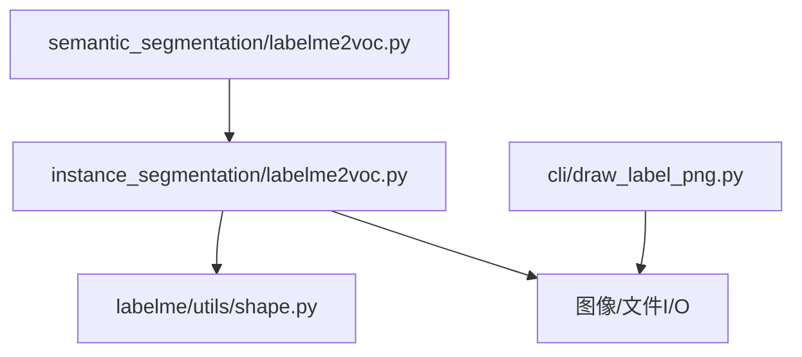

# 语义分割示例

<cite>
**本文引用的文件**
- [README.md](file://labelme/examples/semantic_segmentation/README.md)
- [labelme2voc.py](file://labelme/examples/semantic_segmentation/labelme2voc.py)
- [labels.txt](file://labelme/examples/semantic_segmentation/labels.txt)
- [2011_000003.json](file://labelme/examples/semantic_segmentation/data_annotated/2011_000003.json)
- [2011_000006.json](file://labelme/examples/semantic_segmentation/data_annotated/2011_000006.json)
- [class_names.txt](file://labelme/examples/semantic_segmentation/data_dataset_voc/class_names.txt)
- [labelme2voc.py](file://labelme/examples/instance_segmentation/labelme2voc.py)
- [shape.py](file://labelme/labelme/utils/shape.py)
- [draw_label_png.py](file://labelme/labelme/cli/draw_label_png.py)
- [json_to_dataset.py](file://labelme/labelme/cli/json_to_dataset.py)
- [default_config.yaml](file://labelme/labelme/config/default_config.yaml)
</cite>

## 目录
1. [简介](#简介)
2. [项目结构](#项目结构)
3. [核心组件](#核心组件)
4. [架构总览](#架构总览)
5. [详细组件分析](#详细组件分析)
6. [依赖关系分析](#依赖关系分析)
7. [性能考虑](#性能考虑)
8. [故障排除指南](#故障排除指南)
9. [结论](#结论)
10. [附录](#附录)

## 简介
本示例文档围绕语义分割标注与数据准备展开，基于仓库中的语义分割示例，系统讲解像素级标注技术、类别定义与边界处理方法，并提供从标注到VOC格式转换、可视化展示的完整流程。同时，结合实际标注文件与转换脚本，说明如何生成高质量的语义分割训练数据，覆盖医学影像、卫星遥感与自动驾驶等典型应用场景。

## 项目结构
语义分割示例位于 examples/semantic_segmentation 目录，包含标注数据、标签定义、转换脚本与VOC格式输出。核心文件包括：
- 标注数据：data_annotated/*.json（多边形标注）
- 标签定义：labels.txt（类别清单）
- 转换脚本：labelme2voc.py（语义/实例分割通用转换）
- VOC输出：data_dataset_voc（包含JPEGImages、SegmentationClass、SegmentationClassNpy、SegmentationClassVisualization等）

**图表来源**
- [README.md:1-37](file://labelme/examples/semantic_segmentation/README.md#L1-L37)
- [labelme2voc.py:1-1](file://labelme/examples/semantic_segmentation/labelme2voc.py#L1-L1)
- [labels.txt:1-22](file://labelme/examples/semantic_segmentation/labels.txt#L1-L22)

**章节来源**
- [README.md:1-37](file://labelme/examples/semantic_segmentation/README.md#L1-L37)
- [labels.txt:1-22](file://labelme/examples/semantic_segmentation/labels.txt#L1-L22)

## 核心组件
- 标注数据（JSON）：包含图像尺寸、图像路径以及多边形形状列表，每个形状包含标签、顶点坐标与形状类型等信息。
- 标签定义（labels.txt）：定义类别名称序列，其中包含忽略类与背景类的特殊约定。
- 转换脚本（labelme2voc.py）：将JSON标注转换为VOC格式的数据集，生成图像、语义类别标签、可视化与Numpy数组。
- 可视化工具（draw_label_png.py）：用于查看与核验标签PNG文件，支持叠加原图显示与标签值统计。
- 形状处理工具（shape.py）：提供多边形到掩码、形状到标签等核心算法，支撑语义/实例标签生成。

**章节来源**
- [2011_000003.json:1-478](file://labelme/examples/semantic_segmentation/data_annotated/2011_000003.json#L1-L478)
- [2011_000006.json:1-530](file://labelme/examples/semantic_segmentation/data_annotated/2011_000006.json#L1-L530)
- [labels.txt:1-22](file://labelme/examples/semantic_segmentation/labels.txt#L1-L22)
- [labelme2voc.py:1-1](file://labelme/examples/semantic_segmentation/labelme2voc.py#L1-L1)
- [draw_label_png.py:1-108](file://labelme/labelme/cli/draw_label_png.py#L1-L108)
- [shape.py:113-167](file://labelme/labelme/utils/shape.py#L113-L167)

## 架构总览
下图展示了从标注JSON到VOC输出的整体流程：读取标注文件 → 构建类别映射 → 生成语义类别标签与实例标签 → 保存图像与可视化结果。

**图表来源**
- [labelme2voc.py:80-153](file://labelme/examples/instance_segmentation/labelme2voc.py#L80-L153)
- [shape.py:113-167](file://labelme/labelme/utils/shape.py#L113-L167)

## 详细组件分析

### 组件A：标注数据与类别定义
- 标注JSON结构要点：版本号、标志、形状列表、图像路径、图像宽高与数据。
- 形状列表包含多边形标注，每个形状含标签、顶点坐标与形状类型；支持分组ID以区分实例。
- 类别定义：labels.txt定义了类别顺序，其中“__ignore__”与“_background_”具有特殊语义，分别对应忽略区域与背景类。

**图表来源**
- [2011_000003.json:4-176](file://labelme/examples/semantic_segmentation/data_annotated/2011_000003.json#L4-L176)
- [2011_000006.json:4-524](file://labelme/examples/semantic_segmentation/data_annotated/2011_000006.json#L4-L524)

**章节来源**
- [2011_000003.json:1-478](file://labelme/examples/semantic_segmentation/data_annotated/2011_000003.json#L1-L478)
- [2011_000006.json:1-530](file://labelme/examples/semantic_segmentation/data_annotated/2011_000006.json#L1-L530)
- [labels.txt:1-22](file://labelme/examples/semantic_segmentation/labels.txt#L1-L22)

### 组件B：形状到标签的转换
- 核心函数：shapes_to_label 将形状列表转换为两类标签数组：
  - 类别标签数组：每个像素的类别ID（背景/忽略/具体类别）
  - 实例标签数组：每个像素的实例ID（同一类别不同标注对象）
- 处理逻辑：根据形状类型生成掩码，填充类别与实例标签；支持掩码类型与多边形/矩形/圆形/线条/点等类型。

**图表来源**
- [shape.py:113-167](file://labelme/labelme/utils/shape.py#L113-L167)

**章节来源**
- [shape.py:113-167](file://labelme/labelme/utils/shape.py#L113-L167)

### 组件C：VOC格式转换与输出
- 转换脚本：labelme2voc.py（语义/实例通用）负责：
  - 读取标签文件构建类别映射（忽略类与背景类的特殊处理）
  - 逐文件读取JSON标注，调用shapes_to_label生成类别/实例标签
  - 保存JPEG图像、PNG类别标签、Numpy数组与可视化图像
- 输出目录结构：JPEGImages、SegmentationClass、SegmentationClassNpy、SegmentationClassVisualization（以及可选的实例分割输出）

**图表来源**
- [labelme2voc.py:17-153](file://labelme/examples/instance_segmentation/labelme2voc.py#L17-L153)

**章节来源**
- [labelme2voc.py:1-1](file://labelme/examples/semantic_segmentation/labelme2voc.py#L1-L1)
- [labelme2voc.py:17-153](file://labelme/examples/instance_segmentation/labelme2voc.py#L17-L153)
- [class_names.txt:1-21](file://labelme/examples/semantic_segmentation/data_dataset_voc/class_names.txt#L1-L21)

### 组件D：标签可视化与核验
- 工具：draw_label_png.py 用于查看标签PNG文件，支持：
  - 显示标签图像与叠加原图
  - 标签值统计与类别名称映射
  - 将255统一为-1（忽略区域）以便正确显示
- 应用场景：核验标签是否正确、边界是否清晰、类别是否一致。

**图表来源**
- [draw_label_png.py:14-103](file://labelme/labelme/cli/draw_label_png.py#L14-L103)

**章节来源**
- [draw_label_png.py:1-108](file://labelme/labelme/cli/draw_label_png.py#L1-L108)

### 组件E：标注规范与质量控制
- 标注规范建议：
  - 类别定义：明确背景类与忽略类，避免类别冲突与缺失
  - 多边形标注：尽量贴合边界，避免过粗线条导致边界模糊
  - 分组ID：同一对象的不同部分应共享group_id，确保实例一致性
- 质量控制：
  - 使用可视化工具核验标签PNG
  - 对比叠加图检查边界一致性
  - 统计标签值分布，排查异常值

**章节来源**
- [default_config.yaml:14-21](file://labelme/labelme/config/default_config.yaml#L14-L21)
- [draw_label_png.py:57-71](file://labelme/labelme/cli/draw_label_png.py#L57-L71)

## 依赖关系分析
- 语义分割示例脚本依赖于实例分割通用转换脚本（语义/实例共用）
- 转换过程依赖于形状处理工具（生成掩码与标签）
- 可视化依赖于图像处理库与标签到RGB映射工具

**图表来源**
- [labelme2voc.py:1-1](file://labelme/examples/semantic_segmentation/labelme2voc.py#L1-L1)
- [labelme2voc.py:1-157](file://labelme/examples/instance_segmentation/labelme2voc.py#L1-L157)
- [shape.py:1-233](file://labelme/labelme/utils/shape.py#L1-L233)
- [draw_label_png.py:1-108](file://labelme/labelme/cli/draw_label_png.py#L1-L108)

**章节来源**
- [labelme2voc.py:1-1](file://labelme/examples/semantic_segmentation/labelme2voc.py#L1-L1)
- [labelme2voc.py:1-157](file://labelme/examples/instance_segmentation/labelme2voc.py#L1-L157)
- [shape.py:1-233](file://labelme/labelme/utils/shape.py#L1-L233)
- [draw_label_png.py:1-108](file://labelme/labelme/cli/draw_label_png.py#L1-L108)

## 性能考虑
- 大图像处理：建议在转换前对图像进行缩放或分块处理，减少内存占用
- 批量转换：使用脚本批量处理JSON文件，避免重复初始化
- 数据类型：类别标签使用较小整型，实例标签使用唯一ID序列，兼顾存储与计算效率
- 可视化优化：仅在必要时生成可视化图像，避免I/O瓶颈

## 故障排除指南
- 转换失败：检查标签文件是否存在且格式正确，确认类别映射中包含忽略类与背景类
- 标签异常：使用可视化工具核验标签PNG，关注255值是否被正确归一为-1
- 边界模糊：重新标注多边形，确保贴合边缘；必要时增加关键点
- 输出为空：确认输入目录包含有效的JSON文件与标签文件

**章节来源**
- [draw_label_png.py:54-55](file://labelme/labelme/cli/draw_label_png.py#L54-L55)
- [labelme2voc.py:55-78](file://labelme/examples/instance_segmentation/labelme2voc.py#L55-L78)

## 结论
本示例展示了从像素级标注到VOC格式输出的完整工作流，涵盖类别定义、边界处理、数据转换与可视化核验。通过规范的标注流程与严格的质量控制，可为深度学习模型训练提供高质量的语义分割数据，适用于医学影像、卫星遥感与自动驾驶等多个领域。

## 附录
- 示例命令参考：
  - 标注：labelme data_annotated --labels labels.txt --nodata --validatelabel exact --config '{shift_auto_shape_color: -2}'
  - 转换：./labelme2voc.py data_annotated data_dataset_voc --labels labels.txt --noobject
  - 可视化：labelme_draw_label_png data_dataset_voc/SegmentationClass/2011_000003.png

**章节来源**
- [README.md:5-36](file://labelme/examples/semantic_segmentation/README.md#L5-L36)