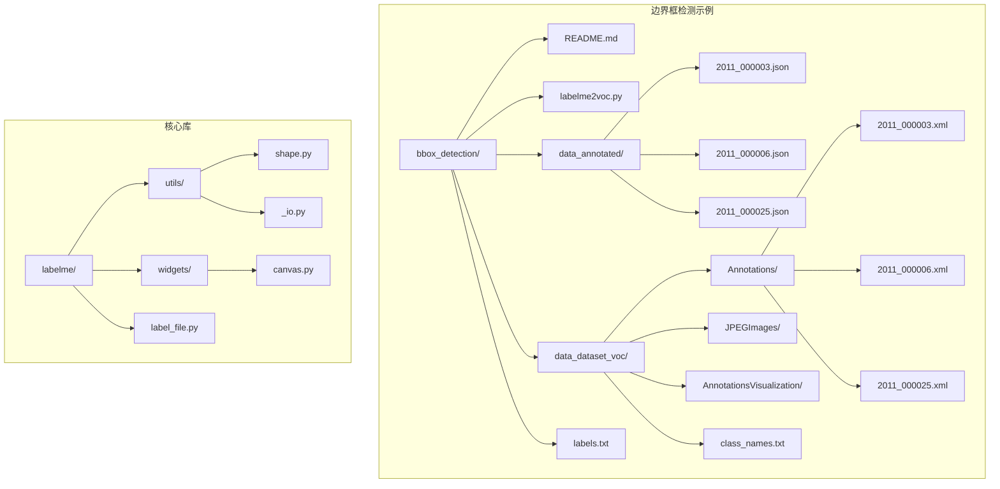
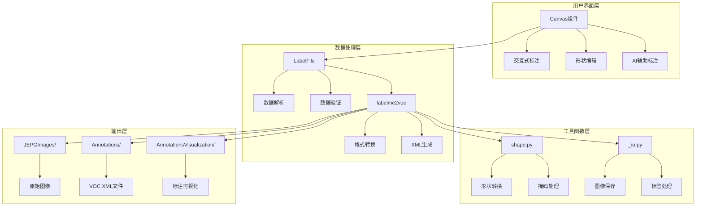
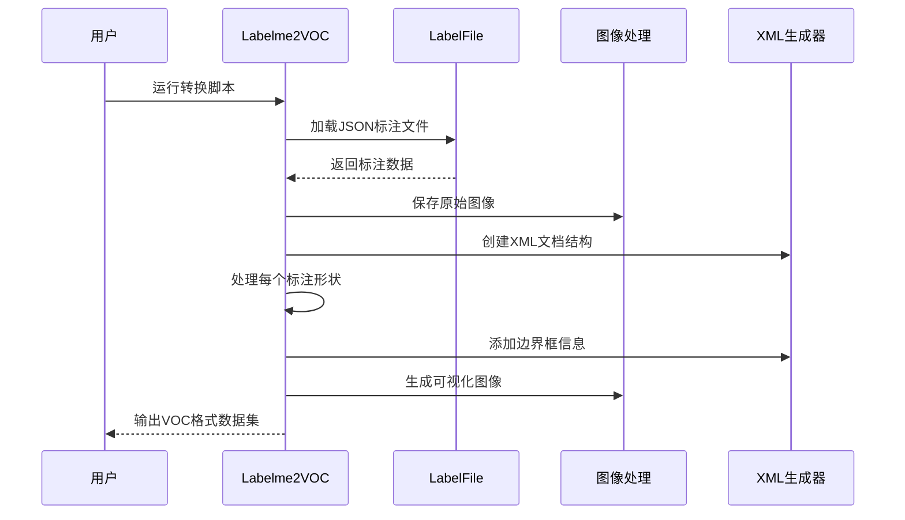
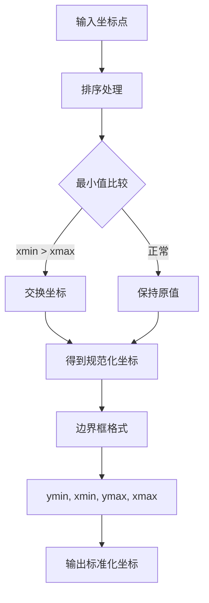
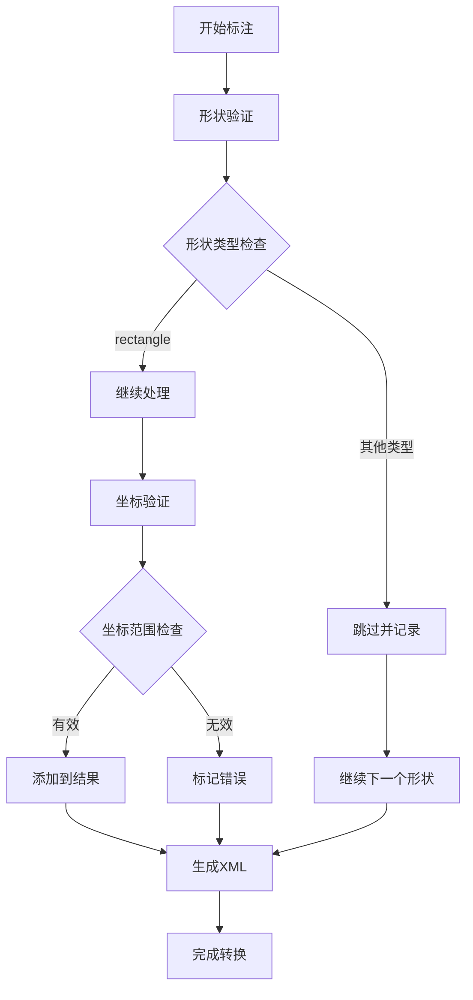
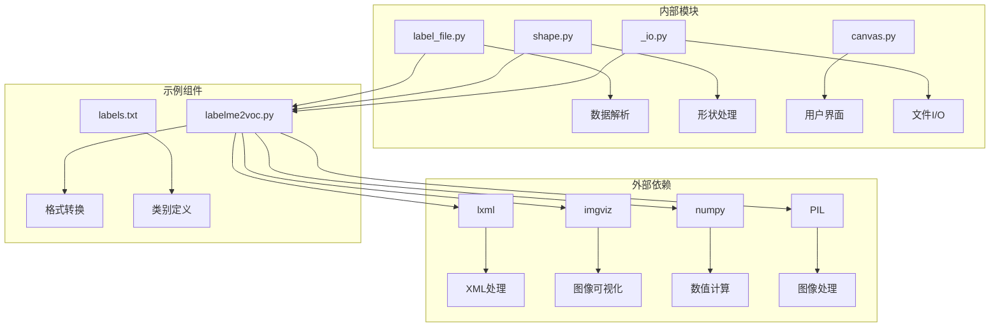

# 边界框检测示例

<cite>
**本文档引用的文件**
- [README.md](file://labelme/examples/bbox_detection/README.md)
- [labelme2voc.py](file://labelme/examples/bbox_detection/labelme2voc.py)
- [labels.txt](file://labelme/examples/bbox_detection/labels.txt)
- [2011_000003.json](file://labelme/examples/bbox_detection/data_annotated/2011_000003.json)
- [2011_000003.xml](file://labelme/examples/bbox_detection/data_dataset_voc/Annotations/2011_000003.xml)
- [class_names.txt](file://labelme/examples/bbox_detection/data_dataset_voc/class_names.txt)
- [shape.py](file://labelme/labelme/utils/shape.py)
- [canvas.py](file://labelme/labelme/widgets/canvas.py)
- [label_file.py](file://labelme/labelme/label_file.py)
- [_io.py](file://labelme/labelme/utils/_io.py)
</cite>

## 目录
1. [简介](#简介)
2. [项目结构](#项目结构)
3. [核心组件](#核心组件)
4. [架构概览](#架构概览)
5. [详细组件分析](#详细组件分析)
6. [依赖关系分析](#依赖关系分析)
7. [性能考虑](#性能考虑)
8. [故障排除指南](#故障排除指南)
9. [结论](#结论)
10. [附录](#附录)

## 简介

本示例文档深入讲解了基于Labelme的边界框检测标注系统，这是一个专为深度学习目标检测任务设计的标准化标注工具。该系统提供了完整的边界框标注、转换、验证和可视化功能，支持将Labelme格式的标注数据转换为标准的Pascal VOC格式。

边界框检测是计算机视觉领域的基础任务之一，广泛应用于物体检测、人脸识别、场景理解等多个领域。本系统的特色在于其标准化的数据格式、严格的标注规范和完善的质量控制机制。

## 项目结构

该项目采用模块化设计，主要包含以下核心目录和文件：



**图表来源**
- [README.md:1-26](file://labelme/examples/bbox_detection/README.md#L1-L26)
- [labelme2voc.py:1-147](file://labelme/examples/bbox_detection/labelme2voc.py#L1-L147)

**章节来源**
- [README.md:1-26](file://labelme/examples/bbox_detection/README.md#L1-L26)
- [labelme2voc.py:23-41](file://labelme/examples/bbox_detection/labelme2voc.py#L23-L41)

## 核心组件

### 数据标注组件

系统的核心数据标注功能由Labelme框架提供，支持多种形状类型的创建和编辑：

- **矩形标注工具**：专门用于边界框标注，提供精确的矩形绘制和调整功能
- **多边形标注工具**：支持复杂轮廓的精确标注
- **交互式编辑**：支持顶点选择、移动、删除等操作
- **AI辅助标注**：集成先进的AI模型，提高标注效率

### 数据转换组件

`labelme2voc.py`是系统的核心转换引擎，负责将Labelme格式转换为标准的Pascal VOC格式：

- **格式转换**：将JSON标注文件转换为XML格式
- **坐标系统**：处理像素坐标系和边界框坐标
- **元数据管理**：维护图像尺寸、类别信息等元数据
- **可视化生成**：自动生成标注可视化结果

### 工具函数组件

系统提供了一系列实用工具函数：

- **形状处理**：多边形到掩码的转换
- **标签生成**：类别标签和实例标签的生成
- **边界框计算**：从掩码计算边界框坐标
- **图像处理**：图像数据的读取和保存

**章节来源**
- [canvas.py:39-180](file://labelme/labelme/widgets/canvas.py#L39-L180)
- [labelme2voc.py:23-147](file://labelme/examples/bbox_detection/labelme2voc.py#L23-L147)
- [shape.py:41-111](file://labelme/labelme/utils/shape.py#L41-L111)

## 架构概览

系统采用分层架构设计，确保了良好的模块化和可扩展性：



**图表来源**
- [canvas.py:39-180](file://labelme/labelme/widgets/canvas.py#L39-L180)
- [label_file.py:42-193](file://labelme/labelme/label_file.py#L42-L193)
- [labelme2voc.py:23-147](file://labelme/examples/bbox_detection/labelme2voc.py#L23-L147)
- [shape.py:41-111](file://labelme/labelme/utils/shape.py#L41-L111)
- [_io.py:10-27](file://labelme/labelme/utils/_io.py#L10-L27)

## 详细组件分析

### 标注文件格式分析

Labelme使用JSON格式存储标注数据，具有以下特点：

```mermaid
erDiagram
LABELME_FILE {
string version
string flags
array shapes
string imagePath
string imageData
number imageHeight
number imageWidth
}
SHAPE {
string label
array points
number group_id
string shape_type
string flags
array other_data
}
RECTANGLE {
array points
number length = 2
}
LABELME_FILE ||--o{ SHAPE : contains
SHAPE ||--|| RECTANGLE : can be
```

**图表来源**
- [label_file.py:103-193](file://labelme/labelme/label_file.py#L103-L193)
- [2011_000003.json:1-42](file://labelme/examples/bbox_detection/data_annotated/2011_000003.json#L1-L42)

#### 标注文件结构详解

每个标注文件包含以下关键字段：

- **版本信息**：记录Labelme版本号
- **图像信息**：图像路径、尺寸和数据
- **形状数据**：标注的几何形状列表
- **标志位**：用户定义的元数据

**章节来源**
- [label_file.py:103-193](file://labelme/labelme/label_file.py#L103-L193)
- [2011_000003.json:1-42](file://labelme/examples/bbox_detection/data_annotated/2011_000003.json#L1-L42)

### VOC格式转换流程

系统实现了从Labelme格式到Pascal VOC格式的完整转换流程：



**图表来源**
- [labelme2voc.py:65-142](file://labelme/examples/bbox_detection/labelme2voc.py#L65-L142)

#### 转换过程的关键步骤

1. **文件加载**：解析JSON标注文件
2. **图像处理**：提取和保存原始图像数据
3. **XML构建**：创建标准的Pascal VOC XML结构
4. **边界框处理**：转换坐标系统并添加到XML
5. **可视化生成**：创建标注结果的可视化版本

**章节来源**
- [labelme2voc.py:65-142](file://labelme/examples/bbox_detection/labelme2voc.py#L65-L142)

### 坐标系统和边界框计算

系统实现了精确的坐标系统处理机制：



**图表来源**
- [labelme2voc.py:107-113](file://labelme/examples/bbox_detection/labelme2voc.py#L107-L113)

#### 坐标系统规范

系统采用标准的像素坐标系，其中：
- **原点位置**：左上角 (0, 0)
- **X轴方向**：向右为正
- **Y轴方向**：向下为正
- **坐标格式**：(xmin, ymin, xmax, ymax)

**章节来源**
- [labelme2voc.py:107-113](file://labelme/examples/bbox_detection/labelme2voc.py#L107-L113)

### 标注质量控制机制

系统内置了多重质量控制机制：



**图表来源**
- [labelme2voc.py:95-102](file://labelme/examples/bbox_detection/labelme2voc.py#L95-L102)

#### 质量控制要点

- **形状类型过滤**：只处理矩形标注
- **坐标有效性检查**：确保坐标在图像范围内
- **重复标注检测**：避免重复的边界框
- **类别标签验证**：检查类别名称的有效性

**章节来源**
- [labelme2voc.py:95-102](file://labelme/examples/bbox_detection/labelme2voc.py#L95-L102)

## 依赖关系分析

系统依赖关系清晰明确，各组件职责分离：



**图表来源**
- [labelme2voc.py:15-20](file://labelme/examples/bbox_detection/labelme2voc.py#L15-L20)
- [label_file.py:1-13](file://labelme/labelme/label_file.py#L1-L13)
- [shape.py:10-18](file://labelme/labelme/utils/shape.py#L10-L18)

### 核心依赖说明

- **lxml**：用于XML文档的创建和处理
- **imgviz**：提供图像可视化和标注功能
- **numpy**：支持高效的数值计算
- **PIL**：处理图像数据的读取和保存

**章节来源**
- [labelme2voc.py:15-20](file://labelme/examples/bbox_detection/labelme2voc.py#L15-L20)
- [canvas.py:1-18](file://labelme/labelme/widgets/canvas.py#L1-L18)

## 性能考虑

系统在设计时充分考虑了性能优化：

### 内存管理
- **流式处理**：大文件采用流式读取方式
- **及时释放**：处理完的图像数据及时释放内存
- **批量操作**：支持批量文件处理

### 处理效率
- **向量化计算**：利用NumPy进行高效的数组操作
- **缓存机制**：图像嵌入向量的缓存减少重复计算
- **增量处理**：支持增量转换，避免重复处理已完成的文件

### 并发处理
- **异步操作**：AI模型推理支持异步处理
- **多线程支持**：文件I/O操作支持并发执行

## 故障排除指南

### 常见问题及解决方案

#### XML库缺失
**问题**：运行转换脚本报错缺少lxml库
**解决方案**：安装lxml库
```bash
pip install lxml
```

#### 图像文件加载失败
**问题**：标注文件中的图像路径不正确
**解决方案**：检查JSON文件中的imagePath字段，确保路径正确

#### 坐标越界
**问题**：边界框坐标超出图像范围
**解决方案**：检查标注的坐标值，确保在有效范围内

#### 类别标签错误
**问题**：XML文件中的类别名称不在标签列表中
**解决方案**：检查labels.txt文件，确保所有类别都已正确定义

**章节来源**
- [labelme2voc.py:18-20](file://labelme/examples/bbox_detection/labelme2voc.py#L18-L20)
- [label_file.py:177-179](file://labelme/labelme/label_file.py#L177-L179)

## 结论

本边界框检测标注系统提供了一个完整、标准化的解决方案，适用于深度学习目标检测任务。系统的主要优势包括：

1. **标准化格式**：支持Pascal VOC格式，便于与其他工具链集成
2. **严格的质量控制**：内置多重验证机制确保数据质量
3. **用户友好**：提供直观的图形界面和丰富的交互功能
4. **高性能**：优化的算法和数据结构确保高效的处理能力
5. **可扩展性**：模块化的架构便于功能扩展和定制

该系统为物体检测、人脸识别、场景理解等应用提供了高质量的标注数据，是构建深度学习目标检测模型的理想选择。

## 附录

### 使用示例

#### 基本标注流程
```bash
# 启动标注界面
labelme data_annotated --labels labels.txt --nodata --autosave

# 转换为VOC格式
./labelme2voc.py data_annotated data_dataset_voc --labels labels.txt
```

#### 数据集结构说明

- **JPEGImages/**：原始图像文件
- **Annotations/**：VOC格式的标注文件
- **AnnotationsVisualization/**：标注结果的可视化版本
- **class_names.txt**：类别名称列表

### 最佳实践建议

1. **标注规范**：确保边界框完全包围目标物体
2. **类别定义**：在labels.txt中明确定义所有类别
3. **质量检查**：定期检查标注质量和完整性
4. **数据平衡**：确保各类别的样本数量相对均衡
5. **版本控制**：对标注数据进行版本管理