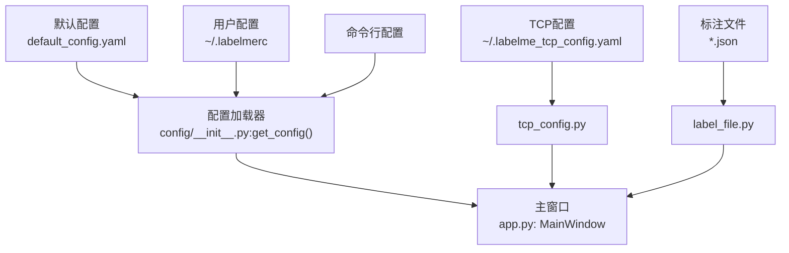
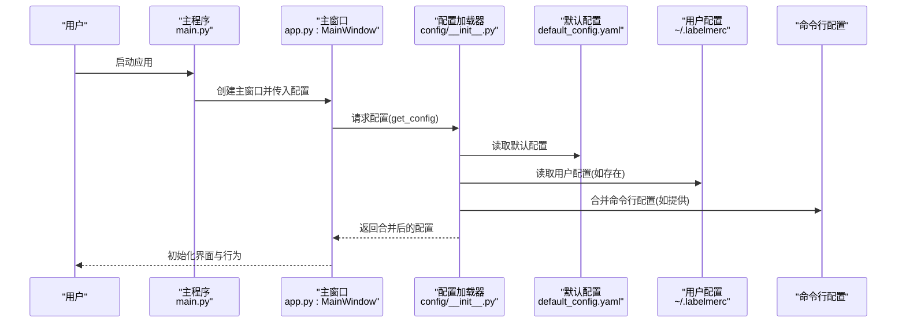
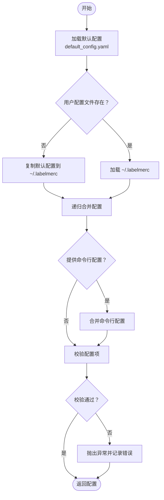
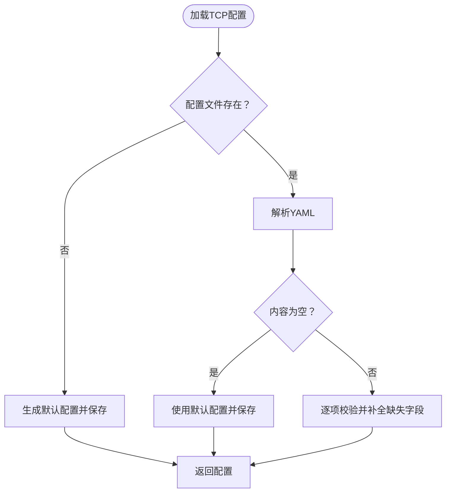
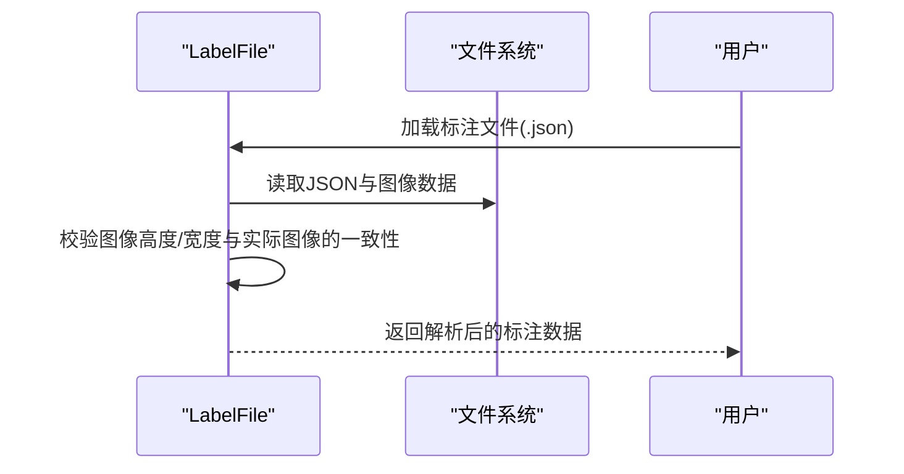
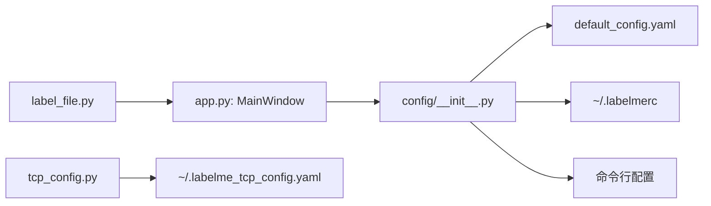

# 配置管理

<cite>
**本文引用的文件**
- [labelme\config\default_config.yaml](file://labelme\config\default_config.yaml)
- [labelme\config\__init__.py](file://labelme\config\__init__.py)
- [labelme\tcp_config.py](file://labelme\tcp_config.py)
- [labelme\label_file.py](file://labelme\label_file.py)
- [labelme\app.py](file://labelme\app.py)
- [main.py](file://main.py)
- [labelme_config.json](file://labelme_config.json)
- [labelme_config.ini](file://labelme_config.ini)
</cite>

## 目录
1. [简介](#简介)
2. [项目结构](#项目结构)
3. [核心组件](#核心组件)
4. [架构总览](#架构总览)
5. [详细组件分析](#详细组件分析)
6. [依赖分析](#依赖分析)
7. [性能考虑](#性能考虑)
8. [故障排除指南](#故障排除指南)
9. [结论](#结论)
10. [附录](#附录)

## 简介
本文件系统性阐述 labelme 的配置管理系统，覆盖默认配置、用户配置、命令行配置的加载与合并流程；解释配置项的结构、作用域与取值范围；给出配置文件位置、格式与优先级规则；提供备份、迁移与版本管理建议；并结合实际代码路径给出最佳实践与故障排除方法。同时补充 TCP 客户端配置与标注文件元数据的配置要点，帮助用户在不同使用场景下高效定制。

## 项目结构
labelme 的配置体系由以下部分组成：
- 默认配置：位于 YAML 文件，定义所有可用配置项及其默认值。
- 用户配置：首次运行时从默认配置复制到用户目录，用户可在该文件中覆盖默认值。
- 命令行配置：通过命令行参数传入的配置片段，优先级最高。
- TCP 客户端配置：独立于主配置的 TCP 客户端配置文件，便于网络通信参数管理。
- 标注文件元数据：标注 JSON 中的版本、图像路径、尺寸等字段，属于“数据配置”的一部分。

图表来源
- [labelme\config\default_config.yaml:1-147](file://labelme\config\default_config.yaml#L1-L147)
- [labelme\config\__init__.py:104-148](file://labelme\config\__init__.py#L104-L148)
- [labelme\tcp_config.py:14-107](file://labelme\tcp_config.py#L14-L107)
- [labelme\label_file.py:103-193](file://labelme\label_file.py#L103-L193)
- [labelme\app.py:117-200](file://labelme\app.py#L117-L200)

章节来源
- [labelme\config\default_config.yaml:1-147](file://labelme\config\default_config.yaml#L1-L147)
- [labelme\config\__init__.py:104-148](file://labelme\config\__init__.py#L104-L148)
- [labelme\tcp_config.py:14-107](file://labelme\tcp_config.py#L14-L107)
- [labelme\label_file.py:103-193](file://labelme\label_file.py#L103-L193)
- [labelme\app.py:117-200](file://labelme\app.py#L117-L200)

## 核心组件
- 配置加载与合并
  - 默认配置：从默认 YAML 文件加载，首次运行时复制到用户目录 ~/.labelmerc。
  - 文件配置：支持传入 YAML 字符串或文件路径，加载后与默认配置递归合并。
  - 命令行配置：作为最高优先级的增量配置合并。
  - 配置校验：对关键配置项进行取值范围校验，非法值将抛出异常。
- TCP 客户端配置
  - 自动生成默认 TCP 配置文件，缺失字段自动补全为默认值。
  - 读写均使用安全的 YAML 序列化/反序列化。
- 标注文件元数据
  - JSON 中包含版本、图像路径、图像尺寸、标注形状、标志位等字段。
  - 加载时进行尺寸一致性校验，必要时以实际图像为准修正记录值。

章节来源
- [labelme\config\__init__.py:42-75](file://labelme\config\__init__.py#L42-L75)
- [labelme\config\__init__.py:104-148](file://labelme\config\__init__.py#L104-L148)
- [labelme\config\__init__.py:77-102](file://labelme\config\__init__.py#L77-L102)
- [labelme\tcp_config.py:40-78](file://labelme\tcp_config.py#L40-L78)
- [labelme\tcp_config.py:81-107](file://labelme\tcp_config.py#L81-L107)
- [labelme\label_file.py:103-193](file://labelme\label_file.py#L103-L193)
- [labelme\label_file.py:225-291](file://labelme\label_file.py#L225-L291)

## 架构总览
配置系统遵循“默认配置 → 用户配置 → 命令行配置”的优先级顺序，通过递归合并策略保证嵌套字典的正确叠加。TCP 配置与主配置相互独立，分别服务于网络通信与标注界面行为。标注文件的元数据作为“数据配置”参与标注流程，与配置项共同决定最终行为。

图表来源
- [main.py:249-250](file://main.py#L249-L250)
- [labelme\config\__init__.py:104-148](file://labelme\config\__init__.py#L104-L148)
- [labelme\config\default_config.yaml:1-147](file://labelme\config\default_config.yaml#L1-L147)

## 详细组件分析

### 配置加载与合并流程
- 加载顺序与优先级
  - 默认配置：来自默认 YAML 文件。
  - 用户配置：位于用户主目录的 .labelmerc 文件，若不存在则从默认配置复制一份。
  - 命令行配置：最高优先级，仅对存在的键生效。
- 合并与校验
  - update_dict 递归合并嵌套字典；遇到未知键会记录告警并跳过。
  - validate_config_item 对关键键进行取值范围校验，非法值抛出异常。
- 错误处理
  - 文件不存在、YAML 解析错误、合并异常均有明确的日志与异常抛出。

图表来源
- [labelme\config\__init__.py:42-75](file://labelme\config\__init__.py#L42-L75)
- [labelme\config\__init__.py:14-37](file://labelme\config\__init__.py#L14-L37)
- [labelme\config\__init__.py:77-102](file://labelme\config\__init__.py#L77-L102)
- [labelme\config\__init__.py:104-148](file://labelme\config\__init__.py#L104-L148)

章节来源
- [labelme\config\__init__.py:14-37](file://labelme\config\__init__.py#L14-L37)
- [labelme\config\__init__.py:77-102](file://labelme\config\__init__.py#L77-L102)
- [labelme\config\__init__.py:104-148](file://labelme\config\__init__.py#L104-L148)

### TCP 客户端配置
- 文件位置：~/.labelme_tcp_config.yaml
- 默认字段：主机、端口、消息内容、发送间隔、重连间隔。
- 加载策略：若文件不存在或为空，使用默认值并写回文件；缺失字段自动补全。
- 保存策略：使用安全的 YAML 写入，确保目录存在。

图表来源
- [labelme\tcp_config.py:40-78](file://labelme\tcp_config.py#L40-L78)
- [labelme\tcp_config.py:81-107](file://labelme\tcp_config.py#L81-L107)

章节来源
- [labelme\tcp_config.py:14-22](file://labelme\tcp_config.py#L14-L22)
- [labelme\tcp_config.py:24-38](file://labelme\tcp_config.py#L24-L38)
- [labelme\tcp_config.py:40-78](file://labelme\tcp_config.py#L40-L78)
- [labelme\tcp_config.py:81-107](file://labelme\tcp_config.py#L81-L107)

### 标注文件元数据与配置联动
- 标注文件包含版本、图像路径、图像尺寸、标注形状、标志位等字段。
- 加载时对图像尺寸进行一致性校验，必要时以实际图像为准修正记录值。
- 配置项影响标注行为（如颜色、快捷键、画布设置），与标注文件共同决定最终体验。

图表来源
- [labelme\label_file.py:103-193](file://labelme\label_file.py#L103-L193)
- [labelme\label_file.py:195-224](file://labelme\label_file.py#L195-L224)

章节来源
- [labelme\label_file.py:103-193](file://labelme\label_file.py#L103-L193)
- [labelme\label_file.py:195-224](file://labelme\label_file.py#L195-L224)

### 配置项分类与作用说明
- 基本功能
  - auto_save：是否启用自动保存。
  - display_label_popup：是否显示标签弹窗。
  - store_data：是否存储数据。
  - keep_prev / keep_prev_scale / keep_prev_brightness / keep_prev_contrast：是否保持上一个文件的状态与视觉参数。
  - logger_level：日志级别。
- 标签与标志
  - flags / label_flags / labels：全局标志、标签标志与预定义标签列表。
  - sort_labels：是否对标签进行排序。
  - validate_label：标签验证模式（null 或 "exact"）。
- 颜色与形状样式
  - default_shape_color：默认形状颜色。
  - shape_color：形状颜色模式（null、'auto'、'manual'）。
  - shift_auto_shape_color：自动形状颜色偏移。
  - label_colors：标签颜色配置。
  - shape.*：线条颜色、填充颜色、顶点颜色与点大小等。
- AI 功能
  - ai.default：默认 AI 模型名称。
- 主界面停靠窗口
  - flag_dock / label_dock / shape_dock / file_dock：各停靠窗口的显示、关闭、移动、浮动属性。
- 标签对话框
  - show_label_text_field：是否显示标签文本字段。
  - label_completion：标签自动完成模式。
  - fit_to_content：内容适配（列/行）。
- 画布与交互
  - epsilon：选择精度。
  - canvas.fill_drawing：是否填充绘制。
  - canvas.double_click：双击操作（如关闭多边形）。
  - canvas.num_backups：最大备份数量。
  - canvas.crosshair.*：多边形/矩形/圆形/直线/点/折线/AI多边形/AI掩码模式下的十字准星开关。
- 快捷键
  - 文件操作、导航、缩放、绘图工具、显示控制等快捷键映射。

章节来源
- [labelme\config\default_config.yaml:5-147](file://labelme\config\default_config.yaml#L5-L147)

## 依赖分析
- 配置加载器依赖 YAML 解析与日志库，负责默认配置读取、用户配置复制、文件/命令行配置合并与校验。
- 主窗口在初始化阶段读取配置并将其应用于 UI 组件（如颜色、点大小、停靠窗口可见性等）。
- TCP 配置模块独立于主配置，提供 TCP 客户端参数的持久化与校验。
- 标注文件模块与配置协同工作，配置项影响标注行为，标注文件承载数据层面的元信息。

图表来源
- [labelme\config\__init__.py:104-148](file://labelme\config\__init__.py#L104-L148)
- [labelme\config\default_config.yaml:1-147](file://labelme\config\default_config.yaml#L1-L147)
- [labelme\app.py:117-200](file://labelme\app.py#L117-L200)
- [labelme\tcp_config.py:14-22](file://labelme\tcp_config.py#L14-L22)
- [labelme\label_file.py:103-193](file://labelme\label_file.py#L103-L193)

章节来源
- [labelme\config\__init__.py:104-148](file://labelme\config\__init__.py#L104-L148)
- [labelme\app.py:117-200](file://labelme\app.py#L117-L200)
- [labelme\tcp_config.py:14-22](file://labelme\tcp_config.py#L14-L22)
- [labelme\label_file.py:103-193](file://labelme\label_file.py#L103-L193)

## 性能考虑
- 配置加载为一次性操作，通常在应用启动时完成，对运行时性能影响极小。
- 递归合并与校验均为轻量级操作，建议避免在高频路径中重复加载配置。
- TCP 配置读写使用安全的 YAML 序列化，建议定期维护配置文件大小，避免过大导致 IO 延迟。
- 标注文件尺寸校验与图像读取可能带来 IO 和 CPU 开销，建议在大批量标注时关注磁盘与内存占用。

## 故障排除指南
- 配置文件不存在或格式错误
  - 现象：启动时报错或使用默认配置。
  - 处理：检查默认配置文件是否存在；确认用户配置文件 YAML 格式正确；必要时删除损坏文件以触发重新复制。
  - 参考路径：[labelme\config\__init__.py:55-64](file://labelme\config\__init__.py#L55-L64)、[labelme\config\__init__.py:133-141](file://labelme\config\__init__.py#L133-L141)
- 配置项取值非法
  - 现象：校验失败并抛出异常。
  - 处理：核对 validate_label、shape_color、labels 等键的取值范围。
  - 参考路径：[labelme\config\__init__.py:90-101](file://labelme\config\__init__.py#L90-L101)
- TCP 配置加载失败
  - 现象：TCP 客户端无法连接或使用默认参数。
  - 处理：检查 TCP 配置文件是否存在且可读；确认字段完整性；必要时删除文件以重建。
  - 参考路径：[labelme\tcp_config.py:57-78](file://labelme\tcp_config.py#L57-L78)
- 标注文件尺寸不一致
  - 现象：加载时记录的图像尺寸与实际不符。
  - 处理：以实际图像尺寸为准修正记录值；检查图像文件是否损坏。
  - 参考路径：[labelme\label_file.py:195-224](file://labelme\label_file.py#L195-L224)
- 配置优先级误解
  - 现象：命令行配置未生效。
  - 处理：确认命令行参数传入方式与键名正确；注意仅对存在的键生效。
  - 参考路径：[labelme\config\__init__.py:144-145](file://labelme\config\__init__.py#L144-L145)

章节来源
- [labelme\config\__init__.py:55-64](file://labelme\config\__init__.py#L55-L64)
- [labelme\config\__init__.py:133-141](file://labelme\config\__init__.py#L133-L141)
- [labelme\config\__init__.py:90-101](file://labelme\config\__init__.py#L90-L101)
- [labelme\tcp_config.py:57-78](file://labelme\tcp_config.py#L57-L78)
- [labelme\label_file.py:195-224](file://labelme\label_file.py#L195-L224)
- [labelme\config\__init__.py:144-145](file://labelme\config\__init__.py#L144-L145)

## 结论
labelme 的配置系统以 YAML 为核心，通过默认配置、用户配置与命令行配置的分层合并，实现了灵活而可控的定制能力。配合 TCP 配置与标注文件元数据，系统在界面行为、标注体验与网络通信方面具备完善的配置支持。建议用户遵循“最小变更原则”，仅在必要时修改用户配置，并定期备份与校验配置文件，以获得稳定可靠的使用体验。

## 附录

### 配置文件位置与格式
- 默认配置：位于默认 YAML 文件，包含所有可用配置项的默认值。
- 用户配置：位于用户主目录的 .labelmerc 文件，首次运行时从默认配置复制。
- TCP 配置：位于用户主目录的 .labelme_tcp_config.yaml 文件，独立管理网络参数。
- 标注文件：JSON 格式，包含版本、图像路径、尺寸、标注形状与标志位等元数据。

章节来源
- [labelme\config\default_config.yaml:1-147](file://labelme\config\default_config.yaml#L1-L147)
- [labelme\config\__init__.py:66-74](file://labelme\config\__init__.py#L66-L74)
- [labelme\tcp_config.py:14-22](file://labelme\tcp_config.py#L14-L22)
- [labelme\label_file.py:103-193](file://labelme\label_file.py#L103-L193)

### 配置优先级与合并规则
- 优先级：默认配置 → 用户配置 → 命令行配置。
- 合并策略：嵌套字典递归合并；未知键跳过并告警；仅对存在的键生效。
- 校验策略：对关键键进行取值范围校验，非法值抛出异常。

章节来源
- [labelme\config\__init__.py:14-37](file://labelme\config\__init__.py#L14-L37)
- [labelme\config\__init__.py:104-148](file://labelme\config\__init__.py#L104-L148)
- [labelme\config\__init__.py:77-102](file://labelme\config\__init__.py#L77-L102)

### 备份、迁移与版本管理建议
- 备份
  - 备份用户配置文件 ~/.labelmerc 与 TCP 配置文件 ~/.labelme_tcp_config.yaml。
  - 备份标注文件目录，确保标注历史可追溯。
- 迁移
  - 升级版本时保留用户配置文件；若新增配置项，建议手动比对默认配置并合并。
  - TCP 配置文件如需迁移，建议在新环境重新生成并按需调整。
- 版本管理
  - 使用版本控制工具管理用户配置文件，记录变更历史与原因。
  - 对标注文件采用版本控制或定期导出备份，避免数据丢失。

### 常见配置场景与最佳实践
- 界面设置
  - 标签弹窗：根据团队协作需求开启/关闭标签弹窗。
  - 停靠窗口：按工作流固定常用停靠窗口的显示与浮动状态。
- 标注行为
  - 自动保存：在长时间标注时建议开启，降低数据丢失风险。
  - 保持上一个文件状态：提升连续标注效率。
- AI 功能
  - 默认 AI 模型：根据任务类型选择合适的默认模型，减少每次切换成本。
- 性能调优
  - 备份数量：在资源受限环境中适当降低备份数量。
  - 十字准星：按需启用多边形/矩形等模式下的十字准星，平衡精度与性能。
- 快捷键
  - 根据个人习惯与键盘布局调整常用快捷键组合，提高标注效率。

### 动态配置更新与验证
- 动态更新
  - 主窗口在初始化阶段一次性读取并应用配置；运行时如需动态更新，建议重启应用以确保一致性。
- 验证规则
  - 关键键值严格校验，非法值将阻止应用启动并记录错误日志。

章节来源
- [labelme\config\__init__.py:77-102](file://labelme\config\__init__.py#L77-L102)
- [labelme\config\__init__.py:104-148](file://labelme\config\__init__.py#L104-L148)
- [labelme\app.py:117-200](file://labelme\app.py#L117-L200)

### 配置模板与示例
- 默认配置模板
  - 参考默认 YAML 文件，按需在用户配置中覆盖对应键值。
  - 参考路径：[labelme\config\default_config.yaml:1-147](file://labelme\config\default_config.yaml#L1-L147)
- TCP 配置模板
  - 参考 TCP 配置模块的默认字段，按需调整主机、端口与间隔参数。
  - 参考路径：[labelme\tcp_config.py:24-38](file://labelme\tcp_config.py#L24-L38)
- 标注文件示例
  - 参考标注文件模块的字段定义，理解版本、图像路径、尺寸与形状等元数据。
  - 参考路径：[labelme\label_file.py:103-193](file://labelme\label_file.py#L103-L193)