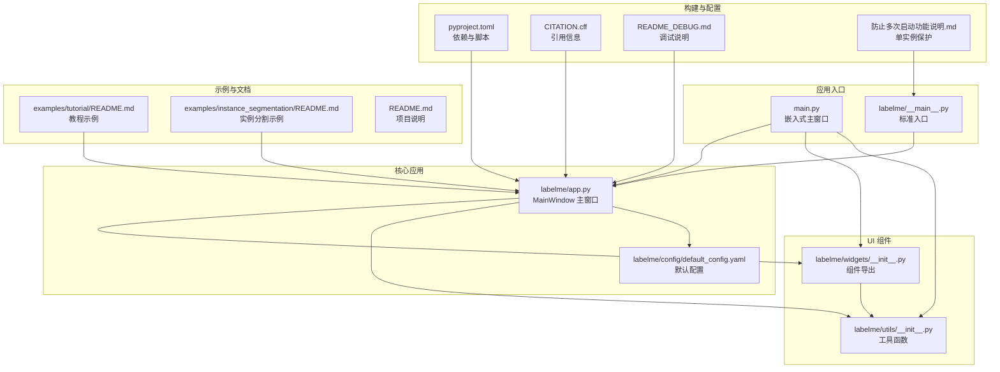
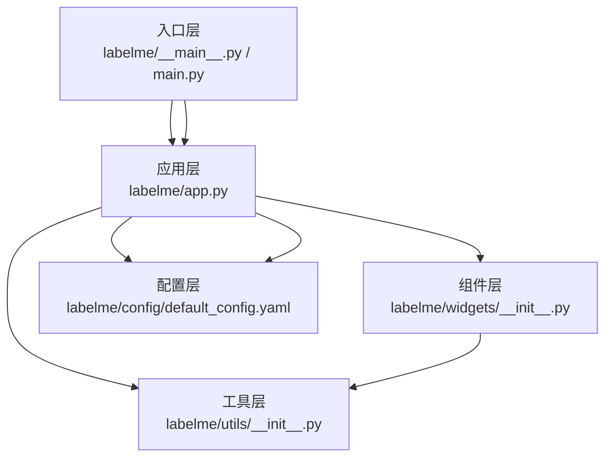
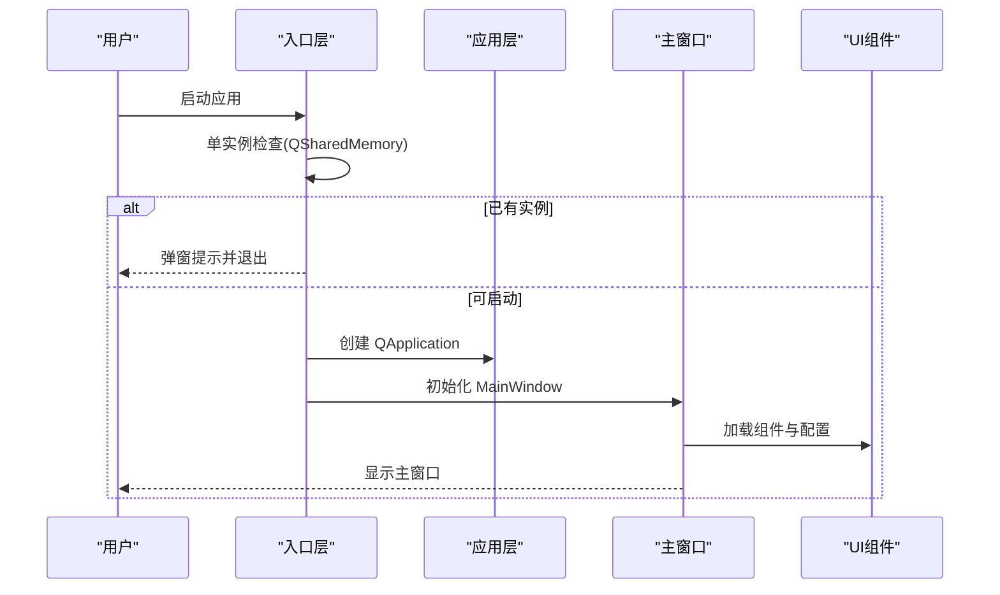
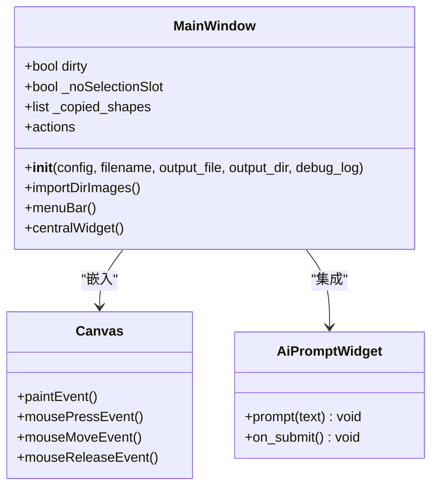
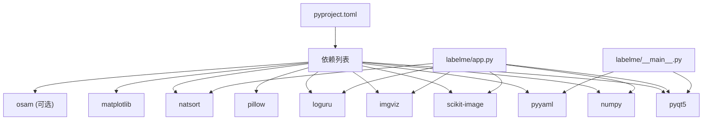

# 项目概述

<cite>
**本文档引用的文件**
- [README.md](file://README.md)
- [main.py](file://main.py)
- [labelme/__main__.py](file://labelme/__main__.py)
- [pyproject.toml](file://pyproject.toml)
- [labelme/app.py](file://labelme/app.py)
- [labelme/config/default_config.yaml](file://labelme/config/default_config.yaml)
- [labelme/widgets/__init__.py](file://labelme/widgets/__init__.py)
- [labelme/utils/__init__.py](file://labelme/utils/__init__.py)
- [CITATION.cff](file://CITATION.cff)
- [examples/tutorial/README.md](file://examples/tutorial/README.md)
- [examples/instance_segmentation/README.md](file://examples/instance_segmentation/README.md)
- [README_DEBUG.md](file://README_DEBUG.md)
- [防止多次启动功能说明.md](file://防止多次启动功能说明.md)
</cite>

## 目录
1. [简介](#简介)
2. [项目结构](#项目结构)
3. [核心组件](#核心组件)
4. [架构总览](#架构总览)
5. [详细组件分析](#详细组件分析)
6. [依赖关系分析](#依赖关系分析)
7. [性能考量](#性能考量)
8. [故障排除指南](#故障排除指南)
9. [结论](#结论)
10. [附录](#附录)

## 简介
Labelme 是一个基于 Python 和 PyQt5 的桌面图像标注工具，专注于多边形标注，并提供矩形、圆形、线条、点等多种标注类型的图形化界面。它支持 AI 辅助标注、视频标注、多种数据集格式导出（VOC、COCO），以及丰富的 GUI 自定义能力。项目采用 GPLv3 开源协议，强调易用性与可扩展性，适合科研、工程与教学场景使用。

- 核心目标：提供直观、高效的图像标注体验，支持从基础多边形标注到复杂实例/语义分割的数据准备。
- 主要特性：多标注类型、AI 智能标注、视频标注、GUI 自定义、数据集导出、单实例保护、命令行与图形界面双入口。
- 设计理念：以 Qt 为核心的桌面应用，强调用户交互流畅性与标注结果的标准化输出；通过 CLI 与 GUI 并行，满足不同使用习惯与自动化需求。

**章节来源**
- [README.md:29-42](file://README.md#L29-L42)
- [README.md:43-51](file://README.md#L43-L51)

## 项目结构
项目采用模块化组织，核心逻辑集中在 labelme 包中，包含应用入口、主窗口、工具函数、UI 组件与配置管理等子模块；examples 提供多种典型标注场景的示例与转换脚本；根目录包含构建脚本、配置文件与测试脚本。

**图表来源**
- [main.py:118-214](file://main.py#L118-L214)
- [labelme/__main__.py:137-341](file://labelme/__main__.py#L137-L341)
- [labelme/app.py:99-200](file://labelme/app.py#L99-L200)
- [labelme/config/default_config.yaml:1-147](file://labelme/config/default_config.yaml#L1-L147)
- [labelme/widgets/__init__.py:1-47](file://labelme/widgets/__init__.py#L1-L47)
- [labelme/utils/__init__.py:1-38](file://labelme/utils/__init__.py#L1-L38)
- [examples/tutorial/README.md:1-67](file://examples/tutorial/README.md#L1-L67)
- [examples/instance_segmentation/README.md:1-50](file://examples/instance_segmentation/README.md#L1-L50)
- [pyproject.toml:1-75](file://pyproject.toml#L1-L75)
- [CITATION.cff:1-11](file://CITATION.cff#L1-L11)
- [README_DEBUG.md:1-64](file://README_DEBUG.md#L1-L64)
- [防止多次启动功能说明.md:1-160](file://防止多次启动功能说明.md#L1-L160)

**章节来源**
- [pyproject.toml:5-39](file://pyproject.toml#L5-L39)
- [README.md:29-42](file://README.md#L29-L42)

## 核心组件
- 应用入口与主窗口
  - 标准入口：labelme/__main__.py 提供命令行入口，负责参数解析、单实例检查、国际化与主窗口创建。
  - 嵌入式主窗口：main.py 提供自定义 UI 的主窗口，将 labelme 的 MainWindow 嵌入到自定义布局中，扩展模型训练与使用的功能。
- 主窗口 MainWindow
  - labelme/app.py 定义 MainWindow，负责图像加载、标注工具管理、AI 功能集成、TCP 通信、文件监控、配置与状态持久化等。
- UI 组件与工具
  - widgets 包导出所有 UI 组件，如 Canvas、LabelDialog、LabelListWidget、ZoomWidget、AiPromptWidget 等。
  - utils 包提供图像处理、形状转换、Qt 工具等基础能力。
- 配置系统
  - default_config.yaml 定义默认配置，包括自动保存、标签与标志、颜色、形状样式、AI 模型、停靠窗口、画布与快捷键等。

**章节来源**
- [labelme/__main__.py:137-341](file://labelme/__main__.py#L137-L341)
- [main.py:118-214](file://main.py#L118-L214)
- [labelme/app.py:99-200](file://labelme/app.py#L99-L200)
- [labelme/widgets/__init__.py:1-47](file://labelme/widgets/__init__.py#L1-L47)
- [labelme/utils/__init__.py:1-38](file://labelme/utils/__init__.py#L1-L38)
- [labelme/config/default_config.yaml:1-147](file://labelme/config/default_config.yaml#L1-L147)

## 架构总览
Labelme 采用“入口层-应用层-组件层-工具层-配置层”的分层架构。入口层负责参数解析与单实例保护；应用层承载主窗口与业务逻辑；组件层提供可复用的 UI 组件；工具层提供图像与形状处理能力；配置层提供默认与用户配置。

**图表来源**
- [labelme/__main__.py:137-341](file://labelme/__main__.py#L137-L341)
- [main.py:118-214](file://main.py#L118-L214)
- [labelme/app.py:99-200](file://labelme/app.py#L99-L200)
- [labelme/widgets/__init__.py:1-47](file://labelme/widgets/__init__.py#L1-L47)
- [labelme/utils/__init__.py:1-38](file://labelme/utils/__init__.py#L1-L38)
- [labelme/config/default_config.yaml:1-147](file://labelme/config/default_config.yaml#L1-L147)

## 详细组件分析

### 应用入口与单实例保护
- 标准入口（labelme/__main__.py）
  - 参数解析：支持版本查询、重置 Qt 配置、日志级别、输出路径、自动保存、标签排序、标签验证、保持上一帧状态、选择精度等。
  - 单实例检查：使用 QSharedMemory 实现跨平台的进程互斥，若检测到已有实例则弹窗提示并退出。
  - 国际化：加载系统语言翻译文件。
  - 异常处理：安装全局异常钩子，捕获未处理异常并弹窗提示。
- 嵌入式主窗口（main.py）
  - 自定义 UI：加载 .ui 文件，隐藏原生菜单栏，整合 labelme 的 MainWindow 到自定义布局。
  - 单实例保护：同样使用 QSharedMemory 保证单实例运行。
  - 信号槽：连接页面切换、窗口控制、工具栏按钮与 labelme 主窗口的动作。

**图表来源**
- [labelme/__main__.py:29-58](file://labelme/__main__.py#L29-L58)
- [labelme/__main__.py:283-290](file://labelme/__main__.py#L283-L290)
- [main.py:33-78](file://main.py#L33-L78)
- [main.py:80-116](file://main.py#L80-L116)

**章节来源**
- [labelme/__main__.py:137-341](file://labelme/__main__.py#L137-L341)
- [main.py:118-214](file://main.py#L118-L214)
- [防止多次启动功能说明.md:21-64](file://防止多次启动功能说明.md#L21-L64)

### 主窗口 MainWindow（核心业务）
- 职责：管理 UI 布局、图像与标注文件的加载/保存、标注工具创建与编辑、AI 辅助标注、TCP 通信、文件系统监控、配置与状态持久化。
- 关键点：
  - 颜色与样式：通过配置设置 Shape 的默认颜色、选中颜色、顶点颜色与点大小。
  - 状态管理：dirty 标志、选择槽防抖、复制粘贴缓存等。
  - 画布与工具：Canvas 为核心绘图区域，配合工具栏、标签对话框、缩放控件等。
  - AI 集成：AiPromptWidget 提供文本提示驱动的智能标注。
  - 文件监控：自动监控配置与图像文件夹变化，实现热更新。

**图表来源**
- [labelme/app.py:99-200](file://labelme/app.py#L99-L200)
- [labelme/widgets/__init__.py:8-15](file://labelme/widgets/__init__.py#L8-L15)

**章节来源**
- [labelme/app.py:99-200](file://labelme/app.py#L99-L200)

### UI 组件与工具函数
- 组件导出：widgets/__init__.py 统一导出所有 UI 组件，包括 Canvas、LabelDialog、LabelListWidget、ZoomWidget、AiPromptWidget、TrainingDockWidget 等。
- 工具函数：utils/__init__.py 提供图像格式转换、形状转换、Qt 工具等，如 labelme_shapes_to_label、polygons_to_mask、img_data_to_arr 等。

**章节来源**
- [labelme/widgets/__init__.py:1-47](file://labelme/widgets/__init__.py#L1-L47)
- [labelme/utils/__init__.py:1-38](file://labelme/utils/__init__.py#L1-L38)

### 配置系统
- default_config.yaml 提供默认配置，覆盖自动保存、标签与标志、颜色、形状样式、AI 模型、停靠窗口、画布与快捷键等。
- 应用启动时通过 get_config 合并用户配置与默认配置，确保行为一致性。

**章节来源**
- [labelme/config/default_config.yaml:1-147](file://labelme/config/default_config.yaml#L1-L147)

### 示例与使用场景
- 教程示例：examples/tutorial 展示单张图像标注、JSON 可视化与数据集转换流程。
- 实例分割示例：examples/instance_segmentation 展示标注到 VOC/COCO 格式的转换。
- 使用方法：README.md 提供命令行参数说明与常见问题解答，支持输出路径、自动保存、标签排序、标签验证等。

**章节来源**
- [examples/tutorial/README.md:1-67](file://examples/tutorial/README.md#L1-L67)
- [examples/instance_segmentation/README.md:1-50](file://examples/instance_segmentation/README.md#L1-L50)
- [README.md:197-233](file://README.md#L197-L233)

## 依赖关系分析
- 技术栈概览
  - Python 3.9+、PyQt5、NumPy、SciKit-Image、Pillow、PyYAML、Matplotlib、Imgviz、Loguru、NatSort、OSAM（AI 模型支持）。
- 依赖来源与用途
  - 构建与脚本：pyproject.toml 定义构建系统、许可证、作者、分类器与依赖列表；scripts 定义命令行入口。
  - 运行时依赖：labelme/app.py 导入 imgviz、natsort、numpy、loguru 等；UI 组件依赖 PyQt5；CLI 工具依赖 yaml、argparse。
  - 可选依赖：osam 用于 AI 智能标注，缺失时系统优雅降级。

**图表来源**
- [pyproject.toml:26-39](file://pyproject.toml#L26-L39)
- [labelme/app.py:46-50](file://labelme/app.py#L46-L50)
- [labelme/__main__.py:1-20](file://labelme/__main__.py#L1-L20)

**章节来源**
- [pyproject.toml:26-39](file://pyproject.toml#L26-L39)
- [labelme/app.py:46-50](file://labelme/app.py#L46-L50)
- [labelme/__main__.py:1-20](file://labelme/__main__.py#L1-L20)

## 性能考量
- 单实例保护：通过共享内存实现进程互斥，避免重复启动带来的资源竞争与 UI 冲突。
- UI 初始化优化：MainWindow 在初始化阶段设置 WA_DontShowOnScreen，减少闪烁与重绘开销。
- 图像处理：利用 NumPy 与 SciKit-Image 进行高效数组操作与图像变换；imgviz 提供颜色映射与可视化工具。
- 日志与异常：Loguru 提供高性能异步日志；全局异常钩子保障崩溃时的用户体验与问题定位。

**章节来源**
- [labelme/__main__.py:69-98](file://labelme/__main__.py#L69-L98)
- [labelme/app.py:177-181](file://labelme/app.py#L177-L181)
- [防止多次启动功能说明.md:8-20](file://防止多次启动功能说明.md#L8-L20)

## 故障排除指南
- 导入错误
  - 检查自动化模块导入路径、翻译文件存在性与配置文件编码（UTF-8 without BOM）。
- AI 功能
  - 安装 osam 模块；确保图像尺寸与格式满足要求；系统具备图像预处理能力。
- 单实例保护
  - 若共享内存不可用，功能优雅降级；若出现僵尸进程残留，系统会自动清理。
- 调试与环境
  - 使用 README_DEBUG.md 中的脚本与 VS Code 配置，确保使用正确的 conda 环境。

**章节来源**
- [README.md:81-107](file://README.md#L81-L107)
- [README.md:108-152](file://README.md#L108-L152)
- [README.md:153-179](file://README.md#L153-L179)
- [README_DEBUG.md:1-64](file://README_DEBUG.md#L1-L64)
- [防止多次启动功能说明.md:84-102](file://防止多次启动功能说明.md#L84-L102)

## 结论
Labelme 以 PyQt5 为基础，结合丰富的工具函数与组件，构建了一个功能完备、易于扩展的图像标注平台。其核心优势在于：
- 多样化的标注类型与灵活的 GUI 自定义；
- AI 智能标注与视频标注能力；
- 标准化数据集导出（VOC/COCO）；
- 稳健的单实例保护与良好的跨平台兼容性。

对于初学者，建议从 examples/tutorial 与 README 的使用方法入手；对于开发者，可基于 MainWindow 与 widgets 扩展标注流程与数据管线。

## 附录

### 技术栈与系统要求
- Python：3.9 及以上
- GUI 框架：PyQt5
- 数值与图像：NumPy、SciKit-Image
- 可视化与配置：Matplotlib、PyYAML、Imgviz
- 日志与排序：Loguru、NatSort
- 可选 AI：OSAM（智能标注）

**章节来源**
- [pyproject.toml:9](file://pyproject.toml#L9)
- [pyproject.toml:26-39](file://pyproject.toml#L26-L39)

### 开源协议与引用
- 许可证：GPL-3.0-only
- 引用信息：CITATION.cff 提供作者、标题、DOI 与许可信息

**章节来源**
- [pyproject.toml:8](file://pyproject.toml#L8)
- [CITATION.cff:1-11](file://CITATION.cff#L1-L11)