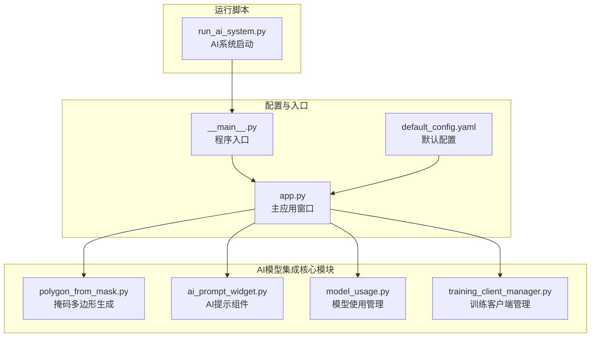
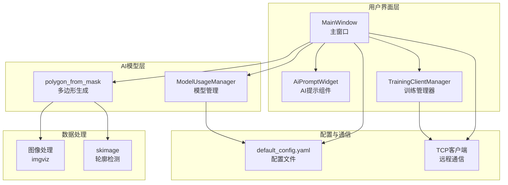
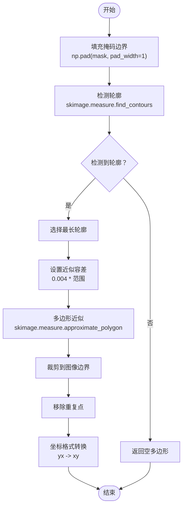
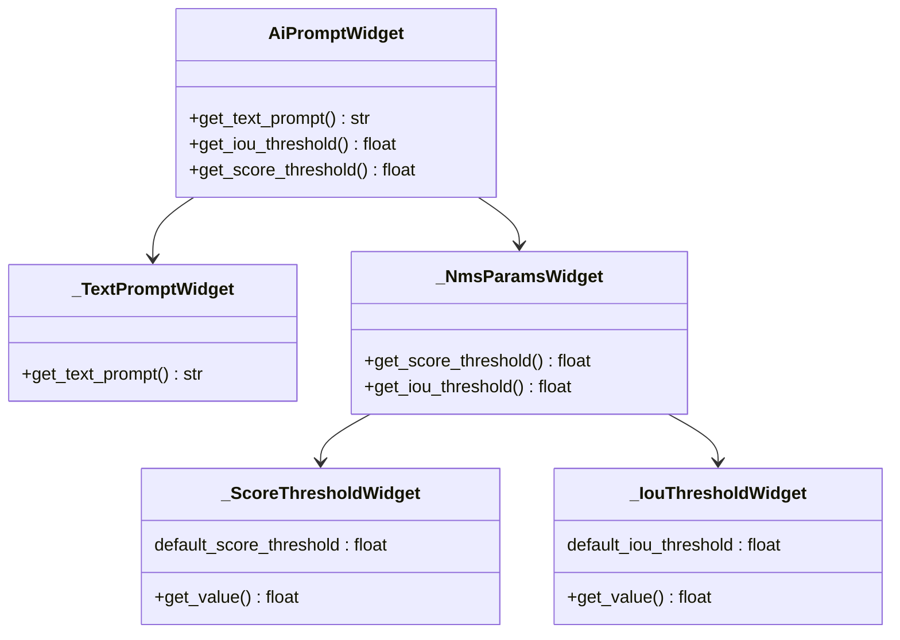
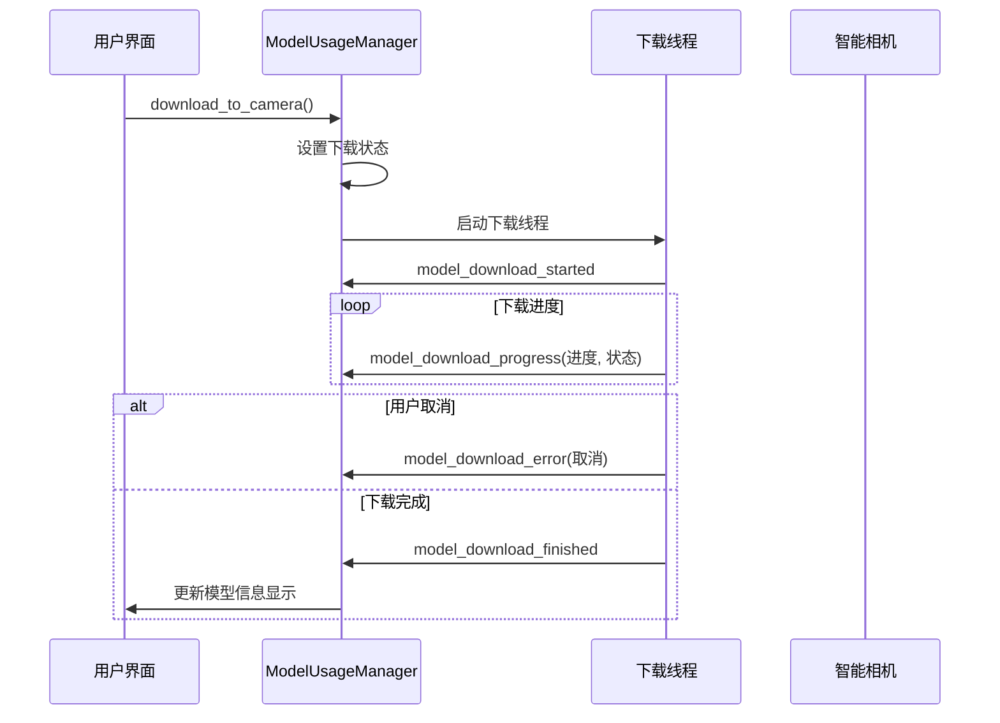
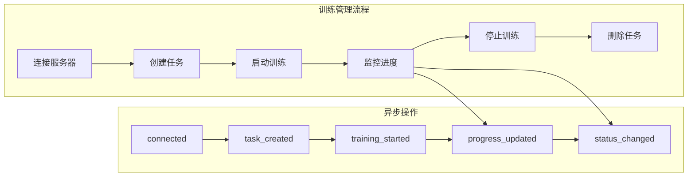
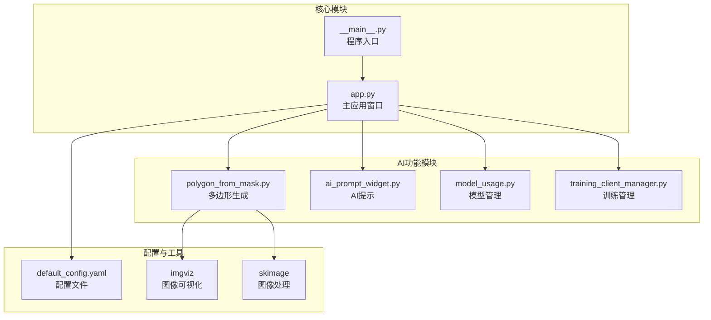

# AI模型集成

<cite>
**本文档引用的文件**
- [polygon_from_mask.py](file://labelme/labelme/_automation/polygon_from_mask.py)
- [ai_prompt_widget.py](file://labelme/labelme/widgets/ai_prompt_widget.py)
- [run_ai_system.py](file://labelme/run_ai_system.py)
- [model_usage.py](file://labelme/model_usage.py)
- [default_config.yaml](file://labelme/labelme/config/default_config.yaml)
- [training_client_manager.py](file://labelme/labelme/training_client_manager.py)
- [__main__.py](file://labelme/labelme/__main__.py)
- [app.py](file://labelme/labelme/app.py)
</cite>

## 目录
1. [简介](#简介)
2. [项目结构](#项目结构)
3. [核心组件](#核心组件)
4. [架构概览](#架构概览)
5. [详细组件分析](#详细组件分析)
6. [依赖关系分析](#依赖关系分析)
7. [性能考虑](#性能考虑)
8. [故障排除指南](#故障排除指南)
9. [结论](#结论)
10. [附录](#附录)

## 简介

本文件档详细介绍了Labelme项目中的AI模型集成功能，重点涵盖了基于掩码的多边形自动生成算法、AI辅助标注功能的实现原理，以及AI模型的选择、配置和参数调优方法。文档旨在帮助开发者理解AI模型集成的完整生命周期，从模型加载到标注结果输出，并提供最佳实践、性能优化建议和故障排除指南。

## 项目结构

Labelme项目采用模块化架构，AI模型集成功能分布在多个关键模块中：

**图表来源**
- [__main__.py:137-359](file://labelme/labelme/__main__.py#L137-L359)
- [app.py:99-200](file://labelme/labelme/app.py#L99-L200)

**章节来源**
- [__main__.py:137-359](file://labelme/labelme/__main__.py#L137-L359)
- [app.py:99-200](file://labelme/labelme/app.py#L99-L200)

## 核心组件

### 掩码多边形生成模块

polygon_from_mask.py实现了基于图像分割掩码的多边形自动生成算法，是AI辅助标注功能的核心组件之一。

### AI提示组件

ai_prompt_widget.py提供了用户与AI模型交互的界面组件，支持文本提示输入和NMS参数设置。

### 模型使用管理

model_usage.py负责AI模型的下载、安装和状态管理，提供模型信息展示和下载进度监控功能。

### 训练客户端管理

training_client_manager.py封装了训练客户端，提供异步训练管理功能，支持远程训练服务器通信。

**章节来源**
- [polygon_from_mask.py:1-82](file://labelme/labelme/_automation/polygon_from_mask.py#L1-L82)
- [ai_prompt_widget.py:1-294](file://labelme/labelme/widgets/ai_prompt_widget.py#L1-L294)
- [model_usage.py:1-103](file://labelme/model_usage.py#L1-L103)
- [training_client_manager.py:1-390](file://labelme/labelme/training_client_manager.py#L1-L390)

## 架构概览

**图表来源**
- [app.py:68-84](file://labelme/labelme/app.py#L68-L84)
- [default_config.yaml:41-99](file://labelme/labelme/config/default_config.yaml#L41-L99)

## 详细组件分析

### 掩码多边形生成算法

#### 算法工作流程

**图表来源**
- [polygon_from_mask.py:32-82](file://labelme/labelme/_automation/polygon_from_mask.py#L32-L82)

#### 核心算法实现

该算法采用以下步骤实现掩码到多边形的转换：

1. **轮廓检测**：使用skimage的find_contours函数检测二值掩码的边界轮廓
2. **最长轮廓选择**：从检测到的多个轮廓中选择最长的一个
3. **多边形近似**：使用approximate_polygon函数进行多边形简化
4. **边界约束**：将生成的多边形坐标限制在有效图像范围内
5. **格式转换**：将坐标从(y,x)格式转换为(x,y)格式

#### 复杂度分析

- **时间复杂度**：O(n)，其中n为轮廓点的数量
- **空间复杂度**：O(n)，用于存储轮廓和生成的多边形点

**章节来源**
- [polygon_from_mask.py:12-82](file://labelme/labelme/_automation/polygon_from_mask.py#L12-L82)

### AI提示组件

#### 组件架构

**图表来源**
- [ai_prompt_widget.py:9-294](file://labelme/labelme/widgets/ai_prompt_widget.py#L9-L294)

#### 参数配置

AI提示组件提供以下关键参数：

1. **文本提示**：用户输入的AI模型提示文本
2. **分数阈值**：过滤低置信度检测结果的阈值（默认0.1）
3. **IoU阈值**：非极大值抑制算法中的重叠检测阈值（默认0.5）

**章节来源**
- [ai_prompt_widget.py:41-95](file://labelme/labelme/widgets/ai_prompt_widget.py#L41-L95)
- [ai_prompt_widget.py:198-294](file://labelme/labelme/widgets/ai_prompt_widget.py#L198-L294)

### 模型使用管理

#### 模型管理器架构

**图表来源**
- [model_usage.py:46-94](file://labelme/model_usage.py#L46-L94)

#### 功能特性

1. **异步下载**：使用多线程实现模型下载，避免UI阻塞
2. **进度监控**：实时更新下载进度和状态信息
3. **设备兼容**：支持下载到智能相机和本地电脑
4. **错误处理**：提供详细的错误信息和异常处理

**章节来源**
- [model_usage.py:13-103](file://labelme/model_usage.py#L13-L103)

### 训练客户端管理

#### 异步训练管理

**图表来源**
- [training_client_manager.py:107-390](file://labelme/labelme/training_client_manager.py#L107-L390)

**章节来源**
- [training_client_manager.py:32-390](file://labelme/labelme/training_client_manager.py#L32-L390)

## 依赖关系分析

### 模块依赖图

**图表来源**
- [app.py:57-85](file://labelme/labelme/app.py#L57-L85)
- [polygon_from_mask.py:1-6](file://labelme/labelme/_automation/polygon_from_mask.py#L1-L6)

### 外部依赖

AI模型集成功能依赖以下关键外部库：

1. **imgviz**：图像可视化工具，提供颜色映射和图像处理功能
2. **scikit-image (skimage)**：科学图像处理库，用于轮廓检测和多边形近似
3. **loguru**：现代化日志库，提供结构化日志记录
4. **PyQt5**：GUI框架，提供用户界面和事件处理

**章节来源**
- [polygon_from_mask.py:1-6](file://labelme/labelme/_automation/polygon_from_mask.py#L1-L6)
- [app.py:46-50](file://labelme/labelme/app.py#L46-L50)

## 性能考虑

### 算法优化策略

1. **轮廓检测优化**：通过填充掩码边界确保完整的轮廓检测
2. **多边形简化**：使用适当的容差参数平衡精度和性能
3. **内存管理**：及时释放不需要的中间结果，避免内存泄漏
4. **异步处理**：使用多线程处理耗时操作，保持UI响应性

### 配置优化建议

1. **阈值调优**：根据具体应用场景调整分数阈值和IoU阈值
2. **模型选择**：根据数据特征选择合适的AI模型
3. **硬件加速**：利用GPU加速图像处理和AI推理
4. **缓存策略**：实现结果缓存减少重复计算

## 故障排除指南

### 常见问题及解决方案

#### 掩码多边形生成问题

1. **无轮廓检测**：检查掩码图像质量，确保有清晰的边界
2. **多边形精度不足**：调整近似容差参数，平衡精度和性能
3. **坐标越界**：验证图像尺寸和坐标转换逻辑

#### AI模型集成问题

1. **模型加载失败**：检查模型文件完整性，验证依赖库版本
2. **推理速度慢**：优化模型参数，启用硬件加速
3. **内存泄漏**：确保正确释放资源，使用上下文管理器

#### 界面交互问题

1. **UI响应缓慢**：检查异步操作实现，避免阻塞主线程
2. **参数设置无效**：验证参数范围和默认值设置
3. **状态同步问题**：确保信号槽连接正确，状态更新及时

**章节来源**
- [polygon_from_mask.py:44-52](file://labelme/labelme/_automation/polygon_from_mask.py#L44-L52)
- [model_usage.py:66-94](file://labelme/model_usage.py#L66-L94)

## 结论

Labelme项目的AI模型集成功能通过模块化设计实现了高效的图像标注辅助功能。基于掩码的多边形自动生成算法为AI辅助标注提供了坚实的技术基础，而完善的配置管理和异步处理机制确保了系统的稳定性和用户体验。

通过本文档介绍的架构设计、算法实现和最佳实践，开发者可以更好地理解和扩展AI模型集成功能，构建更加智能化的图像标注工具。

## 附录

### 配置选项参考

| 配置项 | 类型 | 默认值 | 描述 |
|--------|------|--------|------|
| ai.default | 字符串 | 'Sam2 (balanced)' | 默认AI模型选择 |
| canvas.ai_polygon | 布尔值 | false | AI多边形模式开关 |
| canvas.ai_mask | 布尔值 | false | AI掩码模式开关 |

### API接口参考

#### 多边形生成接口
- 输入：二值掩码数组
- 输出：多边形顶点坐标数组
- 复杂度：O(n)

#### AI提示接口
- 文本提示：用户输入的标注描述
- 分数阈值：0-1范围内的置信度阈值
- IoU阈值：0-1范围内的重叠检测阈值

**章节来源**
- [default_config.yaml:41-99](file://labelme/labelme/config/default_config.yaml#L41-L99)
- [ai_prompt_widget.py:41-95](file://labelme/labelme/widgets/ai_prompt_widget.py#L41-L95)