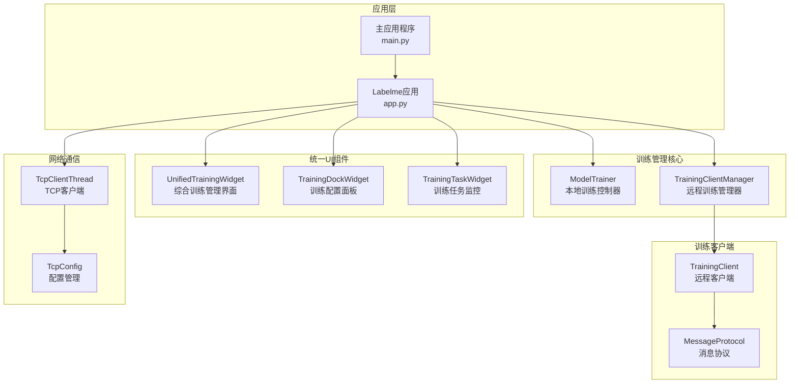
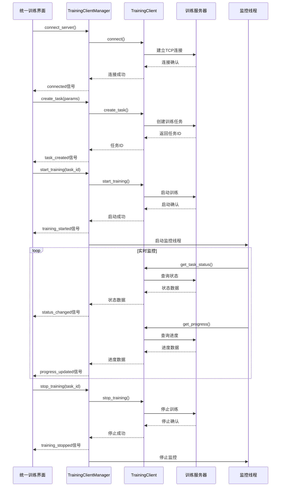
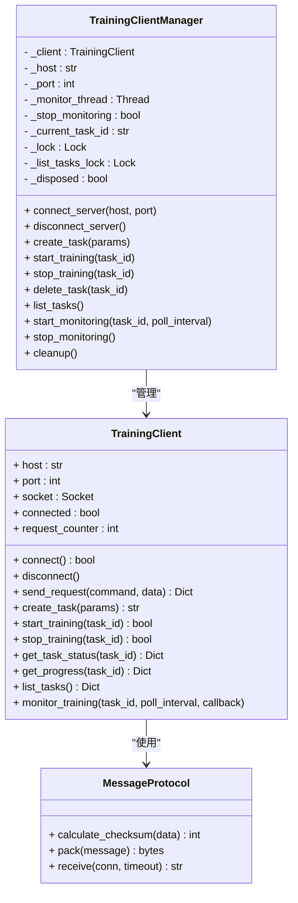
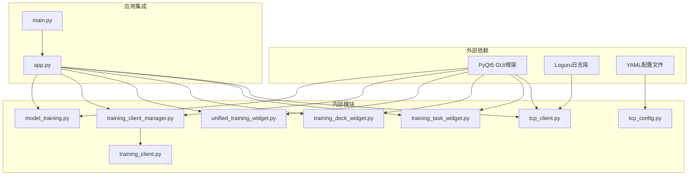

# 模型训练管理系统

<cite>
**本文档引用的文件**
- [training_client_manager.py](file://labelme/labelme/training_client_manager.py)
- [unified_training_widget.py](file://labelme/labelme/widgets/unified_training_widget.py)
- [training_dock_widget.py](file://labelme/labelme/widgets/training_dock_widget.py)
- [training_client.py](file://training_client/training_client.py)
- [test_training_client.py](file://training_client/test_training_client.py)
- [run_tests.py](file://training_client/run_tests.py)
</cite>

## 更新摘要
**变更内容**
- 训练客户端管理器重大改进：增强连接处理、错误管理、监控能力和并发安全机制
- 统一训练小部件重构：从分离的训练配置面板和任务监控面板整合为综合训练管理界面
- 训练停靠小部件增强：改进信号处理和用户反馈机制
- 新增测试工具：提供服务器连通性测试功能
- 配置系统改进：优化dock窗口行为和用户界面体验

## 目录
1. [简介](#简介)
2. [项目结构](#项目结构)
3. [核心组件](#核心组件)
4. [架构概览](#架构概览)
5. [详细组件分析](#详细组件分析)
6. [依赖关系分析](#依赖关系分析)
7. [性能考虑](#性能考虑)
8. [故障排除指南](#故障排除指南)
9. [结论](#结论)
10. [附录](#附录)

## 简介

模型训练管理系统是一个基于PyQt5的异步训练管理平台，集成了本地训练和远程训练两种模式。系统采用Qt信号/槽机制实现异步通信，通过独立的后台线程执行训练任务，避免阻塞用户界面。

**重大更新**：系统经过全面重构，训练客户端管理器得到重大改进，统一训练小部件重构为综合训练管理界面，增强了并发安全机制和用户交互体验。

该系统主要包含以下核心功能：
- 异步训练流程控制（ModelTrainer类）
- 远程训练客户端管理（TrainingClientManager类）
- 训练任务的启动、暂停、停止和监控
- 实时训练进度更新机制
- 完整的日志记录系统
- 错误处理和状态同步功能
- 并发安全的多线程架构

## 项目结构



**图表来源**
- [training_client_manager.py:34-94](file://labelme/labelme/training_client_manager.py#L34-L94)
- [unified_training_widget.py:105-122](file://labelme/labelme/widgets/unified_training_widget.py#L105-L122)

**章节来源**
- [training_client_manager.py:34-94](file://labelme/labelme/training_client_manager.py#L34-L94)
- [unified_training_widget.py:105-122](file://labelme/labelme/widgets/unified_training_widget.py#L105-L122)

## 核心组件

### TrainingClientManager类（重大改进）

TrainingClientManager是系统的核心协调者，经过重大改进后具备更强的功能和稳定性：

**核心特性：**
- 异步训练执行（后台线程）
- Qt信号/槽通信机制
- 训练状态管理
- 错误处理和恢复
- **新增**：线程安全的并发控制机制
- **新增**：完善的连接生命周期管理
- **新增**：任务列表并发访问保护

**主要信号：**
- `connected`: 连接成功/失败
- `connection_error`: 连接错误信息
- `task_created`: 任务创建成功，返回 task_id
- `task_creation_failed`: 任务创建失败信息
- `training_started`: 训练启动成功，返回 task_id
- `training_start_failed`: 训练启动失败信息
- `training_stopped`: 训练停止成功，返回 task_id
- `training_stop_failed`: 训练停止失败信息
- `task_deleted`: 任务删除成功，返回 task_id
- `task_deletion_failed`: 任务删除失败信息
- `progress_updated`: 进度更新，返回 (task_id, progress_data)
- `status_changed`: 状态变化，返回 (task_id, status_data)
- `task_list_updated`: 任务列表更新
- `task_list_failed`: 获取任务列表失败
- `error_occurred`: 通用错误信息
- `log_message`: 日志消息

**新增功能：**
- 线程锁保护：`_lock` 和 `_list_tasks_lock` 确保并发安全
- 资源清理：`cleanup()` 方法提供完整的资源释放
- 连接状态监控：实时检查连接有效性
- **改进**：Ping测试集成到连接流程中

**章节来源**
- [training_client_manager.py:34-543](file://labelme/labelme/training_client_manager.py#L34-L543)

### UnifiedTrainingWidget（统一训练管理界面）

**重大重构**：从分离的TrainingDockWidget和TrainingTaskWidget整合为统一的综合训练管理界面：

**核心功能：**
- **整合**：服务器连接、训练参数配置、任务管理、进度监控、日志输出于一体的界面
- **可折叠**：使用CollapsibleGroupBox实现模块化的可折叠界面
- **实时监控**：支持阻塞式训练监控，避免UI阻塞
- **智能刷新**：防抖机制防止频繁刷新
- **自动刷新**：可配置的自动刷新间隔
- **状态管理**：完整的训练状态跟踪和用户反馈

**界面模块：**
- 服务器连接配置区域
- 基本信息配置（任务类型、数据集）
- 训练参数设置（图像尺寸、轮次、批次、学习率、训练集比例）
- 训练操作控制（创建、启动、停止）
- 任务列表管理（表格显示、状态监控）
- 当前任务进度面板（进度条、详细信息）
- 日志输出区域（彩色日志、清空功能）

**新增特性：**
- **改进**：监控训练使用独立线程，避免阻塞UI
- **改进**：进度回调通过Qt的invokeMethod确保线程安全
- **改进**：自动刷新机制可根据训练状态动态调整
- **改进**：防抖机制优化任务列表刷新性能

**章节来源**
- [unified_training_widget.py:105-1342](file://labelme/labelme/widgets/unified_training_widget.py#L105-L1342)

### TrainingDockWidget（增强版）

**功能增强**：在原有基础上增加了更多用户反馈和状态管理功能：

**核心改进：**
- **增强**：连接状态的详细显示和颜色编码
- **增强**：训练状态的实时更新和用户提示
- **增强**：按钮状态的智能控制（根据连接状态和任务状态）
- **增强**：错误处理的用户友好提示
- **增强**：服务器配置的动态启用/禁用控制

**章节来源**
- [training_dock_widget.py:99-715](file://labelme/labelme/widgets/training_dock_widget.py#L99-L715)

## 架构概览



**图表来源**
- [training_client_manager.py:112-174](file://labelme/labelme/training_client_manager.py#L112-L174)
- [training_client.py:722-787](file://training_client/training_client.py#L722-L787)

## 详细组件分析

### 训练客户端管理器（重大改进）

TrainingClientManager经过全面重构，增强了并发安全性和功能完整性：



**图表来源**
- [training_client_manager.py:34-94](file://labelme/labelme/training_client_manager.py#L34-L94)
- [training_client.py:338-465](file://training_client/training_client.py#L338-L465)

**核心改进点：**
- **并发安全**：引入 `_lock` 和 `_list_tasks_lock` 确保多线程安全
- **资源管理**：`cleanup()` 方法提供完整的资源释放机制
- **连接监控**：实时检查连接状态，防止使用已断开的连接
- **错误恢复**：增强的错误处理和恢复机制
- **生命周期管理**：完整的对象生命周期控制

**章节来源**
- [training_client_manager.py:34-543](file://labelme/labelme/training_client_manager.py#L34-L543)
- [training_client.py:338-800](file://training_client/training_client.py#L338-L800)

### 统一训练管理界面（全新架构）

UnifiedTrainingWidget提供了全新的综合训练管理体验：

**核心架构：**
- **模块化设计**：使用CollapsibleGroupBox实现可折叠的模块化界面
- **线程安全**：监控功能在独立线程中执行，避免UI阻塞
- **智能状态管理**：根据训练状态动态更新界面元素
- **用户反馈**：丰富的状态提示和错误处理

**关键特性：**
- **实时监控**：支持阻塞式训练监控，使用独立线程避免UI冻结
- **进度回调**：通过Qt的invokeMethod确保UI更新的线程安全性
- **防抖机制**：优化任务列表刷新，防止频繁网络请求
- **自动刷新**：可配置的自动刷新间隔，适应不同训练场景
- **彩色日志**：支持错误、警告、信息级别的彩色日志显示

**章节来源**
- [unified_training_widget.py:105-1342](file://labelme/labelme/widgets/unified_training_widget.py#L105-L1342)

### 训练客户端（增强协议支持）

TrainingClient提供了完整的训练任务生命周期管理：

**核心功能：**
- **连接管理**：connect()、disconnect()提供完整的连接生命周期
- **任务管理**：create_task()、start_training()、stop_training()、delete_task()
- **状态监控**：get_task_status()、get_progress()、monitor_training()
- **工具方法**：ping()、list_tasks()提供辅助功能

**协议支持：**
- **消息协议**：MessageProtocol类提供完整的TCP协议实现
- **校验机制**：CRC32校验确保数据传输完整性
- **超时处理**：灵活的超时机制适应不同网络环境
- **错误恢复**：完善的错误处理和恢复机制

**章节来源**
- [training_client.py:338-1497](file://training_client/training_client.py#L338-L1497)

### 新增测试工具

**测试框架：**
- **单元测试**：完整的测试用例覆盖核心功能
- **测试运行器**：支持批量测试和单个测试执行
- **测试报告**：详细的测试结果统计和失败分析
- **模拟支持**：使用unittest.mock进行网络通信模拟

**测试覆盖：**
- **消息协议测试**：校验和计算、打包解包功能
- **客户端功能测试**：连接、请求、响应处理
- **边界情况测试**：空消息、大消息、超时处理
- **错误场景测试**：连接失败、响应错误、超时处理

**章节来源**
- [test_training_client.py:1-458](file://training_client/test_training_client.py#L1-L458)
- [run_tests.py:1-145](file://training_client/run_tests.py#L1-L145)

## 依赖关系分析



**图表来源**
- [training_client_manager.py:26-31](file://labelme/labelme/training_client_manager.py#L26-L31)
- [unified_training_widget.py:19-22](file://labelme/labelme/widgets/unified_training_widget.py#L19-L22)

**章节来源**
- [training_client_manager.py:26-31](file://labelme/labelme/training_client_manager.py#L26-L31)
- [unified_training_widget.py:19-22](file://labelme/labelme/widgets/unified_training_widget.py#L19-L22)

## 性能考虑

### 异步处理优化（重大改进）

**线程管理：**
- 训练任务在独立后台线程执行
- 网络操作通过异步线程处理
- UI线程保持非阻塞状态
- 监控线程按需启动和停止
- **新增**：统一训练界面使用独立线程执行阻塞式监控

**内存管理：**
- 及时释放网络连接资源
- 监控线程安全停止机制
- 配置文件缓存优化
- 日志输出限制最大行数
- **新增**：线程锁保护防止竞态条件

### 网络通信优化

**连接池管理：**
- 连接超时控制（默认5秒）
- 自动重连机制
- 心跳检测防止连接丢失
- 错误重试策略
- **新增**：Ping测试集成到连接流程中

**数据传输优化：**
- 消息协议优化（包头+长度+校验和）
- 分块接收处理大数据包
- JSON序列化优化
- 压缩传输减少带宽占用
- **新增**：校验和机制确保数据完整性

### 用户界面优化

**响应性提升：**
- 统一训练界面使用线程安全的UI更新机制
- 防抖机制优化频繁操作的性能
- 智能状态管理减少不必要的刷新
- **新增**：自动刷新机制根据训练状态动态调整

**资源管理：**
- 任务列表内存优化
- 日志输出性能优化
- 图形界面资源及时释放
- **新增**：监控线程的优雅停止机制

## 故障排除指南

### 常见问题及解决方案

**连接问题：**
- 服务器无响应：检查服务器端口和防火墙设置
- 连接超时：增加重连间隔或检查网络延迟
- 认证失败：验证服务器配置和客户端凭据
- **新增**：Ping测试失败时的诊断步骤

**训练问题：**
- 训练无法启动：检查训练参数配置和数据集路径
- 进度停滞：监控网络连接状态和服务器负载
- 训练中断：检查服务器资源和内存使用情况
- **新增**：监控线程异常的排查方法

**UI问题：**
- 界面卡顿：确认异步线程正常运行
- 信号未响应：检查Qt信号连接状态
- 状态不同步：验证状态更新机制
- **新增**：统一训练界面的线程安全问题

**并发问题：**
- 线程死锁：检查线程锁的使用和释放
- 资源竞争：验证共享资源的访问控制
- 内存泄漏：确认资源的正确释放
- **新增**：监控线程的资源管理

**章节来源**
- [training_client_manager.py:140-170](file://labelme/labelme/training_client_manager.py#L140-L170)
- [unified_training_widget.py:806-835](file://labelme/labelme/widgets/unified_training_widget.py#L806-L835)

### 调试和日志

**日志级别：**
- 错误日志：连接失败、训练异常
- 警告日志：超时警告、重连尝试
- 信息日志：状态变更、操作完成
- 调试日志：详细执行流程
- **新增**：统一训练界面的彩色日志输出

**日志输出：**
- 控制台输出
- 文件持久化
- 实时UI显示
- 错误堆栈跟踪
- **新增**：测试工具的详细测试报告

### 测试和验证

**单元测试：**
- 消息协议的完整测试覆盖
- 客户端功能的边界情况测试
- 错误场景的模拟测试
- **新增**：测试运行器的使用方法

**集成测试：**
- 端到端的训练流程测试
- 并发场景的稳定性测试
- 性能基准测试
- **新增**：服务器连通性测试工具

**章节来源**
- [test_training_client.py:16-458](file://training_client/test_training_client.py#L16-L458)
- [run_tests.py:11-145](file://training_client/run_tests.py#L11-L145)

## 结论

模型训练管理系统经过全面重构和优化，通过精心设计的架构实现了高效的异步训练管理。系统采用Qt的信号/槽机制和多线程技术，确保了良好的用户体验和稳定的性能表现。

**主要优势：**
- 异步架构保证UI响应性
- 完整的错误处理和恢复机制
- 灵活的配置管理
- 实时监控和状态同步
- 跨平台兼容性
- **新增**：线程安全的并发控制
- **新增**：统一的用户界面体验
- **新增**：完善的测试和验证体系

**架构改进：**
- TrainingClientManager的并发安全增强
- UnifiedTrainingWidget的综合界面设计
- 增强的错误处理和用户反馈
- 优化的网络通信协议
- 完善的测试工具链

**扩展建议：**
- 增加训练任务队列管理
- 实现分布式训练支持
- 优化网络通信协议
- 添加训练结果可视化
- 增强安全认证机制
- **新增**：更多的测试覆盖率
- **新增**：性能监控和分析工具

## 附录

### API参考

**TrainingClientManager类方法：**
- `connect_server(host, port)`: 连接服务器
- `disconnect_server()`: 断开服务器连接
- `create_task(params)`: 创建训练任务
- `start_training(task_id)`: 启动训练
- `stop_training(task_id)`: 停止训练
- `delete_task(task_id)`: 删除任务
- `list_tasks()`: 获取任务列表
- `start_monitoring(task_id, poll_interval)`: 开始监控
- `stop_monitoring()`: 停止监控
- `cleanup()`: 清理资源

**UnifiedTrainingWidget类方法：**
- `set_manager(manager)`: 设置训练管理器
- `get_training_params()`: 获取训练参数
- `get_server_config()`: 获取服务器配置
- `set_connection_status(connected, message)`: 设置连接状态
- `enable_server_edit(enabled)`: 启用服务器编辑
- `refresh_task_list()`: 刷新任务列表
- `cleanup()`: 清理资源

**章节来源**
- [training_client_manager.py:112-543](file://labelme/labelme/training_client_manager.py#L112-L543)
- [unified_training_widget.py:983-1342](file://labelme/labelme/widgets/unified_training_widget.py#L983-L1342)

### 使用示例

**基础训练流程：**
```python
# 创建训练管理器
manager = TrainingClientManager("127.0.0.1", 8888)

# 连接服务器
manager.connect_server()

# 创建训练任务
params = {
    "model_type": "detect",
    "epochs": 50,
    "batch_size": 32
}
task_id = manager.create_task(params)

# 启动训练
manager.start_training(task_id)

# 监控进度
manager.start_monitoring(task_id)
```

**统一训练界面使用：**
```python
# 创建统一训练界面
ui = UnifiedTrainingWidget()

# 设置训练管理器
ui.set_manager(manager)

# 连接服务器
ui.server_connect_requested.emit("127.0.0.1", 8888)

# 创建并启动训练
params = ui.get_training_params()
ui.create_remote_task_requested.emit(params)
```

**章节来源**
- [training_client_manager.py:112-240](file://labelme/labelme/training_client_manager.py#L112-L240)
- [unified_training_widget.py:647-694](file://labelme/labelme/widgets/unified_training_widget.py#L647-L694)

### 配置指南

**TCP客户端配置：**
- `host`: 服务器地址（默认：127.0.0.1）
- `port`: 服务器端口（默认：10012）
- `message`: 发送消息内容（默认："labelme"）
- `interval`: 发送间隔（默认：2秒）
- `reconnect_interval`: 重连间隔（默认：5秒）

**训练参数配置：**
- `model_type`: 模型类型（detect/classify/segment）
- `image_size`: 图像尺寸（默认：640）
- `dataset`: 数据集路径（默认："data"）
- `epochs`: 训练轮次（默认：50）
- `batch_size`: 批次大小（默认：32）
- `learning_rate`: 学习率（默认：0.001）
- `trainset_ratio`: 训练集比例（默认：0.9）

**统一训练界面配置：**
- `refresh_interval`: 自动刷新间隔（1-10秒，默认：2秒）
- `monitor_poll_interval`: 监控轮询间隔（秒）
- **新增**：日志输出的最大行数限制

**章节来源**
- [training_client.py:655-721](file://training_client/training_client.py#L655-L721)
- [unified_training_widget.py:467-473](file://labelme/labelme/widgets/unified_training_widget.py#L467-L473)

### 测试工具使用

**运行所有测试：**
```bash
python run_tests.py
```

**运行特定测试：**
```bash
python run_tests.py --test TestMessageProtocol
```

**详细输出模式：**
```bash
python run_tests.py --verbose
```

**安静模式：**
```bash
python run_tests.py --quiet
```

**章节来源**
- [run_tests.py:107-145](file://training_client/run_tests.py#L107-L145)
- [test_training_client.py:456-458](file://training_client/test_training_client.py#L456-L458)