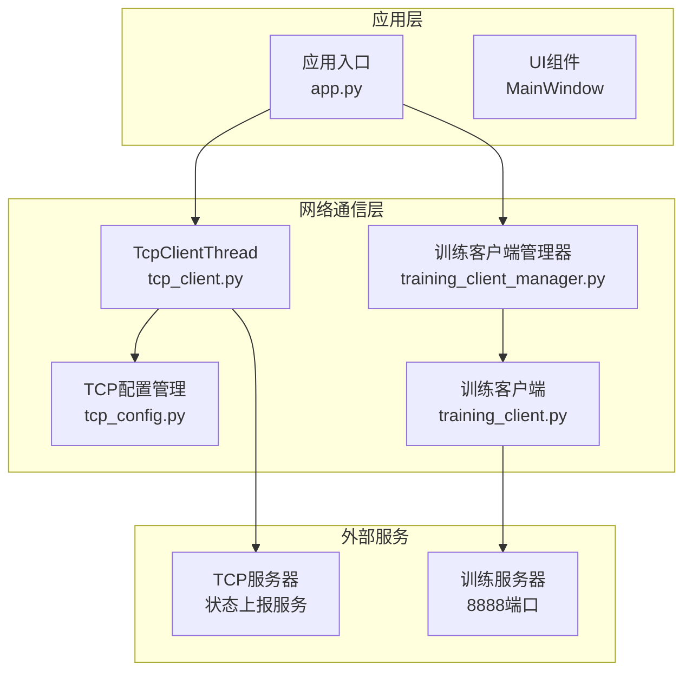
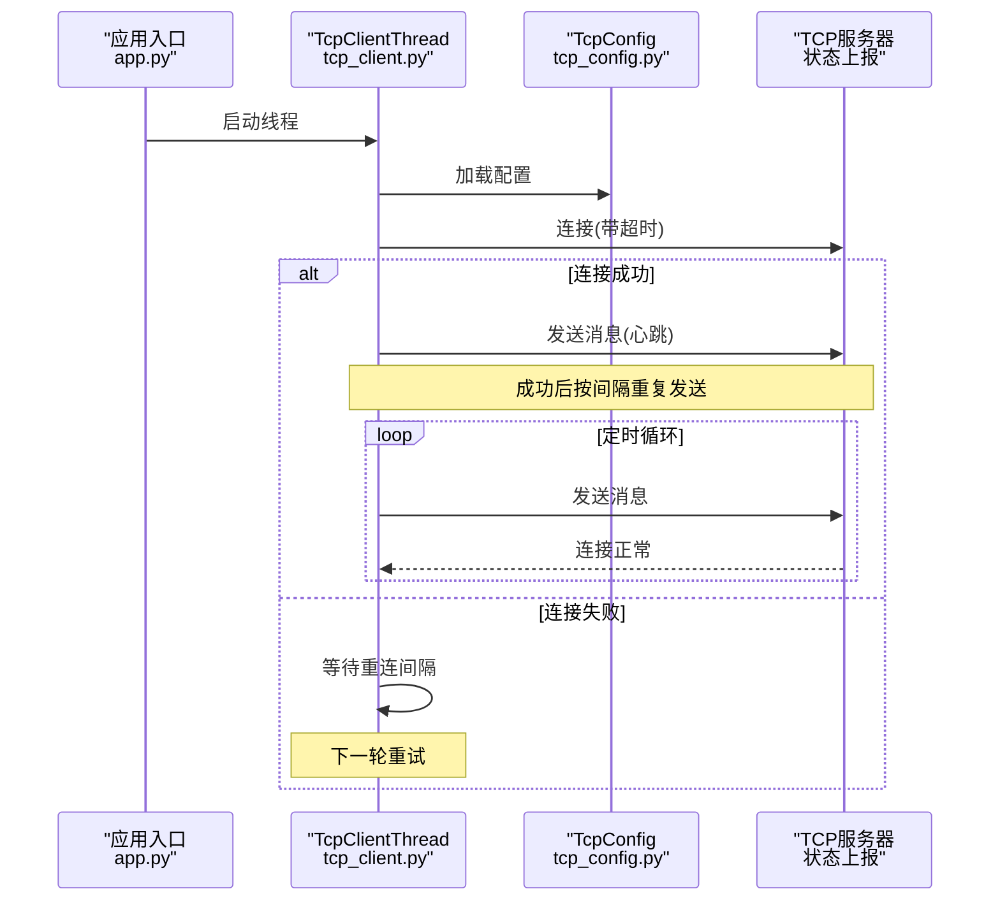
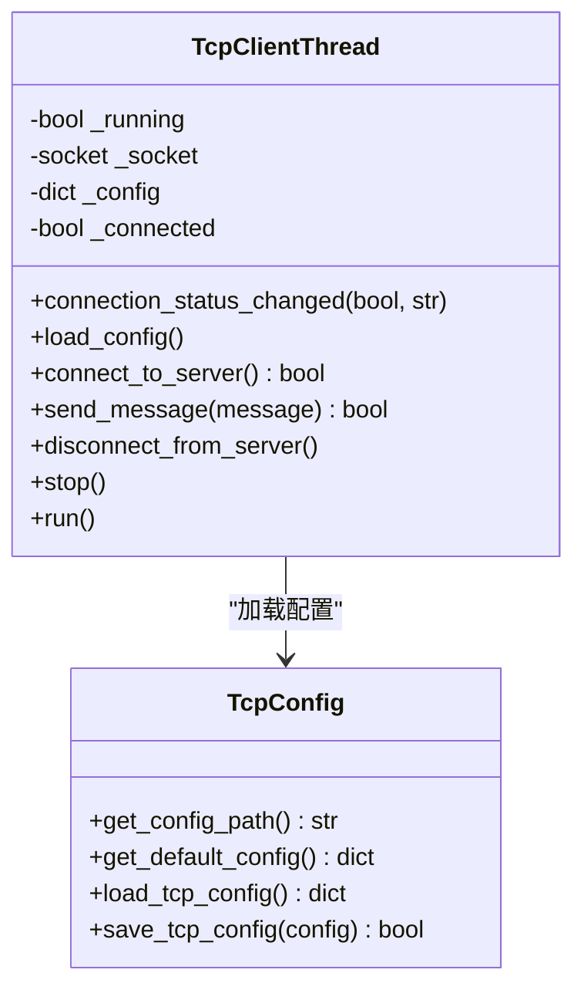
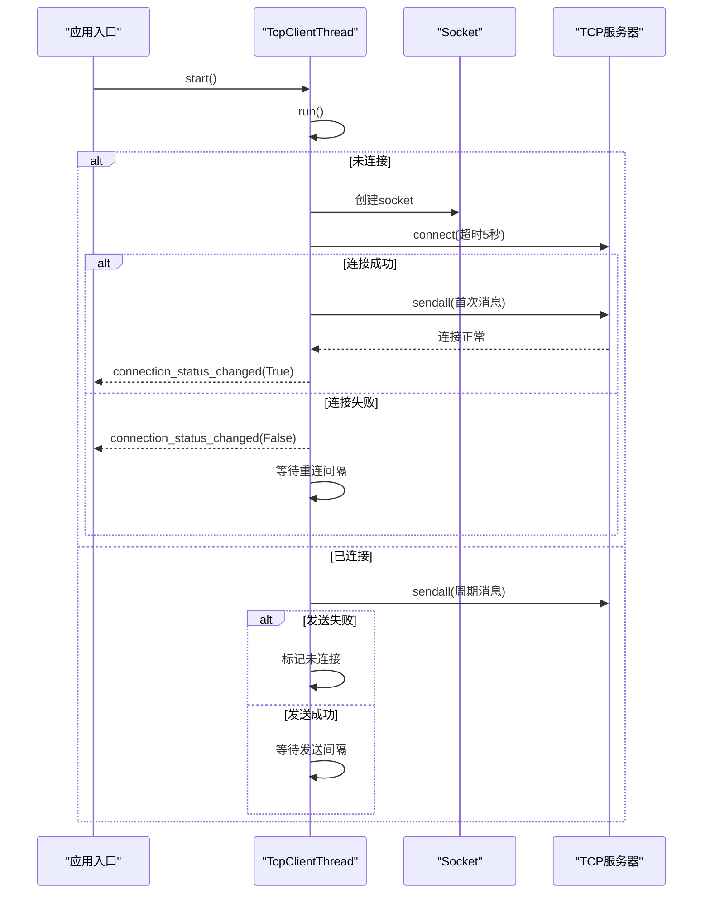
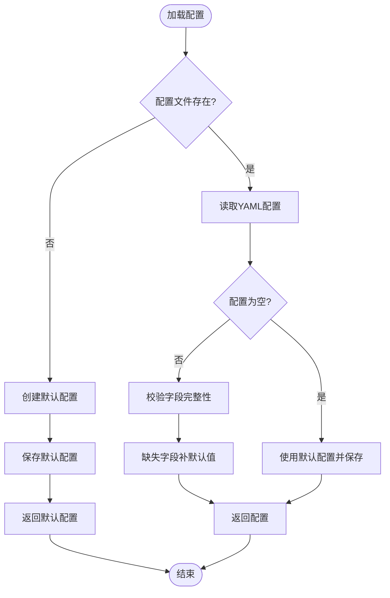
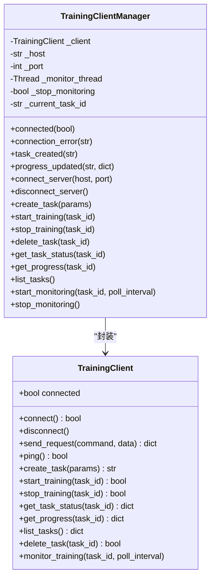
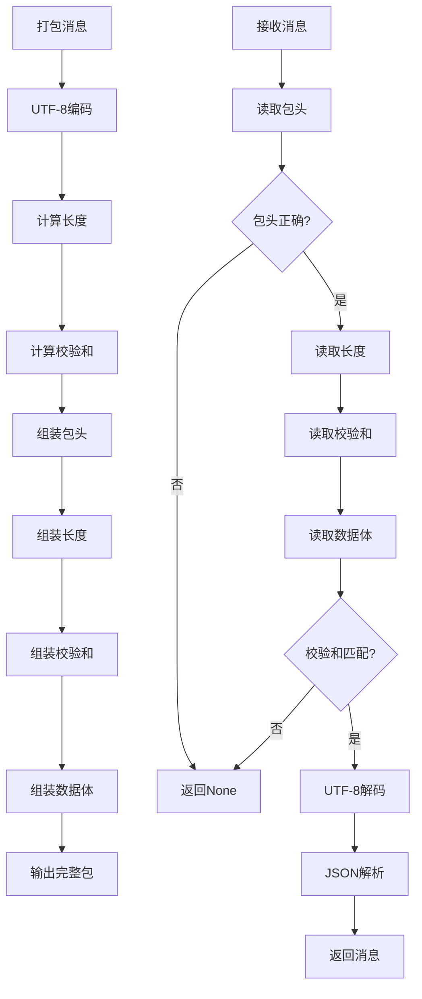
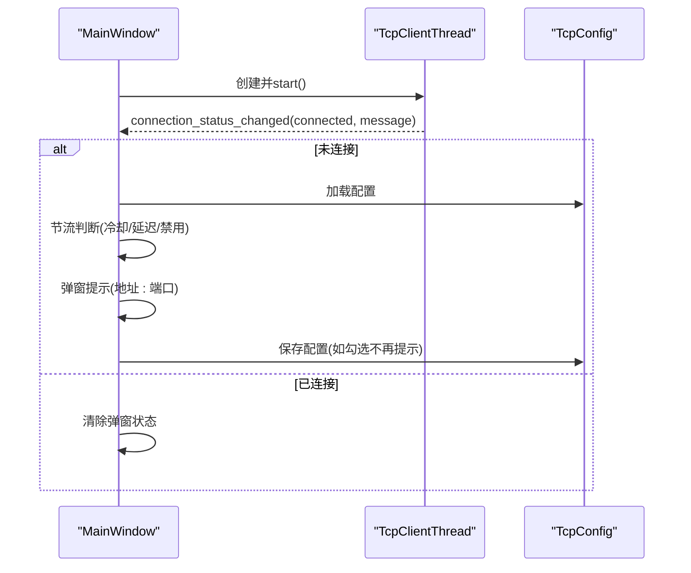
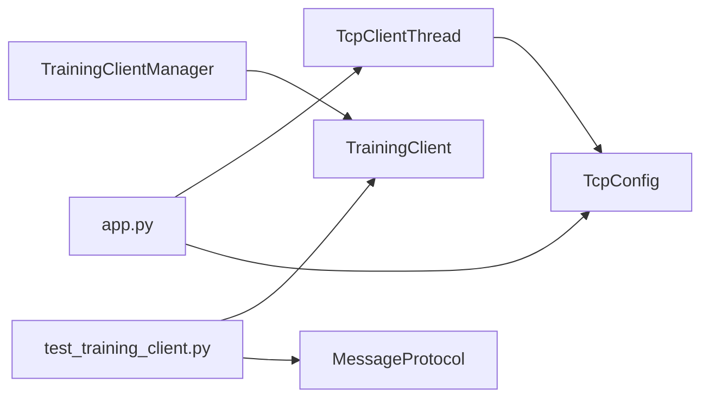

# 网络通信系统

<cite>
**本文档引用的文件**
- [tcp_client.py](file://labelme/tcp_client.py)
- [tcp_config.py](file://labelme/tcp_config.py)
- [training_client_manager.py](file://labelme/training_client_manager.py)
- [training_client.py](file://training_client/training_client.py)
- [app.py](file://labelme/app.py)
- [test_training_client.py](file://training_client/test_training_client.py)
- [default_config.yaml](file://labelme/config/default_config.yaml)
</cite>

## 更新摘要
**变更内容**
- 更新TrainingClientManager作为核心组件封装TrainingClient的实现
- 新增Qt信号/槽异步接口的详细说明
- 完善远程训练任务管理功能的架构分析
- 增强线程安全和异步处理机制的文档

## 目录
1. [简介](#简介)
2. [项目结构](#项目结构)
3. [核心组件](#核心组件)
4. [架构总览](#架构总览)
5. [详细组件分析](#详细组件分析)
6. [依赖关系分析](#依赖关系分析)
7. [性能考量](#性能考量)
8. [故障排除指南](#故障排除指南)
9. [结论](#结论)
10. [附录](#附录)

## 简介
本文件面向开发者，系统性阐述网络通信系统的实现与使用，重点围绕 TcpClientThread 类的后台线程管理、连接状态监控与自动重连机制展开；同时覆盖消息发送协议、数据格式与传输可靠性保障、网络配置管理、超时处理与错误恢复策略，并提供调试技巧、性能优化建议与安全注意事项。文档旨在帮助读者快速理解并扩展网络通信功能。

**更新** 本版本特别关注TrainingClientManager作为核心组件的集成，它封装TrainingClient并提供Qt信号/槽异步接口，支持完整的远程训练任务管理。

## 项目结构
网络通信相关模块分布于以下文件：
- labelme/tcp_client.py：TCP 客户端线程实现，负责后台连接、定时发送与自动重连
- labelme/tcp_config.py：TCP 配置文件加载与保存，提供默认配置与字段完整性校验
- labelme/training_client_manager.py：训练客户端管理器，封装训练客户端并提供 Qt 信号/槽异步接口
- training_client/training_client.py：训练客户端与消息协议，定义二进制消息格式与校验机制
- labelme/app.py：应用入口，集成并启动 TcpClientThread，处理连接状态 UI 提示
- training_client/test_training_client.py：训练客户端与消息协议的单元测试
- labelme/config/default_config.yaml：应用默认配置（与网络通信相关配置项）



**图表来源**
- [tcp_client.py:16-198](file://labelme/tcp_client.py#L16-L198)
- [tcp_config.py:40-107](file://labelme/tcp_config.py#L40-L107)
- [training_client_manager.py:32-390](file://labelme/training_client_manager.py#L32-L390)
- [training_client.py:96-272](file://training_client/training_client.py#L96-L272)
- [app.py:1217-1221](file://labelme/app.py#L1217-L1221)

## 核心组件
- TcpClientThread：基于 Qt 的后台线程，负责连接 TCP 服务器、周期性发送消息、状态监控与自动重连
- TcpConfig：负责 TCP 配置文件的加载、默认值注入与保存
- TrainingClientManager：**核心组件**，封装 TrainingClient，提供 Qt 信号/槽异步接口，支持连接、任务管理、进度监控等
- TrainingClient：训练客户端，定义消息协议（包头、长度、校验和、数据），提供任务生命周期管理
- 应用入口 app.py：启动 TcpClientThread 并处理连接状态 UI 提示

**更新** TrainingClientManager现在作为系统的核心组件，封装了TrainingClient并提供了完整的异步接口。

**章节来源**
- [tcp_client.py:16-198](file://labelme/tcp_client.py#L16-L198)
- [tcp_config.py:24-78](file://labelme/tcp_config.py#L24-L78)
- [training_client_manager.py:32-390](file://labelme/training_client_manager.py#L32-L390)
- [training_client.py:96-272](file://training_client/training_client.py#L96-L272)
- [app.py:1217-1221](file://labelme/app.py#L1217-L1221)

## 架构总览
系统采用"应用层 + 网络通信层 + 外部服务"的分层架构：
- 应用层通过 TcpClientThread 定期向状态服务发送心跳消息，通过 TrainingClientManager 与训练服务器交互
- 网络通信层包含配置管理与消息协议，确保传输可靠与格式一致
- 外部服务包括状态上报 TCP 服务器与训练服务器



**图表来源**
- [tcp_client.py:149-198](file://labelme/tcp_client.py#L149-L198)
- [tcp_config.py:40-78](file://labelme/tcp_config.py#L40-L78)
- [app.py:1217-1221](file://labelme/app.py#L1217-L1221)

## 详细组件分析

### TcpClientThread 组件分析
TcpClientThread 是系统的核心网络组件，负责：
- 后台线程管理：继承自 QtCore.QThread，在 run 中执行主循环
- 连接管理：connect_to_server 建立 TCP 连接，支持超时与异常处理
- 自动重连：未连接状态下按 reconnect_interval 间隔重试
- 消息发送：send_message 将字符串消息编码为 UTF-8 字节发送
- 状态监控：通过 connection_status_changed 信号通知 UI 连接状态变化



**图表来源**
- [tcp_client.py:16-198](file://labelme/tcp_client.py#L16-L198)
- [tcp_config.py:14-107](file://labelme/tcp_config.py#L14-L107)



**图表来源**
- [tcp_client.py:149-198](file://labelme/tcp_client.py#L149-L198)
- [tcp_client.py:43-97](file://labelme/tcp_client.py#L43-L97)

**章节来源**
- [tcp_client.py:16-198](file://labelme/tcp_client.py#L16-L198)

### TcpConfig 组件分析
TcpConfig 提供 TCP 配置的加载、默认值注入与保存：
- 默认配置包含 host、port、message、interval、reconnect_interval
- 若配置文件不存在则创建并写入默认值
- 加载时对缺失字段进行补全并记录警告
- 保存时确保目录存在并以 YAML 写入



**图表来源**
- [tcp_config.py:40-78](file://labelme/tcp_config.py#L40-L78)

**章节来源**
- [tcp_config.py:24-78](file://labelme/tcp_config.py#L24-L78)

### TrainingClientManager 组件分析
**核心组件** TrainingClientManager 封装训练客户端，提供 Qt 信号/槽异步接口：
- 异步连接：connect_server 在后台线程发起连接并进行 ping 测试
- 任务管理：create_task/start_training/stop_training/delete_task/list_tasks
- 进度监控：start_monitoring 通过轮询获取状态与进度
- 线程安全：使用锁保护当前任务 ID，避免并发问题
- 信号系统：提供完整的 Qt 信号/槽机制，包括连接状态、任务状态、进度更新等



**图表来源**
- [training_client_manager.py:32-390](file://labelme/training_client_manager.py#L32-L390)
- [training_client.py:96-272](file://training_client/training_client.py#L96-L272)

**章节来源**
- [training_client_manager.py:32-390](file://labelme/training_client_manager.py#L32-L390)

### 训练客户端与消息协议分析
训练客户端采用自定义二进制消息协议，确保传输可靠性：
- 包头：固定标识，用于同步与帧定位
- 长度：消息体字节数
- 校验和：对消息体进行累加校验，防止损坏
- 数据：UTF-8 编码的 JSON 文本



**图表来源**
- [training_client.py:13-94](file://training_client/training_client.py#L13-L94)

**章节来源**
- [training_client.py:13-94](file://training_client/training_client.py#L13-L94)

### 应用入口与 UI 集成
应用入口在启动时创建并启动 TcpClientThread，订阅连接状态信号并在 UI 中进行节流提示：
- 启动后记录启动时间，避免启动阶段频繁弹窗
- 连接恢复后允许再次弹窗
- 通过 load_tcp_config 获取当前配置用于提示



**图表来源**
- [app.py:1217-1221](file://labelme/app.py#L1217-L1221)
- [app.py:1318-1364](file://labelme/app.py#L1318-L1364)
- [tcp_config.py:40-78](file://labelme/tcp_config.py#L40-L78)

**章节来源**
- [app.py:1217-1221](file://labelme/app.py#L1217-L1221)
- [app.py:1318-1364](file://labelme/app.py#L1318-L1364)

## 依赖关系分析
- TcpClientThread 依赖 TcpConfig 提供配置
- TrainingClientManager 依赖 TrainingClient 实现训练通信
- 应用入口依赖 TcpClientThread 与 TcpConfig 提供网络状态
- 训练客户端测试依赖 MessageProtocol 与 TrainingClient



**图表来源**
- [tcp_client.py:12-41](file://labelme/tcp_client.py#L12-L41)
- [training_client_manager.py:28-29](file://labelme/training_client_manager.py#L28-L29)
- [app.py:63-64](file://labelme/app.py#L63-L64)
- [test_training_client.py:13](file://training_client/test_training_client.py#L13)

**章节来源**
- [tcp_client.py:12-41](file://labelme/tcp_client.py#L12-L41)
- [training_client_manager.py:28-29](file://labelme/training_client_manager.py#L28-L29)
- [app.py:63-64](file://labelme/app.py#L63-L64)
- [test_training_client.py:13](file://training_client/test_training_client.py#L13)

## 性能考量
- 线程调度：TcpClientThread 使用 sleep(0.1) 分段等待，降低 CPU 占用
- 超时控制：连接阶段设置短超时，成功后取消超时避免阻塞
- 发送频率：通过配置的 interval 控制心跳频率，避免过度占用带宽
- 轮询监控：TrainingClientManager 的监控轮询间隔可调，平衡实时性与性能
- 线程安全：使用锁保护共享资源，避免竞态条件
- 异步处理：通过 Qt 信号/槽机制避免阻塞 UI 线程
- 日志级别：建议在生产环境使用 info 或更高级别，减少日志开销

**更新** 新增了线程安全和异步处理的性能考量。

## 故障排除指南
常见问题与排查步骤：
- 无法连接服务器
  - 检查配置文件中的 host/port 是否正确
  - 确认服务器进程已启动且监听对应端口
  - 查看 UI 弹窗提示与日志输出
- 连接超时
  - 检查网络连通性与防火墙设置
  - 调整配置中的 reconnect_interval 与 interval
- 首次消息发送失败
  - 确认服务器端对消息格式与协议的支持
  - 查看连接状态信号回调中的错误信息
- 训练客户端无响应
  - 使用 ping 测试服务器连通性
  - 检查消息协议的包头、长度与校验和是否匹配
  - 查看单元测试中的异常分支模拟
- **异步操作无响应**
  - 检查 Qt 信号/槽连接是否正确建立
  - 确认后台线程是否正常运行
  - 验证线程锁的使用是否正确
- **监控线程异常退出**
  - 检查 stop_monitoring 标志位的设置
  - 确认监控线程的 join 超时设置
  - 验证异常处理机制

**更新** 新增了异步操作和监控线程相关的故障排除指南。

**章节来源**
- [tcp_client.py:85-96](file://labelme/tcp_client.py#L85-L96)
- [training_client.py:166-173](file://training_client/training_client.py#L166-L173)
- [test_training_client.py:112-130](file://training_client/test_training_client.py#L112-L130)

## 结论
该网络通信系统通过 TcpClientThread 实现稳定的后台心跳机制，结合 TcpConfig 的灵活配置与 UI 的节流提示，提供了良好的用户体验。**TrainingClientManager 作为核心组件，封装了 TrainingClient 并提供了完整的 Qt 信号/槽异步接口，支持远程训练任务的全生命周期管理**。训练客户端采用自定义二进制协议，具备包头、长度与校验和的完整性保障。整体架构清晰、职责分离明确，便于扩展与维护。

**更新** TrainingClientManager的集成显著增强了系统的异步处理能力和线程安全性，为远程训练任务管理提供了稳定可靠的基础设施。

## 附录

### 配置选项说明
- host：TCP 服务器地址，默认本地回环
- port：TCP 服务器端口，默认 10012
- message：心跳消息内容，默认 "labelme"
- interval：心跳发送间隔（秒），默认 2
- reconnect_interval：连接失败重试间隔（秒），默认 5

**章节来源**
- [tcp_config.py:24-37](file://labelme/tcp_config.py#L24-L37)

### 使用示例
- 启动 TCP 客户端线程：在应用入口创建并启动 TcpClientThread，订阅连接状态信号
- 配置文件：首次运行会在用户主目录生成配置文件，可根据需要修改
- **训练客户端管理**：通过 TrainingClientManager 异步执行连接、任务管理与进度监控
- **异步操作示例**：
  ```python
  manager = TrainingClientManager(host="127.0.0.1", port=8888)
  manager.connected.connect(on_connected)
  manager.task_created.connect(on_task_created)
  manager.progress_updated.connect(on_progress_updated)
  manager.connect_server()
  ```

**更新** 新增了TrainingClientManager的使用示例。

**章节来源**
- [app.py:1217-1221](file://labelme/app.py#L1217-L1221)
- [tcp_config.py:50-55](file://labelme/tcp_config.py#L50-L55)
- [training_client_manager.py:107-146](file://labelme/training_client_manager.py#L107-L146)

### 调试技巧
- 启用详细日志：通过应用默认配置中的 logger_level 调整日志级别
- 单元测试：参考训练客户端测试用例，验证消息协议与异常处理
- 状态监控：利用 UI 的连接状态提示与节流机制，定位连接波动问题
- **异步调试**：使用 Qt 信号/槽的调试工具观察异步操作的执行顺序
- **线程安全检查**：通过日志输出确认锁的使用是否正确
- **监控线程调试**：观察 stop_monitoring 标志位的变化来调试监控线程

**更新** 新增了异步调试和线程安全检查的调试技巧。

**章节来源**
- [default_config.yaml:12](file://labelme/config/default_config.yaml#L12)
- [test_training_client.py:16-87](file://training_client/test_training_client.py#L16-L87)

### 安全考虑
- 传输加密：当前实现未包含 TLS/SSL 加密，建议在网络层面或应用层面增加加密通道
- 输入验证：服务器端应严格校验消息格式与长度，防止缓冲区溢出
- 权限控制：限制配置文件的读写权限，避免被恶意篡改
- **线程安全**：确保共享资源的访问通过适当的锁机制保护
- **异常处理**：完善的异常捕获和错误报告机制，避免敏感信息泄露
- **资源清理**：确保监控线程和连接的正确清理，防止资源泄漏

**更新** 新增了线程安全和资源清理的安全考虑。