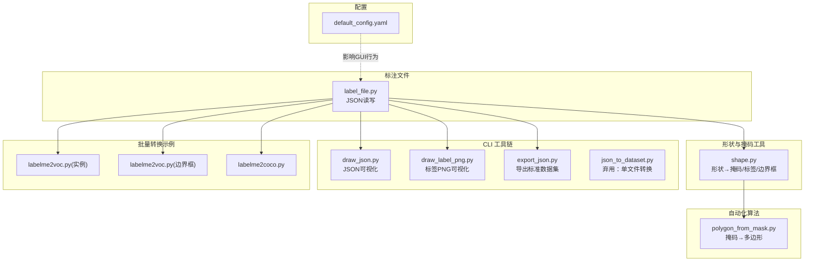
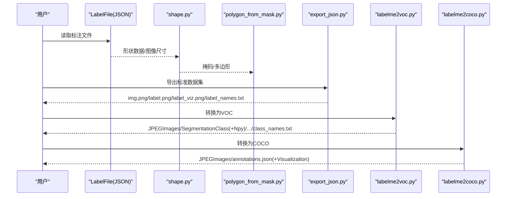
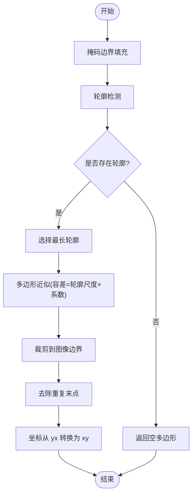
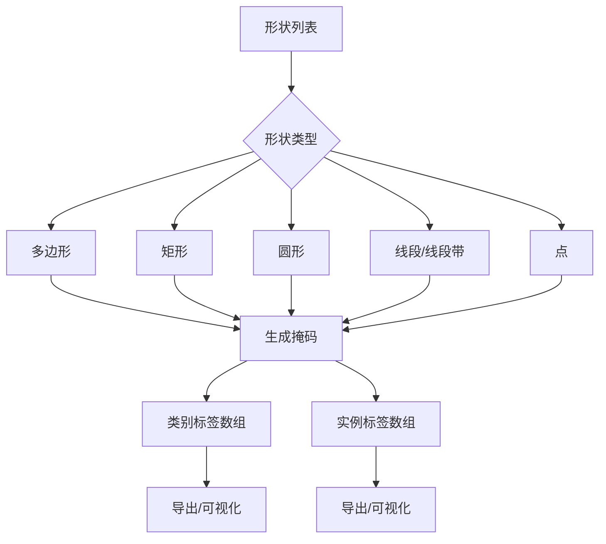
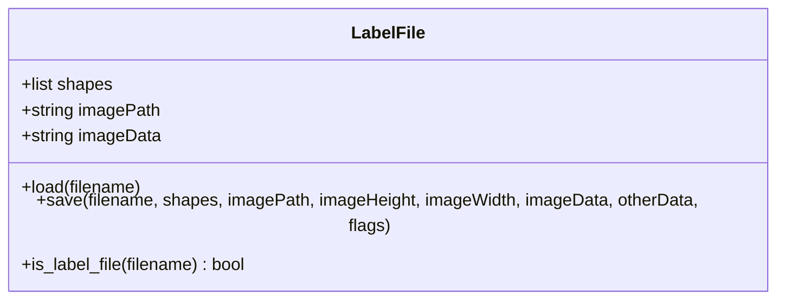
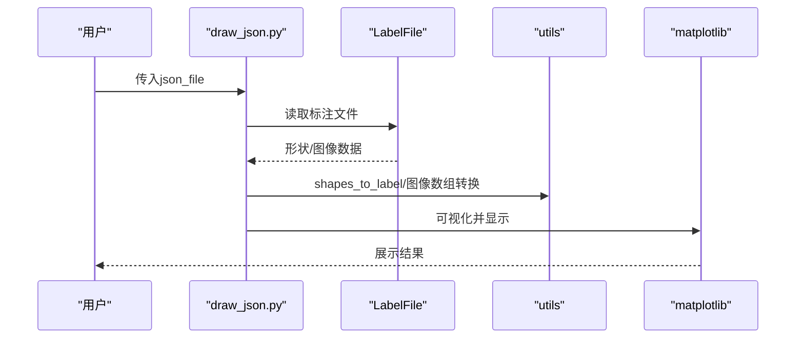
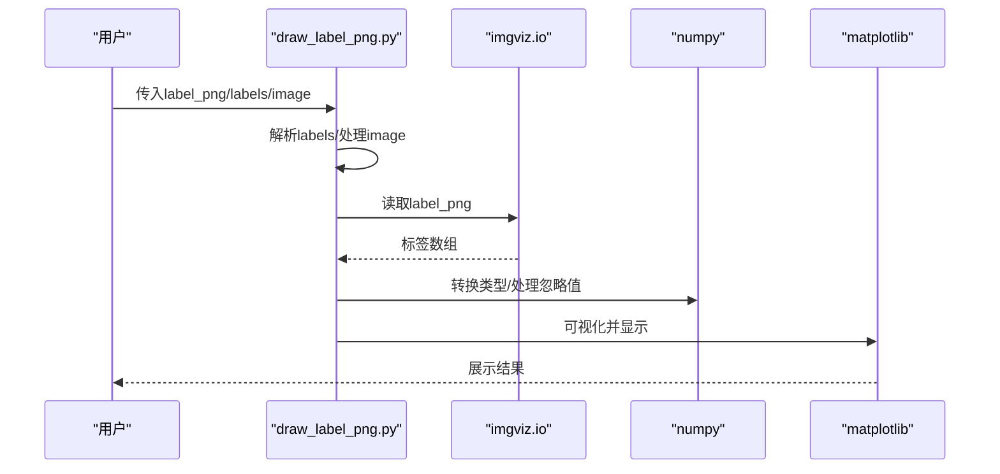
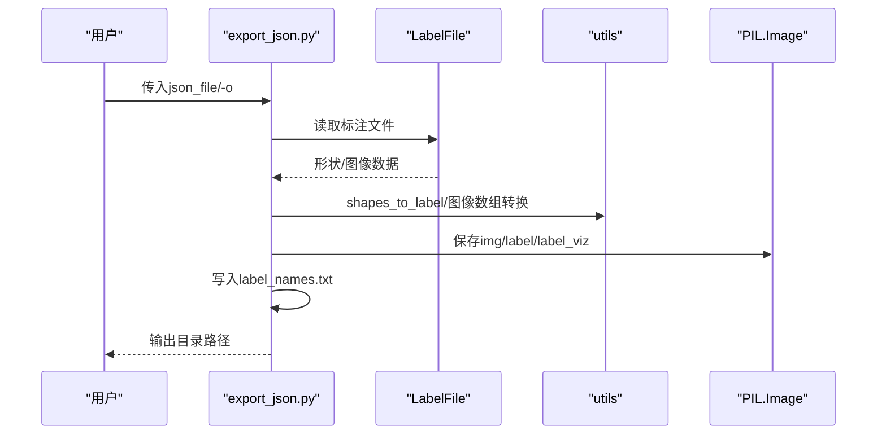
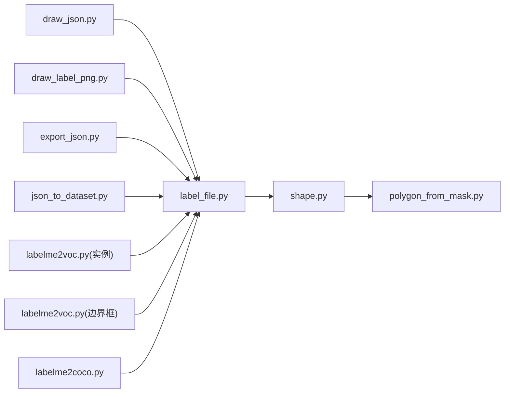

# 自动化工具集

<cite>
**本文引用的文件**
- [polygon_from_mask.py](file://labelme/_automation/polygon_from_mask.py)
- [draw_json.py](file://labelme/cli/draw_json.py)
- [draw_label_png.py](file://labelme/cli/draw_label_png.py)
- [json_to_dataset.py](file://labelme/cli/json_to_dataset.py)
- [export_json.py](file://labelme/cli/export_json.py)
- [shape.py](file://labelme/utils/shape.py)
- [label_file.py](file://labelme/label_file.py)
- [default_config.yaml](file://labelme/config/default_config.yaml)
- [labelme2voc.py（实例分割）](file://examples/instance_segmentation/labelme2voc.py)
- [labelme2voc.py（边界框检测）](file://examples/bbox_detection/labelme2voc.py)
- [labelme2coco.py](file://examples/instance_segmentation/labelme2coco.py)
- [README.md](file://README.md)
- [README.md（实例分割示例）](file://examples/instance_segmentation/README.md)
- [README.md（语义分割示例）](file://examples/semantic_segmentation/README.md)
- [README.md（边界框检测示例）](file://examples/bbox_detection/README.md)
</cite>

## 目录
1. [简介](#简介)
2. [项目结构](#项目结构)
3. [核心组件](#核心组件)
4. [架构总览](#架构总览)
5. [详细组件分析](#详细组件分析)
6. [依赖分析](#依赖分析)
7. [性能考虑](#性能考虑)
8. [故障排查指南](#故障排查指南)
9. [结论](#结论)
10. [附录](#附录)

## 简介
本文件面向自动化工具集的使用者与开发者，系统化阐述基于掩码的多边形生成算法与批量处理工具的实现原理，详解 CLI 工具链（draw_json.py、draw_label_png.py 等）的功能与用法，解释自动化批处理流程、数据转换管道与格式标准化机制，并提供配置项、参数设置、输出格式控制、最佳实践、性能优化与扩展开发指导。文档同时给出完整命令行示例与集成案例，帮助用户高效构建自动化标注与数据准备流水线。

## 项目结构
自动化工具集围绕“标注文件解析—形状到掩码—掩码到多边形—批量导出/可视化”的主干流程组织，核心模块分布如下：
- 自动化算法：基于掩码的多边形生成（polygon_from_mask.py）
- 形状与掩码工具：形状到掩码、形状到标签、掩码到边界框（shape.py）
- 标注文件读写：LabelFile（label_file.py）
- CLI 工具链：JSON 可视化、标签 PNG 可视化、JSON 导出、旧版单文件转换（draw_json.py、draw_label_png.py、export_json.py、json_to_dataset.py）
- 批量转换示例：VOC/COCO 格式转换（examples 下的 labelme2voc.py、labelme2coco.py）
- 默认配置：应用行为与快捷键等（default_config.yaml）

图表来源
- [polygon_from_mask.py:1-82](file://labelme/_automation/polygon_from_mask.py#L1-L82)
- [shape.py:1-233](file://labelme/utils/shape.py#L1-L233)
- [label_file.py:1-306](file://labelme/label_file.py#L1-L306)
- [draw_json.py:1-68](file://labelme/cli/draw_json.py#L1-L68)
- [draw_label_png.py:1-108](file://labelme/cli/draw_label_png.py#L1-L108)
- [export_json.py:1-90](file://labelme/cli/export_json.py#L1-L90)
- [json_to_dataset.py:1-101](file://labelme/cli/json_to_dataset.py#L1-L101)
- [labelme2voc.py（实例分割）:1-157](file://examples/instance_segmentation/labelme2voc.py#L1-L157)
- [labelme2voc.py（边界框检测）:1-147](file://examples/bbox_detection/labelme2voc.py#L1-L147)
- [labelme2coco.py:1-204](file://examples/instance_segmentation/labelme2coco.py#L1-L204)
- [default_config.yaml:1-147](file://labelme/config/default_config.yaml#L1-L147)

章节来源
- [README.md:1-262](file://README.md#L1-L262)

## 核心组件
- 基于掩码的多边形生成：从二值掩码检测轮廓、选择最长轮廓、多边形近似、裁剪与坐标格式转换，形成可用于标注的多边形顶点序列。
- 形状到掩码/标签：支持多边形、矩形、圆形、线段、点等多种形状类型，生成类别标签与实例标签；提供掩码到边界框转换。
- 标注文件读写：统一加载/保存 JSON 格式标注文件，处理图像数据编码与尺寸校验。
- CLI 工具链：JSON 可视化、标签 PNG 可视化、标准数据集导出、弃用的单文件转换脚本。
- 批量转换：VOC/COCO 格式转换，支持可视化与 NPY 文件生成。

章节来源
- [polygon_from_mask.py:32-82](file://labelme/_automation/polygon_from_mask.py#L32-L82)
- [shape.py:41-167](file://labelme/utils/shape.py#L41-L167)
- [label_file.py:103-193](file://labelme/label_file.py#L103-L193)
- [draw_json.py:16-64](file://labelme/cli/draw_json.py#L16-L64)
- [draw_label_png.py:14-104](file://labelme/cli/draw_label_png.py#L14-L104)
- [export_json.py:19-86](file://labelme/cli/export_json.py#L19-L86)
- [json_to_dataset.py:19-97](file://labelme/cli/json_to_dataset.py#L19-L97)
- [labelme2voc.py（实例分割）:17-154](file://examples/instance_segmentation/labelme2voc.py#L17-L154)
- [labelme2voc.py（边界框检测）:23-143](file://examples/bbox_detection/labelme2voc.py#L23-L143)
- [labelme2coco.py:25-199](file://examples/instance_segmentation/labelme2coco.py#L25-L199)

## 架构总览
自动化工具集的处理管线由“输入—转换—输出”三层构成：
- 输入层：JSON 标注文件（LabelFile）、标签 PNG、原始图像
- 转换层：形状→掩码→多边形；形状→类别/实例标签；掩码→边界框；批量格式转换（VOC/COCO）
- 输出层：可视化图像、标签 PNG、Numpy 数组、XML/JSON 标注文件

图表来源
- [label_file.py:103-193](file://labelme/label_file.py#L103-L193)
- [shape.py:113-167](file://labelme/utils/shape.py#L113-L167)
- [polygon_from_mask.py:32-82](file://labelme/_automation/polygon_from_mask.py#L32-L82)
- [export_json.py:19-86](file://labelme/cli/export_json.py#L19-L86)
- [labelme2voc.py（实例分割）:17-154](file://examples/instance_segmentation/labelme2voc.py#L17-L154)
- [labelme2coco.py:25-199](file://examples/instance_segmentation/labelme2coco.py#L25-L199)

## 详细组件分析

### 基于掩码的多边形生成算法
- 功能概述：从二值掩码检测轮廓，选择最长轮廓，使用近似算法得到多边形顶点，裁剪至图像范围并转换坐标格式。
- 关键流程：
  - 轮廓检测：对掩码进行边界填充后检测轮廓集合
  - 轮廓选择：计算各轮廓长度，选取最长者
  - 多边形近似：按容差阈值（与轮廓尺度相关）进行简化
  - 坐标处理：裁剪到图像边界、去除重复末点、坐标从 yx 转换为 xy
- 复杂度与性能：轮廓检测与近似复杂度与轮廓长度线性相关；容差设置影响多边形顶点数量与拟合精度。

图表来源
- [polygon_from_mask.py:44-81](file://labelme/_automation/polygon_from_mask.py#L44-L81)

章节来源
- [polygon_from_mask.py:12-82](file://labelme/_automation/polygon_from_mask.py#L12-L82)

### 形状到掩码/标签与掩码到边界框
- 形状到掩码：支持多边形、矩形、圆形、线段、线段带、点等类型，生成布尔掩码。
- 形状到标签：将多个形状映射为类别标签数组与实例标签数组，实例 ID 基于 group_id 或 UUID 分配。
- 掩码到边界框：将三维掩码数组转换为边界框坐标集合。
- 性能与健壮性：类型校验与断言保证输入合法性；对圆形/矩形等几何形状进行精确绘制。

图表来源
- [shape.py:41-167](file://labelme/utils/shape.py#L41-L167)

章节来源
- [shape.py:21-233](file://labelme/utils/shape.py#L21-L233)

### 标注文件读写（LabelFile）
- 加载：解析 JSON，解码图像数据，校验图像尺寸，处理形状字段（含 mask 字段）。
- 保存：构建标准 JSON 结构，支持 flags、otherData 等扩展字段。
- 异常处理：统一的 LabelFileError，便于批处理时捕获与定位。

图表来源
- [label_file.py:42-306](file://labelme/label_file.py#L42-L306)

章节来源
- [label_file.py:103-193](file://labelme/label_file.py#L103-L193)

### CLI 工具链

#### draw_json.py：JSON 标注可视化
- 功能：读取 JSON 标注文件，生成类别标签数组与可视化图像，显示原始图像与叠加可视化结果。
- 参数：json_file（必填）
- 输出：双子图显示原始图像与标签可视化。

图表来源
- [draw_json.py:16-64](file://labelme/cli/draw_json.py#L16-L64)
- [label_file.py:103-193](file://labelme/label_file.py#L103-L193)

章节来源
- [draw_json.py:16-64](file://labelme/cli/draw_json.py#L16-L64)

#### draw_label_png.py：标签 PNG 可视化
- 功能：读取标签 PNG，可选叠加原始图像，打印标签值统计，支持标签名称列表（文件或命令行）。
- 参数：label_png（必填）、--labels（逗号分隔或文件）、--image（可选）
- 输出：单列或双列子图，显示标签可视化与可选叠加图。

图表来源
- [draw_label_png.py:14-104](file://labelme/cli/draw_label_png.py#L14-L104)

章节来源
- [draw_label_png.py:14-104](file://labelme/cli/draw_label_png.py#L14-L104)

#### export_json.py：标准数据集导出
- 功能：将单个 JSON 标注文件导出为标准数据集格式，包含原始图像、标签 PNG、可视化 PNG 与标签名称文件。
- 参数：json_file（必填）、-o/--out（输出目录）
- 输出：img.png、label.png、label_viz.png、label_names.txt

图表来源
- [export_json.py:19-86](file://labelme/cli/export_json.py#L19-L86)
- [label_file.py:103-193](file://labelme/label_file.py#L103-L193)

章节来源
- [export_json.py:19-86](file://labelme/cli/export_json.py#L19-L86)

#### json_to_dataset.py：弃用的单文件转换
- 功能：演示将单个 JSON 转换单图像数据集，现已弃用，建议使用 export_json.py。
- 参数：json_file（必填）、-o/--out（输出目录）
- 输出：与 export_json.py 类似，但包含弃用警告。

章节来源
- [json_to_dataset.py:19-97](file://labelme/cli/json_to_dataset.py#L19-L97)

### 批量转换与格式标准化

#### VOC 格式转换（实例分割）
- 功能：批量将 JSON 转换为 VOC 格式，生成 JPEGImages、SegmentationClass/Instance 及其 NPY/可视化目录，输出 class_names.txt。
- 参数：input_dir、output_dir、--labels（文件或逗号分隔）、--noobject、--nonpy、--noviz
- 输出：图像、类别标签、实例标签、可视化、标签名称文件

章节来源
- [labelme2voc.py（实例分割）:17-154](file://examples/instance_segmentation/labelme2voc.py#L17-L154)

#### VOC 格式转换（边界框检测）
- 功能：批量将 JSON 转换为 VOC 检测格式，生成 JPEGImages、Annotations 及可视化目录，输出 class_names.txt。
- 参数：input_dir、output_dir、--labels（必填）、--noviz
- 输出：图像、XML 注释、可视化

章节来源
- [labelme2voc.py（边界框检测）:23-143](file://examples/bbox_detection/labelme2voc.py#L23-L143)

#### COCO 格式转换
- 功能：批量将 JSON 转换为 COCO 格式，生成 JPEGImages 与 annotations.json，可选可视化。
- 参数：input_dir、output_dir、--labels（必填）、--noviz
- 输出：图像、COCO 注释 JSON、可视化

章节来源
- [labelme2coco.py:25-199](file://examples/instance_segmentation/labelme2coco.py#L25-L199)

## 依赖分析
- 组件耦合与内聚：CLI 工具链与 LabelFile/shape.py 高内聚，分别负责输入解析与形状/掩码转换；批量转换脚本依赖 CLI 工具链的底层能力。
- 外部依赖：imgviz、matplotlib、numpy、PIL、loguru、skimage（轮廓检测与近似）、lxml（VOC XML）、pycocotools（COCO 编码）。
- 潜在循环依赖：未发现直接循环导入；CLI 与示例脚本通过 LabelFile 间接耦合。

图表来源
- [draw_json.py:8-9](file://labelme/cli/draw_json.py#L8-L9)
- [draw_label_png.py:4-7](file://labelme/cli/draw_label_png.py#L4-L7)
- [export_json.py:11-12](file://labelme/cli/export_json.py#L11-L12)
- [json_to_dataset.py:11-12](file://labelme/cli/json_to_dataset.py#L11-L12)
- [labelme2voc.py（实例分割）:14-14](file://examples/instance_segmentation/labelme2voc.py#L14-L14)
- [labelme2voc.py（边界框检测）:13-13](file://examples/bbox_detection/labelme2voc.py#L13-L13)
- [labelme2coco.py:16-16](file://examples/instance_segmentation/labelme2coco.py#L16-L16)
- [label_file.py:10-11](file://labelme/label_file.py#L10-L11)
- [shape.py:14-18](file://labelme/utils/shape.py#L14-L18)
- [polygon_from_mask.py:1-5](file://labelme/_automation/polygon_from_mask.py#L1-L5)

章节来源
- [label_file.py:103-193](file://labelme/label_file.py#L103-L193)
- [shape.py:113-167](file://labelme/utils/shape.py#L113-L167)
- [polygon_from_mask.py:44-62](file://labelme/_automation/polygon_from_mask.py#L44-L62)

## 性能考虑
- 多边形近似容差：通过轮廓尺度乘以固定系数控制简化程度，平衡精度与顶点数量。
- 轮廓检测与近似：复杂度与轮廓长度线性相关；对大图建议先降采样或分块处理。
- 批量转换：glob 遍历与逐文件处理，I/O 成本较高；建议并行化（注意文件锁与磁盘吞吐）。
- 可视化：label2rgb/instances2rgb 为 CPU 密集型；可减少字体大小、禁用可视化以加速。
- 标签数组写入：PIL 保存与 numpy 保存为 I/O 密集型；建议使用 SSD 与合适的缓存策略。

## 故障排查指南
- 导入错误与环境问题：确认自动化模块导入路径、翻译文件存在性、配置文件编码（UTF-8 without BOM）。
- AI 功能依赖：osam 模块非必需，缺失时系统优雅降级。
- 图像尺寸不一致：LabelFile 在保存/加载时会校验并修正尺寸，若仍报错需检查图像数据编码。
- 标签 PNG 255 处理：工具将 255 视为忽略区域（-1），确保标签命名与映射一致。
- 批量转换输出缺失：确认输出目录权限、labels 文件路径与内容格式。

章节来源
- [README.md:81-123](file://README.md#L81-L123)
- [label_file.py:194-223](file://labelme/label_file.py#L194-L223)
- [draw_label_png.py:52-56](file://labelme/cli/draw_label_png.py#L52-L56)

## 结论
本自动化工具集通过“掩码→多边形”“形状→标签/掩码”“JSON→VOC/COCO”的完整链路，为标注数据的自动化处理与格式标准化提供了坚实基础。结合 CLI 工具与示例脚本，用户可快速搭建从标注到训练数据的流水线；通过合理配置与性能优化，可在大规模数据场景下稳定高效地运行。

## 附录

### CLI 工具链与命令行示例
- JSON 可视化
  - 命令：python -m labelme.cli.draw_json <json_file>
  - 用途：查看标注结果与标签可视化
- 标签 PNG 可视化
  - 命令：python -m labelme.cli.draw_label_png <label_png> [--labels <labels>] [--image <image>]
  - 用途：查看标签 PNG 并可叠加原始图像
- 标准数据集导出
  - 命令：python -m labelme.cli.export_json <json_file> [-o <out_dir>]
  - 用途：导出 img.png、label.png、label_viz.png、label_names.txt
- 弃用的单文件转换
  - 命令：python -m labelme.cli.json_to_dataset <json_file> [-o <out_dir>]
  - 用途：演示单文件转换（建议改用 export_json.py）
- VOC 格式转换（实例分割）
  - 命令：python examples/instance_segmentation/labelme2voc.py <input_dir> <output_dir> --labels <labels> [--noobject] [--nonpy] [--noviz]
  - 用途：生成类别/实例标签与可视化
- VOC 格式转换（边界框检测）
  - 命令：python examples/bbox_detection/labelme2voc.py <input_dir> <output_dir> --labels <labels> [--noviz]
  - 用途：生成检测用 XML 注释
- COCO 格式转换
  - 命令：python examples/instance_segmentation/labelme2coco.py <input_dir> <output_dir> --labels <labels> [--noviz]
  - 用途：生成 COCO annotations.json

章节来源
- [draw_json.py:16-25](file://labelme/cli/draw_json.py#L16-L25)
- [draw_label_png.py:21-32](file://labelme/cli/draw_label_png.py#L21-L32)
- [export_json.py:26-30](file://labelme/cli/export_json.py#L26-L30)
- [json_to_dataset.py:37-41](file://labelme/cli/json_to_dataset.py#L37-L41)
- [labelme2voc.py（实例分割）:17-35](file://examples/instance_segmentation/labelme2voc.py#L17-L35)
- [labelme2voc.py（边界框检测）:23-31](file://examples/bbox_detection/labelme2voc.py#L23-L31)
- [labelme2coco.py:25-33](file://examples/instance_segmentation/labelme2coco.py#L25-L33)

### 配置选项与参数设置
- 默认配置（default_config.yaml）
  - 基本功能：auto_save、display_label_popup、store_data、logger_level 等
  - 标签与标志：labels、flags、validate_label、sort_labels 等
  - 颜色与形状样式：默认颜色、选择/悬停颜色、点大小等
  - AI 功能：default 模型
  - 快捷键：文件操作、导航、缩放、绘图工具等
- CLI 工具参数
  - draw_json.py：json_file（必填）
  - draw_label_png.py：label_png（必填）、--labels、--image
  - export_json.py：json_file（必填）、-o/--out
  - json_to_dataset.py：json_file（必填）、-o/--out
  - 批量转换：--labels（必填）、--noobject、--nonpy、--noviz

章节来源
- [default_config.yaml:4-147](file://labelme/config/default_config.yaml#L4-L147)
- [draw_json.py:22-25](file://labelme/cli/draw_json.py#L22-L25)
- [draw_label_png.py:21-32](file://labelme/cli/draw_label_png.py#L21-L32)
- [export_json.py:26-30](file://labelme/cli/export_json.py#L26-L30)
- [json_to_dataset.py:37-41](file://labelme/cli/json_to_dataset.py#L37-L41)
- [labelme2voc.py（实例分割）:17-35](file://examples/instance_segmentation/labelme2voc.py#L17-L35)
- [labelme2voc.py（边界框检测）:23-31](file://examples/bbox_detection/labelme2voc.py#L23-L31)
- [labelme2coco.py:25-33](file://examples/instance_segmentation/labelme2coco.py#L25-L33)

### 输出格式控制
- 标准数据集导出：img.png、label.png、label_viz.png、label_names.txt
- VOC：JPEGImages、SegmentationClass/ClassNpy/ClassVisualization、SegmentationObject/ObjectNpy/ObjectVisualization、class_names.txt
- COCO：JPEGImages、annotations.json（可选 Visualization）
- 标签 PNG：255 表示忽略区域（内部映射为 -1）

章节来源
- [export_json.py:75-84](file://labelme/cli/export_json.py#L75-L84)
- [labelme2voc.py（实例分割）:80-153](file://examples/instance_segmentation/labelme2voc.py#L80-L153)
- [labelme2voc.py（边界框检测）:62-143](file://examples/bbox_detection/labelme2voc.py#L62-L143)
- [labelme2coco.py:90-199](file://examples/instance_segmentation/labelme2coco.py#L90-L199)

### 自动化工作流最佳实践
- 数据准备阶段
  - 使用 export_json.py 生成标准数据集，便于后续训练与验证
  - 对大图先降采样或分块，减少内存与 I/O 压力
- 批处理阶段
  - 使用 glob 与并行策略（注意磁盘与文件锁）批量转换
  - 控制可视化开关（--noviz）以提升速度
- 质量控制
  - 通过 draw_label_png.py 检查标签 PNG 的标签值与覆盖范围
  - 通过 draw_json.py 校验标注与可视化一致性
- 扩展开发
  - 新增形状类型：在 shape.py 的 shape_to_mask 中扩展
  - 新增格式转换：参考 labelme2voc.py 与 labelme2coco.py 的结构
  - 新增 CLI 工具：遵循 argparse 与 logging 规范，复用 LabelFile/shape.py

### 集成案例
- 从标注到 VOC 的完整流程
  - 步骤：标注 JSON → export_json.py → VOC 转换 → 可视化核对
  - 命令参考：见“CLI 工具链与命令行示例”
- 从标注到 COCO 的完整流程
  - 步骤：标注 JSON → COCO 转换 → 可视化核对
  - 命令参考：见“CLI 工具链与命令行示例”

章节来源
- [README.md（实例分割示例）:12-49](file://examples/instance_segmentation/README.md#L12-L49)
- [README.md（语义分割示例）:12-36](file://examples/semantic_segmentation/README.md#L12-L36)
- [README.md（边界框检测示例）:13-21](file://examples/bbox_detection/README.md#L13-L21)