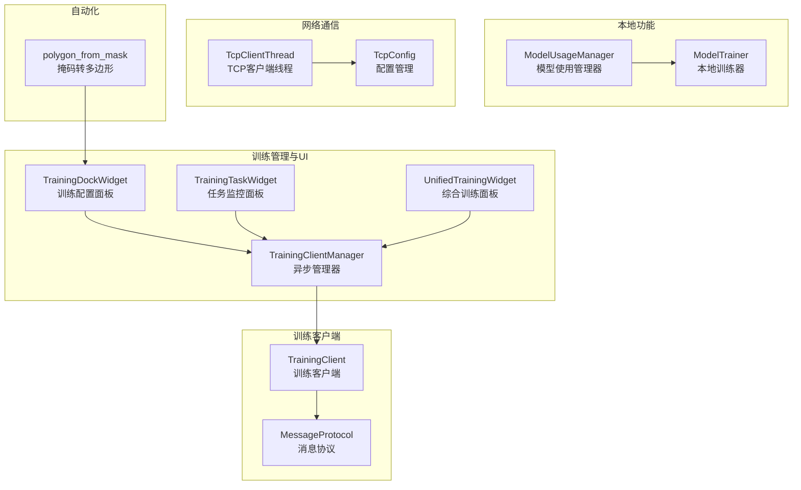
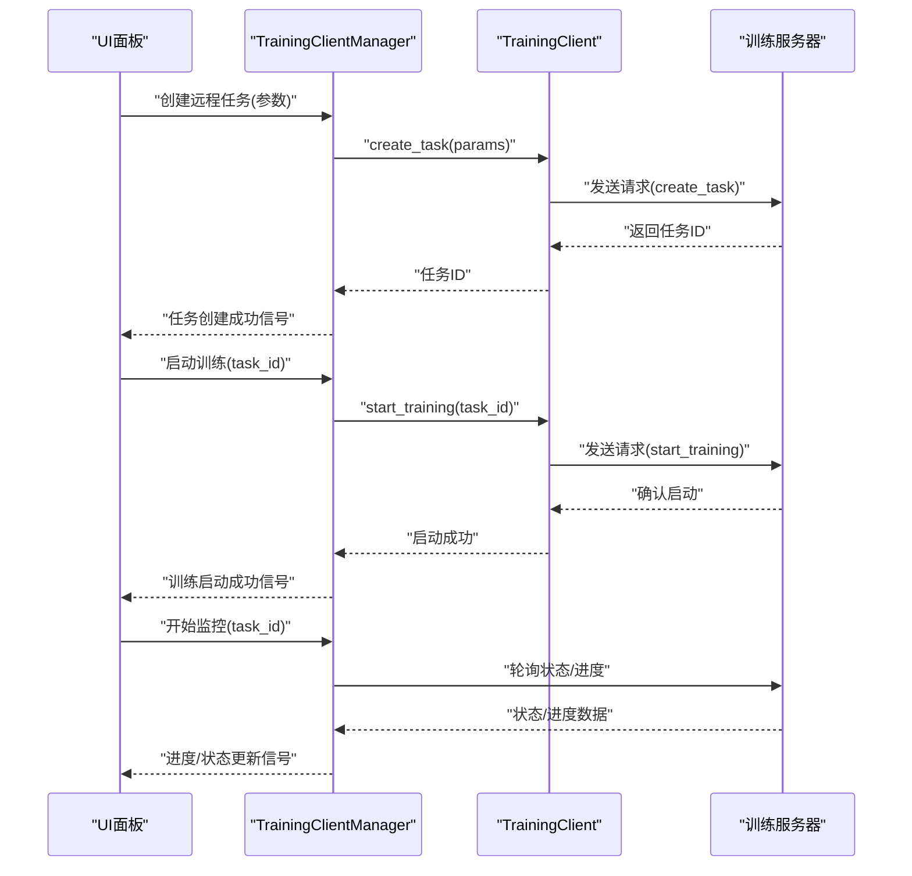
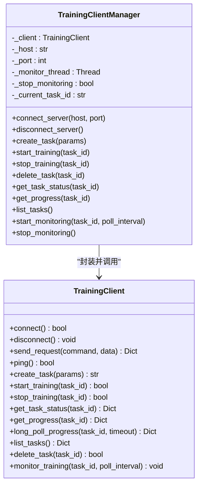
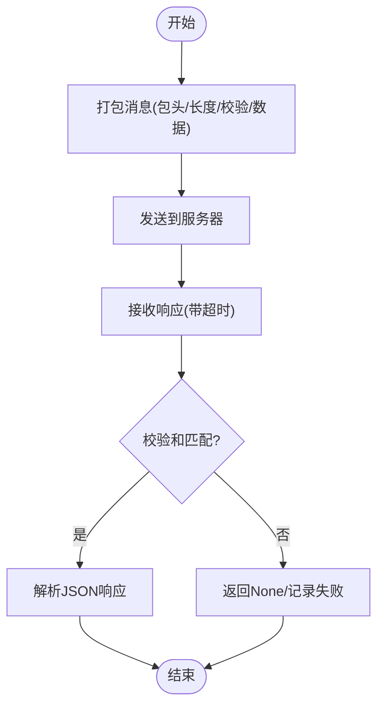
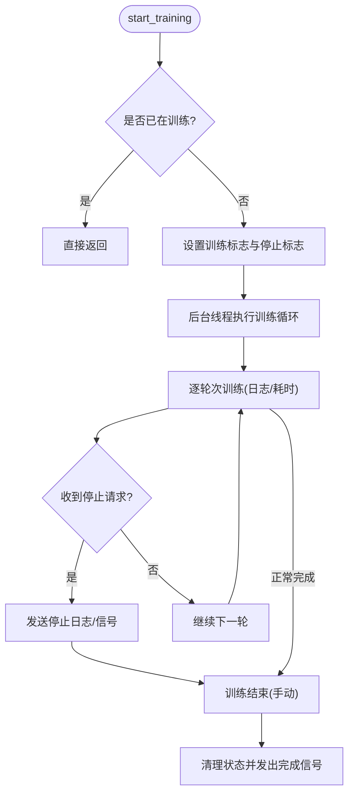
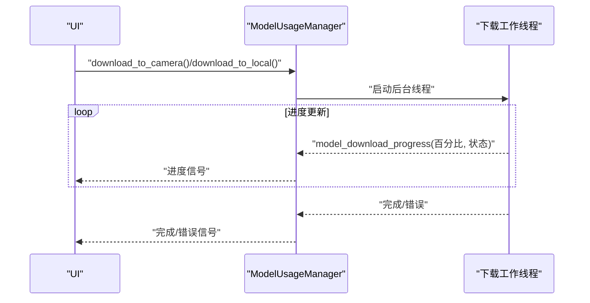
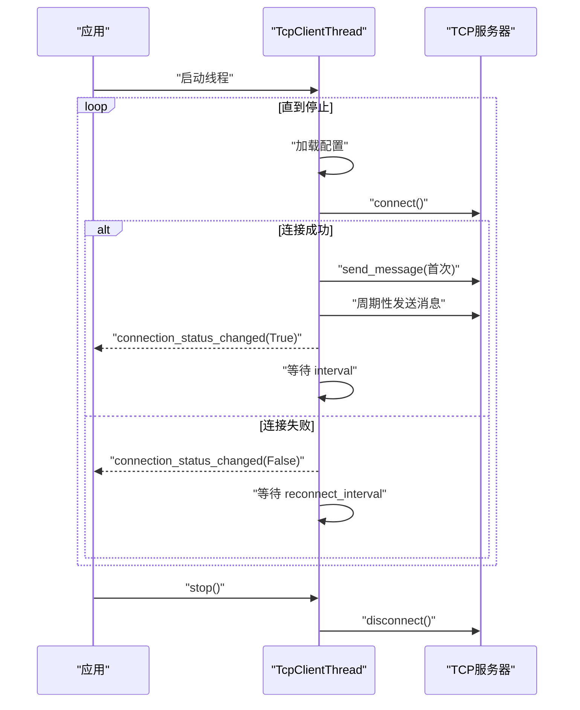
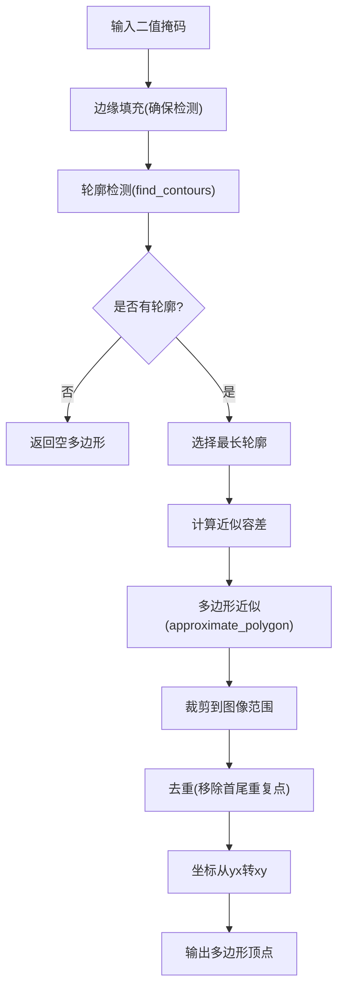
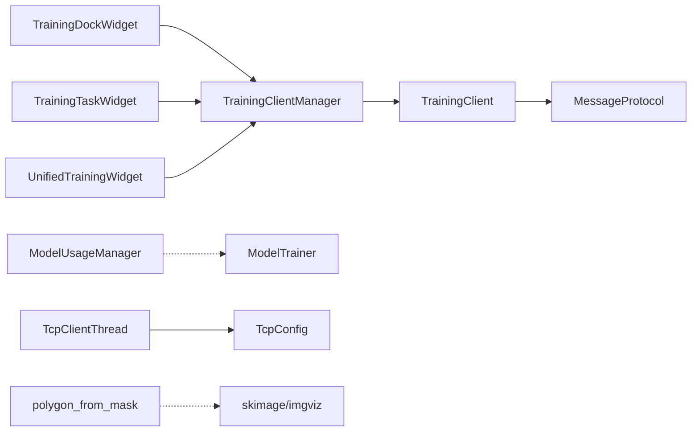

# 高级功能

<cite>
**本文档引用的文件**
- [training_client_manager.py](file://labelme/training_client_manager.py)
- [training_client.py](file://training_client/training_client.py)
- [model_training.py](file://model_training.py)
- [model_usage.py](file://model_usage.py)
- [tcp_client.py](file://labelme/tcp_client.py)
- [tcp_config.py](file://labelme/tcp_config.py)
- [polygon_from_mask.py](file://labelme/_automation/polygon_from_mask.py)
- [training_dock_widget.py](file://labelme/widgets/training_dock_widget.py)
- [training_task_widget.py](file://labelme/widgets/training_task_widget.py)
- [unified_training_widget.py](file://labelme/widgets/unified_training_widget.py)
- [default_config.yaml](file://labelme/config/default_config.yaml)
</cite>

## 目录
1. [简介](#简介)
2. [项目结构](#项目结构)
3. [核心组件](#核心组件)
4. [架构总览](#架构总览)
5. [详细组件分析](#详细组件分析)
6. [依赖关系分析](#依赖关系分析)
7. [性能考虑](#性能考虑)
8. [故障排除指南](#故障排除指南)
9. [结论](#结论)
10. [附录](#附录)

## 简介
本文件面向希望深入使用和扩展 labelme 高级功能的开发者，重点覆盖以下方面：
- AI 模型集成机制：如何在 UI 中配置训练参数并通过管理器发起远程训练任务。
- 远程训练功能：基于 TCP 的训练客户端与 Qt 信号/槽的异步管理器，实现任务创建、启动、停止、进度监控与错误处理。
- 网络通信系统：TCP 客户端线程封装、消息协议与配置管理，支持自动重连与心跳。
- 模型使用管理：多设备支持（智能相机/本地电脑）、下载进度监控与版本信息展示。
- 自动化功能模块：基于掩码的多边形生成，支持批量处理场景下的 AI 辅助标注。
- 高级配置与性能优化：配置项解读、异步线程与信号机制、错误处理策略与扩展开发建议。

## 项目结构
围绕高级功能的关键模块分布如下：
- 训练管理与 UI 集成：training_client_manager.py（Qt 异步管理器）、training_dock_widget.py（训练配置面板）、training_task_widget.py（任务监控面板）、unified_training_widget.py（综合训练面板）
- 训练客户端与协议：training_client.py（训练服务通信）、MessageProtocol（消息打包/解包）
- 本地模型训练与使用：model_training.py（本地训练器）、model_usage.py（模型下载与信息）
- 网络通信：tcp_client.py（TCP 客户端线程）、tcp_config.py（配置加载/保存）
- 自动化标注：polygon_from_mask.py（掩码到多边形）
- 配置：default_config.yaml（应用配置）

**图表来源**
- [training_client_manager.py:32-474](file://labelme/training_client_manager.py#L32-L474)
- [training_client.py:96-800](file://training_client/training_client.py#L96-L800)
- [training_dock_widget.py:96-663](file://labelme/widgets/training_dock_widget.py#L96-L663)
- [training_task_widget.py:21-741](file://labelme/widgets/training_task_widget.py#L21-L741)
- [unified_training_widget.py:104-1040](file://labelme/widgets/unified_training_widget.py#L104-L1040)
- [model_training.py:25-124](file://model_training.py#L25-L124)
- [model_usage.py:13-103](file://model_usage.py#L13-L103)
- [tcp_client.py:16-198](file://labelme/tcp_client.py#L16-L198)
- [tcp_config.py:14-107](file://labelme/tcp_config.py#L14-L107)
- [polygon_from_mask.py:32-82](file://labelme/_automation/polygon_from_mask.py#L32-L82)

**章节来源**
- [training_client_manager.py:1-474](file://labelme/training_client_manager.py#L1-L474)
- [training_client.py:1-1393](file://training_client/training_client.py#L1-L1393)
- [training_dock_widget.py:1-663](file://labelme/widgets/training_dock_widget.py#L1-L663)
- [training_task_widget.py:1-741](file://labelme/widgets/training_task_widget.py#L1-L741)
- [unified_training_widget.py:1-1040](file://labelme/widgets/unified_training_widget.py#L1-L1040)
- [model_training.py:1-124](file://model_training.py#L1-L124)
- [model_usage.py:1-103](file://model_usage.py#L1-L103)
- [tcp_client.py:1-198](file://labelme/tcp_client.py#L1-L198)
- [tcp_config.py:1-107](file://labelme/tcp_config.py#L1-L107)
- [polygon_from_mask.py:1-82](file://labelme/_automation/polygon_from_mask.py#L1-L82)
- [default_config.yaml:1-147](file://labelme/config/default_config.yaml#L1-L147)

## 核心组件
- 训练客户端管理器（TrainingClientManager）
  - 提供 Qt 信号/槽风格的异步接口，封装底层 TrainingClient 的网络调用。
  - 支持连接管理、任务创建、训练启停、进度与状态监控、任务列表查询与删除。
  - 内置监控线程，按轮询间隔获取任务状态与进度，自动停止条件为任务完成/失败/停止。
- 训练客户端（TrainingClient）
  - 基于 TCP 的客户端，内置 MessageProtocol 实现自定义消息打包与校验。
  - 提供 ping、create_task、start_training、stop_training、get_task_status、get_progress、long_poll_progress、list_tasks、delete_task 等方法。
- 本地模型训练器（ModelTrainer）
  - 基于 Qt 的异步训练器，通过信号向 UI 上报日志、完成与错误。
  - 支持停止请求标志，优雅退出训练循环。
- 模型使用管理器（ModelUsageManager）
  - 支持模型下载到智能相机/本地电脑，提供下载进度与错误信号。
  - 提供当前模型信息展示与取消下载能力。
- TCP 客户端线程（TcpClientThread）
  - 在后台线程中连接服务器、周期性发送消息、自动重连与连接状态信号。
  - 支持配置加载、超时处理与异常捕获。
- 掩码到多边形（polygon_from_mask）
  - 基于 skimage 的轮廓检测与多边形近似，输出可用于标注的多边形顶点序列。
- 训练配置面板（TrainingDockWidget）
  - 提供训练参数收集与远程训练按钮触发，连接到管理器并更新 UI 状态。
- 训练任务面板（TrainingTaskWidget）
  - 展示任务列表、状态与进度，提供连接、刷新、启动/停止、删除等操作。
- 综合训练面板（UnifiedTrainingWidget）
  - 将训练配置、任务管理和进度监控整合到一个面板中，提供一体化的训练管理体验。
- 应用配置（default_config.yaml）
  - 包含 AI 模型默认选择、跨功能开关与快捷键等配置项。

**章节来源**
- [training_client_manager.py:32-474](file://labelme/training_client_manager.py#L32-L474)
- [training_client.py:96-800](file://training_client/training_client.py#L96-L800)
- [model_training.py:25-124](file://model_training.py#L25-L124)
- [model_usage.py:13-103](file://model_usage.py#L13-L103)
- [tcp_client.py:16-198](file://labelme/tcp_client.py#L16-L198)
- [polygon_from_mask.py:32-82](file://labelme/_automation/polygon_from_mask.py#L32-L82)
- [training_dock_widget.py:96-663](file://labelme/widgets/training_dock_widget.py#L96-L663)
- [training_task_widget.py:21-741](file://labelme/widgets/training_task_widget.py#L21-L741)
- [unified_training_widget.py:104-1040](file://labelme/widgets/unified_training_widget.py#L104-L1040)
- [default_config.yaml:42-44](file://labelme/config/default_config.yaml#L42-L44)

## 架构总览
整体架构采用"UI 面板 + 异步管理器 + 训练客户端 + 协议层"的分层设计，保证 UI 不被阻塞且具备完善的错误处理与进度反馈。

**图表来源**
- [training_client_manager.py:156-207](file://labelme/training_client_manager.py#L156-L207)
- [training_client.py:175-234](file://training_client/training_client.py#L175-L234)

## 详细组件分析

### 训练客户端管理器（TrainingClientManager）
- 异步接口：所有网络操作在后台线程执行，避免阻塞 UI。
- 信号体系：connected、task_created、training_started、progress_updated、status_changed、error_occurred、log_message 等。
- 监控机制：start_monitoring 内部维护轮询线程，根据任务状态自动停止。
- 错误处理：统一捕获异常并通过 error_occurred 与 log_message 通知 UI。

**图表来源**
- [training_client_manager.py:32-474](file://labelme/training_client_manager.py#L32-L474)
- [training_client.py:96-800](file://training_client/training_client.py#L96-L800)

**章节来源**
- [training_client_manager.py:32-474](file://labelme/training_client_manager.py#L32-L474)

### 训练客户端（TrainingClient）与消息协议
- MessageProtocol：固定包头、长度与校验和，确保消息可靠传输。
- 命令集：ping、create_task、start_training、stop_training、get_task_status、get_progress、long_poll_progress、list_tasks、delete_task。
- 轮询监控：monitor_training 循环获取状态与进度，达到总轮次时结束。

**图表来源**
- [training_client.py:13-94](file://training_client/training_client.py#L13-L94)
- [training_client.py:127-165](file://training_client/training_client.py#L127-L165)

**章节来源**
- [training_client.py:13-94](file://training_client/training_client.py#L13-L94)
- [training_client.py:127-800](file://training_client/training_client.py#L127-L800)

### 本地模型训练器（ModelTrainer）
- 异步训练：守护线程执行训练循环，支持外部停止请求。
- 信号驱动：training_started、training_log_updated、training_finished、training_error。
- 停止机制：通过 _stop_requested 标志在下一轮迭代检测并优雅退出。

**图表来源**
- [model_training.py:59-124](file://model_training.py#L59-L124)

**章节来源**
- [model_training.py:25-124](file://model_training.py#L25-L124)

### 模型使用管理器（ModelUsageManager）
- 多设备支持：download_to_camera、download_to_local 分别针对智能相机与本地电脑。
- 下载进度：通过 model_download_progress 信号上报百分比与状态文本。
- 版本与信息：get_current_model_info 返回当前模型元信息；update_model_info_display 触发 UI 更新。

**图表来源**
- [model_usage.py:46-103](file://model_usage.py#L46-L103)

**章节来源**
- [model_usage.py:13-103](file://model_usage.py#L13-L103)

### TCP 客户端线程（TcpClientThread）
- 自动重连：连接失败后按 reconnect_interval 等待重试。
- 周期发送：按配置的 interval 发送 message，连接成功后立即发送一次避免状态不同步。
- 线程安全：run 循环内检查 _running 与 _connected，支持 stop() 清理资源。

**图表来源**
- [tcp_client.py:149-198](file://labelme/tcp_client.py#L149-L198)
- [tcp_config.py:40-78](file://labelme/tcp_config.py#L40-L78)

**章节来源**
- [tcp_client.py:16-198](file://labelme/tcp_client.py#L16-L198)
- [tcp_config.py:14-107](file://labelme/tcp_config.py#L14-L107)

### 掩码到多边形（polygon_from_mask）
- 轮廓检测：使用 skimage.measure.find_contours 检测掩码轮廓。
- 多边形近似：approximate_polygon 结合容差生成简化多边形。
- 坐标转换：将 yx 坐标系转换为 xy，裁剪至图像范围并去除重复点。

**图表来源**
- [polygon_from_mask.py:32-82](file://labelme/_automation/polygon_from_mask.py#L32-L82)

**章节来源**
- [polygon_from_mask.py:1-82](file://labelme/_automation/polygon_from_mask.py#L1-L82)

### 训练配置面板（TrainingDockWidget）
- 参数映射：将 UI 选择映射为训练参数字典（模型类型、图像尺寸、轮次、批次、学习率、训练集比例等）。
- 信号触发：创建远程任务、启动/停止训练等操作通过信号与管理器交互。
- 状态更新：根据管理器信号更新按钮可用性与状态标签。

**章节来源**
- [training_dock_widget.py:96-663](file://labelme/widgets/training_dock_widget.py#L96-L663)

### 训练任务面板（TrainingTaskWidget）
- 服务器连接：支持手动输入主机与端口，连接成功后启用刷新与操作按钮。
- 任务列表：展示任务ID、状态、进度、模型类型与创建时间，支持删除、启动/停止。
- 实时监控：当前任务进度与状态通过信号更新，日志输出支持清空。

**章节来源**
- [training_task_widget.py:21-741](file://labelme/widgets/training_task_widget.py#L21-L741)

### 综合训练面板（UnifiedTrainingWidget）
- 功能整合：将训练配置、任务管理、进度监控和日志输出整合到一个面板中。
- 用户体验：提供一体化的训练管理界面，减少窗口切换。
- 信号处理：统一处理来自管理器的各种信号，更新多个 UI 组件的状态。

**章节来源**
- [unified_training_widget.py:104-1040](file://labelme/widgets/unified_training_widget.py#L104-L1040)

## 依赖关系分析
- TrainingClientManager 依赖 TrainingClient，负责异步封装与信号转发。
- TrainingClient 依赖 MessageProtocol 与 socket，负责网络通信与协议处理。
- UI 面板（TrainingDockWidget、TrainingTaskWidget、UnifiedTrainingWidget）依赖 TrainingClientManager 的信号进行状态同步。
- ModelUsageManager 与 ModelTrainer 独立于网络层，分别负责模型下载与本地训练。
- TcpClientThread 依赖 TcpConfig，负责配置加载与自动重连。
- polygon_from_mask 依赖 skimage 与 imgviz，用于自动化标注。

**图表来源**
- [training_client_manager.py:28-29](file://labelme/training_client_manager.py#L28-L29)
- [training_client.py:12-12](file://training_client/training_client.py#L12-L12)
- [tcp_client.py:13-13](file://labelme/tcp_client.py#L13-L13)
- [polygon_from_mask.py:1-1](file://labelme/_automation/polygon_from_mask.py#L1-L1)

**章节来源**
- [training_client_manager.py:28-29](file://labelme/training_client_manager.py#L28-L29)
- [training_client.py:12-12](file://training_client/training_client.py#L12-L12)
- [tcp_client.py:13-13](file://labelme/tcp_client.py#L13-L13)
- [polygon_from_mask.py:1-1](file://labelme/_automation/polygon_from_mask.py#L1-L1)

## 性能考虑
- 异步与线程隔离：所有网络与训练操作在后台线程执行，避免 UI 阻塞。
- 轮询间隔权衡：训练监控轮询间隔过短会增加网络与 CPU 压力，过长则影响实时性。建议根据任务规模与网络状况调整。
- 消息协议可靠性：校验和与超时机制提升传输稳定性，建议在高延迟/不稳定网络下适当增大超时时间。
- UI 更新频率：日志与进度更新应适度节流，避免频繁重绘造成卡顿。
- 自动化标注：多边形近似容差与轮廓检测参数需结合具体场景平衡精度与性能。
- 综合面板优化：UnifiedTrainingWidget 通过统一的信号处理机制，减少了重复的 UI 更新操作。

## 故障排除指南
- 连接失败
  - 检查主机与端口配置，确认服务器可达。
  - 查看 TcpClientThread 的连接状态信号与错误日志。
- 训练任务无响应
  - 确认管理器已连接，尝试重新连接并刷新任务列表。
  - 检查服务器端是否正确处理命令与返回数据。
- 下载中断或失败
  - 检查 ModelUsageManager 的错误信号与进度回调，确认目标设备可用。
- 自动化标注结果异常
  - 调整 polygon_from_mask 的容差参数，确保掩码预处理正确。
- 综合面板功能异常
  - 检查 UnifiedTrainingWidget 的信号连接，确认与管理器的绑定正确。

**章节来源**
- [tcp_client.py:85-96](file://labelme/tcp_client.py#L85-L96)
- [training_client_manager.py:130-142](file://labelme/training_client_manager.py#L130-L142)
- [model_usage.py:89-92](file://model_usage.py#L89-L92)
- [polygon_from_mask.py:58-62](file://labelme/_automation/polygon_from_mask.py#L58-L62)

## 结论
本项目通过 Qt 信号/槽与后台线程实现了稳定的异步训练管理与网络通信，配合 UI 面板提供直观的操作体验。AI 模型集成、远程训练、模型使用管理与自动化标注模块共同构成了完整的高级功能体系。新增的 UnifiedTrainingWidget 提供了一体化的训练管理体验，进一步提升了用户效率。建议在生产环境中合理设置轮询间隔与超时参数，完善错误处理与日志记录，以获得更佳的稳定性与用户体验。

## 附录
- 高级配置项参考
  - AI 模型默认选择：default_config.yaml 中 ai.default 指定默认 AI 模型名称。
  - 画布与快捷键：crosshair、shortcuts 等配置项可按需调整。
- 扩展开发建议
  - 新增训练参数：在 TrainingDockWidget 中扩展参数收集逻辑，并映射到管理器的 create_task 参数。
  - 自定义消息协议：可在 MessageProtocol 基础上扩展命令类型与数据结构。
  - 新增设备下载：在 ModelUsageManager 中扩展目标设备枚举与下载流程。
  - 自动化标注增强：结合 polygon_from_mask 与 UI 事件，实现批量处理与自动标注流程。
  - 统一面板扩展：在 UnifiedTrainingWidget 中添加新的功能模块，保持一致的用户体验。

**章节来源**
- [default_config.yaml:42-44](file://labelme/config/default_config.yaml#L42-L44)
- [training_dock_widget.py:440-491](file://labelme/widgets/training_dock_widget.py#L440-L491)
- [training_client.py:127-272](file://training_client/training_client.py#L127-L272)
- [model_usage.py:46-103](file://model_usage.py#L46-L103)
- [polygon_from_mask.py:32-82](file://labelme/_automation/polygon_from_mask.py#L32-L82)
- [unified_training_widget.py:104-1040](file://labelme/widgets/unified_training_widget.py#L104-L1040)