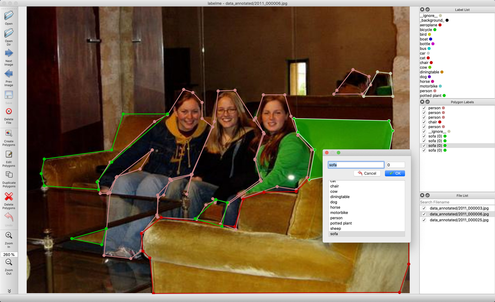
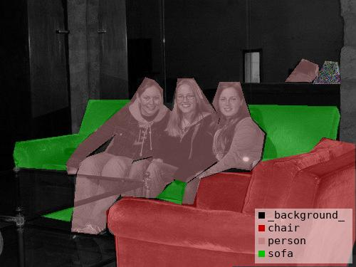
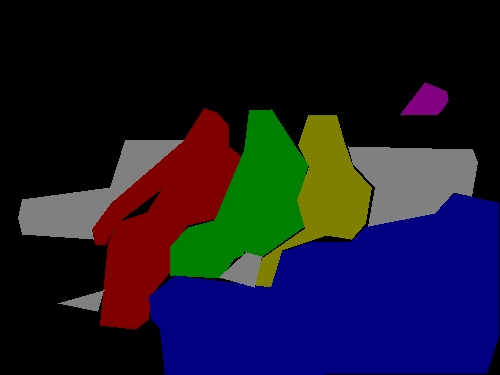
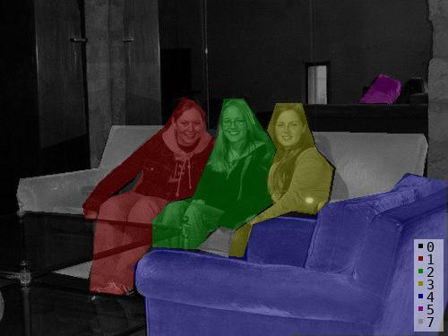
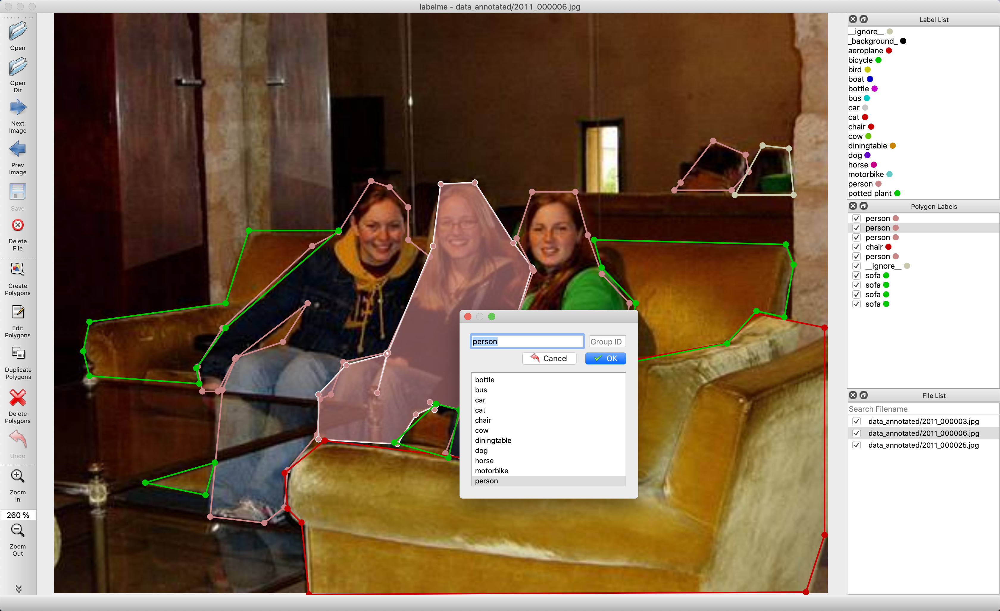
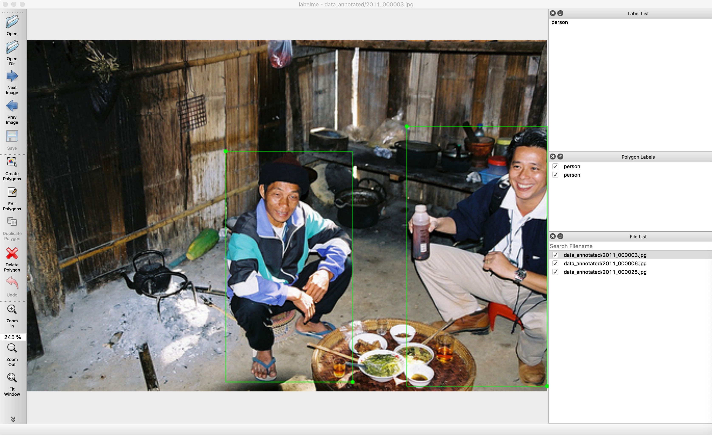
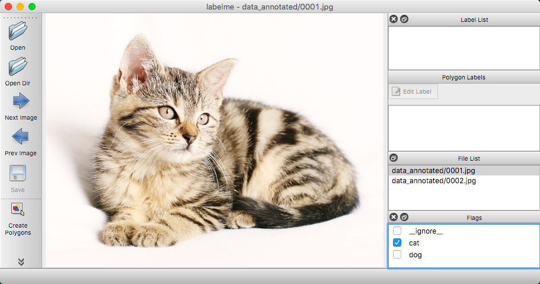

# Labelme - 图像多边形标注工具

<h1 align="center">
  <br/>labelme
</h1>

<h4 align="center">
  基于Python的图像多边形标注工具
</h4>

<div align="center">
  <a href="https://pypi.python.org/pypi/labelme"></a>
  <a href="https://github.com/wkentaro/labelme/actions"></a>
</div>

<div align="center">
  <a href="#安装"><b>安装</b></a>
  | <a href="#使用方法"><b>使用方法</b></a>
  | <a href="#功能特性"><b>功能特性</b></a>
  | <a href="#示例"><b>示例</b></a>
</div>

<br/>

<div align="center">
  
</div>

## 简介

Labelme 是一个受 <http://labelme.csail.mit.edu> 启发的图形化图像标注工具。  
它使用 Python 编写，基于 Qt 构建图形界面。

      
<i>VOC 数据集实例分割示例。</i>

    
<i>其他示例（语义分割、边界框检测和分类）。</i>

    
<i>各种标注类型（多边形、矩形、圆形、线条和点）。</i>

## 功能特性

- [x] 支持多边形、矩形、圆形、线条和点的图像标注。([教程](examples/tutorial))
- [x] 支持图像标志标注，用于分类和清理。([#166](https://github.com/wkentaro/labelme/pull/166))
- [x] 支持视频标注。([视频标注](examples/video_annotation))
- [x] 支持 GUI 自定义（预定义标签/标志、自动保存、标签验证等）。([#144](https://github.com/wkentaro/labelme/pull/144))
- [x] 支持导出 VOC 格式数据集用于语义/实例分割。([语义分割](examples/semantic_segmentation), [实例分割](examples/instance_segmentation))
- [x] 支持导出 COCO 格式数据集用于实例分割。([实例分割](examples/instance_segmentation))

## 安装

Labelme 提供 3 种安装方式：

### 方式一：使用 pip 安装（推荐）

详细安装说明请查看 ["使用 Pip 安装 Labelme"](https://www.labelme.io/docs/install-labelme-pip)。

```bash
pip install labelme
# 或者从本地目录安装
pip install .
```

### 方式二：使用独立可执行文件（最简单）

如果您希望获得最简单的安装体验，无需任何依赖（Python、Qt），
可以从 ["将 Labelme 作为应用安装"](https://www.labelme.io/docs/install-labelme-app) 下载独立可执行文件。

这是一次性付费，终身使用，同时帮助我们维护这个项目。

### 方式三：使用 Linux 发行版的包管理器

在某些 Linux 发行版中，您可以通过包管理器（如 apt、pacman）安装 labelme。以下是当前支持的系统：

[](https://repology.org/project/labelme/versions)

## 常见问题修复

### 导入错误问题

如果遇到 `ModuleNotFoundError: No module named 'labelme'` 错误，请按以下步骤修复：

1. **检查自动化模块导入路径**:
   ```bash
   # 确保 labelme/_automation/__init__.py 中使用绝对路径导入
   from labelme._automation.bbox_from_text import get_bboxes_from_texts
   ```

2. **检查翻译文件**:
   ```bash
   # 确保 labelme/translate/empty.ts 文件存在且扩展名正确
   ls labelme/translate/empty.ts
   ```

3. **检查配置文件编码**:
   ```bash
   # 确保 labelme/config/default_config.yaml 使用 UTF-8 without BOM 编码
   # 可以用记事本重新保存为 UTF-8 格式
   ```

4. **处理可选依赖**:
   - Labelme 的 AI 功能依赖 `osam` 模块，但该模块不是必需的
   - 如果 `osam` 模块缺失，Labelme 会优雅降级，不影响基本标注功能
   - 可以通过条件导入避免导入错误

### AI 功能安装和使用

Labelme 支持基于文本提示的 AI 智能标注功能，需要安装 `osam` 模块：

#### 安装 osam 模块

```bash
pip install osam
```

#### 验证安装

```bash
python -c "import osam; print('osam版本:', osam.__version__)"
```

#### AI 标注功能

1. **启动 Labelme** 并打开图像
2. **在 AI 提示框中输入文本**（如：`person,car,bicycle`）
3. **点击 Submit 按钮** 进行 AI 标注
4. **系统会自动检测图像中的对象** 并生成边界框标注

#### 支持的 AI 模型

- **YOLO World**: 基于文本提示的目标检测
- **Segment Anything (SAM)**: 通用图像分割
- **EfficientSAM**: 轻量级分割模型

#### 常见问题解决

**问题**: `TypeError: Cannot handle this data type: (1, 1, 1), |u1`
**解决方案**: 
- 确保图像尺寸足够大（至少 10x10 像素）
- 确保图像是 RGB 格式（3 通道）
- 系统已自动添加图像预处理功能，会自动处理各种异常情况

#### AI 功能特性

- **智能目标检测**: 根据文本提示自动识别图像中的对象
- **非极大值抑制**: 自动过滤重叠的检测框
- **多模型支持**: 支持多种先进的 AI 模型
- **图像预处理**: 自动处理各种图像格式和尺寸问题
- **错误恢复**: 即使 AI 模型不可用，也不会影响基本标注功能

### 防止多次启动功能

Labelme 现在支持防止多次启动的功能，使用共享内存技术确保同一时间只能运行一个实例。

#### 功能特性

- **共享内存锁**: 使用进程间通信技术实现可靠的实例检测
- **自动清理**: 程序退出时自动清理共享内存，防止资源泄漏
- **僵尸进程检测**: 自动检测和清理僵尸进程的共享内存
- **跨平台支持**: 支持 Windows、Linux、macOS 等主流操作系统
- **优雅降级**: 当共享内存不可用时，允许程序正常启动
- **友好提示**: 当检测到已有实例运行时，显示清晰的警告消息

#### 使用方法

1. **正常启动**: `python -m labelme`
2. **重复启动检测**: 当尝试启动第二个实例时，会显示警告对话框并自动退出
3. **关闭后重新启动**: 关闭第一个实例后，可以正常启动新的实例

#### 故障排除

**问题**: 程序显示"已有实例运行"但实际没有
**解决方案**: 系统会自动检测并清理僵尸进程的共享内存，如果问题持续，可以重启系统或手动清理共享内存

**问题**: 共享内存不可用
**解决方案**: 功能会优雅降级，允许启动多个实例，不影响基本功能使用

### 测试安装

安装完成后，可以通过以下命令测试 Labelme 是否正常工作：

```bash
# 测试基本导入
python -c "import labelme; print('Labelme import successful!')"

# 测试命令行帮助
python -m labelme --help

# 启动 Labelme
python -m labelme
```

如果遇到问题，请参考 [修复总结.md](修复总结.md) 文件获取详细的故障排除指南。

## 使用方法

运行 `labelme --help` 查看详细帮助信息。  
标注结果将保存为 [JSON](http://www.json.org/) 文件格式。

```bash
labelme  # 仅打开图形界面

# 教程（单张图像示例）
cd examples/tutorial
labelme apc2016_obj3.jpg  # 指定图像文件
labelme apc2016_obj3.jpg -O apc2016_obj3.json  # 保存后关闭窗口
labelme apc2016_obj3.jpg --nodata  # JSON 文件中不包含图像数据，只保存相对路径
labelme apc2016_obj3.jpg \
  --labels highland_6539_self_stick_notes,mead_index_cards,kong_air_dog_squeakair_tennis_ball  # 指定标签列表

# 语义分割示例
cd examples/semantic_segmentation
labelme data_annotated/  # 打开目录标注其中的所有图像
labelme data_annotated/ --labels labels.txt  # 使用文件指定标签列表
```

### 命令行参数说明

- `--output` 指定标注文件的保存位置。如果位置以 .json 结尾，单个标注将被写入此文件。如果指定了以 .json 结尾的位置，则只能标注一张图像。如果位置不以 .json 结尾，程序将假设它是一个目录。标注将存储在此目录中，文件名对应于进行标注的图像名称。
- 首次运行 labelme 时，它将在 `~/.labelmerc` 创建一个配置文件。您可以编辑此文件，更改将在下次启动 labelme 时应用。如果您希望使用其他位置的配置文件，可以使用 `--config` 标志指定此文件。
- 如果没有 `--nosortlabels` 标志，程序将按字母顺序列出标签。当程序运行此标志时，它将按提供的顺序显示标签。
- 标志分配给整个图像。[示例](examples/classification)
- 标签分配给单个多边形。[示例](examples/bbox_detection)

### 常见问题

- **如何将 JSON 文件转换为 numpy 数组？** 请参阅 [examples/tutorial](examples/tutorial#convert-to-dataset)。
- **如何加载标签 PNG 文件？** 请参阅 [examples/tutorial](examples/tutorial#how-to-load-label-png-file)。
- **如何获取语义分割的标注？** 请参阅 [examples/semantic_segmentation](examples/semantic_segmentation)。
- **如何获取实例分割的标注？** 请参阅 [examples/instance_segmentation](examples/instance_segmentation)。

## 示例

* [图像分类](examples/classification)
* [边界框检测](examples/bbox_detection)
* [语义分割](examples/semantic_segmentation)
* [实例分割](examples/instance_segmentation)
* [视频标注](examples/video_annotation)

## 如何构建独立可执行文件

```bash
LABELME_PATH=./labelme
OSAM_PATH=$(python -c 'import os, osam; print(os.path.dirname(osam.__file__))')
pyinstaller labelme/labelme/__main__.py \
  --name=Labelme \
  --windowed \
  --noconfirm \
  --specpath=build \
  --add-data=$(OSAM_PATH)/_models/yoloworld/clip/bpe_simple_vocab_16e6.txt.gz:osam/_models/yoloworld/clip \
  --add-data=$(LABELME_PATH)/config/default_config.yaml:labelme/config \
  --add-data=$(LABELME_PATH)/icons/*:labelme/icons \
  --add-data=$(LABELME_PATH)/translate/*:translate \
  --icon=$(LABELME_PATH)/icons/icon.png \
  --onedir
```

## 致谢

本仓库是 [mpitid/pylabelme](https://github.com/mpitid/pylabelme) 的分支。